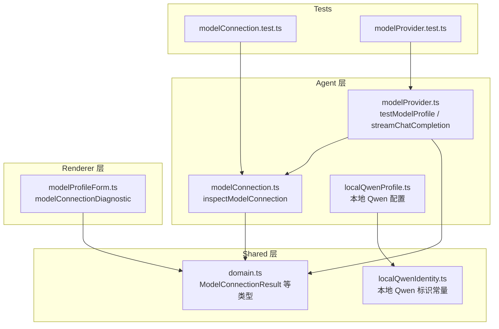
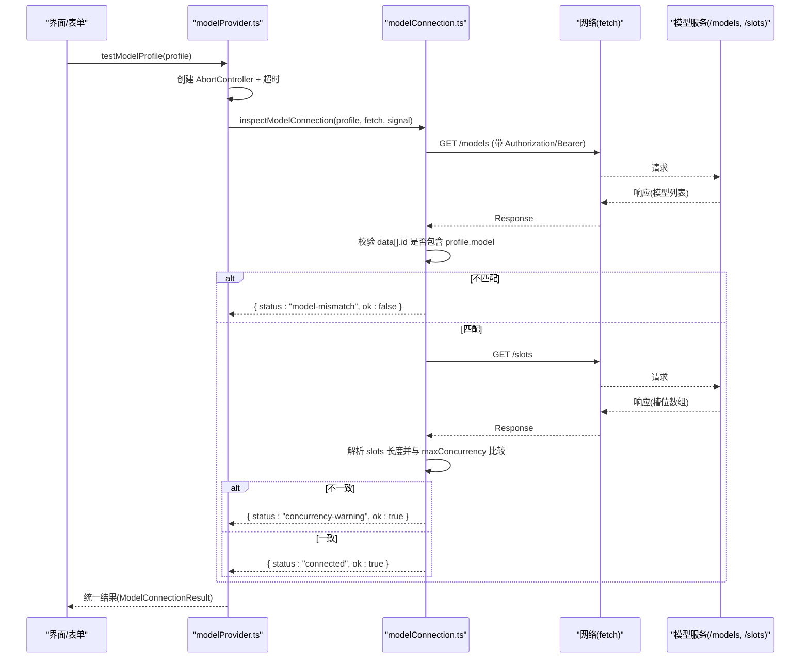
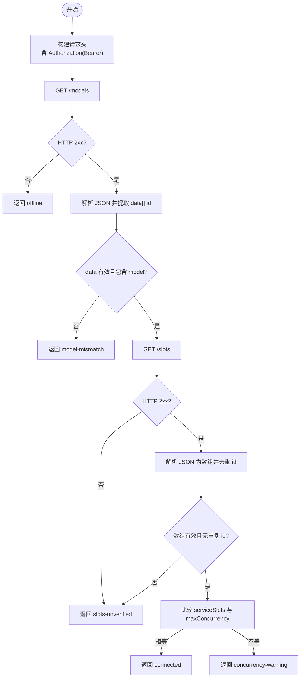
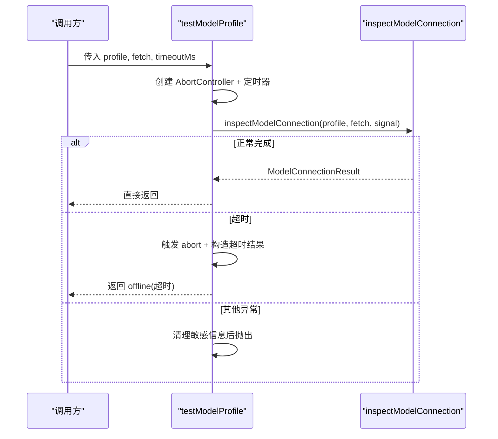
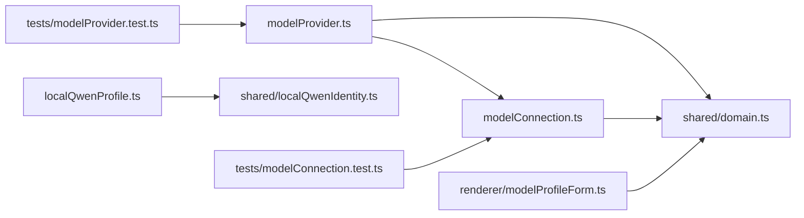

# 连接管理

<cite>
**本文引用的文件**
- [src/agent/modelConnection.ts](file://src/agent/modelConnection.ts)
- [src/agent/modelProvider.ts](file://src/agent/modelProvider.ts)
- [src/shared/domain.ts](file://src/shared/domain.ts)
- [src/agent/localQwenProfile.ts](file://src/agent/localQwenProfile.ts)
- [src/shared/localQwenIdentity.ts](file://src/shared/localQwenIdentity.ts)
- [src/renderer/modelProfileForm.ts](file://src/renderer/modelProfileForm.ts)
- [tests/modelConnection.test.ts](file://tests/modelConnection.test.ts)
- [tests/modelProvider.test.ts](file://tests/modelProvider.test.ts)
</cite>

## 目录
1. [简介](#简介)
2. [项目结构](#项目结构)
3. [核心组件](#核心组件)
4. [架构总览](#架构总览)
5. [详细组件分析](#详细组件分析)
6. [依赖关系分析](#依赖关系分析)
7. [性能考量](#性能考量)
8. [故障排查指南](#故障排查指南)
9. [结论](#结论)
10. [附录：示例与最佳实践](#附录示例与最佳实践)

## 简介
本文件围绕模型连接管理展开，重点解释以下能力：
- inspectModelConnection 函数的实现：连接测试流程、认证验证、网络连通性检查。
- testModelProfile 函数的工作机制：超时控制、错误处理、结果格式化。
- 连接状态管理机制：基于服务端 slots 的并发校验、健康检查语义与“未验证”降级策略。
- 不同提供商的连接协议差异：OpenAI 兼容 API 与本地 Qwen 模型的特定实现。
- 使用示例：如何测试模型连接、处理连接失败、实现自定义连接逻辑。
- 连接优化最佳实践与常见问题排查。

## 项目结构
与连接管理相关的代码主要分布在 agent 层（连接检测与调用）、shared 层（类型定义）以及 renderer 层（诊断信息展示）。测试覆盖关键路径与边界条件。

图表来源
- [src/agent/modelProvider.ts:535-561](file://src/agent/modelProvider.ts#L535-L561)
- [src/agent/modelConnection.ts:11-91](file://src/agent/modelConnection.ts#L11-L91)
- [src/shared/domain.ts:194-236](file://src/shared/domain.ts#L194-L236)
- [src/agent/localQwenProfile.ts:13-25](file://src/agent/localQwenProfile.ts#L13-L25)
- [src/shared/localQwenIdentity.ts:1-21](file://src/shared/localQwenIdentity.ts#L1-L21)
- [src/renderer/modelProfileForm.ts:73-103](file://src/renderer/modelProfileForm.ts#L73-L103)
- [tests/modelConnection.test.ts:23-257](file://tests/modelConnection.test.ts#L23-L257)
- [tests/modelProvider.test.ts:129-162](file://tests/modelProvider.test.ts#L129-L162)

章节来源
- [src/agent/modelProvider.ts:535-561](file://src/agent/modelProvider.ts#L535-L561)
- [src/agent/modelConnection.ts:11-91](file://src/agent/modelConnection.ts#L11-L91)
- [src/shared/domain.ts:194-236](file://src/shared/domain.ts#L194-L236)
- [src/agent/localQwenProfile.ts:13-25](file://src/agent/localQwenProfile.ts#L13-L25)
- [src/shared/localQwenIdentity.ts:1-21](file://src/shared/localQwenIdentity.ts#L1-L21)
- [src/renderer/modelProfileForm.ts:73-103](file://src/renderer/modelProfileForm.ts#L73-L103)
- [tests/modelConnection.test.ts:23-257](file://tests/modelConnection.test.ts#L23-L257)
- [tests/modelProvider.test.ts:129-162](file://tests/modelProvider.test.ts#L129-L162)

## 核心组件
- inspectModelConnection：对模型端点进行连通性与一致性检查，并尝试读取服务端的 slots 以验证并发能力。
- testModelProfile：为 inspectModelConnection 提供超时控制与错误封装，返回统一的 ModelConnectionResult。
- domain 类型：统一描述连接成功/失败的状态与字段，如 connected、concurrency-warning、slots-unverified、offline、model-mismatch。
- localQwenProfile/localQwenIdentity：定义本地 Qwen 的默认配置与识别逻辑。
- modelProfileForm.modelConnectionDiagnostic：将连接结果转换为面向用户的诊断文案。

章节来源
- [src/agent/modelConnection.ts:11-91](file://src/agent/modelConnection.ts#L11-L91)
- [src/agent/modelProvider.ts:535-561](file://src/agent/modelProvider.ts#L535-L561)
- [src/shared/domain.ts:194-236](file://src/shared/domain.ts#L194-L236)
- [src/agent/localQwenProfile.ts:13-25](file://src/agent/localQwenProfile.ts#L13-L25)
- [src/shared/localQwenIdentity.ts:1-21](file://src/shared/localQwenIdentity.ts#L1-L21)
- [src/renderer/modelProfileForm.ts:73-103](file://src/renderer/modelProfileForm.ts#L73-L103)

## 架构总览
连接测试的整体流程如下：
- 上层通过 testModelProfile 发起带超时的连接测试。
- 内部调用 inspectModelConnection 执行两步探测：
  - 访问 /models 接口，校验返回的模型列表是否包含配置的 model。
  - 访问 /slots 接口，解析服务槽数量并与客户端 maxConcurrency 对比。
- 根据结果返回不同的 ModelConnectionResult 状态。
- 渲染层将结果翻译为用户可读的诊断消息。

图表来源
- [src/agent/modelProvider.ts:535-561](file://src/agent/modelProvider.ts#L535-L561)
- [src/agent/modelConnection.ts:11-91](file://src/agent/modelConnection.ts#L11-L91)
- [src/shared/domain.ts:194-236](file://src/shared/domain.ts#L194-L236)

## 详细组件分析

### inspectModelConnection：连接测试流程、认证与网络检查
- 认证：若 profile.apiKey 存在，则自动在请求头添加 Authorization: Bearer <key>。
- 网络连通性：
  - 先请求 /models，要求返回结构为 { data: [{ id: string }, ...] }，且必须包含配置的 model。
  - 再请求 /slots，要求返回数组，元素具备唯一 id（字符串或整数），用于统计服务槽数。
- 并发校验：将服务槽数与服务端期望的 maxConcurrency 对比，给出 connected 或 concurrency-warning。
- 健壮性：
  - 任何阶段遇到网络异常、HTTP 非 2xx、JSON 解析失败、数据结构不符，均降级为 slots-unverified 或 offline。
  - 支持 AbortSignal 取消；在多个 await 点显式检查信号，确保及时中断。
- 安全：错误消息不包含敏感信息（如 apiKey）。

图表来源
- [src/agent/modelConnection.ts:11-91](file://src/agent/modelConnection.ts#L11-L91)
- [src/agent/modelConnection.ts:93-115](file://src/agent/modelConnection.ts#L93-L115)
- [src/agent/modelConnection.ts:149-170](file://src/agent/modelConnection.ts#L149-L170)

章节来源
- [src/agent/modelConnection.ts:11-91](file://src/agent/modelConnection.ts#L11-L91)
- [src/agent/modelConnection.ts:93-115](file://src/agent/modelConnection.ts#L93-L115)
- [src/agent/modelConnection.ts:149-170](file://src/agent/modelConnection.ts#L149-L170)

### testModelProfile：超时控制、错误处理与结果格式化
- 超时控制：使用 AbortController 与 setTimeout 组合，超过 DEFAULT_CONNECTION_TEST_TIMEOUT_MS（默认 10 秒）即中止并返回 offline 类型的超时结果。
- 错误处理：捕获 inspectModelConnection 抛出的异常，若非超时，则通过 safeErrorText 清理敏感信息后抛出。
- 结果格式化：统一返回 ModelConnectionResult，包含 message、model、clientConcurrency 等字段，便于上层统一处理。

图表来源
- [src/agent/modelProvider.ts:535-561](file://src/agent/modelProvider.ts#L535-L561)
- [src/agent/modelProvider.ts:40-45](file://src/agent/modelProvider.ts#L40-L45)

章节来源
- [src/agent/modelProvider.ts:535-561](file://src/agent/modelProvider.ts#L535-L561)
- [src/agent/modelProvider.ts:40-45](file://src/agent/modelProvider.ts#L40-L45)

### 连接状态管理与健康检查
- 健康检查语义：
  - connected：模型可用且服务槽数与客户端并发一致。
  - concurrency-warning：模型可用但服务槽数与客户端并发不一致，提示潜在拥塞风险。
  - slots-unverified：模型可用但无法验证服务槽数（接口不可用/格式不符），仍视为可用但需谨慎。
  - offline：模型端点不可达或返回不可用。
  - model-mismatch：服务端未声明配置的 model，配置可能错误。
- 健康检查频率建议：
  - 在用户切换模型或保存配置时触发一次。
  - 在应用启动或进入聊天页时做一次预热检查。
  - 长会话中可周期性重试 slots 检查，避免长时间运行后服务容量变化未被感知。
- 故障转移策略：
  - 当前实现未内置多实例轮询或主备切换。可在上层根据 result.status 选择备用 profile（例如切换到另一个 baseUrl 或 provider）。
  - 对于 slots-unverified，可结合业务策略决定是否继续发送请求。

章节来源
- [src/shared/domain.ts:194-236](file://src/shared/domain.ts#L194-L236)
- [src/agent/modelConnection.ts:11-91](file://src/agent/modelConnection.ts#L11-L91)

### 不同模型提供商的连接协议差异
- OpenAI 兼容 API：
  - 使用标准 /models 与 /chat/completions 接口。
  - 鉴权方式：Authorization: Bearer <apiKey>。
  - 并发能力通过 /slots 暴露（由服务端决定）。
- 本地 Qwen 模型：
  - 默认 baseUrl 与 model 由 localQwenIdentity 提供，provider 标记为 openai-compatible。
  - 同样遵循 /models 与 /slots 约定，便于复用同一套连接检测逻辑。
  - 可通过 isLegacyLocalQwenPlaceholder 识别占位配置，引导用户填写真实模型名。

章节来源
- [src/agent/localQwenProfile.ts:13-25](file://src/agent/localQwenProfile.ts#L13-L25)
- [src/shared/localQwenIdentity.ts:1-21](file://src/shared/localQwenIdentity.ts#L1-L21)
- [src/agent/modelProvider.ts:762-795](file://src/agent/modelProvider.ts#L762-L795)

## 依赖关系分析
- modelProvider 依赖 modelConnection 进行连接探测，并依赖 shared 中的类型定义。
- modelConnection 依赖 shared 的类型与运行时 profile，并通过注入的 fetchImpl 与外部网络交互。
- renderer 通过 modelConnectionDiagnostic 将连接结果映射为用户可见的诊断文本。
- 测试用例覆盖了模型不匹配、slots 异常、取消与超时等场景。

图表来源
- [src/agent/modelProvider.ts:535-561](file://src/agent/modelProvider.ts#L535-L561)
- [src/agent/modelConnection.ts:11-91](file://src/agent/modelConnection.ts#L11-L91)
- [src/shared/domain.ts:194-236](file://src/shared/domain.ts#L194-L236)
- [src/renderer/modelProfileForm.ts:73-103](file://src/renderer/modelProfileForm.ts#L73-L103)
- [src/agent/localQwenProfile.ts:13-25](file://src/agent/localQwenProfile.ts#L13-L25)
- [src/shared/localQwenIdentity.ts:1-21](file://src/shared/localQwenIdentity.ts#L1-L21)
- [tests/modelConnection.test.ts:23-257](file://tests/modelConnection.test.ts#L23-L257)
- [tests/modelProvider.test.ts:129-162](file://tests/modelProvider.test.ts#L129-L162)

章节来源
- [src/agent/modelProvider.ts:535-561](file://src/agent/modelProvider.ts#L535-L561)
- [src/agent/modelConnection.ts:11-91](file://src/agent/modelConnection.ts#L11-L91)
- [src/shared/domain.ts:194-236](file://src/shared/domain.ts#L194-L236)
- [src/renderer/modelProfileForm.ts:73-103](file://src/renderer/modelProfileForm.ts#L73-L103)
- [src/agent/localQwenProfile.ts:13-25](file://src/agent/localQwenProfile.ts#L13-L25)
- [src/shared/localQwenIdentity.ts:1-21](file://src/shared/localQwenIdentity.ts#L1-L21)
- [tests/modelConnection.test.ts:23-257](file://tests/modelConnection.test.ts#L23-L257)
- [tests/modelProvider.test.ts:129-162](file://tests/modelProvider.test.ts#L129-L162)

## 性能考量
- 连接测试开销：两次 HTTP 请求（/models、/slots），建议在用户操作触发而非高频轮询。
- 超时设置：默认 10 秒，可根据网络环境调整；过短易误报离线，过长影响用户体验。
- 并发校验：当 serviceSlots 与 maxConcurrency 不一致时，应限制实际并发以避免拥塞。
- 流式请求超时：streamChatCompletion 使用 per-token 超时与最大运行时长保护，避免长任务卡死。

[本节为通用指导，无需具体文件引用]

## 故障排查指南
- 常见状态与原因
  - offline：网络不可达、HTTP 非 2xx、JSON 解析失败、数据格式不符。
  - model-mismatch：服务端未声明配置的 model，检查 baseUrl、model 名称大小写。
  - slots-unverified：/slots 不可用或格式不符，仍可尝试请求，但需降低并发预期。
  - concurrency-warning：服务槽数与客户端并发不一致，调整 maxConcurrency 或服务端容量。
- 调试步骤
  - 确认 baseUrl 末尾斜杠会被去除，拼接正确。
  - 检查 Authorization 头是否正确注入。
  - 查看 /models 返回的 data 是否为数组且每个元素包含字符串 id。
  - 查看 /slots 返回是否为数组，元素 id 是否唯一。
  - 使用测试用例中的 mock fetch 快速复现问题。
- 日志与诊断
  - 使用 modelConnectionDiagnostic 将结果转为可读文案。
  - 注意错误消息已做脱敏，不会泄露 apiKey。

章节来源
- [src/agent/modelConnection.ts:11-91](file://src/agent/modelConnection.ts#L11-L91)
- [src/renderer/modelProfileForm.ts:73-103](file://src/renderer/modelProfileForm.ts#L73-L103)
- [tests/modelConnection.test.ts:23-257](file://tests/modelConnection.test.ts#L23-L257)

## 结论
该连接管理方案通过标准化的 /models 与 /slots 探测，结合严格的类型与错误处理，提供了稳定可靠的模型可用性检测。testModelProfile 提供超时保护与统一结果格式，便于上层集成。针对 OpenAI 兼容 API 与本地 Qwen 模型，采用一致的协议抽象，降低了适配成本。通过合理的健康检查与并发校验，可有效提升系统鲁棒性与资源利用率。

[本节为总结，无需具体文件引用]

## 附录：示例与最佳实践

### 示例：测试模型连接
- 使用 testModelProfile 传入 profile、可选的 fetch 实现与超时时间，获取 ModelConnectionResult。
- 参考测试用例中对 fetch 的模拟与断言，验证 /models 与 /slots 的调用顺序与参数。

章节来源
- [src/agent/modelProvider.ts:535-561](file://src/agent/modelProvider.ts#L535-L561)
- [tests/modelConnection.test.ts:23-257](file://tests/modelConnection.test.ts#L23-L257)

### 示例：处理连接失败
- 根据 result.status 分支处理：
  - offline：提示服务不可用，建议稍后重试或更换 endpoint。
  - model-mismatch：检查配置中的 model 名称与服务端声明是否一致。
  - slots-unverified：降级并发，记录告警。
  - concurrency-warning：调整客户端并发或服务端容量。
- 使用 modelConnectionDiagnostic 生成用户友好的诊断文案。

章节来源
- [src/shared/domain.ts:194-236](file://src/shared/domain.ts#L194-L236)
- [src/renderer/modelProfileForm.ts:73-103](file://src/renderer/modelProfileForm.ts#L73-L103)

### 示例：实现自定义连接逻辑
- 注入自定义 fetchImpl 到 inspectModelConnection，以便在代理、拦截器或沙箱环境中工作。
- 在 testModelProfile 中传入自定义 fetchImpl 与超时，满足特定网络策略。

章节来源
- [src/agent/modelConnection.ts:11-91](file://src/agent/modelConnection.ts#L11-L91)
- [src/agent/modelProvider.ts:535-561](file://src/agent/modelProvider.ts#L535-L561)

### 最佳实践
- 合理设置超时：默认 10 秒，内网可缩短，外网可适当延长。
- 控制并发：根据 serviceSlots 动态调整 maxConcurrency，避免拥塞。
- 缓存连接结果：对相同 profile 在短时间内复用测试结果，减少网络开销。
- 定期健康检查：在长会话中周期性检查 slots，及时发现容量变化。
- 错误脱敏：确保错误消息不包含敏感信息。

[本节为通用指导，无需具体文件引用]