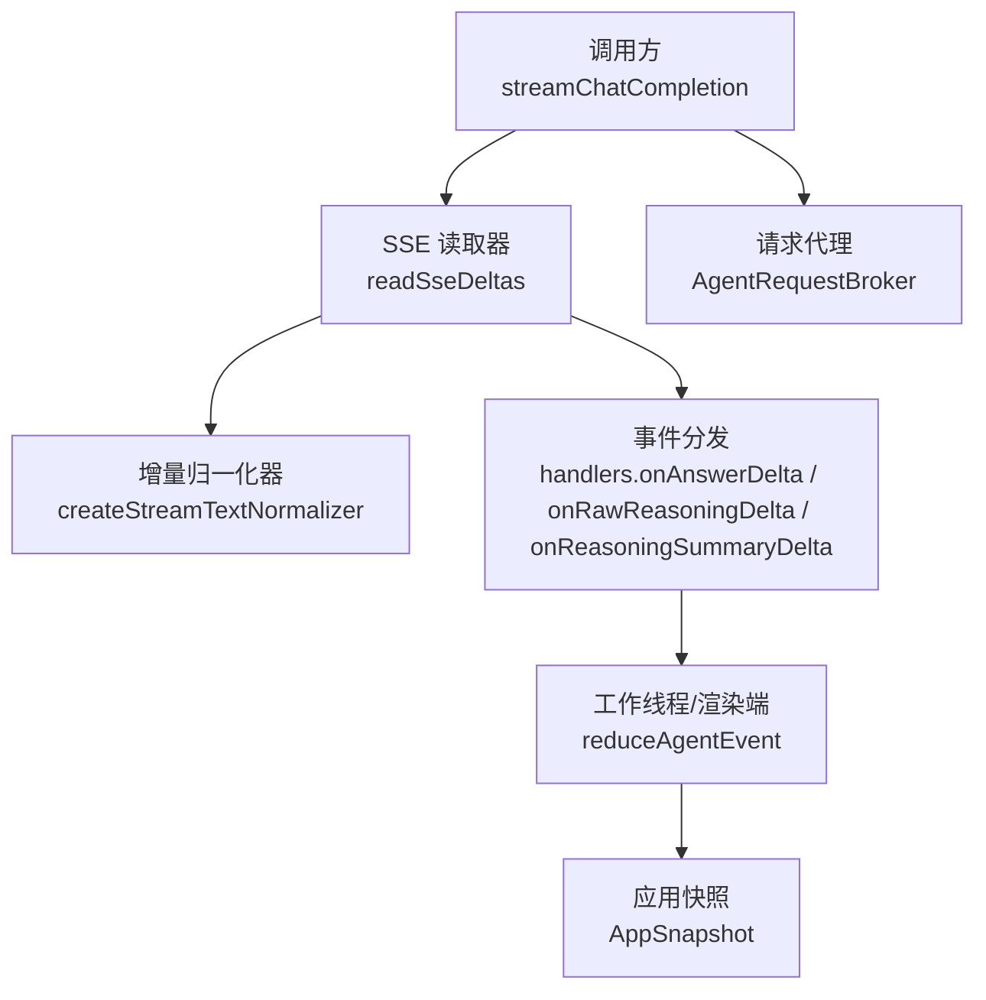
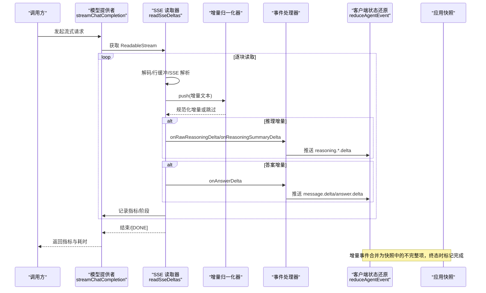
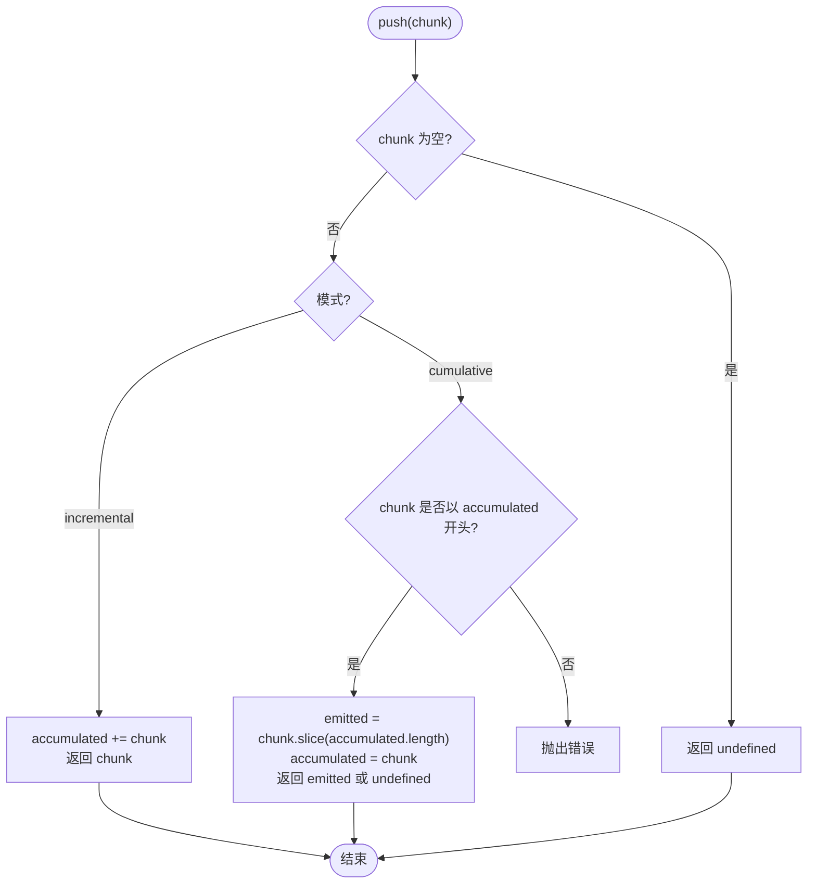
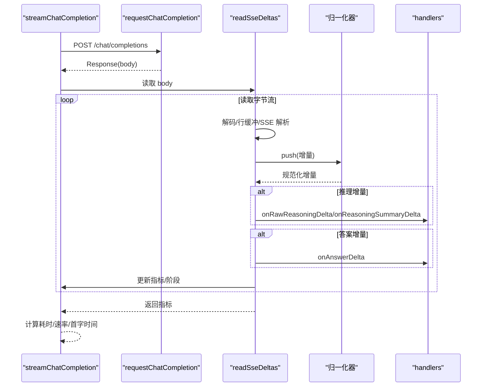
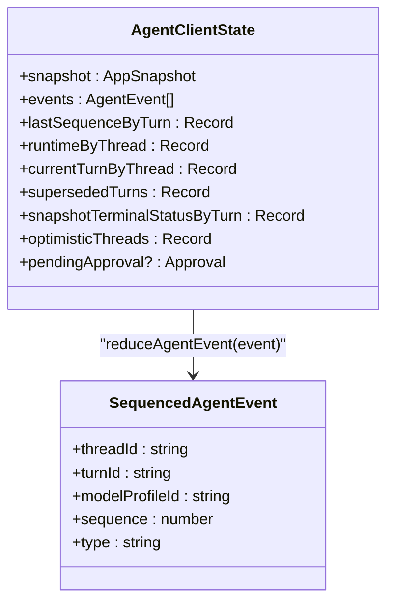
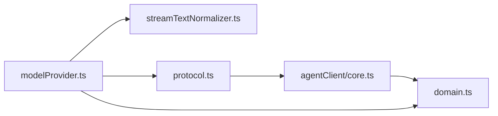

# 流式处理器

<cite>
**本文引用的文件**
- [src/agent/streamTextNormalizer.ts](file://src/agent/streamTextNormalizer.ts)
- [src/agent/modelProvider.ts](file://src/agent/modelProvider.ts)
- [src/shared/protocol.ts](file://src/shared/protocol.ts)
- [src/agentClient/core.ts](file://src/agentClient/core.ts)
- [src/main/agentRequestBroker.ts](file://src/main/agentRequestBroker.ts)
- [src/shared/domain.ts](file://src/shared/domain.ts)
</cite>

## 目录
1. [简介](#简介)
2. [项目结构](#项目结构)
3. [核心组件](#核心组件)
4. [架构总览](#架构总览)
5. [详细组件分析](#详细组件分析)
6. [依赖关系分析](#依赖关系分析)
7. [性能考量](#性能考量)
8. [故障排查指南](#故障排查指南)
9. [结论](#结论)
10. [附录](#附录)

## 简介
本文件面向“流式处理器”的实现与使用，系统性说明文本流增量接收、格式化和标准化处理；流式响应的缓冲机制（内存管理、数据压缩与传输优化）；不同类型流数据（普通回答、推理过程、推理摘要）的差异化处理；流中断与恢复机制（网络异常、数据完整性保证）；并提供监听事件、处理增量数据和实现自定义流处理器的实践指引；最后给出性能监控与调试技巧。

## 项目结构
本项目围绕“模型提供者层—事件协议—客户端状态还原—主进程请求代理”的分层设计组织流式能力：
- 模型提供者层负责发起请求、读取 SSE 流、解析事件、标准化增量文本、触发阶段变化与指标聚合。
- 事件协议定义统一的序列号化事件类型，包括消息增量、答案增量、推理增量、进度与指标等。
- 客户端状态还原将增量事件逐步应用到快照，维护线程运行态与内容项。
- 主进程请求代理提供带超时和断连处理的请求/响应通道。

图表来源
- [src/agent/modelProvider.ts:55-197](file://src/agent/modelProvider.ts#L55-L197)
- [src/agent/modelProvider.ts:563-680](file://src/agent/modelProvider.ts#L563-L680)
- [src/agent/streamTextNormalizer.ts:1-34](file://src/agent/streamTextNormalizer.ts#L1-L34)
- [src/agentClient/core.ts:56-175](file://src/agentClient/core.ts#L56-L175)
- [src/main/agentRequestBroker.ts:15-85](file://src/main/agentRequestBroker.ts#L15-L85)

章节来源
- [src/agent/modelProvider.ts:55-197](file://src/agent/modelProvider.ts#L55-L197)
- [src/agent/modelProvider.ts:563-680](file://src/agent/modelProvider.ts#L563-L680)
- [src/agent/streamTextNormalizer.ts:1-34](file://src/agent/streamTextNormalizer.ts#L1-L34)
- [src/agentClient/core.ts:56-175](file://src/agentClient/core.ts#L56-L175)
- [src/main/agentRequestBroker.ts:15-85](file://src/main/agentRequestBroker.ts#L15-L85)

## 核心组件
- 流文本归一化器：支持增量模式与累积模式，消除重复与重叠片段，确保最终输出一致且可追溯。
- 模型提供者流处理：封装 SSE 读取、分片解析、阶段切换、指标聚合、上下文压缩与重试。
- 协议事件：统一的事件类型与校验，承载增量文本、进度、工具调用、审批与指标。
- 客户端状态还原：基于事件流构建并更新应用快照，维护线程运行态与内容项。
- 请求代理：提供带超时、断连清理的请求/响应桥接。

章节来源
- [src/agent/streamTextNormalizer.ts:1-34](file://src/agent/streamTextNormalizer.ts#L1-L34)
- [src/agent/modelProvider.ts:55-197](file://src/agent/modelProvider.ts#L55-L197)
- [src/shared/protocol.ts:22-65](file://src/shared/protocol.ts#L22-L65)
- [src/agentClient/core.ts:56-175](file://src/agentClient/core.ts#L56-L175)
- [src/main/agentRequestBroker.ts:15-85](file://src/main/agentRequestBroker.ts#L15-L85)

## 架构总览
下图展示从请求到流式响应再到 UI 更新的完整链路，包含增量归一化、阶段切换、指标聚合与状态合并。

图表来源
- [src/agent/modelProvider.ts:55-197](file://src/agent/modelProvider.ts#L55-L197)
- [src/agent/modelProvider.ts:563-680](file://src/agent/modelProvider.ts#L563-L680)
- [src/agentClient/core.ts:56-175](file://src/agentClient/core.ts#L56-L175)

## 详细组件分析

### 流文本归一化器
- 目标：对增量文本进行去重与拼接，避免重复发送与错误拼接，保证最终值稳定。
- 模式：
  - 增量模式：直接追加每个非空增量，适合大多数 SSE 场景。
  - 累积模式：要求后续增量以当前累积值为前缀，仅发射新增后缀，用于某些服务端采用“全量快照”推送的场景。
- 复杂度：每次 push 为 O(k)，k 为增量长度；value() 为 O(1)。
- 关键行为：
  - 空增量直接丢弃。
  - 累积模式下若新增量不以累积值开头则抛出错误，保障一致性。
  - 提供 value() 获取当前累积结果，便于终止时校验或持久化。

图表来源
- [src/agent/streamTextNormalizer.ts:1-34](file://src/agent/streamTextNormalizer.ts#L1-L34)

章节来源
- [src/agent/streamTextNormalizer.ts:1-34](file://src/agent/streamTextNormalizer.ts#L1-L34)

### 模型提供者流处理
- 入口：streamChatCompletion，负责设置超时、构造请求头、调用 requestChatCompletion、读取 SSE 并聚合指标。
- SSE 读取：readSseDeltas 使用 TextDecoder 与行缓冲，按 SSE 规范解析 id/data 字段，支持事件 ID 去重，遇到 [DONE] 结束。
- 增量归一化：为 answer、raw reasoning、reasoning summary 分别创建独立归一化器，避免跨通道污染。
- 阶段切换：首次出现推理增量时切换到 reasoning，首次出现答案增量时切换到 answering。
- 指标聚合：合并 usage、finishReason、tokensPerSecond 等，计算端到端耗时与首字时间。
- 上下文压缩与重试：当检测到上下文超限或服务端失败时，自动压缩历史并续写答案，最多多次尝试。

图表来源
- [src/agent/modelProvider.ts:55-197](file://src/agent/modelProvider.ts#L55-L197)
- [src/agent/modelProvider.ts:563-680](file://src/agent/modelProvider.ts#L563-L680)

章节来源
- [src/agent/modelProvider.ts:55-197](file://src/agent/modelProvider.ts#L55-L197)
- [src/agent/modelProvider.ts:563-680](file://src/agent/modelProvider.ts#L563-L680)

### 协议事件与客户端状态还原
- 协议事件：SequencedAgentEvent 包含 threadId、turnId、modelProfileId、sequence 等，确保事件有序与可追踪。
- 增量事件类型：message.delta、answer.delta、reasoning.raw.delta、reasoning.summary.delta。
- 状态还原：reduceAgentEvent 将事件应用到 AppSnapshot，维护 items、turns、approvals 与运行时状态。
- 增量合并：applyAssistantDeltaToSnapshot 与 applyReasoningDeltaToSnapshot 将增量合并到对应逻辑项，标记 incomplete 直到终态。
- 终态处理：turn.completed/failed/cancelled 时标记内容完整或失败，清理待审批项。

图表来源
- [src/agentClient/core.ts:14-26](file://src/agentClient/core.ts#L14-L26)
- [src/shared/protocol.ts:41-65](file://src/shared/protocol.ts#L41-L65)

章节来源
- [src/shared/protocol.ts:22-65](file://src/shared/protocol.ts#L22-L65)
- [src/agentClient/core.ts:56-175](file://src/agentClient/core.ts#L56-L175)

### 主进程请求代理
- 功能：封装 postMessage 通信，提供 request/handleReply/disconnect，支持超时与断连清理。
- 用途：在需要与 agent runtime 交互时使用，确保未决请求在断连时被拒绝，避免悬挂 Promise。

章节来源
- [src/main/agentRequestBroker.ts:15-85](file://src/main/agentRequestBroker.ts#L15-L85)

## 依赖关系分析
- modelProvider.ts 依赖 streamTextNormalizer.ts 进行增量文本标准化。
- modelProvider.ts 通过 handlers 接口向调用方推送增量与阶段变化。
- protocol.ts 定义事件类型，供 worker/客户端消费。
- agentClient/core.ts 消费协议事件，更新 AppSnapshot。
- domain.ts 定义数据类型与枚举，贯穿各层。

图表来源
- [src/agent/modelProvider.ts:55-197](file://src/agent/modelProvider.ts#L55-L197)
- [src/agent/streamTextNormalizer.ts:1-34](file://src/agent/streamTextNormalizer.ts#L1-L34)
- [src/shared/protocol.ts:22-65](file://src/shared/protocol.ts#L22-L65)
- [src/agentClient/core.ts:56-175](file://src/agentClient/core.ts#L56-L175)
- [src/shared/domain.ts:283-319](file://src/shared/domain.ts#L283-L319)

章节来源
- [src/agent/modelProvider.ts:55-197](file://src/agent/modelProvider.ts#L55-L197)
- [src/agent/streamTextNormalizer.ts:1-34](file://src/agent/streamTextNormalizer.ts#L1-L34)
- [src/shared/protocol.ts:22-65](file://src/shared/protocol.ts#L22-L65)
- [src/agentClient/core.ts:56-175](file://src/agentClient/core.ts#L56-L175)
- [src/shared/domain.ts:283-319](file://src/shared/domain.ts#L283-L319)

## 性能考量
- 增量归一化：每通道独立实例，避免跨通道共享导致的竞争与误判；增量模式 O(k) 追加，累积模式需前缀校验但能减少冗余传输。
- 缓冲与解码：使用 TextDecoder(stream:true) 与行缓冲，避免整段加载；SSE 事件按行拆分，降低内存峰值。
- 指标聚合：合并 usage 与 tokensPerSecond，加权平均速率，减少重复计算。
- 上下文压缩：接近上下文窗口时压缩历史与用户消息，必要时续写答案，避免服务侧失败。
- 超时与取消：linkedTimeoutSignal 与 AbortSignal 联动，及时释放资源，防止泄漏。

[本节为通用性能建议，不直接分析具体文件]

## 故障排查指南
- 流中断与恢复
  - 网络异常：readWithAbort 与 withExplicitAbort 在 abort 时立即拒绝，确保上层捕获并清理。
  - 事件 ID 冲突：SSE 事件 ID 重复但 data 不同会抛错，提示上游提供方问题。
  - 上下文超限：检测特定错误信息后自动压缩并重试，最多三次。
- 数据完整性
  - 累积模式要求严格前缀匹配，否则抛错，便于快速定位上游不一致。
  - [DONE] 结束时调用 assertFinalAnswer 校验最终答案与 finishReason 的一致性。
- 调试技巧
  - 观察 phase 切换：connecting -> reasoning -> answering，确认推理与回答顺序。
  - 检查 metrics：durationMs、timeToFirstTokenMs、tokensPerSecond、usageSource/speedSource。
  - 查看客户端状态：items.incomplete 标志与 turn 终态，确认 UI 是否正确标记未完成。

章节来源
- [src/agent/modelProvider.ts:563-680](file://src/agent/modelProvider.ts#L563-L680)
- [src/agent/modelProvider.ts:55-197](file://src/agent/modelProvider.ts#L55-L197)
- [src/agentClient/core.ts:56-175](file://src/agentClient/core.ts#L56-L175)

## 结论
该流式处理器通过“增量归一化+SSE 解析+阶段切换+指标聚合+状态还原”的闭环设计，实现了高可靠、低延迟、可扩展的流式文本处理能力。其模块化与强类型约束使得在不同模型提供方之间具备良好兼容性，同时通过上下文压缩与重试机制提升了鲁棒性。结合协议事件与客户端状态还原，UI 能够实时、准确地呈现增量内容与运行状态。

[本节为总结性内容，不直接分析具体文件]

## 附录

### 监听流事件与处理增量数据
- 在调用方实现 ModelStreamHandlers，订阅 onAnswerDelta、onRawReasoningDelta、onReasoningSummaryDelta 与 onPhase。
- 在 readSseDeltas 中，增量经归一化后才会触发相应 handler，确保无重复与正确顺序。
- 在客户端 reduceAgentEvent 中，增量事件会被合并到 AppSnapshot 的 items 中，并标记 incomplete，直到终态事件到来。

章节来源
- [src/agent/modelProvider.ts:55-197](file://src/agent/modelProvider.ts#L55-L197)
- [src/agent/modelProvider.ts:563-680](file://src/agent/modelProvider.ts#L563-L680)
- [src/agentClient/core.ts:56-175](file://src/agentClient/core.ts#L56-L175)

### 实现自定义流处理器
- 复用 createStreamTextNormalizer：为 answer/raw/summary 分别创建实例，传入 'incremental' 或 'cumulative'。
- 在 readSseDeltas 中，将 parseStreamChunk 的结果 push 到对应归一化器，再根据返回值决定是否调用 handlers。
- 在客户端，扩展 reduceAgentEvent 以支持新的增量类型或显示策略。

章节来源
- [src/agent/streamTextNormalizer.ts:1-34](file://src/agent/streamTextNormalizer.ts#L1-L34)
- [src/agent/modelProvider.ts:563-680](file://src/agent/modelProvider.ts#L563-L680)
- [src/agentClient/core.ts:56-175](file://src/agentClient/core.ts#L56-L175)

### 性能监控与调试要点
- 指标字段：durationMs、timeToFirstTokenMs、tokensPerSecond、promptTokens/completionTokens/totalTokens/reasoningTokens。
- 速率来源：speedSource 与 usageSource 区分服务端与客户端统计。
- 阶段日志：打印 connecting/reasoning/answering 切换时机，辅助定位首字延迟与推理阶段时长。
- 客户端视图：关注 items.incomplete 与 turn 状态，验证 UI 是否正确反映未完成与终态。

章节来源
- [src/agent/modelProvider.ts:55-197](file://src/agent/modelProvider.ts#L55-L197)
- [src/shared/domain.ts:238-257](file://src/shared/domain.ts#L238-L257)
- [src/agentClient/core.ts:56-175](file://src/agentClient/core.ts#L56-L175)