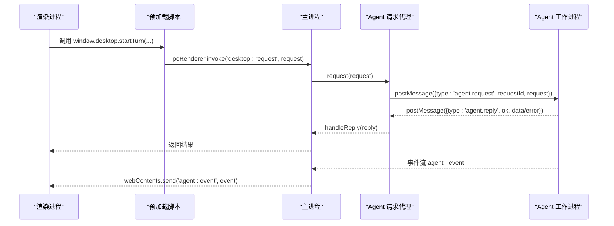
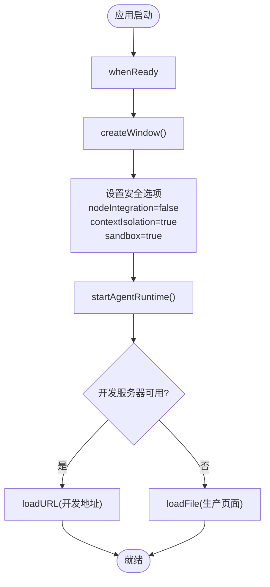
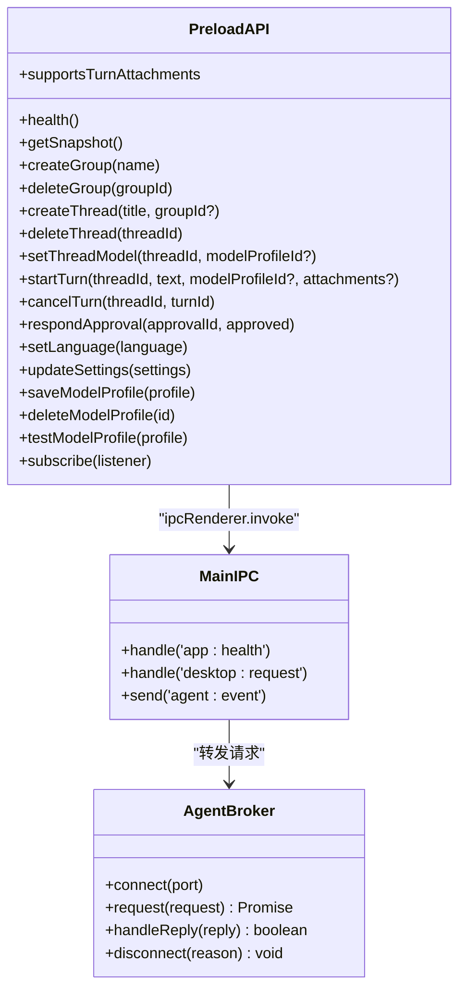
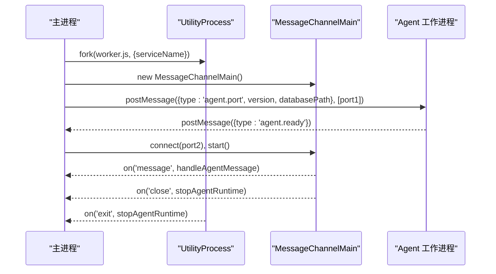
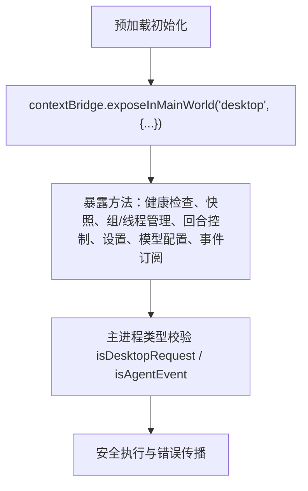
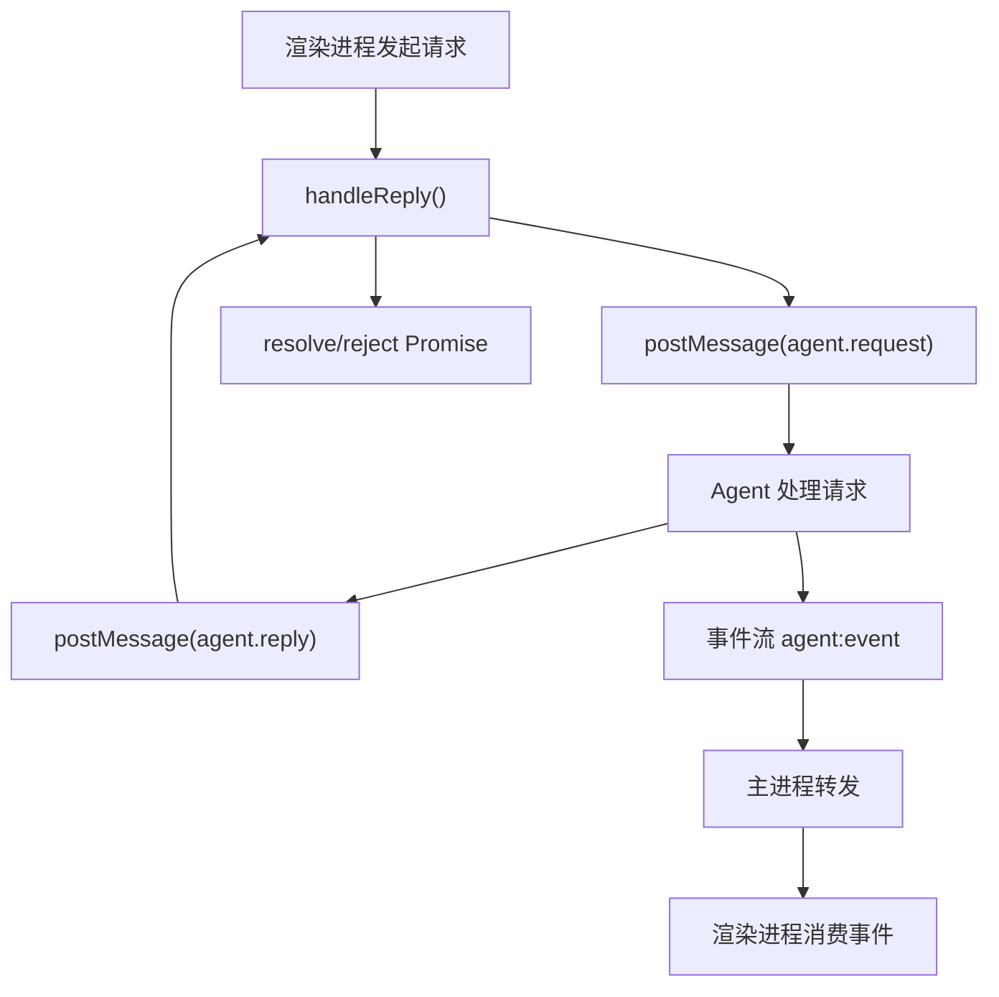
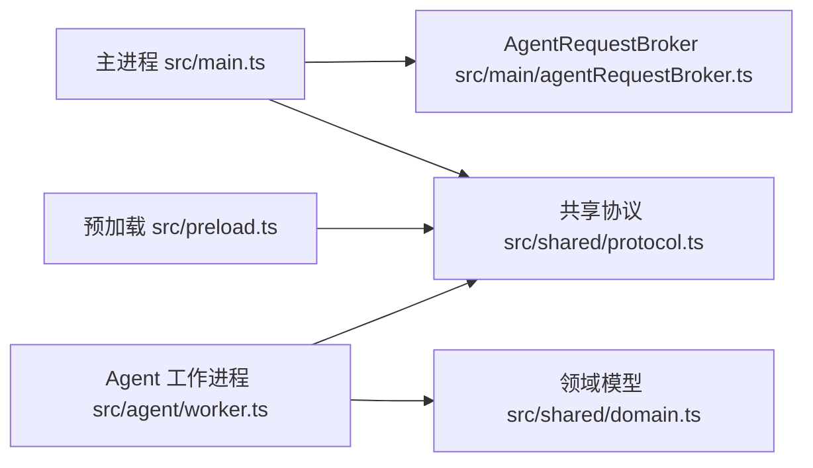

# 主进程

<cite>
**本文引用的文件**
- [src/main.ts](file://src/main.ts)
- [src/preload.ts](file://src/preload.ts)
- [src/main/agentRequestBroker.ts](file://src/main/agentRequestBroker.ts)
- [src/agent/worker.ts](file://src/agent/worker.ts)
- [src/shared/protocol.ts](file://src/shared/protocol.ts)
- [src/shared/domain.ts](file://src/shared/domain.ts)
- [package.json](file://package.json)
- [forge.config.ts](file://forge.config.ts)
- [vite.main.config.ts](file://vite.main.config.ts)
- [vite.preload.config.ts](file://vite.preload.config.ts)
- [vite.agent.config.ts](file://vite.agent.config.ts)
- [README.md](file://README.md)
</cite>

## 目录
1. [简介](#简介)
2. [项目结构](#项目结构)
3. [核心组件](#核心组件)
4. [架构总览](#架构总览)
5. [详细组件分析](#详细组件分析)
6. [依赖关系分析](#依赖关系分析)
7. [性能考量](#性能考量)
8. [故障排查指南](#故障排查指南)
9. [结论](#结论)
10. [附录](#附录)

## 简介
本文件聚焦 Electron 主进程模块，系统性说明应用生命周期管理、窗口创建与安全配置、IPC 通信桥接机制、Agent 进程的启动与生命周期协调、预加载脚本的安全隔离策略，以及可配置项与扩展点。文档同时提供调试技巧与常见问题解决方案，帮助读者快速定位并解决问题。

## 项目结构
- 入口与生命周期：主进程入口负责应用初始化、窗口创建、事件监听与资源清理。
- 预加载脚本：通过 contextBridge 暴露最小化 API 给渲染进程，屏蔽底层 IPC 细节。
- Agent 请求代理：在主进程中维护与 Agent 子进程的双向通道，封装请求-响应语义、超时与断连处理。
- Agent 工作进程：独立 Utility Process，承载调度、模型调用、SQLite 持久化与事件流。
- 共享协议与领域模型：定义桌面端请求类型、事件结构与领域对象，确保跨进程数据契约一致。
- 构建与打包：Vite 分别构建 main、preload、agent 产物；Electron Forge 统一打包与发布。

```mermaid
graph TB
A["主进程<br/>src/main.ts"] --> B["预加载脚本<br/>src/preload.ts"]
A --> C["Agent 请求代理<br/>src/main/agentRequestBroker.ts"]
A --> D["Agent 工作进程<br/>src/agent/worker.ts"]
B --> E["渲染进程 UI"]
C < --> D
A -.-> F["共享协议/领域模型<br/>src/shared/*.ts"]
```

图表来源
- [src/main.ts:1-170](file://src/main.ts#L1-L170)
- [src/preload.ts:1-32](file://src/preload.ts#L1-L32)
- [src/main/agentRequestBroker.ts:1-86](file://src/main/agentRequestBroker.ts#L1-L86)
- [src/agent/worker.ts:1-689](file://src/agent/worker.ts#L1-L689)
- [src/shared/protocol.ts:1-371](file://src/shared/protocol.ts#L1-L371)
- [src/shared/domain.ts:1-319](file://src/shared/domain.ts#L1-L319)

章节来源
- [src/main.ts:1-170](file://src/main.ts#L1-L170)
- [src/preload.ts:1-32](file://src/preload.ts#L1-L32)
- [src/main/agentRequestBroker.ts:1-86](file://src/main/agentRequestBroker.ts#L1-L86)
- [src/agent/worker.ts:1-689](file://src/agent/worker.ts#L1-L689)
- [src/shared/protocol.ts:1-371](file://src/shared/protocol.ts#L1-L371)
- [src/shared/domain.ts:1-319](file://src/shared/domain.ts#L1-L319)
- [package.json:1-35](file://package.json#L1-L35)
- [forge.config.ts:1-50](file://forge.config.ts#L1-L50)
- [vite.main.config.ts:1-10](file://vite.main.config.ts#L1-L10)
- [vite.preload.config.ts:1-10](file://vite.preload.config.ts#L1-L10)
- [vite.agent.config.ts:1-10](file://vite.agent.config.ts#L1-L10)
- [README.md:1-121](file://README.md#L1-L121)

## 核心组件
- 主进程（main）：管理 Electron 应用生命周期、窗口安全配置、外部链接打开策略、导航拦截、Agent 运行时启动与停止、IPC 路由与错误传播。
- 预加载（preload）：通过 contextBridge 暴露 window.desktop API，将渲染进程调用映射到主进程 IPC 通道，订阅 Agent 事件流。
- Agent 请求代理（AgentRequestBroker）：维护 MessageChannelMain 连接，为每个请求分配 requestId，处理超时、断连与重入保护。
- Agent 工作进程（worker）：基于 SQLite 的会话与对话状态管理，按模型配置并发度进行任务排队与执行，输出有序事件流。
- 共享协议（protocol）：严格校验桌面端请求与 Agent 事件结构，保证跨进程消息契约。
- 领域模型（domain）：描述线程、回合、附件、模型配置、设置、指标等数据结构。

章节来源
- [src/main.ts:1-170](file://src/main.ts#L1-L170)
- [src/preload.ts:1-32](file://src/preload.ts#L1-L32)
- [src/main/agentRequestBroker.ts:1-86](file://src/main/agentRequestBroker.ts#L1-L86)
- [src/agent/worker.ts:1-689](file://src/agent/worker.ts#L1-L689)
- [src/shared/protocol.ts:1-371](file://src/shared/protocol.ts#L1-L371)
- [src/shared/domain.ts:1-319](file://src/shared/domain.ts#L1-L319)

## 架构总览
主进程作为安全边界与调度中心，负责：
- 启动时创建 BrowserWindow，启用沙箱与上下文隔离，仅通过预加载脚本暴露必要能力。
- 使用 UtilityProcess 启动 Agent 工作进程，通过 MessageChannelMain 建立双向通道。
- 将渲染进程的桌面端请求经 IPC 转发至 Agent，并将 Agent 的事件与回复回推至渲染进程。
- 在应用退出或异常时清理 Agent 进程与端口，释放资源。



图表来源
- [src/preload.ts:5-31](file://src/preload.ts#L5-L31)
- [src/main.ts:98-144](file://src/main.ts#L98-L144)
- [src/main/agentRequestBroker.ts:33-63](file://src/main/agentRequestBroker.ts#L33-L63)
- [src/agent/worker.ts:407-442](file://src/agent/worker.ts#L407-L442)

## 详细组件分析

### 主进程生命周期与窗口管理
- 应用启动：监听 whenReady，创建窗口，并在 macOS 下处理 activate 事件以恢复窗口。
- 窗口安全：禁用 Node 集成、启用上下文隔离与沙箱；限制新窗口打开为外部浏览器；拦截非预期导航。
- 资源清理：window-all-closed 在非 macOS 平台退出应用；before-quit 中停止 Agent 并释放端口。
- 健康检查：暴露 app:health 接口供测试或监控使用。



图表来源
- [src/main.ts:110-129](file://src/main.ts#L110-L129)
- [src/main.ts:56-96](file://src/main.ts#L56-L96)
- [src/main.ts:98-108](file://src/main.ts#L98-L108)

章节来源
- [src/main.ts:1-170](file://src/main.ts#L1-L170)

### IPC 通信桥接机制
- 渲染侧：预加载脚本通过 contextBridge.exposeInMainWorld 暴露 window.desktop，封装所有桌面端操作为方法调用。
- 主进程侧：注册 ipcMain.handle('desktop:request')，对请求进行类型校验后转发至 Agent；注册 'app:health' 用于健康检查。
- 事件通道：主进程接收 Agent 事件并通过 webContents.send('agent:event', ...) 推送至渲染进程；预加载脚本提供 subscribe 方法以便订阅。



图表来源
- [src/preload.ts:5-31](file://src/preload.ts#L5-L31)
- [src/main.ts:98-144](file://src/main.ts#L98-L144)
- [src/main/agentRequestBroker.ts:15-86](file://src/main/agentRequestBroker.ts#L15-L86)

章节来源
- [src/preload.ts:1-32](file://src/preload.ts#L1-L32)
- [src/main.ts:98-144](file://src/main.ts#L98-L144)
- [src/main/agentRequestBroker.ts:1-86](file://src/main/agentRequestBroker.ts#L1-L86)

### Agent 进程启动与管理
- 启动流程：主进程通过 utilityProcess.fork 启动 worker.js，传递 serviceName；创建 MessageChannelMain 交换端口；通过 postMessage 发送数据库路径与应用版本，并附带 port1。
- 端口与消息：主进程持有 port2 并监听 message/close；Agent 收到端口后初始化数据库与运行时，并向主进程发送 agent.ready。
- 生命周期协调：当 Agent 进程意外退出或端口关闭时，主进程调用 stopAgentRuntime 清理资源；应用退出时主动终止 Agent。



图表来源
- [src/main.ts:19-54](file://src/main.ts#L19-L54)
- [src/main.ts:146-156](file://src/main.ts#L146-L156)
- [src/agent/worker.ts:106-126](file://src/agent/worker.ts#L106-L126)

章节来源
- [src/main.ts:19-54](file://src/main.ts#L19-L54)
- [src/main.ts:146-156](file://src/main.ts#L146-L156)
- [src/agent/worker.ts:106-126](file://src/agent/worker.ts#L106-L126)

### 预加载脚本的安全隔离机制
- 最小暴露面：仅暴露 window.desktop 下的有限方法，避免直接访问 Electron 内部 API。
- 权限控制：渲染进程无法直接调用 IPC，必须通过预加载桥接；所有参数由主进程进行类型校验。
- 事件订阅：通过 ipcRenderer.on('agent:event', ...) 订阅事件，并提供取消订阅函数，防止内存泄漏。



图表来源
- [src/preload.ts:5-31](file://src/preload.ts#L5-L31)
- [src/shared/protocol.ts:274-371](file://src/shared/protocol.ts#L274-L371)

章节来源
- [src/preload.ts:1-32](file://src/preload.ts#L1-L32)
- [src/shared/protocol.ts:274-371](file://src/shared/protocol.ts#L274-L371)

### 请求-响应与事件流处理
- 请求代理：AgentRequestBroker 为每个请求生成唯一 requestId，记录待处理集合，支持超时与断连时的批量拒绝。
- 事件流：Agent 工作进程按顺序发出带 sequence 的事件，主进程将其转发至渲染进程；渲染进程可按需消费。
- 错误传播：主进程对非法请求抛出错误；Agent 捕获异常并返回结构化错误信息，避免敏感信息泄露。



图表来源
- [src/main/agentRequestBroker.ts:33-63](file://src/main/agentRequestBroker.ts#L33-L63)
- [src/main.ts:135-144](file://src/main.ts#L135-L144)
- [src/agent/worker.ts:407-442](file://src/agent/worker.ts#L407-L442)

章节来源
- [src/main/agentRequestBroker.ts:1-86](file://src/main/agentRequestBroker.ts#L1-L86)
- [src/main.ts:135-144](file://src/main.ts#L135-L144)
- [src/agent/worker.ts:407-442](file://src/agent/worker.ts#L407-L442)

### 配置选项与扩展点
- 用户数据路径：可通过环境变量 PRIVATE_AI_DESKTOP_USER_DATA 指定自定义 userData 目录。
- 构建与打包：
  - Vite 分别构建 main、preload、agent 与 renderer，外部依赖 electron、node:path、node:sqlite 等。
  - Electron Forge 配置 ASAR、忽略规则、镜像源与产物格式。
- 扩展点：
  - 新增桌面端请求：在 shared/protocol.ts 中扩展 DesktopRequest 类型与校验逻辑。
  - 新增 Agent 事件：在 shared/protocol.ts 中扩展 SequencedAgentEvent 与 isAgentEvent 校验。
  - 调整 Agent 行为：在 agent/worker.ts 中实现新的工具或模型适配器。
  - 预加载 API 扩展：在 preload.ts 中增加新方法并更新主进程路由。

章节来源
- [src/main.ts:9-12](file://src/main.ts#L9-L12)
- [forge.config.ts:10-46](file://forge.config.ts#L10-L46)
- [vite.main.config.ts:1-10](file://vite.main.config.ts#L1-L10)
- [vite.preload.config.ts:1-10](file://vite.preload.config.ts#L1-L10)
- [vite.agent.config.ts:1-10](file://vite.agent.config.ts#L1-L10)
- [src/shared/protocol.ts:22-65](file://src/shared/protocol.ts#L22-L65)
- [src/shared/protocol.ts:274-371](file://src/shared/protocol.ts#L274-L371)

## 依赖关系分析
- 主进程依赖：
  - Electron 模块：app、BrowserWindow、ipcMain、MessageChannelMain、shell、utilityProcess。
  - 本地模块：AgentRequestBroker、共享协议类型。
- 预加载脚本依赖：
  - Electron 模块：contextBridge、ipcRenderer。
  - 共享类型：领域模型与协议类型。
- Agent 工作进程依赖：
  - 共享协议与领域模型。
  - 数据库、聊天上下文、模型提供者、演示代理、调度器等。



图表来源
- [src/main.ts:1-5](file://src/main.ts#L1-L5)
- [src/preload.ts:1-4](file://src/preload.ts#L1-L4)
- [src/agent/worker.ts:1-48](file://src/agent/worker.ts#L1-L48)
- [src/shared/protocol.ts:1-65](file://src/shared/protocol.ts#L1-L65)
- [src/shared/domain.ts:1-319](file://src/shared/domain.ts#L1-L319)

章节来源
- [src/main.ts:1-5](file://src/main.ts#L1-L5)
- [src/preload.ts:1-4](file://src/preload.ts#L1-L4)
- [src/agent/worker.ts:1-48](file://src/agent/worker.ts#L1-L48)
- [src/shared/protocol.ts:1-65](file://src/shared/protocol.ts#L1-L65)
- [src/shared/domain.ts:1-319](file://src/shared/domain.ts#L1-L319)

## 性能考量
- 并发与队列：Agent 工作进程按模型配置的并发度进行任务排队，避免过载；不同模型配置拥有独立队列。
- 超时与断连：主进程为每个请求设置超时时间，Agent 断开时批量拒绝待处理请求，避免悬挂。
- 事件顺序：Agent 事件携带 sequence 字段，确保渲染进程按序消费，减少乱序导致的 UI 不一致。
- 资源清理：应用退出时主动终止 Agent 进程并关闭端口，防止资源泄漏。

[本节为通用性能讨论，不直接分析具体文件]

## 故障排查指南
- 应用无法启动或窗口未显示：
  - 检查 whenReady 回调是否执行；确认 loadURL/loadFile 成功。
  - 查看控制台是否有 Agent 启动失败日志。
- 渲染进程调用无响应：
  - 确认预加载脚本已正确暴露 window.desktop 方法。
  - 检查主进程是否注册了相应 IPC 处理器。
  - 验证 Agent 是否已就绪（agent.ready）。
- 请求超时或中断：
  - 检查 AgentRequestBroker 的 pending 集合是否被清理。
  - 确认 Agent 进程是否存活，端口是否关闭。
- 事件未到达渲染进程：
  - 确认主进程是否正确转发 agent:event。
  - 检查渲染进程是否正确订阅并移除监听器。
- 安全相关错误：
  - 确认 nodeIntegration=false、contextIsolation=true、sandbox=true。
  - 检查外部链接打开策略与导航拦截逻辑。

章节来源
- [src/main.ts:110-156](file://src/main.ts#L110-L156)
- [src/main/agentRequestBroker.ts:33-86](file://src/main/agentRequestBroker.ts#L33-L86)
- [src/agent/worker.ts:407-442](file://src/agent/worker.ts#L407-L442)
- [src/preload.ts:26-31](file://src/preload.ts#L26-L31)

## 结论
主进程模块通过严格的窗口安全配置、清晰的 IPC 桥接与健壮的 Agent 进程管理，实现了安全、可扩展的桌面端 AI 客户端架构。预加载脚本的最小暴露面与共享协议的强类型校验确保了跨进程通信的安全性与一致性。通过合理的并发控制、超时与断连处理，系统在复杂场景下仍能保持稳定与可观测性。

[本节为总结性内容，不直接分析具体文件]

## 附录
- 运行与构建：
  - 安装依赖与启动：参考 README 中的命令。
  - 打包与制作：使用 Electron Forge 配置进行打包与分发。
- 环境变量：
  - PRIVATE_AI_DESKTOP_USER_DATA：自定义用户数据目录。
  - MAIN_WINDOW_VITE_DEV_SERVER_URL：开发模式下加载的地址。
- 测试：
  - 单元测试与端到端测试覆盖关键路径，包括 Agent 请求代理、协议校验、数据库与模型连接等。

章节来源
- [README.md:5-15](file://README.md#L5-L15)
- [README.md:78-121](file://README.md#L78-L121)
- [package.json:7-14](file://package.json#L7-L14)
- [forge.config.ts:10-46](file://forge.config.ts#L10-L46)