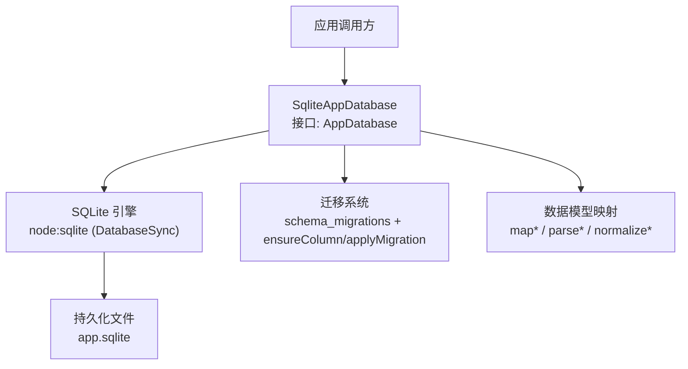
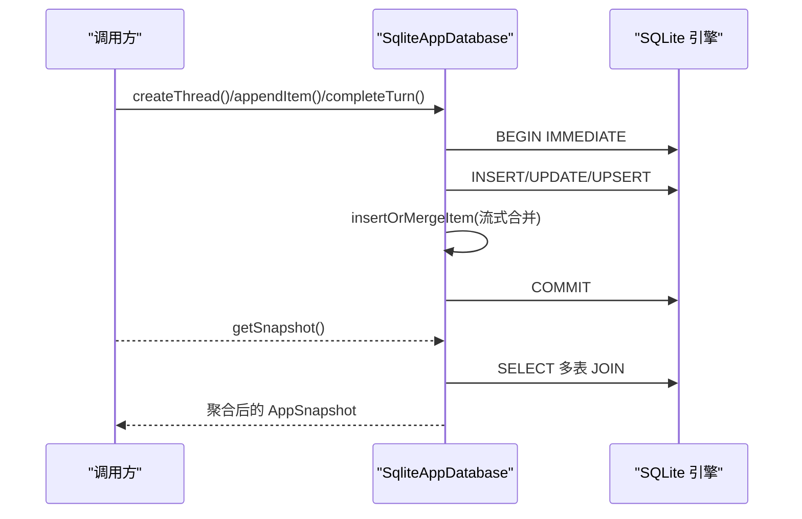
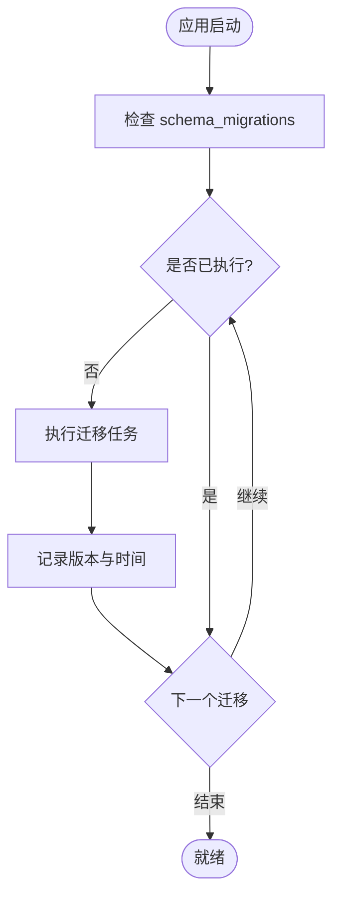
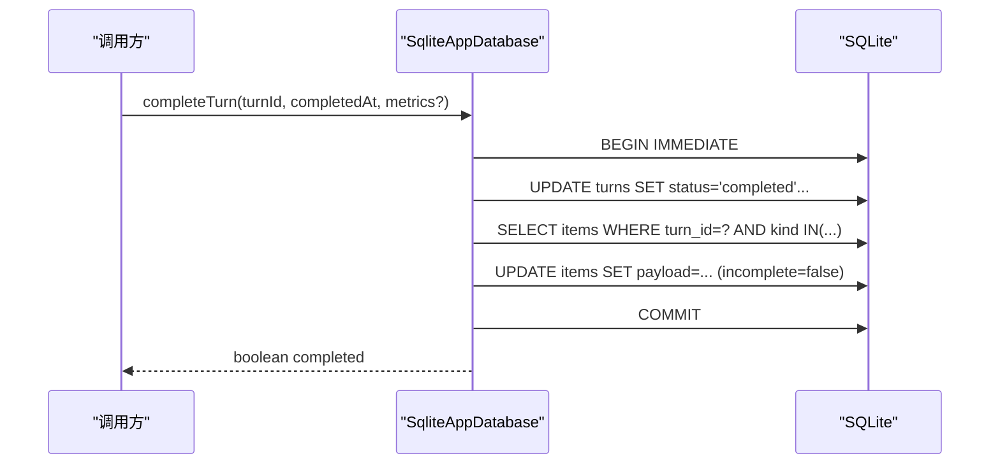
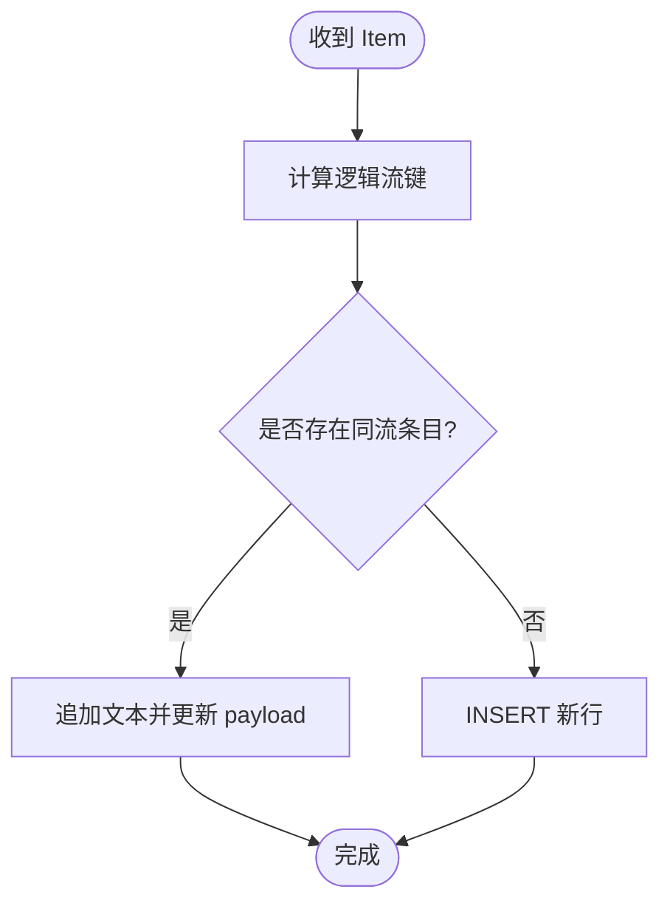
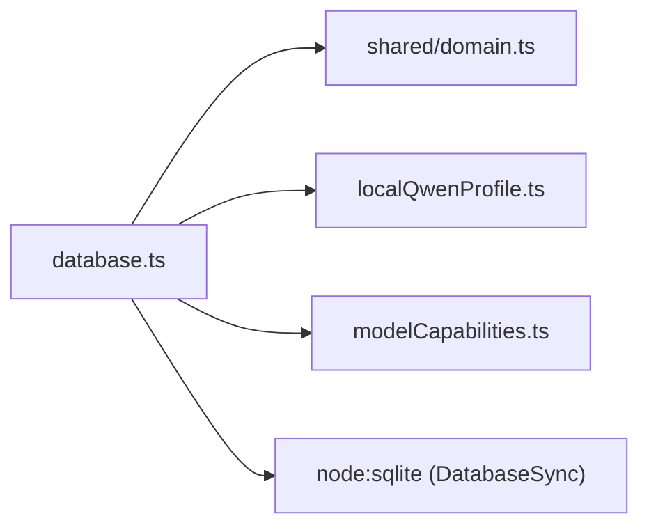

# 数据库层

<cite>
**本文引用的文件**
- [src/agent/database.ts](file://src/agent/database.ts)
- [tests/database.test.ts](file://tests/database.test.ts)
- [src/shared/domain.ts](file://src/shared/domain.ts)
</cite>

## 目录
1. [简介](#简介)
2. [项目结构](#项目结构)
3. [核心组件](#核心组件)
4. [架构总览](#架构总览)
5. [详细组件分析](#详细组件分析)
6. [依赖关系分析](#依赖关系分析)
7. [性能与优化](#性能与优化)
8. [故障排查指南](#故障排查指南)
9. [结论](#结论)
10. [附录：CRUD 与高级查询示例](#附录crud-与高级查询示例)

## 简介
本章节面向 SQLite 数据层的综合文档，覆盖表结构设计、关系映射、索引与查询优化、迁移策略（版本管理、向后兼容、回滚）、数据模型定义（实体关系、验证规则、约束）、CRUD 与高级查询模式、备份恢复策略与性能监控方法。内容基于仓库中的实现与测试用例进行归纳与说明。

## 项目结构
- 数据库实现位于 agent 层，通过 Node.js 内置的 sqlite 模块以同步方式访问本地 SQLite 文件。
- 领域类型集中在 shared/domain.ts，用于描述会话、消息、推理项、工作区、模型配置等实体。
- 数据库行为由大量单元测试覆盖，确保迁移、流式合并、事务原子性等关键路径正确。

图表来源
- [src/agent/database.ts:150-154](file://src/agent/database.ts#L150-L154)
- [src/agent/database.ts:731-873](file://src/agent/database.ts#L731-L873)
- [src/shared/domain.ts:1-319](file://src/shared/domain.ts#L1-L319)

章节来源
- [src/agent/database.ts:150-154](file://src/agent/database.ts#L150-L154)
- [src/shared/domain.ts:1-319](file://src/shared/domain.ts#L1-L319)

## 核心组件
- SqliteAppDatabase：对外暴露 AppDatabase 接口，封装所有读写操作、迁移、事务和快照聚合。
- 迁移系统：使用 schema_migrations 表记录已执行迁移；通过 ensureColumn 与 applyMigration 实现增量升级与幂等性。
- 数据映射：将行数据映射为领域对象，并在读取时做安全脱敏（如隐藏 API Key）。
- 流式合并：对同一逻辑流的 assistant 消息与 reasoning 片段进行合并，避免冗余存储。
- 启动修复：重启后中断的 turn 与 pending approvals 会被自动修复，保证状态一致性。

章节来源
- [src/agent/database.ts:150-154](file://src/agent/database.ts#L150-L154)
- [src/agent/database.ts:731-873](file://src/agent/database.ts#L731-L873)
- [src/agent/database.ts:945-979](file://src/agent/database.ts#L945-L979)
- [src/agent/database.ts:1040-1135](file://src/agent/database.ts#L1040-L1135)

## 架构总览
下图展示从应用调用到 SQLite 的完整流程，包括事务边界、迁移检查、流式写入合并以及快照聚合。

图表来源
- [src/agent/database.ts:1203-1212](file://src/agent/database.ts#L1203-L1212)
- [src/agent/database.ts:156-216](file://src/agent/database.ts#L156-L216)
- [src/agent/database.ts:945-979](file://src/agent/database.ts#L945-L979)

## 详细组件分析

### 表结构与关系映射
- 核心表
  - chat_groups：聊天分组，软删除字段 deleted_at。
  - threads：对话线程，关联 group_id 与 model_profile_id，软删除。
  - turns：回合记录，关联 thread_id，包含生命周期状态、错误、指标等。
  - items：消息/推理/工具/变更等事件，按 thread_id 与可选 turn_id 组织，payload 为 JSON。
  - approvals：审批项，关联 thread_id 与 turn_id，支持 pending/approved/rejected。
  - settings：键值型设置，持久化 UI 与运行时偏好。
  - workspaces：工作区元信息，canonical_root_path 唯一。
  - model_profiles：模型配置，包含能力、推理设置、并发与输出限制等。
  - schema_migrations：迁移版本记录。

- 关系与约束
  - turns.thread_id -> threads.id（ON DELETE CASCADE）
  - items.thread_id -> threads.id（ON DELETE CASCADE）
  - items.turn_id -> turns.id（ON DELETE SET NULL）
  - approvals.thread_id -> threads.id（ON DELETE CASCADE）
  - approvals.turn_id -> turns.id（ON DELETE CASCADE）
  - workspaces.canonical_root_path 唯一约束
  - 外键开启 PRAGMA foreign_keys = ON

- 索引与查询优化
  - 当前代码未显式创建额外索引；主要依赖主键与外键关系。
  - 常见查询通过 WHERE + ORDER BY 过滤与排序，适合中小规模数据。
  - 建议后续针对高频条件列添加索引（例如 threads.updated_at、turns.status、items.created_at），以提升列表与历史加载性能。

章节来源
- [src/agent/database.ts:741-828](file://src/agent/database.ts#L741-L828)
- [src/agent/database.ts:731-736](file://src/agent/database.ts#L731-L736)
- [src/agent/database.ts:156-216](file://src/agent/database.ts#L156-L216)

### 数据迁移策略
- 版本管理
  - 使用 schema_migrations 表记录每个迁移版本号与执行时间。
  - 初始化阶段创建基础表并插入默认设置与初始迁移版本。
- 向后兼容
  - ensureColumn 在旧库上按需添加缺失列，避免破坏已有数据。
  - 迁移函数处理历史数据修复（如助手消息片段压缩、遗留完成状态修复、本地 Qwen 预设修复或补全）。
- 幂等性与回滚
  - 迁移以事务包裹，失败则回滚。
  - 迁移仅在不存在的版本时执行，重复打开不重复应用。
  - 当前未提供“向下回滚”机制；如需回滚需手动维护反向迁移脚本并在部署流程中控制顺序。

图表来源
- [src/agent/database.ts:981-993](file://src/agent/database.ts#L981-L993)
- [src/agent/database.ts:838-873](file://src/agent/database.ts#L838-L873)

章节来源
- [src/agent/database.ts:838-873](file://src/agent/database.ts#L838-L873)
- [src/agent/database.ts:981-993](file://src/agent/database.ts#L981-L993)
- [tests/database.test.ts:108-116](file://tests/database.test.ts#L108-L116)

### 事务与一致性
- 所有写操作均通过 transaction 包装，使用 BEGIN IMMEDIATE 提升并发安全性。
- 异常时自动 ROLLBACK，保证数据一致性。
- 典型场景：
  - 创建组/线程：单条插入。
  - 删除组/线程：级联标记删除。
  - 完成回合：更新 turns 并批量修正 items.incomplete。
  - 失败/中断：统一更新 turns 与 pending approvals。

图表来源
- [src/agent/database.ts:438-464](file://src/agent/database.ts#L438-L464)
- [src/agent/database.ts:1203-1212](file://src/agent/database.ts#L1203-L1212)

章节来源
- [src/agent/database.ts:438-464](file://src/agent/database.ts#L438-L464)
- [src/agent/database.ts:1203-1212](file://src/agent/database.ts#L1203-L1212)
- [tests/database.test.ts:485-511](file://tests/database.test.ts#L485-L511)

### 流式写入与合并
- appendItem 会识别逻辑流键（answer/reasoning），若存在同一流条目则追加文本而非新增行。
- 重启时会压缩历史助手消息片段，减少冗余。
- 该机制显著降低高吞吐流式写入时的行数膨胀。

图表来源
- [src/agent/database.ts:945-979](file://src/agent/database.ts#L945-L979)
- [src/agent/database.ts:995-1030](file://src/agent/database.ts#L995-L1030)

章节来源
- [src/agent/database.ts:945-979](file://src/agent/database.ts#L945-L979)
- [src/agent/database.ts:995-1030](file://src/agent/database.ts#L995-L1030)
- [tests/database.test.ts:360-371](file://tests/database.test.ts#L360-L371)
- [tests/database.test.ts:460-483](file://tests/database.test.ts#L460-L483)

### 数据模型与约束
- 实体关系
  - ChatGroup -> Threads（一对多）
  - Thread -> Turns（一对多）
  - Thread -> Items（一对多）
  - Turn -> Items（一对多，可空）
  - Thread -> Approvals（一对多）
  - Turn -> Approvals（一对多）
  - ModelProfiles 独立，被 Threads 引用
  - Workspaces 独立，唯一 canonical_root_path
- 验证与约束
  - 必填字段通过 requireTrimmed 校验。
  - 布尔/枚举类字段在映射与规范化函数中做归一化处理。
  - 外键约束启用，删除时级联或置空。
  - 设置项有默认值与范围限制（如 contextMessageLimit 上限 200）。

章节来源
- [src/shared/domain.ts:1-319](file://src/shared/domain.ts#L1-L319)
- [src/agent/database.ts:1406-1427](file://src/agent/database.ts#L1406-L1427)
- [src/agent/database.ts:882-900](file://src/agent/database.ts#L882-L900)

### 启动修复与一致性保障
- 重启后会将处于 queued/running/cancelling 的 turns 标记为 interrupted，并将相关 pending approvals 拒绝。
- 对历史遗留的不完整完成状态进行修复，避免误判成功。
- 对本地 Qwen 占位配置进行修复或补全，确保首次运行可用。

章节来源
- [src/agent/database.ts:466-488](file://src/agent/database.ts#L466-L488)
- [src/agent/database.ts:1032-1135](file://src/agent/database.ts#L1032-L1135)
- [tests/database.test.ts:373-428](file://tests/database.test.ts#L373-L428)

## 依赖关系分析
- 外部依赖
  - node:sqlite 提供的 DatabaseSync 同步访问 SQLite。
- 内部依赖
  - shared/domain.ts 定义的数据类型。
  - localQwenProfile.ts 提供本地 Qwen 预设输入。
  - modelCapabilities.ts 提供能力与推理设置的规范化。

图表来源
- [src/agent/database.ts:1-37](file://src/agent/database.ts#L1-L37)
- [src/agent/database.ts:1215-1217](file://src/agent/database.ts#L1215-L1217)

章节来源
- [src/agent/database.ts:1-37](file://src/agent/database.ts#L1-L37)
- [src/agent/database.ts:1215-1217](file://src/agent/database.ts#L1215-L1217)

## 性能与优化
- WAL 模式
  - 启用 PRAGMA journal_mode = WAL，提高并发读性能与崩溃恢复能力。
- 外键与忙等待
  - 启用 PRAGMA foreign_keys = ON 保证引用完整性。
  - PRAGMA busy_timeout = 5000 缓解短暂锁争用。
- 连接池
  - 当前使用单实例 DatabaseSync，未实现连接池。对于桌面端单进程场景通常足够；若未来扩展为多进程或多实例，需引入连接池或队列化访问。
- 事务粒度
  - 写操作均以事务包裹，减少磁盘落盘次数，提高吞吐。
- 批量操作
  - 完成回合时批量更新 items 的 incomplete 标志，避免多次往返。
- 流式合并
  - 通过逻辑流键合并文本，减少行数与 I/O。
- 索引建议
  - 针对高频查询列添加索引，如 threads.updated_at、turns.status、items.created_at、approvals.status 等，可显著提升列表与筛选性能。

章节来源
- [src/agent/database.ts:731-736](file://src/agent/database.ts#L731-L736)
- [src/agent/database.ts:438-464](file://src/agent/database.ts#L438-L464)
- [src/agent/database.ts:945-979](file://src/agent/database.ts#L945-L979)

## 故障排查指南
- 迁移失败
  - 检查 schema_migrations 是否记录了相应版本；确认迁移函数内 SQL 无语法错误。
  - 若迁移中途失败，事务会自动回滚，数据保持原状。
- 锁冲突
  - 出现忙锁时可适当增大 busy_timeout；避免长时间持有事务。
- 流式数据异常
  - 检查逻辑流键生成是否正确；确认同一流条目是否被正确合并。
- 状态不一致
  - 重启后检查 interrupted 与 pending approvals 是否被修复；必要时查看迁移 3/5 的行为。
- 模型配置问题
  - 检查 model_profiles 的 capabilities 与 reasoning 是否正常解析；确认默认 profile 是否已设置。

章节来源
- [src/agent/database.ts:981-993](file://src/agent/database.ts#L981-L993)
- [src/agent/database.ts:466-488](file://src/agent/database.ts#L466-L488)
- [src/agent/database.ts:1040-1135](file://src/agent/database.ts#L1040-L1135)
- [tests/database.test.ts:430-458](file://tests/database.test.ts#L430-L458)

## 结论
该数据库层以 SQLite 为核心，采用简洁而稳健的设计：通过迁移系统保证版本演进与向后兼容，利用事务与流式合并确保一致性与性能，配合启动修复机制提升鲁棒性。建议在数据量增长后补充必要索引，并根据需要引入连接池与更细粒度的批处理策略。

## 附录：CRUD 与高级查询示例
以下示例以“步骤说明”形式给出，便于理解而不直接粘贴代码。

- 创建聊天组
  - 调用 createGroup(name)，返回 ChatGroup。
  - 参考路径：[createGroup:218-242](file://src/agent/database.ts#L218-L242)
- 删除聊天组（软删除）
  - 调用 deleteGroup(groupId)，级联标记 threads.deleted_at。
  - 参考路径：[deleteGroup:244-256](file://src/agent/database.ts#L244-L256)
- 创建对话线程
  - 调用 createThread(title, groupId?)，默认使用 activeModelProfileId。
  - 参考路径：[createThread:258-290](file://src/agent/database.ts#L258-L290)
- 删除对话线程（软删除）
  - 调用 deleteThread(threadId)。
  - 参考路径：[deleteThread:292-299](file://src/agent/database.ts#L292-L299)
- 设置线程使用的模型配置
  - 调用 setThreadModel(threadId, modelProfileId?)，同时更新 activeModelProfileId。
  - 参考路径：[setThreadModel:301-311](file://src/agent/database.ts#L301-L311)
- 写入消息与推理项（流式合并）
  - 调用 appendItem(item)，自动合并同一流文本。
  - 参考路径：[appendItem:490-514](file://src/agent/database.ts#L490-L514), [insertOrMergeItem:945-979](file://src/agent/database.ts#L945-L979)
- 提交审批
  - 调用 upsertApproval(approval)，支持冲突更新。
  - 参考路径：[upsertApproval:516-539](file://src/agent/database.ts#L516-L539)
- 保存模型配置
  - 调用 saveModelProfile(input)，规范化能力与推理设置，处理默认配置。
  - 参考路径：[saveModelProfile:541-621](file://src/agent/database.ts#L541-L621)
- 删除模型配置
  - 调用 deleteModelProfile(id)，清理 threads 的引用并重置 activeModelProfileId。
  - 参考路径：[deleteModelProfile:623-630](file://src/agent/database.ts#L623-L630)
- 获取运行时模型配置
  - 调用 getModelProfileForRuntime(id?)，优先选择 active/default。
  - 参考路径：[getModelProfileForRuntime:719-725](file://src/agent/database.ts#L719-L725)
- 注册工作区
  - 调用 registerWorkspace(input)，按 canonical_root_path 去重。
  - 参考路径：[registerWorkspace:632-695](file://src/agent/database.ts#L632-L695)
- 获取/更新工作区
  - 调用 getWorkspace(workspaceId)、touchWorkspace(workspaceId)。
  - 参考路径：[getWorkspace:703-708](file://src/agent/database.ts#L703-L708), [touchWorkspace:710-717](file://src/agent/database.ts#L710-L717)
- 获取快照（聚合视图）
  - 调用 getSnapshot()，返回 groups、threads、turns、items、approvals、modelProfiles、settings、workspaces。
  - 参考路径：[getSnapshot:156-216](file://src/agent/database.ts#L156-L216)
- 高级查询：按线程获取消息历史（合并助手回复）
  - 调用 getThreadMessages(threadId, limit?)，合并同一 turn 的 assistant 文本。
  - 参考路径：[getThreadMessages:335-358](file://src/agent/database.ts#L335-L358)
- 高级查询：完成回合（原子更新 turns 与 items）
  - 调用 completeTurn(turnId, completedAt, metrics?)，在事务中更新 turns 并修正 items.incomplete。
  - 参考路径：[completeTurn:438-464](file://src/agent/database.ts#L438-L464)

章节来源
- [src/agent/database.ts:218-725](file://src/agent/database.ts#L218-L725)
- [tests/database.test.ts:594-639](file://tests/database.test.ts#L594-L639)
- [tests/database.test.ts:485-511](file://tests/database.test.ts#L485-L511)