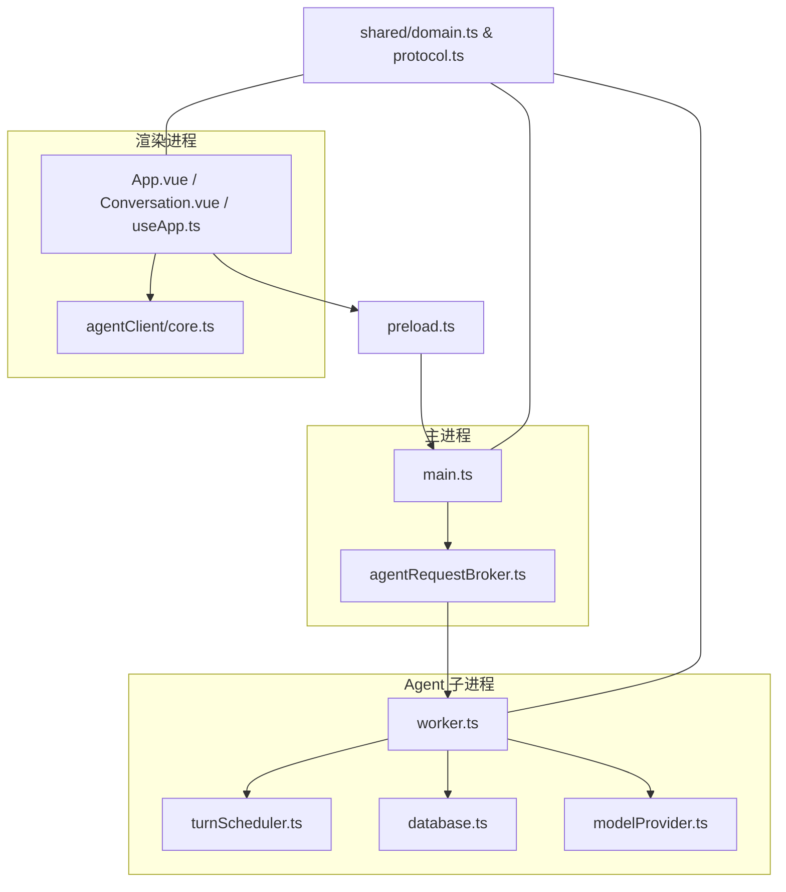
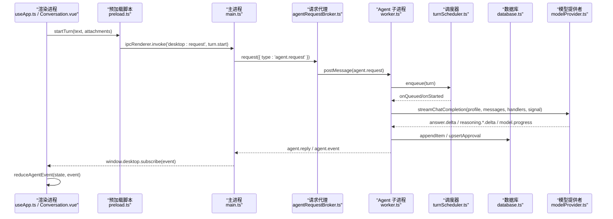
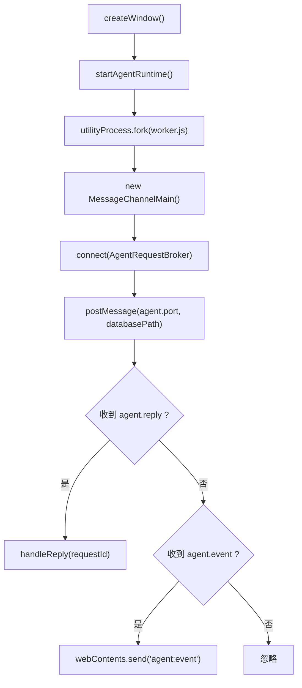
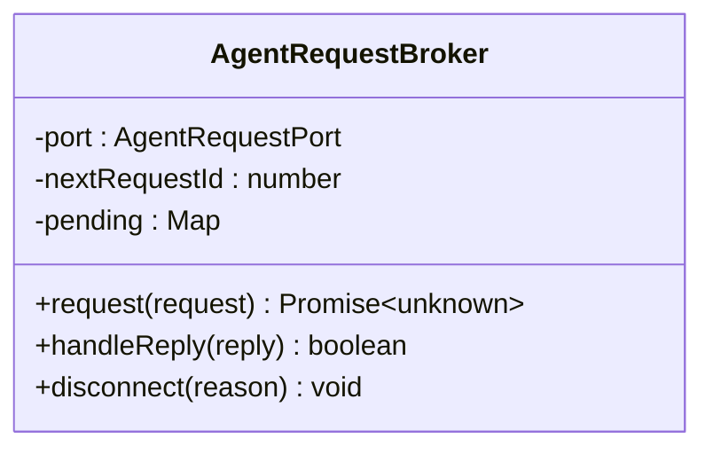
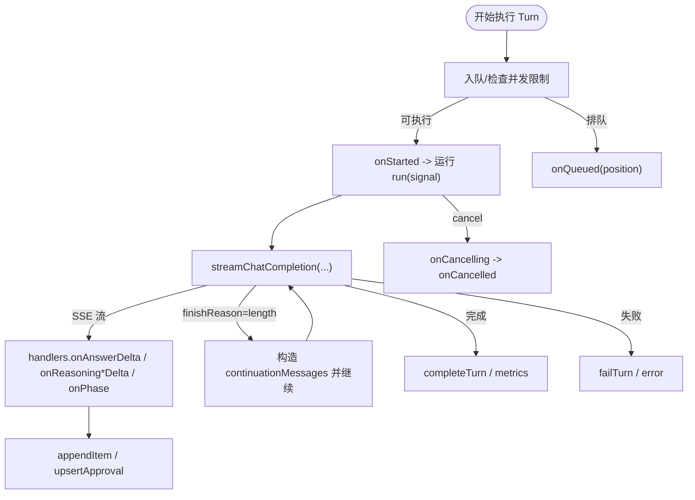
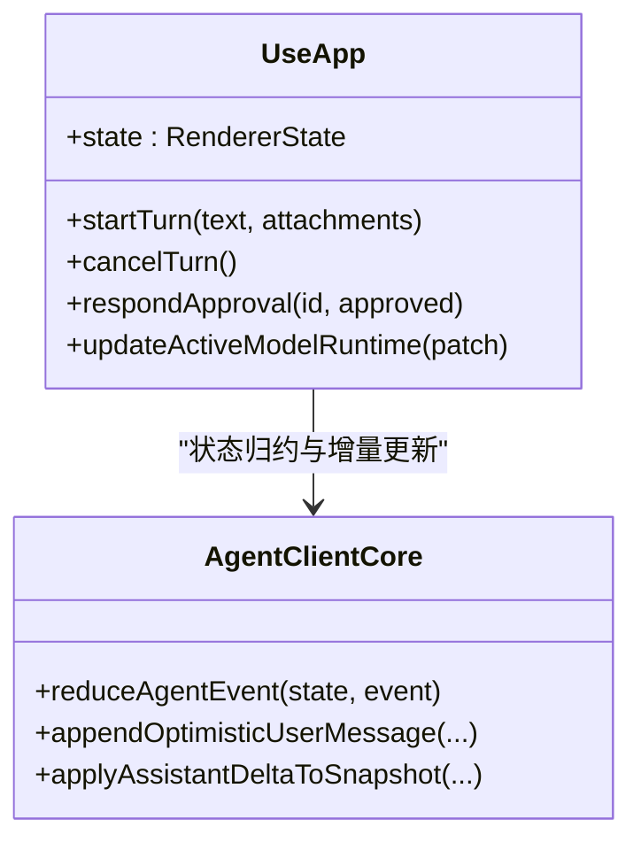
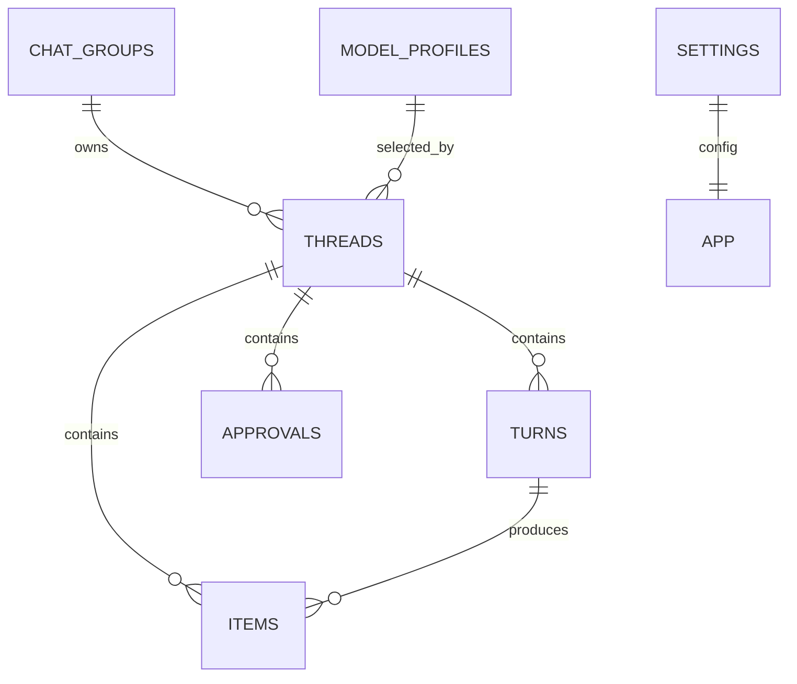
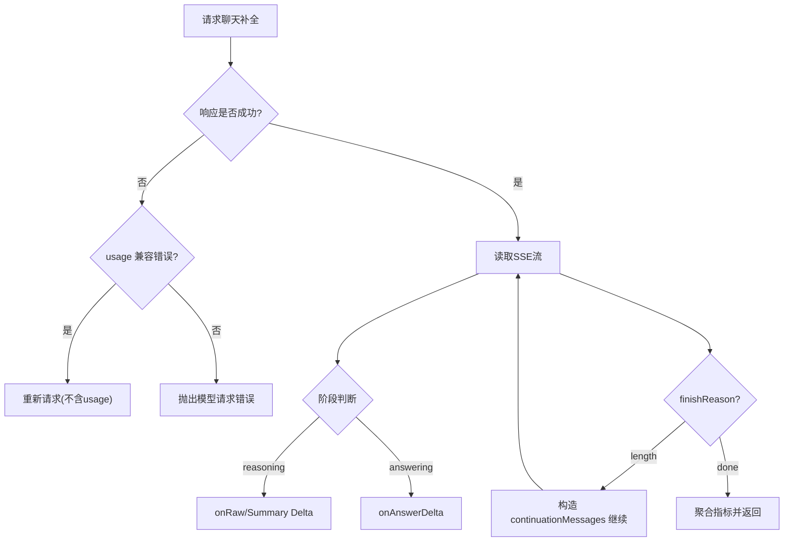
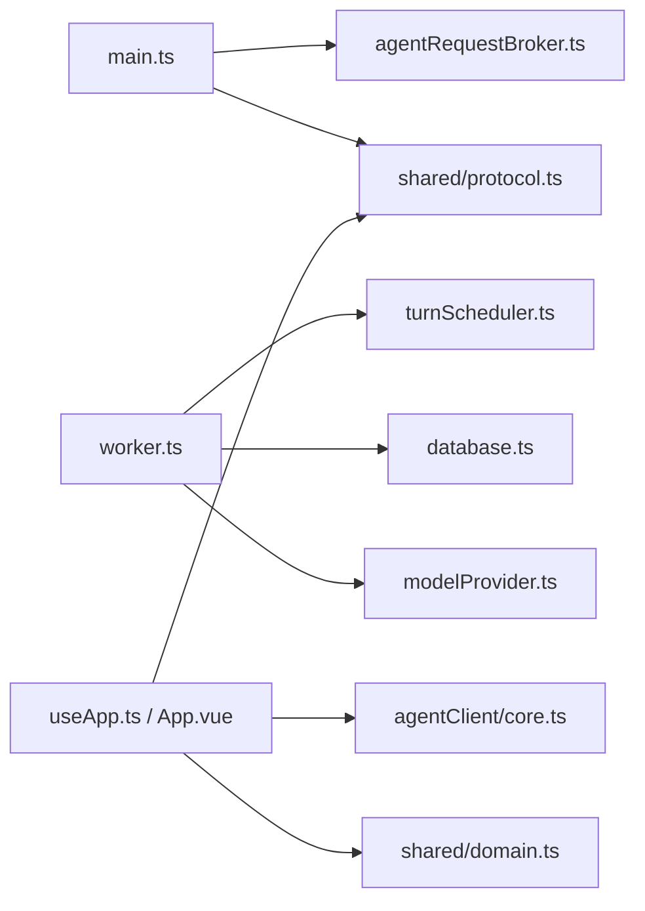

# 核心模块

<cite>
**本文引用的文件**
- [src/main.ts](file://src/main.ts)
- [src/preload.ts](file://src/preload.ts)
- [src/main/agentRequestBroker.ts](file://src/main/agentRequestBroker.ts)
- [src/agent/worker.ts](file://src/agent/worker.ts)
- [src/agent/database.ts](file://src/agent/database.ts)
- [src/agent/turnScheduler.ts](file://src/agent/turnScheduler.ts)
- [src/agent/modelProvider.ts](file://src/agent/modelProvider.ts)
- [src/shared/domain.ts](file://src/shared/domain.ts)
- [src/shared/protocol.ts](file://src/shared/protocol.ts)
- [src/renderer/App.vue](file://src/renderer/App.vue)
- [src/renderer/components/Conversation.vue](file://src/renderer/components/Conversation.vue)
- [src/renderer/composables/useApp.ts](file://src/renderer/composables/useApp.ts)
- [src/agentClient/core.ts](file://src/agentClient/core.ts)
</cite>

## 目录
1. [简介](#简介)
2. [项目结构](#项目结构)
3. [核心组件](#核心组件)
4. [架构总览](#架构总览)
5. [详细组件分析](#详细组件分析)
6. [依赖关系分析](#依赖关系分析)
7. [性能考量](#性能考量)
8. [故障排查指南](#故障排查指南)
9. [结论](#结论)
10. [附录](#附录)

## 简介
本文件为 Private AI Desktop 的核心模块综合文档，聚焦以下目标：
- Agent 工作进程的任务调度、模型调用管理、流式响应处理与错误重试机制
- 主进程的 IPC 通信桥接、窗口管理与进程间消息路由
- 渲染进程的 Vue.js 应用架构、组件层次结构与状态管理
- 数据库表结构、数据迁移策略与查询优化
- 提供具体代码示例路径与使用模式（以“源码路径”形式引用）

## 项目结构
本项目采用 Electron 多进程架构：
- 主进程负责窗口生命周期、启动 Agent 子进程、IPC 桥接与请求路由
- Agent 子进程负责任务调度、持久化、模型调用与事件推送
- 渲染进程基于 Vue 3 构建 UI，通过 preload 暴露安全 API 与主进程交互
- shared 层定义领域模型与协议类型，保证跨进程类型一致

图表来源
- [src/main.ts:1-170](file://src/main.ts#L1-L170)
- [src/main/agentRequestBroker.ts:1-86](file://src/main/agentRequestBroker.ts#L1-L86)
- [src/agent/worker.ts:1-689](file://src/agent/worker.ts#L1-L689)
- [src/agent/turnScheduler.ts:1-378](file://src/agent/turnScheduler.ts#L1-L378)
- [src/agent/database.ts:1-800](file://src/agent/database.ts#L1-L800)
- [src/agent/modelProvider.ts:1-800](file://src/agent/modelProvider.ts#L1-L800)
- [src/preload.ts:1-32](file://src/preload.ts#L1-L32)
- [src/shared/domain.ts:1-319](file://src/shared/domain.ts#L1-L319)
- [src/shared/protocol.ts:1-371](file://src/shared/protocol.ts#L1-L371)
- [src/renderer/App.vue:1-199](file://src/renderer/App.vue#L1-L199)
- [src/renderer/components/Conversation.vue:1-515](file://src/renderer/components/Conversation.vue#L1-L515)
- [src/renderer/composables/useApp.ts:1-504](file://src/renderer/composables/useApp.ts#L1-L504)
- [src/agentClient/core.ts:1-800](file://src/agentClient/core.ts#L1-L800)

章节来源
- [src/main.ts:1-170](file://src/main.ts#L1-L170)
- [src/preload.ts:1-32](file://src/preload.ts#L1-L32)
- [src/shared/domain.ts:1-319](file://src/shared/domain.ts#L1-L319)
- [src/shared/protocol.ts:1-371](file://src/shared/protocol.ts#L1-L371)

## 核心组件
- 主进程 IPC 桥接与窗口管理：创建 BrowserWindow、启动 Agent 子进程、维护 MessageChannelMain 通道、转发事件与请求
- Agent 请求代理：带超时与断连处理的请求-应答匹配器
- Agent 工作进程：任务调度、模型调用、流式事件持久化与推送、审批流程
- 渲染进程状态机：快照+增量事件的状态合并、乐观更新、运行时状态投影
- 数据库：SQLite 持久化、迁移、事务与查询优化
- 模型提供者：SSE 流式读取、上下文压缩、重试与指标聚合

章节来源
- [src/main.ts:1-170](file://src/main.ts#L1-L170)
- [src/main/agentRequestBroker.ts:1-86](file://src/main/agentRequestBroker.ts#L1-L86)
- [src/agent/worker.ts:1-689](file://src/agent/worker.ts#L1-L689)
- [src/agent/turnScheduler.ts:1-378](file://src/agent/turnScheduler.ts#L1-L378)
- [src/agent/modelProvider.ts:1-800](file://src/agent/modelProvider.ts#L1-L800)
- [src/agent/database.ts:1-800](file://src/agent/database.ts#L1-L800)
- [src/renderer/composables/useApp.ts:1-504](file://src/renderer/composables/useApp.ts#L1-L504)
- [src/agentClient/core.ts:1-800](file://src/agentClient/core.ts#L1-L800)

## 架构总览
下图展示了从渲染进程到模型服务的完整调用链，包括 IPC、调度、流式响应与状态同步。

图表来源
- [src/renderer/composables/useApp.ts:189-230](file://src/renderer/composables/useApp.ts#L189-L230)
- [src/preload.ts:15-25](file://src/preload.ts#L15-L25)
- [src/main.ts:103-144](file://src/main.ts#L103-L144)
- [src/main/agentRequestBroker.ts:33-63](file://src/main/agentRequestBroker.ts#L33-L63)
- [src/agent/worker.ts:417-442](file://src/agent/worker.ts#L417-L442)
- [src/agent/turnScheduler.ts:47-72](file://src/agent/turnScheduler.ts#L47-L72)
- [src/agent/modelProvider.ts:55-197](file://src/agent/modelProvider.ts#L55-L197)
- [src/agent/database.ts:475-524](file://src/agent/database.ts#L475-L524)
- [src/agentClient/core.ts:55-174](file://src/agentClient/core.ts#L55-L174)

## 详细组件分析

### 主进程 IPC 桥接与窗口管理
- 窗口创建与安全策略：启用沙箱、禁用 Node 集成、限制导航与外链打开
- Agent 子进程生命周期：fork 启动、端口通道建立、异常退出与关闭清理
- IPC 路由：将渲染进程请求转为 agent.request，并转发 agent.reply 与 agent.event
- 健康检查：暴露 app:health 接口

图表来源
- [src/main.ts:56-96](file://src/main.ts#L56-L96)
- [src/main.ts:19-54](file://src/main.ts#L19-L54)
- [src/main.ts:98-144](file://src/main.ts#L98-L144)

章节来源
- [src/main.ts:1-170](file://src/main.ts#L1-L170)

### Agent 请求代理（超时与断连）
- 请求-应答匹配：为每个请求生成 requestId，维护 pending Map
- 超时控制：默认 30s 超时，超时后拒绝 Promise
- 断连处理：断开时批量拒绝所有待处理请求

图表来源
- [src/main/agentRequestBroker.ts:15-85](file://src/main/agentRequestBroker.ts#L15-L85)

章节来源
- [src/main/agentRequestBroker.ts:1-86](file://src/main/agentRequestBroker.ts#L1-L86)

### Agent 工作进程：任务调度、模型调用、流式处理与错误重试
- 任务调度：按线程唯一性约束与模型并发上限进行排队与执行；支持取消与队列位置广播
- 模型调用：streamChatCompletion 支持 SSE 流式解析、上下文压缩、长度限制续写、指标聚合
- 流式事件：answer.delta、reasoning.raw.delta、reasoning.summary.delta、model.progress 等
- 错误与重试：上下文超限自动压缩并重试；HTTP 500 且已压缩则直接报错；连接测试超时返回结果
- 审批流程：demo 模式或特定场景触发 approval.required，等待用户批准后再继续

图表来源
- [src/agent/worker.ts:155-405](file://src/agent/worker.ts#L155-L405)
- [src/agent/turnScheduler.ts:47-117](file://src/agent/turnScheduler.ts#L47-L117)
- [src/agent/modelProvider.ts:55-197](file://src/agent/modelProvider.ts#L55-L197)
- [src/agent/database.ts:423-449](file://src/agent/database.ts#L423-L449)

章节来源
- [src/agent/worker.ts:1-689](file://src/agent/worker.ts#L1-L689)
- [src/agent/turnScheduler.ts:1-378](file://src/agent/turnScheduler.ts#L1-L378)
- [src/agent/modelProvider.ts:1-800](file://src/agent/modelProvider.ts#L1-L800)
- [src/agent/database.ts:1-800](file://src/agent/database.ts#L1-L800)

### 渲染进程：Vue 应用架构、组件层次与状态管理
- 组件层次：App.vue 作为容器，Sidebar/Conversation/Inspector/SettingsView 组合视图
- 状态管理：useApp 封装 startInitialAgentSync，订阅 agent.event，合并 snapshot 与增量事件
- 乐观更新：startTurn 先本地插入用户消息并设置 queued，再等待服务端确认
- 运行时状态：根据事件序列号去重与顺序保证，维护 runtimeByThread、currentTurnByThread、supersededTurns
- 流式展示：Conversation 组件根据事件与 items 渲染时间线、推理面板、进度指示

图表来源
- [src/renderer/composables/useApp.ts:45-97](file://src/renderer/composables/useApp.ts#L45-L97)
- [src/renderer/composables/useApp.ts:189-230](file://src/renderer/composables/useApp.ts#L189-L230)
- [src/agentClient/core.ts:55-174](file://src/agentClient/core.ts#L55-L174)
- [src/renderer/components/Conversation.vue:1-515](file://src/renderer/components/Conversation.vue#L1-L515)

章节来源
- [src/renderer/App.vue:1-199](file://src/renderer/App.vue#L1-L199)
- [src/renderer/components/Conversation.vue:1-515](file://src/renderer/components/Conversation.vue#L1-L515)
- [src/renderer/composables/useApp.ts:1-504](file://src/renderer/composables/useApp.ts#L1-L504)
- [src/agentClient/core.ts:1-800](file://src/agentClient/core.ts#L1-L800)

### 数据库设计、迁移与查询优化
- 表结构
  - threads：会话列表，含 group_id、status、model_profile_id、deleted_at
  - chat_groups：分组，含 deleted_at
  - turns：轮次记录，含 status、started_at、completed_at、error、incomplete、metrics
  - items：消息与推理片段，payload JSON，关联 thread_id、turn_id
  - approvals：审批项，关联 thread_id、turn_id，status 与 responded_at
  - settings：键值配置，如 theme、language、activeModelProfileId、contextMessageLimit、reasoningDisplayMode
  - model_profiles：模型配置，包含 capabilities、reasoning、max_concurrency、max_output_tokens、response_speed、is_default
  - schema_migrations：迁移版本记录
- 迁移策略
  - 初始化建表与默认值
  - ensureColumn 动态添加字段（如 model_profile_id、group_id、deleted_at、started_at、completed_at、error、incomplete、metrics、reasoning、max_concurrency、max_output_tokens、response_speed）
  - applyMigration 编号化迁移，如压缩助手消息片段、修复历史完成标记、修复或注入本地 Qwen 配置
  - 启动时中断未完成轮次，确保一致性
- 查询优化
  - WAL 模式与外键开启，busy_timeout 提升并发写入稳定性
  - 使用 JOIN 过滤已删除线程，减少无效数据
  - 合并 assistant 连续片段，降低前端渲染压力
  - 分页与 limit 控制上下文消息数量

图表来源
- [src/agent/database.ts:637-758](file://src/agent/database.ts#L637-L758)

章节来源
- [src/agent/database.ts:1-800](file://src/agent/database.ts#L1-L800)

### 模型调用管理、流式响应与错误重试
- 流式读取：readSSEDeltas 解析 SSE 行，维护 eventId 去重，阶段切换（connecting -> reasoning -> answering），[DONE] 结束
- 上下文压缩：当接近上下文限制时，对系统消息、历史摘要、最新用户消息进行压缩，提示“局部上下文压缩激活”
- 长度限制续写：finishReason=length 时，构造 continuationMessages 继续请求，直到完成
- 重试与兼容：若首次请求因 usage 兼容问题失败，尝试不带 usage 的请求；若仍失败则抛出错误
- 指标聚合：合并多次尝试的 tokens、速率、观察到的 reasoningTokens，计算 timeToFirstTokenMs、tokensPerSecond

图表来源
- [src/agent/modelProvider.ts:55-197](file://src/agent/modelProvider.ts#L55-L197)
- [src/agent/modelProvider.ts:563-680](file://src/agent/modelProvider.ts#L563-L680)
- [src/agent/modelProvider.ts:762-795](file://src/agent/modelProvider.ts#L762-L795)

章节来源
- [src/agent/modelProvider.ts:1-800](file://src/agent/modelProvider.ts#L1-L800)

## 依赖关系分析
- 主进程依赖 AgentRequestBroker 管理请求生命周期，依赖 shared/protocol 校验请求与事件
- Agent 子进程依赖 turnScheduler 控制并发与队列，依赖 database 持久化，依赖 modelProvider 调用模型
- 渲染进程依赖 agentClient/core 进行状态归约，依赖 preload 暴露的安全 API
- shared/domain 与 shared/protocol 贯穿各层，确保类型一致与协议安全

图表来源
- [src/main.ts:1-170](file://src/main.ts#L1-L170)
- [src/agent/worker.ts:1-689](file://src/agent/worker.ts#L1-L689)
- [src/renderer/composables/useApp.ts:1-504](file://src/renderer/composables/useApp.ts#L1-L504)
- [src/shared/protocol.ts:1-371](file://src/shared/protocol.ts#L1-L371)
- [src/shared/domain.ts:1-319](file://src/shared/domain.ts#L1-L319)

章节来源
- [src/main.ts:1-170](file://src/main.ts#L1-L170)
- [src/agent/worker.ts:1-689](file://src/agent/worker.ts#L1-L689)
- [src/renderer/composables/useApp.ts:1-504](file://src/renderer/composables/useApp.ts#L1-L504)
- [src/shared/protocol.ts:1-371](file://src/shared/protocol.ts#L1-L371)
- [src/shared/domain.ts:1-319](file://src/shared/domain.ts#L1-L319)

## 性能考量
- 并发与限流：按模型 profile 的 maxConcurrency 限制并行度，避免过载
- 上下文压缩：在接近上下文限制时主动压缩历史，减少请求体积与失败概率
- 流式传输：SSE 增量推送，降低首字延迟，提升用户体验
- 数据库优化：WAL 模式、JOIN 过滤软删除、合并 assistant 片段、limit 控制上下文大小
- 超时与取消：请求级超时、信号驱动取消，防止资源泄漏

## 故障排查指南
- 模型连接测试超时：testModelProfile 会返回超时结果，检查 baseUrl、apiKey 与网络连通性
- 上下文超限：若出现“超出可用上下文”，会自动压缩并重试；若仍失败，检查模型能力与输入长度
- 流式中断：AbortSignal 被触发时，终止读取并释放 reader lock，避免占用调度槽位
- 审批失败：approval.respond 需处于 pending 状态，否则抛错；可在 UI 中查看 pendingApproval 与错误提示
- 请求超时：AgentRequestBroker 默认 30s 超时，渲染端 startTurn 有 10s 确认超时，检查后端响应与网络

章节来源
- [src/agent/modelProvider.ts:535-561](file://src/agent/modelProvider.ts#L535-L561)
- [src/agent/modelProvider.ts:695-756](file://src/agent/modelProvider.ts#L695-L756)
- [src/main/agentRequestBroker.ts:33-63](file://src/main/agentRequestBroker.ts#L33-L63)
- [src/renderer/composables/useApp.ts:259-307](file://src/renderer/composables/useApp.ts#L259-L307)

## 结论
Private AI Desktop 通过清晰的多进程分层与严格的协议类型约束，实现了高可靠的任务调度、流式响应与状态同步。Agent 子进程集中处理模型调用与持久化，主进程专注 IPC 与窗口管理，渲染进程通过乐观更新与事件归约提供流畅体验。数据库采用 SQLite 并配合迁移与优化策略，保障数据一致性与性能。整体架构具备良好的扩展性与可维护性。

## 附录
- 关键 API 与事件类型参考
  - DesktopRequest：snapshot.get、group.create/delete、thread.create/delete/setModel、turn.start/cancel、approval.respond、modelProfile.save/delete/test、settings.update、workspace.register/delete、language.set、theme.set
  - AgentEvent：snapshot、turn.queued/started/cancelling/completed/failed/cancelled、message.delta、answer.delta、reasoning.raw/summary.delta、model.progress、tool.started/output、model.metrics、approval.required
- 使用模式示例（以源码路径引用）
  - 发起对话：见 [src/renderer/composables/useApp.ts:189-230](file://src/renderer/composables/useApp.ts#L189-L230)
  - 订阅事件：见 [src/preload.ts:26-31](file://src/preload.ts#L26-L31)
  - 模型测试：见 [src/agent/modelProvider.ts:535-561](file://src/agent/modelProvider.ts#L535-L561)
  - 流式输出：见 [src/agent/modelProvider.ts:563-680](file://src/agent/modelProvider.ts#L563-L680)
  - 状态归约：见 [src/agentClient/core.ts:55-174](file://src/agentClient/core.ts#L55-L174)