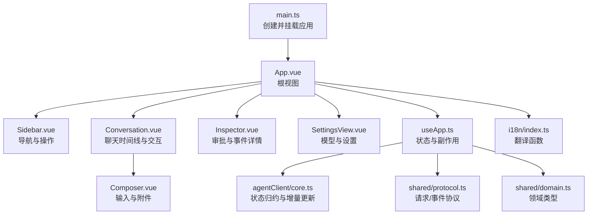
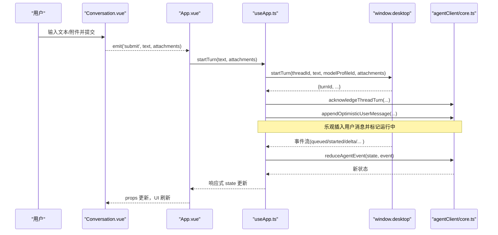
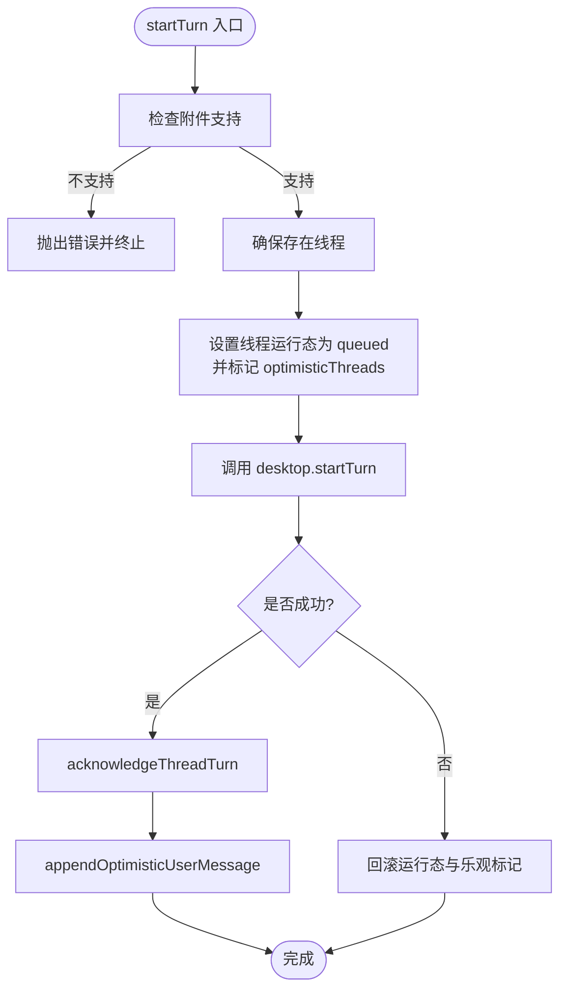
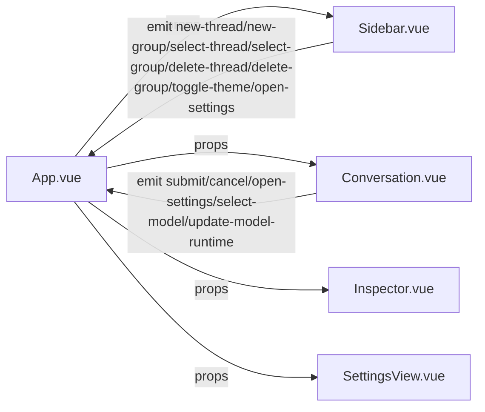
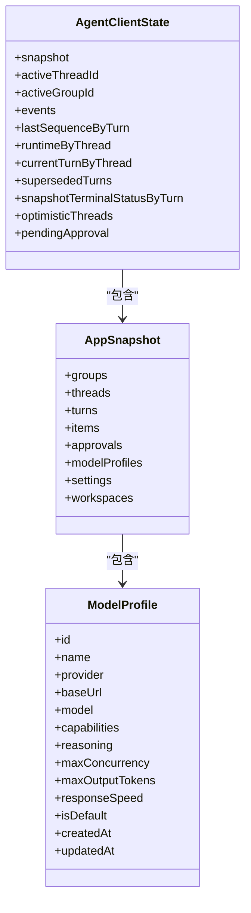
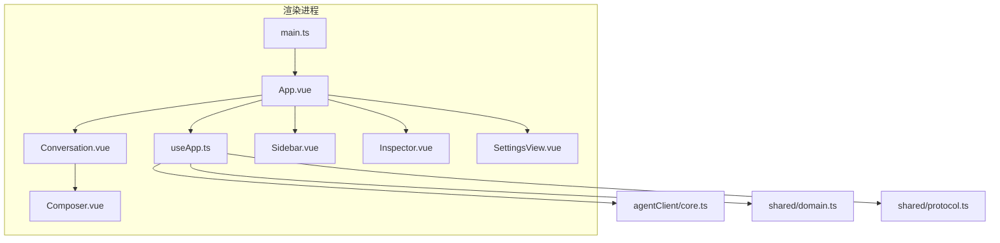

# Vue.js 应用架构

<cite>
**本文引用的文件**
- [src/renderer/main.ts](file://src/renderer/main.ts)
- [src/renderer/App.vue](file://src/renderer/App.vue)
- [src/renderer/composables/useApp.ts](file://src/renderer/composables/useApp.ts)
- [src/agentClient/core.ts](file://src/agentClient/core.ts)
- [src/shared/domain.ts](file://src/shared/domain.ts)
- [src/shared/protocol.ts](file://src/shared/protocol.ts)
- [src/renderer/components/Conversation.vue](file://src/renderer/components/Conversation.vue)
- [src/renderer/components/Sidebar.vue](file://src/renderer/components/Sidebar.vue)
- [src/renderer/components/Composer.vue](file://src/renderer/components/Composer.vue)
- [src/renderer/i18n/index.ts](file://src/renderer/i18n/index.ts)
- [package.json](file://package.json)
- [vite.renderer.config.ts](file://vite.renderer.config.ts)
</cite>

## 目录
1. [简介](#简介)
2. [项目结构](#项目结构)
3. [核心组件](#核心组件)
4. [架构总览](#架构总览)
5. [详细组件分析](#详细组件分析)
6. [依赖关系分析](#依赖关系分析)
7. [性能考量](#性能考量)
8. [故障排查指南](#故障排查指南)
9. [结论](#结论)
10. [附录：扩展与最佳实践](#附录：扩展与最佳实践)

## 简介
本仓库是一个基于 Vue 3 + Vite + Electron 的桌面端 AI 客户端。渲染进程使用 Vue 构建 UI，通过 composable 集中管理状态、事件流与副作用；主进程能力通过 window.desktop 暴露给渲染进程。应用以“快照 + 增量事件”的方式维护会话、消息、模型配置与运行时状态，支持多工作区、分组、线程（对话）、模型配置、推理模式与审批流程。

## 项目结构
- 入口与初始化
  - 渲染进程入口创建并挂载根组件
  - 主题样式在入口引入
- 视图层
  - App.vue 作为根容器，组合 Sidebar、Conversation、Inspector、SettingsView
  - Conversation 负责聊天时间线、推理面板、滚动行为与用户输入
  - Sidebar 展示分组与线程列表、运行状态与操作
  - Composer 处理文本与图片附件提交
- 状态与事件
  - useApp 封装响应式状态、计算属性、副作用与业务方法
  - agentClient/core 提供不可变状态归约器 reduceAgentEvent、增量合并与乐观更新
  - shared/domain 定义领域模型（线程、消息、模型配置、设置等）
  - shared/protocol 定义跨进程协议与校验器
- 国际化
  - i18n 提供翻译函数 createTranslator，按语言切换

图表来源
- [src/renderer/main.ts:1-7](file://src/renderer/main.ts#L1-L7)
- [src/renderer/App.vue:1-199](file://src/renderer/App.vue#L1-L199)
- [src/renderer/composables/useApp.ts:1-519](file://src/renderer/composables/useApp.ts#L1-L519)
- [src/agentClient/core.ts:1-868](file://src/agentClient/core.ts#L1-L868)
- [src/shared/domain.ts:1-319](file://src/shared/domain.ts#L1-L319)
- [src/shared/protocol.ts:1-371](file://src/shared/protocol.ts#L1-L371)
- [src/renderer/i18n/index.ts:1-15](file://src/renderer/i18n/index.ts#L1-L15)

章节来源
- [src/renderer/main.ts:1-7](file://src/renderer/main.ts#L1-L7)
- [package.json:1-35](file://package.json#L1-L35)
- [vite.renderer.config.ts:1-7](file://vite.renderer.config.ts#L1-L7)

## 核心组件
- 应用初始化
  - main.ts 创建 Vue 应用并挂载到 #app，加载主题样式
- 根视图 App.vue
  - 使用 useApp 获取全局状态与方法
  - 管理本地视图路由 view = 'chat' | 'settings'
  - 组合子组件并通过 props/emits 传递数据与事件
  - 处理主题切换、错误提示、模型运行时更新、发送回合、审批响应
- 聊天 Conversation.vue
  - 接收线程、消息项、回合、事件、运行时状态等 props
  - 计算时间线条目、推理分组、推理面板映射
  - 实现自动滚动、复制、推理菜单、模型选择与运行时控制
  - 通过 emits 向父级提交消息、取消、打开设置、选择模型、更新运行时
- 侧边栏 Sidebar.vue
  - 展示分组与线程列表，显示线程运行状态
  - 触发新建线程/分组、选择线程/分组、删除、切换主题、打开设置
- 输入框 Composer.vue
  - 支持文本与图片附件上传，限制数量与大小
  - 根据当前运行时决定按钮文案与禁用状态
  - 提交时发出 submit(cancel/send) 事件

章节来源
- [src/renderer/App.vue:1-199](file://src/renderer/App.vue#L1-L199)
- [src/renderer/components/Conversation.vue:1-515](file://src/renderer/components/Conversation.vue#L1-L515)
- [src/renderer/components/Sidebar.vue:1-130](file://src/renderer/components/Sidebar.vue#L1-L130)
- [src/renderer/components/Composer.vue:1-181](file://src/renderer/components/Composer.vue#L1-L181)

## 架构总览
应用采用“视图层 + Composable 状态层 + 领域/协议层”的分层设计：
- 视图层：Vue 组件负责 UI 与交互，仅持有少量本地 UI 状态
- 状态层：useApp 聚合响应式 state、computed、生命周期与副作用，调用 agentClient 的 reduce 与工具函数进行状态更新
- 领域/协议层：domain 定义数据结构，protocol 定义跨进程请求与事件类型并提供校验

图表来源
- [src/renderer/components/Conversation.vue:1-515](file://src/renderer/components/Conversation.vue#L1-L515)
- [src/renderer/App.vue:1-199](file://src/renderer/App.vue#L1-L199)
- [src/renderer/composables/useApp.ts:1-519](file://src/renderer/composables/useApp.ts#L1-L519)
- [src/agentClient/core.ts:1-868](file://src/agentClient/core.ts#L1-L868)

## 详细组件分析

### useApp 设计与模式
- 响应式状态
  - 使用 ref<RendererState> 保存 AgentClientState，包含 snapshot、events、runtimeByThread、currentTurnByThread、supersededTurns、optimisticThreads、pendingApproval 等
  - computed 派生 activeThread、activeItems、activeTurns、activeRuntime、activeBusy、activeModelProfile 等
- 事件订阅与同步
  - onMounted 启动初始同步：读取快照、缓冲事件、应用快照后关闭缓冲并标记 ready
  - 订阅事件流，将事件通过 reduceAgentEvent 归约为新状态
- 副作用管理
  - 调用 window.desktop 执行持久化或远端操作（创建/删除组与线程、开始/取消回合、保存模型配置、更新设置、设置语言等）
  - 失败回滚：对乐观更新（如 optimisticThreads、runtimeByThread）在失败时恢复
- 超时与健壮性
  - withTimeout 包装 startTurn 与 updateActiveModelRuntime，避免长时间阻塞
  - 审批响应具备重试与快照回退逻辑，确保最终一致性

图表来源
- [src/renderer/composables/useApp.ts:191-232](file://src/renderer/composables/useApp.ts#L191-L232)
- [src/agentClient/core.ts:183-206](file://src/agentClient/core.ts#L183-L206)
- [src/agentClient/core.ts:452-475](file://src/agentClient/core.ts#L452-L475)

章节来源
- [src/renderer/composables/useApp.ts:1-519](file://src/renderer/composables/useApp.ts#L1-L519)
- [src/agentClient/core.ts:1-868](file://src/agentClient/core.ts#L1-L868)

### 组件层次结构与通信
- 父子通信
  - App.vue 通过 props 将状态与方法传递给 Sidebar、Conversation、Inspector、SettingsView
  - 子组件通过 emits 向上抛出事件（如 new-thread、select-thread、submit、open-settings 等），由 App.vue 统一协调
- 事件驱动的状态更新
  - 所有写操作先调用 useApp 的方法，再由其调用 window.desktop 并归约事件，保证单一真实来源
- 视图路由
  - App.vue 使用本地 ref view 切换 chat/settings，无外部路由库

图表来源
- [src/renderer/App.vue:1-199](file://src/renderer/App.vue#L1-L199)
- [src/renderer/components/Conversation.vue:1-515](file://src/renderer/components/Conversation.vue#L1-L515)
- [src/renderer/components/Sidebar.vue:1-130](file://src/renderer/components/Sidebar.vue#L1-L130)

章节来源
- [src/renderer/App.vue:1-199](file://src/renderer/App.vue#L1-L199)
- [src/renderer/components/Conversation.vue:1-515](file://src/renderer/components/Conversation.vue#L1-L515)
- [src/renderer/components/Sidebar.vue:1-130](file://src/renderer/components/Sidebar.vue#L1-L130)

### 状态管理模式与数据流
- 领域模型
  - domain.ts 定义了线程、消息、工具、变更、审批、模型配置、设置、工作区等类型
- 协议与校验
  - protocol.ts 定义了 DesktopRequest 与 AgentEvent，并提供 isDesktopRequest、isAgentEvent 等校验函数，保障跨进程数据契约
- 状态归约
  - agentClient/core.ts 的 reduceAgentEvent 处理 snapshot 与序列化的增量事件，维护 runtime 状态、消息增量、审批与终态标记
  - 支持乐观更新与回滚，保证 UI 即时反馈与最终一致

图表来源
- [src/agentClient/core.ts:14-26](file://src/agentClient/core.ts#L14-L26)
- [src/shared/domain.ts:283-292](file://src/shared/domain.ts#L283-L292)
- [src/shared/domain.ts:160-176](file://src/shared/domain.ts#L160-L176)

章节来源
- [src/shared/domain.ts:1-319](file://src/shared/domain.ts#L1-L319)
- [src/shared/protocol.ts:1-371](file://src/shared/protocol.ts#L1-L371)
- [src/agentClient/core.ts:1-868](file://src/agentClient/core.ts#L1-L868)

### 生命周期钩子与副作用
- 应用挂载
  - onMounted 启动初始同步：读取快照、订阅事件、缓冲事件直到快照就绪
- 卸载清理
  - onUnmounted 取消事件订阅，防止内存泄漏
- 副作用边界
  - 所有与 window.desktop 的交互集中在 useApp，便于测试与回滚
  - 超时保护避免长时间等待导致 UI 卡死

章节来源
- [src/renderer/composables/useApp.ts:146-164](file://src/renderer/composables/useApp.ts#L146-L164)
- [src/renderer/composables/useApp.ts:504-518](file://src/renderer/composables/useApp.ts#L504-L518)

### 路由切换机制与视图管理
- 使用本地 ref view 在 'chat' 与 'settings' 之间切换
- 通过 v-if 条件渲染 Conversation 或 SettingsView
- 侧边栏与聊天区域共享状态，切换视图不影响全局状态

章节来源
- [src/renderer/App.vue:13-15](file://src/renderer/App.vue#L13-L15)
- [src/renderer/App.vue:146-196](file://src/renderer/App.vue#L146-L196)

### 组件间通信模式
- Props 传递
  - 从 App.vue 向下传递线程、消息、事件、运行时、模型配置、设置、翻译函数等
- 事件发射
  - 子组件通过 emits 上报用户意图（提交、取消、选择模型、打开设置等）
- 状态同步
  - 所有写操作经 useApp 统一处理，再通过 reduceAgentEvent 保持状态一致

章节来源
- [src/renderer/components/Conversation.vue:31-53](file://src/renderer/components/Conversation.vue#L31-L53)
- [src/renderer/components/Sidebar.vue:8-29](file://src/renderer/components/Sidebar.vue#L8-L29)
- [src/renderer/components/Composer.vue:7-17](file://src/renderer/components/Composer.vue#L7-L17)

## 依赖关系分析
- 模块耦合
  - App.vue 依赖 useApp 与多个子组件
  - useApp 依赖 agentClient/core、shared/domain、shared/protocol 以及 window.desktop
  - 组件只依赖 props 与 emits，降低耦合度
- 外部依赖
  - Vue 3、Vite、Electron（通过 package.json 与 vite.*.config.ts）
- 潜在循环依赖
  - 当前结构清晰，未见循环导入

图表来源
- [src/renderer/main.ts:1-7](file://src/renderer/main.ts#L1-L7)
- [src/renderer/App.vue:1-199](file://src/renderer/App.vue#L1-L199)
- [src/renderer/composables/useApp.ts:1-519](file://src/renderer/composables/useApp.ts#L1-L519)
- [src/agentClient/core.ts:1-868](file://src/agentClient/core.ts#L1-L868)
- [src/shared/domain.ts:1-319](file://src/shared/domain.ts#L1-L319)
- [src/shared/protocol.ts:1-371](file://src/shared/protocol.ts#L1-L371)

章节来源
- [package.json:1-35](file://package.json#L1-L35)
- [vite.renderer.config.ts:1-7](file://vite.renderer.config.ts#L1-L7)

## 性能考量
- 增量更新与流式渲染
  - 使用 applyAssistantDeltaToSnapshot 与 applyReasoningDeltaToSnapshot 增量拼接文本，减少重渲染开销
- 乐观更新与回滚
  - optimisticThreads 与 runtimeByThread 提升即时反馈，失败时回滚保证一致性
- 节流与防抖
  - 自动滚动使用 nextTick 与 requestAnimationFrame 多次定位，避免抖动
- 超时保护
  - withTimeout 避免长耗时操作阻塞 UI
- 计算属性缓存
  - 大量使用 computed 派生视图所需数据，减少重复计算

[本节为通用指导，不直接分析具体文件]

## 故障排查指南
- 常见问题
  - 发送失败：检查 startTurn 超时与错误捕获，确认 window.desktop 能力与网络
  - 审批失败：检查 respondApproval 返回值与快照回退逻辑
  - 模型配置更新失败：检查 updateActiveModelRuntime 超时与回滚
- 调试技巧
  - 观察 visibleEvents 与 runtimeByThread 变化，定位事件流问题
  - 使用浏览器 DevTools 查看组件 props/emits 与 computed 值
  - 通过 i18n 翻译键验证语言切换是否正确

章节来源
- [src/renderer/composables/useApp.ts:207-232](file://src/renderer/composables/useApp.ts#L207-L232)
- [src/renderer/composables/useApp.ts:261-309](file://src/renderer/composables/useApp.ts#L261-L309)
- [src/renderer/composables/useApp.ts:317-364](file://src/renderer/composables/useApp.ts#L317-L364)

## 结论
该 Vue 应用采用清晰的职责分离与事件驱动架构：视图层专注交互，composable 层统一管理状态与副作用，领域与协议层保障数据契约。通过快照+增量事件、乐观更新与超时保护，实现了高响应性与强一致性的用户体验。组件间通过 props/emits 通信，避免了紧耦合，便于扩展与维护。

[本节为总结，不直接分析具体文件]

## 附录：扩展与最佳实践
- 扩展指南
  - 新增功能优先在 useApp 中添加方法与副作用，保持视图层轻量
  - 新增领域类型时，同步更新 domain.ts 与 protocol.ts 的校验逻辑
  - 新增组件遵循 props/emits 约定，避免直接修改全局状态
- 最佳实践
  - 使用 computed 派生视图数据，避免在模板中进行复杂计算
  - 对外部副作用统一封装，便于测试与回滚
  - 对长耗时操作添加超时与错误提示，提升用户体验
  - 使用 i18n 键管理文案，便于多语言支持

[本节为通用指导，不直接分析具体文件]