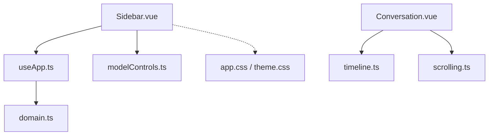
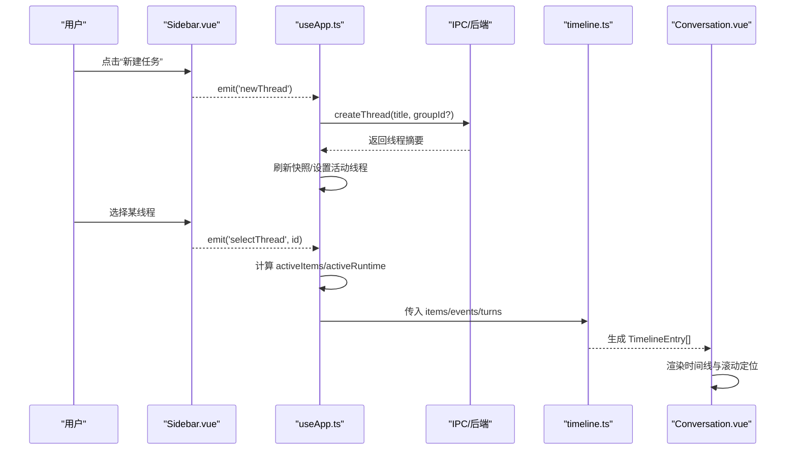
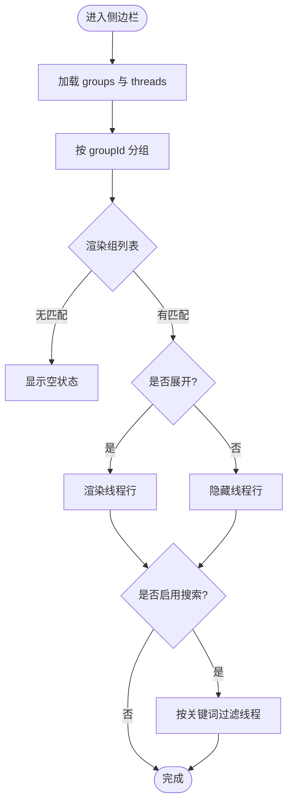
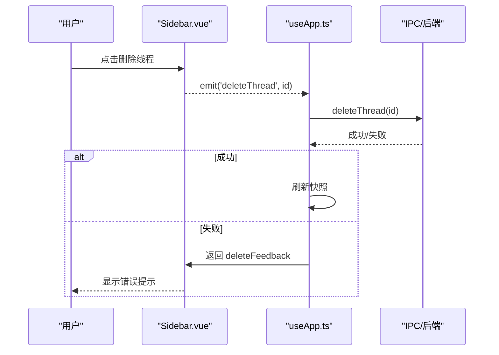
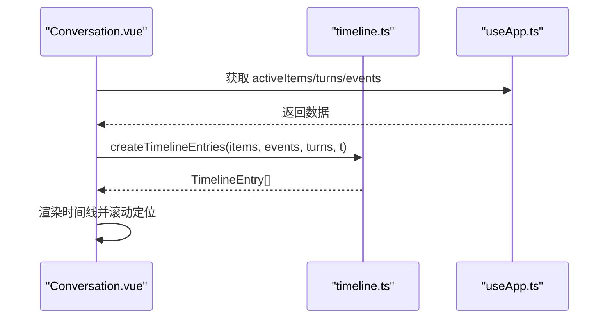
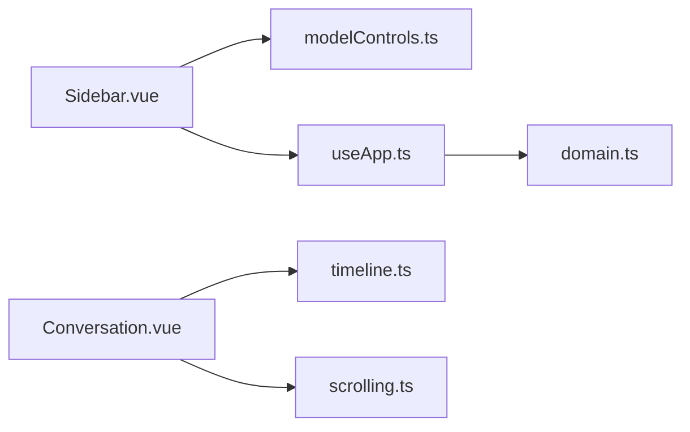

# 侧边栏导航

<cite>
**本文引用的文件**
- [Sidebar.vue](file://src/renderer/components/Sidebar.vue)
- [useApp.ts](file://src/renderer/composables/useApp.ts)
- [domain.ts](file://src/shared/domain.ts)
- [timeline.ts](file://src/renderer/timeline.ts)
- [modelControls.ts](file://src/renderer/modelControls.ts)
- [app.css](file://src/renderer/styles/app.css)
- [theme.css](file://src/renderer/styles/theme.css)
- [Conversation.vue](file://src/renderer/components/Conversation.vue)
- [Composer.vue](file://src/renderer/components/Composer.vue)
- [scrolling.ts](file://src/renderer/scrolling.ts)
- [deleteFeedback.test.ts](file://tests/deleteFeedback.test.ts)
</cite>

## 目录
1. [简介](#简介)
2. [项目结构](#项目结构)
3. [核心组件](#核心组件)
4. [架构总览](#架构总览)
5. [详细组件分析](#详细组件分析)
6. [依赖关系分析](#依赖关系分析)
7. [性能考虑](#性能考虑)
8. [故障排查指南](#故障排查指南)
9. [结论](#结论)
10. [附录](#附录)

## 简介
本文件为“侧边栏导航”组件的完整技术文档，聚焦会话分组与线程管理、树形展示、展开折叠、搜索过滤（扩展点）、会话操作（新建、重命名、删除、移动）、时间线集成（历史浏览与时间轴展示）、拖拽排序与批量操作（扩展点）、键盘快捷键支持、自定义分组规则与自动化脚本示例，以及响应式设计与移动端适配策略。内容基于仓库中现有实现进行说明，并对可扩展能力给出明确指引。

## 项目结构
侧边栏导航由 Vue 组件、状态编排、共享类型、样式与时间线工具共同构成：
- 视图层：Sidebar.vue 负责分组与线程列表渲染、事件派发、运行时状态展示。
- 状态编排：useApp.ts 提供创建/删除分组与线程、启动/取消回合、模型配置等能力，并通过 IPC 与主进程交互。
- 数据模型：domain.ts 定义 ChatGroup、ThreadSummary、TurnRecord、Item、ThreadRuntimeState 等核心类型。
- 时间线：timeline.ts 将消息、推理、工具调用、指标与进度聚合为统一的时间轴条目。
- 运行时呈现：modelControls.ts 将线程运行态转换为 UI 可读的文案与活跃标记。
- 样式：app.css 与 theme.css 提供三栏布局、主题变量与侧边栏样式。
- 对话与输入：Conversation.vue 与 Composer.vue 承载对话与输入行为，配合滚动与键盘交互。

图表来源
- [Sidebar.vue:1-129](file://src/renderer/components/Sidebar.vue#L1-L129)
- [useApp.ts:101-435](file://src/renderer/composables/useApp.ts#L101-L435)
- [domain.ts:7-319](file://src/shared/domain.ts#L7-L319)
- [timeline.ts:41-170](file://src/renderer/timeline.ts#L41-L170)
- [modelControls.ts:134-148](file://src/renderer/modelControls.ts#L134-L148)
- [app.css:25-31](file://src/renderer/styles/app.css#L25-L31)
- [theme.css:1-38](file://src/renderer/styles/theme.css#L1-L38)

章节来源
- [Sidebar.vue:1-129](file://src/renderer/components/Sidebar.vue#L1-L129)
- [useApp.ts:101-435](file://src/renderer/composables/useApp.ts#L101-L435)
- [domain.ts:7-319](file://src/shared/domain.ts#L7-L319)
- [app.css:25-31](file://src/renderer/styles/app.css#L25-L31)
- [theme.css:1-38](file://src/renderer/styles/theme.css#L1-L38)

## 核心组件
- 侧边栏组件（Sidebar.vue）
  - 接收分组、线程、活动线程/分组 ID、运行时状态、删除反馈、加载状态、主题与翻译函数等 props。
  - 通过 computed 将 threads 按 groupId 分组，形成“组-线程”树形结构。
  - 使用 threadRuntimePresentation 计算每条线程的运行态文案与是否活跃。
  - 暴露 newThread、newGroup、selectThread、selectGroup、deleteThread、deleteGroup、toggleTheme、openSettings 等事件。
  - 在组与线程行内显示删除错误提示，并支持空状态文案。

- 应用状态编排（useApp.ts）
  - 维护 RendererState，订阅快照与增量事件，驱动 activeThread、activeItems、activeRuntime 等派生状态。
  - 提供 createGroup、deleteGroup、createThread、deleteThread、startTurn、cancelTurn、respondApproval、selectModelProfile 等方法。
  - 通过 window.desktop.* 调用 IPC，并在成功后刷新快照以保持一致性。

- 共享类型（domain.ts）
  - ChatGroup、ThreadSummary、TurnRecord、Item、ThreadRuntimeState 等定义了侧边栏与时间线的数据契约。

章节来源
- [Sidebar.vue:1-129](file://src/renderer/components/Sidebar.vue#L1-L129)
- [useApp.ts:101-435](file://src/renderer/composables/useApp.ts#L101-L435)
- [domain.ts:7-319](file://src/shared/domain.ts#L7-L319)

## 架构总览
侧边栏作为导航入口，通过事件向父级或状态层发起操作；状态层协调 IPC 与后端，更新全局快照；时间线模块将消息、推理、工具、指标与进度合并为统一序列，供对话面板展示。

图表来源
- [Sidebar.vue:61-120](file://src/renderer/components/Sidebar.vue#L61-L120)
- [useApp.ts:166-189](file://src/renderer/composables/useApp.ts#L166-L189)
- [timeline.ts:41-170](file://src/renderer/timeline.ts#L41-L170)
- [Conversation.vue:301-346](file://src/renderer/components/Conversation.vue#L301-L346)

## 详细组件分析

### 会话分组与线程管理（树形结构、展开/折叠、搜索过滤）
- 树形结构
  - 通过 computed 将 threads 按 groupId 分组，每个 group 包含 threads 数组，形成“组-线程”层级。
  - 组按钮显示名称与线程计数，线程行显示标题与运行态。

- 展开/折叠
  - 当前实现未内置展开/折叠逻辑；可通过扩展组按钮的 v-if/v-show 或添加展开状态控制子项可见性。
  - 建议在组级别增加 isExpanded 状态，结合 CSS 过渡提升体验。

- 搜索过滤
  - 当前未内置搜索框；可在侧边栏顶部增加搜索输入，对 groupsWithThreads 进行过滤（按组名或线程标题）。
  - 建议保留“匹配到线程则自动展开其组”的行为，便于快速定位。

图表来源
- [Sidebar.vue:31-36](file://src/renderer/components/Sidebar.vue#L31-L36)
- [Sidebar.vue:72-120](file://src/renderer/components/Sidebar.vue#L72-L120)

章节来源
- [Sidebar.vue:31-36](file://src/renderer/components/Sidebar.vue#L31-L36)
- [Sidebar.vue:72-120](file://src/renderer/components/Sidebar.vue#L72-L120)

### 会话操作（新建、重命名、删除、移动）
- 新建
  - 触发 newThread 事件后，useApp.createThread 调用 IPC 创建线程，并刷新快照、设置活动线程与分组。
- 删除
  - 触发 deleteThread/deleteGroup 事件后，useApp.deleteThread/deleteGroup 调用 IPC 删除，并刷新快照。
  - 删除失败时，通过 deleteFeedback 机制显示本地化错误信息。
- 重命名
  - 当前未暴露重命名接口；可在组/线程上增加编辑模式，调用 IPC 更新名称后刷新快照。
- 移动
  - 当前未内置移动；可结合拖拽排序将线程从一个组移动到另一个组，调用 setThreadModel 或新增 moveThread API。

图表来源
- [Sidebar.vue:108-116](file://src/renderer/components/Sidebar.vue#L108-L116)
- [useApp.ts:173-189](file://src/renderer/composables/useApp.ts#L173-L189)
- [deleteFeedback.test.ts:1-44](file://tests/deleteFeedback.test.ts#L1-L44)

章节来源
- [useApp.ts:166-189](file://src/renderer/composables/useApp.ts#L166-L189)
- [deleteFeedback.test.ts:1-44](file://tests/deleteFeedback.test.ts#L1-L44)

### 时间线功能集成（会话历史浏览与时间轴展示）
- 时间线构建
  - timeline.ts 将消息、推理、工具调用、指标与进度事件合并为 TimelineEntry[]，处理重复、顺序与终止轮次。
  - 对 assistant 流式输出进行拼接，保证 live 状态下的连贯显示。
- 对话面板集成
  - Conversation.vue 监听滚动位置与活动忙碌状态，自动滚到底部并保持阅读体验。
  - 使用 scrolling.ts 的 isNearBottom 判断是否接近底部。

图表来源
- [timeline.ts:41-170](file://src/renderer/timeline.ts#L41-L170)
- [Conversation.vue:301-346](file://src/renderer/components/Conversation.vue#L301-L346)
- [scrolling.ts:1-11](file://src/renderer/scrolling.ts#L1-L11)

章节来源
- [timeline.ts:41-170](file://src/renderer/timeline.ts#L41-L170)
- [Conversation.vue:301-346](file://src/renderer/components/Conversation.vue#L301-L346)
- [scrolling.ts:1-11](file://src/renderer/scrolling.ts#L1-L11)

### 拖拽排序、批量操作与键盘快捷键
- 拖拽排序
  - 当前未内置拖拽；可在组与线程行上增加 drag-and-drop，实现组内重排与跨组移动。
- 批量操作
  - 可在侧边栏增加多选模式，支持批量删除/移动/归档。
- 键盘快捷键
  - Composer.vue 支持 Enter 提交（Shift+Enter 换行），Conversation.vue 支持菜单键盘导航。
  - 可在侧边栏增加快捷键：N 新建、G 新建组、/ 搜索、Delete 删除选中项等。

章节来源
- [Composer.vue:61-66](file://src/renderer/components/Composer.vue#L61-L66)
- [Conversation.vue:188-196](file://src/renderer/components/Conversation.vue#L188-L196)

### 自定义分组规则与自动化脚本示例
- 自定义分组规则
  - 可在 useApp.createThread 前后插入钩子，根据线程标题/模型/标签自动分配到指定组。
  - 示例思路：若标题包含“测试”，则归入“测试”组；否则默认组。
- 自动化脚本
  - 通过 IPC 暴露的 createGroup/createThread/deleteThread 等接口，编写脚本批量初始化工作区。
  - 示例流程：创建多个组 -> 在每个组下创建若干线程 -> 设置默认模型。

章节来源
- [useApp.ts:166-189](file://src/renderer/composables/useApp.ts#L166-L189)

### 响应式设计与移动端适配策略
- 桌面端布局
  - app.css 使用 grid 定义三栏布局，侧边栏固定宽度范围，中间对话区域自适应。
- 主题切换
  - theme.css 提供明暗主题变量，Sidebar.vue 支持切换主题。
- 移动端适配
  - 当前未提供移动端专用样式；建议在小屏时将侧边栏收起为抽屉，或通过媒体查询调整网格列数。
  - 可结合 CSS Grid 与 Flexbox 实现侧边栏滑出/收起动画。

章节来源
- [app.css:25-31](file://src/renderer/styles/app.css#L25-L31)
- [theme.css:1-38](file://src/renderer/styles/theme.css#L1-L38)
- [Sidebar.vue:122-127](file://src/renderer/components/Sidebar.vue#L122-L127)

## 依赖关系分析
- 组件依赖
  - Sidebar.vue 依赖 domain.ts 的类型、modelControls.ts 的运行时呈现、useApp.ts 的事件处理。
  - Conversation.vue 依赖 timeline.ts 的时间线构建与 scrolling.ts 的滚动辅助。
- 外部依赖
  - 通过 window.desktop.* 与主进程通信，执行分组/线程/回合等操作。

图表来源
- [Sidebar.vue:1-49](file://src/renderer/components/Sidebar.vue#L1-L49)
- [Conversation.vue:301-346](file://src/renderer/components/Conversation.vue#L301-L346)
- [useApp.ts:101-189](file://src/renderer/composables/useApp.ts#L101-L189)

章节来源
- [Sidebar.vue:1-49](file://src/renderer/components/Sidebar.vue#L1-L49)
- [Conversation.vue:301-346](file://src/renderer/components/Conversation.vue#L301-L346)
- [useApp.ts:101-189](file://src/renderer/composables/useApp.ts#L101-L189)

## 性能考虑
- 列表渲染
  - 使用 computed 分组减少重复计算；避免在模板中进行复杂过滤。
- 时间线合并
  - timeline.ts 对 assistant 流式文本进行拼接，减少 DOM 更新次数。
- 滚动优化
  - 使用 requestAnimationFrame 与 isNearBottom 判断，避免频繁滚动导致的抖动。
- 主题与样式
  - 使用 CSS 变量与最小化重绘，确保切换主题时的流畅度。

[本节为通用性能建议，不直接分析具体文件]

## 故障排查指南
- 删除失败反馈
  - 当删除线程或分组失败时，useApp 会返回错误；Sidebar 通过 deleteFeedback 显示本地化消息。
  - 参考测试用例验证不同语言下的错误映射。
- 运行时状态异常
  - 检查 threadRuntimePresentation 是否正确识别 queued/running/cancelling 状态。
  - 确认 IPC 调用是否超时或拒绝，必要时刷新快照恢复一致。

章节来源
- [deleteFeedback.test.ts:1-44](file://tests/deleteFeedback.test.ts#L1-L44)
- [modelControls.ts:134-148](file://src/renderer/modelControls.ts#L134-L148)
- [Sidebar.vue:82-116](file://src/renderer/components/Sidebar.vue#L82-L116)

## 结论
侧边栏导航组件在当前实现中提供了清晰的分组与线程展示、运行时状态指示、基础的新建/删除操作与时间线集成。通过扩展展开/折叠、搜索过滤、拖拽排序、批量操作与快捷键，可进一步提升效率与可用性。响应式方面，建议在小屏设备上引入抽屉式侧边栏以提升体验。

[本节为总结性内容，不直接分析具体文件]

## 附录
- 关键类型速览
  - ChatGroup：分组元数据（id、name、时间戳）
  - ThreadSummary：线程摘要（id、groupId、title、status、时间戳）
  - TurnRecord：回合记录（id、threadId、status、时间戳、指标）
  - Item：消息/推理/工具/变更的统一条目
  - ThreadRuntimeState：线程运行时状态（status、queuePosition、时间戳等）

章节来源
- [domain.ts:7-319](file://src/shared/domain.ts#L7-L319)