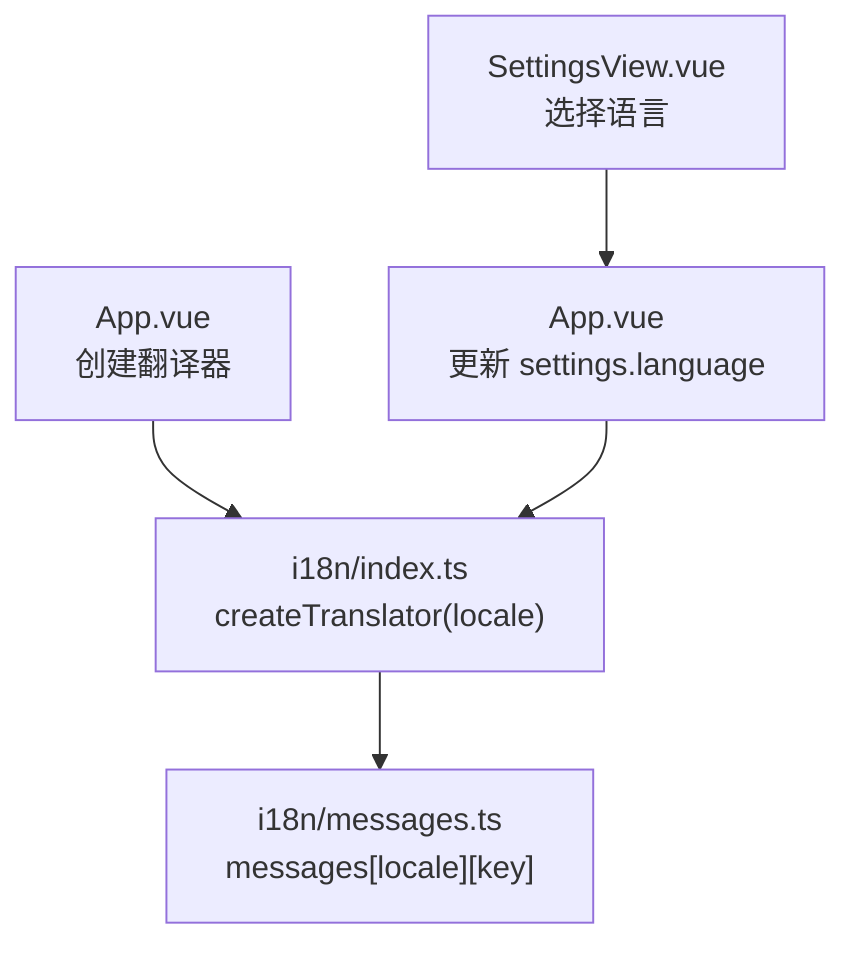
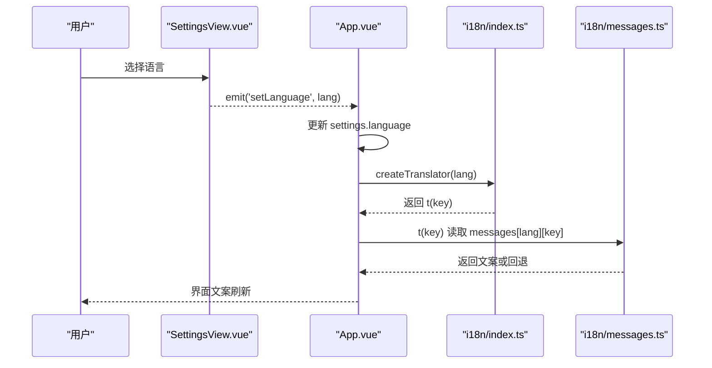
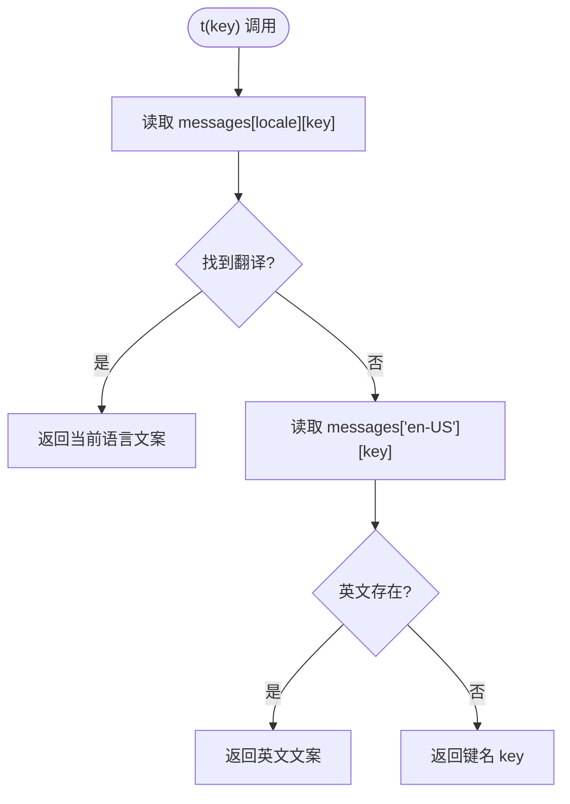
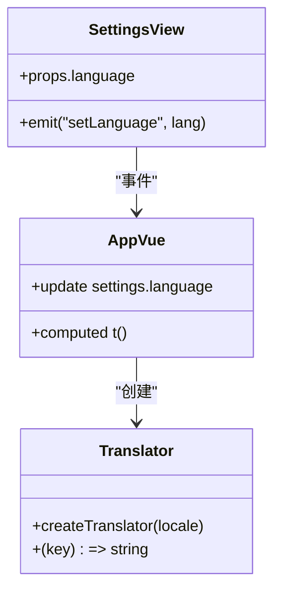
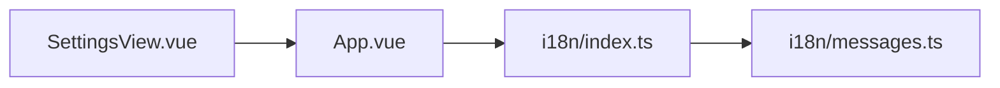

# 国际化支持

<cite>
**本文引用的文件**
- [src/renderer/i18n/index.ts](file://src/renderer/i18n/index.ts)
- [src/renderer/i18n/messages.ts](file://src/renderer/i18n/messages.ts)
- [src/shared/domain.ts](file://src/shared/domain.ts)
- [src/renderer/App.vue](file://src/renderer/App.vue)
- [src/renderer/components/SettingsView.vue](file://src/renderer/components/SettingsView.vue)
- [package.json](file://package.json)
</cite>

## 目录
1. [简介](#简介)
2. [项目结构](#项目结构)
3. [核心组件](#核心组件)
4. [架构总览](#架构总览)
5. [详细组件分析](#详细组件分析)
6. [依赖关系分析](#依赖关系分析)
7. [性能考虑](#性能考虑)
8. [故障排查指南](#故障排查指南)
9. [结论](#结论)
10. [附录](#附录)

## 简介
本文件为应用的国际化（i18n）支持系统提供完整文档。内容涵盖多语言管理机制、翻译函数与动态语言切换、翻译键管理、本地化格式化策略、RTL 与复杂文本布局支持现状，以及新增语言包与翻译贡献流程、质量检查与自动化测试策略。目标是帮助开发者快速理解并安全扩展国际化能力。

## 项目结构
当前实现采用“轻量级翻译器 + 集中式消息字典”的模式：
- 语言偏好类型定义在共享域中，确保主进程与渲染进程一致。
- 渲染层通过 createTranslator 根据当前语言生成翻译函数 t，供 Vue 组件使用。
- 所有文案集中在 messages 文件中，按语言代码组织键值对。
- 设置页提供语言切换入口，变更会触发应用状态更新，从而重建翻译器。

图示来源
- [src/renderer/App.vue:19-20](file://src/renderer/App.vue#L19-L20)
- [src/renderer/i18n/index.ts:8-10](file://src/renderer/i18n/index.ts#L8-L10)
- [src/renderer/i18n/messages.ts:1-393](file://src/renderer/i18n/messages.ts#L1-L393)
- [src/renderer/components/SettingsView.vue:396-401](file://src/renderer/components/SettingsView.vue#L396-L401)

章节来源
- [src/renderer/i18n/index.ts:1-15](file://src/renderer/i18n/index.ts#L1-L15)
- [src/renderer/i18n/messages.ts:1-393](file://src/renderer/i18n/messages.ts#L1-L393)
- [src/shared/domain.ts:1-4](file://src/shared/domain.ts#L1-L4)
- [src/renderer/App.vue:19-20](file://src/renderer/App.vue#L19-L20)
- [src/renderer/components/SettingsView.vue:396-401](file://src/renderer/components/SettingsView.vue#L396-L401)

## 核心组件
- 语言偏好类型 LanguagePreference：限定支持的语言集合，用于类型校验与 UI 下拉选项。
- 翻译器 createTranslator：根据传入 locale 返回一个 t(key) 函数，优先使用当前语言，缺失时回退到英文，再缺失则返回键名本身，保证界面永不空白。
- 消息字典 messages：以语言代码为顶层键，内部为键值对；导出 I18nKey 类型，使调用方获得键的静态类型约束。
- 设置页 SettingsView：提供语言切换控件，将选择的语言通过事件向上传递，由父组件更新全局设置。

章节来源
- [src/shared/domain.ts:1-4](file://src/shared/domain.ts#L1-L4)
- [src/renderer/i18n/index.ts:6-10](file://src/renderer/i18n/index.ts#L6-L10)
- [src/renderer/i18n/messages.ts:1-393](file://src/renderer/i18n/messages.ts#L1-L393)
- [src/renderer/components/SettingsView.vue:396-401](file://src/renderer/components/SettingsView.vue#L396-L401)

## 架构总览
下图展示了从用户切换到语言，到界面文案即时更新的完整流程。

图示来源
- [src/renderer/components/SettingsView.vue:396-401](file://src/renderer/components/SettingsView.vue#L396-L401)
- [src/renderer/App.vue:19-20](file://src/renderer/App.vue#L19-L20)
- [src/renderer/i18n/index.ts:8-10](file://src/renderer/i18n/index.ts#L8-L10)
- [src/renderer/i18n/messages.ts:1-393](file://src/renderer/i18n/messages.ts#L1-L393)

## 详细组件分析

### 翻译器与回退机制
- createTranslator 接受 LanguagePreference，返回 t(key)。
- 查找顺序：当前语言 -> 英文(en-US) -> 键名本身。
- isLanguagePreference 用于运行时校验语言值是否受支持。

图示来源
- [src/renderer/i18n/index.ts:8-10](file://src/renderer/i18n/index.ts#L8-L10)

章节来源
- [src/renderer/i18n/index.ts:1-15](file://src/renderer/i18n/index.ts#L1-L15)

### 语言切换与状态传播
- SettingsView 中的 select 控件触发 setLanguage 事件。
- App.vue 计算属性基于 snapshot.settings.language 创建翻译器，随语言变化自动重建 t。
- 子组件通过 props.t 接收翻译函数，无需关心语言来源。

图示来源
- [src/renderer/components/SettingsView.vue:396-401](file://src/renderer/components/SettingsView.vue#L396-L401)
- [src/renderer/App.vue:19-20](file://src/renderer/App.vue#L19-L20)
- [src/renderer/i18n/index.ts:8-10](file://src/renderer/i18n/index.ts#L8-L10)

章节来源
- [src/renderer/components/SettingsView.vue:396-401](file://src/renderer/components/SettingsView.vue#L396-L401)
- [src/renderer/App.vue:19-20](file://src/renderer/App.vue#L19-L20)

### 翻译键管理与命名规范
- 键组织：messages 中以语言代码为顶层键，每个语言下包含相同的一组键，便于对齐与审计。
- 命名建议：
  - 使用短横线分隔的语义化键名，如 newTask、deleteChatConfirm。
  - 避免在键中包含可变信息；参数通过占位符替换（见下文）。
  - 保持各语言间键集合一致，缺失项将触发回退逻辑。
- 版本兼容性：
  - 新增键需同步添加到所有语言包，否则运行时会回退到英文或键名。
  - 删除键前需确认无引用，避免运行时回退导致文案异常。

章节来源
- [src/renderer/i18n/messages.ts:1-393](file://src/renderer/i18n/messages.ts#L1-L393)

### 带参数的文案与本地化格式化
- 参数化文案：部分键包含占位符（如 {count}、{position}、{reasoning}），调用方应在获取文案后进行字符串替换。
- 日期、数字、货币格式化：
  - 当前未引入 Intl API 或第三方库，建议在需要时基于语言偏好进行本地化格式化。
  - 推荐做法：根据 LanguagePreference 选择区域设置，使用原生 Intl 对象格式化日期、数字与货币。
  - 注意：若未来引入 Intl，请确保在 Electron 环境中可用，并进行降级处理。

章节来源
- [src/renderer/i18n/messages.ts:1-393](file://src/renderer/i18n/messages.ts#L1-L393)
- [src/shared/domain.ts:1-4](file://src/shared/domain.ts#L1-L4)

### RTL 与复杂文本布局支持现状
- 当前实现未包含 RTL 语言或复杂脚本（如阿拉伯语、希伯来语）的特殊处理。
- 如需支持 RTL：
  - 在语言切换时根据语言方向设置根节点方向（例如 data-dir="rtl"）。
  - 在样式层提供 RTL 变体或使用 CSS logical properties。
  - 对图标、布局镜像等进行适配。
- 复杂文本：
  - 若涉及富文本或编辑器，需评估输入法与排版引擎支持情况。

[本节为概念性说明，不直接分析具体文件]

### 新增语言包与翻译贡献指南
- 步骤概览：
  1) 在 shared/domain.ts 中扩展 LanguagePreference，加入新语言代码。
  2) 在 i18n/messages.ts 中为新语言添加完整的键值对，保持与现有键一致。
  3) 在 SettingsView.vue 的语言选择下拉中添加新语言选项。
  4) 在 App.vue 中确保语言变更后能正确重建翻译器（通常由 computed 自动处理）。
  5) 运行类型检查与测试，确保无编译错误与回归问题。
- 最佳实践：
  - 新增键必须同步到所有语言包。
  - 使用占位符承载可变数据，避免拼接硬编码字符串。
  - 对关键文案编写单元测试或快照测试，防止误改。

章节来源
- [src/shared/domain.ts:1-4](file://src/shared/domain.ts#L1-L4)
- [src/renderer/i18n/messages.ts:1-393](file://src/renderer/i18n/messages.ts#L1-L393)
- [src/renderer/components/SettingsView.vue:396-401](file://src/renderer/components/SettingsView.vue#L396-L401)
- [src/renderer/App.vue:19-20](file://src/renderer/App.vue#L19-L20)

### 翻译质量检查与自动化测试策略
- 类型检查：
  - 使用 TypeScript 与 vue-tsc 进行类型检查，确保键名与 I18nKey 一致。
- 单元测试建议：
  - 验证 createTranslator 的回退行为：缺失键回退到英文，再缺失返回键名。
  - 验证 isLanguagePreference 对非法值的拒绝。
  - 针对带占位符的文案，验证调用方可正确替换参数。
- 端到端测试：
  - 使用 Playwright 在真实应用中切换语言，断言关键文案已更新。
- 构建脚本：
  - 可通过 package.json 的脚本集成类型检查与测试命令，纳入 CI。

章节来源
- [package.json:7-14](file://package.json#L7-L14)

## 依赖关系分析
- 模块耦合：
  - App.vue 依赖 i18n/index.ts 的 createTranslator。
  - SettingsView.vue 通过事件与 App.vue 通信，不直接访问 i18n。
  - messages.ts 仅暴露数据与类型，无副作用。
- 外部依赖：
  - 当前未引入国际化库，依赖原生 JavaScript 与 Vue 响应式。
  - 若后续引入 Intl，需注意 Electron 环境兼容性与降级策略。

图示来源
- [src/renderer/App.vue:19-20](file://src/renderer/App.vue#L19-L20)
- [src/renderer/i18n/index.ts:8-10](file://src/renderer/i18n/index.ts#L8-L10)
- [src/renderer/i18n/messages.ts:1-393](file://src/renderer/i18n/messages.ts#L1-L393)
- [src/renderer/components/SettingsView.vue:396-401](file://src/renderer/components/SettingsView.vue#L396-L401)

章节来源
- [src/renderer/App.vue:19-20](file://src/renderer/App.vue#L19-L20)
- [src/renderer/i18n/index.ts:8-10](file://src/renderer/i18n/index.ts#L8-L10)
- [src/renderer/i18n/messages.ts:1-393](file://src/renderer/i18n/messages.ts#L1-L393)
- [src/renderer/components/SettingsView.vue:396-401](file://src/renderer/components/SettingsView.vue#L396-L401)

## 性能考虑
- 翻译器按需创建：每次语言切换重建 t，开销极低。
- 字典查找为 O(1)，整体性能可忽略。
- 建议：
  - 避免在高频渲染路径中进行重复的字符串拼接，尽量在模板中直接使用 t(key) 或预先缓存结果。
  - 对于大量文案页面，可考虑懒加载语言包（当前为单文件，暂不需要）。

[本节为通用指导，不直接分析具体文件]

## 故障排查指南
- 现象：界面显示键名而非文案
  - 可能原因：当前语言缺少该键，且英文也缺失。
  - 处理：检查 messages 中对应语言是否包含该键。
- 现象：切换语言后部分文案未更新
  - 可能原因：组件未使用传入的 t，或使用了硬编码字符串。
  - 处理：统一通过 props.t 或 createTranslator 获取文案。
- 现象：类型检查报错
  - 可能原因：I18nKey 类型不匹配或新增键未同步。
  - 处理：确保所有语言包键集合一致，并使用类型提示。

章节来源
- [src/renderer/i18n/index.ts:8-10](file://src/renderer/i18n/index.ts#L8-L10)
- [src/renderer/i18n/messages.ts:1-393](file://src/renderer/i18n/messages.ts#L1-L393)

## 结论
本项目实现了简洁高效的国际化方案：通过 createTranslator 提供类型安全的翻译函数，配合集中式消息字典与回退机制，满足当前中英文双语需求。建议在后续迭代中补充日期、数字、货币的本地化格式化，并根据业务需要评估 RTL 与复杂文本布局支持。新增语言包应遵循键一致性原则，并通过类型检查与测试保障质量。

[本节为总结性内容，不直接分析具体文件]

## 附录
- 常用命令
  - 类型检查：参考 package.json 中的 typecheck 脚本。
  - 运行测试：参考 package.json 中的 test 脚本。
  - 端到端测试：参考 package.json 中的 test:e2e 脚本。

章节来源
- [package.json:7-14](file://package.json#L7-L14)