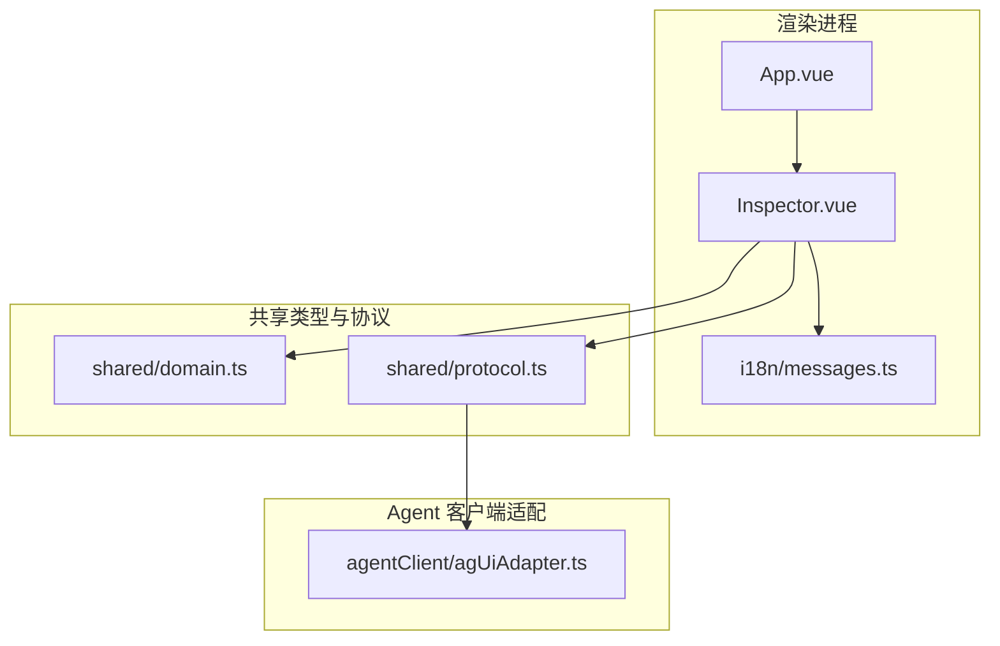
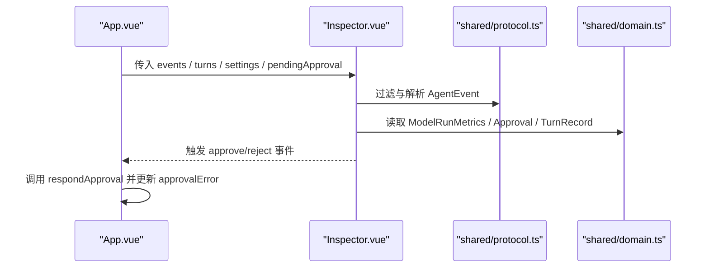
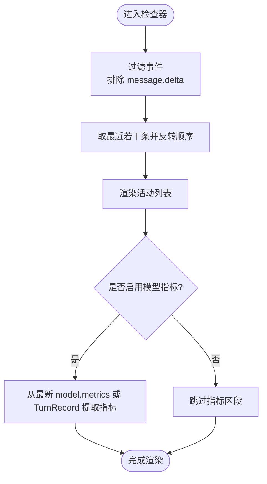
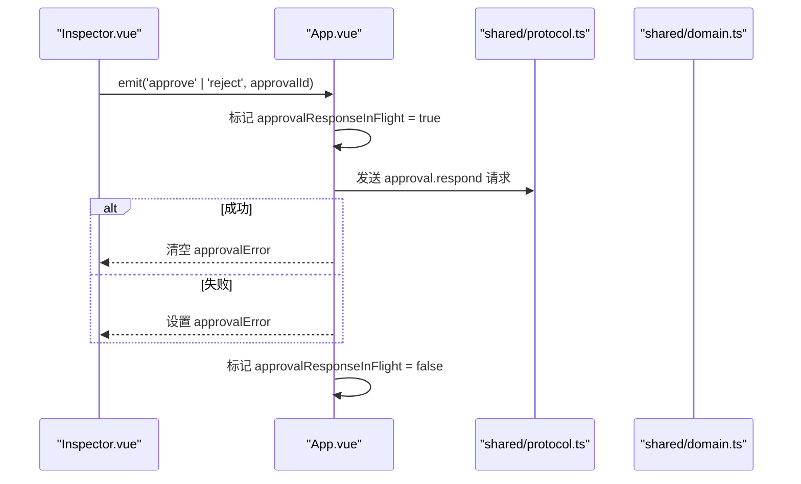
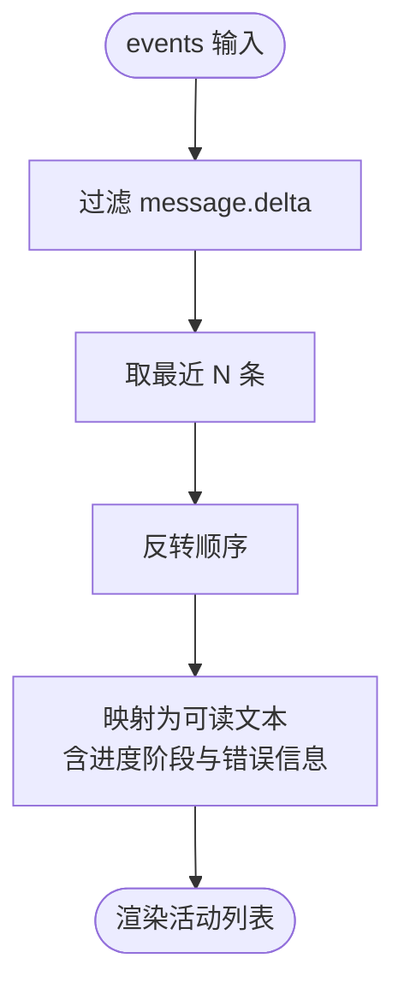
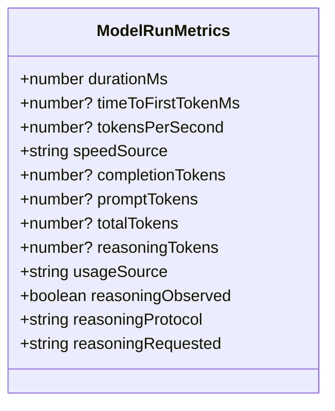
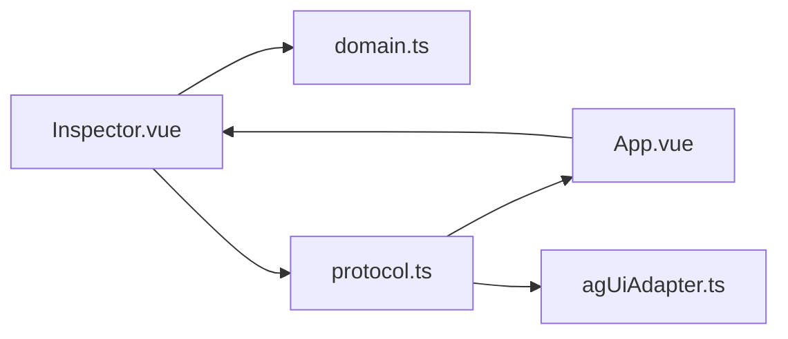

# 检查器面板

<cite>
**本文引用的文件**
- [Inspector.vue](file://src/renderer/components/Inspector.vue)
- [App.vue](file://src/renderer/App.vue)
- [domain.ts](file://src/shared/domain.ts)
- [protocol.ts](file://src/shared/protocol.ts)
- [agUiAdapter.ts](file://src/agentClient/agUiAdapter.ts)
- [messages.ts](file://src/renderer/i18n/messages.ts)
</cite>

## 目录
1. [简介](#简介)
2. [项目结构](#项目结构)
3. [核心组件](#核心组件)
4. [架构总览](#架构总览)
5. [详细组件分析](#详细组件分析)
6. [依赖关系分析](#依赖关系分析)
7. [性能考量](#性能考量)
8. [故障排查指南](#故障排查指南)
9. [结论](#结论)
10. [附录](#附录)

## 简介
本文件为“检查器面板”组件的权威技术文档，面向开发者与高级用户，系统阐述以下能力：
- 调试信息展示：请求详情、响应数据、错误信息的可视化呈现方式。
- 权限审批流程：待处理审批列表、审批操作与状态跟踪。
- 事件日志：实时事件流、过滤与导出能力的现状与建议。
- 性能监控指标：响应时间、内存使用（当前未暴露）、令牌统计等指标的集成与展示。
- 扩展与调试：如何扩展自定义检查器、如何使用现有调试工具进行问题定位。

## 项目结构
检查器面板位于渲染进程的前端界面中，作为聊天视图的侧边栏存在，负责汇总并展示运行期关键信息。其数据来源包括：
- 来自 Agent 的事件流（协议层）
- 会话轮次记录（TurnRecord）
- 应用设置（AppSettings）
- 父组件 App.vue 提供的审批上下文与错误提示

图表来源
- [App.vue:168-180](file://src/renderer/App.vue#L168-L180)
- [Inspector.vue:1-129](file://src/renderer/components/Inspector.vue#L1-L129)
- [domain.ts:76-305](file://src/shared/domain.ts#L76-L305)
- [protocol.ts:48-65](file://src/shared/protocol.ts#L48-L65)
- [agUiAdapter.ts:58-109](file://src/agentClient/agUiAdapter.ts#L58-L109)

章节来源
- [App.vue:168-180](file://src/renderer/App.vue#L168-L180)
- [Inspector.vue:1-129](file://src/renderer/components/Inspector.vue#L1-L129)
- [domain.ts:76-305](file://src/shared/domain.ts#L76-L305)
- [protocol.ts:48-65](file://src/shared/protocol.ts#L48-L65)
- [agUiAdapter.ts:58-109](file://src/agentClient/agUiAdapter.ts#L58-L109)

## 核心组件
检查器面板由 Inspector.vue 实现，承担以下职责：
- 计划与状态：显示任务执行计划与当前忙碌状态。
- 运行指标：当开启模型指标时，展示最近一次运行的性能指标。
- 审批面板：展示待处理审批、提供批准/拒绝操作，并反馈错误。
- 活动日志：以倒序展示最近若干条非消息增量事件，支持序列号标注。

关键输入与输出：
- 输入属性：pendingApproval、events、turns、settings、busy、approvalResponseInFlight、approvalError、t。
- 事件发射：approve(approvalId)、reject(approvalId)。

章节来源
- [Inspector.vue:7-21](file://src/renderer/components/Inspector.vue#L7-L21)
- [Inspector.vue:23-56](file://src/renderer/components/Inspector.vue#L23-L56)
- [Inspector.vue:103-127](file://src/renderer/components/Inspector.vue#L103-L127)

## 架构总览
检查器面板通过父组件 App.vue 订阅全局状态，将事件流、轮次记录、设置与审批上下文注入到 Inspector.vue。事件流遵循 shared/protocol.ts 定义的 AgentEvent 类型；运行指标来源于 model.metrics 事件或历史 TurnRecord 中的 metrics。

图表来源
- [App.vue:168-180](file://src/renderer/App.vue#L168-L180)
- [Inspector.vue:23-56](file://src/renderer/components/Inspector.vue#L23-L56)
- [protocol.ts:48-65](file://src/shared/protocol.ts#L48-L65)
- [domain.ts:76-305](file://src/shared/domain.ts#L76-L305)

## 详细组件分析

### 调试信息展示（请求详情、响应数据、错误信息）
- 请求详情：通过事件流中的 turn.started、message.delta、answer.delta、reasoning.*.delta 等体现请求处理过程；检查器面板会过滤掉 message.delta 以保持活动列表简洁。
- 响应数据：通过 model.metrics 事件或 TurnRecord 中的 metrics 字段展示最终运行结果摘要（如耗时、首字延迟、速率、Token 用量等）。
- 错误信息：当出现 turn.failed 时，活动日志会显示错误文本；审批响应失败时，面板会显示统一错误文案。

图表来源
- [Inspector.vue:23-29](file://src/renderer/components/Inspector.vue#L23-L29)
- [Inspector.vue:31-56](file://src/renderer/components/Inspector.vue#L31-L56)
- [protocol.ts:48-65](file://src/shared/protocol.ts#L48-L65)
- [domain.ts:238-305](file://src/shared/domain.ts#L238-L305)

章节来源
- [Inspector.vue:23-56](file://src/renderer/components/Inspector.vue#L23-L56)
- [protocol.ts:48-65](file://src/shared/protocol.ts#L48-L65)
- [domain.ts:238-305](file://src/shared/domain.ts#L238-L305)

### 权限审批流程（待处理审批列表、审批操作、状态跟踪）
- 待处理审批：当收到 approval.required 事件时，父组件会将 pendingApproval 传递给检查器面板。
- 审批操作：面板提供“批准”和“拒绝”按钮，点击后向父组件发射 approve/reject 事件。
- 状态跟踪：父组件在发起审批响应期间锁定按钮（approvalResponseInFlight），并在失败时显示错误提示。

图表来源
- [Inspector.vue:103-116](file://src/renderer/components/Inspector.vue#L103-L116)
- [App.vue:114-121](file://src/renderer/App.vue#L114-L121)
- [protocol.ts:22-39](file://src/shared/protocol.ts#L22-L39)
- [domain.ts:76-85](file://src/shared/domain.ts#L76-L85)

章节来源
- [Inspector.vue:103-116](file://src/renderer/components/Inspector.vue#L103-L116)
- [App.vue:114-121](file://src/renderer/App.vue#L114-L121)
- [protocol.ts:22-39](file://src/shared/protocol.ts#L22-L39)
- [domain.ts:76-85](file://src/shared/domain.ts#L76-L85)

### 事件日志（实时事件流、过滤搜索、导出功能）
- 实时事件流：检查器面板接收 events 数组，过滤掉 message.delta，仅保留具有业务意义的事件，并展示最近若干条。
- 过滤搜索：当前版本未内置搜索框；如需增强，可在面板内增加基于 event.type、phase、error 的过滤逻辑。
- 导出功能：当前版本未提供导出；可考虑将 activity 列表序列化为 JSON/CSV 供下载。

图表来源
- [Inspector.vue:23-39](file://src/renderer/components/Inspector.vue#L23-L39)
- [protocol.ts:48-65](file://src/shared/protocol.ts#L48-L65)

章节来源
- [Inspector.vue:23-39](file://src/renderer/components/Inspector.vue#L23-L39)
- [protocol.ts:48-65](file://src/shared/protocol.ts#L48-L65)

### 性能监控指标（响应时间、内存使用、令牌统计）
- 响应时间：durationMs 与 timeToFirstTokenMs 用于衡量整体耗时与首字延迟。
- 生成速率：tokensPerSecond 与 speedSource 指示速率及来源（服务端/客户端/不可用）。
- 令牌统计：completionTokens、promptTokens、totalTokens、reasoningTokens 以及 usageSource。
- 内存使用：当前未在 ModelRunMetrics 中暴露内存指标；如需展示，需在协议与类型定义中扩展。

图表来源
- [domain.ts:238-257](file://src/shared/domain.ts#L238-L257)
- [Inspector.vue:73-101](file://src/renderer/components/Inspector.vue#L73-L101)

章节来源
- [domain.ts:238-257](file://src/shared/domain.ts#L238-L257)
- [Inspector.vue:73-101](file://src/renderer/components/Inspector.vue#L73-L101)

### 自定义检查器的扩展指南
- 扩展点：Inspector.vue 通过 props 接收外部数据，并通过 emits 向外抛出动作。建议在父组件中封装统一的“检查器容器”，按需组合多个子检查器模块（例如网络请求检查器、数据库查询检查器等）。
- 事件桥接：利用 agentClient/agUiAdapter.ts 将内部 AgentEvent 映射为 AgUiBoundaryEvent，便于上层 UI 框架消费。
- 配置开关：通过 AppSettings.showModelMetrics 控制指标区段的显隐，可按需新增其他布尔开关以控制不同检查器模块的可见性。
- 国际化：所有用户可见文案均通过 i18n/messages.ts 管理，新增文案应同时补充中英文键值。

章节来源
- [Inspector.vue:7-21](file://src/renderer/components/Inspector.vue#L7-L21)
- [agUiAdapter.ts:58-109](file://src/agentClient/agUiAdapter.ts#L58-L109)
- [domain.ts:87-94](file://src/shared/domain.ts#L87-L94)
- [messages.ts:1-393](file://src/renderer/i18n/messages.ts#L1-L393)

### 调试工具使用方法
- 查看活动日志：关注“活动”区域，结合事件类型与序列号定位问题发生位置。
- 观察审批状态：若审批按钮被禁用且无响应，检查父组件的 approvalResponseInFlight 与 approvalError。
- 验证指标来源：确认 model.metrics 事件是否到达，或回退到 TurnRecord 中的 metrics。
- 断点与日志：在 Inspector.vue 的计算属性 activity 与 latestMetrics 处设置断点，观察数据变化。

章节来源
- [Inspector.vue:23-56](file://src/renderer/components/Inspector.vue#L23-L56)
- [App.vue:114-121](file://src/renderer/App.vue#L114-L121)

## 依赖关系分析
- Inspector.vue 依赖 shared/domain.ts 的类型定义（Approval、ModelRunMetrics、TurnRecord、AppSettings）。
- Inspector.vue 依赖 shared/protocol.ts 的事件类型（AgentEvent、SequencedAgentEvent）。
- App.vue 作为父组件，负责将全局状态与事件流注入到 Inspector.vue，并处理审批响应的错误反馈。
- agentClient/agUiAdapter.ts 将 AgentEvent 转换为 AgUiBoundaryEvent，便于更高层的 UI 或调试工具消费。

图表来源
- [Inspector.vue:1-129](file://src/renderer/components/Inspector.vue#L1-L129)
- [domain.ts:76-305](file://src/shared/domain.ts#L76-L305)
- [protocol.ts:48-65](file://src/shared/protocol.ts#L48-L65)
- [agUiAdapter.ts:58-109](file://src/agentClient/agUiAdapter.ts#L58-L109)

章节来源
- [Inspector.vue:1-129](file://src/renderer/components/Inspector.vue#L1-L129)
- [domain.ts:76-305](file://src/shared/domain.ts#L76-L305)
- [protocol.ts:48-65](file://src/shared/protocol.ts#L48-L65)
- [agUiAdapter.ts:58-109](file://src/agentClient/agUiAdapter.ts#L58-L109)

## 性能考量
- 事件过滤与切片：每次渲染都会过滤 message.delta 并截取最近若干条，建议保持 slice(-N) 的 N 较小以避免大数组开销。
- 计算属性缓存：activity 与 latestMetrics 使用 Vue 计算属性，避免重复计算。
- 指标来源优先级：优先使用最新的 model.metrics 事件，否则回退到 TurnRecord 中的 metrics，减少不必要的重算。
- 内存使用：当前未暴露内存指标，如需监控，应在协议与类型中扩展相应字段，并在面板中展示。

[本节为通用性能建议，不直接分析具体文件]

## 故障排查指南
- 审批响应失败：检查 App.vue 中的 approvalError 与 approvalResponseInFlight 状态；确认 protocol 的 approval.respond 请求是否正确发出。
- 活动为空：确认 events 是否包含除 message.delta 之外的有效事件；检查协议事件是否按预期到达。
- 指标缺失：确认 model.metrics 事件是否存在；若无，则检查 TurnRecord 中是否有 metrics。
- 国际化文案：确保 messages.ts 中包含对应键值，避免显示占位符或未翻译文本。

章节来源
- [App.vue:114-121](file://src/renderer/App.vue#L114-L121)
- [Inspector.vue:103-127](file://src/renderer/components/Inspector.vue#L103-L127)
- [protocol.ts:48-65](file://src/shared/protocol.ts#L48-L65)
- [messages.ts:1-393](file://src/renderer/i18n/messages.ts#L1-L393)

## 结论
检查器面板提供了对智能体运行过程的透明化观察能力，涵盖活动日志、运行指标与审批流程。其设计清晰、职责单一，易于扩展与集成。未来可在事件过滤、搜索与导出方面进一步增强用户体验，并在协议层扩展内存等更多性能指标。

[本节为总结性内容，不直接分析具体文件]

## 附录
- 相关类型参考：
  - Approval：审批对象，包含 id、threadId、turnId、title、description、status、createdAt、respondedAt。
  - ModelRunMetrics：运行指标，包含耗时、首字延迟、速率、Token 用量、来源等。
  - TurnRecord：轮次记录，包含状态、时间戳、错误信息与指标。
  - AgentEvent：事件联合类型，包含快照与各阶段事件。

章节来源
- [domain.ts:76-305](file://src/shared/domain.ts#L76-L305)
- [protocol.ts:48-65](file://src/shared/protocol.ts#L48-L65)