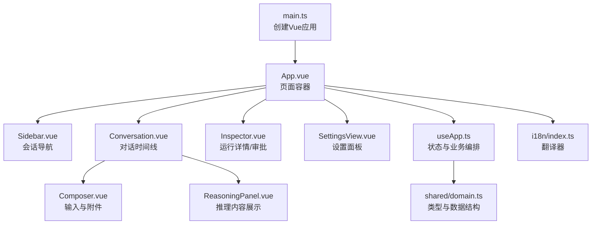
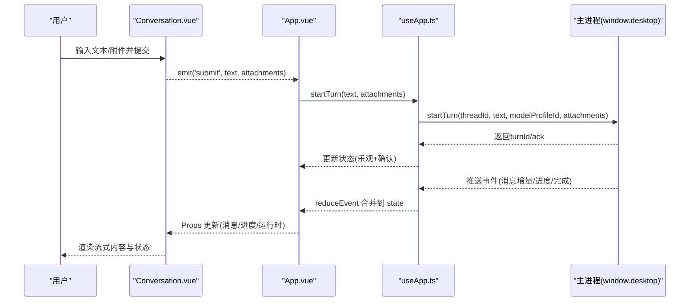
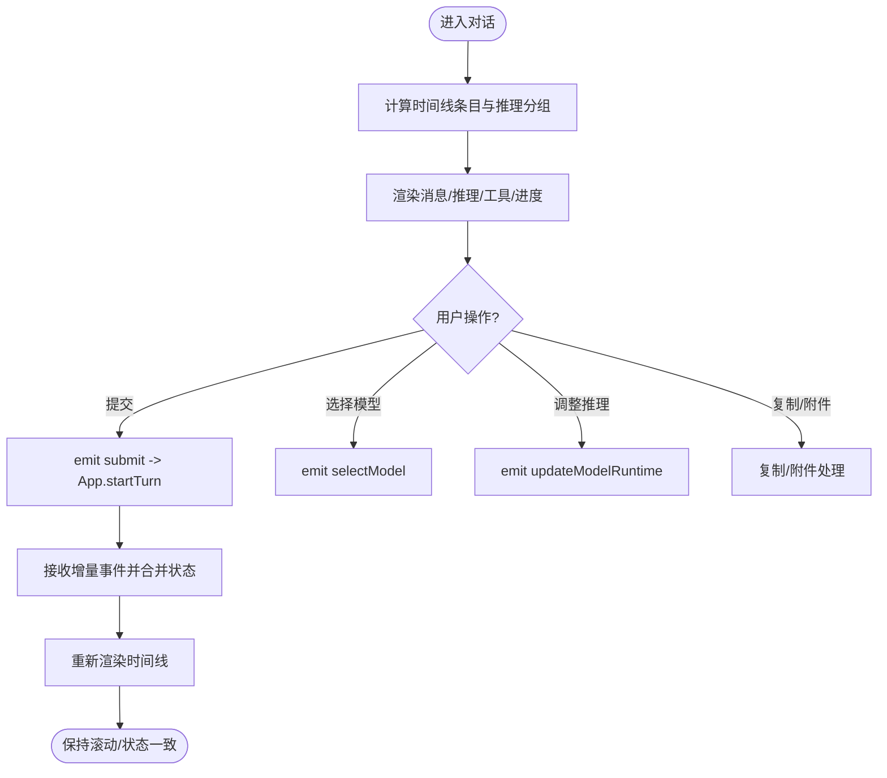
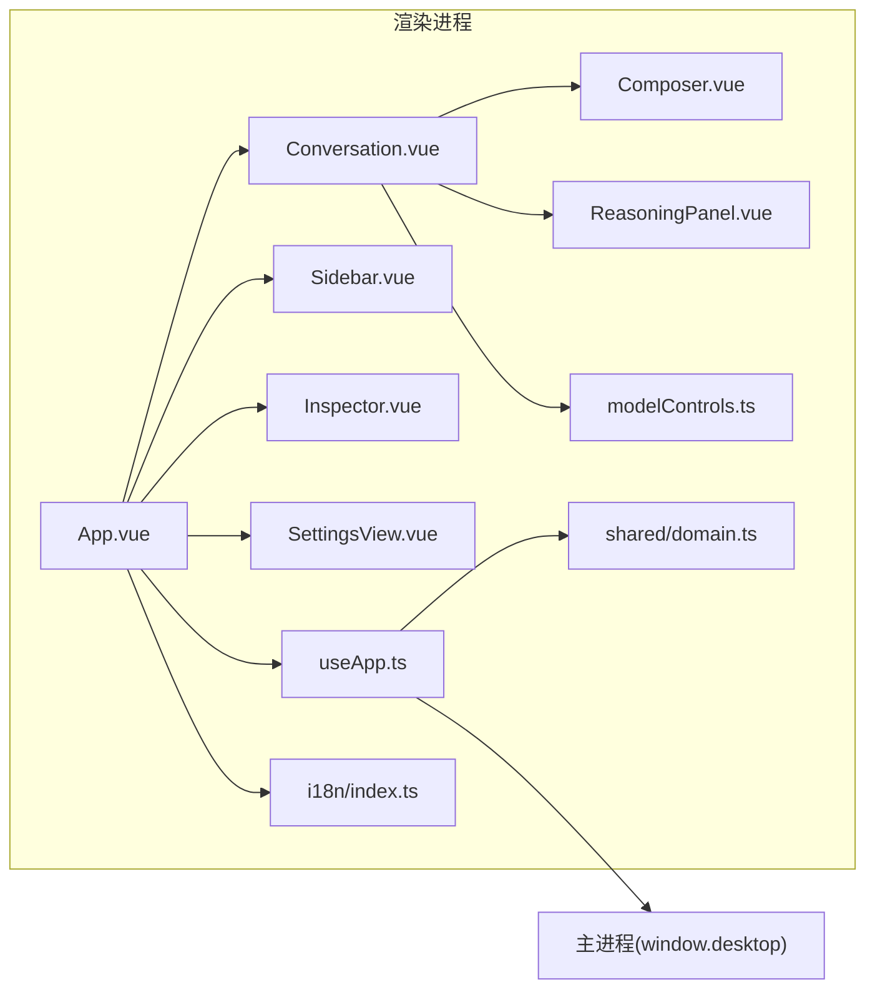

# 渲染进程

<cite>
**本文引用的文件**
- [src/renderer/main.ts](file://src/renderer/main.ts)
- [src/renderer/App.vue](file://src/renderer/App.vue)
- [src/renderer/composables/useApp.ts](file://src/renderer/composables/useApp.ts)
- [src/renderer/components/Conversation.vue](file://src/renderer/components/Conversation.vue)
- [src/renderer/components/Composer.vue](file://src/renderer/components/Composer.vue)
- [src/renderer/components/Sidebar.vue](file://src/renderer/components/Sidebar.vue)
- [src/renderer/components/Inspector.vue](file://src/renderer/components/Inspector.vue)
- [src/renderer/components/ReasoningPanel.vue](file://src/renderer/components/ReasoningPanel.vue)
- [src/renderer/modelControls.ts](file://src/renderer/modelControls.ts)
- [src/renderer/i18n/index.ts](file://src/renderer/i18n/index.ts)
- [src/renderer/i18n/messages.ts](file://src/renderer/i18n/messages.ts)
- [src/shared/domain.ts](file://src/shared/domain.ts)
</cite>

## 目录
1. [简介](#简介)
2. [项目结构](#项目结构)
3. [核心组件与职责](#核心组件与职责)
4. [架构总览](#架构总览)
5. [详细组件分析](#详细组件分析)
6. [依赖关系分析](#依赖关系分析)
7. [性能考量与优化建议](#性能考量与优化建议)
8. [故障排查指南](#故障排查指南)
9. [结论](#结论)
10. [附录：组件使用与扩展指南](#附录组件使用与扩展指南)

## 简介
本章节面向渲染进程（浏览器端）的 Vue.js 3 应用，系统性说明其架构、组件层次、状态管理与响应式数据流，重点覆盖聊天界面实现（消息渲染、流式更新、用户交互）、设置面板（模型配置、界面定制、国际化），以及组件间通信机制（事件总线、Props 传递、状态同步）。文末提供性能优化策略与最佳实践。

## 项目结构
渲染进程入口由 main.ts 创建 Vue 应用并挂载根组件 App.vue。App.vue 作为容器编排 Sidebar、Conversation、Inspector、SettingsView 等视图，并通过 useApp 组合式函数集中管理应用状态、与主进程通信、发起任务轮次、维护运行时状态等。

图表来源
- [src/renderer/main.ts:1-7](file://src/renderer/main.ts#L1-L7)
- [src/renderer/App.vue:1-199](file://src/renderer/App.vue#L1-L199)
- [src/renderer/composables/useApp.ts:1-504](file://src/renderer/composables/useApp.ts#L1-L504)
- [src/shared/domain.ts:1-319](file://src/shared/domain.ts#L1-L319)

章节来源
- [src/renderer/main.ts:1-7](file://src/renderer/main.ts#L1-L7)
- [src/renderer/App.vue:1-199](file://src/renderer/App.vue#L1-L199)

## 核心组件与职责
- App.vue：应用外壳，负责主题切换、视图路由（聊天/设置）、全局错误提示、调用 useApp 暴露的方法，向子组件派发 Props 与事件。
- Conversation.vue：对话时间线，聚合消息、推理、工具执行、进度等条目，处理滚动、复制、推理面板显示、模型选择与推理能力控制。
- Composer.vue：输入框与图片附件上传，支持发送/取消/停止动作，校验图片大小与数量。
- Sidebar.vue：工作区分组与会话列表，展示线程运行状态，触发新建/删除等操作。
- Inspector.vue：右侧检查器，展示计划步骤、运行指标、待审批项与活动日志。
- ReasoningPanel.vue：可折叠的推理内容面板，支持原始/摘要模式与复制。
- modelControls.ts：通用逻辑（推理能力控件、内容选择、复制反馈、运行时呈现等）。
- i18n：基于语言偏好生成翻译函数，提供中英文文案。
- shared/domain.ts：统一的数据类型定义（线程、消息、推理、模型配置、运行时状态等）。

章节来源
- [src/renderer/components/Conversation.vue:1-515](file://src/renderer/components/Conversation.vue#L1-L515)
- [src/renderer/components/Composer.vue:1-181](file://src/renderer/components/Composer.vue#L1-L181)
- [src/renderer/components/Sidebar.vue:1-130](file://src/renderer/components/Sidebar.vue#L1-L130)
- [src/renderer/components/Inspector.vue:1-130](file://src/renderer/components/Inspector.vue#L1-L130)
- [src/renderer/components/ReasoningPanel.vue:1-114](file://src/renderer/components/ReasoningPanel.vue#L1-L114)
- [src/renderer/modelControls.ts:1-149](file://src/renderer/modelControls.ts#L1-L149)
- [src/renderer/i18n/index.ts:1-15](file://src/renderer/i18n/index.ts#L1-L15)
- [src/shared/domain.ts:1-319](file://src/shared/domain.ts#L1-L319)

## 架构总览
渲染进程采用“组合式函数 + 组件树”的架构：
- 状态层：useApp.ts 通过 ref 持有 RendererState，封装 startInitialAgentSync 订阅主进程事件流，将快照与增量事件归并为单一状态源。
- 视图层：App.vue 作为容器，按当前视图（聊天/设置）渲染对应组件；各组件通过 Props 接收数据，通过 Emits 上报用户操作。
- 通信层：组件不直接访问主进程，而是通过 App.vue 调用的 useApp 方法间接与 window.desktop API 交互，保证单向数据流与可测试性。
- 领域模型：shared/domain.ts 定义所有跨层共享的类型，确保类型安全与一致性。

图表来源
- [src/renderer/components/Conversation.vue:1-515](file://src/renderer/components/Conversation.vue#L1-L515)
- [src/renderer/App.vue:1-199](file://src/renderer/App.vue#L1-L199)
- [src/renderer/composables/useApp.ts:1-504](file://src/renderer/composables/useApp.ts#L1-L504)

章节来源
- [src/renderer/composables/useApp.ts:1-504](file://src/renderer/composables/useApp.ts#L1-L504)
- [src/renderer/App.vue:1-199](file://src/renderer/App.vue#L1-L199)

## 详细组件分析

### 聊天界面（Conversation.vue）
- 数据聚合：通过 computed 将 items、events、turns 转换为 timelineEntries，并按 turnId 分组推理项，决定何时显示独立或内嵌的 ReasoningPanel。
- 流式更新：监听 activeBusy 与滚动签名变化，自动滚到底部；对 assistant 消息进行 Markdown 渲染，支持代码块复制。
- 用户交互：
  - 模型选择：下拉选择模型配置文件，emit('selectModel')。
  - 推理能力：根据模型能力动态显示开关/努力度菜单/自定义警告，emit('updateModelRuntime')。
  - 复制与附件：助手回答一键复制；用户消息可附带图片（受限于模型 vision 能力）。
- 滚动与可读性：智能判断是否钉底、是否有未读内容、跳转底部按钮。

图表来源
- [src/renderer/components/Conversation.vue:1-515](file://src/renderer/components/Conversation.vue#L1-L515)
- [src/renderer/modelControls.ts:1-149](file://src/renderer/modelControls.ts#L1-L149)

章节来源
- [src/renderer/components/Conversation.vue:1-515](file://src/renderer/components/Conversation.vue#L1-L515)

### 输入与附件（Composer.vue）
- 行为：根据 activeRuntime 状态决定按钮为“发送/停止/取消”，支持 Enter 快捷提交。
- 附件限制：最多 4 张图，单张不超过 10MB，仅接受 image/*，不支持视觉的模型会提示不可用。
- 提交语义：若为空文本但有附件，则自动填充描述提示；提交后清空输入与附件。

章节来源
- [src/renderer/components/Composer.vue:1-181](file://src/renderer/components/Composer.vue#L1-L181)

### 侧边栏（Sidebar.vue）
- 分组与会话：按组聚合线程，展示线程标题、数量与运行状态。
- 状态呈现：使用 threadRuntimePresentation 将运行时状态映射为本地化文案与活跃指示点。
- 操作：新建任务/分组、选择线程/分组、删除线程/分组、切换主题、打开设置。

章节来源
- [src/renderer/components/Sidebar.vue:1-130](file://src/renderer/components/Sidebar.vue#L1-L130)

### 检查器（Inspector.vue）
- 计划与活动：展示理解请求、流式事件、需要审批的步骤；列出最近活动事件。
- 运行指标：当启用 showModelMetrics 时，展示耗时、首 token 时间、速度、用量等。
- 审批面板：展示待审批项，支持批准/拒绝，并在响应中程显示加载态与错误提示。

章节来源
- [src/renderer/components/Inspector.vue:1-130](file://src/renderer/components/Inspector.vue#L1-L130)

### 推理面板（ReasoningPanel.vue）
- 内容选择：依据用户偏好（auto/raw/summary）与输出能力选择展示内容，支持空/不可用/可用三种状态。
- 交互：可折叠展开、一键复制推理内容，失败时给出友好提示。

章节来源
- [src/renderer/components/ReasoningPanel.vue:1-114](file://src/renderer/components/ReasoningPanel.vue#L1-L114)

### 设置面板（SettingsView.vue）
- 功能分区：
  - 通用：语言切换、外观。
  - 模型提供者：新增/编辑/删除模型配置，包含基础信息、API Key、推理能力声明、并发与输出上限等。
  - 运行时：推理显示偏好、队列行为说明、指标显示开关、上下文消息限制。
- 表单与验证：
  - 实时指纹计算，驱动连接测试状态重置。
  - 推理协议与输入模式联动，自动推荐 effort 选项与默认值。
  - 自定义请求体 JSON 校验、effort 选项合法性校验、最大并发/输出 token 范围校验。
- 保存与测试：
  - 保存模型配置并刷新快照。
  - 测试连接并展示诊断信息（连接成功/并发告警/槽位未验证/离线/模型不匹配）。

章节来源
- [src/renderer/components/SettingsView.vue:1-693](file://src/renderer/components/SettingsView.vue#L1-L693)

### 状态管理与数据流（useApp.ts）
- 初始同步：startInitialAgentSync 先缓冲事件，再拉取快照，合并后标记 ready，避免闪烁。
- 事件归并：reduceEvent 将增量事件与快照归一化为单一状态，组件只消费 computed 派生数据。
- 关键流程：
  - startTurn：乐观设置 queued，等待 ack 后追加用户消息与确认 turnId；超时或失败回滚。
  - cancelTurn：置 cancelling，调用取消接口并根据结果恢复或刷新状态。
  - respondApproval：乐观更新 pending 审批，失败时回退或刷新快照。
  - updateActiveModelRuntime：乐观更新模型推理能力，成功后持久化，失败回滚。
  - setLanguage/updateSettings/selectModelProfile：持久化设置并刷新快照。
- 辅助：withTimeout 统一超时控制；replaceThreadRuntime/acknowledgeThreadTurn/replaceModelProfile 原子更新局部状态。

章节来源
- [src/renderer/composables/useApp.ts:1-504](file://src/renderer/composables/useApp.ts#L1-L504)

## 依赖关系分析
- 组件耦合：
  - App.vue 强依赖 useApp 提供的状态与方法，弱依赖各子组件的 Props/Emits 契约。
  - Conversation.vue 依赖 modelControls 的能力判定与内容选择逻辑，依赖 i18n 的翻译器。
  - SettingsView.vue 依赖 modelProfileForm 相关工具（在外部模块中引用）与 domain 类型。
- 数据流向：
  - 主进程 -> useApp -> App.vue -> 子组件（Props 单向流）。
  - 子组件 -> App.vue（Emits）-> useApp -> 主进程（window.desktop）。
- 类型约束：
  - shared/domain.ts 贯穿全栈，确保消息、推理、模型配置、运行时状态的一致性。

图表来源
- [src/renderer/App.vue:1-199](file://src/renderer/App.vue#L1-L199)
- [src/renderer/composables/useApp.ts:1-504](file://src/renderer/composables/useApp.ts#L1-L504)
- [src/shared/domain.ts:1-319](file://src/shared/domain.ts#L1-L319)

章节来源
- [src/renderer/App.vue:1-199](file://src/renderer/App.vue#L1-L199)
- [src/renderer/composables/useApp.ts:1-504](file://src/renderer/composables/useApp.ts#L1-L504)

## 性能考量与优化建议
- 渲染性能
  - 使用 computed 缓存派生数据（如 timelineEntries、reasoningGroups），减少重复计算。
  - 列表渲染使用 key 稳定标识（entry.id），提升 diff 效率。
  - 长列表滚动时按需懒加载图片（loading="lazy"），降低内存占用。
- 流式更新
  - 增量事件通过 reduceEvent 合并，避免整页重绘；仅在必要时滚动到底部。
  - 使用 nextTick/requestAnimationFrame 确保 DOM 更新后再滚动，避免抖动。
- 网络与超时
  - startTurn/updateActiveModelRuntime 使用 withTimeout 防止长时间阻塞。
  - 取消操作及时更新状态，避免无效请求。
- 资源与容量
  - 图片附件限制大小与数量，避免大对象导致内存压力。
  - 推理内容按需显示（auto/raw/summary），减少不必要渲染。
- 可访问性与体验
  - 合理 aria 属性与键盘导航（推理菜单 Escape 关闭、焦点管理）。
  - 友好的错误提示与重试路径（复制失败、连接失败、审批失败）。

[本节为通用指导，无需特定文件来源]

## 故障排查指南
- 无法发送或无响应
  - 检查 startTurn 是否超时（TURN_START_ACK_TIMEOUT_MS），查看 runtimeError 与 approvalError。
  - 确认模型配置正确且服务可达（SettingsView 的连接测试）。
- 图片附件失败
  - 检查模型是否支持 vision；确认文件大小与格式；查看 attachmentError。
- 推理面板不显示
  - 检查 reasoningDisplayMode 与模型 capabilities.reasoning.outputModes；确认存在推理项或处于 running。
- 审批卡住
  - 检查 respondApproval 是否被中断或状态已变更；查看 approvalResponseInFlightId 与快照刷新。
- 设置保存失败
  - 关注 capabilityError 与 connectionDiagnostic；修正 effort 选项、JSON 请求体或并发/输出上限。

章节来源
- [src/renderer/App.vue:90-121](file://src/renderer/App.vue#L90-L121)
- [src/renderer/components/Conversation.vue:279-299](file://src/renderer/components/Conversation.vue#L279-L299)
- [src/renderer/components/Composer.vue:68-101](file://src/renderer/components/Composer.vue#L68-L101)
- [src/renderer/components/SettingsView.vue:98-130](file://src/renderer/components/SettingsView.vue#L98-L130)
- [src/renderer/composables/useApp.ts:189-257](file://src/renderer/composables/useApp.ts#L189-L257)

## 结论
渲染进程以 useApp 为核心状态编排器，结合 Vue 3 的组合式 API 与组件化设计，实现了清晰的单向数据流与良好的可维护性。聊天界面支持流式渲染、推理能力动态控制与丰富的用户交互；设置面板提供完善的模型配置、运行时行为与国际化支持。通过类型系统、事件归并与合理的性能优化策略，整体架构具备高可扩展性与健壮性。

[本节为总结，无需特定文件来源]

## 附录：组件使用与扩展指南
- 组件使用示例
  - 在 App.vue 中引入并使用 Conversation、Sidebar、Inspector、SettingsView，通过 Props 注入状态，通过 Emits 捕获用户操作。
  - 在 Conversation.vue 中通过 modelControls 获取推理能力控件与内容选择逻辑，简化 UI 决策。
  - 在 SettingsView.vue 中通过表单与验证规则构建模型配置，调用 save/test 接口并展示诊断信息。
- 自定义扩展
  - 新增模型能力：在 shared/domain.ts 扩展 ModelCapabilities，并在 modelControls.ts 中适配推理控件逻辑。
  - 新增界面文案：在 i18n/messages.ts 添加键值，并通过 createTranslator 在组件中使用。
  - 新增运行时行为：在 useApp.ts 中增加新的状态字段与事件处理，保持快照与增量事件的一致性。
  - 新增组件：遵循 Props/Emits 契约，通过 App.vue 编排，避免直接访问主进程。

章节来源
- [src/renderer/App.vue:124-196](file://src/renderer/App.vue#L124-L196)
- [src/renderer/modelControls.ts:42-65](file://src/renderer/modelControls.ts#L42-L65)
- [src/renderer/i18n/index.ts:8-10](file://src/renderer/i18n/index.ts#L8-L10)
- [src/shared/domain.ts:130-176](file://src/shared/domain.ts#L130-L176)