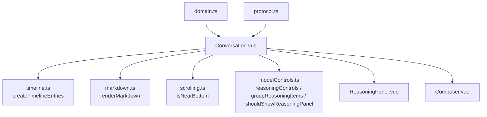
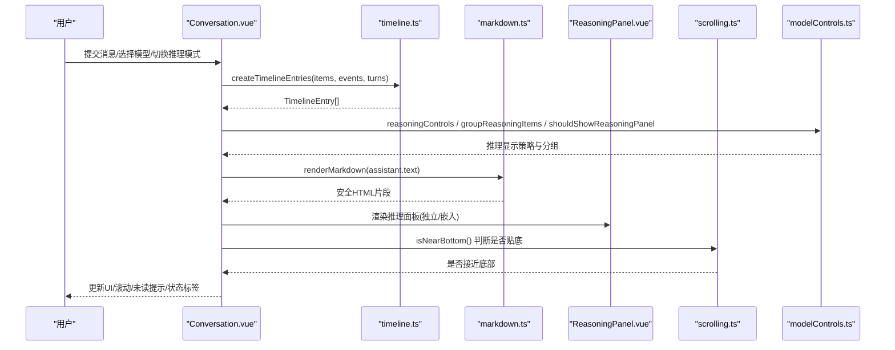
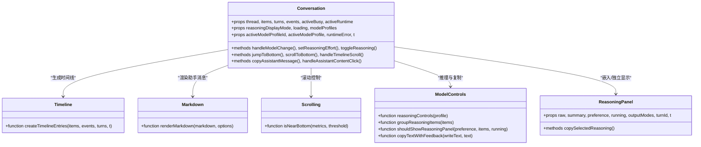
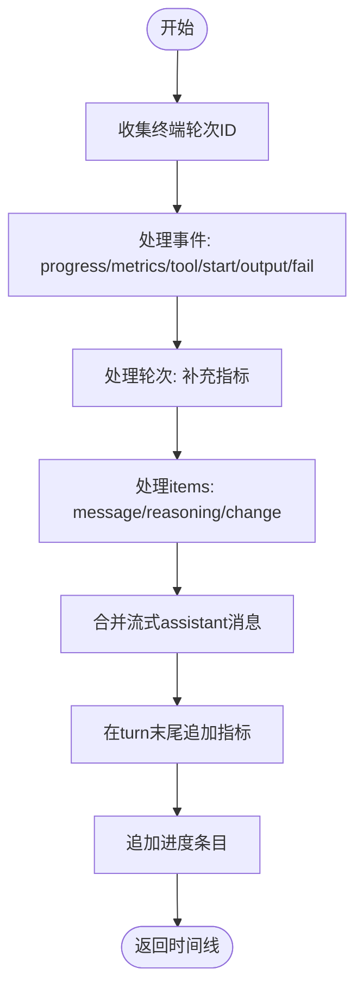
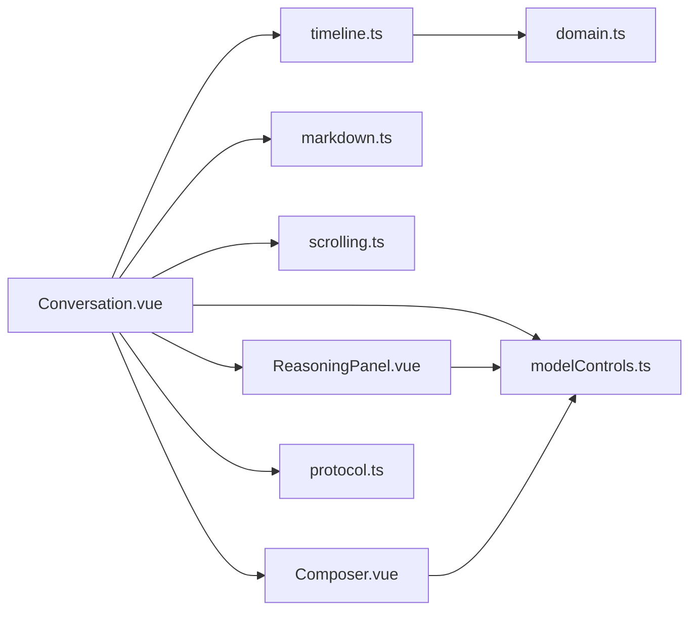

# 对话主组件

<cite>
**本文引用的文件**
- [Conversation.vue](file://src/renderer/components/Conversation.vue)
- [ReasoningPanel.vue](file://src/renderer/components/ReasoningPanel.vue)
- [timeline.ts](file://src/renderer/timeline.ts)
- [markdown.ts](file://src/renderer/markdown.ts)
- [scrolling.ts](file://src/renderer/scrolling.ts)
- [modelControls.ts](file://src/renderer/modelControls.ts)
- [domain.ts](file://src/shared/domain.ts)
- [protocol.ts](file://src/shared/protocol.ts)
- [Composer.vue](file://src/renderer/components/Composer.vue)
</cite>

## 目录
1. [简介](#简介)
2. [项目结构](#项目结构)
3. [核心组件](#核心组件)
4. [架构总览](#架构总览)
5. [详细组件分析](#详细组件分析)
6. [依赖关系分析](#依赖关系分析)
7. [性能考量](#性能考量)
8. [故障排查指南](#故障排查指南)
9. [结论](#结论)

## 简介
本文件为“对话主组件”的权威技术文档，聚焦 Conversation 组件及其协作模块。内容涵盖：
- 消息时间线管理：将原始数据（items、events、turns）转换为可渲染的时间线条目，支持流式合并与指标展示。
- 推理过程展示控制：根据模型能力与用户偏好，决定显示原始推理或摘要，并支持独立面板与嵌入面板两种模式。
- 模型运行时状态管理：统一呈现就绪、排队、运行、取消中、完成、失败等状态，并联动 UI。
- 用户交互处理：模型选择器、推理模式切换、复制代码/答案、图片附件、滚动行为与未读提示。
- Markdown 渲染与代码块复制：轻量级 Markdown 解析与安全的 HTML 输出，附带一键复制代码功能。
- 错误处理与性能优化：健壮的错误反馈、节流与最小重排策略、内存清理等。

## 项目结构
对话主组件位于渲染层，围绕 Conversation.vue 组织，配合 timeline.ts、markdown.ts、scrolling.ts、modelControls.ts 以及 ReasoningPanel.vue、Composer.vue 共同实现完整体验。



图表来源
- [Conversation.vue:1-515](file://src/renderer/components/Conversation.vue#L1-L515)
- [timeline.ts:1-236](file://src/renderer/timeline.ts#L1-L236)
- [markdown.ts:1-116](file://src/renderer/markdown.ts#L1-L116)
- [scrolling.ts:1-12](file://src/renderer/scrolling.ts#L1-L12)
- [modelControls.ts:1-149](file://src/renderer/modelControls.ts#L1-L149)
- [ReasoningPanel.vue:1-114](file://src/renderer/components/ReasoningPanel.vue#L1-L114)
- [Composer.vue:1-181](file://src/renderer/components/Composer.vue#L1-L181)
- [domain.ts:1-319](file://src/shared/domain.ts#L1-L319)
- [protocol.ts:1-371](file://src/shared/protocol.ts#L1-L371)

章节来源
- [Conversation.vue:1-515](file://src/renderer/components/Conversation.vue#L1-L515)
- [timeline.ts:1-236](file://src/renderer/timeline.ts#L1-L236)
- [markdown.ts:1-116](file://src/renderer/markdown.ts#L1-L116)
- [scrolling.ts:1-12](file://src/renderer/scrolling.ts#L1-L12)
- [modelControls.ts:1-149](file://src/renderer/modelControls.ts#L1-L149)
- [ReasoningPanel.vue:1-114](file://src/renderer/components/ReasoningPanel.vue#L1-L114)
- [Composer.vue:1-181](file://src/renderer/components/Composer.vue#L1-L181)
- [domain.ts:1-319](file://src/shared/domain.ts#L1-L319)
- [protocol.ts:1-371](file://src/shared/protocol.ts#L1-L371)

## 核心组件
- Conversation.vue：对话主容器，负责时间线渲染、推理面板集成、模型选择与运行时状态展示、滚动与未读指示、用户输入与事件派发。
- ReasoningPanel.vue：推理过程的可折叠面板，支持原始/摘要视图切换与复制。
- timeline.ts：将 items/events/turns 转换为统一的时间线条目，处理流式消息合并、工具调用、进度与指标。
- markdown.ts：轻量 Markdown 到 HTML 的转换，包含段落、列表、标题、行内标记与代码块，提供安全转义与复制按钮。
- scrolling.ts：滚动边界检测，用于自动贴底与未读提示。
- modelControls.ts：推理能力与显示策略、运行时呈现、复制反馈、菜单命令等通用逻辑。
- Composer.vue：用户输入区，支持文本与图片附件、发送/取消/停止动作。

章节来源
- [Conversation.vue:1-515](file://src/renderer/components/Conversation.vue#L1-L515)
- [ReasoningPanel.vue:1-114](file://src/renderer/components/ReasoningPanel.vue#L1-L114)
- [timeline.ts:1-236](file://src/renderer/timeline.ts#L1-L236)
- [markdown.ts:1-116](file://src/renderer/markdown.ts#L1-L116)
- [scrolling.ts:1-12](file://src/renderer/scrolling.ts#L1-L12)
- [modelControls.ts:1-149](file://src/renderer/modelControls.ts#L1-L149)
- [Composer.vue:1-181](file://src/renderer/components/Composer.vue#L1-L181)

## 架构总览
Conversation 组件作为编排中心，通过计算属性与监听器协调各子模块：
- 数据源：props.items、props.events、props.turns、activeRuntime、modelProfiles、activeModelProfile、reasoningDisplayMode。
- 时间线生成：createTimelineEntries 产出 TimelineEntry[]，供模板遍历渲染。
- 推理分组：groupReasoningItems 按 turnId 聚合 raw/summary，shouldShowReasoningPanel 决定是否显示推理面板。
- 渲染策略：assistant 消息使用 renderMarkdown 渲染；user 消息直接显示文本与图片附件。
- 交互：模型选择器触发 selectModel；推理模式切换触发 updateModelRuntime；复制按钮与代码块复制；滚动监听与跳转。
- 运行时状态：runtimeStatus 基于 activeRuntime 的状态与队列位置进行本地化展示。



图表来源
- [Conversation.vue:1-515](file://src/renderer/components/Conversation.vue#L1-L515)
- [timeline.ts:1-236](file://src/renderer/timeline.ts#L1-L236)
- [markdown.ts:1-116](file://src/renderer/markdown.ts#L1-L116)
- [ReasoningPanel.vue:1-114](file://src/renderer/components/ReasoningPanel.vue#L1-L114)
- [scrolling.ts:1-12](file://src/renderer/scrolling.ts#L1-L12)
- [modelControls.ts:1-149](file://src/renderer/modelControls.ts#L1-L149)

## 详细组件分析

### Conversation.vue：对话主容器
- 时间线管理
  - 通过 computed 生成 timelineEntries，并在模板中逐项渲染。
  - 对 assistant 流式消息进行合并与 live 标记，确保增量更新时不重复插入。
  - 在 turn 结束时追加 metrics 条目，便于查看耗时、token 用量与结束原因。
- 推理面板集成
  - 使用 groupReasoningItems 将同一 turn 的 raw/summary 聚合成组。
  - 通过 shouldShowReasoningPanel 与 running 状态决定嵌入显示；若无助手锚点且处于运行中，则显示独立推理面板。
  - 推理面板支持 copy 与 unavailable 状态提示。
- 模型选择器与运行时状态
  - 下拉框选择模型，emit selectModel。
  - runtimeStatus 根据 activeRuntime.status 与 queuePosition 动态展示，支持本地化。
  - 推理模式支持 toggle/effort/custom 三种能力，由 reasoningControls 决定 UI 形态。
- 用户交互
  - 助手消息复制：copyAssistantMessage 使用 copyTextWithFeedback 并提供状态反馈与自动重置。
  - 代码块复制：点击 .code-block 内的复制按钮，提取 pre code 文本并写入剪贴板，按钮文案与 data-copy-state 同步。
  - 图片附件：仅当 supportsVision 为真时允许上传，限制数量与大小，并以 dataUrl 形式展示。
- 滚动行为
  - 自动贴底：watch scrollSignature，若 isPinnedToBottom 为真则 scrollToBottom。
  - 未读指示：非贴底时设置 hasUnreadBelow 为真，提供“跳到底部”按钮。
  - 防抖与多帧滚动：scrollToBottom 使用 nextTick 与 requestAnimationFrame 多次落底，避免抖动。
- 错误处理
  - 运行时错误以 runtimeError 形式展示。
  - 复制失败时显示失败文案，并通过定时器恢复默认状态。

章节来源
- [Conversation.vue:1-515](file://src/renderer/components/Conversation.vue#L1-L515)
- [modelControls.ts:1-149](file://src/renderer/modelControls.ts#L1-L149)
- [scrolling.ts:1-12](file://src/renderer/scrolling.ts#L1-L12)
- [markdown.ts:1-116](file://src/renderer/markdown.ts#L1-L116)
- [ReasoningPanel.vue:1-114](file://src/renderer/components/ReasoningPanel.vue#L1-L114)

#### 类图（组件与类型）


图表来源
- [Conversation.vue:1-515](file://src/renderer/components/Conversation.vue#L1-L515)
- [ReasoningPanel.vue:1-114](file://src/renderer/components/ReasoningPanel.vue#L1-L114)
- [timeline.ts:1-236](file://src/renderer/timeline.ts#L1-L236)
- [markdown.ts:1-116](file://src/renderer/markdown.ts#L1-L116)
- [scrolling.ts:1-12](file://src/renderer/scrolling.ts#L1-L12)
- [modelControls.ts:1-149](file://src/renderer/modelControls.ts#L1-L149)

### timeline.ts：时间线构建与流式合并
- 输入：items（消息、推理、工具、变更）、events（模型进度、工具开始/输出、指标、轮次状态）、turns（轮次记录）。
- 输出：TimelineEntry[]，包括 message、reasoning、tool、metrics、progress。
- 关键逻辑
  - 终端轮次集合：从 turns 与 events 中收集 completed/failed/cancelled 的 turnId，用于过滤进行中工具与进度。
  - 指标聚合：优先使用实时 model.metrics 事件，否则回退到持久化的 turn.metrics。
  - 流式消息合并：相邻同 turn 的 assistant 消息会合并文本并标记 live，避免重复渲染。
  - 工具与错误：tool.started/tool.output/turn.failed 分别渲染为运行中、完成与失败条目。
  - 进度条：model.progress 在非终端轮次中显示连接/压缩/推理/回答阶段。



图表来源
- [timeline.ts:1-236](file://src/renderer/timeline.ts#L1-L236)

章节来源
- [timeline.ts:1-236](file://src/renderer/timeline.ts#L1-L236)

### markdown.ts：Markdown 渲染与代码块复制
- 支持段落、无序/有序列表、标题、行内代码与加粗。
- 代码块识别：以 ``` 包裹的内容会被转义并包裹在 .code-block 中，附带复制按钮。
- 安全性：所有文本先经 escapeHtml 转义，再注入 HTML，避免 XSS。
- 复制按钮：data-copy-code-button 标识，配合 Conversation 的事件处理提取 pre code 文本并写入剪贴板。

章节来源
- [markdown.ts:1-116](file://src/renderer/markdown.ts#L1-L116)
- [Conversation.vue:285-299](file://src/renderer/components/Conversation.vue#L285-L299)

### scrolling.ts：滚动边界检测
- isNearBottom：当 scrollHeight - scrollTop - clientHeight <= 阈值（默认 80px）时视为接近底部。
- 用途：Conversation 中用于判断是否保持贴底与隐藏未读提示。

章节来源
- [scrolling.ts:1-12](file://src/renderer/scrolling.ts#L1-L12)
- [Conversation.vue:243-266](file://src/renderer/components/Conversation.vue#L243-L266)

### modelControls.ts：推理能力与运行时呈现
- reasoningControls：根据模型能力的 inputMode 决定 UI 是隐藏、开关或努力等级选择。
- groupReasoningItems：按 turnId 聚合 raw/summary，便于面板渲染。
- shouldShowReasoningPanel：当存在推理项、正在运行或偏好非 auto 时显示面板。
- copyTextWithFeedback：封装剪贴板写入，返回 copied/failed 状态。
- composerAction：根据运行时状态决定 Composer 的动作（send/cancel/stop）。
- threadRuntimePresentation：将运行时状态映射为 UI 键值，便于样式与文案控制。

章节来源
- [modelControls.ts:1-149](file://src/renderer/modelControls.ts#L1-L149)
- [Conversation.vue:108-186](file://src/renderer/components/Conversation.vue#L108-L186)
- [ReasoningPanel.vue:17-54](file://src/renderer/components/ReasoningPanel.vue#L17-L54)

### ReasoningPanel.vue：推理面板
- 根据 preference 与 available items 选择显示 raw 或 summary。
- 运行中状态：running 为真时显示进度点，表示推理进行中。
- 复制功能：copySelectedReasoning 调用 copyTextWithFeedback，并在 1.5s 后重置状态。
- 不可用提示：当所选模式不支持或为空时，显示相应文案。

章节来源
- [ReasoningPanel.vue:1-114](file://src/renderer/components/ReasoningPanel.vue#L1-L114)
- [modelControls.ts:67-87](file://src/renderer/modelControls.ts#L67-L87)

### Composer.vue：用户输入与附件
- 支持文本与图片附件，限制最大图片数量与大小。
- 根据 activeRuntime 状态决定按钮动作（发送/取消/停止）。
- 当 activeBusy 变化时清空输入与附件（可选）。
- 校验与错误提示：非图像格式、过大、超出数量等错误信息。

章节来源
- [Composer.vue:1-181](file://src/renderer/components/Composer.vue#L1-L181)
- [modelControls.ts:113-121](file://src/renderer/modelControls.ts#L113-L121)

## 依赖关系分析
- Conversation 依赖 timeline.ts 生成时间线，依赖 markdown.ts 渲染助手消息，依赖 scrolling.ts 控制滚动行为，依赖 modelControls.ts 管理推理与复制。
- ReasoningPanel 依赖 modelControls.ts 的选择与复制逻辑。
- 类型定义来自 domain.ts，协议与事件来自 protocol.ts，确保数据结构与事件契约一致。



图表来源
- [Conversation.vue:1-515](file://src/renderer/components/Conversation.vue#L1-L515)
- [timeline.ts:1-236](file://src/renderer/timeline.ts#L1-L236)
- [markdown.ts:1-116](file://src/renderer/markdown.ts#L1-L116)
- [scrolling.ts:1-12](file://src/renderer/scrolling.ts#L1-L12)
- [modelControls.ts:1-149](file://src/renderer/modelControls.ts#L1-L149)
- [ReasoningPanel.vue:1-114](file://src/renderer/components/ReasoningPanel.vue#L1-L114)
- [Composer.vue:1-181](file://src/renderer/components/Composer.vue#L1-L181)
- [domain.ts:1-319](file://src/shared/domain.ts#L1-L319)
- [protocol.ts:1-371](file://src/shared/protocol.ts#L1-L371)

章节来源
- [Conversation.vue:1-515](file://src/renderer/components/Conversation.vue#L1-L515)
- [domain.ts:1-319](file://src/shared/domain.ts#L1-L319)
- [protocol.ts:1-371](file://src/shared/protocol.ts#L1-L371)

## 性能考量
- 流式消息合并：timeline.ts 中对相邻 assistant 消息进行文本拼接与 live 标记，减少 DOM 节点创建与重绘。
- 滚动优化：scrollToBottom 使用 nextTick 与 requestAnimationFrame 多次落底，避免抖动与布局抖动。
- 计算属性缓存：conversation 中使用 computed 缓存时间线、推理分组与面板映射，降低重复计算。
- 复制状态定时清理：copyResetTimers 与 resetCopyStateTimer 保证 UI 状态及时恢复，避免内存泄漏。
- 安全渲染：markdown.ts 对所有内容进行 HTML 转义，防止 XSS 同时减少不必要的复杂解析开销。
- 条件渲染：shouldShowReasoningPanel 控制推理面板显示，避免无意义渲染。

[本节为通用性能建议，无需特定文件引用]

## 故障排查指南
- 推理面板不显示
  - 检查 shouldShowReasoningPanel 的条件：是否存在推理项、是否运行中、偏好是否为 auto。
  - 确认 groupReasoningItems 是否正确按 turnId 聚合 raw/summary。
  - 参考路径：[modelControls.ts:105-111](file://src/renderer/modelControls.ts#L105-L111)、[Conversation.vue:56-86](file://src/renderer/components/Conversation.vue#L56-L86)
- 助手消息未合并
  - 检查 timeline.ts 中 appendMessage 的合并条件：同 turn、assistant role、live 标志。
  - 参考路径：[timeline.ts:208-235](file://src/renderer/timeline.ts#L208-L235)
- 代码块复制无效
  - 确认 markdown.ts 生成的 .code-block 与 button[data-copy-code-button="true"] 存在。
  - 检查 Conversation 的事件处理是否正确提取 pre code 文本。
  - 参考路径：[markdown.ts:29-39](file://src/renderer/markdown.ts#L29-L39)、[Conversation.vue:285-299](file://src/renderer/components/Conversation.vue#L285-L299)
- 滚动未自动贴底
  - 检查 isNearBottom 阈值与 handleTimelineScroll 逻辑。
  - 确认 watch(scrollSignature) 是否触发 scrollToBottom。
  - 参考路径：[scrolling.ts:7-11](file://src/renderer/scrolling.ts#L7-L11)、[Conversation.vue:243-323](file://src/renderer/components/Conversation.vue#L243-L323)
- 运行时状态异常
  - 核对 activeRuntime.status 与 queuePosition 的来源与更新。
  - 检查 runtimeStatus 的本地化映射。
  - 参考路径：[Conversation.vue:134-145](file://src/renderer/components/Conversation.vue#L134-L145)

章节来源
- [modelControls.ts:105-111](file://src/renderer/modelControls.ts#L105-L111)
- [Conversation.vue:56-86](file://src/renderer/components/Conversation.vue#L56-L86)
- [timeline.ts:208-235](file://src/renderer/timeline.ts#L208-L235)
- [markdown.ts:29-39](file://src/renderer/markdown.ts#L29-L39)
- [Conversation.vue:285-299](file://src/renderer/components/Conversation.vue#L285-L299)
- [scrolling.ts:7-11](file://src/renderer/scrolling.ts#L7-L11)
- [Conversation.vue:243-323](file://src/renderer/components/Conversation.vue#L243-L323)
- [Conversation.vue:134-145](file://src/renderer/components/Conversation.vue#L134-L145)

## 结论
Conversation 组件通过清晰的分层与职责划分，实现了健壮的对话界面：
- 时间线构建与流式合并保证了高效渲染与用户体验。
- 推理面板的灵活集成满足多种展示需求。
- 模型选择器与运行时状态提供了直观的运行时感知。
- Markdown 渲染与代码块复制增强了可读性与可操作性。
- 滚动行为与未读指示提升了导航效率。
- 错误处理与性能优化确保了稳定性与流畅性。

[本节为总结性内容，无需特定文件引用]