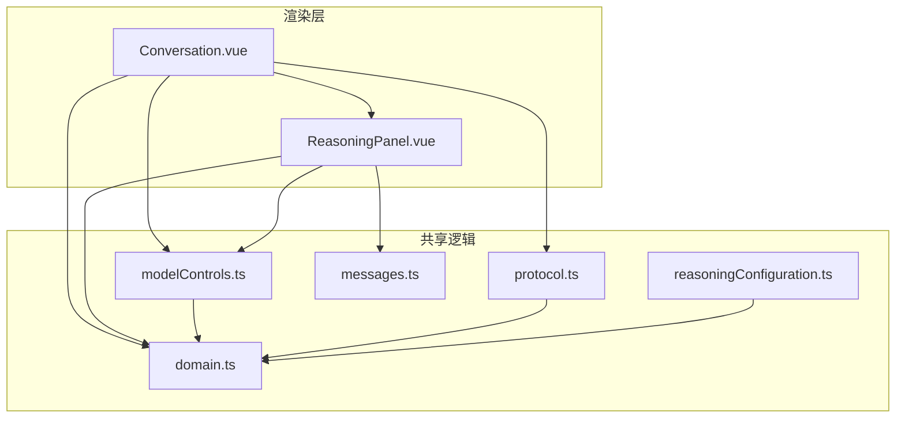
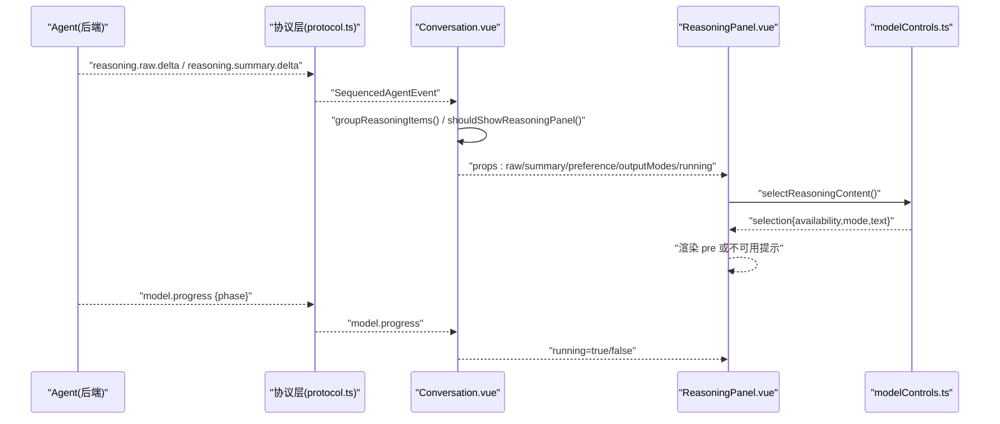
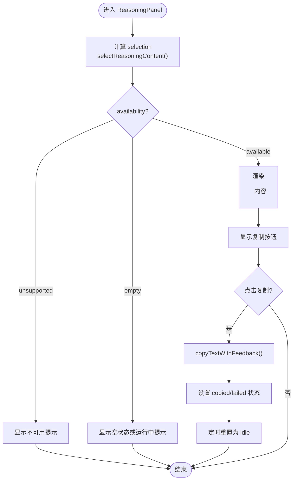
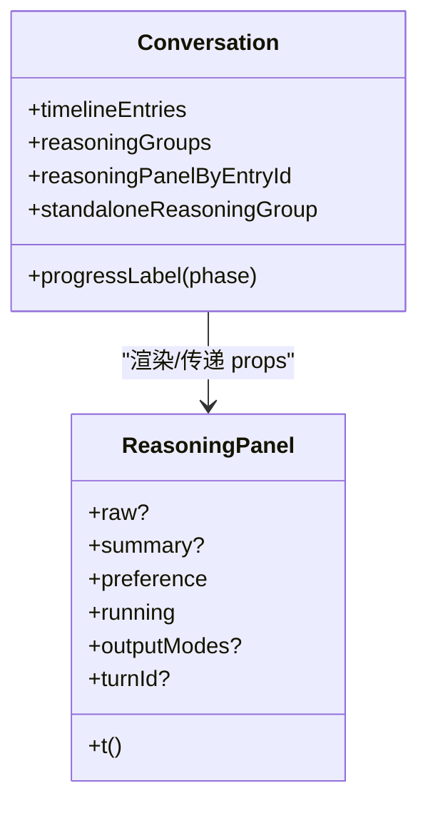
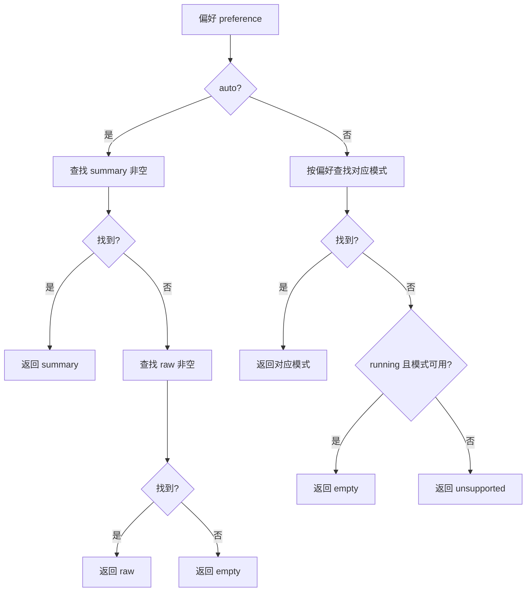
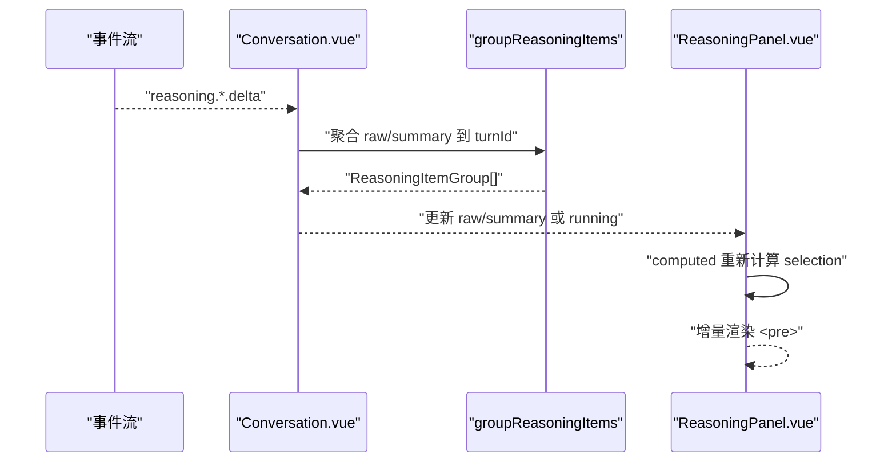
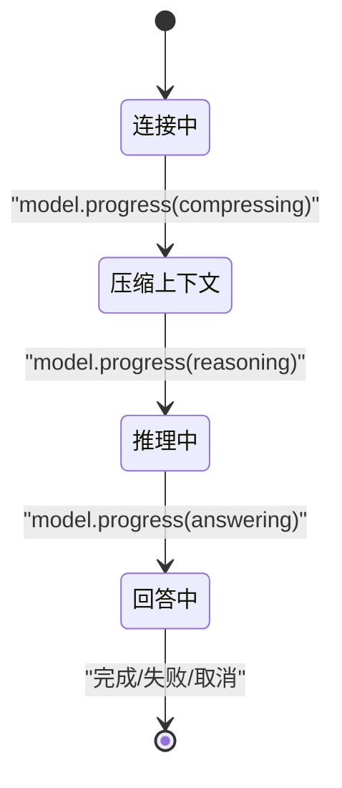
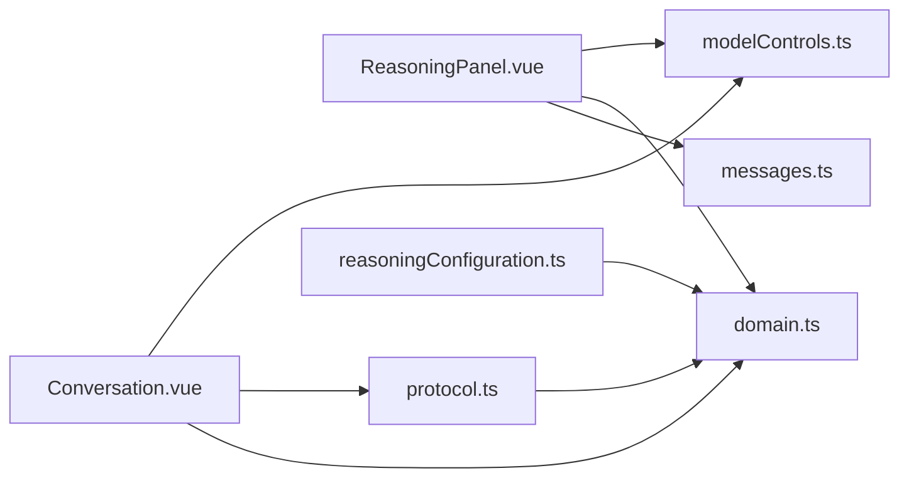

# 推理过程面板

<cite>
**本文引用的文件**
- [ReasoningPanel.vue](file://src/renderer/components/ReasoningPanel.vue)
- [Conversation.vue](file://src/renderer/components/Conversation.vue)
- [modelControls.ts](file://src/renderer/modelControls.ts)
- [domain.ts](file://src/shared/domain.ts)
- [protocol.ts](file://src/shared/protocol.ts)
- [reasoningConfiguration.ts](file://src/shared/reasoningConfiguration.ts)
- [messages.ts](file://src/renderer/i18n/messages.ts)
</cite>

## 目录
1. [简介](#简介)
2. [项目结构](#项目结构)
3. [核心组件](#核心组件)
4. [架构总览](#架构总览)
5. [详细组件分析](#详细组件分析)
6. [依赖关系分析](#依赖关系分析)
7. [性能与内存优化](#性能与内存优化)
8. [错误处理与超时策略](#错误处理与超时策略)
9. [自定义样式与扩展点](#自定义样式与扩展点)
10. [故障排查指南](#故障排查指南)
11. [结论](#结论)

## 简介
本文件面向“推理过程面板”（ReasoningPanel）的可视化能力，覆盖思维链步骤展示、进度指示、状态管理、输出模式切换（原始输出、摘要模式、混合模式）、实时更新机制（增量更新、性能优化、内存管理）、运行状态指示（连接中、压缩上下文、推理中、回答中），以及错误处理、用户体验优化和可配置扩展点。文档基于仓库中的实际源码进行说明，并提供图示帮助理解数据流与控制流。

## 项目结构
推理过程面板由渲染层组件 ReasoningPanel 与上层 Conversation 组合使用，配合共享类型定义 domain、协议 protocol、模型控制 modelControls 和本地化 messages 共同实现。

图表来源
- [Conversation.vue:1-120](file://src/renderer/components/Conversation.vue#L1-L120)
- [ReasoningPanel.vue:1-114](file://src/renderer/components/ReasoningPanel.vue#L1-L114)
- [modelControls.ts:1-149](file://src/renderer/modelControls.ts#L1-L149)
- [domain.ts:51-122](file://src/shared/domain.ts#L51-L122)
- [protocol.ts:48-65](file://src/shared/protocol.ts#L48-L65)
- [reasoningConfiguration.ts:1-19](file://src/shared/reasoningConfiguration.ts#L1-L19)
- [messages.ts:120-140](file://src/renderer/i18n/messages.ts#L120-L140)

章节来源
- [Conversation.vue:1-120](file://src/renderer/components/Conversation.vue#L1-L120)
- [ReasoningPanel.vue:1-114](file://src/renderer/components/ReasoningPanel.vue#L1-L114)
- [modelControls.ts:1-149](file://src/renderer/modelControls.ts#L1-L149)
- [domain.ts:51-122](file://src/shared/domain.ts#L51-L122)
- [protocol.ts:48-65](file://src/shared/protocol.ts#L48-L65)
- [reasoningConfiguration.ts:1-19](file://src/shared/reasoningConfiguration.ts#L1-L19)
- [messages.ts:120-140](file://src/renderer/i18n/messages.ts#L120-L140)

## 核心组件
- ReasoningPanel：负责以折叠面板形式展示推理内容，支持复制、运行时进度指示、根据偏好选择显示原始或摘要内容。
- Conversation：将 ReasoningPanel 嵌入对话时间线，按轮次分组推理项，并在运行中动态插入独立推理面板。
- modelControls：提供推理内容选择、可见性判断、复制反馈、分组等工具函数。
- domain：定义推理相关的数据结构与枚举（如 ReasoningItem、ReasoningOutputMode、ModelRunPhase）。
- protocol：定义事件流（如 reasoning.raw.delta、reasoning.summary.delta、model.progress），驱动实时更新。
- reasoningConfiguration：校验推理配置冲突。
- messages：多语言文案，包括运行阶段提示与面板文案。

章节来源
- [ReasoningPanel.vue:1-114](file://src/renderer/components/ReasoningPanel.vue#L1-L114)
- [Conversation.vue:1-120](file://src/renderer/components/Conversation.vue#L1-L120)
- [modelControls.ts:1-149](file://src/renderer/modelControls.ts#L1-L149)
- [domain.ts:51-122](file://src/shared/domain.ts#L51-L122)
- [protocol.ts:48-65](file://src/shared/protocol.ts#L48-L65)
- [reasoningConfiguration.ts:1-19](file://src/shared/reasoningConfiguration.ts#L1-L19)
- [messages.ts:120-140](file://src/renderer/i18n/messages.ts#L120-L140)

## 架构总览
推理过程面板通过事件流接收增量文本并渲染到面板中；同时依据用户偏好与模型能力决定显示模式。运行状态通过 model.progress 事件驱动，面板标题与提示文案随状态变化。

图表来源
- [protocol.ts:48-65](file://src/shared/protocol.ts#L48-L65)
- [Conversation.vue:55-86](file://src/renderer/components/Conversation.vue#L55-L86)
- [ReasoningPanel.vue:17-37](file://src/renderer/components/ReasoningPanel.vue#L17-L37)
- [modelControls.ts:67-87](file://src/renderer/modelControls.ts#L67-L87)

## 详细组件分析

### ReasoningPanel 组件
- 输入属性
  - raw/summary：当前轮次的原始/摘要推理项（可选）。
  - preference：显示偏好（auto/raw/summary）。
  - running：是否处于运行中（用于进度指示）。
  - outputModes：模型声明支持的输出模式集合。
  - turnId：关联的轮次标识。
  - t：翻译函数。
- 计算属性
  - selection：基于偏好与上下文选择要展示的推理内容与可用性。
  - title/unavailableCopy：根据选择结果生成标题与不可用提示。
- 交互
  - 复制按钮：调用 copyTextWithFeedback 并设置短暂状态反馈。
  - 折叠面板：原生 details/summary，包含进度点与提示文案。
- 生命周期
  - onUnmounted 清理定时器，避免内存泄漏。

图表来源
- [ReasoningPanel.vue:17-60](file://src/renderer/components/ReasoningPanel.vue#L17-L60)
- [modelControls.ts:67-99](file://src/renderer/modelControls.ts#L67-L99)

章节来源
- [ReasoningPanel.vue:1-114](file://src/renderer/components/ReasoningPanel.vue#L1-L114)
- [modelControls.ts:67-99](file://src/renderer/modelControls.ts#L67-L99)

### Conversation 集成与推理分组
- 推理分组：将同一 turnId 下的 raw/summary 合并为一个组，便于在时间线中定位。
- 独立推理面板：当运行中且尚未有对应消息锚点时，插入独立的 ReasoningPanel。
- 可见性判断：shouldShowReasoningPanel 决定是否在当前条目旁展示推理面板。
- 运行状态映射：progressLabel 将 model.progress 的阶段映射为用户可读文案。

图表来源
- [Conversation.vue:55-86](file://src/renderer/components/Conversation.vue#L55-L86)
- [Conversation.vue:146-157](file://src/renderer/components/Conversation.vue#L146-L157)
- [ReasoningPanel.vue:7-15](file://src/renderer/components/ReasoningPanel.vue#L7-L15)

章节来源
- [Conversation.vue:55-86](file://src/renderer/components/Conversation.vue#L55-L86)
- [Conversation.vue:146-157](file://src/renderer/components/Conversation.vue#L146-L157)

### 输出模式与选择逻辑
- 偏好模式
  - auto：优先显示 summary，若不存在则回退到 raw。
  - raw/summary：强制显示对应模式。
- 可用性
  - available：存在非空文本。
  - unsupported：偏好模式不被模型支持。
  - empty：无内容或正在运行但模式可用（占位）。
- 上下文
  - running 与 outputModes 影响空态显示，以便在运行中给出即时反馈。

图表来源
- [modelControls.ts:67-87](file://src/renderer/modelControls.ts#L67-L87)
- [domain.ts:51-58](file://src/shared/domain.ts#L51-L58)

章节来源
- [modelControls.ts:67-87](file://src/renderer/modelControls.ts#L67-L87)
- [domain.ts:51-58](file://src/shared/domain.ts#L51-L58)

### 实时更新机制
- 增量更新
  - reasoning.raw.delta / reasoning.summary.delta：逐段追加文本，形成思维链逐步展开。
  - 通过 groupReasoningItems 将同轮次推理项聚合，确保 UI 按轮次更新。
- 性能优化
  - 仅对当前可见条目渲染推理面板（shouldShowReasoningPanel）。
  - 使用 computed 缓存选择结果与分组，减少重复计算。
- 内存管理
  - 组件卸载时清理定时器，避免悬挂回调。
  - 文本增量拼接由上游事件驱动，面板仅消费最新文本片段。

图表来源
- [protocol.ts:48-65](file://src/shared/protocol.ts#L48-L65)
- [modelControls.ts:123-132](file://src/renderer/modelControls.ts#L123-L132)
- [ReasoningPanel.vue:17-37](file://src/renderer/components/ReasoningPanel.vue#L17-L37)

章节来源
- [protocol.ts:48-65](file://src/shared/protocol.ts#L48-L65)
- [modelControls.ts:123-132](file://src/renderer/modelControls.ts#L123-L132)
- [ReasoningPanel.vue:17-37](file://src/renderer/components/ReasoningPanel.vue#L17-L37)

### 运行状态指示
- 阶段映射
  - connecting：连接中
  - compressing：压缩上下文
  - reasoning：推理中
  - answering：回答中
- 面板表现
  - running=true 时在标题前显示进度点。
  - 空态下根据 running 显示“模型正在思考…”等提示。

图表来源
- [protocol.ts:48-65](file://src/shared/protocol.ts#L48-L65)
- [Conversation.vue:146-157](file://src/renderer/components/Conversation.vue#L146-L157)
- [ReasoningPanel.vue:71-92](file://src/renderer/components/ReasoningPanel.vue#L71-L92)

章节来源
- [protocol.ts:48-65](file://src/shared/protocol.ts#L48-L65)
- [Conversation.vue:146-157](file://src/renderer/components/Conversation.vue#L146-L157)
- [ReasoningPanel.vue:71-92](file://src/renderer/components/ReasoningPanel.vue#L71-L92)

## 依赖关系分析
- ReasoningPanel 依赖 modelControls 的选择与复制逻辑，依赖 domain 的类型定义，依赖 i18n 文案。
- Conversation 依赖 modelControls 进行分组与可见性判断，依赖 protocol 的事件类型，依赖 domain 的状态与能力描述。
- protocol 与 domain 紧密耦合，确保事件与数据结构一致。
- reasoningConfiguration 用于校验配置冲突，防止非法组合。

图表来源
- [ReasoningPanel.vue:1-15](file://src/renderer/components/ReasoningPanel.vue#L1-L15)
- [Conversation.vue:1-28](file://src/renderer/components/Conversation.vue#L1-L28)
- [modelControls.ts:1-25](file://src/renderer/modelControls.ts#L1-L25)
- [protocol.ts:1-20](file://src/shared/protocol.ts#L1-L20)
- [reasoningConfiguration.ts:1-19](file://src/shared/reasoningConfiguration.ts#L1-L19)

章节来源
- [ReasoningPanel.vue:1-15](file://src/renderer/components/ReasoningPanel.vue#L1-L15)
- [Conversation.vue:1-28](file://src/renderer/components/Conversation.vue#L1-L28)
- [modelControls.ts:1-25](file://src/renderer/modelControls.ts#L1-L25)
- [protocol.ts:1-20](file://src/shared/protocol.ts#L1-L20)
- [reasoningConfiguration.ts:1-19](file://src/shared/reasoningConfiguration.ts#L1-L19)

## 性能与内存优化
- 增量渲染：通过 delta 事件逐步更新文本，避免整块重绘。
- 计算缓存：computed 缓存 selection 与分组，降低频繁重算开销。
- 条件渲染：仅在需要时渲染推理面板，减少 DOM 节点数量。
- 资源清理：组件卸载时清除定时器，防止内存泄漏。
- 建议
  - 对超长推理文本考虑虚拟滚动或分页加载。
  - 对高频 delta 事件做节流/防抖以减少渲染压力。
  - 对大对象（如 items）使用浅比较或分片更新。

[本节为通用指导，不直接分析具体文件]

## 错误处理与超时策略
- 复制失败：copyTextWithFeedback 捕获异常并返回 failed 状态，UI 显示失败提示。
- 不可用模式：当模型不支持所选输出模式时，显示不可用提示。
- 运行中断：turn.failed/cancelled 等事件会终止运行状态，面板不再显示进度点。
- 超时处理
  - 代码未显式实现网络超时；建议在更上层（如请求层或事件监听器）增加超时与重试策略。
  - 对于长时间无响应的推理任务，可在 Conversation 层引入超时计时器并提示用户。

章节来源
- [modelControls.ts:89-99](file://src/renderer/modelControls.ts#L89-L99)
- [ReasoningPanel.vue:33-37](file://src/renderer/components/ReasoningPanel.vue#L33-L37)
- [protocol.ts:48-65](file://src/shared/protocol.ts#L48-L65)

## 自定义样式与扩展点
- 样式类名
  - reasoning-panel、reasoning-panel-summary、reasoning-panel-body、reasoning-content、reasoning-unavailable、reasoning-copy、progress-dot。
- 数据属性
  - data-testid="reasoning-panel"、data-item-kind="reasoning"、data-reasoning-mode、data-turn-id。
- 扩展点
  - 通过 preference 与 outputModes 控制显示模式与可用模式。
  - 通过 running 控制进度指示。
  - 通过 t 注入本地化文案，支持多语言。
- 示例配置思路
  - 在 Conversation 中根据模型能力设置 outputModes。
  - 在 ReasoningPanel 中通过 CSS 自定义进度点动画与面板外观。
  - 在 modelControls 中扩展 selectReasoningContent 的逻辑以支持更多模式。

章节来源
- [ReasoningPanel.vue:63-112](file://src/renderer/components/ReasoningPanel.vue#L63-L112)
- [Conversation.vue:420-442](file://src/renderer/components/Conversation.vue#L420-L442)
- [modelControls.ts:67-87](file://src/renderer/modelControls.ts#L67-L87)
- [messages.ts:120-140](file://src/renderer/i18n/messages.ts#L120-L140)

## 故障排查指南
- 面板不显示
  - 检查 shouldShowReasoningPanel 返回值与 preference 设置。
  - 确认 items 中存在 kind='reasoning' 的项或 running=true。
- 内容不可用
  - 检查 outputModes 是否包含所选模式。
  - 查看 unavailableCopy 文案提示。
- 复制失败
  - 检查浏览器剪贴板权限与 API 可用性。
  - 查看 copyState 是否为 failed。
- 运行状态异常
  - 检查 model.progress 事件是否正确触发。
  - 核对 progressLabel 映射与当前 phase。

章节来源
- [modelControls.ts:105-111](file://src/renderer/modelControls.ts#L105-L111)
- [ReasoningPanel.vue:33-37](file://src/renderer/components/ReasoningPanel.vue#L33-L37)
- [modelControls.ts:89-99](file://src/renderer/modelControls.ts#L89-L99)
- [Conversation.vue:146-157](file://src/renderer/components/Conversation.vue#L146-L157)

## 结论
ReasoningPanel 提供了轻量、可扩展的推理过程可视化能力，结合 Conversation 的时间线组织与 modelControls 的选择逻辑，实现了灵活的输出模式切换与实时增量更新。通过 protocol 的事件流驱动运行状态指示，确保用户在连接中、压缩上下文、推理中、回答中等不同阶段获得清晰的反馈。借助 i18n 与可配置的样式类名，应用可轻松定制界面与体验。建议在更上层补充超时与重试策略，进一步提升健壮性与用户体验。