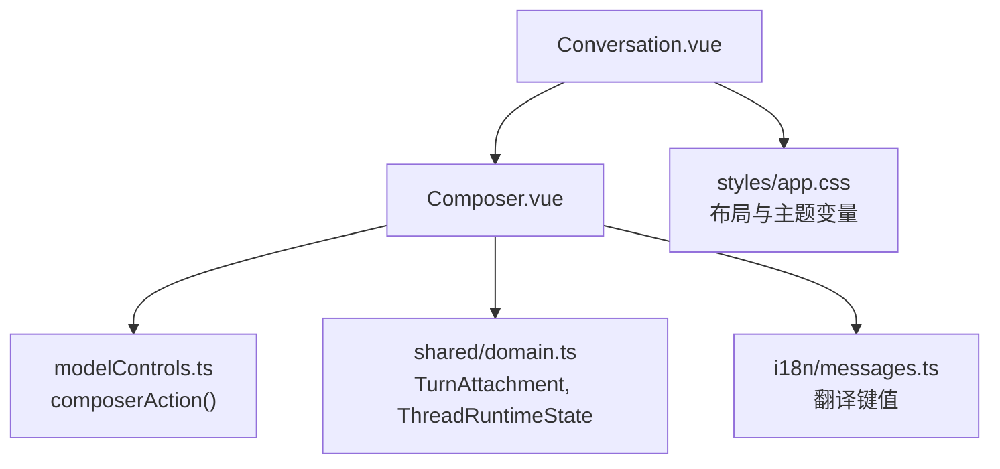
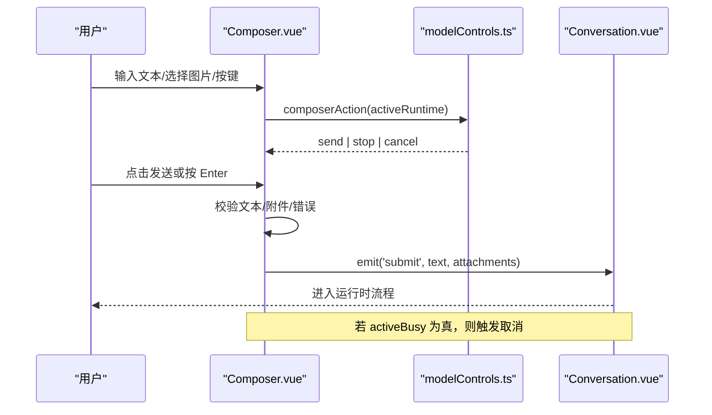
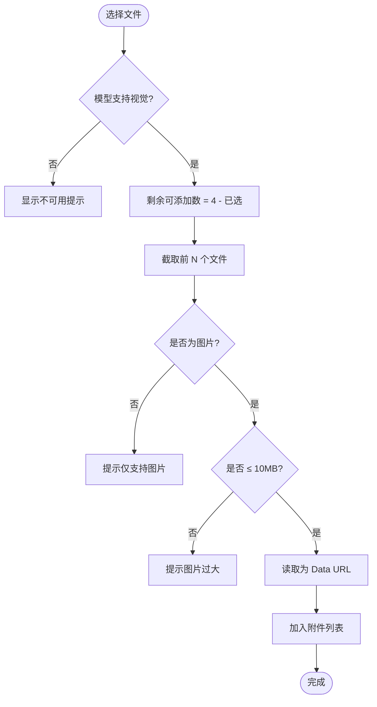
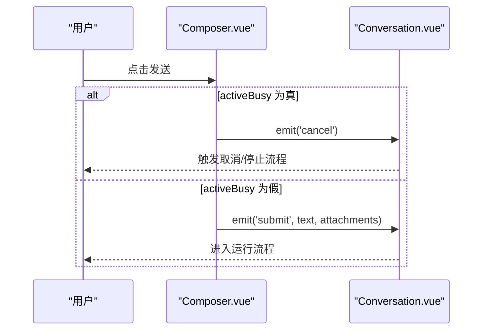
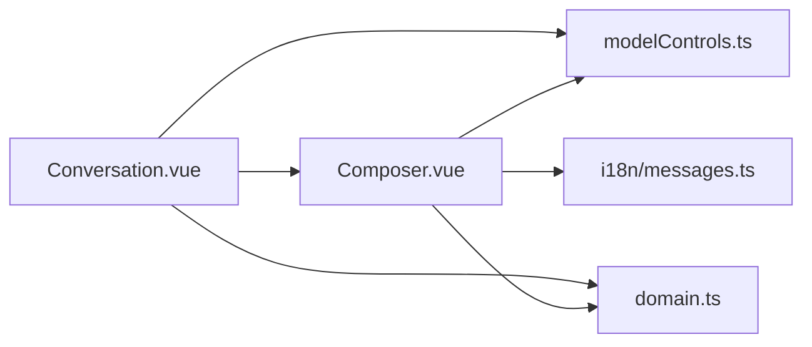

# 消息输入组件

<cite>
**本文引用的文件**
- [Composer.vue](file://src/renderer/components/Composer.vue)
- [Conversation.vue](file://src/renderer/components/Conversation.vue)
- [domain.ts](file://src/shared/domain.ts)
- [modelControls.ts](file://src/renderer/modelControls.ts)
- [messages.ts](file://src/renderer/i18n/messages.ts)
- [index.ts](file://src/renderer/i18n/index.ts)
- [app.css](file://src/renderer/styles/app.css)
</cite>

## 目录
1. [简介](#简介)
2. [项目结构](#项目结构)
3. [核心组件](#核心组件)
4. [架构总览](#架构总览)
5. [详细组件分析](#详细组件分析)
6. [依赖关系分析](#依赖关系分析)
7. [性能与可用性](#性能与可用性)
8. [故障排查指南](#故障排查指南)
9. [结论](#结论)
10. [附录：配置示例与最佳实践](#附录：配置示例与最佳实践)

## 简介
本文件围绕消息输入组件（Composer）进行系统化文档说明，覆盖文本编辑器、多行文本支持、自动高度调整策略、附件上传（图片选择、预览、限制）、快捷键系统、与运行时的集成（忙碌状态、取消请求、用户反馈）、自定义输入验证与字符限制、无障碍访问以及移动端适配策略。内容基于仓库中的实际实现进行分析与归纳，帮助开发者快速理解并扩展该组件。

## 项目结构
消息输入功能位于渲染层，由 Composer 组件提供输入与附件能力，Conversation 组件负责组合对话视图并将提交事件向上传递；类型定义集中在 shared/domain.ts；运行时动作与按钮文案由 modelControls.ts 计算；国际化文案在 i18n/messages.ts 中维护；样式在 styles/app.css 中定义。

图表来源
- [Composer.vue:1-181](file://src/renderer/components/Composer.vue#L1-L181)
- [Conversation.vue:505-512](file://src/renderer/components/Conversation.vue#L505-L512)
- [modelControls.ts:113-121](file://src/renderer/modelControls.ts#L113-L121)
- [domain.ts:43-49](file://src/shared/domain.ts#L43-L49)
- [messages.ts:108-119](file://src/renderer/i18n/messages.ts#L108-L119)
- [app.css:321-375](file://src/renderer/styles/app.css#L321-L375)

章节来源
- [Composer.vue:1-181](file://src/renderer/components/Composer.vue#L1-L181)
- [Conversation.vue:31-515](file://src/renderer/components/Conversation.vue#L31-L515)
- [domain.ts:43-49](file://src/shared/domain.ts#L43-L49)
- [modelControls.ts:113-121](file://src/renderer/modelControls.ts#L113-L121)
- [messages.ts:108-119](file://src/renderer/i18n/messages.ts#L108-L119)
- [app.css:321-375](file://src/renderer/styles/app.css#L321-L375)

## 核心组件
- Composer.vue：消息输入表单，包含文本域、附件列表、错误提示、图片附件按钮、发送/停止/取消按钮。
- Conversation.vue：承载 Composer，处理提交与取消事件，决定模型是否支持视觉能力，并在时间线中展示用户消息与图片附件。
- modelControls.ts：根据运行时状态计算 Composer 的按钮行为（send/cancel/stop）。
- domain.ts：定义 TurnAttachment、ThreadRuntimeState 等数据结构。
- i18n/messages.ts：提供中英文文案，包括占位符、错误提示、按钮文案等。
- app.css：全局样式与主题变量，影响输入框、按钮、附件展示等外观。

章节来源
- [Composer.vue:1-181](file://src/renderer/components/Composer.vue#L1-L181)
- [Conversation.vue:87-90](file://src/renderer/components/Conversation.vue#L87-L90)
- [modelControls.ts:113-121](file://src/renderer/modelControls.ts#L113-L121)
- [domain.ts:43-49](file://src/shared/domain.ts#L43-L49)
- [messages.ts:108-119](file://src/renderer/i18n/messages.ts#L108-L119)
- [app.css:321-375](file://src/renderer/styles/app.css#L321-L375)

## 架构总览
Composer 通过 props 接收 activeBusy、activeRuntime、supportsVision、t，并通过 emit 向上抛出 submit 和 cancel 事件。父级 Conversation 监听这些事件，将消息与附件转发到上层业务逻辑。运行时状态决定按钮显示为“发送/停止/取消”，并控制输入框与附件按钮的禁用状态。

图表来源
- [Composer.vue:26-49](file://src/renderer/components/Composer.vue#L26-L49)
- [modelControls.ts:113-121](file://src/renderer/modelControls.ts#L113-L121)
- [Conversation.vue:505-512](file://src/renderer/components/Conversation.vue#L505-L512)

## 详细组件分析

### 文本编辑器与多行文本支持
- 使用原生 textarea 作为输入控件，绑定 v-model 双向数据流，默认 rows="3"，支持多行输入。
- 键盘快捷键：Enter 直接提交（非 Shift+Enter），Shift+Enter 保持换行行为。
- 自动高度调整：当前未实现自动高度增长，固定行数可保证稳定布局；如需自适应高度，可在外层容器配合 CSS 滚动或引入自适应逻辑。

章节来源
- [Composer.vue:142-150](file://src/renderer/components/Composer.vue#L142-L150)
- [Composer.vue:61-66](file://src/renderer/components/Composer.vue#L61-L66)
- [app.css:371-375](file://src/renderer/styles/app.css#L371-L375)

### 附件上传：图片选择、预览与限制
- 图片选择：通过隐藏的 input[type=file] 触发，accept 限定 png/jpeg/webp，支持 multiple 多选。
- 预览显示：附件以 chip 形式列出文件名并提供移除按钮；提交后在 Conversation 的用户消息区域以缩略图展示。
- 限制规则：
  - 单张图片最大 10MB。
  - 最多同时附加 4 张图片。
  - 仅允许 image/* 类型。
  - 当模型不支持视觉时，附件按钮禁用并提示不可用。
- 错误提示：通过 attachmentError 实时显示，如“仅支持图片”“图片过大”“超出数量上限”。

图表来源
- [Composer.vue:68-101](file://src/renderer/components/Composer.vue#L68-L101)
- [Composer.vue:117-130](file://src/renderer/components/Composer.vue#L117-L130)
- [Conversation.vue:480-492](file://src/renderer/components/Conversation.vue#L480-L492)

章节来源
- [Composer.vue:19-25](file://src/renderer/components/Composer.vue#L19-L25)
- [Composer.vue:68-101](file://src/renderer/components/Composer.vue#L68-L101)
- [Composer.vue:117-130](file://src/renderer/components/Composer.vue#L117-L130)
- [Conversation.vue:480-492](file://src/renderer/components/Conversation.vue#L480-L492)
- [messages.ts:108-119](file://src/renderer/i18n/messages.ts#L108-L119)

### 快捷键系统
- 发送消息：Enter 提交（阻止默认行为），适合快速发送。
- 换行：Shift+Enter 插入换行，保留多行编辑体验。
- 取消/停止：当 activeBusy 为真时，按钮变为“取消/停止”，可通过点击或未来扩展的快捷键触发（当前实现为点击按钮）。

章节来源
- [Composer.vue:61-66](file://src/renderer/components/Composer.vue#L61-L66)
- [Composer.vue:38-49](file://src/renderer/components/Composer.vue#L38-L49)
- [modelControls.ts:113-121](file://src/renderer/modelControls.ts#L113-L121)

### 与运行时的集成：忙碌状态、取消请求与用户反馈
- 忙碌状态：activeBusy 控制输入框与附件按钮禁用，按钮文案动态切换为“发送/停止/取消”。
- 取消请求：当 activeBusy 为真且用户点击发送，触发 cancel 事件，用于中断排队或运行中的任务。
- 用户反馈：attachmentError 显示上传错误；运行时状态通过 Conversation 的运行时徽章与进度提示反馈给用户。

图表来源
- [Composer.vue:38-49](file://src/renderer/components/Composer.vue#L38-L49)
- [Conversation.vue:505-512](file://src/renderer/components/Conversation.vue#L505-L512)

章节来源
- [Composer.vue:26-49](file://src/renderer/components/Composer.vue#L26-L49)
- [Conversation.vue:505-512](file://src/renderer/components/Conversation.vue#L505-L512)

### 自定义输入验证、字符限制与格式化
- 当前实现未对文本长度做硬性限制，但可通过父级或中间层在提交前进行校验。
- 建议扩展点：
  - 在 submit 前增加文本长度校验与格式化（如去除首尾空白、统一换行）。
  - 对附件进行二次校验（如分辨率、像素尺寸）。
  - 在 Conversation 层对提交载荷进行最终校验与清洗。

章节来源
- [Composer.vue:38-49](file://src/renderer/components/Composer.vue#L38-L49)
- [Conversation.vue:505-512](file://src/renderer/components/Conversation.vue#L505-L512)

### 无障碍访问支持
- 附件列表使用 aria-label 描述“已上传图片”，提升屏幕阅读器可读性。
- 移除附件按钮具备 aria-label，便于操作识别。
- 按钮标题使用 t('...') 提供可本地化的提示文本。
- 建议在后续版本中为输入框增加 aria-describedby 指向错误信息，进一步提升可访问性。

章节来源
- [Composer.vue:136-140](file://src/renderer/components/Composer.vue#L136-L140)
- [Composer.vue:153-167](file://src/renderer/components/Composer.vue#L153-L167)
- [messages.ts:108-119](file://src/renderer/i18n/messages.ts#L108-L119)

### 移动端适配策略
- 当前样式未针对移动端做特殊适配，输入框与按钮遵循桌面端布局。
- 建议：
  - 在小屏设备上增大触摸目标尺寸，优化按钮间距。
  - 使用媒体查询调整附件缩略图尺寸与排列方式。
  - 考虑在移动端隐藏部分高级选项以提升交互效率。

章节来源
- [app.css:321-375](file://src/renderer/styles/app.css#L321-L375)

## 依赖关系分析
- Composer 依赖 modelControls 的 composerAction 来决定按钮行为。
- Composer 依赖 domain 中的 TurnAttachment 与 ThreadRuntimeState 类型。
- Conversation 依赖 Composer 并传递 supportsVision、activeBusy、activeRuntime 等上下文。
- 国际化模块提供翻译函数与文案键值。

图表来源
- [Composer.vue:1-12](file://src/renderer/components/Composer.vue#L1-L12)
- [modelControls.ts:113-121](file://src/renderer/modelControls.ts#L113-L121)
- [domain.ts:43-49](file://src/shared/domain.ts#L43-L49)
- [Conversation.vue:505-512](file://src/renderer/components/Conversation.vue#L505-L512)

章节来源
- [Composer.vue:1-12](file://src/renderer/components/Composer.vue#L1-L12)
- [modelControls.ts:113-121](file://src/renderer/modelControls.ts#L113-L121)
- [domain.ts:43-49](file://src/shared/domain.ts#L43-L49)
- [Conversation.vue:505-512](file://src/renderer/components/Conversation.vue#L505-L512)

## 性能与可用性
- 图片读取：使用 FileReader 读取为 Data URL，适合小图预览；大图可能带来内存压力，建议在上层进行压缩或限制分辨率。
- 附件数量限制：最多 4 张，避免过多 DOM 节点与渲染开销。
- 文本输入：textarea 固定行数，减少重排；如需自适应高度，应谨慎处理滚动与焦点。
- 无障碍：关键元素具备 aria 属性，建议补充错误信息的关联描述。

[本节为通用指导，不直接分析具体文件]

## 故障排查指南
- 无法上传图片：
  - 检查 supportsVision 是否为真；若为假，附件按钮将被禁用并提示不可用。
  - 确认文件类型是否为 image/*，大小是否超过 10MB。
- 附件数量超限：
  - 提示“最多可上传 X 张图片”，请减少选择数量。
- 发送失败：
  - 检查 activeBusy 状态；若为真，点击发送会触发取消而非提交。
  - 查看 attachmentError 是否有错误提示。
- 界面无响应：
  - 检查父级是否正确监听 submit 与 cancel 事件并处理。

章节来源
- [Composer.vue:68-101](file://src/renderer/components/Composer.vue#L68-L101)
- [Composer.vue:38-49](file://src/renderer/components/Composer.vue#L38-L49)
- [Conversation.vue:87-90](file://src/renderer/components/Conversation.vue#L87-L90)

## 结论
Composer 组件提供了稳定的消息输入与图片附件能力，结合运行时状态实现了发送/停止/取消的统一入口。其设计简洁、类型安全、国际化完善，具备良好的可扩展性。建议在后续迭代中增强文本自适应高度、移动端适配与更丰富的输入校验能力，以提升用户体验与可访问性。

[本节为总结性内容，不直接分析具体文件]

## 附录：配置示例与最佳实践
- 文本输入：
  - 使用 textarea 并设置 rows 以控制初始高度；如需自适应，可在外层容器监听输入变化并调整高度。
  - 快捷键：Enter 提交，Shift+Enter 换行。
- 附件上传：
  - 限制类型 accept="image/png,image/jpeg,image/webp"，并在代码中校验 file.type 与 size。
  - 限制数量 MAX_IMAGE_ATTACHMENTS=4，超出时给出友好提示。
  - 使用 Data URL 进行预览，注意大图内存占用。
- 运行时集成：
  - 通过 composerAction 动态切换按钮文案与行为。
  - 在 activeBusy 为真时，优先处理取消请求。
- 无障碍：
  - 为附件列表与按钮添加合适的 aria-label。
  - 将错误信息通过 role="status" 暴露给辅助技术。
- 国际化：
  - 所有用户可见文案使用 t('key') 获取，确保中英文一致。

章节来源
- [Composer.vue:19-25](file://src/renderer/components/Composer.vue#L19-L25)
- [Composer.vue:61-66](file://src/renderer/components/Composer.vue#L61-L66)
- [Composer.vue:68-101](file://src/renderer/components/Composer.vue#L68-L101)
- [modelControls.ts:113-121](file://src/renderer/modelControls.ts#L113-L121)
- [messages.ts:108-119](file://src/renderer/i18n/messages.ts#L108-L119)
- [index.ts:8-10](file://src/renderer/i18n/index.ts#L8-L10)