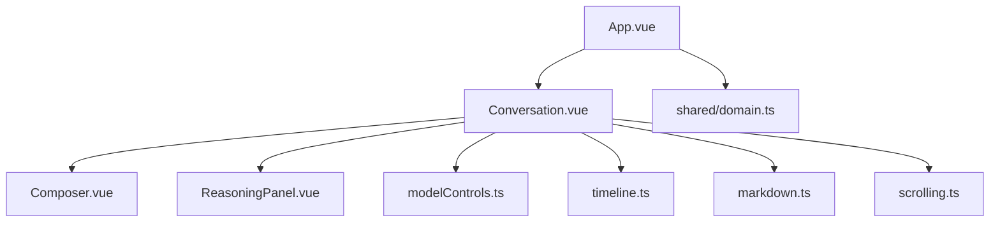
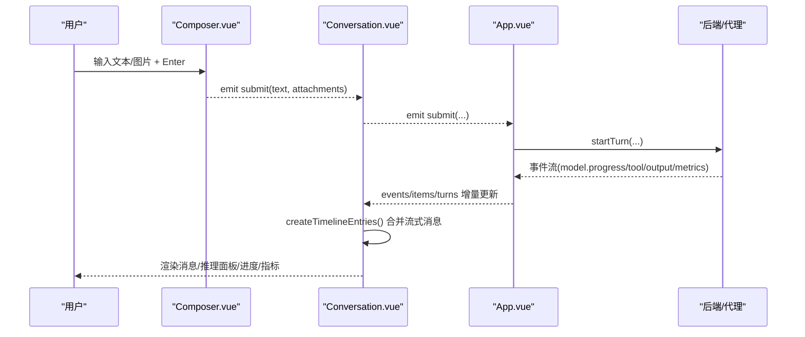
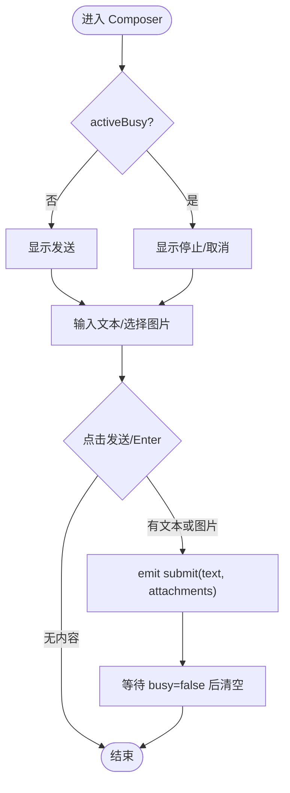
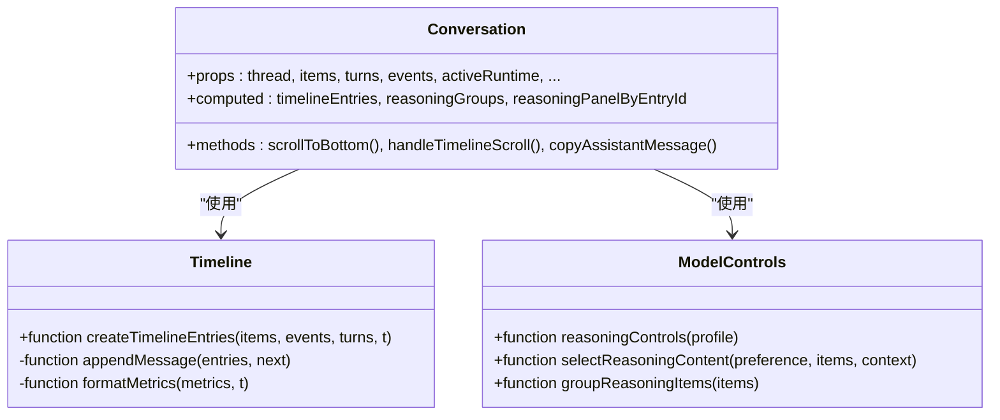
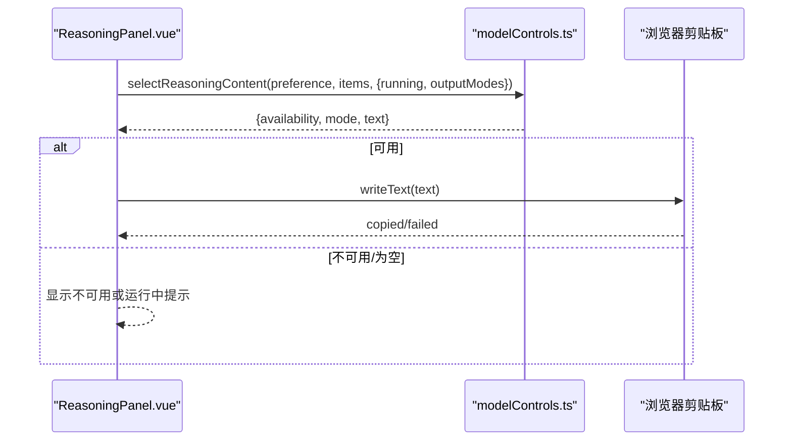
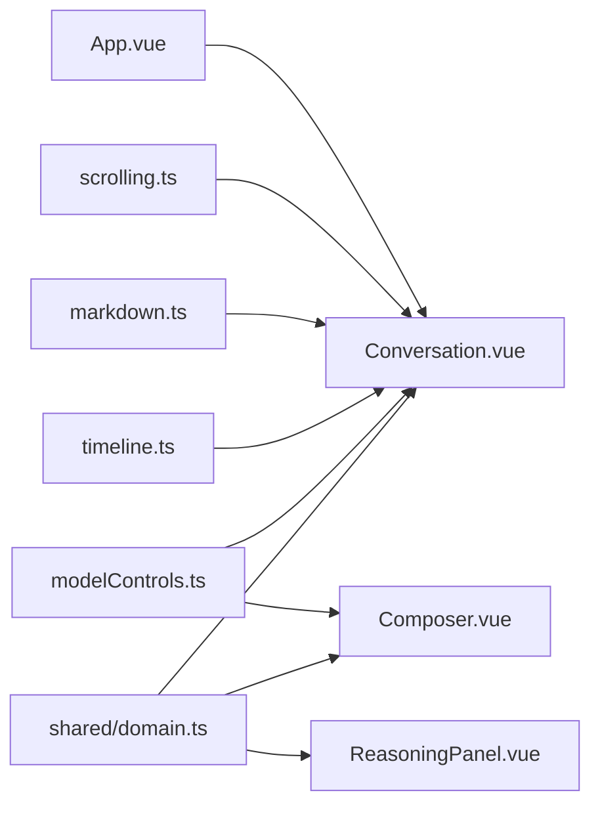

# 聊天组件

<cite>
**本文引用的文件**
- [Composer.vue](file://src/renderer/components/Composer.vue)
- [Conversation.vue](file://src/renderer/components/Conversation.vue)
- [ReasoningPanel.vue](file://src/renderer/components/ReasoningPanel.vue)
- [App.vue](file://src/renderer/App.vue)
- [domain.ts](file://src/shared/domain.ts)
- [modelControls.ts](file://src/renderer/modelControls.ts)
- [markdown.ts](file://src/renderer/markdown.ts)
- [timeline.ts](file://src/renderer/timeline.ts)
- [scrolling.ts](file://src/renderer/scrolling.ts)
</cite>

## 目录
1. [简介](#简介)
2. [项目结构](#项目结构)
3. [核心组件](#核心组件)
4. [架构总览](#架构总览)
5. [详细组件分析](#详细组件分析)
6. [依赖关系分析](#依赖关系分析)
7. [性能与内存优化](#性能与内存优化)
8. [用户交互模式](#用户交互模式)
9. [错误处理策略](#错误处理策略)
10. [结论](#结论)
11. [附录：扩展点与自定义消息类型](#附录：扩展点与自定义消息类型)

## 简介
本文件面向聊天界面的实现，聚焦以下目标：
- 消息渲染、流式更新与用户交互处理
- Composer 组件的消息输入（文本编辑、附件上传、快捷键）
- ReasoningPanel 的推理过程展示（思维链可视化、进度指示、状态控制）
- 消息列表的虚拟滚动、性能优化与内存管理
- 自定义消息类型与扩展点的使用示例
- 用户交互模式与错误处理策略

## 项目结构
聊天界面由 Vue 单文件组件构成，数据与能力定义集中在共享领域模型中。关键文件职责如下：
- App.vue：应用壳层，组合 Sidebar、Conversation、Inspector、SettingsView，并桥接业务逻辑
- Conversation.vue：对话面板，负责时间线组装、滚动行为、推理面板挂载、模型运行时控制
- Composer.vue：消息输入器，支持文本、图片附件、快捷键提交/取消/停止
- ReasoningPanel.vue：推理面板，支持原始/摘要显示、复制、运行态提示
- modelControls.ts：推理能力计算、内容选择、复制反馈、分组等工具
- timeline.ts：将 Item/Event/Turn 转换为可渲染的时间线条目，合并流式消息与指标
- markdown.ts：轻量 Markdown 渲染，含代码块与复制按钮
- scrolling.ts：滚动到底部阈值判断
- domain.ts：统一的数据类型定义（消息、推理、工具、变更、模型配置、运行时状态等）



图表来源
- [App.vue:124-166](file://src/renderer/App.vue#L124-L166)
- [Conversation.vue:1-515](file://src/renderer/components/Conversation.vue#L1-L515)
- [Composer.vue:1-181](file://src/renderer/components/Composer.vue#L1-L181)
- [ReasoningPanel.vue:1-114](file://src/renderer/components/ReasoningPanel.vue#L1-L114)
- [modelControls.ts:1-149](file://src/renderer/modelControls.ts#L1-L149)
- [timeline.ts:1-236](file://src/renderer/timeline.ts#L1-L236)
- [markdown.ts:1-116](file://src/renderer/markdown.ts#L1-L116)
- [scrolling.ts:1-12](file://src/renderer/scrolling.ts#L1-L12)
- [domain.ts:1-319](file://src/shared/domain.ts#L1-L319)

章节来源
- [App.vue:124-166](file://src/renderer/App.vue#L124-L166)
- [Conversation.vue:1-515](file://src/renderer/components/Conversation.vue#L1-L515)

## 核心组件
- Composer：负责用户输入、附件校验与提交；根据运行时状态切换“发送/停止/取消”动作
- Conversation：聚合时间线、推理面板、模型选择与运行时控制；处理滚动、复制、流式更新
- ReasoningPanel：按偏好显示原始或摘要推理内容，提供复制与不可用提示
- modelControls：推理能力与显示策略、内容选择、分组、复制反馈
- timeline：将底层 Item/Event/Turn 转为 UI 友好的 TimelineEntry，合并流式消息与指标
- markdown：安全渲染 Markdown，生成带复制按钮的代码块
- scrolling：判定是否接近底部以决定是否自动跟随

章节来源
- [Composer.vue:1-181](file://src/renderer/components/Composer.vue#L1-L181)
- [Conversation.vue:1-515](file://src/renderer/components/Conversation.vue#L1-L515)
- [ReasoningPanel.vue:1-114](file://src/renderer/components/ReasoningPanel.vue#L1-L114)
- [modelControls.ts:1-149](file://src/renderer/modelControls.ts#L1-L149)
- [timeline.ts:1-236](file://src/renderer/timeline.ts#L1-L236)
- [markdown.ts:1-116](file://src/renderer/markdown.ts#L1-L116)
- [scrolling.ts:1-12](file://src/renderer/scrolling.ts#L1-L12)

## 架构总览
聊天界面采用“状态驱动 + 事件驱动”的组合：
- 状态驱动：通过 props 传入 items、turns、events、activeRuntime 等，Conversation 计算时间线与推理面板挂载位置
- 事件驱动：AgentEvent（如 model.progress、tool.started、model.metrics）在 timeline 中转化为进度条、工具调用行、指标行
- 流式更新：assistant 消息通过 live 标记进行增量拼接，避免重复 DOM 节点
- 推理面板：根据 preference 与 running 状态决定显示 raw/summary/隐藏，并在运行中显示进度点



图表来源
- [Composer.vue:38-66](file://src/renderer/components/Composer.vue#L38-L66)
- [Conversation.vue:47-53](file://src/renderer/components/Conversation.vue#L47-L53)
- [App.vue:105-112](file://src/renderer/App.vue#L105-L112)
- [timeline.ts:41-170](file://src/renderer/timeline.ts#L41-L170)

## 详细组件分析

### Composer 组件：消息输入、附件与快捷键
- 文本编辑：textarea v-model 双向绑定，Enter 提交，Shift+Enter 换行
- 附件上传：仅支持图片，限制数量与大小，读取为 Data URL 用于预览与传输
- 动作切换：根据 activeRuntime 状态动态显示“发送/停止/取消”，禁用态保护
- 提交逻辑：当无文本且仅有图片时，使用占位文案；提交后清空输入区（受 busy 状态影响）
- 错误提示：不支持视觉模型、图片过多、非图片、过大等场景给出本地错误信息



图表来源
- [Composer.vue:22-66](file://src/renderer/components/Composer.vue#L22-L66)
- [Composer.vue:68-130](file://src/renderer/components/Composer.vue#L68-L130)
- [Composer.vue:133-181](file://src/renderer/components/Composer.vue#L133-L181)

章节来源
- [Composer.vue:1-181](file://src/renderer/components/Composer.vue#L1-L181)

### Conversation 组件：时间线、流式更新与推理面板
- 时间线构建：createTimelineEntries 将 items/events/turns 合并为 TimelineEntry，支持消息合并、工具行、指标行、进度行
- 流式更新：assistant 消息通过 appendMessage 进行增量拼接，live 标记确保只更新最后一个 assistant 消息
- 滚动行为：isNearBottom 判断是否贴近底部，自动跟随新消息；未贴底时显示“跳到底部”提示
- 推理面板：groupReasoningItems 按 turnId 分组，shouldShowReasoningPanel 决定显示；独立推理面板用于无锚点的运行中轮次
- 模型控制：reasoningControls 根据 ModelProfile.capabilities.reasoning 决定开关/努力度/自定义；updateModelRuntime 推送运行时设置
- 复制功能：助手消息与代码块支持一键复制，带状态反馈与自动重置



图表来源
- [Conversation.vue:55-124](file://src/renderer/components/Conversation.vue#L55-L124)
- [timeline.ts:41-236](file://src/renderer/timeline.ts#L41-L236)
- [modelControls.ts:53-132](file://src/renderer/modelControls.ts#L53-L132)

章节来源
- [Conversation.vue:1-515](file://src/renderer/components/Conversation.vue#L1-L515)
- [timeline.ts:1-236](file://src/renderer/timeline.ts#L1-L236)
- [modelControls.ts:1-149](file://src/renderer/modelControls.ts#L1-L149)

### ReasoningPanel 组件：推理过程展示
- 内容选择：selectReasoningContent 根据 preference 与 running 状态选择 raw/summary/空/不可用
- 显示模式：auto/raw/summary，结合 outputModes 与 running 决定可用性与占位提示
- 进度指示：running=true 时在标题前显示进度点
- 复制功能：copySelectedReasoning 使用 copyTextWithFeedback，失败时显示错误提示



图表来源
- [ReasoningPanel.vue:17-54](file://src/renderer/components/ReasoningPanel.vue#L17-L54)
- [modelControls.ts:67-99](file://src/renderer/modelControls.ts#L67-L99)

章节来源
- [ReasoningPanel.vue:1-114](file://src/renderer/components/ReasoningPanel.vue#L1-L114)
- [modelControls.ts:67-99](file://src/renderer/modelControls.ts#L67-L99)

### Markdown 渲染与代码块复制
- 安全渲染：escapeHtml 转义，内联加粗与行内代码
- 代码块：检测 ``` 包裹区域，生成 .code-block 与复制按钮，按钮 data-copy-code-button 便于事件委托
- 复制交互：Conversation 监听点击，提取 pre code 文本并写入剪贴板，按钮文案反馈状态

章节来源
- [markdown.ts:1-116](file://src/renderer/markdown.ts#L1-L116)
- [Conversation.vue:285-299](file://src/renderer/components/Conversation.vue#L285-L299)

## 依赖关系分析
- Conversation 依赖 timeline 生成 UI 友好条目，依赖 modelControls 决定推理面板显示与分组
- Composer 依赖 modelControls.composerAction 确定按钮文案与行为
- App 作为容器，协调 Conversation 与 Inspector/SettingsView，并将运行时错误透传
- domain 提供所有数据结构，保证类型一致与可扩展性



图表来源
- [domain.ts:1-319](file://src/shared/domain.ts#L1-L319)
- [modelControls.ts:1-149](file://src/renderer/modelControls.ts#L1-L149)
- [timeline.ts:1-236](file://src/renderer/timeline.ts#L1-L236)
- [markdown.ts:1-116](file://src/renderer/markdown.ts#L1-L116)
- [scrolling.ts:1-12](file://src/renderer/scrolling.ts#L1-L12)
- [App.vue:124-166](file://src/renderer/App.vue#L124-L166)

章节来源
- [App.vue:124-166](file://src/renderer/App.vue#L124-L166)
- [Conversation.vue:1-515](file://src/renderer/components/Conversation.vue#L1-L515)

## 性能与内存优化
- 流式消息合并：appendMessage 将同轮次的 assistant 消息增量拼接，减少 DOM 重排与重建
- 滚动优化：isNearBottom 阈值判断避免频繁滚动；nextAnimationFrame 多次 scrollToBottom 确保最终落底
- 推理面板按需显示：shouldShowReasoningPanel 仅在必要时渲染，降低无关开销
- 复制状态管理：messageCopyState 与 copyResetTimers 控制短暂状态，避免长期引用导致内存泄漏
- 图片附件限制：最大数量与大小限制，防止大对象占用过多内存
- 时间线条目去重：visibleToolStarts 避免重复工具开始项；metrics 只在轮次结束时追加一次

章节来源
- [timeline.ts:123-170](file://src/renderer/timeline.ts#L123-L170)
- [Conversation.vue:224-241](file://src/renderer/components/Conversation.vue#L224-L241)
- [Conversation.vue:268-283](file://src/renderer/components/Conversation.vue#L268-L283)
- [Composer.vue:19-21](file://src/renderer/components/Composer.vue#L19-L21)

## 用户交互模式
- 发送/停止/取消：
  - 空闲：显示“发送”，Enter 提交
  - 排队：显示“取消”，阻止重复提交
  - 运行/取消中：显示“停止”，中断当前请求
- 附件上传：
  - 仅接受 image/*，最多 N 张，单张不超过 M 字节
  - 不支持视觉模型时禁用上传并提示
- 推理模式：
  - 根据 ModelProfile.capabilities.reasoning.inputMode 显示开关/努力度/自定义警告
  - 运行中显示进度点，完成后保留结果
- 复制：
  - 助手消息与代码块支持一键复制，失败时提示并重试

章节来源
- [Composer.vue:26-49](file://src/renderer/components/Composer.vue#L26-L49)
- [Composer.vue:61-101](file://src/renderer/components/Composer.vue#L61-L101)
- [Conversation.vue:108-186](file://src/renderer/components/Conversation.vue#L108-L186)
- [Conversation.vue:279-299](file://src/renderer/components/Conversation.vue#L279-L299)

## 错误处理策略
- 附件错误：
  - 不支持视觉模型、图片过多、非图片、过大等场景，设置 attachmentError 并阻止提交
- 运行时错误：
  - App.vue 捕获 startTurn/updateModelRuntime 异常，设置 runtimeError 并展示
- 复制失败：
  - copyTextWithFeedback 返回 failed，UI 显示失败提示并允许重试
- 删除确认：
  - 删除线程/组前弹窗确认，失败时记录 deleteFailureFeedback 并展示

章节来源
- [Composer.vue:68-101](file://src/renderer/components/Composer.vue#L68-L101)
- [App.vue:94-112](file://src/renderer/App.vue#L94-L112)
- [App.vue:61-83](file://src/renderer/App.vue#L61-L83)
- [modelControls.ts:89-99](file://src/renderer/modelControls.ts#L89-L99)

## 结论
该聊天组件通过清晰的分层与职责划分，实现了：
- 高可用的消息输入与附件处理
- 流畅的流式消息渲染与滚动体验
- 灵活的推理过程展示与控制
- 完善的错误处理与用户体验反馈
整体设计具备良好的扩展性，可通过 timeline 与 modelControls 扩展新的消息类型与交互行为。

## 附录：扩展点与自定义消息类型
- 自定义消息类型：
  - 在 shared/domain.ts 中新增 Item 联合类型分支（如 custom），并在 timeline.ts 的 createTimelineEntries 中处理其渲染逻辑
  - 在 Conversation.vue 的模板中增加对应 entry.kind 的渲染分支
- 扩展推理输出模式：
  - 在 domain.ts 的 ReasoningOutputMode 中添加新模式，并在 modelControls.ts 的 selectReasoningContent 中适配
- 扩展工具调用展示：
  - 在 timeline.ts 的事件处理中增加新的 tool.* 事件映射，或在 Conversation.vue 中扩展 tool-row 样式与交互
- 扩展快捷键：
  - 在 Composer.vue 的 handleKeydown 中增加新的键位组合处理

章节来源
- [domain.ts:24-74](file://src/shared/domain.ts#L24-L74)
- [timeline.ts:41-170](file://src/renderer/timeline.ts#L41-L170)
- [Conversation.vue:443-500](file://src/renderer/components/Conversation.vue#L443-L500)
- [modelControls.ts:67-87](file://src/renderer/modelControls.ts#L67-L87)
- [Composer.vue:61-66](file://src/renderer/components/Composer.vue#L61-L66)