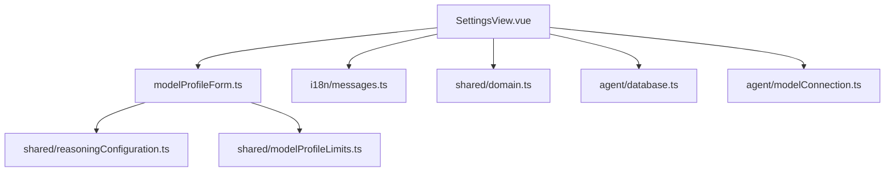
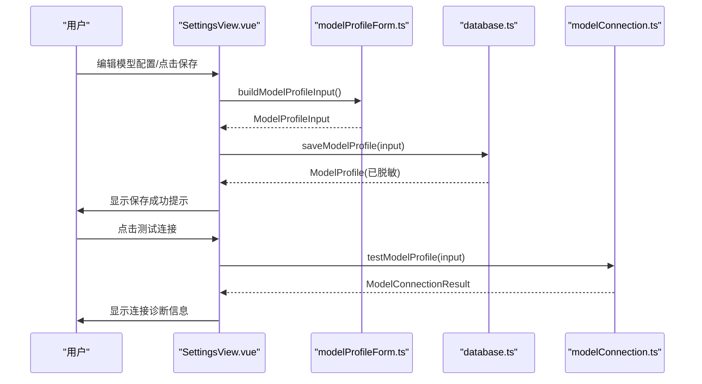
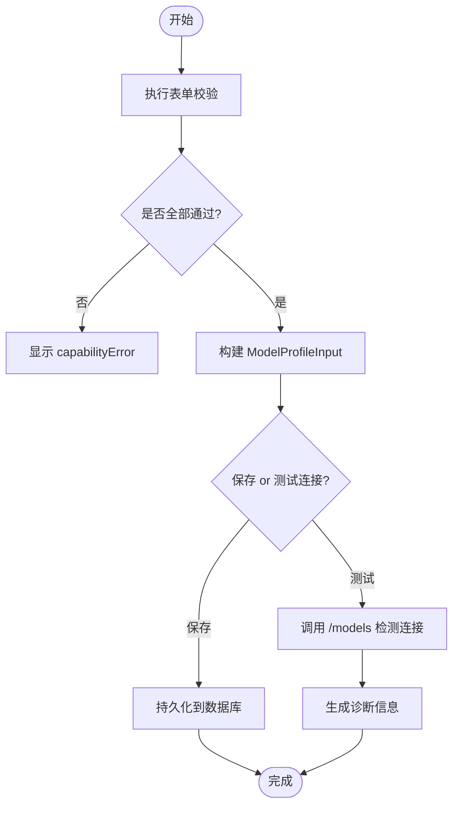
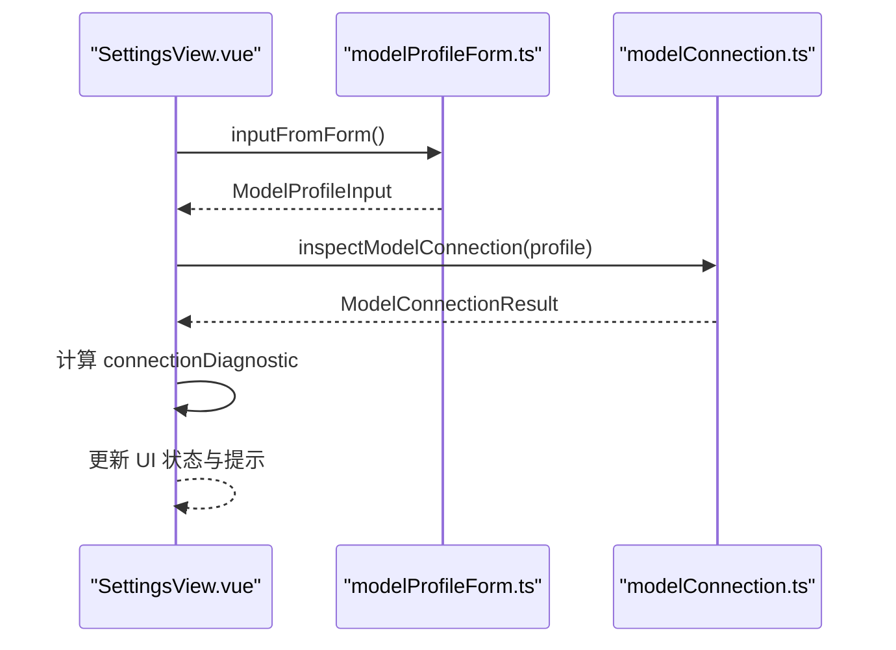
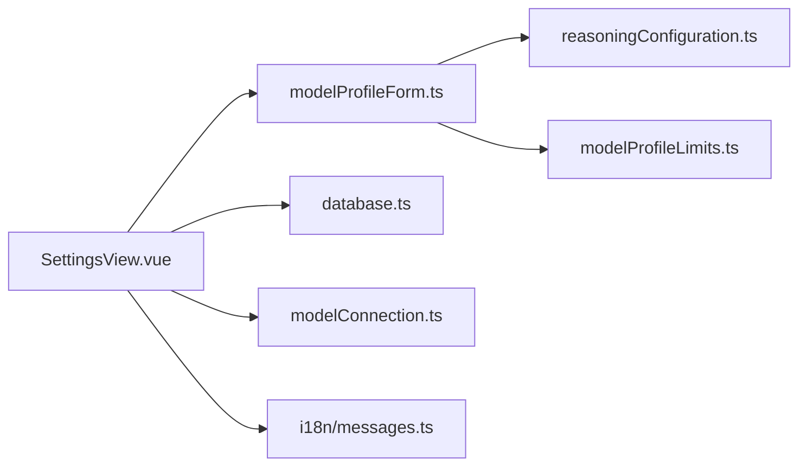

# 设置面板

<cite>
**本文引用的文件**
- [SettingsView.vue](file://src/renderer/components/SettingsView.vue)
- [modelProfileForm.ts](file://src/renderer/modelProfileForm.ts)
- [messages.ts](file://src/renderer/i18n/messages.ts)
- [i18n/index.ts](file://src/renderer/i18n/index.ts)
- [domain.ts](file://src/shared/domain.ts)
- [reasoningConfiguration.ts](file://src/shared/reasoningConfiguration.ts)
- [modelProfileLimits.ts](file://src/shared/modelProfileLimits.ts)
- [database.ts](file://src/agent/database.ts)
- [modelConnection.ts](file://src/agent/modelConnection.ts)
</cite>

## 目录
1. [简介](#简介)
2. [项目结构](#项目结构)
3. [核心组件](#核心组件)
4. [架构总览](#架构总览)
5. [详细组件分析](#详细组件分析)
6. [依赖关系分析](#依赖关系分析)
7. [性能与可用性考虑](#性能与可用性考虑)
8. [故障排查指南](#故障排查指南)
9. [结论](#结论)
10. [附录：扩展与最佳实践](#附录：扩展与最佳实践)

## 简介
本文件为“设置面板”提供深入、可操作的技术文档，覆盖模型配置界面（模型提供商设置、API 密钥管理、连接测试）、模型配置文件的管理（添加、编辑、删除、验证）、表单验证机制与错误处理、国际化支持（多语言切换与动态内容更新）、自定义模型配置的扩展指南与最佳实践，以及配置持久化与本地存储策略。

## 项目结构
设置面板由渲染层 Vue 组件、表单与校验逻辑、共享领域类型、数据库持久化、连接检测等模块协作完成。关键文件职责如下：
- SettingsView.vue：设置面板 UI 与交互编排（模型配置、工作区、运行时行为）
- modelProfileForm.ts：表单值构建、能力声明、校验、指纹与并发保护
- messages.ts / i18n/index.ts：多语言文案与翻译器
- domain.ts：领域类型定义（模型配置、连接结果、设置等）
- reasoningConfiguration.ts：推理控制配置校验规则
- modelProfileLimits.ts：输出 Token 上限常量
- database.ts：SQLite 持久化（保存/删除模型配置、工作区、应用设置）
- modelConnection.ts：模型端点连通性检测（调用 /models 接口）

图表来源
- [SettingsView.vue:1-775](file://src/renderer/components/SettingsView.vue#L1-L775)
- [modelProfileForm.ts:1-380](file://src/renderer/modelProfileForm.ts#L1-L380)
- [messages.ts:1-393](file://src/renderer/i18n/messages.ts#L1-L393)
- [domain.ts:1-319](file://src/shared/domain.ts#L1-L319)
- [reasoningConfiguration.ts:1-19](file://src/shared/reasoningConfiguration.ts#L1-L19)
- [modelProfileLimits.ts:1-3](file://src/shared/modelProfileLimits.ts#L1-L3)
- [database.ts:541-630](file://src/agent/database.ts#L541-L630)
- [modelConnection.ts:11-36](file://src/agent/modelConnection.ts#L11-L36)

章节来源
- [SettingsView.vue:1-775](file://src/renderer/components/SettingsView.vue#L1-L775)
- [modelProfileForm.ts:1-380](file://src/renderer/modelProfileForm.ts#L1-L380)
- [messages.ts:1-393](file://src/renderer/i18n/messages.ts#L1-L393)
- [domain.ts:1-319](file://src/shared/domain.ts#L1-L319)
- [reasoningConfiguration.ts:1-19](file://src/shared/reasoningConfiguration.ts#L1-L19)
- [modelProfileLimits.ts:1-3](file://src/shared/modelProfileLimits.ts#L1-L3)
- [database.ts:541-630](file://src/agent/database.ts#L541-L630)
- [modelConnection.ts:11-36](file://src/agent/modelConnection.ts#L11-L36)

## 核心组件
- 设置面板视图（SettingsView.vue）
  - 负责展示通用设置、工作区、模型服务、运行时行为四个分区
  - 维护模型配置表单状态、连接测试状态、保存/测试中的防重入令牌
  - 通过事件向上提交语言切换、设置更新、选择当前模型、删除工作区等操作
- 表单与校验（modelProfileForm.ts）
  - 将表单值转换为 ModelProfileInput，合并能力与推理配置
  - 提供最大输出 Token 校验、并发数校验、推理输入模式校验、自定义请求体验证
  - 生成表单指纹以失效旧连接测试结果，避免竞态
- 国际化（messages.ts + i18n/index.ts）
  - 提供中英文文案；createTranslator 根据语言返回翻译函数
  - 设置面板通过 t(key) 获取文案并实时刷新
- 领域类型（domain.ts）
  - 定义 AppSettings、ModelProfile、ModelProfileInput、ModelConnectionResult 等核心类型
- 推理配置校验（reasoningConfiguration.ts）
  - 校验 unsupported 输入模式仅在 disabled 模式下允许
- 限制常量（modelProfileLimits.ts）
  - 默认与最大输出 Token 数
- 持久化（database.ts）
  - saveModelProfile/deleteModelProfile/updateSettings/registerWorkspace 等方法
  - 使用 SQLite 事务保证一致性，WAL 模式提升并发性能
- 连接测试（modelConnection.ts）
  - 调用 baseUrl/models 接口，解析模型列表，判断离线、不匹配、并发告警等状态

章节来源
- [SettingsView.vue:1-775](file://src/renderer/components/SettingsView.vue#L1-L775)
- [modelProfileForm.ts:1-380](file://src/renderer/modelProfileForm.ts#L1-L380)
- [messages.ts:1-393](file://src/renderer/i18n/messages.ts#L1-L393)
- [i18n/index.ts:1-15](file://src/renderer/i18n/index.ts#L1-L15)
- [domain.ts:1-319](file://src/shared/domain.ts#L1-L319)
- [reasoningConfiguration.ts:1-19](file://src/shared/reasoningConfiguration.ts#L1-L19)
- [modelProfileLimits.ts:1-3](file://src/shared/modelProfileLimits.ts#L1-L3)
- [database.ts:541-630](file://src/agent/database.ts#L541-L630)
- [modelConnection.ts:11-36](file://src/agent/modelConnection.ts#L11-L36)

## 架构总览
设置面板的端到端流程包括：用户编辑模型配置 → 前端校验 → 保存至本地数据库 → 可选的连接测试 → 诊断信息反馈 → 持久化生效。

图表来源
- [SettingsView.vue:283-353](file://src/renderer/components/SettingsView.vue#L283-L353)
- [modelProfileForm.ts:139-176](file://src/renderer/modelProfileForm.ts#L139-L176)
- [database.ts:541-630](file://src/agent/database.ts#L541-L630)
- [modelConnection.ts:11-36](file://src/agent/modelConnection.ts#L11-L36)

## 详细组件分析

### 模型配置界面与表单
- 字段说明
  - 名称、Base URL、模型名、API Key（密码输入框）
  - 设为默认模型复选框
  - 推理能力：模式（禁用/自动/启用）、协议（无/Qwen/OpenAI/自定义）、输入模式（不支持/开关/强度/自定义 JSON）
  - 强度选项（逗号分隔）、当前强度、默认强度
  - 原始思考/原生摘要输出开关
  - 最大并发会话数、最大输出 Token 数
- 交互与联动
  - 协议变化时自动推荐输入模式与强度选项（OpenAI→effort，Qwen→toggle，None→unsupported）
  - 强度选项变更时同步当前/默认强度，确保在选项集合内
  - 自定义 JSON 模式需满足对象格式校验
- 表单验证
  - 最大输出 Token 必须在 1..MAX_OUTPUT_TOKENS 范围内
  - 最大并发必须为整数且在 1..maxConcurrencyLimit 范围内
  - 推理配置组合合法性（如 unsupported 仅允许 disabled）
  - 自定义请求体必须是合法 JSON 对象
  - 强度模式下至少一个选项，且当前/默认强度来自选项集合
- 错误与反馈
  - capabilityError 聚合所有校验失败信息，阻止保存
  - 保存/测试过程中使用 token/fingerprint/revision 防止竞态导致的状态错乱
  - 保存失败或测试失败时显示具体错误消息

图表来源
- [SettingsView.vue:112-139](file://src/renderer/components/SettingsView.vue#L112-L139)
- [modelProfileForm.ts:61-63](file://src/renderer/modelProfileForm.ts#L61-L63)
- [modelProfileForm.ts:228-242](file://src/renderer/modelProfileForm.ts#L228-L242)
- [modelProfileForm.ts:244-254](file://src/renderer/modelProfileForm.ts#L244-L254)
- [modelProfileForm.ts:283-296](file://src/renderer/modelProfileForm.ts#L283-L296)
- [modelConnection.ts:11-36](file://src/agent/modelConnection.ts#L11-L36)

章节来源
- [SettingsView.vue:77-230](file://src/renderer/components/SettingsView.vue#L77-L230)
- [SettingsView.vue:283-353](file://src/renderer/components/SettingsView.vue#L283-L353)
- [modelProfileForm.ts:139-176](file://src/renderer/modelProfileForm.ts#L139-L176)
- [modelProfileForm.ts:228-296](file://src/renderer/modelProfileForm.ts#L228-L296)
- [reasoningConfiguration.ts:9-18](file://src/shared/reasoningConfiguration.ts#L9-L18)
- [modelProfileLimits.ts:1-3](file://src/shared/modelProfileLimits.ts#L1-L3)

### API 密钥管理与安全
- API Key 在表单中以密码输入框呈现，空值表示保留已有密钥
- 保存时若未提供新密钥，则沿用数据库中已有密钥
- 快照中不包含实际密钥值，仅标记是否已配置（apiKeyConfigured）
- 建议：不要在日志或 UI 快照中暴露密钥；如需调试，使用脱敏后的标识

章节来源
- [SettingsView.vue:203-230](file://src/renderer/components/SettingsView.vue#L203-L230)
- [database.ts:541-630](file://src/agent/database.ts#L541-L630)
- [domain.ts:160-176](file://src/shared/domain.ts#L160-L176)

### 连接测试功能
- 触发条件：用户点击“测试连接”，先进行表单校验
- 执行过程：构造 RuntimeModelProfile，调用 baseUrl/models 接口
- 结果分类：
  - connected：精确匹配模型，服务槽位与客户端并发一致
  - concurrency-warning：模型匹配但槽位不一致
  - slots-unverified：无法验证服务槽位
  - offline：端点不可达
  - model-mismatch：端点可达但未声明配置的模型
- 诊断信息：根据结果与语言生成可读提示，本地 Qwen 场景附加启动命令提示
- 防抖与失效：基于表单指纹使旧测试结果失效，避免陈旧状态误导

图表来源
- [SettingsView.vue:311-353](file://src/renderer/components/SettingsView.vue#L311-L353)
- [modelProfileForm.ts:73-103](file://src/renderer/modelProfileForm.ts#L73-L103)
- [modelConnection.ts:11-36](file://src/agent/modelConnection.ts#L11-L36)

章节来源
- [SettingsView.vue:311-353](file://src/renderer/components/SettingsView.vue#L311-L353)
- [modelProfileForm.ts:73-103](file://src/renderer/modelProfileForm.ts#L73-L103)
- [modelConnection.ts:11-36](file://src/agent/modelConnection.ts#L11-L36)

### 模型配置文件管理（添加、编辑、删除、验证）
- 添加：点击“新建”，填充默认值，填写后保存
- 编辑：从左侧列表选择已有配置，加载到表单，修改后保存
- 删除：选中配置后点击删除，清空表单并重置状态
- 验证：保存前执行表单校验；保存成功后刷新表单并提示
- 并发保护：保存/测试均使用 token/fingerprint/revision 校验，避免重复提交或过时响应覆盖当前状态

章节来源
- [SettingsView.vue:283-373](file://src/renderer/components/SettingsView.vue#L283-L373)
- [modelProfileForm.ts:116-137](file://src/renderer/modelProfileForm.ts#L116-L137)
- [database.ts:541-630](file://src/agent/database.ts#L541-L630)

### 工作区管理
- 支持添加工作区路径与信任级别（只读/读写）
- 注册成功后清空输入并显示成功提示；失败显示错误详情
- 支持删除工作区

章节来源
- [SettingsView.vue:375-394](file://src/renderer/components/SettingsView.vue#L375-L394)
- [database.ts:632-700](file://src/agent/database.ts#L632-L700)

### 运行时行为设置
- 推理展示偏好：自动/原始/摘要
- 指标展示开关
- 上下文消息条数限制
- 当前推理配置摘要显示

章节来源
- [SettingsView.vue:730-771](file://src/renderer/components/SettingsView.vue#L730-L771)
- [database.ts:319-333](file://src/agent/database.ts#L319-L333)

### 国际化支持
- 语言切换：下拉选择 zh-CN/en-US，触发 setLanguage 事件，上层持久化语言设置
- 动态文案：所有界面文案通过 t(key) 获取，切换语言即时生效
- 键值映射：messages.ts 包含完整的中英文文案键值对

章节来源
- [SettingsView.vue:396-401](file://src/renderer/components/SettingsView.vue#L396-L401)
- [messages.ts:1-393](file://src/renderer/i18n/messages.ts#L1-L393)
- [i18n/index.ts:1-15](file://src/renderer/i18n/index.ts#L1-L15)

## 依赖关系分析
- SettingsView.vue 依赖：
  - 表单与校验：modelProfileForm.ts
  - 领域类型：shared/domain.ts
  - 国际化：i18n/messages.ts, i18n/index.ts
  - 持久化：agent/database.ts（通过 props.saveModelProfile 等注入）
  - 连接测试：agent/modelConnection.ts（通过 props.testModelProfile 注入）
- modelProfileForm.ts 依赖：
  - shared/reasoningConfiguration.ts（推理配置校验）
  - shared/modelProfileLimits.ts（Token 上限）
- database.ts 实现：
  - 使用 SQLite 事务保存/删除模型配置与工作区
  - 读取/更新应用设置（语言、推理展示、上下文限制等）
- modelConnection.ts 实现：
  - 调用 /models 接口，解析模型列表，返回连接结果

图表来源
- [SettingsView.vue:1-775](file://src/renderer/components/SettingsView.vue#L1-L775)
- [modelProfileForm.ts:1-380](file://src/renderer/modelProfileForm.ts#L1-L380)
- [database.ts:541-630](file://src/agent/database.ts#L541-L630)
- [modelConnection.ts:11-36](file://src/agent/modelConnection.ts#L11-L36)

章节来源
- [SettingsView.vue:1-775](file://src/renderer/components/SettingsView.vue#L1-L775)
- [modelProfileForm.ts:1-380](file://src/renderer/modelProfileForm.ts#L1-L380)
- [database.ts:541-630](file://src/agent/database.ts#L541-L630)
- [modelConnection.ts:11-36](file://src/agent/modelConnection.ts#L11-L36)

## 性能与可用性考虑
- 表单指纹与操作令牌：避免竞态导致的旧结果覆盖，提升用户体验
- 数据库 WAL 模式：提高并发写入性能与稳定性
- 最小化网络请求：连接测试仅在用户主动触发时执行
- 输入限制：最大输出 Token 与并发数限制，防止资源滥用
- 错误快速反馈：校验失败立即显示，减少无效提交

[本节为通用指导，无需特定文件引用]

## 故障排查指南
- 保存失败
  - 检查表单校验错误（capabilityError），修正后再试
  - 查看保存返回的错误消息
- 连接测试失败
  - 确认 Base URL 正确且服务在线
  - 检查 API Key 是否正确配置
  - 查看诊断信息（connected/offline/model-mismatch/concurrency-warning/slots-unverified）
  - 本地 Qwen 场景：按提示独立启动服务
- 工作区注册失败
  - 检查路径有效性及权限
  - 查看 workspaceStatus 中的错误详情

章节来源
- [SettingsView.vue:283-353](file://src/renderer/components/SettingsView.vue#L283-L353)
- [modelProfileForm.ts:73-103](file://src/renderer/modelProfileForm.ts#L73-L103)
- [modelConnection.ts:11-36](file://src/agent/modelConnection.ts#L11-L36)

## 结论
设置面板提供了完整的模型配置管理能力，涵盖表单校验、连接测试、持久化存储与国际化支持。通过严谨的并发保护与清晰的错误反馈，用户可以安全高效地管理私有模型服务。结合扩展指南，可进一步定制推理能力与请求体字段，满足不同模型服务的差异化需求。

[本节为总结，无需特定文件引用]

## 附录：扩展与最佳实践
- 自定义模型配置扩展
  - 在“推理输入模式”中选择“自定义 JSON”，填入需要合并到 chat completions 的请求体字段
  - 注意：自定义字段语义由模型服务决定，需谨慎配置
  - 使用 JSON 对象格式，避免数组或基本类型
- 最佳实践
  - 优先使用 OpenAI 兼容协议与 Qwen 协议以获得更好的兼容性
  - 合理设置最大输出 Token 与并发数，平衡性能与成本
  - 定期测试连接，确保端点可用性与模型匹配
  - 不在日志或快照中记录真实 API Key
  - 使用默认模型标记简化常用场景的选择

章节来源
- [SettingsView.vue:657-666](file://src/renderer/components/SettingsView.vue#L657-L666)
- [modelProfileForm.ts:283-296](file://src/renderer/modelProfileForm.ts#L283-L296)
- [modelProfileLimits.ts:1-3](file://src/shared/modelProfileLimits.ts#L1-L3)
- [database.ts:541-630](file://src/agent/database.ts#L541-L630)