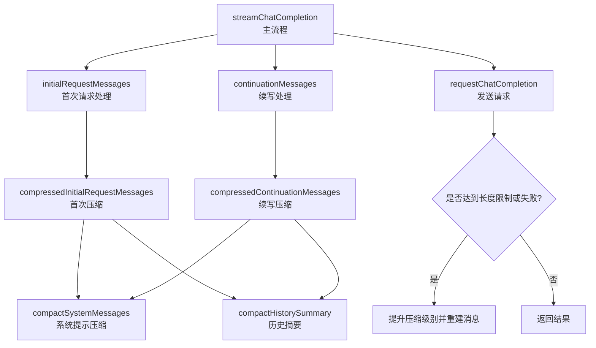
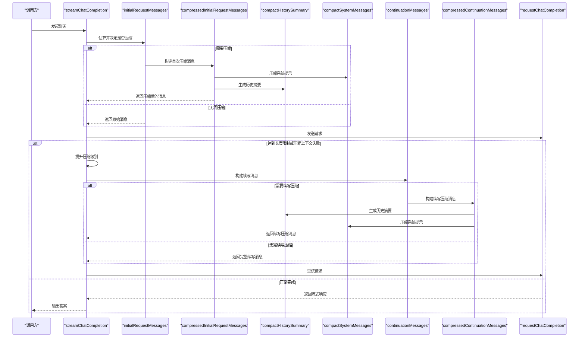
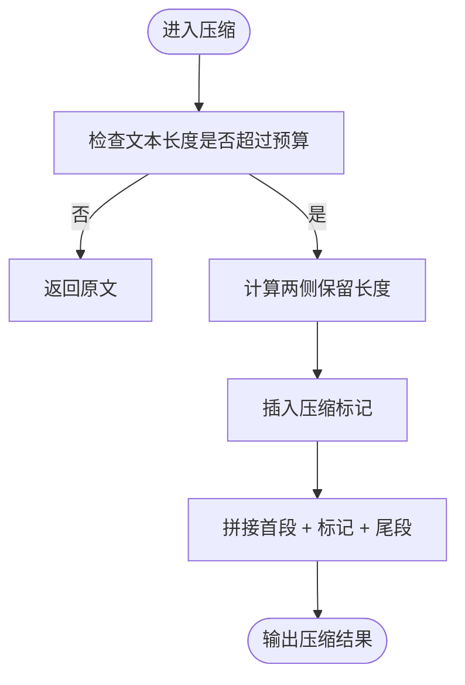
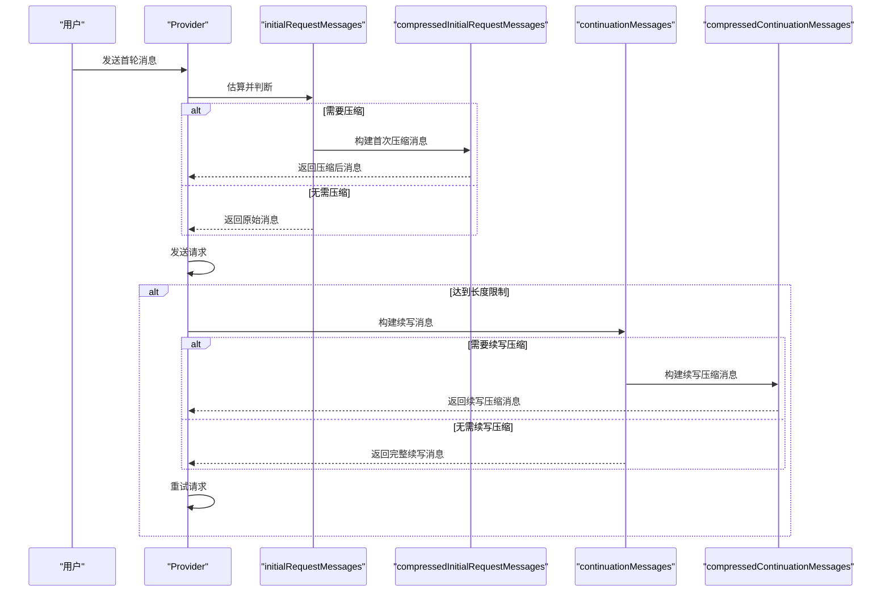
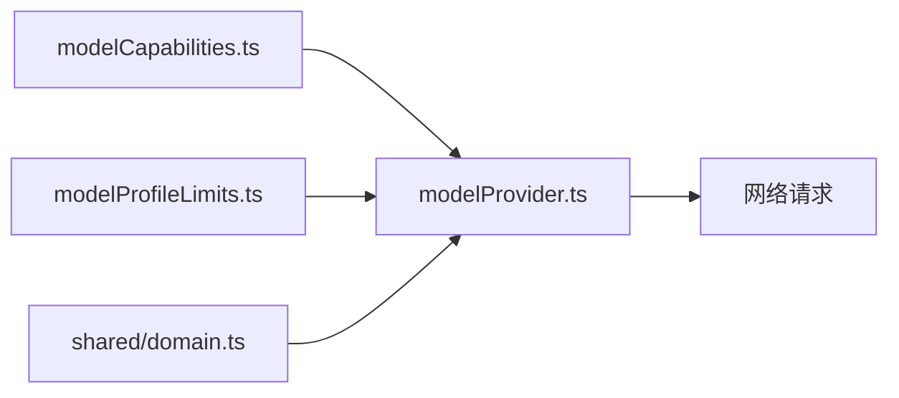

# 上下文压缩

<cite>
**本文引用的文件**
- [modelProvider.ts](file://src/agent/modelProvider.ts)
- [domain.ts](file://src/shared/domain.ts)
- [modelCapabilities.ts](file://src/agent/modelCapabilities.ts)
- [modelProfileLimits.ts](file://src/shared/modelProfileLimits.ts)
</cite>

## 目录
1. [简介](#简介)
2. [项目结构](#项目结构)
3. [核心组件](#核心组件)
4. [架构总览](#架构总览)
5. [详细组件分析](#详细组件分析)
6. [依赖关系分析](#依赖关系分析)
7. [性能考量](#性能考量)
8. [故障排查指南](#故障排查指南)
9. [结论](#结论)
10. [附录：配置与调优建议](#附录配置与调优建议)

## 简介
本文件系统性说明上下文压缩机制，包括：
- 上下文窗口限制的概念与重要性（默认窗口 16,384 tokens；长上下文支持 32,768 tokens）
- 压缩算法实现细节（estimatedMessagesTokens、compactSystemMessages、compactHistorySummary 等）
- 压缩策略层次（软限制、硬限制、压缩级别）
- 初始请求压缩与续写消息压缩的差异
- 压缩效果评估、性能影响分析与配置调优建议
- 实际使用场景与最佳实践

该机制的目标是在模型上下文窗口受限的情况下，通过本地压缩历史、系统提示与最新用户输入，保证对话可继续推进，同时尽量保留关键语义。

## 项目结构
上下文压缩逻辑集中在模型提供层，围绕一次聊天流式调用进行“估算—判断—压缩—重试”的闭环控制。相关类型定义位于共享域中，能力与上限常量在能力与限制模块中声明。

图表来源
- [modelProvider.ts:55-197](file://src/agent/modelProvider.ts#L55-L197)
- [modelProvider.ts:209-339](file://src/agent/modelProvider.ts#L209-L339)
- [modelProvider.ts:341-467](file://src/agent/modelProvider.ts#L341-L467)

章节来源
- [modelProvider.ts:55-197](file://src/agent/modelProvider.ts#L55-L197)
- [domain.ts:130-148](file://src/shared/domain.ts#L130-L148)
- [modelCapabilities.ts:113-148](file://src/agent/modelCapabilities.ts#L113-L148)
- [modelProfileLimits.ts:1-3](file://src/shared/modelProfileLimits.ts#L1-L3)

## 核心组件
- 上下文窗口与阈值
  - 默认上下文窗口：16,384 tokens
  - 长上下文窗口：32,768 tokens（由模型能力 longContext 决定）
  - 压缩触发阈值：75%（CONTEXT_COMPRESSION_THRESHOLD）
  - 最小续写片段 token 数：768（MIN_CONTINUATION_SECTION_TOKENS）
  - 字符到 token 近似换算：约 4 字符/token（APPROX_CONTEXT_CHARS_PER_TOKEN）

- 软限制计算
  - contextCompressionSoftLimit(profile)：基于当前模型的上下文窗口、预留输出空间与阈值，计算“软限制”，用于早期主动压缩，避免触发硬限制错误。

- 估算函数
  - estimatedMessagesTokens(messages)：对消息列表做 token 估算，用于快速判断是否需要压缩。
  - estimateTextTokens / estimateContentTokens：按文本与内容部分估算 token 数。

- 压缩函数
  - compactSystemMessages：按比例分配预算，对系统提示做中间裁剪，保留首尾关键信息。
  - compactHistorySummary：从最近的历史消息开始，逐条生成“角色: 内容”的摘要片段，直到预算耗尽。
  - compactLatestUserMessageContent / compactLatestUserContent：对最新用户输入做内容级压缩，保留图片附件。
  - compactTail：对已生成的助手回答尾部进行裁剪，便于续写时衔接。

- 流程控制
  - initialRequestMessages：若未强制压缩且估算不超过软限制，直接返回原消息；否则进入首次压缩。
  - continuationMessages：构造包含“继续”指令的完整续写消息，若未强制压缩且不超过软限制则直接返回；否则进入续写压缩。
  - compressedInitialRequestMessages / compressedContinuationMessages：根据压缩级别动态调整预算比例，组装带压缩提示的新消息序列。

- 错误与重试
  - isContextLimitFailure / isCompressedProviderFailure：识别上下文超限或服务端在处理压缩上下文时的失败。
  - streamChatCompletion 主循环：遇到上述错误且压缩级别小于 3 时，自动提升压缩级别并重试。

章节来源
- [modelProvider.ts:49-53](file://src/agent/modelProvider.ts#L49-L53)
- [modelProvider.ts:209-339](file://src/agent/modelProvider.ts#L209-L339)
- [modelProvider.ts:341-467](file://src/agent/modelProvider.ts#L341-L467)
- [modelProvider.ts:469-484](file://src/agent/modelProvider.ts#L469-L484)
- [modelProvider.ts:55-197](file://src/agent/modelProvider.ts#L55-L197)

## 架构总览
下图展示了一次聊天流式调用中的上下文压缩决策与执行路径。

图表来源
- [modelProvider.ts:55-197](file://src/agent/modelProvider.ts#L55-L197)
- [modelProvider.ts:209-339](file://src/agent/modelProvider.ts#L209-L339)
- [modelProvider.ts:341-467](file://src/agent/modelProvider.ts#L341-L467)

## 详细组件分析

### 上下文窗口与软限制
- 默认窗口：16,384 tokens
- 长上下文窗口：32,768 tokens（当 profile.capabilities.longContext 为真时使用）
- 软限制计算：contextCompressionSoftLimit(profile) 会预留输出空间（至少 1,024 或 maxOutputTokens），再乘以压缩阈值（75%），得到“软限制”。这用于在接近硬限制前主动压缩，降低失败概率。

章节来源
- [modelProvider.ts:49-53](file://src/agent/modelProvider.ts#L49-L53)
- [modelProvider.ts:334-339](file://src/agent/modelProvider.ts#L334-L339)
- [modelCapabilities.ts:113-118](file://src/agent/modelCapabilities.ts#L113-L118)
- [modelProfileLimits.ts:1-3](file://src/shared/modelProfileLimits.ts#L1-L3)

### 估算与预算分配
- estimatedMessagesTokens：遍历消息，估算每条内容的 token 数并累加，作为是否压缩的依据。
- 预算分配：
  - 首次压缩：systemBudget ≈ 12%，userBudget ≈ 58%，historyBudget 为剩余（最低 384）。
  - 续写压缩：systemBudget ≈ 12%，userBudget ≈ 34%，answerTailBudget ≈ 42%，historyBudget 为剩余（最低 384）。
  - 所有预算均受 MIN_CONTINUATION_SECTION_TOKENS 保护，确保关键片段不被过度裁剪。

章节来源
- [modelProvider.ts:220-261](file://src/agent/modelProvider.ts#L220-L261)
- [modelProvider.ts:280-332](file://src/agent/modelProvider.ts#L280-L332)
- [modelProvider.ts:341-372](file://src/agent/modelProvider.ts#L341-L372)

### 压缩算法详解
- compactSystemMessages：将系统提示按消息数量平均分配字符预算，并对每条内容做中间裁剪，保留首尾。
- compactHistorySummary：从最近的消息开始，逐条生成“角色: 内容”的摘要片段，直到预算耗尽；输出包含“已压缩消息计数”的头部提示。
- compactLatestUserMessageContent：对最新用户输入进行内容级压缩，保留图片附件，插入提示以告知模型这是“最新用户请求”。
- compactTail：仅保留助手回答的尾部片段，配合“继续”指令实现无缝续写。

图表来源
- [modelProvider.ts:415-429](file://src/agent/modelProvider.ts#L415-L429)

章节来源
- [modelProvider.ts:374-467](file://src/agent/modelProvider.ts#L374-L467)

### 初始请求压缩 vs 续写消息压缩
- 初始请求压缩：
  - 目标：在首次请求前，将历史与系统提示压缩，保留最新用户请求。
  - 输出：系统提示（压缩）、一条包含压缩提示与历史摘要的用户消息、最新用户请求（可能压缩）。
- 续写消息压缩：
  - 目标：在模型输出达到长度限制或压缩上下文失败时，构造“继续”请求，保留助手回答尾部与最新用户请求，压缩历史与系统提示。
  - 输出：系统提示（压缩）、一条包含压缩提示与历史摘要的用户消息、最新用户请求（可能压缩）、助手回答尾部（压缩）、“继续”指令。

图表来源
- [modelProvider.ts:209-332](file://src/agent/modelProvider.ts#L209-L332)

章节来源
- [modelProvider.ts:209-332](file://src/agent/modelProvider.ts#L209-L332)

### 压缩级别与重试机制
- 压缩级别：
  - 每次失败后提升一级（最多至 3），通过 compressionFactor = 0.62^level 进一步收紧预算。
  - 级别越高，系统提示、历史摘要与用户输入的保留量越低。
- 重试策略：
  - 检测到上下文超限或服务端在处理压缩上下文时失败，且压缩级别 < 3，则重新构建消息并重试。
  - 若仍失败，抛出明确错误，提示“在服务端处理压缩上下文时失败”。

章节来源
- [modelProvider.ts:89-118](file://src/agent/modelProvider.ts#L89-L118)
- [modelProvider.ts:220-261](file://src/agent/modelProvider.ts#L220-L261)
- [modelProvider.ts:280-332](file://src/agent/modelProvider.ts#L280-L332)
- [modelProvider.ts:469-484](file://src/agent/modelProvider.ts#L469-L484)

## 依赖关系分析
- 能力与限制
  - modelCapabilities.ts：校验推理设置、规范化最大输出 token。
  - modelProfileLimits.ts：定义默认与最大输出 token 上限。
  - domain.ts：定义模型能力（含 longContext）、运行指标与阶段等类型。

- 运行时上下文
  - modelProvider.ts：实现上下文压缩、流式处理、错误检测与重试。

图表来源
- [modelCapabilities.ts:113-148](file://src/agent/modelCapabilities.ts#L113-L148)
- [modelProfileLimits.ts:1-3](file://src/shared/modelProfileLimits.ts#L1-L3)
- [domain.ts:130-148](file://src/shared/domain.ts#L130-L148)
- [modelProvider.ts:55-197](file://src/agent/modelProvider.ts#L55-L197)

章节来源
- [modelCapabilities.ts:113-148](file://src/agent/modelCapabilities.ts#L113-L148)
- [modelProfileLimits.ts:1-3](file://src/shared/modelProfileLimits.ts#L1-L3)
- [domain.ts:130-148](file://src/shared/domain.ts#L130-L148)
- [modelProvider.ts:55-197](file://src/agent/modelProvider.ts#L55-L197)

## 性能考量
- 估算开销：estimatedMessagesTokens 对每条消息内容进行线性扫描，复杂度 O(N)，N 为消息数量。由于仅在必要时触发，整体开销可控。
- 压缩开销：compactHistorySummary 与 compactSystemMessages 均为线性处理，按预算分配与字符串切片，时间复杂度 O(M)，M 为被压缩内容长度。
- 内存占用：压缩过程产生新的字符串与数组，但预算有限，峰值内存增长较小。
- 网络往返：压缩失败会触发重试，增加一次或多次网络往返；通过软限制提前压缩可降低失败率。
- 吞吐影响：压缩级别提升会降低保留信息量，可能影响回答质量；建议在满足稳定性的前提下保持较低压缩级别。

[本节为通用性能讨论，不直接分析具体文件]

## 故障排查指南
- 常见问题
  - “上下文超限”错误：通常发生在消息总量接近或超过模型上下文窗口。检查 soft limit 与压缩级别，必要时提升压缩级别或减少历史长度。
  - “服务端处理压缩上下文失败”：当模型服务无法处理压缩后的上下文时发生。尝试降低压缩级别或缩短历史摘要。
  - “流式响应无可读流”：检查网络与服务端状态，确认响应体存在。

- 定位步骤
  - 查看 onPhase('compressing') 是否出现，确认压缩是否生效。
  - 检查 estimatedMessagesTokens 与 contextCompressionSoftLimit 的关系，确认是否在软限制内。
  - 观察压缩级别变化，确认重试次数与最终结果。

章节来源
- [modelProvider.ts:89-118](file://src/agent/modelProvider.ts#L89-L118)
- [modelProvider.ts:469-484](file://src/agent/modelProvider.ts#L469-L484)
- [modelProvider.ts:121-123](file://src/agent/modelProvider.ts#L121-L123)

## 结论
上下文压缩机制通过“估算—软限制—压缩—重试”的闭环，有效应对模型上下文窗口限制。其设计兼顾了：
- 准确性：保留最新用户请求与助手回答尾部，维持对话连贯性
- 鲁棒性：多级压缩与错误重试，降低失败概率
- 可扩展性：通过模型能力 longContext 切换窗口大小，适配不同模型

在实际使用中，建议结合业务场景调整压缩级别与预算比例，平衡质量与稳定性。

[本节为总结性内容，不直接分析具体文件]

## 附录：配置与调优建议
- 窗口选择
  - 若模型支持 longContext，优先启用以获得更大上下文窗口（32,768 tokens）。
  - 默认窗口为 16,384 tokens，适用于大多数场景。

- 输出预留
  - maxOutputTokens 越大，软限制越小；合理设置以避免压缩过激。
  - 默认最大输出为 2048，上限为 32,768。

- 压缩级别
  - 初始级别为 0；失败时逐步提升至 3。
  - 级别越高，保留信息越少；建议在稳定性优先的场景下谨慎提升。

- 预算比例
  - 首次压缩：系统提示 12%、用户输入 58%、历史剩余。
  - 续写压缩：系统提示 12%、用户输入 34%、回答尾部 42%、历史剩余。
  - 可根据业务需求微调比例，但需保证最小片段不低于 MIN_CONTINUATION_SECTION_TOKENS。

- 监控与评估
  - 关注 onPhase('compressing') 频率与压缩级别变化。
  - 统计重试次数与失败原因，优化历史长度与预算分配。

章节来源
- [modelProvider.ts:49-53](file://src/agent/modelProvider.ts#L49-L53)
- [modelProvider.ts:209-339](file://src/agent/modelProvider.ts#L209-L339)
- [modelCapabilities.ts:113-148](file://src/agent/modelCapabilities.ts#L113-L148)
- [modelProfileLimits.ts:1-3](file://src/shared/modelProfileLimits.ts#L1-L3)