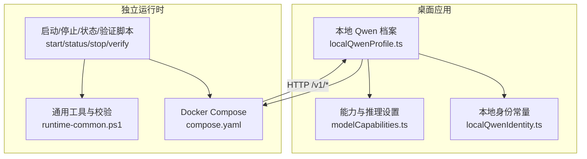
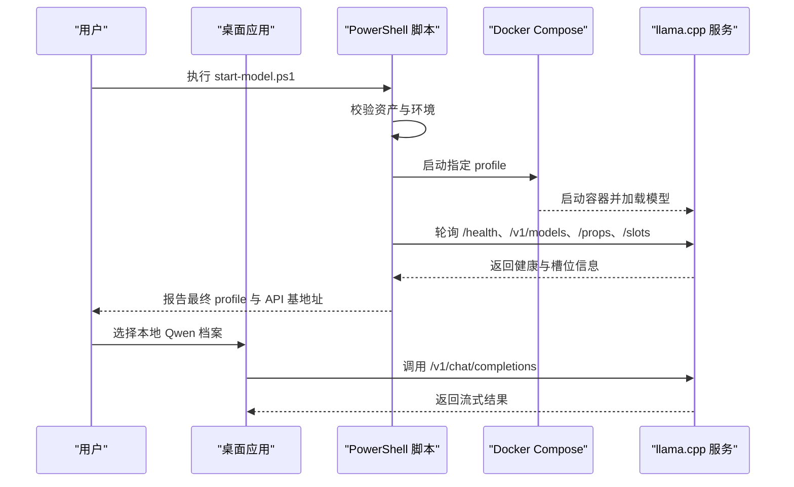
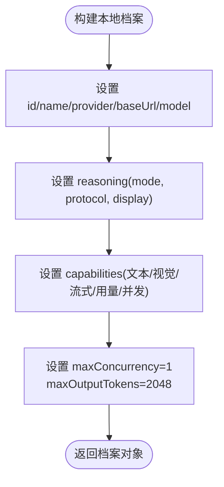
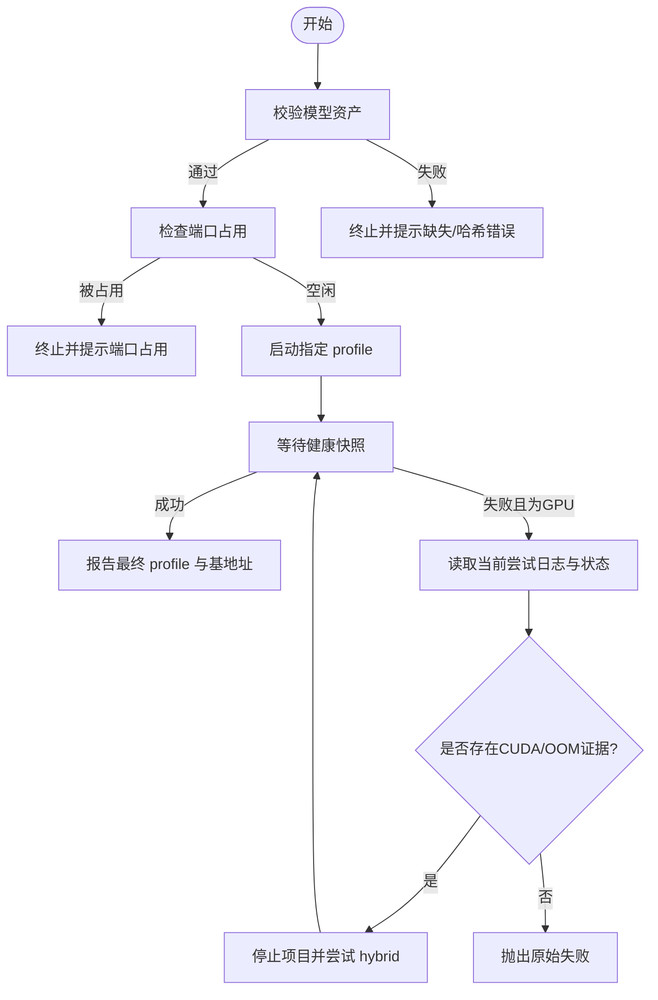
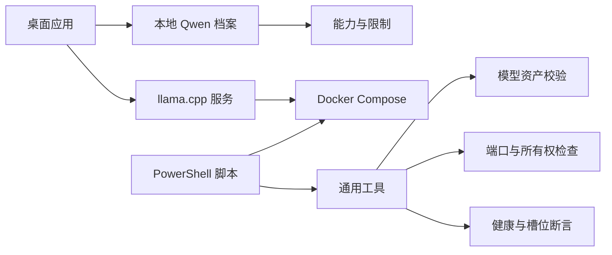

# 本地 Qwen 模型集成

<cite>
**本文引用的文件**
- [localQwenProfile.ts](file://src/agent/localQwenProfile.ts)
- [localQwenIdentity.ts](file://src/shared/localQwenIdentity.ts)
- [modelCapabilities.ts](file://src/agent/modelCapabilities.ts)
- [compose.yaml](file://model-runtime/compose.yaml)
- [runtime-common.ps1](file://model-runtime/runtime-common.ps1)
- [start-model.ps1](file://model-runtime/start-model.ps1)
- [status-model.ps1](file://model-runtime/status-model.ps1)
- [stop-model.ps1](file://model-runtime/stop-model.ps1)
- [verify-model.ps1](file://model-runtime/verify-model.ps1)
- [README.md](file://model-runtime/README.md)
- [2026-08-18-local-qwen-runtime-direct-connection-design.md](file://docs/superpowers/specs/2026-08-18-local-qwen-runtime-direct-connection-design.md)
- [localQwenProfile.test.ts](file://tests/localQwenProfile.test.ts)
- [modelRuntimeConfig.test.ts](file://tests/modelRuntimeConfig.test.ts)
- [modelRuntimeScriptsBehavior.test.ts](file://tests/modelRuntimeScriptsBehavior.test.ts)
</cite>

## 目录
1. [简介](#简介)
2. [项目结构](#项目结构)
3. [核心组件](#核心组件)
4. [架构总览](#架构总览)
5. [详细组件分析](#详细组件分析)
6. [依赖关系分析](#依赖关系分析)
7. [性能与资源管理](#性能与资源管理)
8. [故障诊断指南](#故障诊断指南)
9. [结论](#结论)
10. [附录：安装部署与配置示例](#附录安装部署与配置示例)

## 简介
本文件面向本地运行 Qwen3.5-9B 的桌面端集成，说明独立容器化运行时、进程管理与健康检查机制，解释 localQwenProfile 的配置项与启动参数，对比远程 API 的差异与本地化特殊处理，并提供安装部署步骤、配置示例与故障诊断方法。整体设计强调“桌面不拥有模型生命周期”，通过 Docker Compose 以三个互斥 profile（cpu/hybrid/gpu）暴露 OpenAI 兼容接口于 127.0.0.1:8080/v1，桌面仅做连接探测与直连调用。

## 项目结构
- model-runtime：独立运行时目录，包含 compose.yaml、PowerShell 脚本与文档，负责容器编排、健康检查、启停与验证。
- src/agent/localQwenProfile.ts：声明内置本地 Qwen 模型档案，提供 provider、baseUrl、model、能力与并发限制等。
- src/shared/localQwenIdentity.ts：定义本地服务标识常量与识别函数。
- src/agent/modelCapabilities.ts：定义 Qwen 能力集、推理模式、并发与输出 token 上限等。
- tests/*：覆盖 Compose 配置、脚本行为、本地档案与运行时契约。



图表来源
- [compose.yaml:1-127](file://model-runtime/compose.yaml#L1-L127)
- [runtime-common.ps1:1-294](file://model-runtime/runtime-common.ps1#L1-L294)
- [localQwenProfile.ts:1-32](file://src/agent/localQwenProfile.ts#L1-L32)
- [modelCapabilities.ts:1-207](file://src/agent/modelCapabilities.ts#L1-L207)
- [localQwenIdentity.ts:1-21](file://src/shared/localQwenIdentity.ts#L1-L21)

章节来源
- [compose.yaml:1-127](file://model-runtime/compose.yaml#L1-L127)
- [README.md:1-53](file://model-runtime/README.md#L1-L53)

## 核心组件
- 本地 Qwen 档案
  - 提供 id、name、provider=“openai-compatible”、baseUrl=“http://127.0.0.1:8080/v1”、model=“Qwen3.5-9B”。
  - 默认 maxConcurrency=1，maxOutputTokens=2048，reasoning 模式为 disabled，协议 qwen，显示 auto。
  - 能力集支持文本、视觉、流式、用量统计；并发可配置但默认 1。
- 运行时容器编排
  - 三套互斥 profile：cpu、hybrid、gpu，均只绑定 127.0.0.1:8080，挂载两个 GGUF 文件为只读。
  - 启用连续批处理、指标、slots、Jinja 模板与健康检查。
- PowerShell 运维脚本
  - start-model.ps1：校验环境、端口、资产，拉起指定 profile，等待健康快照，GPU 失败时尝试一次 hybrid 回退。
  - status-model.ps1：展示项目、profile、状态、健康、模型、槽位数。
  - stop-model.ps1：安全停止当前项目所有 profile。
  - verify-model.ps1：校验资产、健康、模型发现、属性与槽位，发送一次完成请求并可并发压测。
- 共享运行时工具
  - runtime-common.ps1：封装 Compose 调用、资产校验、端口占用检测、固定项目所有权判定、健康/发现/属性/槽位断言、完成响应断言与统一快照生成。

章节来源
- [localQwenProfile.ts:1-32](file://src/agent/localQwenProfile.ts#L1-L32)
- [modelCapabilities.ts:14-24](file://src/agent/modelCapabilities.ts#L14-L24)
- [compose.yaml:1-127](file://model-runtime/compose.yaml#L1-L127)
- [runtime-common.ps1:15-294](file://model-runtime/runtime-common.ps1#L15-L294)
- [start-model.ps1:1-154](file://model-runtime/start-model.ps1#L1-L154)
- [status-model.ps1:1-18](file://model-runtime/status-model.ps1#L1-L18)
- [stop-model.ps1:1-16](file://model-runtime/stop-model.ps1#L1-L16)
- [verify-model.ps1:1-90](file://model-runtime/verify-model.ps1#L1-L90)

## 架构总览
桌面端通过内置本地 Qwen 档案直连 llama.cpp 暴露的 OpenAI 兼容接口。运行时由 Docker Compose 管理，三个 profile 分别对应不同硬件路径。脚本确保资产完整、端口可用、项目所有权唯一，并通过严格的健康检查与槽位一致性校验保证可用性。



图表来源
- [start-model.ps1:105-149](file://model-runtime/start-model.ps1#L105-L149)
- [runtime-common.ps1:170-294](file://model-runtime/runtime-common.ps1#L170-L294)
- [compose.yaml:1-127](file://model-runtime/compose.yaml#L1-L127)
- [localQwenProfile.ts:13-25](file://src/agent/localQwenProfile.ts#L13-L25)

## 详细组件分析

### 本地 Qwen 档案与能力
- 档案字段
  - id：local-qwen35
  - name：Local Qwen3.5-9B
  - provider：openai-compatible
  - baseUrl：http://127.0.0.1:8080/v1
  - model：Qwen3.5-9B
  - reasoning：mode=disabled，protocol=qwen，display=auto
  - capabilities：text、vision、streaming、usage 等开启；concurrency 默认 1，最大 32
  - maxOutputTokens：2048
- 能力归一化与限制
  - 推理输入模式支持 toggle，输出模式 raw
  - 并发与输出 token 上限在能力层进行规范化与边界保护



图表来源
- [localQwenProfile.ts:13-25](file://src/agent/localQwenProfile.ts#L13-L25)
- [modelCapabilities.ts:14-24](file://src/agent/modelCapabilities.ts#L14-L24)
- [modelCapabilities.ts:106-118](file://src/agent/modelCapabilities.ts#L106-L118)

章节来源
- [localQwenProfile.ts:1-32](file://src/agent/localQwenProfile.ts#L1-L32)
- [modelCapabilities.ts:1-207](file://src/agent/modelCapabilities.ts#L1-L207)
- [localQwenIdentity.ts:1-21](file://src/shared/localQwenIdentity.ts#L1-L21)
- [localQwenProfile.test.ts:7-49](file://tests/localQwenProfile.test.ts#L7-L49)

### 容器化编排与健康检查
- 三个互斥 profile
  - cpu：CPU 镜像，零 GPU 层
  - hybrid：CUDA 镜像，部分层卸载，Flash Attention
  - gpu：CUDA 镜像，全层卸载，Flash Attention，量化 K/V 缓存
- 共同特性
  - 只绑定 127.0.0.1:8080
  - 挂载两个 GGUF 为只读
  - 启用 continuous batching、metrics、slots、jinja
  - 健康检查：/health
- 环境变量
  - LLAMA_PARALLEL：槽数
  - LLAMA_CTX_SIZE：总上下文容量（多槽需相应提高）
  - LLAMA_N_PREDICT：服务端生成上限
  - LLAMA_GPU_LAYERS_HYBRID：hybrid 模式的 GPU 层数

```mermaid
classDiagram
class ComposeService {
+string profile
+string image
+int port
+string[] command
+healthcheck health
}
class CpuService {
+int n_gpu_layers = 0
}
class HybridService {
+int n_gpu_layers = "${LLAMA_GPU_LAYERS_HYBRID}"
+bool flash_attn = true
}
class GpuService {
+int n_gpu_layers = 999
+bool flash_attn = true
+string cache_type_k = "q8_0"
+string cache_type_v = "q8_0"
}
ComposeService <|-- CpuService
ComposeService <|-- HybridService
ComposeService <|-- GpuService
```

图表来源
- [compose.yaml:4-127](file://model-runtime/compose.yaml#L4-L127)

章节来源
- [compose.yaml:1-127](file://model-runtime/compose.yaml#L1-L127)
- [README.md:30-49](file://model-runtime/README.md#L30-L49)

### 启动流程与 GPU 回退
- 启动前校验
  - 校验 Docker CLI 与守护进程
  - 校验模型文件大小与 SHA-256
  - 检查 127.0.0.1:8080 未被占用
  - 判定固定项目所有权，避免误操作其他容器
- 启动与等待健康
  - 使用 Compose 启动指定 profile
  - 轮询 /health、/v1/models、/props、/slots，要求 status=ok、模型 ID 精确匹配、槽位数组非空且数量一致
- GPU 回退策略
  - 若默认 GPU 启动失败且存在 CUDA OOM/加载失败证据，则停止当前项目并尝试 hybrid 一次
  - 日志与状态查询限定在当前尝试时间段内，避免历史干扰



图表来源
- [start-model.ps1:105-149](file://model-runtime/start-model.ps1#L105-L149)
- [runtime-common.ps1:43-86](file://model-runtime/runtime-common.ps1#L43-L86)
- [runtime-common.ps1:104-168](file://model-runtime/runtime-common.ps1#L104-L168)
- [runtime-common.ps1:170-294](file://model-runtime/runtime-common.ps1#L170-L294)

章节来源
- [start-model.ps1:1-154](file://model-runtime/start-model.ps1#L1-L154)
- [runtime-common.ps1:1-294](file://model-runtime/runtime-common.ps1#L1-L294)
- [modelRuntimeScriptsBehavior.test.ts:151-230](file://tests/modelRuntimeScriptsBehavior.test.ts#L151-L230)

### 状态监控与生命周期管理
- 状态查看
  - status-model.ps1 输出项目名、profile、状态、主机、端口、健康、模型、槽位数
- 生命周期
  - stop-model.ps1 仅停止当前固定项目的全部 profile，不删除卷
  - 桌面端不主动启停或重启容器，仅做连接探测与直连调用
- 所有权与安全边界
  - 通过 Compose 项目名与端口发布器锁定唯一所有者
  - 拒绝无关进程占用端口或模糊所有权场景

章节来源
- [status-model.ps1:1-18](file://model-runtime/status-model.ps1#L1-L18)
- [stop-model.ps1:1-16](file://model-runtime/stop-model.ps1#L1-L16)
- [runtime-common.ps1:104-168](file://model-runtime/runtime-common.ps1#L104-L168)
- [2026-08-18-local-qwen-runtime-direct-connection-design.md:163-176](file://docs/superpowers/specs/2026-08-18-local-qwen-runtime-direct-connection-design.md#L163-L176)

### 与远程 API 的差异与本地化特殊处理
- 差异点
  - 本地直连 llama.cpp，无代理、无鉴权、无跨域
  - 强制模型标识匹配 Qwen3.5-9B，拒绝任意可达端点
  - 并发与上下文容量由运行时环境变量控制，客户端并发独立配置
- 本地化处理
  - thinking 开关通过 chat_template_kwargs.enable_thinking 传递
  - reasoning_content 映射到原始推理流，content 映射到最终答案流
  - 每次请求携带正整数 max_tokens，受客户端与服务器双重上限约束
  - 流式传输保留重复、前缀、后缀增量片段，SSE ID 去重仅在存在真实非空 ID 时生效

章节来源
- [2026-08-18-local-qwen-runtime-direct-connection-design.md:177-199](file://docs/superpowers/specs/2026-08-18-local-qwen-runtime-direct-connection-design.md#L177-L199)
- [modelCapabilities.ts:14-24](file://src/agent/modelCapabilities.ts#L14-L24)

## 依赖关系分析
- 桌面端依赖
  - 本地 Qwen 档案与能力定义
  - 直接 HTTP 调用 /v1/* 接口
- 运行时依赖
  - Docker Compose 与镜像
  - 模型资产（GGUF）完整性与哈希
  - 环境变量控制并发与上下文
- 脚本依赖
  - 通用工具函数用于资产、端口、所有权、健康与槽位校验



图表来源
- [localQwenProfile.ts:13-25](file://src/agent/localQwenProfile.ts#L13-L25)
- [modelCapabilities.ts:14-24](file://src/agent/modelCapabilities.ts#L14-L24)
- [compose.yaml:1-127](file://model-runtime/compose.yaml#L1-L127)
- [runtime-common.ps1:15-294](file://model-runtime/runtime-common.ps1#L15-L294)

章节来源
- [modelRuntimeConfig.test.ts:1-28](file://tests/modelRuntimeConfig.test.ts#L1-L28)
- [modelRuntimeScriptsBehavior.test.ts:122-149](file://tests/modelRuntimeScriptsBehavior.test.ts#L122-L149)

## 性能与资源管理
- 并发与上下文
  - LLAMA_PARALLEL 控制槽数；LLAMA_CTX_SIZE 为总上下文容量，多槽需按比例提升
  - 默认单槽 16384 上下文；双槽建议 32768，内存显著增加
- 生成上限
  - LLAMA_N_PREDICT 作为服务端上限；客户端也发送正整数 max_tokens，取更严格者
- 硬件优化
  - hybrid/gpu 启用 Flash Attention；gpu 使用量化 K/V 缓存
  - 默认 RTX 5060 Laptop 8 GiB 场景下保持单槽稳定
- 最佳实践
  - 先验证单槽稳定性再提升并行度
  - 观察 CUDA OOM、重启循环与延迟，必要时回退 hybrid 或降低并发
  - 将客户端并发与服务端槽数对齐，避免队列拥塞

章节来源
- [README.md:41-49](file://model-runtime/README.md#L41-L49)
- [2026-08-18-local-qwen-runtime-direct-connection-design.md:91-109](file://docs/superpowers/specs/2026-08-18-local-qwen-runtime-direct-connection-design.md#L91-L109)

## 故障诊断指南
- 常见错误与定位
  - Docker 不可用：脚本在 Compose 变更前失败并提示缺依赖
  - 模型缺失或损坏：启动前关闭失败，打印具体文件名与哈希差异
  - 端口占用：拒绝启动并提示 127.0.0.1:8080 已被占用
  - GPU 启动失败：收集当前尝试日志与状态，若存在 CUDA OOM/加载失败证据则尝试 hybrid 一次
  - 模型不匹配：/v1/models 未列出 Qwen3.5-9B 即视为不匹配
  - 槽位不可用：聊天仍可连通，但并发标记为未验证
  - 流结束无最终答案：请求失败且不记录为空回答
- 诊断命令
  - 查看状态：status-model.ps1
  - 验证端到端：verify-model.ps1（可选并发参数）
  - 停止运行：stop-model.ps1

章节来源
- [runtime-common.ps1:43-86](file://model-runtime/runtime-common.ps1#L43-L86)
- [runtime-common.ps1:170-294](file://model-runtime/runtime-common.ps1#L170-L294)
- [start-model.ps1:87-149](file://model-runtime/start-model.ps1#L87-L149)
- [verify-model.ps1:31-81](file://model-runtime/verify-model.ps1#L31-L81)
- [modelRuntimeScriptsBehavior.test.ts:62-120](file://tests/modelRuntimeScriptsBehavior.test.ts#L62-L120)

## 结论
本地 Qwen 集成采用独立容器化运行时与严格的健康/槽位校验，桌面端仅做直连探测与调用，不拥有模型生命周期。通过 CPU/hybrid/gpu 三种 profile 适配不同硬件，结合环境变量精细控制并发与上下文容量。脚本保障资产完整、端口安全与所有权唯一，并在 GPU 失败时提供一次智能回退。该方案兼顾安全性、可观测性与可维护性，适合本地开发与生产验证。

## 附录：安装部署与配置示例
- 前置条件
  - 安装 Docker 并确认可用
  - 准备模型文件并放置于 models/ 目录
- 首次配置
  - 复制 .env.example 为 .env
- 启动模型
  - 从 model-runtime 目录执行：docker compose --env-file .env --profile gpu up -d
  - 或使用脚本：start-model.ps1（默认 gpu，失败时尝试 hybrid）
- 查看状态
  - 执行 status-model.ps1
- 验证连通
  - 执行 verify-model.ps1（可选添加并发参数）
- 停止模型
  - 执行 stop-model.ps1 或 docker compose --env-file .env down

章节来源
- [README.md:7-49](file://model-runtime/README.md#L7-L49)
- [start-model.ps1:105-149](file://model-runtime/start-model.ps1#L105-L149)
- [status-model.ps1:8-13](file://model-runtime/status-model.ps1#L8-L13)
- [verify-model.ps1:31-81](file://model-runtime/verify-model.ps1#L31-L81)
- [stop-model.ps1:8-11](file://model-runtime/stop-model.ps1#L8-L11)