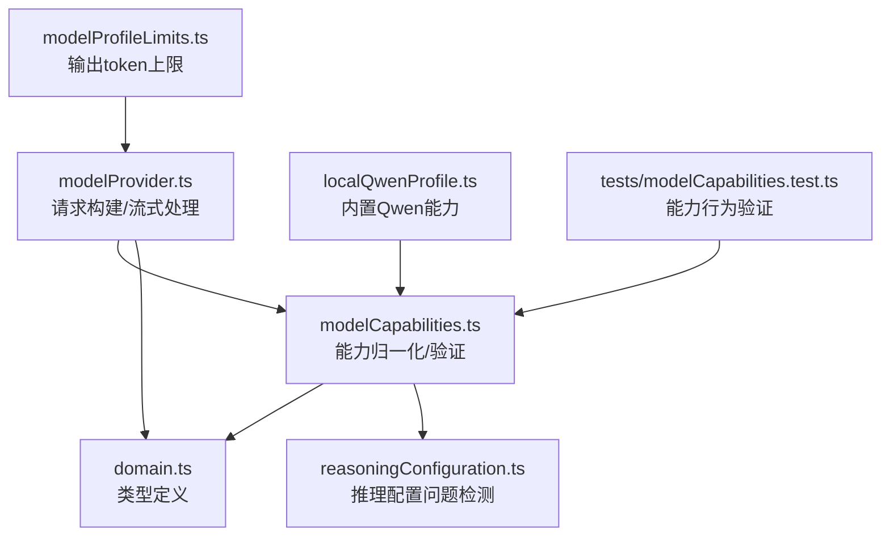
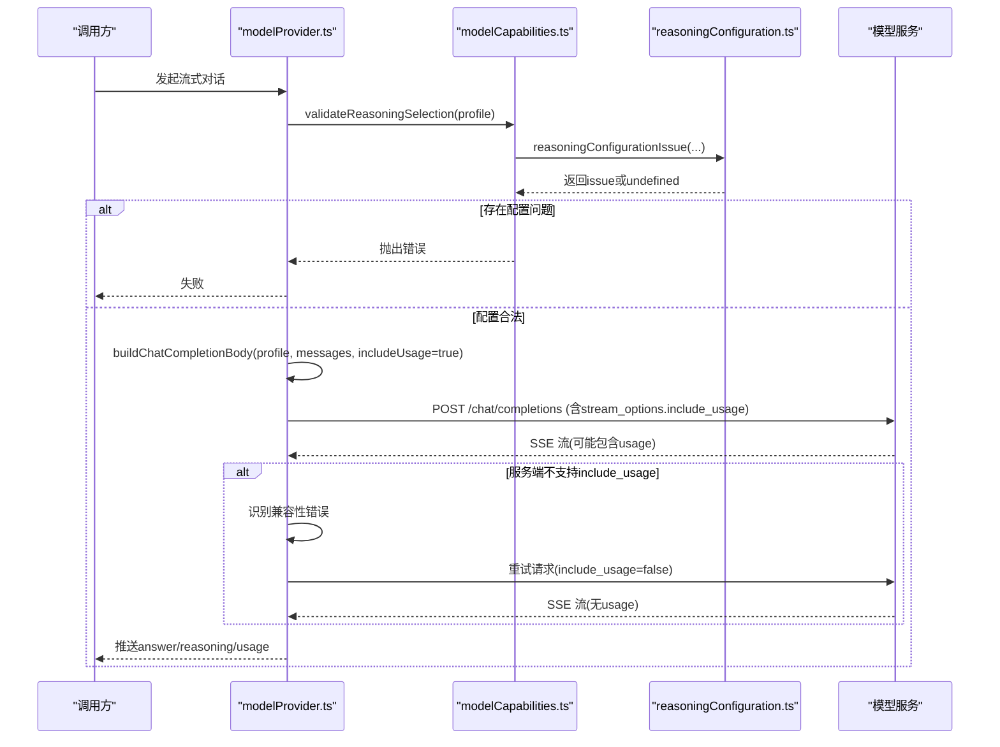
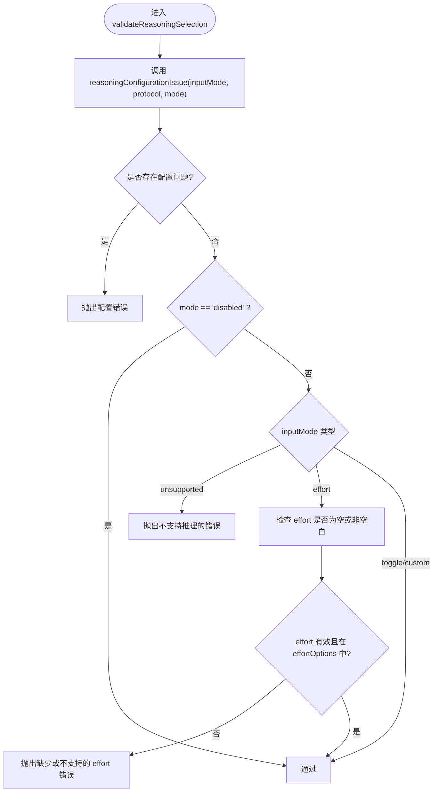
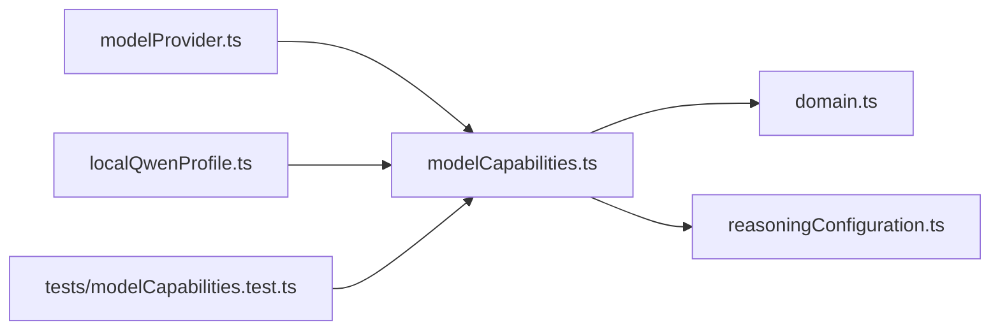

# 模型能力声明

<cite>
**本文引用的文件**
- [src/agent/modelCapabilities.ts](file://src/agent/modelCapabilities.ts)
- [src/shared/domain.ts](file://src/shared/domain.ts)
- [src/shared/reasoningConfiguration.ts](file://src/shared/reasoningConfiguration.ts)
- [src/agent/modelProvider.ts](file://src/agent/modelProvider.ts)
- [src/agent/localQwenProfile.ts](file://src/agent/localQwenProfile.ts)
- [src/shared/modelProfileLimits.ts](file://src/shared/modelProfileLimits.ts)
- [tests/modelCapabilities.test.ts](file://tests/modelCapabilities.test.ts)
</cite>

## 目录
1. [简介](#简介)
2. [项目结构](#项目结构)
3. [核心组件](#核心组件)
4. [架构总览](#架构总览)
5. [详细组件分析](#详细组件分析)
6. [依赖关系分析](#依赖关系分析)
7. [性能考量](#性能考量)
8. [故障排除指南](#故障排除指南)
9. [结论](#结论)

## 简介
本文件面向“模型能力声明系统”，系统性说明：
- 模型能力检测机制，包括 longContext、usage.tokens 等能力标志的作用与影响。
- 推理模式验证 validateReasoningSelection 的实现原理与安全校验。
- 不同模型提供商的能力差异与兼容性处理策略。
- 能力声明对请求构建与响应处理的实际影响。
- 自定义模型能力的扩展方法与验证规则。
- 能力检测的实际示例与常见问题排查。

## 项目结构
围绕能力声明的关键代码分布在以下模块：
- 能力定义与归一化：src/agent/modelCapabilities.ts
- 领域类型与常量：src/shared/domain.ts、src/shared/modelProfileLimits.ts
- 推理配置校验：src/shared/reasoningConfiguration.ts
- 请求构建与流式调用：src/agent/modelProvider.ts
- 内置本地 Qwen 配置：src/agent/localQwenProfile.ts
- 能力相关测试用例：tests/modelCapabilities.test.ts

**图表来源**
- [src/agent/modelCapabilities.ts:14-167](file://src/agent/modelCapabilities.ts#L14-L167)
- [src/shared/domain.ts:130-148](file://src/shared/domain.ts#L130-L148)
- [src/shared/reasoningConfiguration.ts:9-18](file://src/shared/reasoningConfiguration.ts#L9-L18)
- [src/agent/modelProvider.ts:797-828](file://src/agent/modelProvider.ts#L797-L828)
- [src/agent/localQwenProfile.ts:13-24](file://src/agent/localQwenProfile.ts#L13-L24)
- [src/shared/modelProfileLimits.ts:1-3](file://src/shared/modelProfileLimits.ts#L1-L3)
- [tests/modelCapabilities.test.ts:13-163](file://tests/modelCapabilities.test.ts#L13-L163)

**章节来源**
- [src/agent/modelCapabilities.ts:14-167](file://src/agent/modelCapabilities.ts#L14-L167)
- [src/shared/domain.ts:130-148](file://src/shared/domain.ts#L130-L148)
- [src/shared/reasoningConfiguration.ts:9-18](file://src/shared/reasoningConfiguration.ts#L9-L18)
- [src/agent/modelProvider.ts:797-828](file://src/agent/modelProvider.ts#L797-L828)
- [src/agent/localQwenProfile.ts:13-24](file://src/agent/localQwenProfile.ts#L13-L24)
- [src/shared/modelProfileLimits.ts:1-3](file://src/shared/modelProfileLimits.ts#L1-L3)
- [tests/modelCapabilities.test.ts:13-163](file://tests/modelCapabilities.test.ts#L13-L163)

## 核心组件
- 能力声明与归一化
  - qwenCapabilities/openAiCapabilities：为不同提供商提供默认能力模板。
  - normalizeModelCapabilities/normalizeProfileCapabilities：将输入能力合并并规范化为统一结构，兼容历史字段（如 streamingUsage）。
  - normalizeReasoningSettings：规范化推理设置（mode/protocol/effort/display），确保值在允许范围内。
  - normalizeMaxConcurrency/normalizeMaxOutputTokens：限制并发与输出 token 上限，防止越界。
- 推理选择验证
  - validateReasoningSelection：基于 capabilities.reasoning.inputMode 与 profile.reasoning.mode/protocol/effort 进行安全检查，阻止不合法组合。
- 请求构建与流式处理
  - buildChatCompletionBody：根据能力声明动态注入 stream_options、chat_template_kwargs、reasoning_effort、customRequestBody 等参数。
  - requestChatCompletion：首次尝试带 usage 的请求；若服务端不支持 include_usage，则自动降级重试不带 usage 的请求。
  - parseStreamChunk：解析流式响应中的 answer/reasoning/usage/timings 等字段。
- 内置能力
  - localQwenProfile：为本地 Qwen 提供默认能力与推理协议配置。

**章节来源**
- [src/agent/modelCapabilities.ts:14-118](file://src/agent/modelCapabilities.ts#L14-L118)
- [src/agent/modelCapabilities.ts:120-167](file://src/agent/modelCapabilities.ts#L120-L167)
- [src/agent/modelProvider.ts:797-828](file://src/agent/modelProvider.ts#L797-L828)
- [src/agent/modelProvider.ts:762-795](file://src/agent/modelProvider.ts#L762-L795)
- [src/agent/modelProvider.ts:847-898](file://src/agent/modelProvider.ts#L847-L898)
- [src/agent/localQwenProfile.ts:13-24](file://src/agent/localQwenProfile.ts#L13-L24)

## 架构总览
能力声明贯穿“配置—校验—请求—响应”的完整链路：
- 配置阶段：通过 qwenCapabilities/openAiCapabilities 或用户输入生成 ModelCapabilities，并进行 normalize。
- 校验阶段：validateReasoningSelection 确保推理模式与协议匹配，避免非法启用推理。
- 请求阶段：buildChatCompletionBody 依据 capabilities.reasoning.inputMode 与 capabilities.usage.tokens 决定请求体字段。
- 响应阶段：parseStreamChunk 提取 answer/reasoning/usage/timings；requestChatCompletion 处理 usage 兼容性重试。

**图表来源**
- [src/agent/modelProvider.ts:55-65](file://src/agent/modelProvider.ts#L55-L65)
- [src/agent/modelProvider.ts:762-795](file://src/agent/modelProvider.ts#L762-L795)
- [src/agent/modelProvider.ts:797-828](file://src/agent/modelProvider.ts#L797-L828)
- [src/agent/modelCapabilities.ts:120-148](file://src/agent/modelCapabilities.ts#L120-L148)
- [src/shared/reasoningConfiguration.ts:9-18](file://src/shared/reasoningConfiguration.ts#L9-L18)

## 详细组件分析

### 能力标志与作用
- text/vision：是否支持文本/视觉输入。
- longContext：是否支持长上下文窗口。用于计算 contextCompressionSoftLimit，从而决定压缩阈值与可用输入窗口大小。
- streaming：是否支持流式响应。
- usage.tokens/reasoningTokens：是否支持流式 usage 上报。影响是否在请求中携带 stream_options.include_usage，以及最终 metrics 的来源判定。
- concurrency：并发限制，normalizeMaxConcurrency 会将其限制在 maxLimit 与最小值之间。
- reasoning：
  - inputMode：toggle/effort/custom/unsupported，决定如何向服务端传递推理控制。
  - effortOptions/outputModes/defaultEffort：OpenAI 风格 effort 选项与输出模式。
  - customRequestBody：自定义请求体字段（安全过滤后合并）。

**章节来源**
- [src/shared/domain.ts:130-148](file://src/shared/domain.ts#L130-L148)
- [src/agent/modelCapabilities.ts:14-43](file://src/agent/modelCapabilities.ts#L14-L43)
- [src/agent/modelCapabilities.ts:45-118](file://src/agent/modelCapabilities.ts#L45-L118)
- [src/agent/modelProvider.ts:334-339](file://src/agent/modelProvider.ts#L334-L339)
- [src/agent/modelProvider.ts:810-825](file://src/agent/modelProvider.ts#L810-L825)

### 推理模式验证（validateReasoningSelection）
- 首先调用 reasoningConfigurationIssue 检查基础合法性：当 inputMode 为 unsupported 且 mode 非 disabled 时，返回问题标识。
- 若 profile.reasoning.mode 为 disabled，直接通过。
- 若 inputMode 为 unsupported，抛错提示不支持推理。
- 若 inputMode 为 effort，必须存在有效的 effort 值且在 effortOptions 中，否则抛错。
- 其他情况（toggle/custom）允许继续，因为请求格式由 capabilities 独立配置。

**图表来源**
- [src/agent/modelCapabilities.ts:120-148](file://src/agent/modelCapabilities.ts#L120-L148)
- [src/shared/reasoningConfiguration.ts:9-18](file://src/shared/reasoningConfiguration.ts#L9-L18)

**章节来源**
- [src/agent/modelCapabilities.ts:120-148](file://src/agent/modelCapabilities.ts#L120-L148)
- [src/shared/reasoningConfiguration.ts:9-18](file://src/shared/reasoningConfiguration.ts#L9-L18)
- [tests/modelCapabilities.test.ts:85-144](file://tests/modelCapabilities.test.ts#L85-L144)

### 不同提供商的能力差异与兼容性
- Qwen（toggle）
  - capabilities.reasoning.inputMode = 'toggle'
  - 请求体注入 chat_template_kwargs.enable_thinking，由推理模式开关控制。
  - 默认开启 usage.tokens/reasoningTokens。
- OpenAI 兼容（effort）
  - capabilities.reasoning.inputMode = 'effort'
  - 请求体注入 reasoning_effort，需从 effortOptions 中选择。
  - 默认开启 usage.tokens/reasoningTokens。
- 自定义（custom）
  - capabilities.reasoning.inputMode = 'custom'
  - 通过 customRequestBody 合并额外字段（安全过滤 model/messages/stream）。
- 兼容性处理
  - 首次请求携带 stream_options.include_usage；若服务端返回特定 400/422 错误（参数名或错误码匹配 stream_options/include_usage），则自动重试不带 include_usage 的请求。
  - 解析流式响应时，按字段 presence 提取 prompt_tokens/completion_tokens/total_tokens/reasoning_tokens/predicted_per_second。

**章节来源**
- [src/agent/modelCapabilities.ts:14-43](file://src/agent/modelCapabilities.ts#L14-L43)
- [src/agent/modelProvider.ts:810-828](file://src/agent/modelProvider.ts#L810-L828)
- [src/agent/modelProvider.ts:762-795](file://src/agent/modelProvider.ts#L762-L795)
- [src/agent/modelProvider.ts:847-898](file://src/agent/modelProvider.ts#L847-L898)
- [src/agent/modelProvider.ts:952-989](file://src/agent/modelProvider.ts#L952-L989)

### 能力声明对请求构建的影响
- 当 capabilities.usage.tokens 为 true 时，首次请求包含 stream_options.include_usage。
- 当 capabilities.reasoning.inputMode 为 toggle 时，注入 chat_template_kwargs.enable_thinking。
- 当 capabilities.reasoning.inputMode 为 effort 且 mode 非 disabled 时，注入 reasoning_effort。
- 当 capabilities.reasoning.inputMode 为 custom 时，合并 customRequestBody（跳过受保护字段）。

**章节来源**
- [src/agent/modelProvider.ts:810-828](file://src/agent/modelProvider.ts#L810-L828)

### 能力声明对响应处理的影响
- 解析 choices.delta 中的 content/reasoning_content/reasoning/reasoning_summary，分别映射到 answer/rawReasoning/reasoningSummary。
- 解析 usage.prompt_tokens/completion_tokens/total_tokens/completion_tokens_details.reasoning_tokens。
- 解析 timings.predicted_per_second 作为服务器端速率指标。
- 若 finishReason 为 length 且未产生最终答案，抛出明确错误；若流结束无最终答案，也抛出错误。

**章节来源**
- [src/agent/modelProvider.ts:847-898](file://src/agent/modelProvider.ts#L847-L898)
- [src/agent/modelProvider.ts:1024-1033](file://src/agent/modelProvider.ts#L1024-L1033)

### 自定义模型能力的扩展方法
- 通过 normalizeModelCapabilities/normalizeProfileCapabilities 合并用户输入与已有能力，保留无关声明。
- 使用 openAiCapabilities/qwenCapabilities 作为基线，再覆盖 reasoning.effortOptions/outputModes/defaultEffort/customRequestBody。
- 使用 normalizeReasoningSettings 规范化推理设置，确保 mode/protocol/effort/display 在允许范围。
- 使用 normalizeMaxConcurrency/normalizeMaxOutputTokens 限制并发与输出 token 上限，避免越界。

**章节来源**
- [src/agent/modelCapabilities.ts:45-118](file://src/agent/modelCapabilities.ts#L45-L118)
- [src/shared/modelProfileLimits.ts:1-3](file://src/shared/modelProfileLimits.ts#L1-L3)

### 实际示例与验证
- 能力归一化与迁移：legacy qwen 推理标记会被补全为 toggle + raw 输出模式。
- 忽略空白 effort 字符串，仅保留有效值。
- 拒绝不在 effortOptions 中的 effort 值。
- 并发与输出 token 边界：超出 maxLimit 或被截断至默认上限。

**章节来源**
- [tests/modelCapabilities.test.ts:14-83](file://tests/modelCapabilities.test.ts#L14-L83)
- [tests/modelCapabilities.test.ts:146-162](file://tests/modelCapabilities.test.ts#L146-L162)

## 依赖关系分析
- modelCapabilities.ts 依赖 domain.ts 的类型定义与 reasoningConfiguration.ts 的问题检测。
- modelProvider.ts 依赖 modelCapabilities.ts 的验证与归一化函数，并在请求构建时读取 capabilities。
- localQwenProfile.ts 依赖 modelCapabilities.ts 提供的 qwenCapabilities 与默认输出 token 上限。
- tests/modelCapabilities.test.ts 覆盖关键能力行为，确保实现正确性。

**图表来源**
- [src/agent/modelCapabilities.ts:1-12](file://src/agent/modelCapabilities.ts#L1-L12)
- [src/agent/modelProvider.ts:1-6](file://src/agent/modelProvider.ts#L1-L6)
- [src/agent/localQwenProfile.ts:1-8](file://src/agent/localQwenProfile.ts#L1-L8)
- [tests/modelCapabilities.test.ts:1-11](file://tests/modelCapabilities.test.ts#L1-L11)

**章节来源**
- [src/agent/modelCapabilities.ts:1-12](file://src/agent/modelCapabilities.ts#L1-L12)
- [src/agent/modelProvider.ts:1-6](file://src/agent/modelProvider.ts#L1-L6)
- [src/agent/localQwenProfile.ts:1-8](file://src/agent/localQwenProfile.ts#L1-L8)
- [tests/modelCapabilities.test.ts:1-11](file://tests/modelCapabilities.test.ts#L1-L11)

## 性能考量
- 长上下文优化：capabilities.longContext 影响 contextCompressionSoftLimit，从而调整压缩阈值与可用输入窗口，减少上下文超限风险。
- 超时与速率：defaultModelRunTimeoutMs 根据推理模式与 maxOutputTokens 动态计算超时；server 侧 predicted_per_second 可提升速率估算准确性。
- 流式解析：readSseDeltas 增量拼接 answer/reasoning，降低内存占用；finishReason=length 时触发续写逻辑，提高长回答成功率。

**章节来源**
- [src/agent/modelProvider.ts:199-207](file://src/agent/modelProvider.ts#L199-L207)
- [src/agent/modelProvider.ts:334-339](file://src/agent/modelProvider.ts#L334-L339)
- [src/agent/modelProvider.ts:563-680](file://src/agent/modelProvider.ts#L563-L680)

## 故障排除指南
- 推理配置错误
  - 现象：启动或运行时报错提示不支持推理或需要 effort。
  - 排查：确认 capabilities.reasoning.inputMode 与 profile.reasoning.protocol/mode/effort 匹配；必要时关闭推理（mode=disabled）。
  - 参考：validateReasoningSelection 与 reasoningConfigurationIssue。
- 流式 usage 兼容性问题
  - 现象：首次请求因 include_usage 被拒（400/422）。
  - 处理：系统自动重试不带 include_usage 的请求；若仍失败，检查服务端是否支持 usage 上报。
  - 参考：isStreamUsageCompatibilityError 与 requestChatCompletion 重试逻辑。
- 上下文超限
  - 现象：服务端返回 context_length_exceeded 等错误。
  - 处理：缩短历史消息或启用上下文压缩；检查 capabilities.longContext 是否正确设置。
  - 参考：isContextLimitError 与 contextCompressionSoftLimit。
- 输出 token 限制
  - 现象：finishReason=length 但未产生最终答案。
  - 处理：提高 maxOutputTokens；或接受续写机制；检查 normalizeMaxOutputTokens 的上限。
  - 参考：assertFinalAnswer 与 normalizeMaxOutputTokens。

**章节来源**
- [src/agent/modelCapabilities.ts:120-148](file://src/agent/modelCapabilities.ts#L120-L148)
- [src/shared/reasoningConfiguration.ts:9-18](file://src/shared/reasoningConfiguration.ts#L9-L18)
- [src/agent/modelProvider.ts:762-795](file://src/agent/modelProvider.ts#L762-L795)
- [src/agent/modelProvider.ts:995-1008](file://src/agent/modelProvider.ts#L995-L1008)
- [src/agent/modelProvider.ts:1024-1033](file://src/agent/modelProvider.ts#L1024-L1033)
- [src/agent/modelCapabilities.ts:113-118](file://src/agent/modelCapabilities.ts#L113-L118)

## 结论
该能力声明系统以统一的 ModelCapabilities 为核心，贯穿配置、校验、请求与响应全流程：
- 通过 normalize 与 validate 保证能力与配置的合法性与一致性。
- 针对不同提供商（Qwen/OpenAI/自定义）提供差异化能力与请求注入策略。
- 通过 usage 兼容性与上下文压缩机制，提升鲁棒性与可用性。
- 借助测试覆盖与清晰的错误信息，便于扩展与维护。