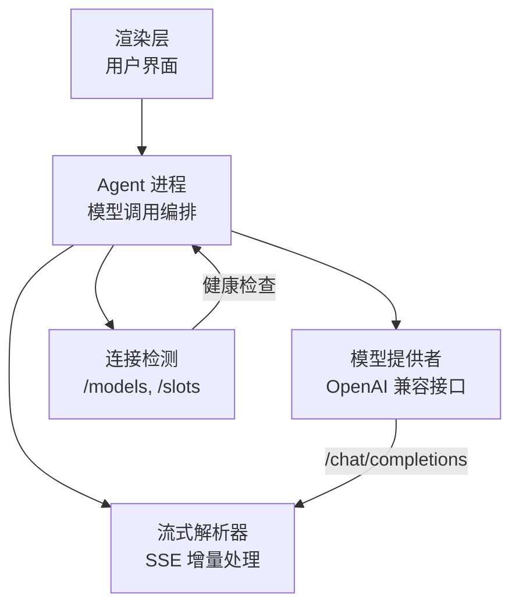
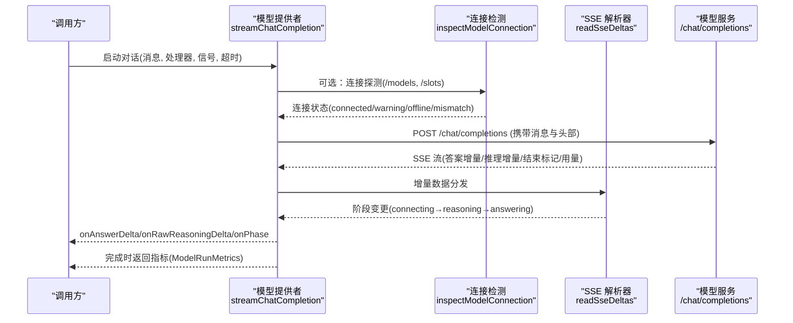
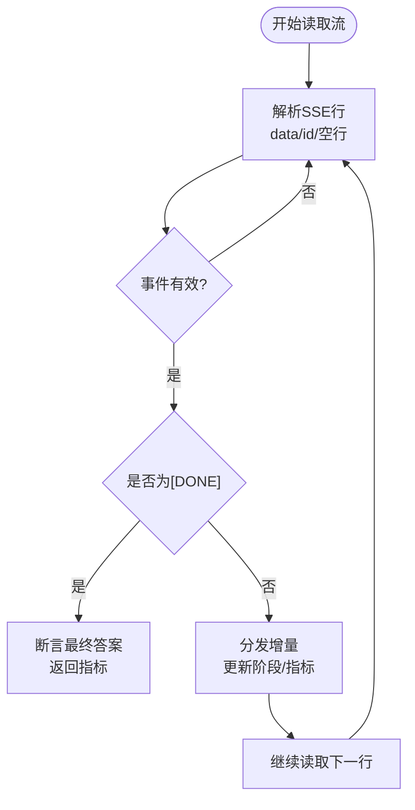
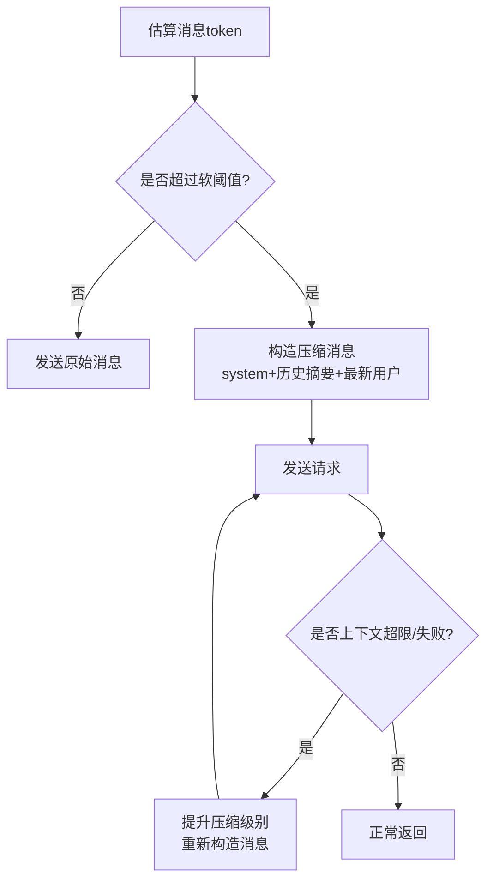
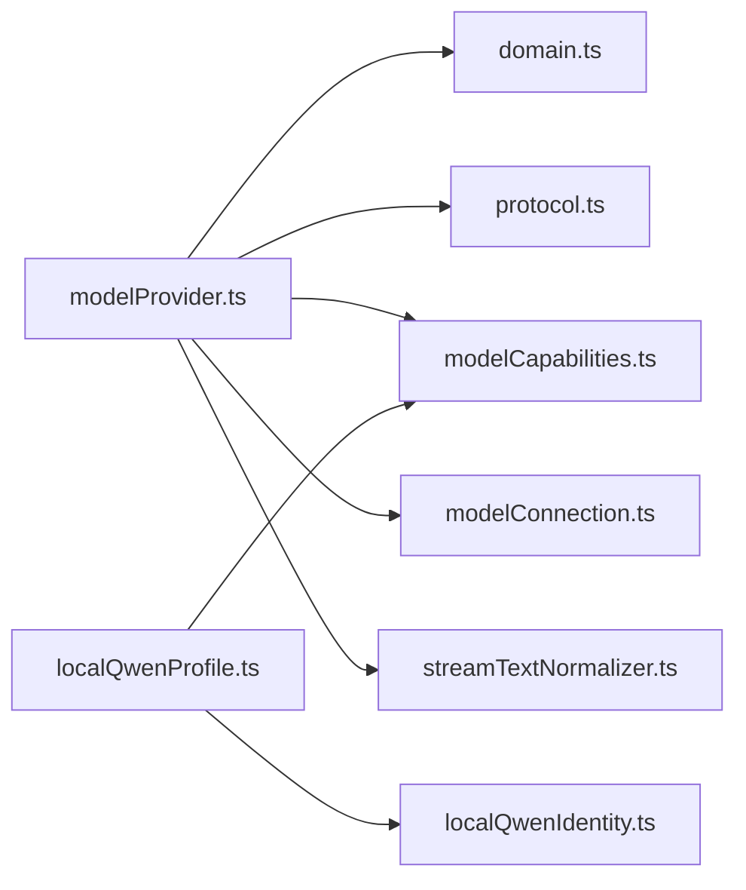

# 模型集成

<cite>
**本文引用的文件**
- [modelProvider.ts](file://src/agent/modelProvider.ts)
- [modelConnection.ts](file://src/agent/modelConnection.ts)
- [modelCapabilities.ts](file://src/agent/modelCapabilities.ts)
- [domain.ts](file://src/shared/domain.ts)
- [protocol.ts](file://src/shared/protocol.ts)
- [localQwenProfile.ts](file://src/agent/localQwenProfile.ts)
- [localQwenIdentity.ts](file://src/shared/localQwenIdentity.ts)
- [modelProfileLimits.ts](file://src/shared/modelProfileLimits.ts)
- [reasoningConfiguration.ts](file://src/shared/reasoningConfiguration.ts)
- [streamTextNormalizer.ts](file://src/agent/streamTextNormalizer.ts)
- [README.md](file://model-runtime/README.md)
- [worker.ts](file://src/agent/worker.ts)
</cite>

## 目录
1. [简介](#简介)
2. [项目结构](#项目结构)
3. [核心组件](#核心组件)
4. [架构总览](#架构总览)
5. [详细组件分析](#详细组件分析)
6. [依赖关系分析](#依赖关系分析)
7. [性能考量](#性能考量)
8. [故障排查指南](#故障排查指南)
9. [结论](#结论)
10. [附录](#附录)

## 简介
本文件为“模型集成系统”的技术文档，聚焦统一接口设计、流式响应处理、上下文压缩与错误处理机制；说明支持的模型类型（OpenAI 兼容 API 与本地 Qwen 模型）的集成方式；阐述模型能力声明、并发限制与超时设置；提供模型配置文件格式、连接测试方法与性能优化建议；并给出自定义模型集成的扩展指南。

## 项目结构
该集成位于 agent 层，围绕“模型配置—能力声明—连接检测—流式调用—指标上报”形成闭环：
- 统一接口：通过 OpenAI 兼容的 /chat/completions 端点发起请求，统一消息结构与流式事件解析。
- 能力声明：以 ModelCapabilities 描述文本、视觉、长上下文、推理协议、并发与用量等能力。
- 连接检测：访问 /models 与 /slots 校验服务可用性与并发槽位一致性。
- 流式处理：SSE 增量读取、去重、阶段切换、首 token 计时、指标合并。
- 上下文压缩：按软阈值对历史进行摘要与裁剪，支持多次重试与渐进压缩。
- 错误处理：超时、取消、服务端 500、上下文超限等场景均有明确分支与提示。

图表来源
- [modelProvider.ts:55-197](file://src/agent/modelProvider.ts#L55-L197)
- [modelConnection.ts:11-91](file://src/agent/modelConnection.ts#L11-L91)
- [protocol.ts:22-65](file://src/shared/protocol.ts#L22-L65)

章节来源
- [modelProvider.ts:55-197](file://src/agent/modelProvider.ts#L55-L197)
- [modelConnection.ts:11-91](file://src/agent/modelConnection.ts#L11-L91)
- [protocol.ts:22-65](file://src/shared/protocol.ts#L22-L65)

## 核心组件
- 统一聊天流式接口：streamChatCompletion(profile, messages, handlers, signal, fetchImpl, nowMs, timeoutMs)
- 连接检测：inspectModelConnection(profile, fetchImpl, signal)
- 能力归一化：normalizeModelCapabilities / normalizeReasoningSettings / normalizeMaxConcurrency / normalizeMaxOutputTokens
- 本地 Qwen 默认配置：localQwenProfileInput()
- 流文本规范化：createStreamTextNormalizer('incremental' | 'cumulative')
- 协议与领域模型：domain.ts、protocol.ts

章节来源
- [modelProvider.ts:55-197](file://src/agent/modelProvider.ts#L55-L197)
- [modelConnection.ts:11-91](file://src/agent/modelConnection.ts#L11-L91)
- [modelCapabilities.ts:14-118](file://src/agent/modelCapabilities.ts#L14-L118)
- [localQwenProfile.ts:13-25](file://src/agent/localQwenProfile.ts#L13-L25)
- [streamTextNormalizer.ts:1-34](file://src/agent/streamTextNormalizer.ts#L1-L34)
- [domain.ts:130-257](file://src/shared/domain.ts#L130-L257)
- [protocol.ts:22-65](file://src/shared/protocol.ts#L22-L65)

## 架构总览
下图展示了从上层到模型服务的完整调用链，包括连接检测、流式读取、阶段切换、指标聚合与错误处理。

图表来源
- [modelProvider.ts:55-197](file://src/agent/modelProvider.ts#L55-L197)
- [modelProvider.ts:563-680](file://src/agent/modelProvider.ts#L563-L680)
- [modelConnection.ts:11-91](file://src/agent/modelConnection.ts#L11-L91)
- [domain.ts:238-257](file://src/shared/domain.ts#L238-L257)

## 详细组件分析

### 统一接口设计与消息模型
- 消息体：ChatMessage 支持 system/user/assistant 角色，内容可为字符串或包含文本与图片的多部分。
- 请求端点：统一使用 {baseUrl}/chat/completions，自动附加 Authorization 头（若配置了 apiKey）。
- 构建请求体：buildChatCompletionBody 根据 profile 与消息生成标准兼容体，并在首次尝试中启用 usage 字段以便获取用量。
- 兼容性重试：当服务端不支持 usage 字段导致错误时，自动降级为不包含 usage 的重试请求。

章节来源
- [modelProvider.ts:8-19](file://src/agent/modelProvider.ts#L8-L19)
- [modelProvider.ts:762-795](file://src/agent/modelProvider.ts#L762-L795)

### 流式响应处理
- 增量读取：readSseDeltas 基于 ReadableStream 逐行解析 SSE，维护 buffer 与事件 ID 去重。
- 阶段切换：检测到推理增量时切换到 reasoning，检测到答案增量时切换到 answering。
- 文本规范化：使用 createStreamTextNormalizer 分别处理答案、原始推理与推理摘要，支持增量模式与累计模式。
- 指标合并：每次增量可能携带 usage 与 finishReason，最终合并为 ModelRunMetrics，计算 tokensPerSecond 与 speedSource。
- 终止条件：收到 [DONE] 或流结束时，校验最终答案完整性。

图表来源
- [modelProvider.ts:563-680](file://src/agent/modelProvider.ts#L563-L680)
- [streamTextNormalizer.ts:1-34](file://src/agent/streamTextNormalizer.ts#L1-L34)

章节来源
- [modelProvider.ts:563-680](file://src/agent/modelProvider.ts#L563-L680)
- [streamTextNormalizer.ts:1-34](file://src/agent/streamTextNormalizer.ts#L1-L34)

### 上下文压缩机制
- 触发条件：当估计消息 token 数接近上下文窗口的软阈值（约 75%）时，进入压缩流程。
- 压缩策略：
  - 初始请求：压缩 system 消息、历史消息摘要、最新用户消息内容。
  - 续写请求：保留最近助手回答尾部，压缩历史与系统消息，追加续写提示。
- 压缩级别：支持多级压缩（最多 3 级），每级按系数缩小预算，逐步收紧上下文。
- 自适应重试：若服务端返回上下文超限或压缩后仍失败，自动重建压缩后的消息并重试。
- 估算方法：按 ASCII/宽字符近似估算 token，图片附件按固定开销估算。

图表来源
- [modelProvider.ts:209-339](file://src/agent/modelProvider.ts#L209-L339)
- [modelProvider.ts:341-467](file://src/agent/modelProvider.ts#L341-L467)
- [modelProvider.ts:469-484](file://src/agent/modelProvider.ts#L469-L484)

章节来源
- [modelProvider.ts:209-339](file://src/agent/modelProvider.ts#L209-L339)
- [modelProvider.ts:341-467](file://src/agent/modelProvider.ts#L341-L467)
- [modelProvider.ts:469-484](file://src/agent/modelProvider.ts#L469-L484)

### 错误处理机制
- 超时控制：默认基础超时与最大超时，结合 per-token 超时计算；可传入外部 AbortSignal 实现取消。
- 取消传播：所有网络与流读取均监听 AbortSignal，确保及时释放资源。
- 错误脱敏：错误信息在抛出前进行脱敏，避免泄露 apiKey。
- 特定错误：
  - 上下文超限：识别服务端错误信息，触发压缩重试。
  - 压缩后仍失败：抛出明确错误，提示本地模型服务器在处理压缩上下文时失败。
  - 连接测试超时：返回离线结果，不暴露敏感信息。

章节来源
- [modelProvider.ts:40-54](file://src/agent/modelProvider.ts#L40-L54)
- [modelProvider.ts:188-197](file://src/agent/modelProvider.ts#L188-L197)
- [modelProvider.ts:535-561](file://src/agent/modelProvider.ts#L535-L561)
- [modelConnection.ts:117-136](file://src/agent/modelConnection.ts#L117-L136)

### 支持的模型类型与集成方式
- OpenAI 兼容 API：
  - 能力：text=true，vision=false（默认），longContext=false，推理输入模式为 effort（由 effortOptions 决定），输出模式 summary，支持 streaming 与 usage。
  - 配置：provider='openai-compatible'，baseUrl 指向兼容服务，model 为具体模型名。
- 本地 Qwen 模型：
  - 能力：text=true，vision=true，longContext=false，推理输入模式 toggle，输出模式 raw，支持 streaming 与 usage。
  - 默认配置：localQwenProfileInput() 提供内置名称、baseUrl、model、capabilities 与推理设置。
  - 运行时：独立容器运行 llama.cpp，暴露 /v1/models 与 /v1/chat/completions，端口 127.0.0.1:8080。

章节来源
- [modelCapabilities.ts:14-43](file://src/agent/modelCapabilities.ts#L14-L43)
- [localQwenProfile.ts:13-25](file://src/agent/localQwenProfile.ts#L13-L25)
- [localQwenIdentity.ts:3-5](file://src/shared/localQwenIdentity.ts#L3-L5)
- [README.md:1-53](file://model-runtime/README.md#L1-L53)

### 模型能力声明、并发限制与超时设置
- 能力声明：
  - text/vision/longContext：布尔开关。
  - reasoning：inputMode（unsupported/toggle/effort/custom）、effortOptions、outputModes、defaultEffort、customRequestBody。
  - concurrency：defaultLimit、configurable、maxLimit。
  - streaming/usage：布尔开关。
- 并发限制：
  - 客户端 maxConcurrency 受 capabilities.concurrency.maxLimit 约束，最小为 1。
  - 连接检测会对比服务 slots 数量与客户端并发，不一致时返回 warning。
- 超时设置：
  - 默认基础超时 BASE_MODEL_RUN_TIMEOUT_MS，最大 MAX_MODEL_RUN_TIMEOUT_MS。
  - per-token 超时：非推理 DEFAULT_TOKEN_TIMEOUT_MS，推理 REASONING_TOKEN_TIMEOUT_MS。
  - 连接测试超时 DEFAULT_CONNECTION_TEST_TIMEOUT_MS。

章节来源
- [domain.ts:130-148](file://src/shared/domain.ts#L130-L148)
- [modelCapabilities.ts:106-118](file://src/agent/modelCapabilities.ts#L106-L118)
- [modelProvider.ts:40-54](file://src/agent/modelProvider.ts#L40-L54)
- [modelProvider.ts:199-207](file://src/agent/modelProvider.ts#L199-L207)
- [modelConnection.ts:54-91](file://src/agent/modelConnection.ts#L54-L91)

### 模型配置文件格式
- 基本字段：id、name、provider、baseUrl、model、apiKey、isDefault。
- 能力字段：capabilities（text/vision/longContext/reasoning/concurrency/streaming/usage）。
- 推理设置：reasoning.mode、reasoning.protocol、reasoning.effort、reasoning.display。
- 限制字段：maxConcurrency、maxOutputTokens。
- 运行时转换：worker.ts 将输入转换为 RuntimeModelProfile，合并已有配置并归一化能力与推理设置。

章节来源
- [domain.ts:160-192](file://src/shared/domain.ts#L160-L192)
- [protocol.ts:241-272](file://src/shared/protocol.ts#L241-L272)
- [worker.ts:474-504](file://src/agent/worker.ts#L474-L504)

### 连接测试方法
- 步骤：
  1) 访问 {baseUrl}/models，校验返回 data 数组中包含配置的 model。
  2) 访问 {baseUrl}/slots，校验槽位数量与客户端并发一致。
- 结果：
  - connected：服务可用且槽位匹配。
  - concurrency-warning：槽位不匹配，需调整并发。
  - slots-unverified：槽位不可验证，但连接成功。
  - offline/model-mismatch：服务不可用或模型不匹配。
- 超时与取消：连接测试支持超时与 AbortSignal，异常时返回离线结果且不泄露敏感信息。

章节来源
- [modelConnection.ts:11-91](file://src/agent/modelConnection.ts#L11-L91)
- [modelConnection.ts:149-170](file://src/agent/modelConnection.ts#L149-L170)
- [modelProvider.ts:535-561](file://src/agent/modelProvider.ts#L535-L561)

### 性能优化建议
- 合理设置 maxOutputTokens：默认 2048，上限 32768，避免过长生成导致内存与时间压力。
- 控制并发：根据服务 slots 与硬件能力设置 maxConcurrency，避免过载。
- 利用长上下文能力：若模型声明 longContext=true，可适当放宽上下文窗口。
- 流式优先：保持 streaming=true，减少首 token 延迟。
- 本地 Qwen 运行时：
  - CPU/Hybrid/GPU 三种 profile，按需选择。
  - LLAMA_PARALLEL 与 LLAMA_CTX_SIZE 配合调整，注意 K/V 缓存内存占用。
  - LLAMA_N_PREDICT 作为服务端生成上限。

章节来源
- [modelProfileLimits.ts:1-3](file://src/shared/modelProfileLimits.ts#L1-L3)
- [modelCapabilities.ts:106-118](file://src/agent/modelCapabilities.ts#L106-L118)
- [README.md:41-49](file://model-runtime/README.md#L41-L49)

### 自定义模型集成的扩展指南
- 步骤：
  1) 定义 ModelProfileInput：设置 provider='openai-compatible'、baseUrl、model、capabilities、reasoning、maxConcurrency、maxOutputTokens。
  2) 声明能力：根据模型实际支持设置 text/vision/longContext/reasoning/concurrency/streaming/usage。
  3) 推理协议：qwen/openai/custom，对应不同 inputMode 与 outputModes。
  4) 保存与测试：通过 worker.ts 的 runtimeProfileFromInput 转换为运行时配置，并使用 testModelProfile 进行连接测试。
  5) 流式调用：使用 streamChatCompletion 发起对话，接收增量回调与指标。
- 注意事项：
  - 确保 baseUrl 暴露 /chat/completions 与 /models（可选 /slots）。
  - 若模型不支持 usage，框架会自动降级请求体。
  - 自定义 customRequestBody 可在 reasoning.customRequestBody 中注入额外参数。

章节来源
- [domain.ts:160-192](file://src/shared/domain.ts#L160-L192)
- [protocol.ts:241-272](file://src/shared/protocol.ts#L241-L272)
- [worker.ts:474-504](file://src/agent/worker.ts#L474-L504)
- [modelProvider.ts:797-800](file://src/agent/modelProvider.ts#L797-L800)

## 依赖关系分析
- 模块耦合：
  - modelProvider 依赖 domain、protocol、modelCapabilities、modelConnection、streamTextNormalizer。
  - modelConnection 依赖 domain 的连接结果类型。
  - localQwenProfile 依赖 localQwenIdentity 与 modelCapabilities。
- 外部依赖：
  - 网络：fetch 与 ReadableStream。
  - 运行时：本地 Qwen 通过 Docker Compose 管理，暴露 v1 接口。

图表来源
- [modelProvider.ts:1-7](file://src/agent/modelProvider.ts#L1-L7)
- [localQwenProfile.ts:1-8](file://src/agent/localQwenProfile.ts#L1-L8)

章节来源
- [modelProvider.ts:1-7](file://src/agent/modelProvider.ts#L1-L7)
- [localQwenProfile.ts:1-8](file://src/agent/localQwenProfile.ts#L1-L8)

## 性能考量
- 首 token 延迟：通过流式增量与阶段切换尽早反馈。
- 吞吐优化：根据 server 提供的 tokensPerSecond 与客户端估算综合计算速度。
- 内存控制：上下文压缩减少历史占用，图片附件按固定开销估算。
- 并发与槽位：客户端并发与服务槽位匹配，避免排队与争用。
- 本地运行时：GPU 加速与量化 K/V 缓存可显著提升吞吐，但需注意显存占用。

[本节为通用指导，不直接分析具体文件]

## 故障排查指南
- 连接失败：
  - 检查 baseUrl 是否正确，/models 与 /slots 是否可达。
  - 查看连接测试结果：offline/slots-unverified/concurrency-warning/model-mismatch。
- 流式无响应：
  - 确认服务端返回 SSE 流，检查 [DONE] 标志。
  - 观察阶段切换：connecting→reasoning→answering。
- 上下文超限：
  - 观察是否触发压缩重试，检查压缩级别与消息长度。
- 超时与取消：
  - 检查超时设置与外部 AbortSignal，确认未提前取消。
- 错误脱敏：
  - 错误信息不包含 apiKey，便于安全调试。

章节来源
- [modelConnection.ts:149-170](file://src/agent/modelConnection.ts#L149-L170)
- [modelProvider.ts:188-197](file://src/agent/modelProvider.ts#L188-L197)
- [modelProvider.ts:535-561](file://src/agent/modelProvider.ts#L535-L561)

## 结论
本系统集成采用统一的 OpenAI 兼容接口，结合流式响应、上下文压缩与完善的错误处理，实现对多种模型（OpenAI 兼容 API 与本地 Qwen）的一致接入。通过能力声明、并发限制与超时控制，系统在稳定性与性能之间取得平衡。本地 Qwen 运行时提供了开箱即用的体验，同时支持自定义模型扩展，满足多样化业务需求。

[本节为总结性内容，不直接分析具体文件]

## 附录
- 本地 Qwen 运行时命令参考：
  - 启动 CPU/Hybrid/GPU 配置。
  - 健康检查与模型列表端点。
  - 容量默认值与内存影响。

章节来源
- [README.md:1-53](file://model-runtime/README.md#L1-L53)