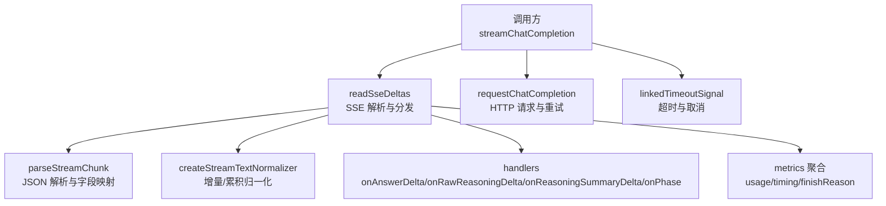
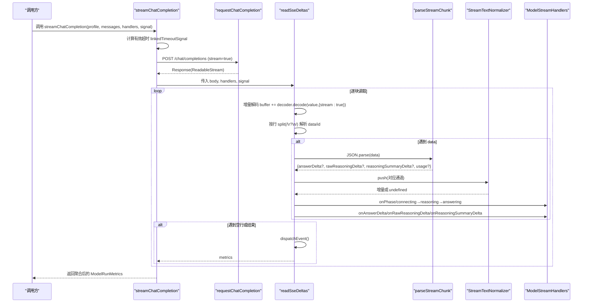
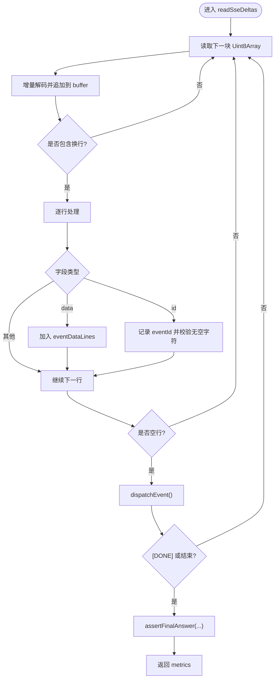
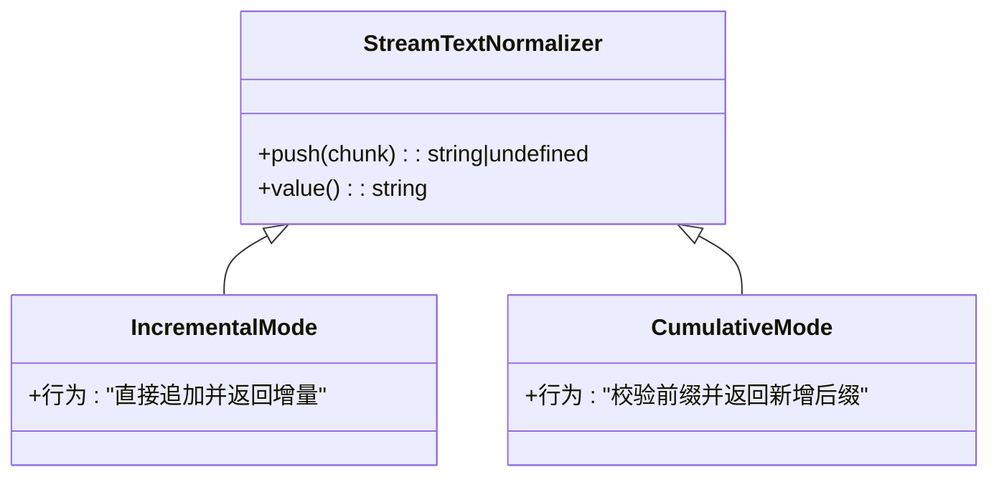
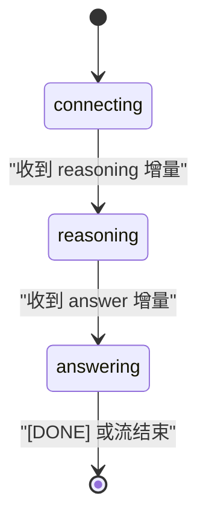
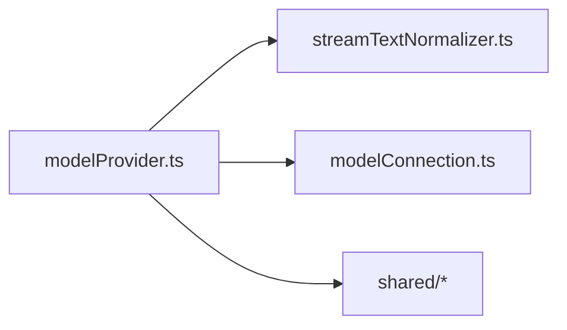

# 流式响应处理

<cite>
**本文引用的文件**
- [modelProvider.ts](file://src/agent/modelProvider.ts)
- [streamTextNormalizer.ts](file://src/agent/streamTextNormalizer.ts)
- [modelConnection.ts](file://src/agent/modelConnection.ts)
- [modelProvider.test.ts](file://tests/modelProvider.test.ts)
- [streamTextNormalizer.test.ts](file://tests/streamTextNormalizer.test.ts)
</cite>

## 目录
1. [简介](#简介)
2. [项目结构](#项目结构)
3. [核心组件](#核心组件)
4. [架构总览](#架构总览)
5. [详细组件分析](#详细组件分析)
6. [依赖关系分析](#依赖关系分析)
7. [性能考量](#性能考量)
8. [故障排查指南](#故障排查指南)
9. [结论](#结论)
10. [附录](#附录)

## 简介
本文件面向“流式响应处理系统”，聚焦于 SSE（Server-Sent Events）协议在模型流式输出中的实现细节，包括事件解析、增量数据处理与状态管理。重点解释 readSSEDeltas 的工作机制（缓冲区管理、行解析、事件分发），说明流文本规范化器在增量模式与完整模式下的差异，阐述阶段转换（connecting → reasoning → answering）的实现，并总结错误处理、超时控制与资源清理策略。文末提供实际流式数据处理示例与性能优化建议。

## 项目结构
与流式响应相关的核心代码集中在 agent 层：
- modelProvider.ts：负责发起请求、读取 SSE 流、解析事件、维护阶段与指标、超时与错误处理。
- streamTextNormalizer.ts：提供流文本规范化器，支持增量与累积两种模式。
- modelConnection.ts：用于连接探测与槽位校验（与流式主流程解耦）。
- tests/*：覆盖字节级分片、重复前缀、去重、空白内容、超时等边界场景。

图表来源
- [modelProvider.ts:55-197](file://src/agent/modelProvider.ts#L55-L197)
- [modelProvider.ts:563-680](file://src/agent/modelProvider.ts#L563-L680)
- [modelProvider.ts:847-898](file://src/agent/modelProvider.ts#L847-L898)
- [modelProvider.ts:720-756](file://src/agent/modelProvider.ts#L720-L756)

章节来源
- [modelProvider.ts:55-197](file://src/agent/modelProvider.ts#L55-L197)
- [modelProvider.ts:563-680](file://src/agent/modelProvider.ts#L563-L680)
- [modelProvider.ts:847-898](file://src/agent/modelProvider.ts#L847-L898)
- [modelProvider.ts:720-756](file://src/agent/modelProvider.ts#L720-L756)

## 核心组件
- 流式入口与编排：streamChatCompletion
  - 构建请求头与消息体，设置超时信号，循环处理长度限制后的续写。
  - 通过 readSseDeltas 消费 SSE 流，聚合指标并返回。
- SSE 解析与分发：readSseDeltas
  - 使用 ReadableStream + TextDecoder 增量解码，按行解析 SSE 字段（data/id）。
  - 维护事件数据缓冲与 id 去重，触发事件分发与阶段切换。
  - 使用三个独立的流文本规范化器分别处理 answer/raw reasoning/reasoning summary。
- 流文本规范化器：createStreamTextNormalizer
  - 增量模式：直接追加并返回增量片段；累积模式：仅返回新增后缀并校验一致性。
- 超时与取消：linkedTimeoutSignal / readWithAbort
  - 将外部 AbortSignal 与定时器绑定，统一抛出超时或取消原因。
- 错误处理与资源清理：
  - 错误体有界读取，避免内存膨胀。
  - finally 中安全释放 reader 锁，防止阻塞调度器。

章节来源
- [modelProvider.ts:55-197](file://src/agent/modelProvider.ts#L55-L197)
- [modelProvider.ts:563-680](file://src/agent/modelProvider.ts#L563-L680)
- [modelProvider.ts:720-756](file://src/agent/modelProvider.ts#L720-L756)
- [modelProvider.ts:900-950](file://src/agent/modelProvider.ts#L900-L950)
- [streamTextNormalizer.ts:1-33](file://src/agent/streamTextNormalizer.ts#L1-L33)

## 架构总览
下图展示从请求到流式响应的端到端流程，包括超时、SSE 解析、事件分发与阶段转换。

图表来源
- [modelProvider.ts:55-197](file://src/agent/modelProvider.ts#L55-L197)
- [modelProvider.ts:563-680](file://src/agent/modelProvider.ts#L563-L680)
- [modelProvider.ts:847-898](file://src/agent/modelProvider.ts#L847-L898)

## 详细组件分析

### SSE 解析与事件分发（readSseDeltas）
- 缓冲区管理
  - 使用字符串 buffer 累积未完成的行，配合 TextDecoder 的 stream 模式进行增量解码，避免整段拼接导致的内存峰值。
  - 每次读取后按 \r?\n 分割，保留最后一行作为未完成缓冲。
- 行解析
  - consumeLine 识别 data 与 id 字段，忽略注释行（以 : 开头）。
  - 空行触发 dispatchEvent，完成一个事件的组装。
- 事件分发
  - 对每个事件，先做 id 去重（Map 记录已见 id→data），若冲突则抛错。
  - 解析 JSON 为 ParsedStreamChunk，并通过三个独立 normalizer 分别处理 answer/raw reasoning/reasoning summary。
  - 根据是否有 reasoning 增量将阶段从 connecting 切换到 reasoning；当出现 answer 增量时切换到 answering。
  - 收集 usage 与 finishReason，并在 [DONE] 或流结束时断言最终答案。

图表来源
- [modelProvider.ts:563-680](file://src/agent/modelProvider.ts#L563-L680)

章节来源
- [modelProvider.ts:563-680](file://src/agent/modelProvider.ts#L563-L680)

### 流文本规范化器（incremental vs cumulative）
- 增量模式（默认）
  - 每次 push(chunk) 直接追加到 accumulated，并返回 chunk 本身（即使为空也视为一次传输，但空值会返回 undefined 以避免无效回调）。
  - 适合下游 UI 实时渲染，保持语义上的“增量”概念。
- 累积模式
  - 要求后续 chunk 必须以当前 accumulated 为前缀，否则抛错。
  - 仅返回新增后缀，并将 accumulated 更新为新 chunk。
  - 适合服务端或中间层保证“快照一致性”的场景。

图表来源
- [streamTextNormalizer.ts:1-33](file://src/agent/streamTextNormalizer.ts#L1-L33)

章节来源
- [streamTextNormalizer.ts:1-33](file://src/agent/streamTextNormalizer.ts#L1-L33)
- [streamTextNormalizer.test.ts:1-72](file://tests/streamTextNormalizer.test.ts#L1-L72)

### 阶段转换机制（connecting → reasoning → answering）
- 初始阶段为 connecting。
- 当首次出现 reasoning 相关增量（raw reasoning 或 reasoning summary）时，切换到 reasoning 并通知上层。
- 当首次出现 answer 增量时，切换到 answering 并通知上层。
- 该逻辑确保 UI 能准确反映模型“思考中”和“回答中”的状态。

图表来源
- [modelProvider.ts:563-680](file://src/agent/modelProvider.ts#L563-L680)

章节来源
- [modelProvider.ts:563-680](file://src/agent/modelProvider.ts#L563-L680)

### 错误处理、超时控制与资源清理
- 超时控制
  - linkedTimeoutSignal 将外部 AbortSignal 与定时器绑定，到达时间上限后抛出 TimeoutError。
  - readWithAbort 在每个读取点监听 abort，立即拒绝并释放监听。
- 错误处理
  - parseStreamChunk 仅提取非空文本与必要字段，避免空 delta 造成冗余回调。
  - 错误响应体采用有界读取（MAX_PROVIDER_ERROR_BYTES），防止恶意大响应导致内存压力。
  - 针对上下文超限、鉴权失败、限流、服务错误等给出明确错误信息。
- 资源清理
  - finally 中调用 cancelReaderWithoutBlocking，尝试 cancel 并 releaseLock，避免阻塞调度器。
  - 流结束时调用 assertFinalAnswer，若无有效最终答案则抛错。

章节来源
- [modelProvider.ts:720-756](file://src/agent/modelProvider.ts#L720-L756)
- [modelProvider.ts:900-950](file://src/agent/modelProvider.ts#L900-L950)
- [modelProvider.ts:1024-1033](file://src/agent/modelProvider.ts#L1024-L1033)

### 实际流式数据处理示例
以下用例来自测试，展示了字节级分片、重复前缀、空白内容、SSE id 去重等行为：
- 字节级分片与重复前缀：逐字节推送 SSE 文本，验证 answer/raw reasoning/reasoning summary 的增量正确性。
- SSE id 去重：相同 id 的重复事件被去重，不同 id 的事件正常处理。
- 空白内容：空白 delta 被视为有效增量，但最终答案不能仅为空白。
- 阶段顺序：先 reasoning 再 answering。

章节来源
- [modelProvider.test.ts:879-953](file://tests/modelProvider.test.ts#L879-L953)
- [modelProvider.test.ts:955-1043](file://tests/modelProvider.test.ts#L955-L1043)

## 依赖关系分析
- modelProvider.ts 依赖：
  - streamTextNormalizer.ts：提供增量/累积文本归一化。
  - modelConnection.ts：连接探测（与流式主流程解耦）。
  - shared 模块：领域模型、错误脱敏、能力校验等。
- 内部耦合
  - readSseDeltas 同时承担解析、分发、状态机与指标聚合职责，内聚度高但复杂性强。
  - 三个阶段（connecting/reasoning/answering）通过 handlers.onPhase 暴露给上层，降低内部状态对外部可见性。

图表来源
- [modelProvider.ts:1-6](file://src/agent/modelProvider.ts#L1-L6)

章节来源
- [modelProvider.ts:1-6](file://src/agent/modelProvider.ts#L1-L6)

## 性能考量
- 增量解码与行切分
  - 使用 TextDecoder({stream:true}) 与按行拆分，避免整包解码与多次大字符串拼接。
- 规范化器选择
  - 增量模式开销最小，适合高频 UI 更新；累积模式适合需要强一致性的中间层。
- 事件去重
  - 基于 SSE id 的去重减少重复事件带来的不必要回调与渲染。
- 错误体有界读取
  - 限制错误响应体读取大小，防止异常响应导致内存暴涨。
- 超时与取消
  - 统一的超时信号与读取点检查，快速释放资源，避免长时间占用。

[本节为通用指导，不直接分析具体文件]

## 故障排查指南
- 常见问题定位
  - 流结束但没有最终答案：检查 assertFinalAnswer 抛出的错误，确认是否存在有效 answer 增量。
  - 阶段未按预期切换：确认 reasoning 与 answer 增量是否到达，以及 handlers.onPhase 是否被调用。
  - SSE id 冲突：若同一 id 对应不同 data，会抛错；检查上游是否重复发送冲突事件。
  - 空白内容：空白 delta 会被视为增量，但最终答案不能仅为空白。
- 调试建议
  - 打印各通道增量序列，确认是否符合预期。
  - 检查超时配置与模型响应速度，必要时调整超时阈值。
  - 关注错误响应体的有界读取日志，避免过大响应影响稳定性。

章节来源
- [modelProvider.ts:1024-1033](file://src/agent/modelProvider.ts#L1024-L1033)
- [modelProvider.ts:900-950](file://src/agent/modelProvider.ts#L900-L950)

## 结论
本系统通过 readSseDeltas 实现了稳健的 SSE 流式解析与分发，结合流文本规范化器与阶段状态机，提供了清晰的增量数据处理与 UI 状态同步能力。超时控制、错误处理与资源清理策略确保了在高负载与异常场景下的稳定性。测试覆盖了字节级分片、重复前缀、空白内容、id 去重等关键边界，增强了系统的可靠性。

[本节为总结，不直接分析具体文件]

## 附录
- 关键函数路径参考
  - 流式入口与编排：[modelProvider.ts:55-197](file://src/agent/modelProvider.ts#L55-L197)
  - SSE 解析与分发：[modelProvider.ts:563-680](file://src/agent/modelProvider.ts#L563-L680)
  - JSON 解析与字段映射：[modelProvider.ts:847-898](file://src/agent/modelProvider.ts#L847-L898)
  - 超时与取消：[modelProvider.ts:720-756](file://src/agent/modelProvider.ts#L720-L756)
  - 流文本规范化器：[streamTextNormalizer.ts:1-33](file://src/agent/streamTextNormalizer.ts#L1-L33)
  - 错误体有界读取：[modelProvider.ts:924-950](file://src/agent/modelProvider.ts#L924-L950)
  - 最终答案断言：[modelProvider.ts:1024-1033](file://src/agent/modelProvider.ts#L1024-L1033)