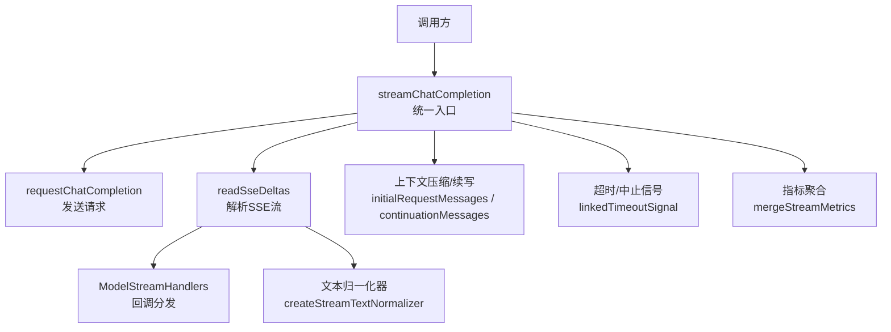
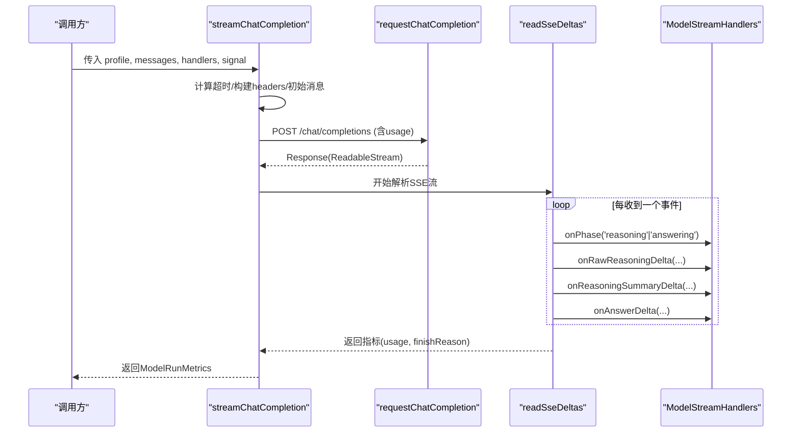
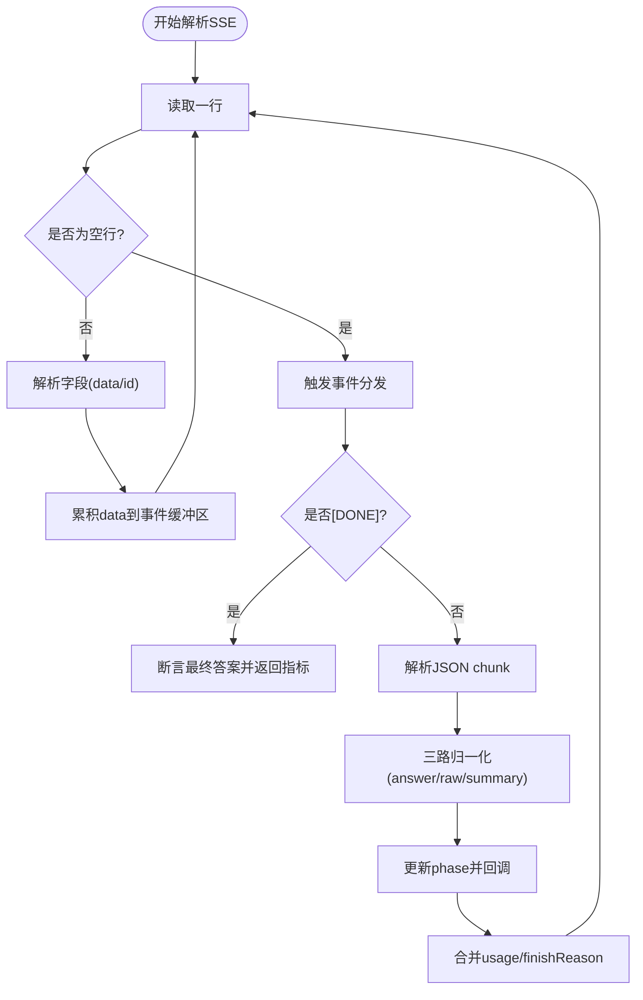
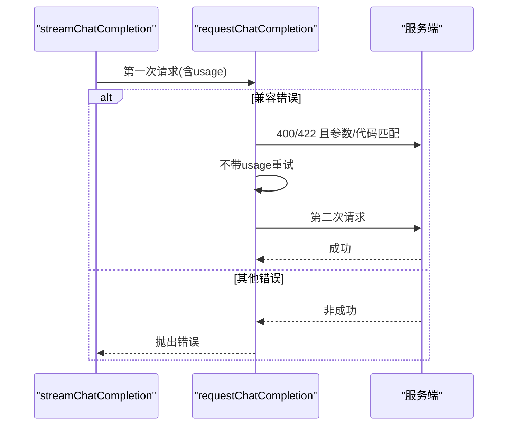
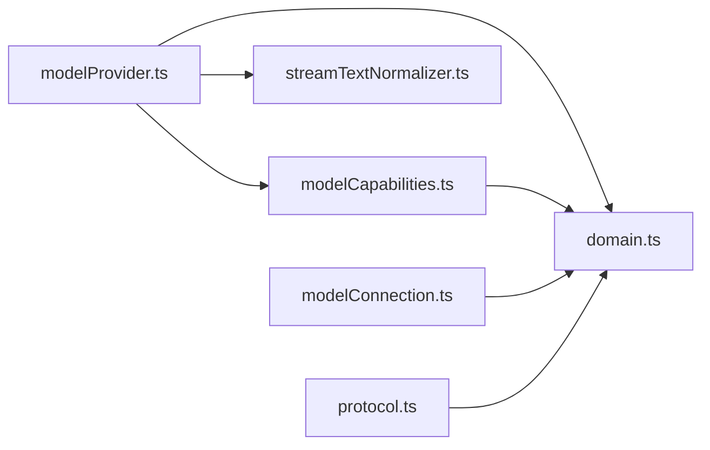

# 统一接口设计

<cite>
**本文引用的文件**
- [modelProvider.ts](file://src/agent/modelProvider.ts)
- [domain.ts](file://src/shared/domain.ts)
- [protocol.ts](file://src/shared/protocol.ts)
- [streamTextNormalizer.ts](file://src/agent/streamTextNormalizer.ts)
- [modelCapabilities.ts](file://src/agent/modelCapabilities.ts)
- [modelConnection.ts](file://src/agent/modelConnection.ts)
</cite>

## 目录
1. [简介](#简介)
2. [项目结构](#项目结构)
3. [核心组件](#核心组件)
4. [架构总览](#架构总览)
5. [详细组件分析](#详细组件分析)
6. [依赖关系分析](#依赖关系分析)
7. [性能考量](#性能考量)
8. [故障排查指南](#故障排查指南)
9. [结论](#结论)
10. [附录：调用示例与最佳实践](#附录调用示例与最佳实践)

## 简介
本文件围绕“统一接口设计”展开，聚焦模型提供商抽象层的设计原理与实现。重点解释以下核心概念：
- ChatMessage、ChatMessageContent 等消息模型
- ModelStreamHandlers 流式回调接口
- 流式响应处理机制（onAnswerDelta、onRawReasoningDelta、onReasoningSummaryDelta）
- 错误处理策略与重试机制
- 如何调用统一的聊天完成接口并处理不同类型响应数据

该设计将不同模型提供商的 SSE/流式协议差异屏蔽在内部，对外暴露一致的 streamChatCompletion 接口与回调约定，便于上层应用以统一方式消费多模型能力。

## 项目结构
- 统一接口与流式处理位于 agent 层的 modelProvider.ts，负责构建请求、解析 SSE、管理上下文压缩与重试、汇总指标。
- 领域类型定义位于 shared/domain.ts，包括运行阶段、指标、连接结果等。
- 桌面端与代理间通信协议位于 shared/protocol.ts，定义了事件类型与校验逻辑。
- 文本流归一化器位于 agent/streamTextNormalizer.ts，用于增量或累计模式下的流文本去重与拼接。
- 能力与配置校验位于 agent/modelCapabilities.ts，确保推理模式、协议与输入参数合法。
- 连接探测位于 agent/modelConnection.ts，用于测试模型服务连通性与并发槽位一致性。

图表来源
- [modelProvider.ts:55-197](file://src/agent/modelProvider.ts#L55-L197)
- [modelProvider.ts:563-680](file://src/agent/modelProvider.ts#L563-L680)
- [modelProvider.ts:720-756](file://src/agent/modelProvider.ts#L720-L756)
- [streamTextNormalizer.ts:1-34](file://src/agent/streamTextNormalizer.ts#L1-L34)

章节来源
- [modelProvider.ts:55-197](file://src/agent/modelProvider.ts#L55-L197)
- [domain.ts:96-106](file://src/shared/domain.ts#L96-L106)
- [protocol.ts:48-63](file://src/shared/protocol.ts#L48-L63)

## 核心组件
- ChatMessage、ChatMessageContent、ChatContentPart：统一的消息表示，支持纯文本与图片附件。
- ModelStreamHandlers：流式回调接口，包含 onAnswerDelta、onRawReasoningDelta、onReasoningSummaryDelta、onPhase。
- streamChatCompletion：统一聊天完成接口，封装了请求构建、SSE 解析、上下文压缩、重试、超时控制与指标汇总。
- readSseDeltas：SSE 流解析器，按行读取、事件去重、状态机推进、回调分发。
- createStreamTextNormalizer：流文本归一化器，支持增量与累计两种模式，保证重复片段与字节切分场景的正确性。
- validateReasoningSelection：推理能力与配置的合法性校验。
- inspectModelConnection：模型连接探测，验证模型列表与服务并发槽位。

章节来源
- [modelProvider.ts:8-26](file://src/agent/modelProvider.ts#L8-L26)
- [modelProvider.ts:55-197](file://src/agent/modelProvider.ts#L55-L197)
- [modelProvider.ts:563-680](file://src/agent/modelProvider.ts#L563-L680)
- [streamTextNormalizer.ts:1-34](file://src/agent/streamTextNormalizer.ts#L1-L34)
- [modelCapabilities.ts:120-148](file://src/agent/modelCapabilities.ts#L120-L148)
- [modelConnection.ts:11-91](file://src/agent/modelConnection.ts#L11-L91)

## 架构总览
统一接口通过 streamChatCompletion 暴露给上层，内部职责划分清晰：
- 请求构建与发送：根据 profile 与 messages 构造请求体，附加鉴权头，必要时携带 usage 字段。
- 流式解析：readSseDeltas 逐行解析 SSE，维护 phase 状态机（connecting → reasoning → answering），并按通道分发回调。
- 上下文压缩与续写：当接近或超过上下文限制时，自动压缩历史并在需要时续写回答。
- 超时与取消：基于 AbortSignal 与自定义超时控制器，支持外部取消与内部超时。
- 指标聚合：合并多次尝试的 token 用量、速率、finishReason 等，最终返回 ModelRunMetrics。

图表来源
- [modelProvider.ts:55-197](file://src/agent/modelProvider.ts#L55-L197)
- [modelProvider.ts:563-680](file://src/agent/modelProvider.ts#L563-L680)
- [modelProvider.ts:762-795](file://src/agent/modelProvider.ts#L762-L795)

## 详细组件分析

### 消息模型与内容部分
- ChatMessage.role 限定为 system/user/assistant，content 可为字符串或内容片段数组。
- ChatContentPart 支持 text 与 image_url，便于多模态输入。
- 估算 token 数与压缩策略基于 content 的类型与长度进行预算分配。

章节来源
- [modelProvider.ts:8-18](file://src/agent/modelProvider.ts#L8-L18)
- [modelProvider.ts:341-368](file://src/agent/modelProvider.ts#L341-L368)

### 流式回调接口 ModelStreamHandlers
- onAnswerDelta：接收答案增量文本，用于实时渲染用户可见回复。
- onRawReasoningDelta：接收原始推理增量（如思维链中间过程）。
- onReasoningSummaryDelta：接收推理摘要增量（如高层总结）。
- onPhase：通知当前运行阶段变化（connecting → reasoning → answering），便于 UI 展示进度。

章节来源
- [modelProvider.ts:21-26](file://src/agent/modelProvider.ts#L21-L26)
- [modelProvider.ts:604-638](file://src/agent/modelProvider.ts#L604-L638)

### 流式响应处理机制
- readSseDeltas 使用 TextDecoder 与 ReadableStream 逐块读取，按行拆分，识别 data/id 字段，组装事件。
- 使用 Map 去重相同 id 的事件，避免重复推送。
- 对 answer/rawReasoning/reasoningSummary 三路分别维护归一化器，输出增量或累计值。
- 根据是否有推理数据切换 phase 到 reasoning；首次出现答案切换到 answering。
- 遇到 [DONE] 或流结束，断言最终答案完整性并返回指标。

图表来源
- [modelProvider.ts:563-680](file://src/agent/modelProvider.ts#L563-L680)

章节来源
- [modelProvider.ts:563-680](file://src/agent/modelProvider.ts#L563-L680)
- [streamTextNormalizer.ts:1-34](file://src/agent/streamTextNormalizer.ts#L1-L34)

### 上下文压缩与续写
- initialRequestMessages：若估计 token 未超软限制则直接发送；否则压缩系统消息、历史摘要与最新用户消息。
- continuationMessages：当 finishReason 为 length 且已有答案进展时，追加助手回答尾部与续写提示，再次请求。
- 压缩级别逐步提升，最多三次；若仍失败则抛出明确错误。

章节来源
- [modelProvider.ts:209-332](file://src/agent/modelProvider.ts#L209-L332)
- [modelProvider.ts:153-162](file://src/agent/modelProvider.ts#L153-L162)

### 超时、取消与重试
- linkedTimeoutSignal：组合外部 AbortSignal 与内部定时器，提供 timedOut() 判断与 dispose 清理。
- requestChatCompletion：先带 usage 字段请求；若服务端返回特定兼容错误（400/422 且参数/代码匹配），则不带 usage 重试一次。
- 错误体读取限制最大字节数，避免内存占用过大。

图表来源
- [modelProvider.ts:762-795](file://src/agent/modelProvider.ts#L762-L795)
- [modelProvider.ts:924-964](file://src/agent/modelProvider.ts#L924-L964)

章节来源
- [modelProvider.ts:720-756](file://src/agent/modelProvider.ts#L720-L756)
- [modelProvider.ts:762-795](file://src/agent/modelProvider.ts#L762-L795)
- [modelProvider.ts:924-964](file://src/agent/modelProvider.ts#L924-L964)

### 指标与阶段
- ModelRunMetrics：包含 durationMs、tokensPerSecond、speedSource、usageSource、promptTokens、completionTokens、totalTokens、reasoningTokens、timeToFirstTokenMs、finishReason 等。
- ModelRunPhase：connecting、compressing、reasoning、answering，驱动 UI 状态与进度。
- mergeStreamMetrics：加权合并多次尝试的 serverTokensPerSecond 与 token 计数。

章节来源
- [domain.ts:238-257](file://src/shared/domain.ts#L238-L257)
- [domain.ts:96-106](file://src/shared/domain.ts#L96-L106)
- [modelProvider.ts:507-533](file://src/agent/modelProvider.ts#L507-L533)

### 连接探测
- inspectModelConnection：访问 /models 获取模型列表，校验配置模型是否存在；访问 /slots 检查服务并发槽位是否与客户端一致，给出 connected/concurrency-warning/slots-unverified/offline/model-mismatch 等结果。

章节来源
- [modelConnection.ts:11-91](file://src/agent/modelConnection.ts#L11-L91)

## 依赖关系分析
- modelProvider.ts 依赖 domain.ts 的类型定义（ModelRunMetrics、ModelRunPhase 等）、modelCapabilities.ts 的推理配置校验、streamTextNormalizer.ts 的流文本归一化、以及 protocol.ts 中的事件类型（供上层使用）。
- modelConnection.ts 依赖 domain.ts 的连接结果类型。
- protocol.ts 提供桌面端与代理之间的请求/事件类型及校验函数，确保跨进程通信安全。

图表来源
- [modelProvider.ts:1-6](file://src/agent/modelProvider.ts#L1-L6)
- [modelCapabilities.ts:1-12](file://src/agent/modelCapabilities.ts#L1-L12)
- [modelConnection.ts:1-7](file://src/agent/modelConnection.ts#L1-L7)
- [protocol.ts:1-19](file://src/shared/protocol.ts#L1-L19)

章节来源
- [modelProvider.ts:1-6](file://src/agent/modelProvider.ts#L1-L6)
- [modelCapabilities.ts:1-12](file://src/agent/modelCapabilities.ts#L1-L12)
- [modelConnection.ts:1-7](file://src/agent/modelConnection.ts#L1-L7)
- [protocol.ts:1-19](file://src/shared/protocol.ts#L1-L19)

## 性能考量
- 流式解析采用增量模式，减少内存峰值；对重复 SSE id 的去重避免重复回调。
- 上下文压缩阈值与预算分配策略降低长对话的上下文压力，提高成功率。
- 超时策略按 per-token 估算，兼顾推理与非推理场景，避免长时间阻塞。
- 指标合并采用加权平均，更准确反映服务端速率。

[本节为通用指导，不直接分析具体文件]

## 故障排查指南
- 超时：检查 effectiveTimeoutMs 与外部 AbortSignal；确认服务端响应延迟与网络状况。
- 上下文超限：观察 compressing 阶段与 finishReason=length；必要时调整 maxOutputTokens 或优化消息长度。
- 兼容错误重试：若首次请求因 usage 字段不被支持而失败，会自动重试；若仍失败，检查服务端版本与参数。
- 连接问题：使用 testModelProfile 或 inspectModelConnection 诊断 offline/model-mismatch/slots-unverified。

章节来源
- [modelProvider.ts:188-197](file://src/agent/modelProvider.ts#L188-L197)
- [modelProvider.ts:535-561](file://src/agent/modelProvider.ts#L535-L561)
- [modelConnection.ts:11-91](file://src/agent/modelConnection.ts#L11-L91)

## 结论
本设计通过统一的 streamChatCompletion 接口与 ModelStreamHandlers 回调，屏蔽了底层模型提供商的差异，提供了稳定的流式聊天能力。结合上下文压缩、超时控制、错误重试与指标聚合，既保证了鲁棒性，也提升了用户体验。上层只需关注回调处理与 UI 呈现，即可在多模型环境下保持一致的行为。

[本节为总结，不直接分析具体文件]

## 附录：调用示例与最佳实践
- 基本调用流程
  - 准备 RuntimeModelProfile（包含 baseUrl、model、capabilities、reasoning、maxOutputTokens 等）。
  - 构建 ChatMessage[]（role 与 content）。
  - 实现 ModelStreamHandlers：
    - onAnswerDelta：累积并渲染答案。
    - onRawReasoningDelta：可选地显示原始推理。
    - onReasoningSummaryDelta：可选地显示推理摘要。
    - onPhase：根据 connecting/reasoning/answering 更新 UI。
  - 调用 streamChatCompletion(profile, messages, handlers, signal)，等待返回 ModelRunMetrics。
- 处理不同类型响应数据
  - 答案增量：通过 onAnswerDelta 增量拼接，注意去重与顺序。
  - 推理数据：raw 与 summary 可分别展示，依据 display 模式选择。
  - 阶段变更：根据 onPhase 切换界面状态。
- 错误与重试
  - 捕获超时与中止异常，提示用户或回退策略。
  - 若 finishReason=length，可在上层决定是否继续追问或截断。
- 性能建议
  - 合理设置 maxOutputTokens 与 reasoning 模式。
  - 使用增量模式渲染，避免全量重建。
  - 监控 tokensPerSecond 与 timeToFirstTokenMs，评估体验。

章节来源
- [modelProvider.ts:55-197](file://src/agent/modelProvider.ts#L55-L197)
- [modelProvider.ts:604-638](file://src/agent/modelProvider.ts#L604-L638)
- [domain.ts:238-257](file://src/shared/domain.ts#L238-L257)