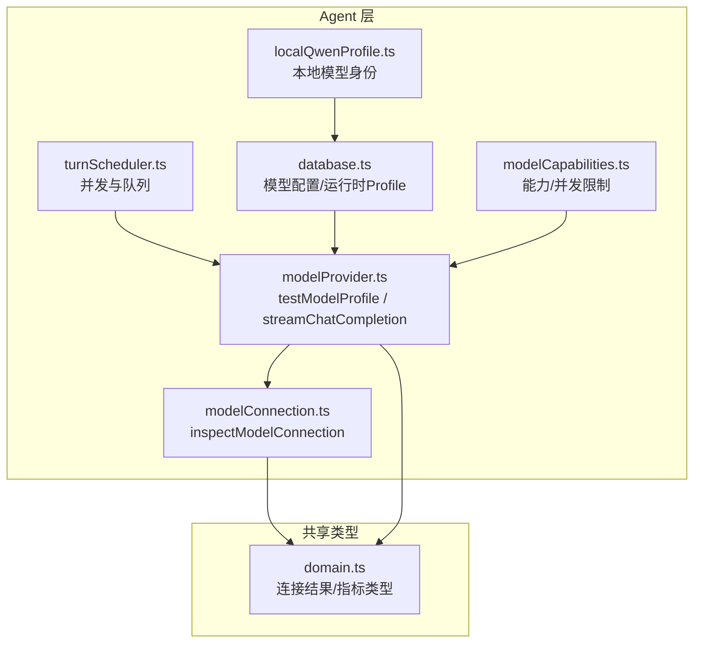
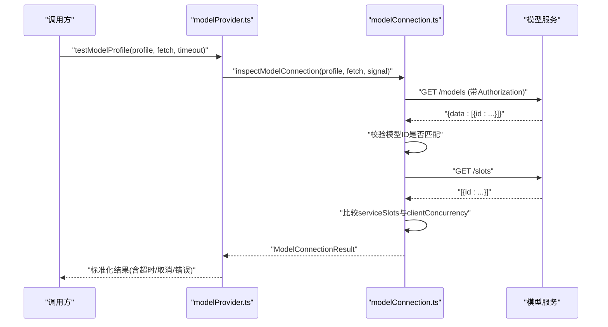
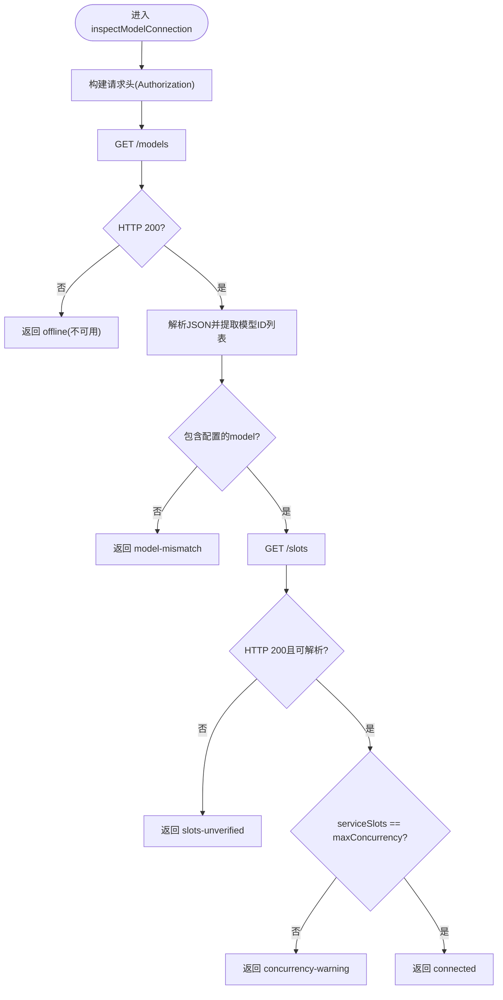
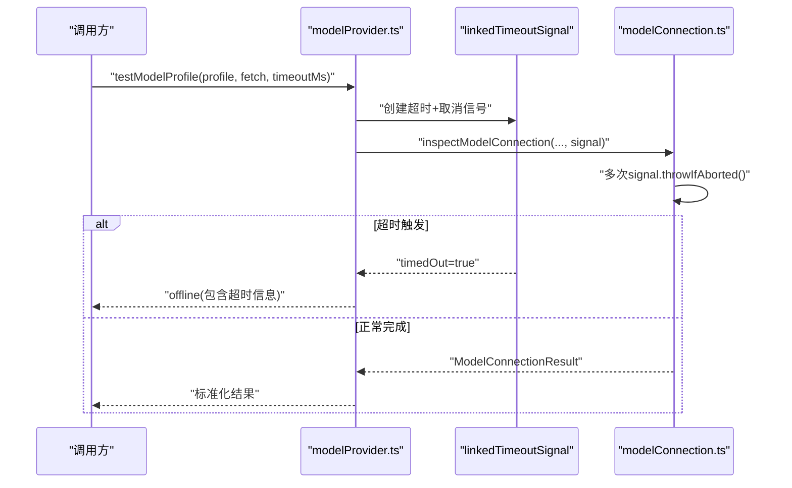
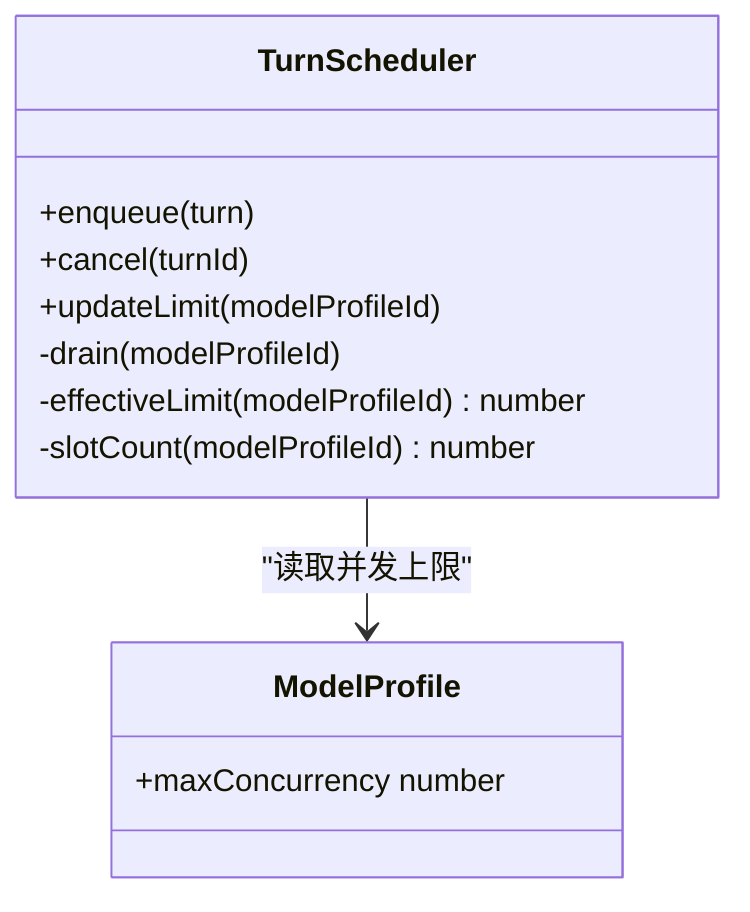
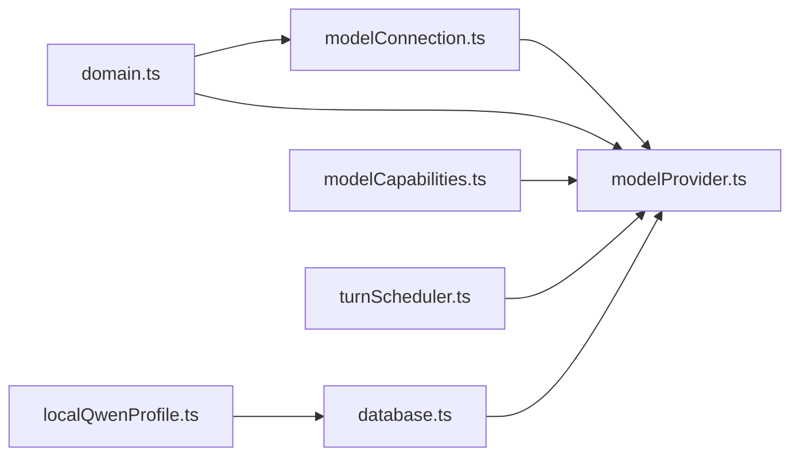

# 连接管理

<cite>
**本文引用的文件**
- [src/agent/modelConnection.ts](file://src/agent/modelConnection.ts)
- [src/shared/domain.ts](file://src/shared/domain.ts)
- [src/agent/modelProvider.ts](file://src/agent/modelProvider.ts)
- [tests/modelConnection.test.ts](file://tests/modelConnection.test.ts)
- [tests/modelProvider.test.ts](file://tests/modelProvider.test.ts)
- [src/agent/database.ts](file://src/agent/database.ts)
- [src/agent/modelCapabilities.ts](file://src/agent/modelCapabilities.ts)
- [src/agent/localQwenProfile.ts](file://src/agent/localQwenProfile.ts)
- [src/shared/localQwenIdentity.ts](file://src/shared/localQwenIdentity.ts)
- [src/agent/turnScheduler.ts](file://src/agent/turnScheduler.ts)
</cite>

## 目录
1. [简介](#简介)
2. [项目结构](#项目结构)
3. [核心组件](#核心组件)
4. [架构总览](#架构总览)
5. [详细组件分析](#详细组件分析)
6. [依赖关系分析](#依赖关系分析)
7. [性能考量](#性能考量)
8. [故障排查指南](#故障排查指南)
9. [结论](#结论)
10. [附录](#附录)

## 简介
本文件面向“模型连接管理系统”，聚焦连接测试机制与连接诊断能力，系统性说明以下主题：
- 连接测试实现原理（testModelProfile）：超时控制、取消传播、错误处理与连接验证。
- inspectModelConnection 的工作流程：HTTP 请求构建、响应解析、状态判断与降级策略。
- 连接池管理与并发控制策略：客户端并发与服务端槽位一致性校验。
- 网络异常处理、重试机制与降级策略：健壮的错误分类与安全信息脱敏。
- 连接性能监控、延迟统计与可用性报告：指标采集、来源标注与可视化建议。
- 连接问题诊断方法与解决方案：基于测试结果与运行期指标的排障路径。

## 项目结构
围绕连接管理的代码主要分布在 agent 层与 shared 类型定义中，并通过测试覆盖关键行为：
- 连接探测与诊断：inspectModelConnection 负责向模型服务发起 /models 与 /slots 探测，返回结构化结果。
- 连接测试包装：testModelProfile（在 provider 层封装）提供超时控制与统一错误输出。
- 并发与调度：turnScheduler 维护按模型分组的队列与并发上限，保障资源占用可控。
- 配置与能力：database 持久化模型配置；modelCapabilities 归一化能力与默认并发限制；localQwenProfile 提供内置本地模型身份。
- 类型契约：domain 定义连接结果、运行指标等跨进程共享类型。

图表来源
- [src/agent/modelConnection.ts:11-91](file://src/agent/modelConnection.ts#L11-L91)
- [src/agent/modelProvider.ts:55-197](file://src/agent/modelProvider.ts#L55-L197)
- [src/agent/turnScheduler.ts:115-210](file://src/agent/turnScheduler.ts#L115-L210)
- [src/agent/database.ts:541-621](file://src/agent/database.ts#L541-L621)
- [src/agent/modelCapabilities.ts:106-118](file://src/agent/modelCapabilities.ts#L106-L118)
- [src/shared/domain.ts:194-236](file://src/shared/domain.ts#L194-L236)

章节来源
- [src/agent/modelConnection.ts:11-91](file://src/agent/modelConnection.ts#L11-L91)
- [src/agent/modelProvider.ts:55-197](file://src/agent/modelProvider.ts#L55-L197)
- [src/agent/turnScheduler.ts:115-210](file://src/agent/turnScheduler.ts#L115-L210)
- [src/agent/database.ts:541-621](file://src/agent/database.ts#L541-L621)
- [src/agent/modelCapabilities.ts:106-118](file://src/agent/modelCapabilities.ts#L106-L118)
- [src/shared/domain.ts:194-236](file://src/shared/domain.ts#L194-L236)

## 核心组件
- 连接探测器 inspectModelConnection：构造请求头、调用 /models 与 /slots、解析并比较服务端槽位与客户端并发，返回精确的状态类型。
- 连接测试包装 testModelProfile：为连接测试注入超时与取消信号，将底层探测结果标准化为统一的离线/不匹配/未验证槽位等状态。
- 并发调度 turnScheduler：按模型维度维护队列与运行集合，动态计算有效并发上限，支持限流变更后的重平衡。
- 配置与能力 database + modelCapabilities：持久化并归一化模型能力、最大并发、最大输出 token 等；提供本地 Qwen 默认配置。
- 类型契约 domain：定义 ModelConnectionResult、ModelRunMetrics 等跨模块共享数据结构。

章节来源
- [src/agent/modelConnection.ts:11-91](file://src/agent/modelConnection.ts#L11-L91)
- [src/agent/modelProvider.ts:55-197](file://src/agent/modelProvider.ts#L55-L197)
- [src/agent/turnScheduler.ts:115-210](file://src/agent/turnScheduler.ts#L115-L210)
- [src/agent/database.ts:541-621](file://src/agent/database.ts#L541-L621)
- [src/agent/modelCapabilities.ts:106-118](file://src/agent/modelCapabilities.ts#L106-L118)
- [src/shared/domain.ts:194-236](file://src/shared/domain.ts#L194-L236)

## 架构总览
连接测试与调用的整体流程如下：
- 上层通过 testModelProfile 发起连接测试，传入模型配置、fetch 实现与可选超时。
- 内部调用 inspectModelConnection，使用 AbortSignal 贯穿所有 I/O，确保取消可传播。
- 先访问 /models 校验模型标识，再访问 /slots 校验并发槽位数量，最终返回带状态的连接结果。
- 若槽位不可用或格式不符，则降级为“槽位未验证”而非直接失败，保持连通性判断的稳健性。
- 运行期通过 streamChatCompletion 进行实际推理调用，复用相同的超时与取消语义，并收集运行指标。

图表来源
- [src/agent/modelProvider.ts:55-197](file://src/agent/modelProvider.ts#L55-L197)
- [src/agent/modelConnection.ts:11-91](file://src/agent/modelConnection.ts#L11-L91)

## 详细组件分析

### inspectModelConnection：连接探测与状态判断
- 请求构建：
  - 根据 profile.apiKey 设置 Authorization 头。
  - 清理 baseUrl 末尾斜杠后拼接 /models。
- 模型发现：
  - 调用 withExplicitAbort 包装 fetch，确保取消事件能立即中断等待。
  - 解析 JSON 并提取 data[].id 列表，严格校验字段类型。
  - 若未包含配置的 model，返回 model-mismatch。
- 槽位检查：
  - 构造 origin + /slots 请求，读取数组长度作为 serviceSlots。
  - 若 slots 不可用或格式非法，返回 slots-unverified（不破坏已建立的连通性）。
  - 若 serviceSlots 与 profile.maxConcurrency 不一致，返回 concurrency-warning。
  - 否则返回 connected。
- 取消与超时：
  - 每个关键步骤前调用 signal.throwIfAborted()，保证取消快速传播。
  - withExplicitAbort 监听 abort 事件，拒绝 Promise 并抛出 AbortError。
- 错误处理：
  - 网络错误或 HTTP 非 2xx 均归类为 offline，消息不包含敏感信息。
  - JSON 解析失败或结构不符也视为 offline。

图表来源
- [src/agent/modelConnection.ts:11-91](file://src/agent/modelConnection.ts#L11-L91)
- [src/agent/modelConnection.ts:93-115](file://src/agent/modelConnection.ts#L93-L115)
- [src/agent/modelConnection.ts:117-136](file://src/agent/modelConnection.ts#L117-L136)

章节来源
- [src/agent/modelConnection.ts:11-91](file://src/agent/modelConnection.ts#L11-L91)
- [src/agent/modelConnection.ts:93-115](file://src/agent/modelConnection.ts#L93-L115)
- [src/agent/modelConnection.ts:117-136](file://src/agent/modelConnection.ts#L117-L136)
- [tests/modelConnection.test.ts:24-170](file://tests/modelConnection.test.ts#L24-L170)

### testModelProfile：超时控制与取消传播
- 超时控制：
  - 通过 linkedTimeoutSignal 将外部 AbortSignal 与固定超时组合，形成请求级信号。
  - 当达到超时阈值时，主动中止底层 fetch 并返回 typed offline，消息包含超时时长。
- 取消传播：
  - 所有 I/O 都携带该信号，即使底层 fetch 忽略取消，也会在超时保护下终止。
- 错误脱敏：
  - 对错误信息进行安全文本处理，避免泄露 API Key 等敏感内容。
- 结果标准化：
  - 将底层 inspectModelConnection 的结果包装为统一的结构化结果，便于上层消费。

图表来源
- [src/agent/modelProvider.ts:55-197](file://src/agent/modelProvider.ts#L55-L197)
- [tests/modelProvider.test.ts:129-162](file://tests/modelProvider.test.ts#L129-L162)

章节来源
- [src/agent/modelProvider.ts:55-197](file://src/agent/modelProvider.ts#L55-L197)
- [tests/modelProvider.test.ts:129-162](file://tests/modelProvider.test.ts#L129-L162)

### 连接池管理与并发控制
- 客户端并发：
  - 由 profile.maxConcurrency 声明期望并发，并在连接测试中与 serviceSlots 对比，给出 warning 或 success。
- 服务端槽位：
  - /slots 返回的数组长度即当前可用槽位数量，用于评估服务能力。
- 运行时调度：
  - turnScheduler 维护 per-model 队列与运行集合，依据 effectiveLimit 动态提升/回退任务，支持限流变化时的重平衡。
  - 当活跃任务数达到上限时，新任务入队等待；当容量释放时，从队首提升执行。

图表来源
- [src/agent/turnScheduler.ts:115-210](file://src/agent/turnScheduler.ts#L115-L210)
- [src/shared/domain.ts:160-176](file://src/shared/domain.ts#L160-L176)

章节来源
- [src/agent/turnScheduler.ts:115-210](file://src/agent/turnScheduler.ts#L115-L210)
- [src/shared/domain.ts:160-176](file://src/shared/domain.ts#L160-L176)

### 网络异常处理、重试与降级
- 异常分类：
  - offline：网络错误、HTTP 非 2xx、JSON 解析失败、结构不符。
  - model-mismatch：服务端未声明配置的模型。
  - slots-unverified：槽位不可用或格式不符，但模型连通性仍视为 ok。
  - concurrency-warning：槽位数量与客户端并发不一致。
- 重试机制：
  - 连接测试本身不自动重试；实际推理调用在上下文压缩场景下具备有限重试逻辑（针对特定错误），连接测试保持幂等与确定性。
- 降级策略：
  - 槽位不可用时降级为 slots-unverified，避免误判为完全离线。
  - 错误信息脱敏，防止泄露密钥或诊断细节。

章节来源
- [src/agent/modelConnection.ts:11-91](file://src/agent/modelConnection.ts#L11-L91)
- [src/agent/modelProvider.ts:55-197](file://src/agent/modelProvider.ts#L55-L197)
- [tests/modelConnection.test.ts:97-170](file://tests/modelConnection.test.ts#L97-L170)

### 连接性能监控、延迟统计与可用性报告
- 指标采集：
  - durationMs：端到端耗时（客户端测量）。
  - timeToFirstTokenMs：首字延迟（客户端测量）。
  - tokensPerSecond：优先使用服务端速率，否则以 completionTokens/duration 估算，否则 unavailable。
  - usageSource/speedSource：标注指标来源（server/client/unavailable）。
- 可用性报告：
  - 基于连接测试结果（connected/concurrency-warning/slots-unverified/offline/model-mismatch）生成健康视图。
  - 结合运行期指标（duration、TTFB、tokens/s）评估服务质量。

章节来源
- [src/shared/domain.ts:238-257](file://src/shared/domain.ts#L238-L257)
- [src/agent/modelProvider.ts:163-185](file://src/agent/modelProvider.ts#L163-L185)
- [docs/superpowers/specs/2026-08-17-runtime-settings-and-model-metrics-design.md:89-108](file://docs/superpowers/specs/2026-08-17-runtime-settings-and-model-metrics-design.md#L89-L108)

## 依赖关系分析
- modelConnection 依赖 domain 的连接结果类型，并通过 fetch 抽象与模型服务交互。
- modelProvider 依赖 modelConnection 进行连接探测，同时依赖 redaction 进行错误脱敏，依赖 capabilities 进行推理配置校验。
- database 提供 RuntimeModelProfile，包含 apiKey、baseUrl、model、maxConcurrency 等关键参数。
- localQwenProfile 与 localQwenIdentity 提供本地模型的默认身份与基线配置。
- turnScheduler 依赖模型配置中的并发能力，协调多任务的执行顺序与资源占用。

图表来源
- [src/shared/domain.ts:194-236](file://src/shared/domain.ts#L194-L236)
- [src/agent/modelConnection.ts:11-91](file://src/agent/modelConnection.ts#L11-L91)
- [src/agent/modelProvider.ts:55-197](file://src/agent/modelProvider.ts#L55-L197)
- [src/agent/database.ts:541-621](file://src/agent/database.ts#L541-L621)
- [src/agent/modelCapabilities.ts:106-118](file://src/agent/modelCapabilities.ts#L106-L118)
- [src/agent/localQwenProfile.ts:13-25](file://src/agent/localQwenProfile.ts#L13-L25)
- [src/agent/turnScheduler.ts:115-210](file://src/agent/turnScheduler.ts#L115-L210)

章节来源
- [src/shared/domain.ts:194-236](file://src/shared/domain.ts#L194-L236)
- [src/agent/modelConnection.ts:11-91](file://src/agent/modelConnection.ts#L11-L91)
- [src/agent/modelProvider.ts:55-197](file://src/agent/modelProvider.ts#L55-L197)
- [src/agent/database.ts:541-621](file://src/agent/database.ts#L541-L621)
- [src/agent/modelCapabilities.ts:106-118](file://src/agent/modelCapabilities.ts#L106-L118)
- [src/agent/localQwenProfile.ts:13-25](file://src/agent/localQwenProfile.ts#L13-L25)
- [src/agent/turnScheduler.ts:115-210](file://src/agent/turnScheduler.ts#L115-L210)

## 性能考量
- 超时与取消：
  - 连接测试与推理调用均采用统一的超时与取消机制，避免长时间阻塞。
  - 对于忽略取消的底层实现，通过硬超时兜底，确保资源及时释放。
- 并发控制：
  - 通过 maxConcurrency 与 serviceSlots 的一致性校验，减少过载风险。
  - 运行时调度器动态调整任务提升，避免突发流量导致雪崩。
- 指标来源：
  - 优先采用服务端提供的速率与用量，其次基于客户端估算，最后标记 unavailable，保证透明度。

[本节为通用指导，无需具体文件引用]

## 故障排查指南
- 连接不可用（offline）：
  - 检查 /models 可达性与 HTTP 状态码；确认 baseUrl 与端口正确。
  - 查看错误消息是否包含敏感信息（应已脱敏）；必要时启用更详细的日志。
- 模型不匹配（model-mismatch）：
  - 核对 profile.model 与服务端 /models 返回的 id 是否一致（大小写敏感）。
- 槽位未验证（slots-unverified）：
  - 检查 /slots 是否返回数组且元素具有唯一标识；若不可用，仍可继续尝试推理，但需关注并发风险。
- 并发告警（concurrency-warning）：
  - 调整 profile.maxConcurrency 以匹配 serviceSlots，避免拥塞或资源浪费。
- 超时问题：
  - 适当增大连接测试或推理超时；检查网络质量与服务端负载。
- 指标异常：
  - 若 speedSource/usageSource 为 unavailable，检查服务端是否返回 usage 与 rate 字段；必要时依赖客户端估算。

章节来源
- [tests/modelConnection.test.ts:24-170](file://tests/modelConnection.test.ts#L24-L170)
- [tests/modelProvider.test.ts:129-162](file://tests/modelProvider.test.ts#L129-L162)
- [src/agent/modelConnection.ts:11-91](file://src/agent/modelConnection.ts#L11-L91)
- [src/agent/modelProvider.ts:55-197](file://src/agent/modelProvider.ts#L55-L197)

## 结论
本连接管理系统通过严格的类型契约、健壮的异常分类与明确的降级策略，实现了高可靠的模型连接探测与诊断。结合运行时并发调度与性能指标采集，系统能够在复杂网络与服务环境下保持稳定与透明。建议在生产环境中：
- 定期执行连接测试并记录历史趋势。
- 将连接状态与运行指标纳入统一监控面板。
- 对并发告警与槽位未验证进行自动化告警与自愈策略。

[本节为总结性内容，无需具体文件引用]

## 附录
- 内置本地模型：
  - 使用 localQwenProfile 与 localQwenIdentity 提供默认 base URL、模型名与 Profile ID，便于本地开发调试。
- 能力与限制：
  - modelCapabilities 提供默认并发限制与输出 token 上限，确保配置安全边界。

章节来源
- [src/agent/localQwenProfile.ts:13-25](file://src/agent/localQwenProfile.ts#L13-L25)
- [src/shared/localQwenIdentity.ts:3-20](file://src/shared/localQwenIdentity.ts#L3-L20)
- [src/agent/modelCapabilities.ts:106-118](file://src/agent/modelCapabilities.ts#L106-L118)