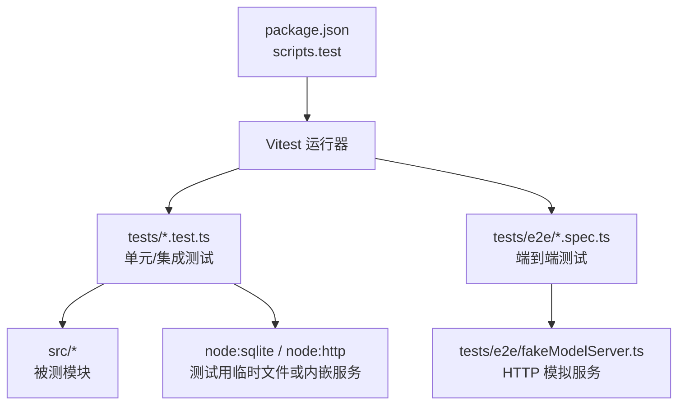
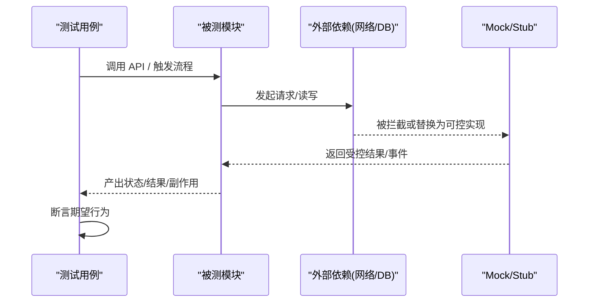
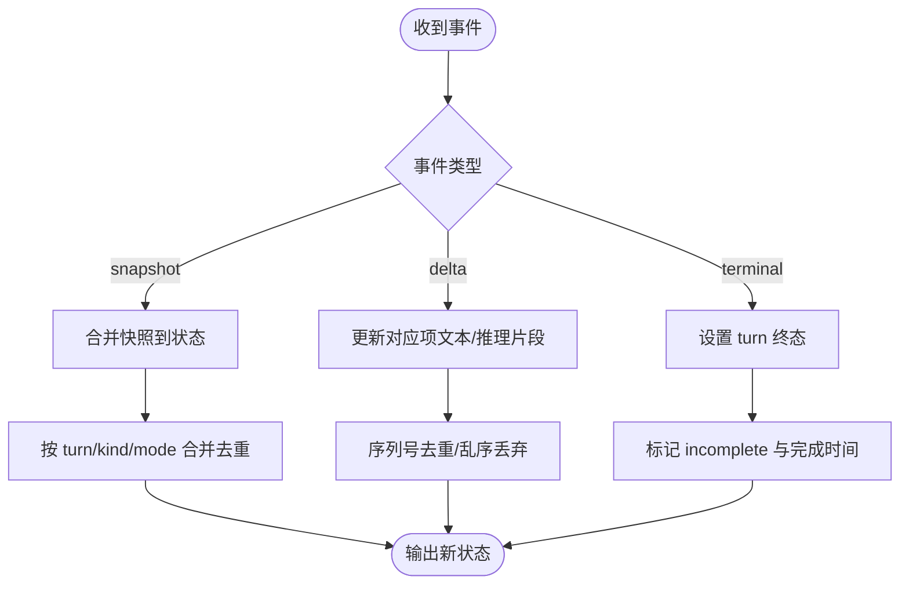
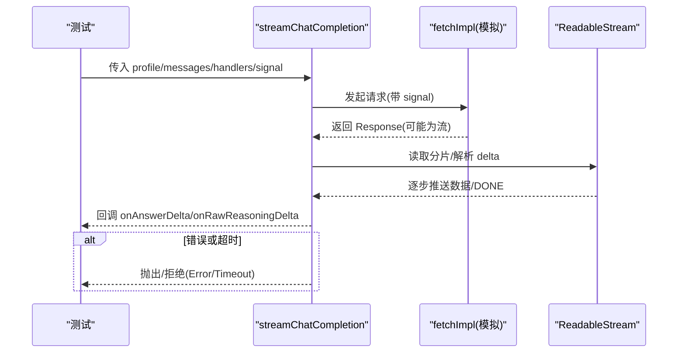
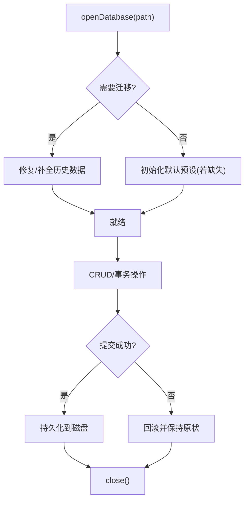
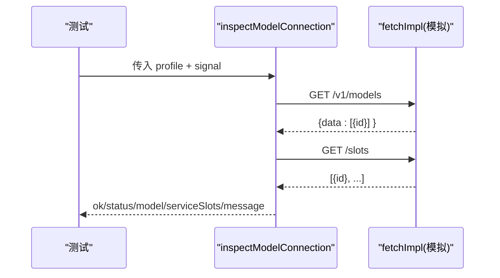
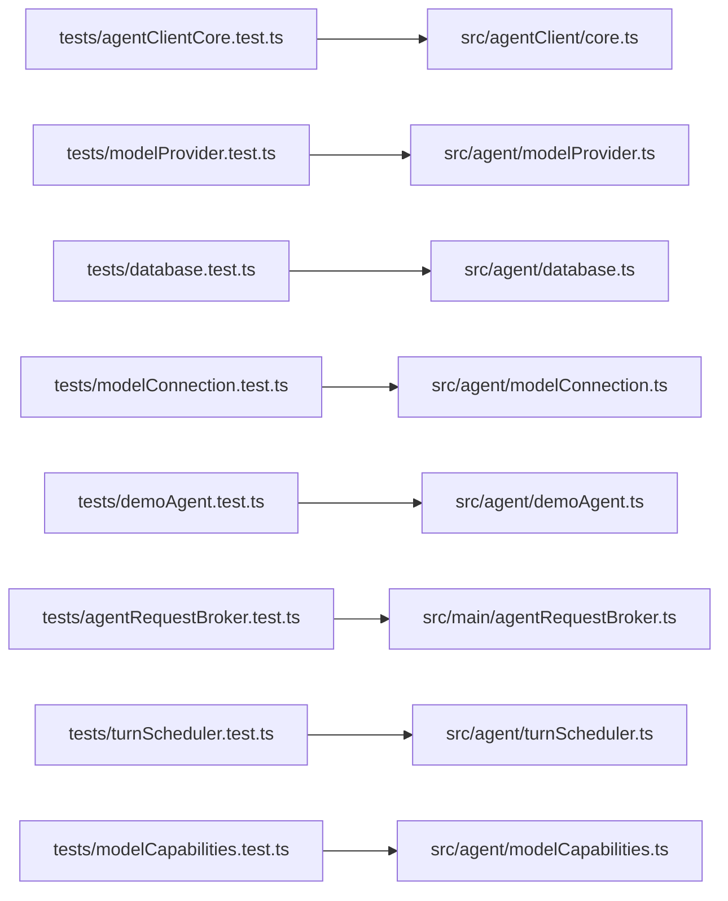

# 单元测试

<cite>
**本文引用的文件**
- [package.json](file://package.json)
- [tests/agentClientCore.test.ts](file://tests/agentClientCore.test.ts)
- [tests/modelProvider.test.ts](file://tests/modelProvider.test.ts)
- [tests/database.test.ts](file://tests/database.test.ts)
- [tests/modelConnection.test.ts](file://tests/modelConnection.test.ts)
- [tests/demoAgent.test.ts](file://tests/demoAgent.test.ts)
- [tests/agentRequestBroker.test.ts](file://tests/agentRequestBroker.test.ts)
- [tests/turnScheduler.test.ts](file://tests/turnScheduler.test.ts)
- [tests/modelCapabilities.test.ts](file://tests/modelCapabilities.test.ts)
- [tests/e2e/fakeModelServer.ts](file://tests/e2e/fakeModelServer.ts)
</cite>

## 目录
1. [简介](#简介)
2. [项目结构](#项目结构)
3. [核心组件](#核心组件)
4. [架构总览](#架构总览)
5. [详细组件分析](#详细组件分析)
6. [依赖分析](#依赖分析)
7. [性能考虑](#性能考虑)
8. [故障排查指南](#故障排查指南)
9. [结论](#结论)
10. [附录](#附录)

## 简介
本文件面向该项目的单元测试体系，系统性说明基于 Vitest 的测试环境、Mock 策略与断言用法，并围绕 Agent 客户端、请求代理器、数据库操作、模型提供商等核心模块，总结测试用例设计模式与最佳实践。文档还涵盖异步测试处理、错误场景覆盖、性能相关测试要点，以及覆盖率配置与报告生成的方法建议。

## 项目结构
- 测试入口与脚本：通过 package.json 中的 test 脚本统一执行一组单元测试；E2E 使用 Playwright 单独运行。
- 测试组织：所有单元测试位于 tests 目录下，按被测模块命名对应 .test.ts 文件；E2E 位于 tests/e2e。
- 外部依赖模拟：对网络、文件系统、SQLite 等外部资源采用本地构造或内存化方式隔离，避免真实 I/O。

**章节来源**
- [package.json:7-14](file://package.json#L7-L14)

## 核心组件
- 测试框架与断言：Vitest（describe/it/expect），配合 vi 进行 Mock、Spy、FakeTimers。
- 测试数据构造：大量使用工厂函数与 fixture 对象构建稳定的输入输出样例。
- 外部依赖隔离：
  - 网络：通过注入自定义 fetchImpl 或使用 fake HTTP server。
  - 存储：使用临时目录 + SQLite 内存/文件实例，并在 afterEach 清理。
  - 时间：使用 vi.useFakeTimers/vi.advanceTimersByTimeAsync 控制异步时序。
- 并发与流：利用 ReadableStream、AbortController、Promise.race 模拟流式响应与超时/取消。

**章节来源**
- [tests/modelProvider.test.ts:1-43](file://tests/modelProvider.test.ts#L1-L43)
- [tests/database.test.ts:1-58](file://tests/database.test.ts#L1-L58)
- [tests/agentRequestBroker.test.ts:1-6](file://tests/agentRequestBroker.test.ts#L1-L6)
- [tests/turnScheduler.test.ts:710-780](file://tests/turnScheduler.test.ts#L710-L780)

## 架构总览
下图展示了测试层如何与被测模块交互，并通过 Mock/Stub/Fixture 隔离外部系统，确保可重复、快速且可靠的验证。

[无图表来源：该图为概念性示意]

## 详细组件分析

### Agent 客户端（状态机与事件归约）
- 目标：验证 reduceAgentEvent、appendOptimisticUserMessage、applyAssistantDeltaToSnapshot 等纯函数在复杂事件流下的状态一致性。
- 设计模式：
  - 事件夹具：封装 queued/started/delta/snapshot 等常见事件构造。
  - 快照夹具：构造 AppSnapshot 最小可用形态，便于增量叠加。
  - 场景矩阵：使用 it.each 覆盖多种历史快照与实时事件组合。
- 关键断言点：
  - 后台线程不影响活跃线程焦点。
  - 去重与乱序抑制。
  - 历史快照与实时内容合并规则。
  - 乐观占位与真实事件抢占。
  - 终止态与未完成态的标记一致性。

**图表来源**
- [tests/agentClientCore.test.ts:100-129](file://tests/agentClientCore.test.ts#L100-L129)
- [tests/agentClientCore.test.ts:251-279](file://tests/agentClientCore.test.ts#L251-L279)
- [tests/agentClientCore.test.ts:321-371](file://tests/agentClientCore.test.ts#L321-L371)

**章节来源**
- [tests/agentClientCore.test.ts:100-800](file://tests/agentClientCore.test.ts#L100-L800)

### 模型提供商（流式请求、错误与超时）
- 目标：验证 streamChatCompletion/testModelProfile 在不同网络/流式响应、错误码、超时、取消场景下的行为。
- Mock 策略：
  - 注入自定义 fetchImpl，精确控制响应体、流式分片、错误与延迟。
  - 使用 AbortController 信号验证取消传播。
  - 使用 ReadableStream 模拟 SSE-like 数据流。
- 关键断言点：
  - 错误消息脱敏（不暴露密钥、诊断信息）。
  - 上下文超限、长度限制等结构化错误的友好提示。
  - 超时与硬超时保护。
  - DONE 哨兵结束与流释放。
  - 不同 reasoning 协议参数映射。

**图表来源**
- [tests/modelProvider.test.ts:45-72](file://tests/modelProvider.test.ts#L45-L72)
- [tests/modelProvider.test.ts:98-127](file://tests/modelProvider.test.ts#L98-L127)
- [tests/modelProvider.test.ts:216-253](file://tests/modelProvider.test.ts#L216-L253)
- [tests/modelProvider.test.ts:286-358](file://tests/modelProvider.test.ts#L286-L358)
- [tests/modelProvider.test.ts:406-443](file://tests/modelProvider.test.ts#L406-L443)
- [tests/modelProvider.test.ts:688-748](file://tests/modelProvider.test.ts#L688-L748)

**章节来源**
- [tests/modelProvider.test.ts:1-800](file://tests/modelProvider.test.ts#L1-L800)

### 数据库操作（迁移、原子性与持久化）
- 目标：验证 openDatabase 的迁移、默认预设填充、事务原子性、历史修复、压缩与查询语义。
- 测试环境：
  - 使用 mkdtempSync + tmpdir 创建临时目录，每个测试独立 SQLite 文件。
  - afterEach 递归删除临时目录，保证隔离。
- 关键断言点：
  - 旧版本数据库迁移与修复。
  - 默认模型预设插入且不覆盖用户自定义。
  - 推理片段与助手消息的合并策略。
  - 中断/失败/取消状态的恢复与标记。
  - 完成 turn 时指标与不完整标记的原子写入。
  - 关闭后重新打开的数据一致性与键脱敏。

**图表来源**
- [tests/database.test.ts:60-116](file://tests/database.test.ts#L60-L116)
- [tests/database.test.ts:118-186](file://tests/database.test.ts#L118-L186)
- [tests/database.test.ts:360-428](file://tests/database.test.ts#L360-L428)
- [tests/database.test.ts:485-548](file://tests/database.test.ts#L485-L548)
- [tests/database.test.ts:744-775](file://tests/database.test.ts#L744-L775)

**章节来源**
- [tests/database.test.ts:1-800](file://tests/database.test.ts#L1-L800)

### 模型连接检查（能力探测与槽位校验）
- 目标：验证 inspectModelConnection 对模型标识匹配、槽位数量、错误响应、取消信号的健壮性。
- Mock 策略：
  - 使用 vi.fn().mockResolvedValueOnce 编排多次 HTTP 调用。
  - 构造畸形 JSON、空数组、重复 slot id 等边界情况。
  - 通过 AbortController 验证取消不被降级。
- 关键断言点：
  - 精确模型匹配与服务槽位一致性。
  - 不可用/离线/不匹配的错误消息有界且不泄露敏感信息。
  - 槽位检测失败时的降级策略。

**图表来源**
- [tests/modelConnection.test.ts:23-45](file://tests/modelConnection.test.ts#L23-L45)
- [tests/modelConnection.test.ts:47-75](file://tests/modelConnection.test.ts#L47-L75)
- [tests/modelConnection.test.ts:101-127](file://tests/modelConnection.test.ts#L101-L127)
- [tests/modelConnection.test.ts:152-170](file://tests/modelConnection.test.ts#L152-L170)
- [tests/modelConnection.test.ts:172-256](file://tests/modelConnection.test.ts#L172-L256)

**章节来源**
- [tests/modelConnection.test.ts:1-258](file://tests/modelConnection.test.ts#L1-L258)

### 演示 Agent（事件发射与生命周期）
- 目标：验证 runDemoTurn 的事件顺序、流式响应、审批请求与终止事件。
- 关键点：
  - 使用 createTurnEventEmitter 收集事件，验证 sequence 有序与终止后不再接收后续事件。
  - 并发多个 turn 时彼此隔离。

**章节来源**
- [tests/demoAgent.test.ts:1-75](file://tests/demoAgent.test.ts#L1-L75)

### 请求代理器（超时与断开）
- 目标：验证 AgentRequestBroker 的请求超时、断开后批量拒绝、清理 pending 计数。
- Mock 策略：
  - vi.useFakeTimers 驱动超时。
  - 注入 postMessage 接口模拟 worker 通信。
- 关键断言点：
  - 到期后请求被拒绝并从 pending 中移除。
  - 断开原因传播至所有待处理请求。

**章节来源**
- [tests/agentRequestBroker.test.ts:1-39](file://tests/agentRequestBroker.test.ts#L1-L39)

### 调度器（并发与队列位置）
- 目标：验证 ModelTurnScheduler 的 FIFO 调度、模型级容量隔离、取消、限流动态调整、队列位置快照序列化。
- 测试技巧：
  - 自定义 deferred/promise 控制任务完成时机。
  - 通过 flushMicrotasks 推进微任务队列，确保确定性。
  - 记录 started/queued/cancelled/positionSnapshots 等观测指标。
- 关键断言点：
  - 同一模型串行、不同模型并行。
  - 取消仅对排队或运行中任务生效一次。
  - 限流提升/降低时的启动与回压行为。
  - 回调异常不泄漏未处理拒绝且不占用槽位。

**章节来源**
- [tests/turnScheduler.test.ts:1-780](file://tests/turnScheduler.test.ts#L1-L780)

### 模型能力与配置（规范化与校验）
- 目标：验证能力字段规范化、reasoning 选择校验、最大并发与输出 token 上限约束。
- 关键点：
  - 兼容旧版 qwen/openai 能力声明。
  - 拒绝未声明的 effort 值与空白值。
  - 将任意配置钳制到能力上限。

**章节来源**
- [tests/modelCapabilities.test.ts:1-184](file://tests/modelCapabilities.test.ts#L1-L184)

### E2E 辅助：假模型服务器
- 目标：提供可配置的 HTTP 服务端，用于端到端测试中模拟模型接口。
- 能力：
  - 暴露 /v1/models、/slots、/chat/completions 等路径。
  - 支持设置连接状态、失败响应、流式发布与关闭。

**章节来源**
- [tests/e2e/fakeModelServer.ts:1-133](file://tests/e2e/fakeModelServer.ts#L1-L133)

## 依赖分析
- 测试对源码的依赖集中在 agent、agentClient、main、shared 等模块，测试通过直接 import 被测函数/类进行白盒验证。
- 外部依赖（网络、文件系统、SQLite）均被替换为可控实现，避免环境差异影响。
- 测试间相互独立，无共享全局状态，依赖 afterEach 清理临时资源。

**图表来源**
- [tests/agentClientCore.test.ts:1-10](file://tests/agentClientCore.test.ts#L1-L10)
- [tests/modelProvider.test.ts:1-6](file://tests/modelProvider.test.ts#L1-L6)
- [tests/database.test.ts:1-8](file://tests/database.test.ts#L1-L8)
- [tests/modelConnection.test.ts:1-5](file://tests/modelConnection.test.ts#L1-L5)
- [tests/demoAgent.test.ts:1-5](file://tests/demoAgent.test.ts#L1-L5)
- [tests/agentRequestBroker.test.ts:1-3](file://tests/agentRequestBroker.test.ts#L1-L3)
- [tests/turnScheduler.test.ts:1-7](file://tests/turnScheduler.test.ts#L1-L7)
- [tests/modelCapabilities.test.ts:1-11](file://tests/modelCapabilities.test.ts#L1-L11)

**章节来源**
- [tests/agentClientCore.test.ts:1-10](file://tests/agentClientCore.test.ts#L1-L10)
- [tests/modelProvider.test.ts:1-6](file://tests/modelProvider.test.ts#L1-L6)
- [tests/database.test.ts:1-8](file://tests/database.test.ts#L1-L8)
- [tests/modelConnection.test.ts:1-5](file://tests/modelConnection.test.ts#L1-L5)
- [tests/demoAgent.test.ts:1-5](file://tests/demoAgent.test.ts#L1-L5)
- [tests/agentRequestBroker.test.ts:1-3](file://tests/agentRequestBroker.test.ts#L1-L3)
- [tests/turnScheduler.test.ts:1-7](file://tests/turnScheduler.test.ts#L1-L7)
- [tests/modelCapabilities.test.ts:1-11](file://tests/modelCapabilities.test.ts#L1-L11)

## 性能考虑
- 流式测试：通过 ReadableStream 与 AbortController 控制数据速率与取消，避免阻塞测试进程。
- 定时器控制：使用 vi.useFakeTimers 与 vi.advanceTimersByTimeAsync 精确控制超时与延时，提高稳定性。
- 数据库测试：使用临时目录与轻量 SQLite 文件，避免真实生产库开销；尽量复用最小数据集。
- 并发测试：通过 Promise.race 与微任务刷新（flushMicrotasks）确保竞态条件可重现。

[本节为通用指导，不直接分析具体文件]

## 故障排查指南
- 网络错误脱敏：当 provider 返回包含密钥或诊断信息的错误时，应断言最终错误消息不包含敏感片段。参考模型提供商测试中对错误消息的断言。
- 超时与取消：确保所有网络调用都携带 AbortSignal，并在测试中主动 abort 以验证快速失败。
- 数据库事务：当涉及审批/失败 turn 的原子更新时，使用 SQL 触发器或强制错误模拟回滚，验证状态一致性。
- 事件顺序：对于流式/异步事件，使用 sequence 字段或事件收集数组断言顺序与终止行为。

**章节来源**
- [tests/modelProvider.test.ts:45-72](file://tests/modelProvider.test.ts#L45-L72)
- [tests/modelProvider.test.ts:216-253](file://tests/modelProvider.test.ts#L216-L253)
- [tests/database.test.ts:430-458](file://tests/database.test.ts#L430-L458)
- [tests/demoAgent.test.ts:14-43](file://tests/demoAgent.test.ts#L14-L43)

## 结论
本项目测试体系以 Vitest 为核心，结合 vi 的 Mock/FakeTimers、自定义 fetchImpl、临时 SQLite 与假 HTTP 服务，构建了高内聚、低耦合、可重复的测试环境。针对 Agent 客户端、模型提供商、数据库、连接检查、调度器等关键模块，测试覆盖了正常路径、错误路径、边界条件与并发场景，确保了系统的健壮性与可维护性。建议在新增功能时遵循现有模式：构造稳定 fixture、注入可控依赖、显式断言副作用与状态变更，并补充超时/取消/错误脱敏等关键场景。

[本节为总结性内容，不直接分析具体文件]

## 附录

### Vitest 配置与运行
- 运行命令：通过 package.json 的 scripts.test 指定要执行的测试文件集合。
- 插件与生态：项目使用 Vite 生态，Vitest 作为测试运行器；无需额外配置文件即可工作，可通过命令行参数扩展能力。

**章节来源**
- [package.json:7-14](file://package.json#L7-L14)

### 覆盖率配置与报告生成（建议）
- 启用覆盖率：在 Vitest 运行参数中添加 --coverage 选项，或在测试命令中加入 coverage 配置（如 reporters、thresholds）。
- 报告格式：可选择 html/json/lcov 等格式，便于接入 CI 与代码审查工具。
- 阈值设定：根据项目阶段设置合理的语句/分支/函数/行覆盖率阈值，逐步提升质量基线。

[本节为通用建议，不直接分析具体文件]

### 常用测试模式速查
- 异步测试：async/await + vi.useFakeTimers + vi.advanceTimersByTimeAsync。
- 流式测试：ReadableStream + AbortController + Promise.race。
- 网络 Mock：注入 fetchImpl，mockResolvedValue/mockRejectedValue。
- 数据库隔离：mkdtempSync + tmpdir + afterEach rmSync。
- 并发控制：Promise.all/Promise.race + flushMicrotasks。

[本节为通用建议，不直接分析具体文件]