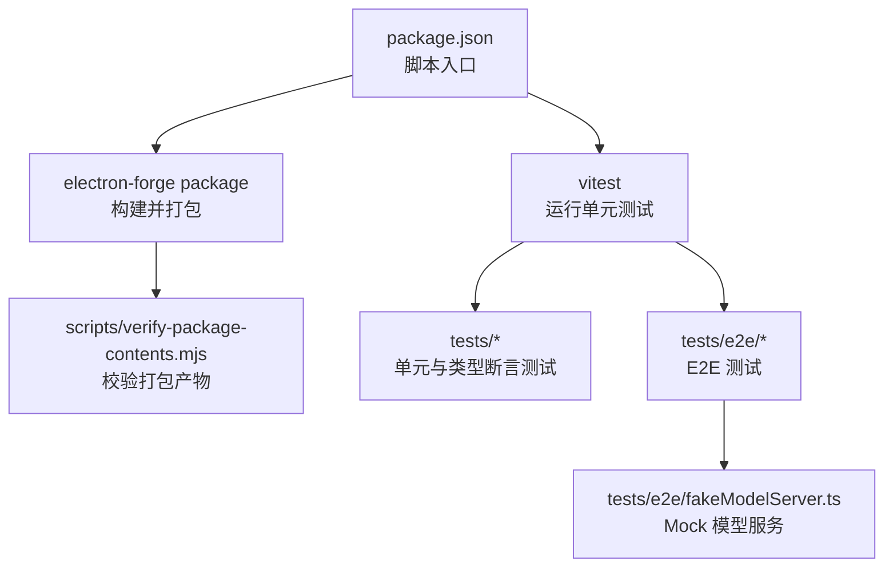
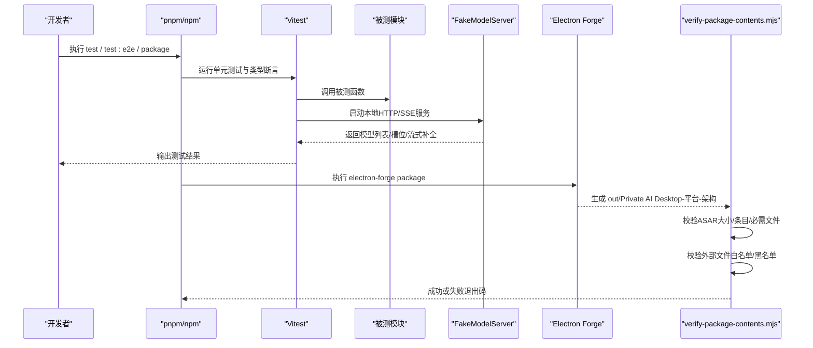
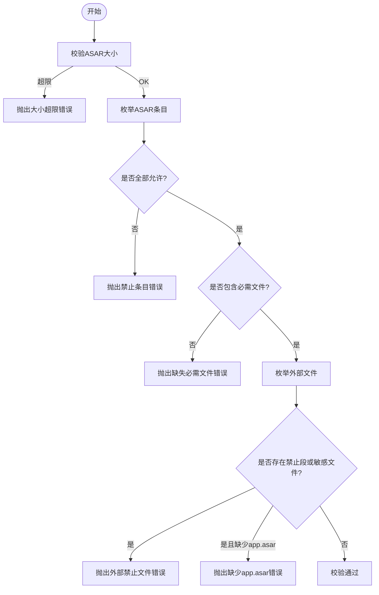
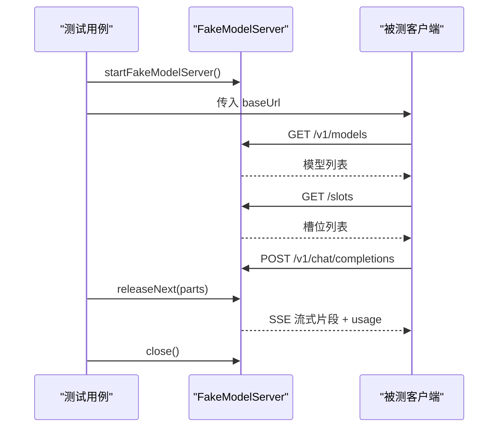
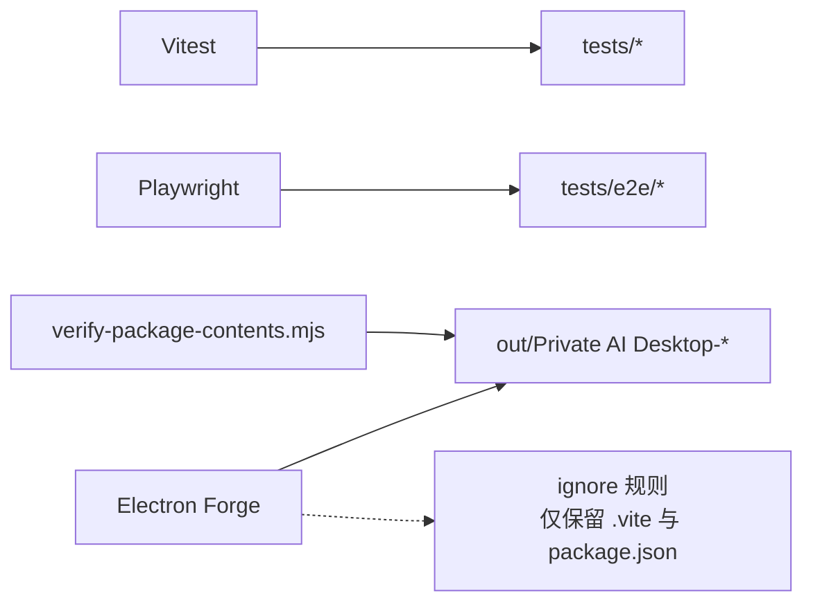

# 测试工具和辅助

<cite>
**本文引用的文件**
- [tests/modelConnectionResult.types.ts](file://tests/modelConnectionResult.types.ts)
- [scripts/verify-package-contents.mjs](file://scripts/verify-package-contents.mjs)
- [tests/packageContents.test.ts](file://tests/packageContents.test.ts)
- [tests/e2e/fakeModelServer.ts](file://tests/e2e/fakeModelServer.ts)
- [tests/modelConnection.test.ts](file://tests/modelConnection.test.ts)
- [package.json](file://package.json)
- [forge.config.ts](file://forge.config.ts)
</cite>

## 目录
1. [简介](#简介)
2. [项目结构](#项目结构)
3. [核心组件](#核心组件)
4. [架构总览](#架构总览)
5. [详细组件分析](#详细组件分析)
6. [依赖关系分析](#依赖关系分析)
7. [性能与稳定性考虑](#性能与稳定性考虑)
8. [故障排查指南](#故障排查指南)
9. [结论](#结论)
10. [附录](#附录)

## 简介
本章节面向测试工具与辅助能力，聚焦以下目标：
- 说明类型定义测试文件的作用与使用方法，尤其是连接结果类型的精确性断言。
- 记录包内容验证脚本的功能、配置项与集成方式，确保打包产物完整性与合规性。
- 介绍测试数据生成工具（Mock 服务器）、测试环境初始化方法与使用示例。
- 提供调试技巧与常见问题排查建议，帮助快速定位问题。

## 项目结构
仓库采用分层组织：
- src：应用源码（主进程、渲染进程、Agent、共享领域模型等）。
- tests：单元测试、端到端测试与类型断言测试。
- scripts：构建后校验脚本（如 ASAR 内容与外部文件清单校验）。
- 根级配置文件：package.json、forge.config.ts、vite.*.config.ts 等。

图表来源
- [package.json:7-14](file://package.json#L7-L14)
- [forge.config.ts:9-21](file://forge.config.ts#L9-L21)
- [scripts/verify-package-contents.mjs:89-101](file://scripts/verify-package-contents.mjs#L89-L101)

章节来源
- [package.json:7-14](file://package.json#L7-L14)
- [forge.config.ts:9-21](file://forge.config.ts#L9-L21)

## 核心组件
- 类型断言测试：通过编译期类型检查保证连接结果类型在不同状态下的精确形状。
- 包内容验证脚本：在打包阶段校验 ASAR 内部与外部文件的白名单、黑名单与大小限制。
- Mock 模型服务器：为 E2E 与部分单元测试提供稳定的 HTTP/SSE 响应，模拟模型发现、槽位查询与补全流式输出。
- 测试编排与命令：通过 package.json 的脚本统一执行单测、E2E 与打包校验流程。

章节来源
- [tests/modelConnectionResult.types.ts:1-39](file://tests/modelConnectionResult.types.ts#L1-L39)
- [scripts/verify-package-contents.mjs:37-73](file://scripts/verify-package-contents.mjs#L37-L73)
- [tests/e2e/fakeModelServer.ts:23-122](file://tests/e2e/fakeModelServer.ts#L23-L122)
- [package.json:7-14](file://package.json#L7-L14)

## 架构总览
下图展示了从“运行测试”到“验证打包产物”的整体链路，以及 Mock 服务在 E2E 中的角色。

图表来源
- [package.json:7-14](file://package.json#L7-L14)
- [scripts/verify-package-contents.mjs:89-116](file://scripts/verify-package-contents.mjs#L89-L116)
- [tests/e2e/fakeModelServer.ts:23-122](file://tests/e2e/fakeModelServer.ts#L23-L122)

## 详细组件分析

### 类型断言测试：modelConnectionResult.types.ts
作用
- 以编译期类型断言的方式，确保 ModelConnectionResult 在不同 status 分支下的字段组合严格符合预期。
- 通过 Exact 与 Assert 的组合，将“期望类型”与“实际提取类型”进行双向包含比较，任何多余或缺失字段都会导致类型错误。

使用方法
- 将该文件纳入类型检查流程（例如 tsconfig.type-tests.json），在 CI 中作为类型门禁的一部分。
- 新增或修改连接结果状态时，需同步更新对应断言，否则类型检查会失败。

关键要点
- 每个状态分支都定义了基础字段与扩展字段的交集，覆盖 connected、concurrency-warning、slots-unverified、offline、model-mismatch。
- 该文件不引入运行时依赖，仅用于静态类型验证。

章节来源
- [tests/modelConnectionResult.types.ts:1-39](file://tests/modelConnectionResult.types.ts#L1-L39)

### 包内容验证脚本：verify-package-contents.mjs
功能
- 校验打包后的 ASAR 文件大小是否超过上限。
- 校验 ASAR 内只允许存在受控路径（如 package.json、.vite 相关产物）。
- 校验 ASAR 内必须包含若干必需文件（主进程、预加载、Worker、渲染入口 HTML）。
- 校验外部目录不得包含敏感或开发无关文件（如 node_modules、src、tests、.env、.gguf 等）。
- 校验资源目录必须包含 app.asar。

配置项
- MAX_ASAR_BYTES：ASAR 最大字节数，默认 2MB。
- allowedAsarEntry：允许的 ASAR 路径前缀正则，当前仅允许 package.json 与 .vite 开头路径。
- requiredAsarFiles：必需的 ASAR 文件集合。
- forbiddenOuterSegments：禁止出现在外部目录的段名集合。

集成方式
- 在 package.json 的 package 脚本中，electron-forge package 完成后自动执行该脚本。
- 可在 CI 中单独调用该脚本对已有产物进行回归校验。

图表来源
- [scripts/verify-package-contents.mjs:37-73](file://scripts/verify-package-contents.mjs#L37-L73)
- [scripts/verify-package-contents.mjs:89-101](file://scripts/verify-package-contents.mjs#L89-L101)

章节来源
- [scripts/verify-package-contents.mjs:6-16](file://scripts/verify-package-contents.mjs#L6-L16)
- [scripts/verify-package-contents.mjs:37-73](file://scripts/verify-package-contents.mjs#L37-L73)
- [scripts/verify-package-contents.mjs:89-101](file://scripts/verify-package-contents.mjs#L89-L101)
- [package.json:12-13](file://package.json#L12-L13)

### 测试数据生成工具：fakeModelServer.ts
作用
- 提供一个可配置的本地 HTTP 服务器，模拟 OpenAI 兼容接口：
  - GET /v1/models：返回模型列表。
  - GET /slots：返回槽位列表。
  - POST /v1/chat/completions：以 SSE 形式流式返回补全片段与用量统计。
- 支持设置连接状态、控制下一次响应、注入失败场景，便于覆盖异常分支。

使用方式
- 在测试中启动 FakeModelServer，获取 baseUrl 指向本地端口。
- 通过 setConnectionState 切换模型列表与槽位数。
- 通过 releaseNext 释放一次补全请求的流式响应；通过 failNext 注入指定状态码与体。
- 测试结束后调用 close 关闭服务器并清理挂起请求。

典型用例
- 验证模型发现与槽位校验逻辑（如 modelConnection.test.ts）。
- 构造不同网络/协议错误（超时、非 JSON、空数组、重复 id）来覆盖边界情况。

图表来源
- [tests/e2e/fakeModelServer.ts:23-122](file://tests/e2e/fakeModelServer.ts#L23-L122)

章节来源
- [tests/e2e/fakeModelServer.ts:1-134](file://tests/e2e/fakeModelServer.ts#L1-L134)
- [tests/modelConnection.test.ts:23-150](file://tests/modelConnection.test.ts#L23-L150)

### 测试环境与命令
- 单元测试：通过 vitest 运行 tests 目录下所有测试文件，包括类型断言测试。
- E2E 测试：先打包应用，再使用 Playwright 运行 tests/e2e/app.spec.ts。
- 类型检查：vue-tsc 与 tsc 分别检查前端与 Node 侧类型，同时包含类型断言测试配置。
- 打包与校验：electron-forge package 后自动执行 verify-package-contents.mjs，确保产物合规。

章节来源
- [package.json:7-14](file://package.json#L7-L14)
- [package.json:19-33](file://package.json#L19-L33)
- [forge.config.ts:9-21](file://forge.config.ts#L9-L21)

## 依赖关系分析
- 测试框架：vitest 负责单元测试与类型断言；Playwright 负责 E2E。
- 打包与校验：electron-forge 负责构建与打包；@electron/asar 被验证脚本用于读取 ASAR 清单。
- 构建配置：forge.config.ts 定义忽略规则与多入口构建，确保仅打包必要资源。

图表来源
- [package.json:7-14](file://package.json#L7-L14)
- [forge.config.ts:10-13](file://forge.config.ts#L10-L13)
- [scripts/verify-package-contents.mjs:89-101](file://scripts/verify-package-contents.mjs#L89-L101)

章节来源
- [package.json:7-14](file://package.json#L7-L14)
- [forge.config.ts:10-13](file://forge.config.ts#L10-L13)

## 性能与稳定性考虑
- 类型断言测试零运行时开销，建议在 CI 中始终开启，避免类型漂移。
- 包内容校验在打包阶段执行，有助于尽早发现误入的源文件或过大产物。
- Mock 服务器基于内存队列与流式写入，适合高并发测试场景；注意在测试结束时调用 close 释放资源。
- 建议将 MAX_ASAR_BYTES 与实际产物规模对齐，避免误报或漏报。

[本节为通用指导，不直接分析具体文件]

## 故障排查指南
常见问题与处理
- 类型断言失败
  - 现象：编译时报错，提示类型不匹配。
  - 原因：连接结果类型变更未同步更新断言。
  - 处理：打开 tests/modelConnectionResult.types.ts，按新状态补齐或修正断言。

- 包内容校验失败
  - 现象：打包后出现“禁止条目”“缺失必需文件”“超出大小限制”等错误。
  - 原因：ASAR 中包含不允许的路径或未包含必需文件；外部目录包含敏感文件。
  - 处理：
    - 检查 forge.config.ts 的 ignore 规则，确保仅打包必要资源。
    - 确认 requiredAsarFiles 所列文件已正确生成。
    - 清理外部目录中的敏感或开发文件（node_modules、src、tests、.env、.gguf 等）。
    - 若产物过大，优化构建或拆分资源。

- E2E 测试不稳定
  - 现象：偶发超时或端口占用。
  - 原因：FakeModelServer 未正确关闭或端口冲突。
  - 处理：
    - 确保测试结束调用 close。
    - 使用随机端口或等待可用端口后再启动。
    - 增加重试与超时策略。

- 模型连接测试失败
  - 现象：连接状态不符合预期。
  - 原因：Mock 服务器返回的数据结构与预期不一致。
  - 处理：
    - 使用 setConnectionState 调整模型列表与槽位数。
    - 使用 releaseNext 或 failNext 构造特定响应。
    - 参考 tests/modelConnection.test.ts 的用例模式。

章节来源
- [tests/modelConnectionResult.types.ts:1-39](file://tests/modelConnectionResult.types.ts#L1-L39)
- [scripts/verify-package-contents.mjs:37-73](file://scripts/verify-package-contents.mjs#L37-L73)
- [tests/e2e/fakeModelServer.ts:23-122](file://tests/e2e/fakeModelServer.ts#L23-L122)
- [tests/modelConnection.test.ts:23-150](file://tests/modelConnection.test.ts#L23-L150)

## 结论
本项目通过类型断言、包内容校验与 Mock 服务器构建了完整的测试与质量保障体系：
- 类型断言确保 API 契约稳定。
- 包内容校验防止敏感或冗余文件进入产物。
- Mock 服务器提升测试覆盖率与稳定性。
配合统一的脚本入口与构建配置，可在本地与 CI 中高效执行测试与发布流程。

[本节为总结性内容，不直接分析具体文件]

## 附录
- 常用命令
  - 运行单元测试：见 package.json 的 test 脚本。
  - 运行 E2E：见 package.json 的 test:e2e 脚本。
  - 类型检查：见 package.json 的 typecheck 脚本。
  - 打包并校验：见 package.json 的 package 脚本。

章节来源
- [package.json:7-14](file://package.json#L7-L14)