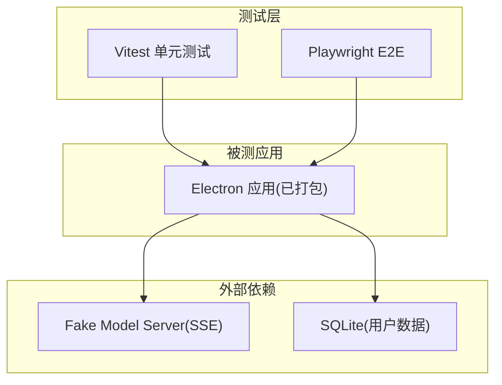
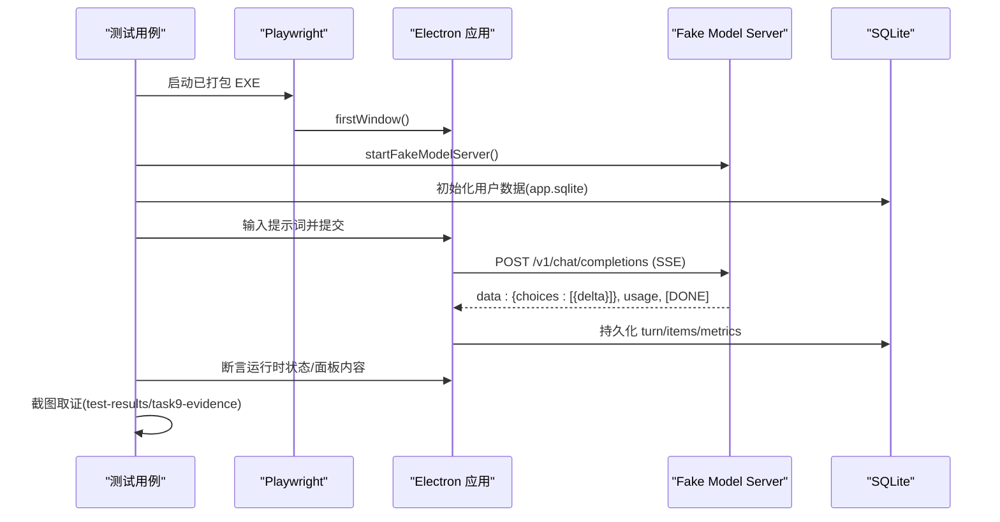
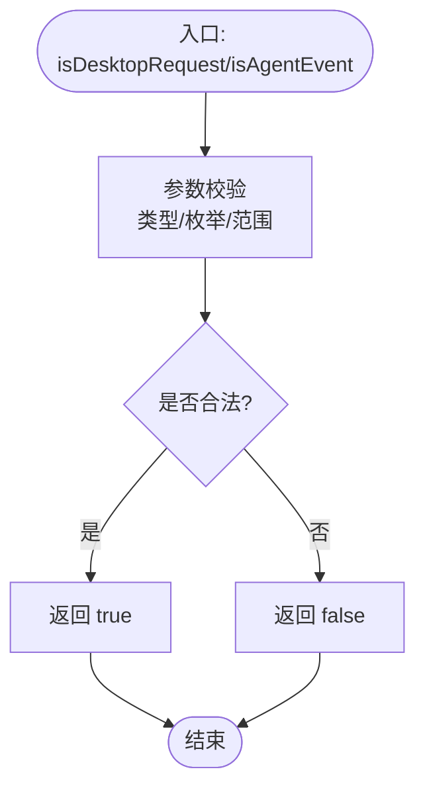
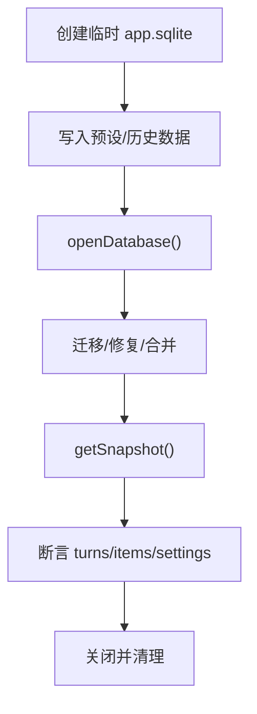
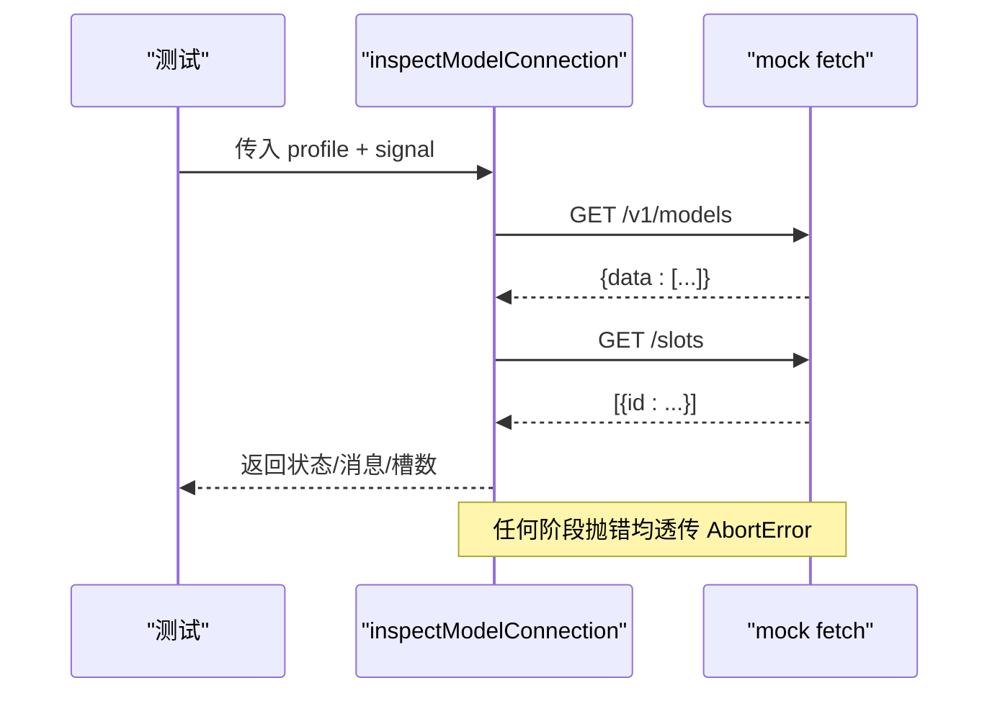
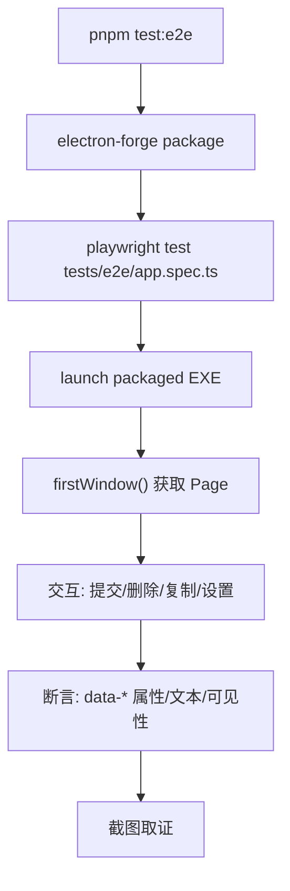
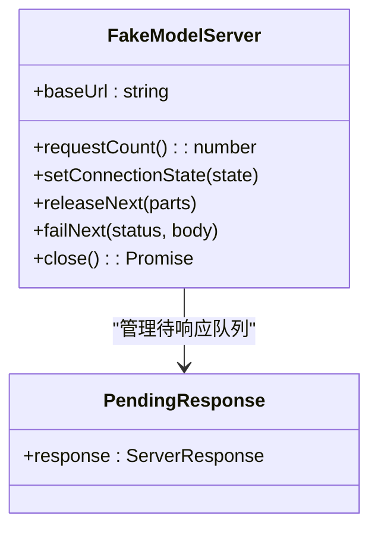
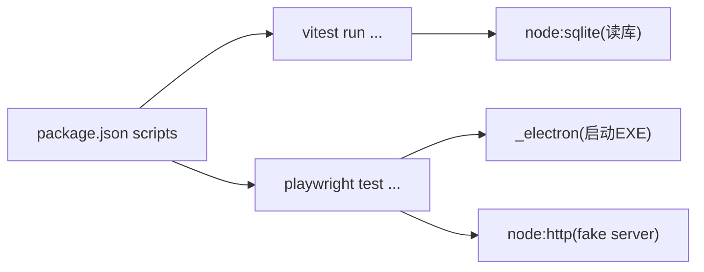

# 测试策略

<cite>
**本文引用的文件**
- [package.json](file://package.json)
- [tests/e2e/app.spec.ts](file://tests/e2e/app.spec.ts)
- [tests/e2e/live-model.spec.ts](file://tests/e2e/live-model.spec.ts)
- [tests/e2e/fakeModelServer.ts](file://tests/e2e/fakeModelServer.ts)
- [tests/modelConnection.test.ts](file://tests/modelConnection.test.ts)
- [tests/database.test.ts](file://tests/database.test.ts)
- [tests/protocol.test.ts](file://tests/protocol.test.ts)
- [tests/modelRuntimeScripts.test.ts](file://tests/modelRuntimeScripts.test.ts)
</cite>

## 目录
1. [简介](#简介)
2. [项目结构](#项目结构)
3. [核心组件](#核心组件)
4. [架构总览](#架构总览)
5. [详细组件分析](#详细组件分析)
6. [依赖分析](#依赖分析)
7. [性能考虑](#性能考虑)
8. [故障排查指南](#故障排查指南)
9. [结论](#结论)
10. [附录](#附录)

## 简介
本文件为 Private AI Desktop 项目的测试策略综合文档，覆盖单元测试框架配置、测试用例设计、Mock 策略、端到端（E2E）Playwright 配置与浏览器自动化、覆盖率要求、测试数据管理、持续集成流程、最佳实践与调试技巧，以及不同类型测试的执行方式与结果分析方法。目标是帮助开发者快速理解并高质量地维护现有测试体系，同时为后续扩展提供清晰指引。

## 项目结构
仓库采用分层组织：
- 源码位于 src/，包含主进程、渲染进程、共享协议与领域模型等。
- 测试位于 tests/，分为单元测试（vitest）与 E2E（playwright）。
- E2E 测试通过 Playwright 启动已打包的 Electron 应用，使用自定义 fake model server 模拟后端服务，验证 UI 行为、并发队列、流式输出、错误处理与持久化。

图表来源
- [package.json:7-14](file://package.json#L7-L14)
- [tests/e2e/app.spec.ts:18-17](file://tests/e2e/app.spec.ts#L18-L17)
- [tests/e2e/fakeModelServer.ts:23-73](file://tests/e2e/fakeModelServer.ts#L23-L73)

章节来源
- [package.json:7-14](file://package.json#L7-L14)

## 核心组件
- 单元测试框架：Vitest，配合 Node 环境运行，用于验证协议校验、数据库迁移与持久化、能力检测、脚本解析等。
- E2E 框架：Playwright + Electron，启动已打包的可执行文件，驱动 UI 交互，验证端到端场景。
- Mock 策略：
  - 网络层：vi.fn() 替换 fetch，控制响应与错误路径。
  - 服务端：自实现 Fake Model Server，支持 SSE 流式响应、可控失败、连接状态切换。
  - 文件系统：临时目录隔离用户数据，避免污染。
- 测试数据：
  - SQLite 数据库在临时目录创建，测试后清理。
  - 种子数据通过 openDatabase API 写入，保证可重复性。
- 覆盖率：当前未启用覆盖率插件；可在 CI 中按需引入 @vitest/coverage-v8 或 istanbul。

章节来源
- [tests/modelConnection.test.ts:1-4](file://tests/modelConnection.test.ts#L1-L4)
- [tests/database.test.ts:1-15](file://tests/database.test.ts#L1-L15)
- [tests/e2e/app.spec.ts:18-17](file://tests/e2e/app.spec.ts#L18-L17)
- [tests/e2e/fakeModelServer.ts:23-73](file://tests/e2e/fakeModelServer.ts#L23-L73)

## 架构总览
下图展示了 E2E 测试从触发到断言的关键调用链，包括应用启动、fake server 通信、SSE 流式响应、UI 状态断言与证据截图。

图表来源
- [tests/e2e/app.spec.ts:519-573](file://tests/e2e/app.spec.ts#L519-L573)
- [tests/e2e/fakeModelServer.ts:23-122](file://tests/e2e/fakeModelServer.ts#L23-L122)
- [tests/e2e/app.spec.ts:615-618](file://tests/e2e/app.spec.ts#L615-L618)

## 详细组件分析

### 单元测试：协议与边界校验
- 目标：确保桌面协议守卫函数正确接受/拒绝各类请求与事件，防止非法配置进入系统。
- 关键点：
  - 对 modelProfile.save、settings.update、语言设置等进行白名单校验。
  - 对 reasoning 能力选项进行严格约束，拒绝无效 effort/outputModes。
  - 对事件类型与字段完整性进行断言。
- Mock 策略：无外部依赖，纯逻辑校验。

图表来源
- [tests/protocol.test.ts:4-89](file://tests/protocol.test.ts#L4-L89)
- [tests/protocol.test.ts:275-353](file://tests/protocol.test.ts#L275-L353)

章节来源
- [tests/protocol.test.ts:4-89](file://tests/protocol.test.ts#L4-L89)
- [tests/protocol.test.ts:275-353](file://tests/protocol.test.ts#L275-L353)

### 单元测试：数据库迁移与持久化
- 目标：验证 v1-v5 历史数据库迁移、默认预设注入、原子完成、中断恢复、消息合并、指标持久化等。
- 关键点：
  - 使用临时目录隔离每个测试的 app.sqlite。
  - 通过 openDatabase API 构造种子数据，断言快照一致性。
  - 验证 completedTurn 的原子性与取消 CAS。
  - 断言 API Key 不在快照中泄露。
- 数据管理：afterEach 清理临时目录，避免跨测试污染。

图表来源
- [tests/database.test.ts:11-15](file://tests/database.test.ts#L11-L15)
- [tests/database.test.ts:53-58](file://tests/database.test.ts#L53-L58)
- [tests/database.test.ts:61-116](file://tests/database.test.ts#L61-L116)
- [tests/database.test.ts:485-511](file://tests/database.test.ts#L485-L511)
- [tests/database.test.ts:744-775](file://tests/database.test.ts#L744-L775)

章节来源
- [tests/database.test.ts:11-15](file://tests/database.test.ts#L11-L15)
- [tests/database.test.ts:53-58](file://tests/database.test.ts#L53-L58)
- [tests/database.test.ts:61-116](file://tests/database.test.ts#L61-L116)
- [tests/database.test.ts:485-511](file://tests/database.test.ts#L485-L511)
- [tests/database.test.ts:744-775](file://tests/database.test.ts#L744-L775)

### 单元测试：模型连接检查与错误收敛
- 目标：验证 inspectModelConnection 的行为，包括模型匹配、槽位数量比较、离线/不可用错误收敛、取消传播。
- Mock 策略：
  - 使用 vi.fn() 替换 fetch，精确控制 models/slots 响应与错误。
  - 验证 AbortController 信号在各阶段均能及时抛出 AbortError。
  - 断言错误消息不包含敏感信息且长度受限。

图表来源
- [tests/modelConnection.test.ts:23-45](file://tests/modelConnection.test.ts#L23-L45)
- [tests/modelConnection.test.ts:172-256](file://tests/modelConnection.test.ts#L172-L256)

章节来源
- [tests/modelConnection.test.ts:23-45](file://tests/modelConnection.test.ts#L23-L45)
- [tests/modelConnection.test.ts:172-256](file://tests/modelConnection.test.ts#L172-L256)

### 单元测试：运行时脚本静态校验
- 目标：确保 PowerShell 脚本语法正确、作用域安全、健康检查顺序合理、编码正确。
- 方法：
  - 使用 powershell.exe 解析脚本，断言 status=0。
  - 读取源文件断言关键字符串存在/不存在。

章节来源
- [tests/modelRuntimeScripts.test.ts:7-30](file://tests/modelRuntimeScripts.test.ts#L7-L30)

### E2E：Playwright 配置与执行
- 执行命令：
  - 全量单测：pnpm test
  - E2E：pnpm test:e2e（先打包再运行 playwright）
- 应用启动：
  - 通过 _electron 启动已打包 EXE，设置 PRIVATE_AI_DESKTOP_USER_DATA 指向临时目录。
- 浏览器自动化：
  - 使用 page.getByTestId 定位元素，poll 等待异步状态变化。
  - 通过 window.desktop.subscribe/getSnapshot 获取内部事件与快照。
- 证据收集：
  - 截图保存到 test-results/task9-evidence，便于失败回溯。

图表来源
- [package.json:10-11](file://package.json#L10-L11)
- [tests/e2e/app.spec.ts:564-573](file://tests/e2e/app.spec.ts#L564-L573)
- [tests/e2e/app.spec.ts:615-618](file://tests/e2e/app.spec.ts#L615-L618)

章节来源
- [package.json:10-11](file://package.json#L10-L11)
- [tests/e2e/app.spec.ts:564-573](file://tests/e2e/app.spec.ts#L564-L573)
- [tests/e2e/app.spec.ts:615-618](file://tests/e2e/app.spec.ts#L615-L618)

### E2E：Fake Model Server 设计与用法
- 功能：
  - 暴露 /v1/models、/slots、/v1/chat/completions。
  - 支持 setConnectionState 动态调整模型列表与槽位。
  - releaseNext 按序释放 SSE 片段，failNext 模拟 HTTP 错误。
  - close 销毁所有挂起响应并关闭服务器。
- 用途：
  - 验证并发队列、取消释放容量、流式分离、错误收敛、重启恢复等。

图表来源
- [tests/e2e/fakeModelServer.ts:3-10](file://tests/e2e/fakeModelServer.ts#L3-L10)
- [tests/e2e/fakeModelServer.ts:19-21](file://tests/e2e/fakeModelServer.ts#L19-L21)
- [tests/e2e/fakeModelServer.ts:23-122](file://tests/e2e/fakeModelServer.ts#L23-L122)

章节来源
- [tests/e2e/fakeModelServer.ts:3-10](file://tests/e2e/fakeModelServer.ts#L3-L10)
- [tests/e2e/fakeModelServer.ts:23-122](file://tests/e2e/fakeModelServer.ts#L23-L122)

### E2E：典型场景与断言要点
- 并发与队列：
  - 并发为 1 时 FIFO 排队，后台完成不抢占焦点。
  - 并发为 2 时可并行两个聊天。
- 取消与容量释放：
  - 取消 queued 与 running 各释放一次容量。
- 流式分离：
  - rawReasoning、summary、answer 分别持久化与展示，复制作用域正确。
- 错误收敛与脱敏：
  - provider 失败时错误消息不含密钥，UI 与 SQLite 均脱敏。
- 重启恢复：
  - 未完成 turn 重启后标记 interrupted，不重发请求。

章节来源
- [tests/e2e/app.spec.ts:148-220](file://tests/e2e/app.spec.ts#L148-L220)
- [tests/e2e/app.spec.ts:222-268](file://tests/e2e/app.spec.ts#L222-L268)
- [tests/e2e/app.spec.ts:270-411](file://tests/e2e/app.spec.ts#L270-L411)
- [tests/e2e/app.spec.ts:413-477](file://tests/e2e/app.spec.ts#L413-L477)
- [tests/e2e/app.spec.ts:479-517](file://tests/e2e/app.spec.ts#L479-L517)

### E2E：Live Model 可选测试
- 目的：在真实模型可用时，验证输出上限与思考模式、指标上报。
- 开关：需设置 PRIVATE_AI_LIVE_MODEL_E2E=1，否则跳过。
- 探测：调用 /models 超时 5s，若不可达则跳过。
- 断言：completed/failed 两种终态，metrics 事件与 UI 指标可见。

章节来源
- [tests/e2e/live-model.spec.ts:15-108](file://tests/e2e/live-model.spec.ts#L15-L108)
- [tests/e2e/live-model.spec.ts:110-282](file://tests/e2e/live-model.spec.ts#L110-L282)
- [tests/e2e/live-model.spec.ts:284-323](file://tests/e2e/live-model.spec.ts#L284-L323)

## 依赖分析
- 测试工具链：
  - Vitest 4.x：单元测试与断言。
  - Playwright 1.62.x：E2E 浏览器自动化。
  - Electron Forge：打包应用供 E2E 使用。
- 运行时依赖：
  - node:sqlite：E2E 直接读取 app.sqlite 验证持久化。
  - 自定义 fake server：Node http 模块实现。

图表来源
- [package.json:7-14](file://package.json#L7-L14)
- [tests/e2e/app.spec.ts:5-6](file://tests/e2e/app.spec.ts#L5-L6)
- [tests/e2e/fakeModelServer.ts:1](file://tests/e2e/fakeModelServer.ts#L1)

章节来源
- [package.json:7-14](file://package.json#L7-L14)

## 性能考虑
- 单测：
  - 使用内存/临时文件，避免磁盘瓶颈。
  - 通过 vi.fn() 精准控制网络，减少 I/O。
- E2E：
  - 使用 poll 与合理超时，避免频繁轮询导致阻塞。
  - 仅截取必要证据，减少 IO。
  - Live 测试默认跳过，仅在显式开启时运行，降低 CI 成本。

[本节为通用指导，无需特定文件引用]

## 故障排查指南
- 常见失败原因：
  - 未打包应用：E2E 找不到 out/Private AI Desktop-win32-x64/Private AI Desktop.exe。
  - 端口冲突：fake server 绑定失败或已有占用。
  - 环境变量缺失：PRIVATE_AI_DESKTOP_USER_DATA 未设置导致无法读写用户数据。
  - Live 测试被跳过：未设置 PRIVATE_AI_LIVE_MODEL_E2E=1 或 /models 不可达。
- 定位步骤：
  - 查看 test-results/task9-evidence 截图。
  - 检查 playwright-report 与控制台日志。
  - 使用 page.pause() 或 --headed 模式逐步调试。
  - 单独运行失败用例缩小范围。

章节来源
- [tests/e2e/app.spec.ts:18-19](file://tests/e2e/app.spec.ts#L18-L19)
- [tests/e2e/app.spec.ts:519-573](file://tests/e2e/app.spec.ts#L519-L573)
- [tests/e2e/live-model.spec.ts:8-11](file://tests/e2e/live-model.spec.ts#L8-L11)

## 结论
本项目建立了完善的分层测试体系：
- 单元层面以 Vitest 为核心，覆盖协议、数据库、能力检测与脚本静态校验，强调边界与错误收敛。
- E2E 层面以 Playwright + Electron 为主，结合自研 fake server，验证并发、流式、取消、错误与持久化等复杂场景。
- 测试数据通过临时目录与 SQLite 隔离，具备高可重复性与可观测性。
- 建议后续引入覆盖率报告并在 CI 中固化执行，进一步提升质量保障能力。

[本节为总结，无需特定文件引用]

## 附录

### 执行方式与命令
- 运行全部单测：pnpm test
- 运行 E2E：pnpm test:e2e
- 类型检查：pnpm typecheck

章节来源
- [package.json:7-14](file://package.json#L7-L14)

### 覆盖率建议
- 当前未启用覆盖率插件。建议在 CI 中引入 @vitest/coverage-v8 或 @vitest/coverage-istanbul，并设置阈值（如语句/分支/函数/行 ≥ 80%），生成 HTML 报告。

[本节为通用建议，无需特定文件引用]

### 最佳实践
- 单测：
  - 使用 vi.fn() 精确控制网络与时间。
  - 每个测试独立数据，afterEach 清理资源。
  - 断言错误消息长度与内容，避免泄露敏感信息。
- E2E：
  - 使用 data-testid 稳定选择器。
  - 合理使用 expect.poll 与超时，避免硬等待。
  - 截图与快照作为证据，便于回归对比。
- 数据：
  - 使用临时目录与只读断言，避免副作用。
  - 对 API Key 进行脱敏断言。

[本节为通用建议，无需特定文件引用]

### 调试技巧
- 单测：
  - vitest --reporter=verbose 查看详细输出。
  - 使用 debugger 或 console.log 定位问题。
- E2E：
  - playwright test --headed 可视化调试。
  - 使用 page.screenshot() 与 console 日志辅助定位。
  - 针对失败用例单独运行，减少干扰。

[本节为通用建议，无需特定文件引用]