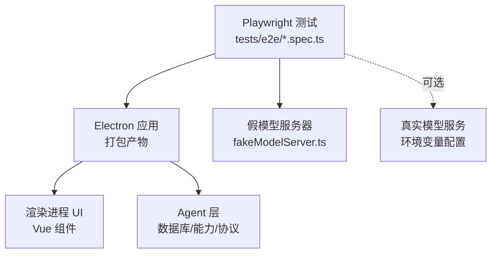
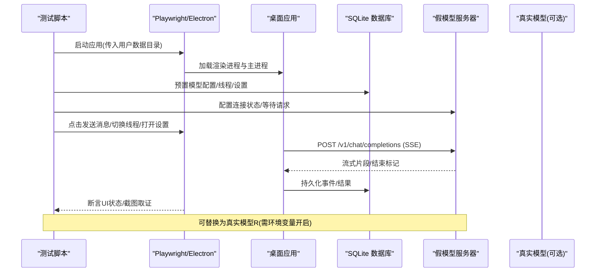
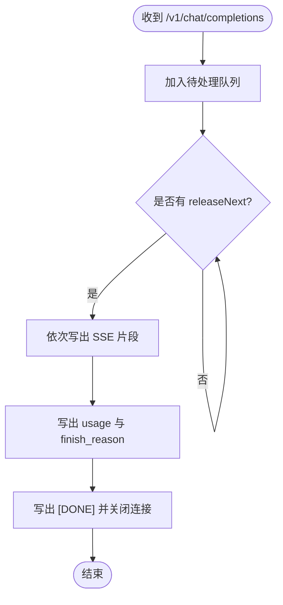
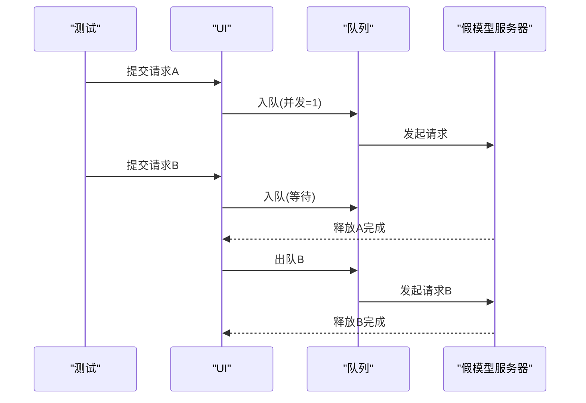
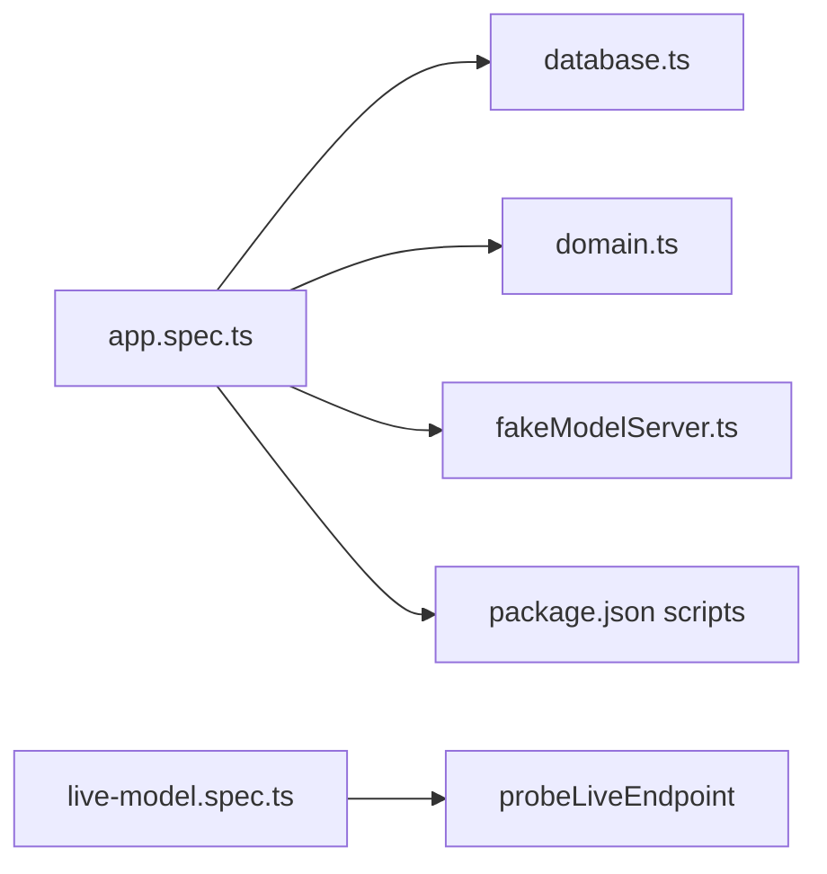

# 端到端测试

<cite>
**本文引用的文件**
- [tests/e2e/app.spec.ts](file://tests/e2e/app.spec.ts)
- [tests/e2e/fakeModelServer.ts](file://tests/e2e/fakeModelServer.ts)
- [tests/e2e/live-model.spec.ts](file://tests/e2e/live-model.spec.ts)
- [package.json](file://package.json)
- [src/agent/database.ts](file://src/agent/database.ts)
- [src/shared/domain.ts](file://src/shared/domain.ts)
</cite>

## 目录
1. [简介](#简介)
2. [项目结构](#项目结构)
3. [核心组件](#核心组件)
4. [架构总览](#架构总览)
5. [详细组件分析](#详细组件分析)
6. [依赖关系分析](#依赖关系分析)
7. [性能与稳定性考量](#性能与稳定性考量)
8. [故障排查指南](#故障排查指南)
9. [结论](#结论)
10. [附录](#附录)

## 简介
本文件面向端到端（E2E）测试，聚焦于基于 Playwright + Electron 的桌面应用自动化测试。内容涵盖：
- 浏览器与 Electron 应用的启动、页面交互模拟与用户流程测试
- 假模型服务器的实现与集成，用于稳定地模拟 AI 模型的流式响应与错误行为
- 真实模型连接的可选测试策略与环境隔离
- 测试数据准备、截图取证、并发与队列行为验证、复制与剪贴板边界处理
- 跨浏览器兼容性说明与扩展建议

## 项目结构
E2E 测试位于 tests/e2e 目录，包含：
- app.spec.ts：主用例集，覆盖设置页诊断、并发与队列、取消释放、流分离、失败脱敏、重启恢复等场景
- fakeModelServer.ts：轻量 HTTP 服务器，模拟 OpenAI 兼容接口（/v1/models、/slots、/v1/chat/completions），支持控制连接状态、延迟释放响应或返回受控错误
- live-model.spec.ts：可选的真实模型 E2E 用例，通过环境变量开关启用，探测远端可达性并执行端到端流程

运行入口在 package.json 中定义，test:e2e 会先打包应用再执行 Playwright 测试。

**图表来源**
- [tests/e2e/app.spec.ts:1-698](file://tests/e2e/app.spec.ts#L1-L698)
- [tests/e2e/fakeModelServer.ts:1-134](file://tests/e2e/fakeModelServer.ts#L1-L134)
- [tests/e2e/live-model.spec.ts:1-324](file://tests/e2e/live-model.spec.ts#L1-L324)
- [package.json:7-14](file://package.json#L7-L14)

**章节来源**
- [package.json:7-14](file://package.json#L7-L14)

## 核心组件
- 假模型服务器（FakeModelServer）
  - 提供 /v1/models、/slots、/v1/chat/completions 三个关键端点
  - 支持 setConnectionState 控制模型列表与槽位数量；releaseNext 按序释放 SSE 流片段；failNext 返回受控 HTTP 错误
  - 自动统计请求计数，便于断言并发与队列行为
- 测试夹具与辅助函数
  - createUserData/removeUserData：为每个测试创建隔离的用户数据目录，避免状态污染
  - seedWorkspace：写入 SQLite 数据库，初始化模型配置、线程与推理模式
  - launchPackagedApp/closeElectron：使用 Playwright 的 _electron API 启动打包后的 Electron 应用并管理生命周期
  - submitOnThread/selectThread/expectThreadRuntime/captureEvidence：封装常用 UI 操作与断言
- 真实模型探针
  - probeLiveEndpoint：检查远端 /models 是否可达且包含目标模型名，决定是否跳过测试

**章节来源**
- [tests/e2e/fakeModelServer.ts:1-134](file://tests/e2e/fakeModelServer.ts#L1-L134)
- [tests/e2e/app.spec.ts:519-618](file://tests/e2e/app.spec.ts#L519-L618)
- [tests/e2e/live-model.spec.ts:284-324](file://tests/e2e/live-model.spec.ts#L284-L324)

## 架构总览
E2E 测试通过 Playwright 驱动打包后的 Electron 应用，结合假模型服务器或可选的真实模型服务，完成从 UI 到后端能力的闭环验证。

**图表来源**
- [tests/e2e/app.spec.ts:76-146](file://tests/e2e/app.spec.ts#L76-L146)
- [tests/e2e/fakeModelServer.ts:23-122](file://tests/e2e/fakeModelServer.ts#L23-L122)
- [tests/e2e/live-model.spec.ts:15-108](file://tests/e2e/live-model.spec.ts#L15-L108)

## 详细组件分析

### 假模型服务器（FakeModelServer）
- 职责
  - 模拟 OpenAI 兼容接口，提供模型列表、槽位查询与聊天补全流
  - 暴露 releaseNext/failNext/setConnectionState 供测试精确控制响应时序与错误
- 关键点
  - /v1/models：返回 modelIds 列表，默认包含 task-9-fake
  - /slots：返回槽位数组，长度由 slots 控制，用于并发上限校验
  - /v1/chat/completions：接收请求后挂起，直到 releaseNext 触发，输出多条 SSE 片段，最后以 usage 和 [DONE] 结束
  - 错误注入：failNext 直接返回指定状态码与 JSON 体，便于测试错误路径
- 复杂度
  - 请求排队与释放采用 FIFO 队列，时间复杂度 O(n) 出队，空间复杂度 O(k) 待处理请求数
- 优化建议
  - 在高并发测试中，注意 pending 队列清理，避免内存泄漏
  - 对长流场景，可考虑分片大小与间隔的可配置化

**图表来源**
- [tests/e2e/fakeModelServer.ts:47-103](file://tests/e2e/fakeModelServer.ts#L47-L103)

**章节来源**
- [tests/e2e/fakeModelServer.ts:1-134](file://tests/e2e/fakeModelServer.ts#L1-L134)

### 测试夹具与数据准备
- 用户数据隔离
  - 每个测试使用 mkdtempSync 创建独立目录，并在 finally 中删除，确保无状态污染
- 数据库预置
  - 通过 openDatabase/saveModelProfile/createThread/updateSettings 构造最小可用环境
  - 支持自定义 maxConcurrency、reasoningDisplayMode、outputModes 等能力
- 应用启动
  - 使用 electron.launch 传入 PRIVATE_AI_DESKTOP_USER_DATA，指向隔离目录
- 常用操作封装
  - selectThread/submitOnThread/expectThreadRuntime 简化 UI 交互与状态断言
  - captureEvidence 生成全屏截图至 test-results/task9-evidence

**章节来源**
- [tests/e2e/app.spec.ts:519-618](file://tests/e2e/app.spec.ts#L519-L618)
- [src/agent/database.ts:38-66](file://src/agent/database.ts#L38-L66)

### 真实模型连接测试策略
- 开关与探测
  - 通过 PRIVATE_AI_LIVE_MODEL_E2E=1 启用
  - 通过 PRIVATE_AI_LIVE_MODEL_BASE_URL、PRIVATE_AI_LIVE_MODEL_NAME、PRIVATE_AI_LIVE_MODEL_API_KEY 配置
  - probeLiveEndpoint 探测 /models 可达性与模型存在性，不可达则跳过测试
- 用例设计
  - 输出限制测试：验证达到 2048 输出上限时不产生空答案，状态转为 failed 并记录错误信息
  - 思考过程与指标：验证 raw 推理面板、assistant 回答、model.metrics 事件与 UI 展示
- 环境隔离
  - 同样使用临时用户数据目录，测试结束后清理

**章节来源**
- [tests/e2e/live-model.spec.ts:1-108](file://tests/e2e/live-model.spec.ts#L1-L108)
- [tests/e2e/live-model.spec.ts:110-282](file://tests/e2e/live-model.spec.ts#L110-L282)
- [tests/e2e/live-model.spec.ts:284-324](file://tests/e2e/live-model.spec.ts#L284-L324)

### 并发与队列行为验证
- 单并发（FIFO）
  - 提交两个请求，第一个 running，第二个 queued；完成后按顺序释放
  - 断言运行时状态与队列位置
- 双并发
  - 同时提交两个请求，均进入 running；分别完成后各自状态变为 completed
- 取消释放容量
  - 取消 queued 任务仅释放一次容量；停止 running 任务后，下一个 queued 立即开始
  - 通过 server.requestCount() 与 UI 状态双重断言

**图表来源**
- [tests/e2e/app.spec.ts:148-220](file://tests/e2e/app.spec.ts#L148-L220)
- [tests/e2e/app.spec.ts:222-268](file://tests/e2e/app.spec.ts#L222-L268)

**章节来源**
- [tests/e2e/app.spec.ts:148-268](file://tests/e2e/app.spec.ts#L148-L268)

### 流分离与复制边界
- 流分离
  - 服务端依次输出 rawReasoning、summary、answer 片段，客户端分别持久化为 reasoning(raw/summary) 与 message(assistant)
  - 通过 data-testid 与属性断言确认面板类型、模式与 turnId
- 复制与剪贴板
  - 监听 copy 事件，验证选中范围属于 answer 而非 reasoning
  - 若系统剪贴板不可用，回退到 DOM 事件断言；若写剪贴板被拒绝，显示失败状态与提示

**章节来源**
- [tests/e2e/app.spec.ts:270-411](file://tests/e2e/app.spec.ts#L270-L411)

### 失败脱敏与持久化校验
- 失败脱敏
  - 当 provider 返回鉴权失败时，UI 与 SQLite 中的错误信息不得包含原始密钥或其编码变体
  - 通过 encodedSecretRepresentations 生成多种编码形式进行断言
- 持久化校验
  - 读取 SQLite items/turns 表，验证 assistant message、reasoning 条目与 turn 状态
  - 确保事件 fixture 与数据库内容一致且不泄露敏感信息

**章节来源**
- [tests/e2e/app.spec.ts:413-477](file://tests/e2e/app.spec.ts#L413-L477)
- [tests/e2e/app.spec.ts:620-698](file://tests/e2e/app.spec.ts#L620-L698)

### 重启恢复与未完成工作标记
- 预置一个 incomplete=true 的 turn，重启应用后应标记为 interrupted，且不发起新的模型请求
- 通过 expectThreadRuntime 与 server.requestCount() 断言

**章节来源**
- [tests/e2e/app.spec.ts:479-517](file://tests/e2e/app.spec.ts#L479-L517)

## 依赖关系分析
- 测试脚本依赖
  - Playwright 的 _electron API 启动打包后的 Electron 应用
  - Node 内置 fs/os/path/sqlite 进行文件系统与数据库操作
  - 应用内部模块 database.ts、domain.ts 用于数据建模与持久化
- 外部依赖
  - 假模型服务器基于 Node http 模块
  - 真实模型测试通过环境变量配置远端服务

**图表来源**
- [tests/e2e/app.spec.ts:1-16](file://tests/e2e/app.spec.ts#L1-L16)
- [tests/e2e/live-model.spec.ts:1-12](file://tests/e2e/live-model.spec.ts#L1-L12)
- [package.json:7-14](file://package.json#L7-L14)

**章节来源**
- [tests/e2e/app.spec.ts:1-16](file://tests/e2e/app.spec.ts#L1-L16)
- [tests/e2e/live-model.spec.ts:1-12](file://tests/e2e/live-model.spec.ts#L1-L12)
- [package.json:7-14](file://package.json#L7-L14)

## 性能与稳定性考量
- 超时与轮询
  - 使用 expect.poll 与合理 timeout 等待异步状态变化，避免硬编码 sleep
- 资源清理
  - 所有测试在 finally 中关闭 Electron 应用、假模型服务器与删除用户数据目录，防止端口占用与磁盘残留
- 流式响应
  - 假模型服务器按片段输出，测试需确保 releaseNext 调用时机与 UI 状态同步
- 并发压力
  - 在高并发场景下，关注 pending 队列与内存占用，必要时增加断言覆盖率

[本节为通用指导，无需具体文件引用]

## 故障排查指南
- 常见问题
  - 端口冲突：假模型服务器绑定 127.0.0.1 随机端口，若失败会抛出异常并关闭服务器
  - 未释放请求：releaseNext 前无待处理请求将抛错，需确保调用顺序
  - 剪贴板权限：某些环境禁止读写剪贴板，测试已做降级断言
- 定位步骤
  - 查看截图证据：test-results/task9-evidence 下的 PNG 文件
  - 检查数据库：只读方式打开 app.sqlite，核对 turns/items 表
  - 检查事件日志：通过 window.desktop.subscribe 捕获的事件 fixture
- 快速修复
  - 调整超时参数
  - 确保 finally 块正确清理资源
  - 检查环境变量与模型可达性

**章节来源**
- [tests/e2e/fakeModelServer.ts:58-70](file://tests/e2e/fakeModelServer.ts#L58-L70)
- [tests/e2e/app.spec.ts:615-618](file://tests/e2e/app.spec.ts#L615-L618)
- [tests/e2e/live-model.spec.ts:284-324](file://tests/e2e/live-model.spec.ts#L284-L324)

## 结论
本项目提供了完善的端到端测试体系：
- 通过假模型服务器实现稳定可控的流式响应与错误注入
- 借助 Playwright + Electron 实现对桌面应用的全链路验证
- 提供真实模型连接的可选测试路径与环境隔离
- 覆盖并发、队列、取消、流分离、复制边界、失败脱敏、重启恢复等关键场景
- 通过截图取证与数据库校验提升测试可信度

建议在后续迭代中：
- 补充跨浏览器兼容性测试（如 Chromium/Firefox/WebKit 的 Web 版对比，若存在 Web 入口）
- 引入视觉回归测试（基线图片对比）
- 增加更多边界条件与异常路径的用例

[本节为总结性内容，无需具体文件引用]

## 附录
- 运行命令
  - 执行 E2E：pnpm run test:e2e（会先打包应用再运行 Playwright）
- 环境变量（真实模型）
  - PRIVATE_AI_LIVE_MODEL_E2E=1：启用真实模型测试
  - PRIVATE_AI_LIVE_MODEL_BASE_URL：模型服务地址
  - PRIVATE_AI_LIVE_MODEL_NAME：模型名称
  - PRIVATE_AI_LIVE_MODEL_API_KEY：访问令牌
- 证据目录
  - test-results/task9-evidence：存放截图证据

**章节来源**
- [package.json:7-14](file://package.json#L7-L14)
- [tests/e2e/live-model.spec.ts:8-12](file://tests/e2e/live-model.spec.ts#L8-L12)
- [tests/e2e/app.spec.ts:18-19](file://tests/e2e/app.spec.ts#L18-L19)