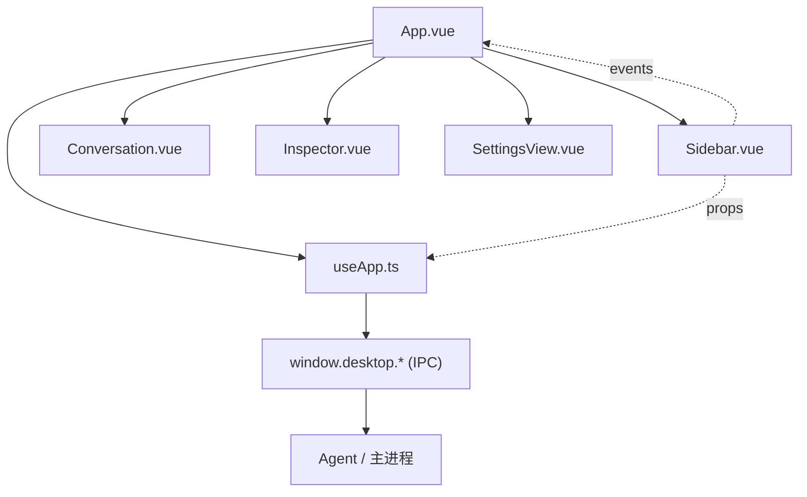
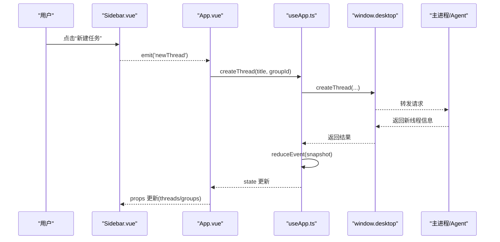
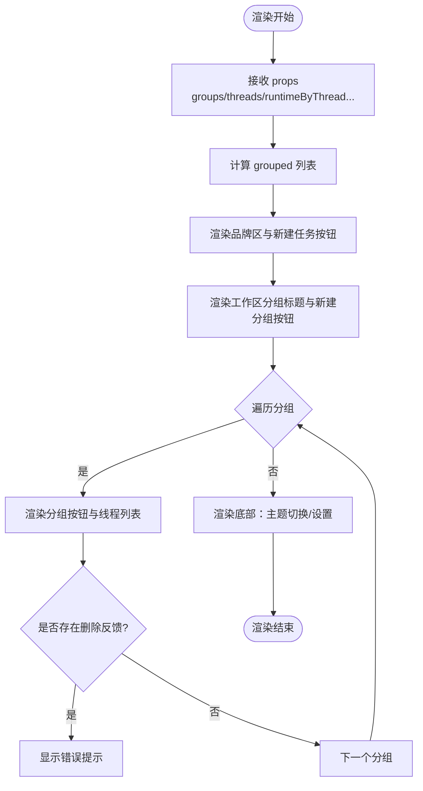
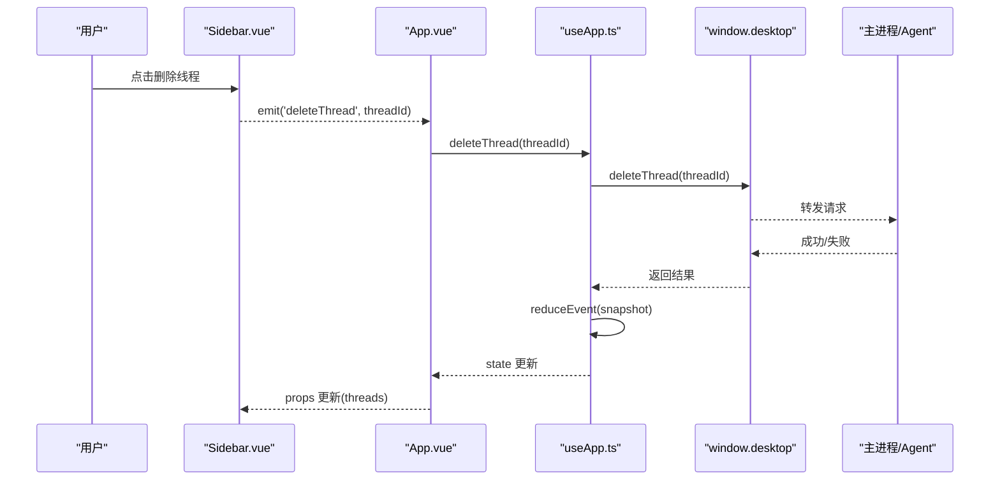
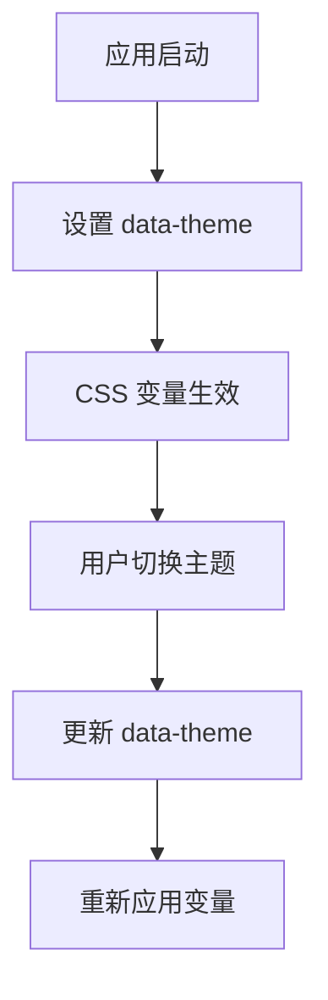
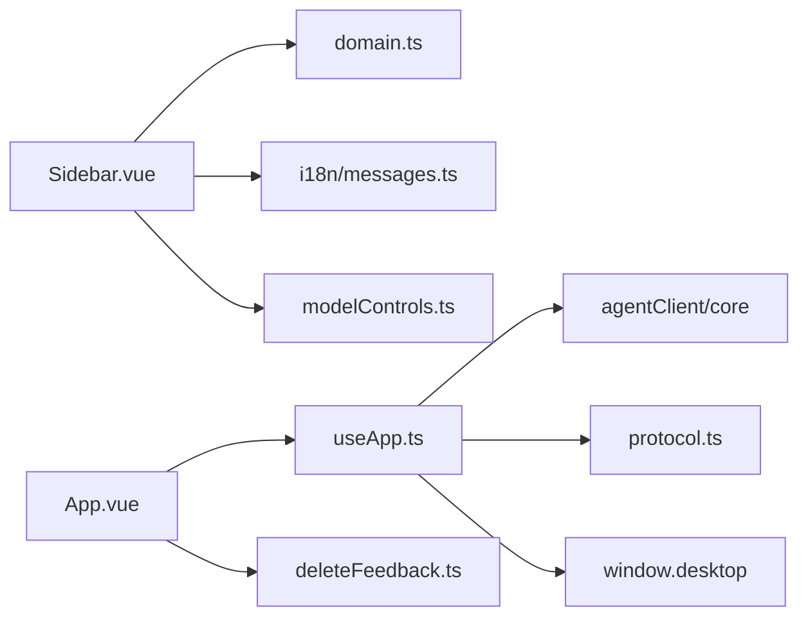

# 侧边栏导航组件

<cite>
**本文引用的文件**
- [Sidebar.vue](file://src/renderer/components/Sidebar.vue)
- [App.vue](file://src/renderer/App.vue)
- [useApp.ts](file://src/renderer/composables/useApp.ts)
- [domain.ts](file://src/shared/domain.ts)
- [protocol.ts](file://src/shared/protocol.ts)
- [theme.css](file://src/renderer/styles/theme.css)
- [app.css](file://src/renderer/styles/app.css)
- [messages.ts](file://src/renderer/i18n/messages.ts)
- [deleteFeedback.ts](file://src/renderer/deleteFeedback.ts)
- [operationErrors.ts](file://src/shared/operationErrors.ts)
</cite>

## 目录
1. [简介](#简介)
2. [项目结构](#项目结构)
3. [核心组件](#核心组件)
4. [架构总览](#架构总览)
5. [详细组件分析](#详细组件分析)
6. [依赖关系分析](#依赖关系分析)
7. [性能考量](#性能考量)
8. [故障排查指南](#故障排查指南)
9. [结论](#结论)
10. [附录](#附录)

## 简介
本文件为“侧边栏导航组件”的完整技术文档，聚焦 Sidebar.vue 在应用中的导航职责：会话列表展示、分组管理、线程切换与状态同步。文档同时覆盖数据模型、CRUD 操作、事件协议、主题与样式定制、以及无障碍访问等要点。需要特别说明的是，当前代码库未实现搜索过滤与键盘导航；批量删除功能亦未内置。这些内容在文档中会明确标注为“未实现”，并提供扩展建议。

## 项目结构
侧边栏位于渲染进程（Vue 应用）中，通过 props 接收来自父组件 App.vue 的数据，并通过事件向父组件回传用户操作。状态管理与 IPC 通信由 useApp 组合式函数负责，数据模型与协议定义在 shared 目录中。

图表来源
- [App.vue:124-144](file://src/renderer/App.vue#L124-L144)
- [useApp.ts:144-158](file://src/renderer/composables/useApp.ts#L144-L158)

章节来源
- [App.vue:124-144](file://src/renderer/App.vue#L124-L144)
- [Sidebar.vue:1-130](file://src/renderer/components/Sidebar.vue#L1-L130)
- [useApp.ts:144-158](file://src/renderer/composables/useApp.ts#L144-L158)

## 核心组件
- Sidebar.vue：纯展示型导航组件，负责渲染品牌区、新建任务按钮、工作区分组与线程列表、删除反馈提示、底部主题切换与设置入口。
- App.vue：容器组件，负责将全局状态与本地 UI 状态（如主题）绑定到 Sidebar，并处理用户交互（新建/选择/删除）。
- useApp.ts：客户端状态机与 IPC 协调器，提供创建/删除分组与线程、启动对话轮次、取消轮次、更新设置等能力，并维护 runtimeByThread 等运行时状态。
- domain.ts：共享类型定义，包括 ChatGroup、ThreadSummary、ThreadRuntimeState、TurnStatus 等。
- protocol.ts：桌面端请求/事件协议，定义了 group/thread/turn 等操作的消息类型与校验守卫。
- theme.css 与 app.css：主题变量与布局样式，支撑暗色/亮色主题与三栏布局。
- messages.ts：国际化文案，用于界面文本与错误提示。
- deleteFeedback.ts：删除失败时的反馈构造逻辑，区分“活动会话/分组”的特殊提示。
- operationErrors.ts：服务端返回的错误常量，用于前端判断是否因“活动会话”导致删除失败。

章节来源
- [Sidebar.vue:1-130](file://src/renderer/components/Sidebar.vue#L1-L130)
- [App.vue:12-49](file://src/renderer/App.vue#L12-L49)
- [useApp.ts:164-187](file://src/renderer/composables/useApp.ts#L164-L187)
- [domain.ts:7-22](file://src/shared/domain.ts#L7-L22)
- [protocol.ts:22-39](file://src/shared/protocol.ts#L22-L39)
- [theme.css:1-38](file://src/renderer/styles/theme.css#L1-L38)
- [app.css:25-52](file://src/renderer/styles/app.css#L25-L52)
- [messages.ts:1-373](file://src/renderer/i18n/messages.ts#L1-L373)
- [deleteFeedback.ts:1-34](file://src/renderer/deleteFeedback.ts#L1-L34)
- [operationErrors.ts:1-6](file://src/shared/operationErrors.ts#L1-L6)

## 架构总览
侧边栏作为视图层，不直接持有业务状态，而是通过 props 读取快照数据，通过事件触发上层逻辑。App.vue 将 Sidebar 的事件映射到 useApp 的方法，后者通过 window.desktop 调用主进程能力，并在成功后拉取最新快照以驱动视图更新。

图表来源
- [Sidebar.vue:61-64](file://src/renderer/components/Sidebar.vue#L61-L64)
- [App.vue:31-35](file://src/renderer/App.vue#L31-L35)
- [useApp.ts:176-182](file://src/renderer/composables/useApp.ts#L176-L182)
- [protocol.ts:22-39](file://src/shared/protocol.ts#L22-L39)

章节来源
- [Sidebar.vue:61-64](file://src/renderer/components/Sidebar.vue#L61-L64)
- [App.vue:31-49](file://src/renderer/App.vue#L31-L49)
- [useApp.ts:176-187](file://src/renderer/composables/useApp.ts#L176-L187)
- [protocol.ts:22-39](file://src/shared/protocol.ts#L22-L39)

## 详细组件分析

### Sidebar.vue 组件分析
- 输入属性
  - groups: ChatGroup[]，分组列表
  - threads: ThreadSummary[]，线程摘要列表
  - activeThreadId?: string，当前激活线程 ID
  - activeGroupId?: string，当前激活分组 ID
  - runtimeByThread: Record<string, ThreadRuntimeState>，按线程的运行时状态
  - deleteFeedback?: DeleteFeedback，删除操作的反馈消息
  - loading: boolean，加载态
  - theme: 'light' | 'dark'，当前主题
  - t: Translator，翻译函数
- 输出事件
  - newThread、newGroup、selectThread、selectGroup、deleteThread、deleteGroup、toggleTheme、openSettings
- 计算属性
  - groupsWithThreads：将 threads 按 groupId 聚合到对应分组下，便于分组渲染
- 运行时状态展示
  - runtimeText：根据 ThreadRuntimeState 与 ThreadSummary.status 生成可读文本，支持队列位置占位替换
  - runtimeActive：判断线程是否处于活跃运行态
- 模板结构
  - 品牌区：AI 标识与应用名称/副标题
  - 主要动作：新建任务按钮
  - 工作区导航：分组标题 + 新建分组按钮；每个分组内显示分组名与线程数量；选中高亮
  - 线程列表：线程标题、状态指示点、状态文本、删除按钮；删除失败时显示错误提示
  - 空态：无任务时的提示
  - 底部：主题切换按钮、设置入口

图表来源
- [Sidebar.vue:31-48](file://src/renderer/components/Sidebar.vue#L31-L48)
- [Sidebar.vue:51-129](file://src/renderer/components/Sidebar.vue#L51-L129)

章节来源
- [Sidebar.vue:1-130](file://src/renderer/components/Sidebar.vue#L1-L130)

### 会话数据结构与组织
- ChatGroup：分组实体，包含 id、name、createdAt、updatedAt
- ThreadSummary：线程摘要，包含 id、groupId、title、status、modelProfileId、createdAt、updatedAt
- ThreadRuntimeState：线程运行时状态，包含 threadId、turnId、modelProfileId、status、queuePosition、startedAt、firstTokenAt、completedAt、tokensPerSecond、error
- TurnStatus：会话轮次状态枚举，包括 idle、queued、running、cancelling、completed、failed、cancelled、interrupted

这些数据在 Sidebar 中以分组聚合方式呈现，并按运行时状态动态展示“排队中”、“运行中”等提示。

章节来源
- [domain.ts:7-22](file://src/shared/domain.ts#L7-L22)
- [domain.ts:107-115](file://src/shared/domain.ts#L107-L115)
- [domain.ts:307-318](file://src/shared/domain.ts#L307-L318)

### CRUD 操作与状态同步机制
- 新建分组：App.vue 调用 useApp.createGroup，成功后刷新快照并设置 activeGroupId
- 删除分组：App.vue 调用 useApp.deleteGroup，成功后刷新快照
- 新建线程：App.vue 调用 useApp.createThread，成功后刷新快照并自动选中新线程
- 删除线程：App.vue 调用 useApp.deleteThread，成功后刷新快照
- 状态同步：useApp 通过 startInitialAgentSync 订阅 Agent 事件，合并快照与增量事件，最终写入 state.value，驱动 Sidebar 重新渲染

图表来源
- [App.vue:61-83](file://src/renderer/App.vue#L61-L83)
- [useApp.ts:184-187](file://src/renderer/composables/useApp.ts#L184-L187)
- [protocol.ts:22-39](file://src/shared/protocol.ts#L22-L39)

章节来源
- [App.vue:61-83](file://src/renderer/App.vue#L61-L83)
- [useApp.ts:164-187](file://src/renderer/composables/useApp.ts#L164-L187)
- [protocol.ts:22-39](file://src/shared/protocol.ts#L22-L39)

### 线程切换与分组选择
- selectThread：App.vue 设置 activeThreadId，并尝试将 activeGroupId 设置为该线程所属分组
- selectGroup：App.vue 设置 activeGroupId，并尝试将 activeThreadId 设置为该分组下的第一个线程
- Sidebar 通过 @select-thread 与 @select-group 事件触发上述逻辑

章节来源
- [App.vue:37-49](file://src/renderer/App.vue#L37-L49)
- [Sidebar.vue:72-81](file://src/renderer/components/Sidebar.vue#L72-L81)
- [Sidebar.vue:96-107](file://src/renderer/components/Sidebar.vue#L96-L107)

### 搜索过滤与键盘导航
- 搜索过滤：当前代码库未在 Sidebar 或相关组件中实现搜索过滤功能
- 键盘导航：当前代码库未在 Sidebar 中实现键盘导航（如 Tab/Enter/方向键）
- 无障碍访问：已使用 aria-label、role="status"、aria-hidden 等基础无障碍标记；但缺少焦点管理与键盘交互

章节来源
- [Sidebar.vue:52-129](file://src/renderer/components/Sidebar.vue#L52-L129)

### 会话重命名、删除确认与批量操作
- 会话重命名：当前代码库未提供会话重命名功能
- 删除确认：App.vue 在删除线程/分组前使用 window.confirm 进行确认
- 批量操作：当前代码库未提供批量删除或批量选择功能

章节来源
- [App.vue:61-83](file://src/renderer/App.vue#L61-L83)

### 与主应用的通信协议与状态管理模式
- 协议：DesktopRequest 定义了 group/thread/turn/settings 等操作；AgentEvent 定义了 snapshot 与序列化的增量事件
- 状态管理：useApp 通过 startInitialAgentSync 初始化并订阅事件，使用 reduceEvent 将事件归约到 state，保证一致性
- IPC：通过 window.desktop 暴露的方法与主进程交互，如 getSnapshot、subscribe、createThread、deleteThread 等

章节来源
- [protocol.ts:22-65](file://src/shared/protocol.ts#L22-L65)
- [useApp.ts:45-97](file://src/renderer/composables/useApp.ts#L45-L97)
- [useApp.ts:144-158](file://src/renderer/composables/useApp.ts#L144-L158)

### 自定义样式与主题定制指南
- 主题变量：theme.css 定义 :root 与 [data-theme='light'] 两套 CSS 变量，控制背景、面板、边框、文字、强调色等
- 布局与组件样式：app.css 定义三栏网格布局、侧边栏样式、按钮样式、滚动区域等
- 主题切换：App.vue 通过 document.documentElement.dataset.theme 切换主题，Sidebar 仅透传 theme 值

图表来源
- [theme.css:1-38](file://src/renderer/styles/theme.css#L1-L38)
- [App.vue:27-29](file://src/renderer/App.vue#L27-L29)
- [App.vue:85-88](file://src/renderer/App.vue#L85-L88)

章节来源
- [theme.css:1-38](file://src/renderer/styles/theme.css#L1-L38)
- [app.css:25-52](file://src/renderer/styles/app.css#L25-L52)
- [App.vue:27-29](file://src/renderer/App.vue#L27-L29)
- [App.vue:85-88](file://src/renderer/App.vue#L85-L88)

## 依赖关系分析
- Sidebar.vue 依赖：
  - 类型：ChatGroup、ThreadSummary、ThreadRuntimeState（domain.ts）
  - 工具：threadRuntimePresentation（modelControls），t（i18n）
  - 事件：由 App.vue 监听并处理
- App.vue 依赖：
  - useApp：状态与 IPC 封装
  - i18n：翻译函数
  - deleteFeedback：删除失败反馈
- useApp.ts 依赖：
  - agentClient/core：事件归约与状态操作
  - domain.ts：类型定义
  - protocol.ts：事件类型
  - window.desktop：IPC 接口

图表来源
- [Sidebar.vue:1-18](file://src/renderer/components/Sidebar.vue#L1-L18)
- [App.vue:1-11](file://src/renderer/App.vue#L1-L11)
- [useApp.ts:1-26](file://src/renderer/composables/useApp.ts#L1-L26)

章节来源
- [Sidebar.vue:1-18](file://src/renderer/components/Sidebar.vue#L1-L18)
- [App.vue:1-11](file://src/renderer/App.vue#L1-L11)
- [useApp.ts:1-26](file://src/renderer/composables/useApp.ts#L1-L26)

## 性能考量
- 分组聚合：groupsWithThreads 使用 computed 缓存，避免重复过滤
- 运行时状态：runtimeText/runtimeActive 基于 ThreadRuntimeState 快速计算，减少模板复杂度
- 事件订阅：startInitialAgentSync 缓冲初始事件，减少闪烁与重复渲染
- 主题切换：通过 CSS 变量切换，避免重绘大量 DOM

[本节为通用性能讨论，无需特定文件引用]

## 故障排查指南
- 删除失败反馈：deleteFeedback.ts 根据错误消息判断是否为“活动会话/分组”导致的删除失败，并返回对应的国际化提示
- 活动会话限制：operationErrors.ts 定义了活动会话/分组的删除错误常量，用于前端识别
- 运行时错误：App.vue 捕获 startTurn/updateModelRuntime 等异步操作的错误，并设置 runtimeError 或 approvalError

章节来源
- [deleteFeedback.ts:1-34](file://src/renderer/deleteFeedback.ts#L1-L34)
- [operationErrors.ts:1-6](file://src/shared/operationErrors.ts#L1-L6)
- [App.vue:94-121](file://src/renderer/App.vue#L94-L121)

## 结论
Sidebar.vue 作为轻量级导航组件，专注于会话与分组的展示与基本交互，所有业务逻辑与状态管理交由 App.vue 与 useApp.ts 处理。当前版本未实现搜索过滤、键盘导航、会话重命名与批量操作。主题与样式通过 CSS 变量与布局类名统一管理，具备良好的可定制性。无障碍方面已具备基础标记，后续可扩展焦点管理与键盘交互以提升可访问性。

[本节为总结性内容，无需特定文件引用]

## 附录
- 未实现功能清单与建议
  - 搜索过滤：可在 Sidebar 中增加搜索框，对 threads 进行模糊匹配过滤，并缓存搜索结果
  - 键盘导航：为分组与线程项添加 tabindex、focus 样式与 Enter/Space 选择行为
  - 会话重命名：在分组或线程行内提供编辑入口，调用后端 API 更新 title
  - 批量操作：增加多选模式，支持批量删除或移动分组

[本节为概念性内容，无需特定文件引用]