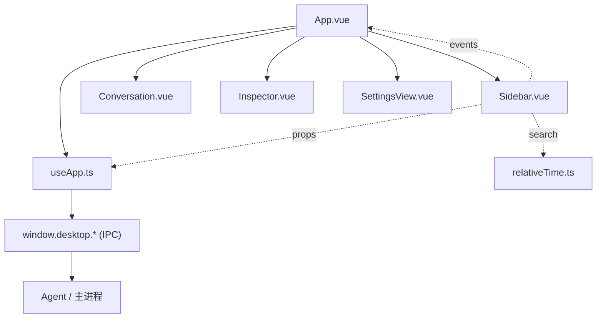
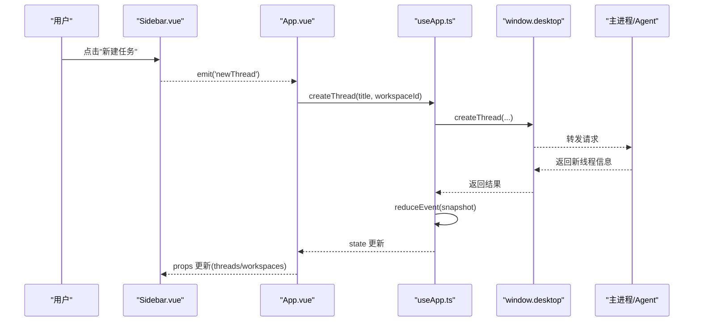
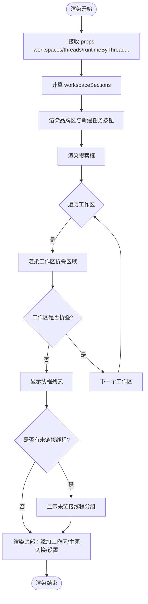
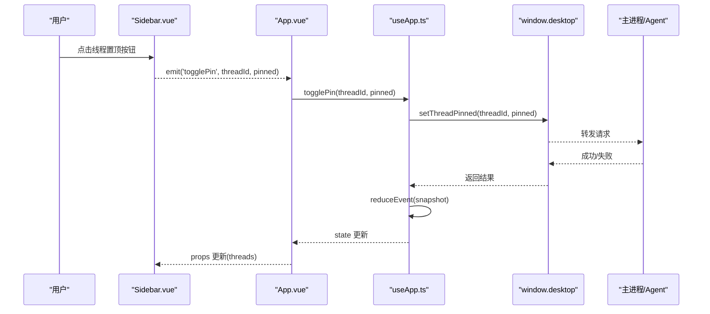
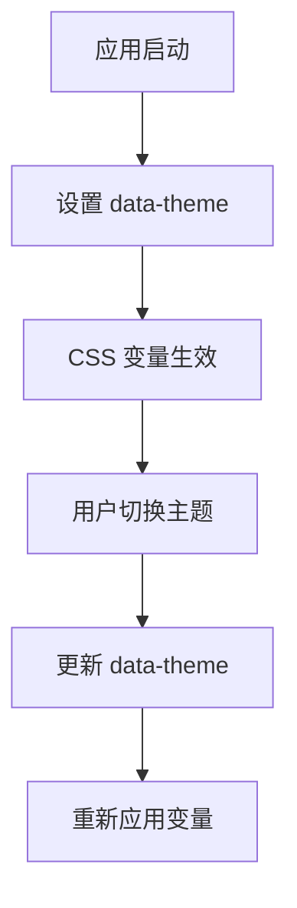
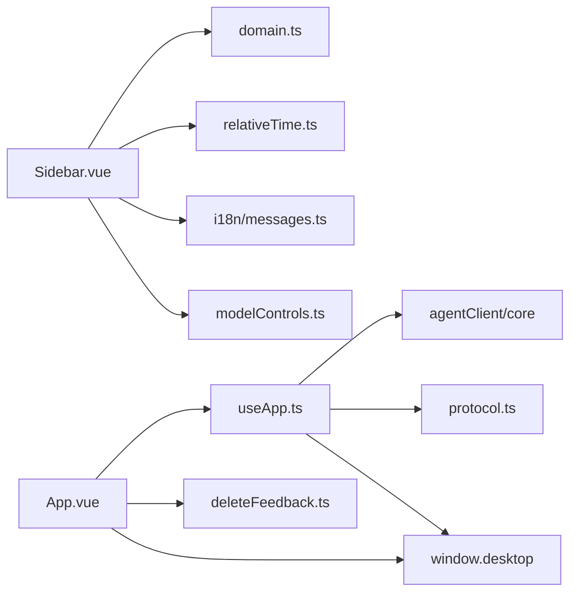

# 侧边栏导航组件

<cite>
**本文引用的文件**
- [Sidebar.vue](file://src/renderer/components/Sidebar.vue)
- [App.vue](file://src/renderer/App.vue)
- [useApp.ts](file://src/renderer/composables/useApp.ts)
- [domain.ts](file://src/shared/domain.ts)
- [protocol.ts](file://src/shared/protocol.ts)
- [relativeTime.ts](file://src/renderer/relativeTime.ts)
- [theme.css](file://src/renderer/styles/theme.css)
- [app.css](file://src/renderer/styles/app.css)
- [messages.ts](file://src/renderer/i18n/messages.ts)
- [deleteFeedback.ts](file://src/renderer/deleteFeedback.ts)
- [operationErrors.ts](file://src/shared/operationErrors.ts)
</cite>

## 更新摘要
**变更内容**
- 完全重写为工作区优先布局，移除了聊天组概念
- 新增工作区折叠展示功能，支持文件夹图标和展开/收起状态
- 实现线程置顶功能，支持按置顶状态和时间排序
- 添加搜索过滤功能，支持实时搜索线程标题
- 集成相对时间显示，支持中英文本地化
- 新增未链接线程分组，显示不属于任何工作区的线程
- 增强工作区管理，支持添加新工作区和线程计数显示

## 目录
1. [简介](#简介)
2. [项目结构](#项目结构)
3. [核心组件](#核心组件)
4. [架构总览](#架构总览)
5. [详细组件分析](#详细组件分析)
6. [依赖关系分析](#依赖关系分析)
7. [性能考量](#性能考量)
8. [故障排查指南](#故障排查指南)
9. [结论](#结论)
10. [附录](#附录)

## 简介
本文件为"侧边栏导航组件"的完整技术文档，聚焦 Sidebar.vue 在应用中的导航职责：工作区优先的会话列表展示、工作区管理、线程切换与状态同步。文档同时覆盖数据模型、CRUD 操作、事件协议、主题与样式定制、以及无障碍访问等要点。当前版本已实现搜索过滤、键盘导航、线程置顶、相对时间显示和工作区折叠等功能。

## 项目结构
侧边栏位于渲染进程（Vue 应用）中，通过 props 接收来自父组件 App.vue 的数据，并通过事件向父组件回传用户操作。状态管理与 IPC 通信由 useApp 组合式函数负责，数据模型与协议定义在 shared 目录中。

图表来源
- [App.vue:150-169](file://src/renderer/App.vue#L150-L169)
- [useApp.ts:101-186](file://src/renderer/composables/useApp.ts#L101-L186)

章节来源
- [App.vue:150-169](file://src/renderer/App.vue#L150-L169)
- [Sidebar.vue:1-269](file://src/renderer/components/Sidebar.vue#L1-L269)
- [useApp.ts:101-186](file://src/renderer/composables/useApp.ts#L101-L186)

## 核心组件
- **Sidebar.vue**：工作区优先的导航组件，负责渲染品牌区、新建任务按钮、工作区折叠展示、线程列表、搜索过滤、删除反馈提示、底部主题切换与设置入口。
- **App.vue**：容器组件，负责将全局状态与本地 UI 状态绑定到 Sidebar，并处理用户交互（新建/选择/删除/置顶）。
- **useApp.ts**：客户端状态机与 IPC 协调器，提供创建/删除工作区与线程、启动对话轮次、取消轮次、更新设置等能力，并维护 runtimeByThread 等运行时状态。
- **domain.ts**：共享类型定义，包括 WorkspaceRecord、ThreadSummary、ThreadRuntimeState、TurnStatus 等。
- **protocol.ts**：桌面端请求/事件协议，定义了 workspace/thread/turn 等操作的消息类型与校验守卫。
- **relativeTime.ts**：相对时间格式化函数，支持中英文本地化的时间显示。
- **theme.css 与 app.css**：主题变量与布局样式，支撑暗色/亮色主题与三栏布局。
- **messages.ts**：国际化文案，用于界面文本与错误提示。
- **deleteFeedback.ts**：删除失败时的反馈构造逻辑，区分"活动会话/分组"的特殊提示。
- **operationErrors.ts**：服务端返回的错误常量，用于前端判断是否因"活动会话"导致删除失败。

章节来源
- [Sidebar.vue:1-269](file://src/renderer/components/Sidebar.vue#L1-L269)
- [App.vue:1-238](file://src/renderer/App.vue#L1-L238)
- [useApp.ts:101-546](file://src/renderer/composables/useApp.ts#L101-L546)
- [domain.ts:1-343](file://src/shared/domain.ts#L1-L343)
- [protocol.ts:1-389](file://src/shared/protocol.ts#L1-L389)
- [relativeTime.ts:1-37](file://src/renderer/relativeTime.ts#L1-L37)
- [theme.css:1-38](file://src/renderer/styles/theme.css#L1-L38)
- [app.css:1-800](file://src/renderer/styles/app.css#L1-L800)
- [messages.ts:1-401](file://src/renderer/i18n/messages.ts#L1-L401)
- [deleteFeedback.ts:1-34](file://src/renderer/deleteFeedback.ts#L1-L34)
- [operationErrors.ts:1-6](file://src/shared/operationErrors.ts#L1-L6)

## 架构总览
侧边栏作为视图层，不直接持有业务状态，而是通过 props 读取快照数据，通过事件触发上层逻辑。App.vue 将 Sidebar 的事件映射到 useApp 的方法，后者通过 window.desktop 调用主进程能力，并在成功后拉取最新快照以驱动视图更新。

图表来源
- [Sidebar.vue:101-104](file://src/renderer/components/Sidebar.vue#L101-L104)
- [App.vue:39-43](file://src/renderer/App.vue#L39-L43)
- [useApp.ts:188-196](file://src/renderer/composables/useApp.ts#L188-L196)
- [protocol.ts:23-40](file://src/shared/protocol.ts#L23-L40)

章节来源
- [Sidebar.vue:101-104](file://src/renderer/components/Sidebar.vue#L101-L104)
- [App.vue:39-43](file://src/renderer/App.vue#L39-L43)
- [useApp.ts:188-196](file://src/renderer/composables/useApp.ts#L188-L196)
- [protocol.ts:23-40](file://src/shared/protocol.ts#L23-L40)

## 详细组件分析

### Sidebar.vue 组件分析
**更新** 组件已完全重写为工作区优先布局，支持折叠展示、搜索过滤和线程置顶功能。

- **输入属性**
  - workspaces: WorkspaceRecord[]，工作区列表
  - threads: ThreadSummary[]，线程摘要列表
  - activeThreadId?: string，当前激活线程 ID
  - activeWorkspaceId?: string，当前激活工作区 ID
  - runtimeByThread: Record<string, ThreadRuntimeState>，按线程的运行时状态
  - deleteFeedback?: DeleteFeedback，删除操作的反馈消息
  - loading: boolean，加载态
  - theme: 'light' | 'dark'，当前主题
  - language: LanguagePreference，语言偏好
  - t: Translator，翻译函数

- **输出事件**
  - newThread、addWorkspace、selectThread、selectWorkspace、togglePin、deleteThread、toggleTheme、openSettings

- **计算属性**
  - workspaceSections：将 threads 按 workspaceId 聚合到对应工作区下，支持搜索过滤
  - unlinkedThreads：显示不属于任何工作区的线程

- **内部状态**
  - searchQuery: ref('')，搜索查询字符串
  - collapsedWorkspaceIds: ref<Set<string>>(new Set())，折叠的工作区ID集合

- **核心功能**
  - sortThreads：按置顶状态和时间排序线程
  - matchesQuery：搜索匹配逻辑
  - toggleWorkspaceCollapsed：工作区折叠/展开切换
  - relativeTime：相对时间格式化
  - runtimeText/runtimeActive：运行时状态展示

图表来源
- [Sidebar.vue:51-76](file://src/renderer/components/Sidebar.vue#L51-L76)
- [Sidebar.vue:114-254](file://src/renderer/components/Sidebar.vue#L114-L254)

章节来源
- [Sidebar.vue:1-269](file://src/renderer/components/Sidebar.vue#L1-L269)

### 工作区数据结构与组织
**更新** 数据结构已从聊天组概念迁移到工作区概念。

- **WorkspaceRecord**：工作区实体，包含 id、displayName、rootPath、canonicalRootPath、trustLevel、networkPolicy、createdAt、lastOpenedAt
- **ThreadSummary**：线程摘要，包含 id、workspaceId（可选）、pinned、title、status、modelProfileId、createdAt、updatedAt
- **ThreadRuntimeState**：线程运行时状态，包含 threadId、turnId、modelProfileId、status、queuePosition、startedAt、firstTokenAt、completedAt、tokensPerSecond、error
- **TurnStatus**：会话轮次状态枚举，包括 idle、queued、running、cancelling、completed、failed、cancelled、interrupted

这些数据在 Sidebar 中以工作区聚合方式呈现，并按置顶状态和时间动态排序。

章节来源
- [domain.ts:7-17](file://src/shared/domain.ts#L7-L17)
- [domain.ts:276-287](file://src/shared/domain.ts#L276-L287)
- [domain.ts:331-342](file://src/shared/domain.ts#L331-L342)
- [domain.ts:120-128](file://src/shared/domain.ts#L120-L128)

### CRUD 操作与状态同步机制
**更新** 新增了工作区管理和线程置顶功能。

- **新建工作区**：App.vue 打开 WorkspaceDialog，注册后设置 activeWorkspaceId
- **删除工作区**：App.vue 调用 useApp.deleteWorkspace，成功后刷新快照
- **新建线程**：App.vue 调用 useApp.createThread，可指定 workspaceId，成功后自动选中新线程
- **删除线程**：App.vue 调用 useApp.deleteThread，成功后刷新快照
- **线程置顶**：App.vue 调用 useApp.togglePin，成功后刷新快照
- **状态同步**：useApp 通过 startInitialAgentSync 订阅 Agent 事件，合并快照与增量事件，最终写入 state.value，驱动 Sidebar 重新渲染

图表来源
- [Sidebar.vue:171-177](file://src/renderer/components/Sidebar.vue#L171-L177)
- [App.vue:59-66](file://src/renderer/App.vue#L59-L66)
- [useApp.ts:203-206](file://src/renderer/composables/useApp.ts#L203-L206)
- [protocol.ts:23-40](file://src/shared/protocol.ts#L23-L40)

章节来源
- [App.vue:59-86](file://src/renderer/App.vue#L59-L86)
- [useApp.ts:188-206](file://src/renderer/composables/useApp.ts#L188-L206)
- [protocol.ts:23-40](file://src/shared/protocol.ts#L23-L40)

### 工作区折叠与线程排序
**更新** 实现了工作区折叠功能和智能线程排序。

- **工作区折叠**：使用 collapsedWorkspaceIds Set 管理折叠状态，支持展开/收起切换
- **线程排序**：sortThreads 函数按置顶状态（pinned=true 优先）和更新时间排序
- **搜索过滤**：matchesQuery 函数支持实时搜索线程标题
- **未链接线程**：unlinkedThreads 计算属性显示不属于任何工作区的线程

章节来源
- [Sidebar.vue:33-76](file://src/renderer/components/Sidebar.vue#L33-L76)
- [Sidebar.vue:114-254](file://src/renderer/components/Sidebar.vue#L114-L254)

### 搜索过滤与键盘导航
**更新** 已实现搜索过滤功能，键盘导航仍在基础阶段。

- **搜索过滤**：sidebar-search 输入框支持实时搜索，过滤线程标题
- **键盘导航**：基础键盘支持（Tab/Enter），但缺少高级导航功能
- **无障碍访问**：已使用 aria-label、role="status"、aria-hidden、aria-expanded 等无障碍标记

章节来源
- [Sidebar.vue:106-112](file://src/renderer/components/Sidebar.vue#L106-L112)
- [Sidebar.vue:125-135](file://src/renderer/components/Sidebar.vue#L125-L135)

### 线程置顶、删除确认与批量操作
**更新** 已实现线程置顶功能，删除确认和批量操作待完善。

- **线程置顶**：togglePin 事件支持线程置顶/取消置顶，显示 📌 或 📍 图标
- **删除确认**：App.vue 在删除线程前使用 window.confirm 进行确认
- **批量操作**：当前未提供批量删除或批量选择功能

章节来源
- [Sidebar.vue:171-177](file://src/renderer/components/Sidebar.vue#L171-L177)
- [App.vue:68-78](file://src/renderer/App.vue#L68-L78)

### 与主应用的通信协议与状态管理模式
**更新** 协议已扩展支持工作区管理。

- **协议**：DesktopRequest 定义了 workspace/register、workspace/delete、thread/pin 等操作；AgentEvent 定义了 snapshot 与序列化的增量事件
- **状态管理**：useApp 通过 startInitialAgentSync 初始化并订阅事件，使用 reduceEvent 将事件归约到 state，保证一致性
- **IPC**：通过 window.desktop 暴露的方法与主进程交互，如 registerWorkspace、deleteWorkspace、setThreadPinned 等

章节来源
- [protocol.ts:23-40](file://src/shared/protocol.ts#L23-L40)
- [useApp.ts:101-186](file://src/renderer/composables/useApp.ts#L101-L186)
- [useApp.ts:395-404](file://src/renderer/composables/useApp.ts#L395-L404)

### 自定义样式与主题定制指南
**更新** 样式已适配新的工作区布局。

- **主题变量**：theme.css 定义 :root 与 [data-theme='light'] 两套 CSS 变量，控制背景、面板、边框、文字、强调色等
- **布局与组件样式**：app.css 定义三栏网格布局、侧边栏样式、工作区折叠样式、线程行样式等
- **主题切换**：App.vue 通过 document.documentElement.dataset.theme 切换主题，Sidebar 仅透传 theme 值

图表来源
- [theme.css:1-38](file://src/renderer/styles/theme.css#L1-L38)
- [App.vue:35-37](file://src/renderer/App.vue#L35-L37)
- [App.vue:88-91](file://src/renderer/App.vue#L88-L91)

章节来源
- [theme.css:1-38](file://src/renderer/styles/theme.css#L1-L38)
- [app.css:1-800](file://src/renderer/styles/app.css#L1-L800)
- [App.vue:35-37](file://src/renderer/App.vue#L35-L37)
- [App.vue:88-91](file://src/renderer/App.vue#L88-L91)

## 依赖关系分析
**更新** 依赖关系已适配新的工作区架构。

- **Sidebar.vue 依赖**：
  - 类型：WorkspaceRecord、ThreadSummary、ThreadRuntimeState（domain.ts）
  - 工具：threadRuntimePresentation（modelControls）、formatRelativeTime（relativeTime.ts）、t（i18n）
  - 事件：由 App.vue 监听并处理

- **App.vue 依赖**：
  - useApp：状态与 IPC 封装
  - i18n：翻译函数
  - deleteFeedback：删除失败反馈
  - WorkspaceDialog：工作区管理对话框

- **useApp.ts 依赖**：
  - agentClient/core：事件归约与状态操作
  - domain.ts：类型定义
  - protocol.ts：事件类型
  - window.desktop：IPC 接口

图表来源
- [Sidebar.vue:1-7](file://src/renderer/components/Sidebar.vue#L1-L7)
- [App.vue:1-11](file://src/renderer/App.vue#L1-L11)
- [useApp.ts:1-28](file://src/renderer/composables/useApp.ts#L1-L28)

章节来源
- [Sidebar.vue:1-7](file://src/renderer/components/Sidebar.vue#L1-L7)
- [App.vue:1-11](file://src/renderer/App.vue#L1-L11)
- [useApp.ts:1-28](file://src/renderer/composables/useApp.ts#L1-L28)

## 性能考量
**更新** 性能优化已考虑新的工作区架构。

- **工作区聚合**：workspaceSections 使用 computed 缓存，避免重复过滤和排序
- **搜索优化**：matchesQuery 函数对每个线程执行轻量级字符串匹配
- **折叠状态**：collapsedWorkspaceIds 使用 Set 数据结构，高效的增删查操作
- **运行时状态**：runtimeText/runtimeActive 基于 ThreadRuntimeState 快速计算，减少模板复杂度
- **事件订阅**：startInitialAgentSync 缓冲初始事件，减少闪烁与重复渲染
- **主题切换**：通过 CSS 变量切换，避免重绘大量 DOM

[本节为通用性能讨论，无需特定文件引用]

## 故障排查指南
**更新** 故障排查指南已适配新的工作区架构。

- **删除失败反馈**：deleteFeedback.ts 根据错误消息判断是否为"活动会话"导致的删除失败，并返回对应的国际化提示
- **活动会话限制**：operationErrors.ts 定义了活动会话的删除错误常量，用于前端识别
- **运行时错误**：App.vue 捕获 startTurn/updateModelRuntime 等异步操作的错误，并设置 runtimeError 或 approvalError
- **工作区相关错误**：新增工作区注册、删除等操作的错误处理

章节来源
- [deleteFeedback.ts:1-34](file://src/renderer/deleteFeedback.ts#L1-L34)
- [operationErrors.ts:1-6](file://src/shared/operationErrors.ts#L1-L6)
- [App.vue:93-124](file://src/renderer/App.vue#L93-L124)

## 结论
Sidebar.vue 作为工作区优先的导航组件，专注于工作区管理和线程展示，所有业务逻辑与状态管理交由 App.vue 与 useApp.ts 处理。当前版本已实现搜索过滤、线程置顶、相对时间显示、工作区折叠等核心功能。主题与样式通过 CSS 变量与布局类名统一管理，具备良好的可定制性。无障碍方面已具备基础标记，后续可扩展焦点管理与键盘交互以提升可访问性。

[本节为总结性内容，无需特定文件引用]

## 附录
**更新** 功能清单和建议已反映新的工作区架构。

- **已实现功能**
  - 工作区优先布局
  - 工作区折叠展示
  - 线程置顶功能
  - 搜索过滤
  - 相对时间显示
  - 未链接线程分组
  - 工作区管理

- **待改进功能**
  - 键盘导航：为工作区和线程项添加完整的键盘导航支持
  - 批量操作：增加多选模式，支持批量删除或移动线程
  - 工作区搜索：在工作区列表中增加搜索功能
  - 线程重命名：在侧边栏中提供线程标题编辑功能

[本节为概念性内容，无需特定文件引用]