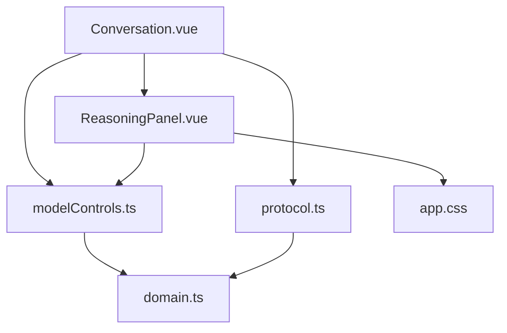
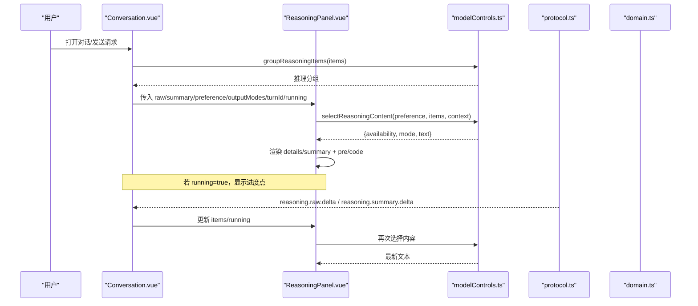
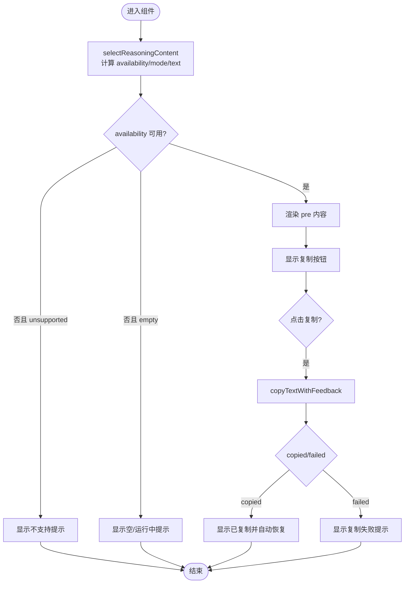
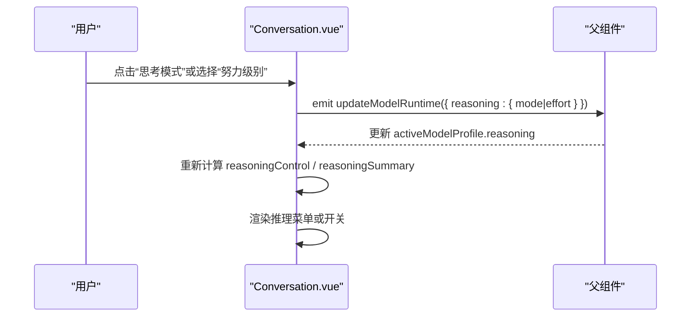
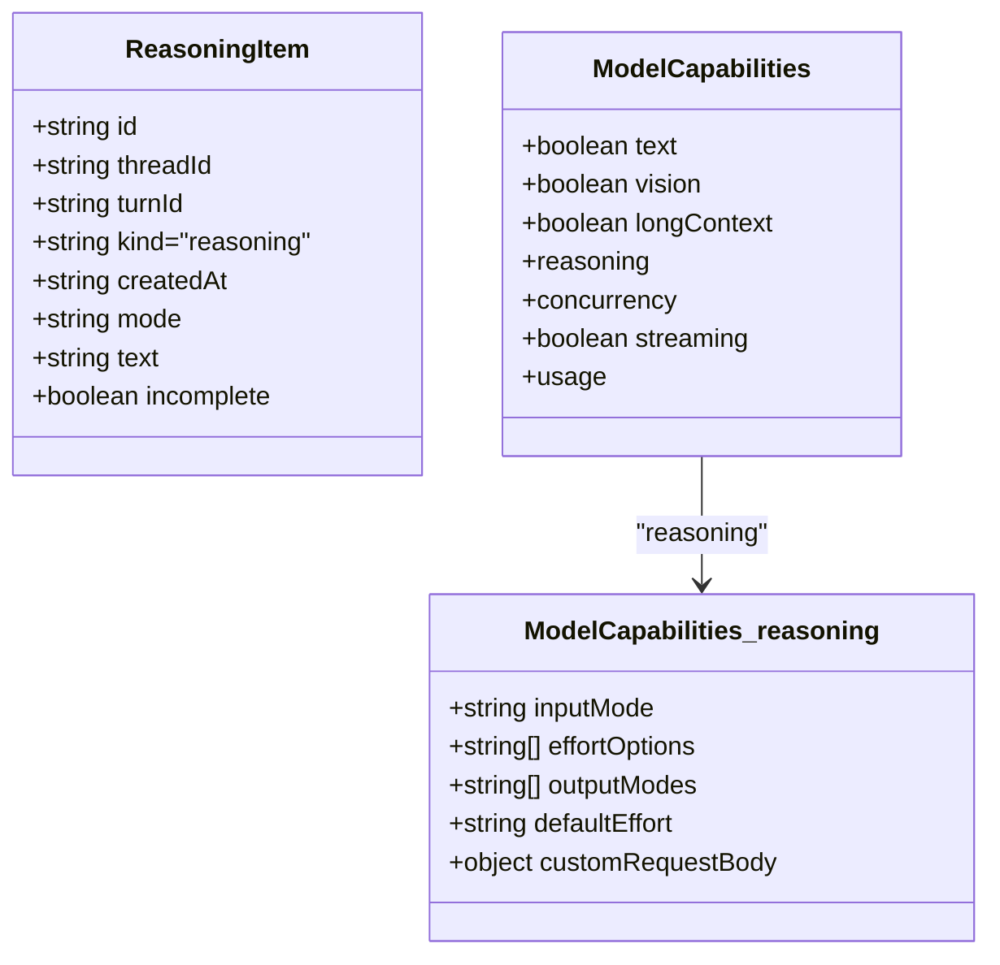
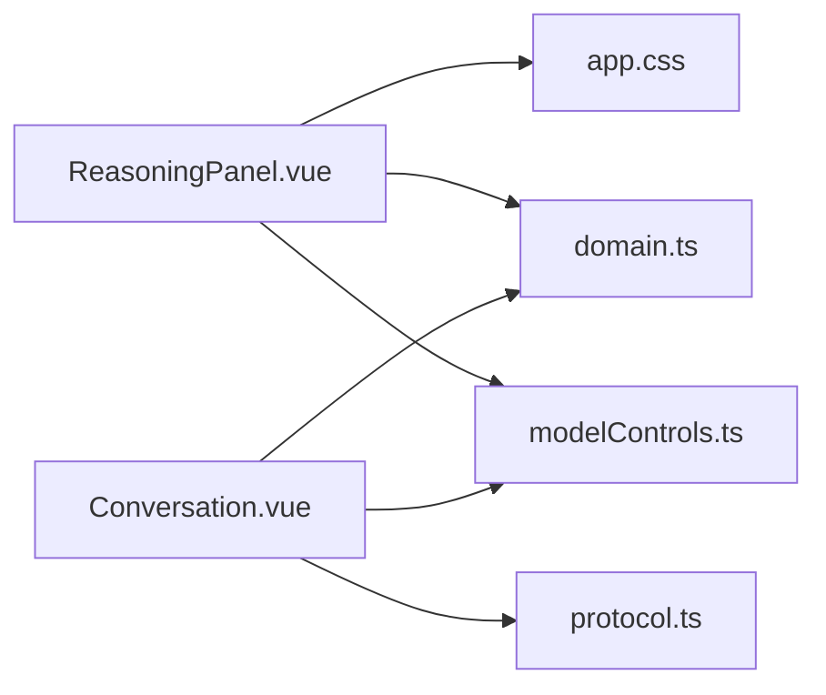

# 推理过程展示组件

<cite>
**本文引用的文件**
- [ReasoningPanel.vue](file://src/renderer/components/ReasoningPanel.vue)
- [Conversation.vue](file://src/renderer/components/Conversation.vue)
- [modelControls.ts](file://src/renderer/modelControls.ts)
- [domain.ts](file://src/shared/domain.ts)
- [protocol.ts](file://src/shared/protocol.ts)
- [reasoningConfiguration.ts](file://src/shared/reasoningConfiguration.ts)
- [app.css](file://src/renderer/styles/app.css)
- [app.spec.ts](file://tests/e2e/app.spec.ts)
</cite>

## 目录
1. [简介](#简介)
2. [项目结构](#项目结构)
3. [核心组件](#核心组件)
4. [架构总览](#架构总览)
5. [详细组件分析](#详细组件分析)
6. [依赖关系分析](#依赖关系分析)
7. [性能考量](#性能考量)
8. [故障排除指南](#故障排除指南)
9. [结论](#结论)
10. [附录](#附录)

## 简介
本文件为“推理过程展示组件”提供系统化、可操作的文档，聚焦 ReasoningPanel.vue 的推理可视化能力：思维链展示、推理步骤跟踪与实时状态更新；推理模式切换（启用/禁用/努力级别）、输出模式控制与性能监控；推理内容的格式化显示、折叠展开机制与进度指示器；以及与模型运行时的集成方式和事件处理逻辑。同时包含自定义推理格式支持与调试工具集成的实践建议，以及优化与排障指南。

## 项目结构
围绕推理面板的关键代码分布在渲染层组件、共享类型与协议、样式与测试中：
- 渲染层
  - ReasoningPanel.vue：负责推理内容的选择、展示、复制与运行时状态反馈
  - Conversation.vue：编排推理面板在对话时间线中的位置，管理推理模式切换菜单与独立推理面板
- 共享层
  - domain.ts：定义推理相关的数据结构与枚举（如 ReasoningItem、ReasoningOutputMode、ModelCapabilities.reasoning）
  - protocol.ts：定义推理增量事件（reasoning.raw.delta、reasoning.summary.delta）与运行时阶段（ModelRunPhase）
  - reasoningConfiguration.ts：校验推理配置冲突
- 样式层
  - app.css：推理面板折叠箭头、内容区、不可用提示、复制按钮与进度点动画等样式
- 测试
  - e2e/app.spec.ts：对推理面板可见性、数据属性与内容存在性的端到端断言

图表来源
- [Conversation.vue:1-120](file://src/renderer/components/Conversation.vue#L1-L120)
- [ReasoningPanel.vue:1-114](file://src/renderer/components/ReasoningPanel.vue#L1-L114)
- [modelControls.ts:1-149](file://src/renderer/modelControls.ts#L1-L149)
- [domain.ts:51-148](file://src/shared/domain.ts#L51-L148)
- [protocol.ts:48-65](file://src/shared/protocol.ts#L48-L65)
- [app.css:763-831](file://src/renderer/styles/app.css#L763-L831)

章节来源
- [Conversation.vue:1-120](file://src/renderer/components/Conversation.vue#L1-L120)
- [ReasoningPanel.vue:1-114](file://src/renderer/components/ReasoningPanel.vue#L1-L114)
- [modelControls.ts:1-149](file://src/renderer/modelControls.ts#L1-L149)
- [domain.ts:51-148](file://src/shared/domain.ts#L51-L148)
- [protocol.ts:48-65](file://src/shared/protocol.ts#L48-L65)
- [app.css:763-831](file://src/renderer/styles/app.css#L763-L831)

## 核心组件
- ReasoningPanel.vue
  - 输入：原始推理项 raw、摘要推理项 summary、显示偏好 preference、running 标志、可用输出模式 outputModes、轮次标识 turnId、翻译函数 t
  - 行为：根据 preference 与 items 计算当前展示的文本与可用性；支持复制推理内容并反馈状态；通过 details/summary 实现折叠展开；在 running 时显示进度点
- modelControls.ts
  - selectReasoningContent：按 preference 选择 raw 或 summary 文本，处理“空/不支持/可用”三种可用性
  - reasoningControls：根据模型能力决定推理控制 UI（隐藏/开关/努力级别/自定义警告）
  - groupReasoningItems：将推理项按 turnId 分组，便于与消息条目对齐
  - shouldShowReasoningPanel：决定是否渲染推理面板（有内容、运行中或固定偏好）
- Conversation.vue
  - 组织推理面板：为每个助手消息生成推理面板锚点；当无对应推理项但处于运行中时插入独立推理面板
  - 推理模式切换：根据模型能力渲染“思考模式”开关或“努力级别”菜单，并通过 updateModelRuntime 事件向父级传递变更
  - 运行时状态：结合 activeRuntime 与 phase 显示进度标签与状态徽章

章节来源
- [ReasoningPanel.vue:1-114](file://src/renderer/components/ReasoningPanel.vue#L1-L114)
- [modelControls.ts:1-149](file://src/renderer/modelControls.ts#L1-L149)
- [Conversation.vue:1-200](file://src/renderer/components/Conversation.vue#L1-L200)

## 架构总览
推理面板的渲染与交互由三层协作完成：
- 数据与协议层：domain.ts 定义推理项与能力；protocol.ts 定义推理增量事件与阶段
- 控制与选择层：modelControls.ts 提供内容选择、分组与控制 UI 决策
- 视图层：Conversation.vue 编排面板位置与模式切换；ReasoningPanel.vue 负责具体展示与交互

图表来源
- [Conversation.vue:55-86](file://src/renderer/components/Conversation.vue#L55-L86)
- [ReasoningPanel.vue:17-32](file://src/renderer/components/ReasoningPanel.vue#L17-L32)
- [modelControls.ts:67-87](file://src/renderer/modelControls.ts#L67-L87)
- [protocol.ts:48-65](file://src/shared/protocol.ts#L48-L65)
- [domain.ts:51-58](file://src/shared/domain.ts#L51-L58)

## 详细组件分析

### ReasoningPanel.vue：推理可视化与交互
- 思维链展示
  - 通过 selectReasoningContent 依据 preference 选择 raw 或 summary 文本，并在 pre 元素中以等宽字体呈现，便于阅读长文本与代码片段
- 推理步骤跟踪
  - 接收 running 标志，当为真时在标题前显示进度点（CSS 动画），表示推理进行中
- 实时状态更新
  - 每次 items 或 running 变化都会重新计算 selection，从而即时刷新展示文本与可用性
- 输出模式控制
  - 通过 preference 控制显示模式：auto/raw/summary；当 preference 非 auto 且当前模式为空时，若仍在运行且该模式受支持，则显示“空”占位，否则显示“不支持”
- 折叠展开机制
  - 使用原生 details/summary 实现折叠面板；CSS 控制箭头旋转与提示文案
- 复制与反馈
  - 调用 copyTextWithFeedback 封装剪贴板写入，返回 copied/failed 状态，并在 1.5s 后重置为 idle；失败时显示错误提示
- 无障碍与可测性
  - 提供 data-testid、data-item-kind、data-reasoning-mode、data-turn-id 等属性，便于自动化测试定位

图表来源
- [ReasoningPanel.vue:17-54](file://src/renderer/components/ReasoningPanel.vue#L17-L54)
- [modelControls.ts:67-99](file://src/renderer/modelControls.ts#L67-L99)
- [app.css:763-831](file://src/renderer/styles/app.css#L763-L831)

章节来源
- [ReasoningPanel.vue:1-114](file://src/renderer/components/ReasoningPanel.vue#L1-L114)
- [modelControls.ts:67-99](file://src/renderer/modelControls.ts#L67-L99)
- [app.css:763-831](file://src/renderer/styles/app.css#L763-L831)

### Conversation.vue：推理模式切换与面板编排
- 推理模式切换
  - 根据模型能力渲染两种控制：
    - toggle：直接切换 enabled/disabled
    - effort：下拉菜单选择努力级别，并触发 updateModelRuntime 事件
  - 当能力为 custom 时显示警告按钮，引导至设置页
- 面板编排
  - 将推理项按 turnId 分组，并与助手消息对齐；若无推理项但当前轮次正在运行，则插入独立推理面板以展示实时推理流
- 运行时状态与进度
  - 基于 activeRuntime.status 与 phase 显示状态徽章与进度标签（连接/压缩上下文/推理/回答）
- 键盘与焦点管理
  - 对推理菜单提供 Escape 关闭、失焦关闭、指针按下外部区域关闭等交互

图表来源
- [Conversation.vue:113-186](file://src/renderer/components/Conversation.vue#L113-L186)
- [Conversation.vue:347-404](file://src/renderer/components/Conversation.vue#L347-L404)
- [modelControls.ts:53-65](file://src/renderer/modelControls.ts#L53-L65)

章节来源
- [Conversation.vue:1-200](file://src/renderer/components/Conversation.vue#L1-L200)
- [Conversation.vue:330-515](file://src/renderer/components/Conversation.vue#L330-L515)
- [modelControls.ts:53-65](file://src/renderer/modelControls.ts#L53-L65)

### 数据与协议：推理内容与事件
- 数据结构
  - ReasoningItem：包含 mode(raw/summary)、text、incomplete 等字段，用于区分原始推理与摘要
  - ModelCapabilities.reasoning：声明 inputMode(effort/toggle/custom/unsupported)、outputModes、defaultEffort、customRequestBody 等
- 事件流
  - reasoning.raw.delta / reasoning.summary.delta：增量推送推理内容
  - model.progress：推进阶段 connecting/compressing/reasoning/answering
  - model.metrics：运行指标（时长、token 速率、是否观察到推理等）

图表来源
- [domain.ts:51-58](file://src/shared/domain.ts#L51-L58)
- [domain.ts:130-148](file://src/shared/domain.ts#L130-L148)

章节来源
- [domain.ts:51-58](file://src/shared/domain.ts#L51-L58)
- [domain.ts:130-148](file://src/shared/domain.ts#L130-L148)
- [protocol.ts:48-65](file://src/shared/protocol.ts#L48-L65)

### 样式与交互细节
- 折叠面板
  - details/summary 原生折叠，CSS 隐藏默认标记并添加箭头，open 状态下箭头旋转
- 内容区
  - pre 元素限制最大高度并允许滚动，等宽字体、行高与换行策略保证可读性
- 不可用与提示
  - 未支持或无内容时显示灰色提示文案
- 复制按钮
  - 透明背景、强调色文字，点击后反馈 copied/failed
- 进度指示器
  - progress-dot 使用 CSS 动画模拟脉冲效果，配合 running 状态显示

章节来源
- [app.css:763-831](file://src/renderer/styles/app.css#L763-L831)

## 依赖关系分析
- 组件耦合
  - ReasoningPanel.vue 依赖 modelControls.ts 的选择与复制逻辑，依赖 domain.ts 的类型定义，依赖 app.css 的样式
  - Conversation.vue 依赖 modelControls.ts 的控制与分组逻辑，依赖 protocol.ts 的事件语义，依赖 domain.ts 的能力与状态类型
- 外部依赖
  - 浏览器剪贴板 API（navigator.clipboard.writeText）
  - 原生 HTML details/summary 折叠
- 潜在循环依赖
  - 组件与工具函数之间单向依赖，未见循环引用
- 接口契约
  - selectReasoningContent 返回统一的选择结果对象，确保不同模式下的一致渲染
  - reasoningControls 根据能力返回统一的控制描述，驱动 UI 分支

图表来源
- [ReasoningPanel.vue:1-114](file://src/renderer/components/ReasoningPanel.vue#L1-L114)
- [Conversation.vue:1-120](file://src/renderer/components/Conversation.vue#L1-L120)
- [modelControls.ts:1-149](file://src/renderer/modelControls.ts#L1-L149)
- [domain.ts:51-148](file://src/shared/domain.ts#L51-L148)
- [protocol.ts:48-65](file://src/shared/protocol.ts#L48-L65)
- [app.css:763-831](file://src/renderer/styles/app.css#L763-L831)

章节来源
- [ReasoningPanel.vue:1-114](file://src/renderer/components/ReasoningPanel.vue#L1-L114)
- [Conversation.vue:1-120](file://src/renderer/components/Conversation.vue#L1-L120)
- [modelControls.ts:1-149](file://src/renderer/modelControls.ts#L1-L149)
- [domain.ts:51-148](file://src/shared/domain.ts#L51-L148)
- [protocol.ts:48-65](file://src/shared/protocol.ts#L48-L65)
- [app.css:763-831](file://src/renderer/styles/app.css#L763-L831)

## 性能考量
- 内容选择与渲染
  - selectReasoningContent 仅做线性查找与条件判断，复杂度 O(n)，n 为推理项数量；在典型对话规模下开销可忽略
- 大文本展示
  - pre 元素限制最大高度并启用滚动，避免长推理阻塞主线程；等宽字体与合理行高提升可读性
- 复制操作
  - 使用异步剪贴板 API，避免阻塞 UI；状态重置采用定时器，防止内存泄漏
- 运行时状态
  - running 标志与进度点仅在必要时渲染，减少重绘
- 建议
  - 若推理内容极大，考虑分页或虚拟滚动（当前已通过 max-height + overflow 缓解）
  - 对频繁更新的推理流，确保上层组件合并增量更新，避免过度重渲染

[本节为通用性能指导，不直接分析具体文件]

## 故障排除指南
- 推理内容不可用
  - 现象：显示“不支持”或“无推理内容”
  - 排查：检查 preference 是否为 auto；确认 items 中是否存在对应 mode 的 ReasoningItem；确认 running 与 outputModes 是否匹配
  - 参考：selectReasoningContent 的可用性判定逻辑
- 复制失败
  - 现象：复制按钮显示失败提示
  - 排查：确认浏览器环境支持剪贴板 API；检查权限与安全策略；查看 copyTextWithFeedback 返回值
- 面板不显示
  - 现象：对话中无推理面板
  - 排查：shouldShowReasoningPanel 的条件（items.length > 0 || running || preference !== 'auto'）；确认 Conversation.vue 是否正确分组与注入面板
- 模式切换无效
  - 现象：切换思考模式或努力级别后无变化
  - 排查：确认模型能力 inputMode 与 capabilities.reasoning.effortOptions；检查 updateModelRuntime 事件是否被父组件正确处理
- 端到端验证
  - 使用 e2e 用例断言面板 data 属性与内容存在性，快速定位渲染问题

章节来源
- [modelControls.ts:67-111](file://src/renderer/modelControls.ts#L67-L111)
- [ReasoningPanel.vue:39-54](file://src/renderer/components/ReasoningPanel.vue#L39-L54)
- [Conversation.vue:55-86](file://src/renderer/components/Conversation.vue#L55-L86)
- [app.spec.ts:171-182](file://tests/e2e/app.spec.ts#L171-L182)

## 结论
ReasoningPanel.vue 提供了简洁而强大的推理可视化能力：通过智能内容选择、原生折叠面板、实时进度指示与复制反馈，满足用户对思维链与推理步骤的可观测需求。Conversation.vue 将推理面板无缝嵌入对话流程，并提供灵活的推理模式切换（启用/禁用/努力级别）。结合 domain.ts 与 protocol.ts 的类型与事件定义，系统实现了从模型运行时到前端展示的完整链路。遵循本文的性能与排障建议，可在大规模推理场景下保持流畅体验与可维护性。

[本节为总结，不直接分析具体文件]

## 附录

### 推理模式与输出模式对照
- 推理模式（ReasoningMode）
  - auto：自动
  - enabled：启用
  - disabled：禁用
- 输出模式（ReasoningOutputMode）
  - raw：原始推理
  - summary：摘要推理
- 显示偏好（ReasoningDisplayMode）
  - auto：优先摘要，其次原始
  - raw：强制原始
  - summary：强制摘要

章节来源
- [domain.ts:99-106](file://src/shared/domain.ts#L99-L106)

### 自定义推理格式支持
- 能力声明
  - capabilities.reasoning.customRequestBody：允许注入自定义请求体字段
- 配置校验
  - reasoningConfigurationIssue：检测 unsupported 输入模式与启用推理的冲突
- 界面提示
  - 当 inputMode 为 custom 时，Conversation.vue 显示能力警告按钮，引导至设置页

章节来源
- [domain.ts:130-148](file://src/shared/domain.ts#L130-L148)
- [reasoningConfiguration.ts:1-19](file://src/shared/reasoningConfiguration.ts#L1-L19)
- [Conversation.vue:396-404](file://src/renderer/components/Conversation.vue#L396-L404)

### 调试工具集成
- 数据属性
  - data-testid、data-item-kind、data-reasoning-mode、data-turn-id：便于自动化测试与调试定位
- 端到端测试
  - 通过 e2e 用例断言面板可见性与内容，覆盖真实运行路径

章节来源
- [ReasoningPanel.vue:64-110](file://src/renderer/components/ReasoningPanel.vue#L64-L110)
- [app.spec.ts:171-182](file://tests/e2e/app.spec.ts#L171-L182)