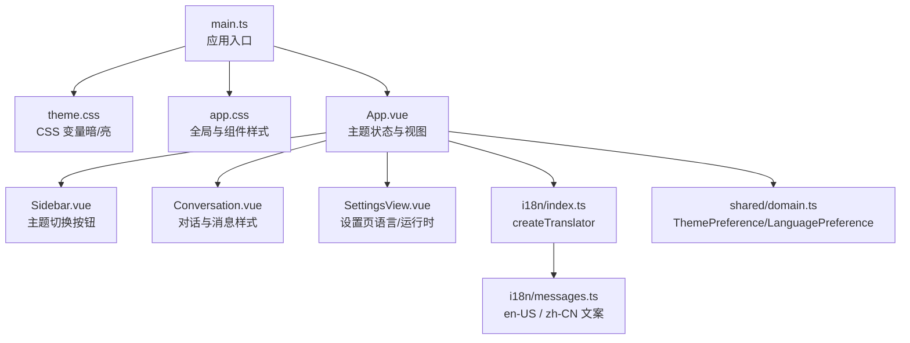
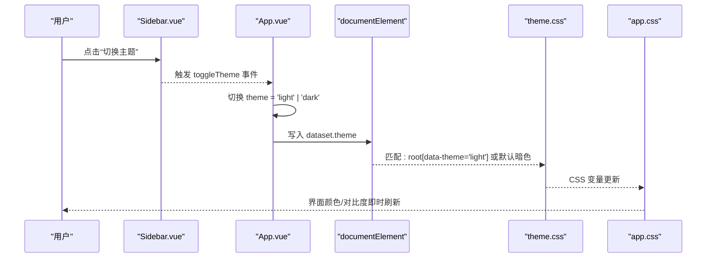
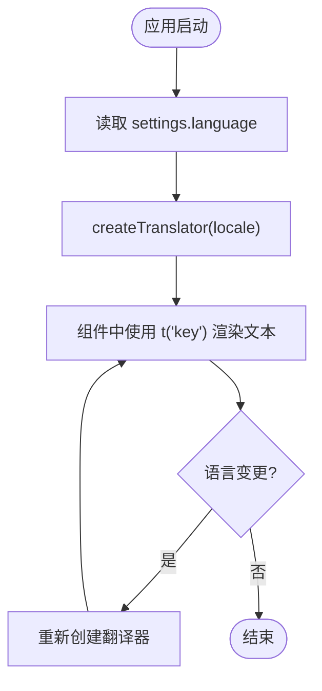
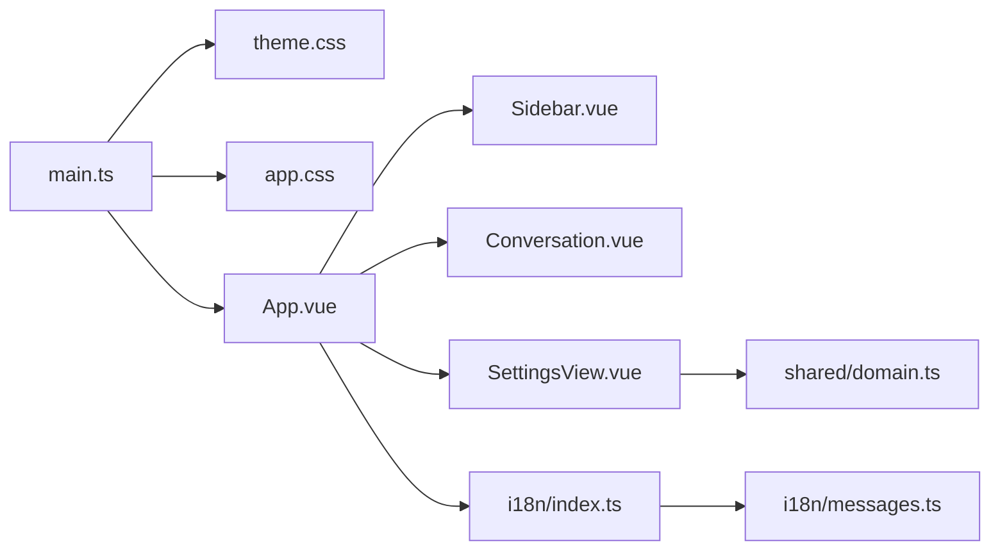

# 样式系统和主题

<cite>
**本文引用的文件**
- [src/renderer/styles/theme.css](file://src/renderer/styles/theme.css)
- [src/renderer/styles/app.css](file://src/renderer/styles/app.css)
- [src/renderer/main.ts](file://src/renderer/main.ts)
- [src/renderer/App.vue](file://src/renderer/App.vue)
- [src/renderer/components/Sidebar.vue](file://src/renderer/components/Sidebar.vue)
- [src/renderer/components/Conversation.vue](file://src/renderer/components/Conversation.vue)
- [src/renderer/components/SettingsView.vue](file://src/renderer/components/SettingsView.vue)
- [src/renderer/i18n/index.ts](file://src/renderer/i18n/index.ts)
- [src/renderer/i18n/messages.ts](file://src/renderer/i18n/messages.ts)
- [src/shared/domain.ts](file://src/shared/domain.ts)
</cite>

## 目录
1. [简介](#简介)
2. [项目结构](#项目结构)
3. [核心组件](#核心组件)
4. [架构总览](#架构总览)
5. [详细组件分析](#详细组件分析)
6. [依赖关系分析](#依赖关系分析)
7. [性能考量](#性能考量)
8. [故障排查指南](#故障排查指南)
9. [结论](#结论)
10. [附录](#附录)

## 简介
本文件系统化梳理本项目的样式系统与主题机制，覆盖 CSS 架构设计、CSS 变量体系、响应式布局策略、组件样式规范、主题切换与深色模式支持、国际化文本管理、动态内容渲染、样式最佳实践、性能优化技巧、浏览器兼容性处理、调试工具与工作流，以及主题定制与样式重构建议。目标是帮助开发者快速理解并高效扩展 UI 层能力。

## 项目结构
样式与主题相关的关键位置：
- 主题变量定义：theme.css（:root 默认暗色，data-theme='light' 时切换为亮色）
- 全局与应用样式：app.css（布局、组件样式、交互态、动画等）
- 入口加载顺序：main.ts（先引入 theme.css，再引入 app.css）
- 主题状态与切换：App.vue（维护 theme ref，写入 documentElement.dataset.theme）
- 侧边栏主题切换按钮：Sidebar.vue（触发 toggleTheme 事件）
- 国际化：i18n/index.ts 与 i18n/messages.ts（提供翻译器与多语言文案）
- 类型定义：shared/domain.ts（包含 ThemePreference、LanguagePreference 等）

图表来源
- [src/renderer/main.ts:1-7](file://src/renderer/main.ts#L1-L7)
- [src/renderer/styles/theme.css:1-38](file://src/renderer/styles/theme.css#L1-L38)
- [src/renderer/styles/app.css:1-120](file://src/renderer/styles/app.css#L1-L120)
- [src/renderer/App.vue:1-120](file://src/renderer/App.vue#L1-L120)
- [src/renderer/components/Sidebar.vue:1-130](file://src/renderer/components/Sidebar.vue#L1-L130)
- [src/renderer/components/Conversation.vue:1-120](file://src/renderer/components/Conversation.vue#L1-L120)
- [src/renderer/components/SettingsView.vue:1-120](file://src/renderer/components/SettingsView.vue#L1-L120)
- [src/renderer/i18n/index.ts:1-15](file://src/renderer/i18n/index.ts#L1-L15)
- [src/renderer/i18n/messages.ts:1-120](file://src/renderer/i18n/messages.ts#L1-L120)
- [src/shared/domain.ts:1-10](file://src/shared/domain.ts#L1-L10)

章节来源
- [src/renderer/main.ts:1-7](file://src/renderer/main.ts#L1-L7)
- [src/renderer/styles/theme.css:1-38](file://src/renderer/styles/theme.css#L1-L38)
- [src/renderer/styles/app.css:1-120](file://src/renderer/styles/app.css#L1-L120)
- [src/renderer/App.vue:1-120](file://src/renderer/App.vue#L1-L120)

## 核心组件
- 主题变量系统（theme.css）
  - 使用 :root 定义暗色主题变量，并通过 data-theme='light' 覆盖为亮色主题变量。
  - 变量涵盖背景、面板、边框、文字、强调色、成功/危险/警告、阴影等，形成完整的设计令牌集。
- 全局与组件样式（app.css）
  - 重置与基础：box-sizing、body 背景与字体、表单元素继承字体。
  - 布局：桌面端三栏网格（sidebar/conversation/inspector），设置页单栏布局。
  - 组件：按钮、侧边栏条目、消息卡片、Markdown 渲染容器、代码块、指标行、推理面板等。
  - 交互：hover/focus 态、过渡动画、进度脉冲动画。
- 主题切换机制（App.vue + Sidebar.vue）
  - App.vue 维护 theme ref，并在挂载时写入 document.documentElement.dataset.theme。
  - Sidebar.vue 暴露 toggleTheme 事件，点击按钮切换 light/dark。
- 国际化（i18n）
  - createTranslator(locale) 返回翻译函数，优先使用当前 locale，回退到 en-US，再回退到 key。
  - messages 提供 en-US 与 zh-CN 两套文案，覆盖界面所有可见文本。
- 类型与配置（domain.ts）
  - ThemePreference: 'system' | 'light' | 'dark'
  - LanguagePreference: 'zh-CN' | 'en-US'
  - 其他与运行时、模型配置相关的类型用于设置页与对话流程。

章节来源
- [src/renderer/styles/theme.css:1-38](file://src/renderer/styles/theme.css#L1-L38)
- [src/renderer/styles/app.css:1-800](file://src/renderer/styles/app.css#L1-L800)
- [src/renderer/App.vue:1-120](file://src/renderer/App.vue#L1-L120)
- [src/renderer/components/Sidebar.vue:1-130](file://src/renderer/components/Sidebar.vue#L1-L130)
- [src/renderer/i18n/index.ts:1-15](file://src/renderer/i18n/index.ts#L1-L15)
- [src/renderer/i18n/messages.ts:1-120](file://src/renderer/i18n/messages.ts#L1-L120)
- [src/shared/domain.ts:1-10](file://src/shared/domain.ts#L1-L10)

## 架构总览
样式与主题的运行时数据流如下：

图表来源
- [src/renderer/components/Sidebar.vue:120-130](file://src/renderer/components/Sidebar.vue#L120-L130)
- [src/renderer/App.vue:13-29](file://src/renderer/App.vue#L13-L29)
- [src/renderer/styles/theme.css:1-38](file://src/renderer/styles/theme.css#L1-L38)
- [src/renderer/styles/app.css:1-120](file://src/renderer/styles/app.css#L1-L120)

## 详细组件分析

### 主题变量与设计令牌
- 变量分组
  - 背景与层级：--bg, --panel, --panel-raised, --panel-soft
  - 边框与分割：--border, --border-soft
  - 文本层次：--text, --muted, --subtle
  - 语义色：--accent, --accent-strong, --success, --danger, --warning
  - 阴影：--shadow
- 主题切换
  - 通过 :root 默认暗色；:root[data-theme='light'] 覆盖为亮色。
  - 切换逻辑在 App.vue 中写入 documentElement.dataset.theme。
- 使用方式
  - 所有颜色通过 var(--*) 引用，确保主题一致性。
  - 部分样式使用 color-mix 实现半透明叠加，提升层次感。

章节来源
- [src/renderer/styles/theme.css:1-38](file://src/renderer/styles/theme.css#L1-L38)
- [src/renderer/App.vue:13-29](file://src/renderer/App.vue#L1-L29)
- [src/renderer/styles/app.css:1-120](file://src/renderer/styles/app.css#L1-L120)

### 布局与响应式策略
- 桌面端三栏布局
  - .desktop-shell 使用 grid-template-columns 定义侧边栏、对话区、检查区的宽度范围，保证最小/最大宽度约束。
  - 设置页使用 .settings-shell 将右侧区域隐藏，仅保留左侧与主内容。
- 自适应与滚动
  - 对话时间线 .timeline 可滚动，配合自动滚动到底部逻辑，保障长对话体验。
- 组件尺寸与间距
  - 统一使用 px 级间距与圆角，保持视觉一致；按钮高度、字号、字重遵循设计规范。

章节来源
- [src/renderer/styles/app.css:25-52](file://src/renderer/styles/app.css#L25-L52)
- [src/renderer/styles/app.css:321-335](file://src/renderer/styles/app.css#L321-L335)
- [src/renderer/components/Conversation.vue:224-266](file://src/renderer/components/Conversation.vue#L224-L266)

### 组件样式规范
- 按钮族
  - .primary-action/.secondary-button/.icon-button/.mini-button 等共享 border、border-radius、transition，确保交互反馈一致。
  - hover/focus 态统一以 accent 色高亮边框或背景。
- 列表与条目
  - .thread-row/.thread-button 使用网格与弹性布局，active 态增加左边框与背景提升。
- 消息与 Markdown
  - .message-row 区分 user/assistant 角色，live 态增强边框。
  - .markdown-body 统一标题、段落、列表、代码块样式，pre/code 具备独立背景与溢出处理。
- 工具与指标
  - .tool-row/.metrics-row/.progress-row 提供轻量信息展示，配色与排版保持一致性。
- 推理面板
  - .reasoning-panel 折叠/展开交互，箭头旋转动画，内容区域固定最大高度并滚动。

章节来源
- [src/renderer/styles/app.css:101-173](file://src/renderer/styles/app.css#L101-L173)
- [src/renderer/styles/app.css:215-261](file://src/renderer/styles/app.css#L215-L261)
- [src/renderer/styles/app.css:502-586](file://src/renderer/styles/app.css#L502-L586)
- [src/renderer/styles/app.css:628-712](file://src/renderer/styles/app.css#L628-L712)
- [src/renderer/styles/app.css:714-799](file://src/renderer/styles/app.css#L714-L799)

### 主题切换机制与深色模式
- 状态管理
  - App.vue 的 theme ref 控制当前主题，onMounted 初始化写入 dataset.theme。
  - Sidebar.vue 暴露 toggleTheme 事件，点击后由父组件处理。
- 样式生效
  - theme.css 通过 :root 与 :root[data-theme='light'] 切换变量集合。
  - app.css 广泛使用 var(--*)，无需额外类名即可响应主题变化。
- 用户体验
  - 切换即时生效，无闪烁；color-scheme 同步更新，影响原生控件外观。

章节来源
- [src/renderer/App.vue:13-29](file://src/renderer/App.vue#L13-L29)
- [src/renderer/components/Sidebar.vue:120-130](file://src/renderer/components/Sidebar.vue#L120-L130)
- [src/renderer/styles/theme.css:1-38](file://src/renderer/styles/theme.css#L1-L38)

### 国际化文本管理与多语言支持
- 翻译器
  - createTranslator(locale) 返回 (key) => string，按 locale 查找 messages，缺失时回退到 en-US，最后回退到 key。
- 文案组织
  - messages.ts 提供 en-US 与 zh-CN 两套对象，键名一致，便于类型推导与维护。
- 使用方式
  - App.vue 根据 settings.language 创建 t，传递给子组件（Sidebar、Conversation、SettingsView）。
  - 组件内通过 t('key') 获取本地化文本，如“发送”、“停止”、“设置”等。

图表来源
- [src/renderer/i18n/index.ts:8-10](file://src/renderer/i18n/index.ts#L8-L10)
- [src/renderer/i18n/messages.ts:1-120](file://src/renderer/i18n/messages.ts#L1-L120)
- [src/renderer/App.vue:20-21](file://src/renderer/App.vue#L20-L21)

章节来源
- [src/renderer/i18n/index.ts:1-15](file://src/renderer/i18n/index.ts#L1-L15)
- [src/renderer/i18n/messages.ts:1-120](file://src/renderer/i18n/messages.ts#L1-L120)
- [src/renderer/App.vue:20-21](file://src/renderer/App.vue#L20-L21)

### 动态内容渲染
- Markdown 渲染
  - Conversation.vue 使用 renderMarkdown 将助手消息渲染为 HTML，并注入 copyCodeLabel 等国际化文案。
- 复制反馈
  - 复制按钮通过 data-copy-state 与 CSS 伪类/属性选择器显示“已复制/失败”状态，配合短暂定时器恢复默认文案。
- 图片附件
  - 用户消息支持图片附件，使用 figure/img/figcaption 结构化展示，lazy 加载优化性能。

章节来源
- [src/renderer/components/Conversation.vue:279-299](file://src/renderer/components/Conversation.vue#L279-L299)
- [src/renderer/components/Conversation.vue:473-492](file://src/renderer/components/Conversation.vue#L473-L492)
- [src/renderer/styles/app.css:597-627](file://src/renderer/styles/app.css#L597-L627)

### 设置页中的主题与语言
- 语言选择
  - SettingsView.vue 提供语言下拉框，变更时调用 setLanguage 更新 settings.language。
- 运行时偏好
  - 提供思考展示模式、指标显示、上下文消息限制等选项，影响对话渲染与行为。
- 模型配置
  - 支持新增/编辑/测试/删除模型配置文件，包含推理协议、并发、输出 Token 上限等。

章节来源
- [src/renderer/components/SettingsView.vue:442-452](file://src/renderer/components/SettingsView.vue#L442-L452)
- [src/renderer/components/SettingsView.vue:648-689](file://src/renderer/components/SettingsView.vue#L648-L689)

## 依赖关系分析
- 样式加载顺序
  - main.ts 先引入 theme.css，再引入 app.css，确保变量先于使用。
- 组件依赖
  - App.vue 组合 Sidebar、Conversation、Inspector、SettingsView，并传递 t、theme 等。
  - Sidebar.vue 依赖 App.vue 的 theme 与 t，触发主题切换。
  - Conversation.vue 依赖 markdown 渲染与滚动逻辑，呈现消息与推理面板。
  - SettingsView.vue 依赖 domain 类型与 modelProfileForm 工具，完成配置校验与保存。
- 类型依赖
  - shared/domain.ts 定义 ThemePreference、LanguagePreference 等，贯穿设置与主题逻辑。

图表来源
- [src/renderer/main.ts:1-7](file://src/renderer/main.ts#L1-L7)
- [src/renderer/App.vue:1-120](file://src/renderer/App.vue#L1-L120)
- [src/renderer/components/Sidebar.vue:1-130](file://src/renderer/components/Sidebar.vue#L1-L130)
- [src/renderer/components/Conversation.vue:1-120](file://src/renderer/components/Conversation.vue#L1-L120)
- [src/renderer/components/SettingsView.vue:1-120](file://src/renderer/components/SettingsView.vue#L1-L120)
- [src/renderer/i18n/index.ts:1-15](file://src/renderer/i18n/index.ts#L1-L15)
- [src/renderer/i18n/messages.ts:1-120](file://src/renderer/i18n/messages.ts#L1-L120)
- [src/shared/domain.ts:1-10](file://src/shared/domain.ts#L1-L10)

章节来源
- [src/renderer/main.ts:1-7](file://src/renderer/main.ts#L1-L7)
- [src/renderer/App.vue:1-120](file://src/renderer/App.vue#L1-L120)
- [src/renderer/components/Sidebar.vue:1-130](file://src/renderer/components/Sidebar.vue#L1-L130)
- [src/renderer/components/Conversation.vue:1-120](file://src/renderer/components/Conversation.vue#L1-L120)
- [src/renderer/components/SettingsView.vue:1-120](file://src/renderer/components/SettingsView.vue#L1-L120)
- [src/renderer/i18n/index.ts:1-15](file://src/renderer/i18n/index.ts#L1-L15)
- [src/renderer/i18n/messages.ts:1-120](file://src/renderer/i18n/messages.ts#L1-L120)
- [src/shared/domain.ts:1-10](file://src/shared/domain.ts#L1-L10)

## 性能考量
- 样式层面
  - 使用 CSS 变量减少重复计算，主题切换零 JS 重绘成本。
  - 合理使用 color-mix 与 box-shadow，避免过度复杂混合导致重排。
  - 列表项与消息卡片采用固定高度与 overflow 控制，减少回流。
- 渲染层面
  - 图片 lazy 加载，避免首屏阻塞。
  - 长列表滚动采用 requestAnimationFrame 与 nextTick 组合，平滑滚动到底部。
  - 复制状态使用 Map 与定时器清理，避免内存泄漏。
- 兼容性与降级
  - 使用现代 CSS 特性（grid、color-mix），在不支持的浏览器中可通过渐进增强或 polyfill 兜底。
  - color-scheme 提示浏览器原生控件适配明暗主题。

[本节为通用指导，不直接分析具体文件]

## 故障排查指南
- 主题未生效
  - 检查 App.vue 是否在 onMounted 中写入 documentElement.dataset.theme。
  - 确认 theme.css 已先于 app.css 加载。
- 文案缺失或回退
  - 检查 i18n/messages.ts 是否包含对应 key；若缺失会回退到 en-US，再回退到 key。
  - 确认 createTranslator 使用的 locale 与 settings.language 一致。
- 复制反馈异常
  - 检查 messageCopyState 映射与定时器清理逻辑，确保状态正确复位。
- 设置页验证错误
  - 关注 capabilityError 的计算逻辑，包括最大输出 Token、并发数、推理配置与自定义请求体 JSON 合法性。

章节来源
- [src/renderer/App.vue:27-29](file://src/renderer/App.vue#L27-L29)
- [src/renderer/main.ts:1-7](file://src/renderer/main.ts#L1-L7)
- [src/renderer/i18n/index.ts:8-10](file://src/renderer/i18n/index.ts#L8-L10)
- [src/renderer/components/Conversation.vue:268-277](file://src/renderer/components/Conversation.vue#L268-L277)
- [src/renderer/components/SettingsView.vue:103-130](file://src/renderer/components/SettingsView.vue#L103-L130)

## 结论
本项目采用基于 CSS 变量的主题系统，结合 Vue 组件的状态管理，实现了简洁高效的暗/亮主题切换。样式架构清晰，组件样式规范统一，国际化文案集中管理，动态内容渲染流畅。通过合理的性能优化与兼容性考虑，确保了良好的用户体验。后续可扩展更多主题变体与更细粒度的设计令牌，进一步提升可定制性与可维护性。

[本节为总结，不直接分析具体文件]

## 附录

### 主题定制指南
- 新增主题
  - 在 theme.css 中添加新的 data-theme 选择器，覆盖变量集合。
  - 在 App.vue 中扩展 theme ref 的类型与切换逻辑。
- 调整设计令牌
  - 修改 theme.css 中的变量值，确保对比度与可读性符合无障碍标准。
- 组件适配
  - 若新增组件使用硬编码颜色，请替换为 var(--*)，确保主题一致性。

章节来源
- [src/renderer/styles/theme.css:1-38](file://src/renderer/styles/theme.css#L1-L38)
- [src/renderer/App.vue:13-29](file://src/renderer/App.vue#L13-L29)

### 样式重构建议
- 统一命名
  - 继续使用 BEM 风格类名（如 .sidebar-pane、.thread-row），保持可读性与可维护性。
- 抽象共用样式
  - 将重复的按钮、输入框、卡片样式抽象为可复用类，减少冗余。
- 增强可访问性
  - 为关键交互添加 aria-* 属性与键盘导航支持，提升可用性。
- 文档化变量
  - 在 theme.css 顶部注释变量用途与取值范围，便于团队协作。

[本节为通用指导，不直接分析具体文件]