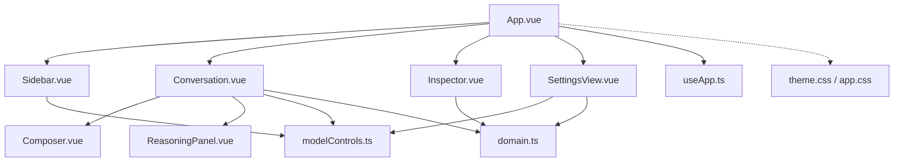
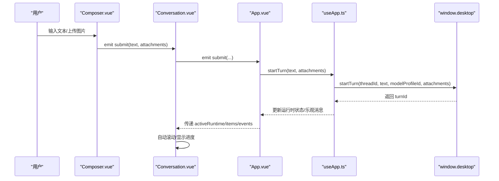
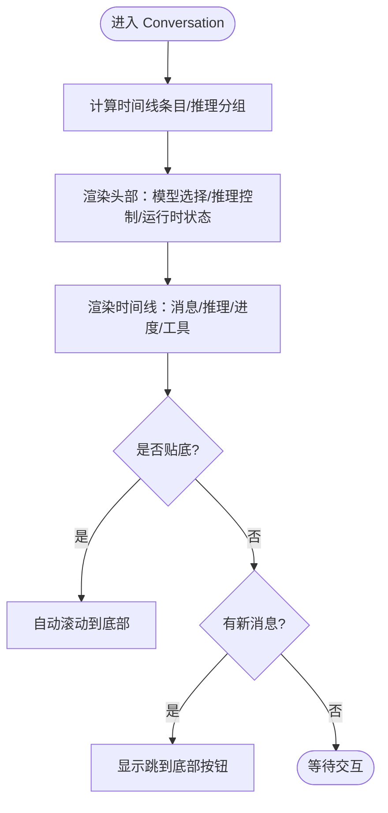
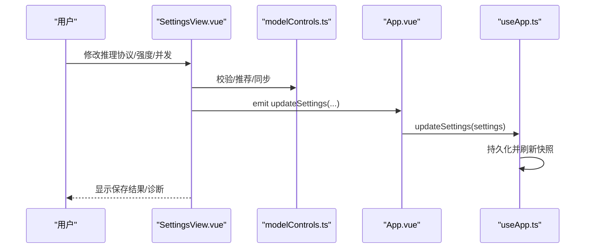
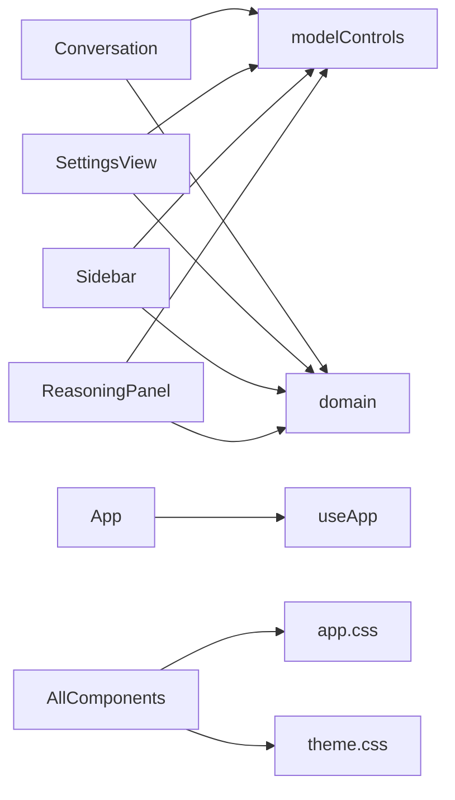

# 用户界面

<cite>
**本文引用的文件**
- [Conversation.vue](file://src/renderer/components/Conversation.vue)
- [SettingsView.vue](file://src/renderer/components/SettingsView.vue)
- [Sidebar.vue](file://src/renderer/components/Sidebar.vue)
- [ReasoningPanel.vue](file://src/renderer/components/ReasoningPanel.vue)
- [Composer.vue](file://src/renderer/components/Composer.vue)
- [Inspector.vue](file://src/renderer/components/Inspector.vue)
- [App.vue](file://src/renderer/App.vue)
- [modelControls.ts](file://src/renderer/modelControls.ts)
- [domain.ts](file://src/shared/domain.ts)
- [app.css](file://src/renderer/styles/app.css)
- [theme.css](file://src/renderer/styles/theme.css)
- [messages.ts](file://src/renderer/i18n/messages.ts)
- [useApp.ts](file://src/renderer/composables/useApp.ts)
</cite>

## 目录
1. [简介](#简介)
2. [项目结构](#项目结构)
3. [核心组件](#核心组件)
4. [架构总览](#架构总览)
5. [详细组件分析](#详细组件分析)
6. [依赖关系分析](#依赖关系分析)
7. [性能考虑](#性能考虑)
8. [故障排查指南](#故障排查指南)
9. [结论](#结论)
10. [附录](#附录)

## 简介
本文件为用户界面组件的详细文档，覆盖聊天界面、设置面板、侧边栏导航与推理过程展示。内容包含视觉外观、行为与交互模式；组件属性、事件、插槽与自定义选项；响应式设计与无障碍访问；状态、动画与过渡；样式定制与主题支持；跨浏览器兼容性与性能优化建议。

## 项目结构
前端采用 Vue 单页应用，按功能划分组件：
- 聊天主视图：Conversation.vue（消息时间线、模型选择、推理控制、滚动与复制）
- 输入与附件：Composer.vue（文本输入、图片附件、发送/停止/取消）
- 推理过程展示：ReasoningPanel.vue（原始/摘要/不可用状态、复制）
- 设置面板：SettingsView.vue（语言、外观、模型配置、运行时行为）
- 侧边栏导航：Sidebar.vue（分组、会话列表、运行状态、主题切换、打开设置）
- 任务详情与指标：Inspector.vue（计划、审批、活动流、运行指标）
- 应用壳层：App.vue（布局、路由视图切换、全局状态绑定）
- 样式与主题：app.css、theme.css
- 领域类型与工具：domain.ts、modelControls.ts
- 国际化：messages.ts
- 应用逻辑组合：useApp.ts

图表来源
- [App.vue:124-199](file://src/renderer/App.vue#L124-L199)
- [Conversation.vue:1-515](file://src/renderer/components/Conversation.vue#L1-L515)
- [SettingsView.vue:1-693](file://src/renderer/components/SettingsView.vue#L1-L693)
- [Sidebar.vue:1-130](file://src/renderer/components/Sidebar.vue#L1-L130)
- [ReasoningPanel.vue:1-114](file://src/renderer/components/ReasoningPanel.vue#L1-L114)
- [Composer.vue:1-181](file://src/renderer/components/Composer.vue#L1-L181)
- [Inspector.vue:1-130](file://src/renderer/components/Inspector.vue#L1-L130)
- [modelControls.ts:1-149](file://src/renderer/modelControls.ts#L1-L149)
- [domain.ts:1-319](file://src/shared/domain.ts#L1-L319)
- [theme.css:1-38](file://src/renderer/styles/theme.css#L1-L38)
- [app.css:1-800](file://src/renderer/styles/app.css#L1-L800)

章节来源
- [App.vue:124-199](file://src/renderer/App.vue#L124-L199)
- [app.css:25-43](file://src/renderer/styles/app.css#L25-L43)

## 核心组件
- 聊天界面（Conversation.vue）
  - 作用：渲染消息时间线、推理面板、模型选择器、运行时状态、自动滚动与复制。
  - 关键属性：线程摘要、消息项、轮次记录、事件、忙碌状态、活跃运行时、推理显示偏好、加载态、模型配置等。
  - 事件：提交消息、取消、打开设置、选择模型、更新模型运行时。
  - 行为：根据推理能力动态显示“思考模式”开关或强度菜单；根据运行时状态显示进度提示；自动滚动到底部；复制助手回答与代码块。
- 设置面板（SettingsView.vue）
  - 作用：配置语言、外观、模型提供者、推理能力与运行时行为。
  - 关键属性：模型配置列表、当前模型ID、语言、应用设置、翻译函数、保存/测试回调。
  - 事件：返回、删除模型、选择模型、设置语言、更新运行时设置。
  - 行为：表单校验（最大并发、输出Token、推理协议/输入模式/强度）、连接测试、保存/删除、运行时偏好（自动/原始/摘要）。
- 侧边栏导航（Sidebar.vue）
  - 作用：工作区分组与会话列表、新建任务/分组、删除、主题切换、打开设置。
  - 关键属性：分组、会话、活跃会话ID、活跃分组ID、各线程运行时状态、删除反馈、加载态、主题、翻译。
  - 事件：新建任务/分组、选择会话/分组、删除会话/分组、切换主题、打开设置。
  - 行为：显示线程运行状态（排队/运行中/完成/失败），高亮活跃项，悬停显示删除按钮。
- 推理过程展示（ReasoningPanel.vue）
  - 作用：以可折叠面板展示原始或摘要推理内容，提供复制。
  - 关键属性：原始/摘要推理项、显示偏好、是否运行中、输出模式、轮次ID、翻译。
  - 行为：根据偏好与可用性选择内容；运行中显示占位；复制反馈与错误提示。
- 输入与附件（Composer.vue）
  - 作用：文本输入、图片附件、发送/停止/取消。
  - 关键属性：忙碌状态、活跃运行时、是否支持视觉、翻译。
  - 事件：提交（文本+附件）、取消。
  - 行为：限制图片数量与大小；仅图片格式；无视觉时禁用附件；根据运行时状态切换按钮文案。
- 任务详情与指标（Inspector.vue）
  - 作用：展示计划步骤、审批面板、最近活动、运行指标。
  - 关键属性：待审批、事件、轮次、设置、忙碌、审批响应中、审批错误、翻译。
  - 事件：批准/拒绝。
  - 行为：过滤并反转最近活动；计算最新指标；格式化耗时与速率。

章节来源
- [Conversation.vue:31-53](file://src/renderer/components/Conversation.vue#L31-L53)
- [SettingsView.vue:37-53](file://src/renderer/components/SettingsView.vue#L37-L53)
- [Sidebar.vue:8-29](file://src/renderer/components/Sidebar.vue#L8-L29)
- [ReasoningPanel.vue:7-15](file://src/renderer/components/ReasoningPanel.vue#L7-L15)
- [Composer.vue:7-17](file://src/renderer/components/Composer.vue#L7-L17)
- [Inspector.vue:7-21](file://src/renderer/components/Inspector.vue#L7-L21)

## 架构总览
应用通过 App.vue 组织三栏布局：左侧 Sidebar、中间 Conversation、右侧 Inspector；当进入设置视图时，使用两栏布局（Sidebar + SettingsView）。所有数据与业务逻辑集中在 useApp.ts，通过 window.desktop API 与主进程通信。组件之间通过 props/emits 进行单向数据流，避免直接耦合。

图表来源
- [Composer.vue:38-49](file://src/renderer/components/Composer.vue#L38-L49)
- [Conversation.vue:505-512](file://src/renderer/components/Conversation.vue#L505-L512)
- [App.vue:105-112](file://src/renderer/App.vue#L105-L112)
- [useApp.ts:189-230](file://src/renderer/composables/useApp.ts#L189-L230)

## 详细组件分析

### 聊天界面（Conversation.vue）
- 视觉外观
  - 顶部标题与任务信息；模型选择下拉框；推理控制（开关/强度菜单）；运行时状态胶囊；消息时间线；底部输入区。
  - 消息行区分用户与助手；助手消息支持 Markdown 渲染与代码块复制；用户消息支持图片附件缩略图。
- 行为与交互
  - 推理控制：根据模型能力决定显示“toggle”或“effort”菜单；菜单支持键盘关闭与焦点管理。
  - 运行时状态：根据 ThreadRuntimeState 显示就绪/排队/运行中/取消中/完成/失败等，并显示队列位置。
  - 滚动与未读：监听滚动判断是否贴底；有新消息且未贴底时显示“跳到底部”按钮。
  - 复制：助手回答与代码块复制，带成功/失败状态反馈与自动重置。
- 属性、事件、插槽
  - 属性：thread、items、turns、events、activeBusy、activeRuntime、reasoningDisplayMode、loading、modelProfiles、activeModelProfileId、activeModelProfile、runtimeError、t。
  - 事件：submit、cancel、openSettings、selectModel、updateModelRuntime。
  - 插槽：无显式具名插槽，但通过模板内条件渲染 ReasoningPanel。
- 状态、动画与过渡
  - 状态：isPinnedToBottom、hasUnreadBelow、isAutoScrolling、messageCopyState、reasoningMenuOpen。
  - 动画：运行时状态点脉冲动画；菜单展开收起过渡由 CSS 控制。
- 无障碍与国际化
  - aria-label、aria-haspopup、aria-expanded、aria-controls、role="menu"/"menuitemradio"；i18n 键覆盖全部文案。
- 响应式设计
  - 时间线容器宽度自适应；消息行最大宽度限制；移动端可通过外层 grid 列宽适配。

图表来源
- [Conversation.vue:55-73](file://src/renderer/components/Conversation.vue#L55-L73)
- [Conversation.vue:224-266](file://src/renderer/components/Conversation.vue#L224-L266)
- [Conversation.vue:301-323](file://src/renderer/components/Conversation.vue#L301-L323)

章节来源
- [Conversation.vue:31-53](file://src/renderer/components/Conversation.vue#L31-L53)
- [Conversation.vue:108-217](file://src/renderer/components/Conversation.vue#L108-L217)
- [Conversation.vue:330-515](file://src/renderer/components/Conversation.vue#L330-L515)

### 设置面板（SettingsView.vue）
- 视觉外观
  - 顶部标题与返回按钮；三段式导航（通用/模型/运行时）；模型提供者卡片含表单与操作按钮；运行时偏好区域。
- 行为与交互
  - 表单联动：选择推理协议后自动推荐输入模式与强度选项；同步当前/默认强度。
  - 校验：最大输出 Token、最大并发、推理配置、自定义请求体 JSON。
  - 连接测试：异步调用后端接口，显示诊断信息与本地 Qwen 指导。
  - 保存/删除：保存后刷新快照；删除前清空表单。
- 属性、事件、插槽
  - 属性：modelProfiles、activeModelProfileId、language、settings、t、saveModelProfile、testModelProfile。
  - 事件：back、deleteModelProfile、selectModelProfile、setLanguage、updateSettings。
  - 插槽：无。
- 状态、动画与过渡
  - 状态：saving、testingConnection、connectionTestState、capabilityError。
  - 过渡：按钮禁用态、加载态 aria-busy。
- 无障碍与国际化
  - role="status"、aria-live="polite"；所有文案通过 i18n 键。
- 响应式设计
  - 双列布局在窄屏下堆叠；字段宽度自适应。

图表来源
- [SettingsView.vue:151-175](file://src/renderer/components/SettingsView.vue#L151-L175)
- [SettingsView.vue:274-300](file://src/renderer/components/SettingsView.vue#L274-L300)
- [useApp.ts:378-381](file://src/renderer/composables/useApp.ts#L378-L381)

章节来源
- [SettingsView.vue:37-53](file://src/renderer/components/SettingsView.vue#L37-L53)
- [SettingsView.vue:140-192](file://src/renderer/components/SettingsView.vue#L140-L192)
- [SettingsView.vue:250-344](file://src/renderer/components/SettingsView.vue#L250-L344)
- [SettingsView.vue:415-693](file://src/renderer/components/SettingsView.vue#L415-L693)

### 侧边栏导航（Sidebar.vue）
- 视觉外观
  - 品牌标识、新建任务按钮；分组标题与新增分组；会话列表项含标题、状态、删除按钮；底部主题切换与设置入口。
- 行为与交互
  - 运行时状态：根据 threadRuntimePresentation 显示排队位置/运行中等；活跃项高亮；悬停显示删除。
- 属性、事件、插槽
  - 属性：groups、threads、activeThreadId、activeGroupId、runtimeByThread、deleteFeedback、loading、theme、t。
  - 事件：newThread、newGroup、selectThread、selectGroup、deleteThread、deleteGroup、toggleTheme、openSettings。
  - 插槽：无。
- 无障碍与国际化
  - aria-label 用于导航与状态；i18n 文案。
- 响应式设计
  - 固定宽度侧栏，内容区自适应。

章节来源
- [Sidebar.vue:8-29](file://src/renderer/components/Sidebar.vue#L8-L29)
- [Sidebar.vue:31-49](file://src/renderer/components/Sidebar.vue#L31-L49)
- [Sidebar.vue:51-130](file://src/renderer/components/Sidebar.vue#L51-L130)

### 推理过程展示（ReasoningPanel.vue）
- 视觉外观
  - 可折叠 details/summary；标题随模式变化；内容区显示原始或摘要；复制按钮与错误提示。
- 行为与交互
  - 内容选择：根据 preference 与 outputModes 选择可用内容；运行中显示空内容提示。
  - 复制：copyTextWithFeedback 统一处理成功/失败状态。
- 属性、事件、插槽
  - 属性：raw、summary、preference、running、outputModes、turnId、t。
  - 事件：无。
  - 插槽：无。
- 无障碍与国际化
  - data-testid 便于自动化测试；i18n 文案。
- 响应式设计
  - 宽度自适应；内容溢出滚动。

章节来源
- [ReasoningPanel.vue:7-15](file://src/renderer/components/ReasoningPanel.vue#L7-L15)
- [ReasoningPanel.vue:17-60](file://src/renderer/components/ReasoningPanel.vue#L17-L60)
- [ReasoningPanel.vue:63-114](file://src/renderer/components/ReasoningPanel.vue#L63-L114)

### 输入与附件（Composer.vue）
- 视觉外观
  - 附件芯片列表；文本域；附加图片按钮；发送/停止/取消按钮。
- 行为与交互
  - 附件校验：仅图片、最多4张、单张不超过10MB；不支持视觉时禁用。
  - 提交：无忙碌时发送；忙碌时取消；根据运行时状态切换按钮文案。
- 属性、事件、插槽
  - 属性：activeBusy、activeRuntime、supportsVision、t。
  - 事件：submit、cancel。
  - 插槽：无。
- 无障碍与国际化
  - aria-label 用于附件列表；i18n 文案。
- 响应式设计
  - 输入区高度自适应；附件横向排列。

章节来源
- [Composer.vue:7-17](file://src/renderer/components/Composer.vue#L7-L17)
- [Composer.vue:38-66](file://src/renderer/components/Composer.vue#L38-L66)
- [Composer.vue:68-130](file://src/renderer/components/Composer.vue#L68-L130)
- [Composer.vue:133-181](file://src/renderer/components/Composer.vue#L133-L181)

### 任务详情与指标（Inspector.vue）
- 视觉外观
  - 计划步骤列表；运行指标网格；审批面板；活动流列表。
- 行为与交互
  - 活动流：过滤非 delta 事件，取最近8条并反转。
  - 指标：格式化耗时、首字延迟、速度、Token 用量。
  - 审批：批准/拒绝按钮受状态与响应中标志控制。
- 属性、事件、插槽
  - 属性：pendingApproval、events、turns、settings、busy、approvalResponseInFlight、approvalError、t。
  - 事件：approve、reject。
  - 插槽：无。
- 无障碍与国际化
  - role="status" 用于错误提示；i18n 文案。
- 响应式设计
  - 指标网格在小屏下堆叠。

章节来源
- [Inspector.vue:7-21](file://src/renderer/components/Inspector.vue#L7-L21)
- [Inspector.vue:23-57](file://src/renderer/components/Inspector.vue#L23-L57)
- [Inspector.vue:59-130](file://src/renderer/components/Inspector.vue#L59-L130)

## 依赖关系分析
- 组件到工具
  - Conversation.vue 依赖 modelControls.ts 的 reasoningControls、groupReasoningItems、shouldShowReasoningPanel、copyTextWithFeedback、composerAction。
  - SettingsView.vue 依赖 modelControls.ts 的 recommendedReasoningControlForProtocol、reconcileEffortSelection、reasoningConfigurationValidationIssue、customRequestBodyValidationIssue、effortValidationIssue。
  - Sidebar.vue 依赖 modelControls.ts 的 threadRuntimePresentation。
  - ReasoningPanel.vue 依赖 modelControls.ts 的 selectReasoningContent、copyTextWithFeedback。
- 组件到领域类型
  - 所有组件引用 domain.ts 的类型定义（如 Item、TurnRecord、ModelProfile、ThreadRuntimeState 等）。
- 组件到样式与主题
  - 所有组件通过 class 名使用 app.css 的样式；theme.css 提供 CSS 变量实现明暗主题。
- 组件到应用逻辑
  - App.vue 通过 useApp.ts 管理状态与副作用；组件通过 props/emits 与 App.vue 通信。

图表来源
- [modelControls.ts:1-149](file://src/renderer/modelControls.ts#L1-L149)
- [domain.ts:1-319](file://src/shared/domain.ts#L1-L319)
- [app.css:1-800](file://src/renderer/styles/app.css#L1-L800)
- [theme.css:1-38](file://src/renderer/styles/theme.css#L1-L38)
- [App.vue:124-199](file://src/renderer/App.vue#L124-L199)

章节来源
- [modelControls.ts:10-149](file://src/renderer/modelControls.ts#L10-L149)
- [domain.ts:1-319](file://src/shared/domain.ts#L1-L319)

## 性能考虑
- 渲染优化
  - 使用 computed 缓存时间线条目与推理分组，减少重复计算。
  - 滚动监听中使用 isAutoScrolling 标志避免重入导致的抖动。
  - 图片懒加载 loading="lazy" 降低初始负载。
- 内存与清理
  - 组件卸载时清除定时器与事件监听（如 copyResetTimers、document pointerdown）。
- 网络与超时
  - 启动回合与设置更新使用超时保护，避免长时间挂起。
- 样式与主题
  - 基于 CSS 变量的主题切换避免重绘大量 DOM；动画使用轻量级 transform/opacity。

[本节为通用性能建议，不直接分析具体文件]

## 故障排查指南
- 常见问题定位
  - 推理面板不可用：检查 outputModes 与 preference；确认 running 状态与 available 选择逻辑。
    - 参考路径：[ReasoningPanel.vue:17-60](file://src/renderer/components/ReasoningPanel.vue#L17-L60)、[modelControls.ts:67-87](file://src/renderer/modelControls.ts#L67-L87)
  - 复制失败：clipboard API 权限或上下文问题；查看 copyTextWithFeedback 返回值与 UI 状态。
    - 参考路径：[Conversation.vue:279-299](file://src/renderer/components/Conversation.vue#L279-L299)、[ReasoningPanel.vue:39-54](file://src/renderer/components/ReasoningPanel.vue#L39-L54)
  - 设置保存失败：检查 capabilityError 与表单校验；重试连接测试。
    - 参考路径：[SettingsView.vue:98-130](file://src/renderer/components/SettingsView.vue#L98-L130)、[SettingsView.vue:274-300](file://src/renderer/components/SettingsView.vue#L274-L300)
  - 运行时错误：App.vue 捕获 startTurn/updateActiveModelRuntime 的错误并显示 runtimeError。
    - 参考路径：[App.vue:94-112](file://src/renderer/App.vue#L94-L112)
- 调试技巧
  - 使用 data-testid 定位元素进行自动化测试或控制台调试。
  - 通过 inspector 的活动流观察事件序列与错误类型。
    - 参考路径：[Inspector.vue:23-57](file://src/renderer/components/Inspector.vue#L23-L57)

章节来源
- [ReasoningPanel.vue:17-60](file://src/renderer/components/ReasoningPanel.vue#L17-L60)
- [Conversation.vue:279-299](file://src/renderer/components/Conversation.vue#L279-L299)
- [SettingsView.vue:98-130](file://src/renderer/components/SettingsView.vue#L98-L130)
- [App.vue:94-112](file://src/renderer/App.vue#L94-L112)
- [Inspector.vue:23-57](file://src/renderer/components/Inspector.vue#L23-L57)

## 结论
该用户界面以清晰的组件边界与单向数据流构建，结合强大的领域类型与工具函数，实现了灵活的推理控制、完善的设置管理与直观的聊天体验。通过 CSS 变量主题与 i18n 支持，满足多语言与多主题需求。建议在后续迭代中继续优化大消息列表的虚拟滚动与图片压缩策略，进一步提升长对话场景下的性能与稳定性。

[本节为总结性内容，不直接分析具体文件]

## 附录

### 组件属性、事件与插槽清单
- Conversation.vue
  - 属性：thread、items、turns、events、activeBusy、activeRuntime、reasoningDisplayMode、loading、modelProfiles、activeModelProfileId、activeModelProfile、runtimeError、t
  - 事件：submit、cancel、openSettings、selectModel、updateModelRuntime
  - 插槽：无
- SettingsView.vue
  - 属性：modelProfiles、activeModelProfileId、language、settings、t、saveModelProfile、testModelProfile
  - 事件：back、deleteModelProfile、selectModelProfile、setLanguage、updateSettings
  - 插槽：无
- Sidebar.vue
  - 属性：groups、threads、activeThreadId、activeGroupId、runtimeByThread、deleteFeedback、loading、theme、t
  - 事件：newThread、newGroup、selectThread、selectGroup、deleteThread、deleteGroup、toggleTheme、openSettings
  - 插槽：无
- ReasoningPanel.vue
  - 属性：raw、summary、preference、running、outputModes、turnId、t
  - 事件：无
  - 插槽：无
- Composer.vue
  - 属性：activeBusy、activeRuntime、supportsVision、t
  - 事件：submit、cancel
  - 插槽：无
- Inspector.vue
  - 属性：pendingApproval、events、turns、settings、busy、approvalResponseInFlight、approvalError、t
  - 事件：approve、reject
  - 插槽：无

章节来源
- [Conversation.vue:31-53](file://src/renderer/components/Conversation.vue#L31-L53)
- [SettingsView.vue:37-53](file://src/renderer/components/SettingsView.vue#L37-L53)
- [Sidebar.vue:8-29](file://src/renderer/components/Sidebar.vue#L8-L29)
- [ReasoningPanel.vue:7-15](file://src/renderer/components/ReasoningPanel.vue#L7-L15)
- [Composer.vue:7-17](file://src/renderer/components/Composer.vue#L7-L17)
- [Inspector.vue:7-21](file://src/renderer/components/Inspector.vue#L7-L21)

### 响应式设计与无障碍访问合规性
- 响应式
  - 桌面端三栏布局，设置视图切换为两栏；时间线与消息宽度自适应；小屏下通过 CSS 媒体查询与弹性布局保证可用性。
- 无障碍
  - 语义化标签与 ARIA 属性：aria-label、aria-haspopup、aria-expanded、aria-controls、role="menu"/"menuitemradio"/"status"。
  - 键盘交互：Escape 关闭菜单；焦点管理回到触发按钮。
  - 屏幕阅读器友好：状态变更使用 aria-live 区域。

章节来源
- [app.css:25-43](file://src/renderer/styles/app.css#L25-L43)
- [Conversation.vue:188-217](file://src/renderer/components/Conversation.vue#L188-L217)
- [SettingsView.vue:628-637](file://src/renderer/components/SettingsView.vue#L628-L637)

### 样式定制与主题支持
- 主题
  - 通过 :root[data-theme='light'] 切换明暗主题；CSS 变量集中管理颜色与阴影。
- 样式定制
  - 使用 .primary-action、.secondary-button、.text-input 等类名扩展样式；通过 CSS 变量快速调整配色。
- 跨浏览器兼容性
  - 使用标准 CSS 特性（grid、flex、color-mix）；对旧浏览器可降级边框与阴影效果。

章节来源
- [theme.css:1-38](file://src/renderer/styles/theme.css#L1-L38)
- [app.css:101-144](file://src/renderer/styles/app.css#L101-L144)
- [app.css:352-380](file://src/renderer/styles/app.css#L352-L380)

### 状态、动画与过渡效果
- 状态
  - 运行时状态：idle/queued/running/cancelling/completed/failed/cancelled/interrupted。
  - 复制状态：idle/copied/failed，带自动重置。
- 动画与过渡
  - 运行时点脉冲动画；菜单展开收起过渡；按钮 hover 与 focus 状态过渡。
- 过渡时机
  - nextTick 与 requestAnimationFrame 确保 DOM 更新后再滚动，避免闪烁。

章节来源
- [domain.ts:107-115](file://src/shared/domain.ts#L107-L115)
- [Conversation.vue:224-241](file://src/renderer/components/Conversation.vue#L224-L241)
- [app.css:279-286](file://src/renderer/styles/app.css#L279-L286)
- [app.css:113-117](file://src/renderer/styles/app.css#L113-L117)

### 跨浏览器兼容性与性能优化建议
- 兼容性
  - 优先使用现代 Web API（Clipboard API、FileReader）；在不支持的浏览器中提供降级提示。
- 性能优化
  - 大消息列表考虑虚拟滚动；图片上传前压缩；避免频繁 reflow，合并 DOM 更新。
  - 使用 computed 与 watch 精确订阅依赖，减少不必要的重渲染。

[本节为通用建议，不直接分析具体文件]