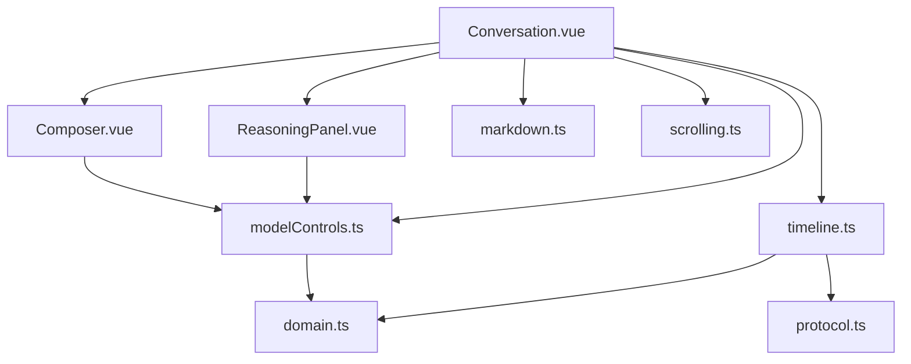
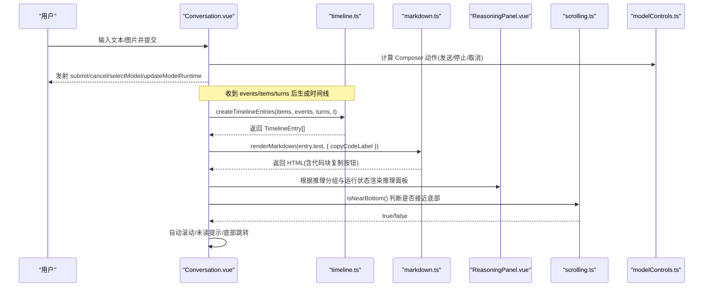
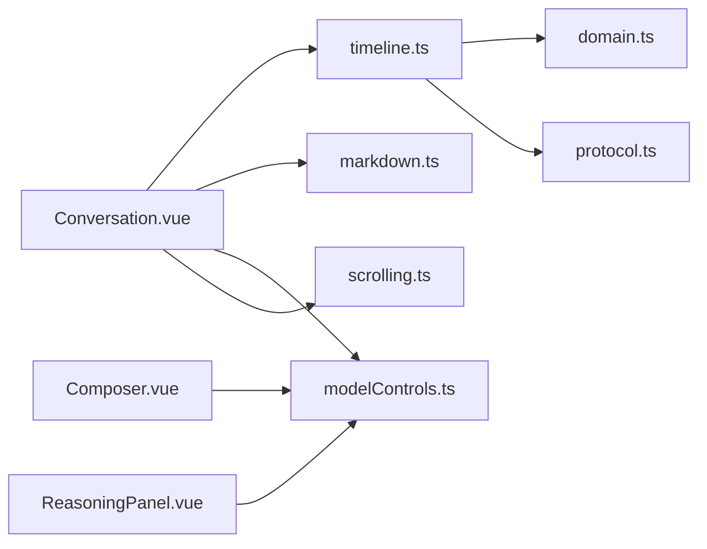

# 聊天对话组件

<cite>
**本文引用的文件**
- [Conversation.vue](file://src/renderer/components/Conversation.vue)
- [Composer.vue](file://src/renderer/components/Composer.vue)
- [ReasoningPanel.vue](file://src/renderer/components/ReasoningPanel.vue)
- [timeline.ts](file://src/renderer/timeline.ts)
- [markdown.ts](file://src/renderer/markdown.ts)
- [modelControls.ts](file://src/renderer/modelControls.ts)
- [scrolling.ts](file://src/renderer/scrolling.ts)
- [domain.ts](file://src/shared/domain.ts)
- [protocol.ts](file://src/shared/protocol.ts)
- [app.css](file://src/renderer/styles/app.css)
</cite>

## 更新摘要
**变更内容**
- 增强了时间线界面，支持紧凑的工具活动显示
- 工具事件现在合并为单个实时条目，在原地更新而不是创建单独的启动和结果行
- 使用 Map 基跟踪系统（toolEntryByCall）管理活跃的工具调用
- 过滤掉合成的模型调用行以避免重复显示
- 改进了视觉样式，使用柔和颜色和减少内边距以提高信息密度

## 目录
1. [简介](#简介)
2. [项目结构](#项目结构)
3. [核心组件与职责](#核心组件与职责)
4. [架构总览](#架构总览)
5. [详细组件分析](#详细组件分析)
6. [依赖关系分析](#依赖关系分析)
7. [性能与滚动优化](#性能与滚动优化)
8. [故障排查指南](#故障排查指南)
9. [结论](#结论)
10. [附录：使用示例与扩展指南](#附录使用示例与扩展指南)

## 简介
本文件为聊天对话组件的详细技术文档，聚焦 Conversation.vue 及其协作组件。内容涵盖消息时间线展示、流式响应处理、自动滚动机制、推理过程可视化、属性接口与事件发射、内部状态管理、Markdown 渲染、图片附件显示、代码块复制、滚动行为控制、未读消息检测与底部跳转、与 Composer 的集成方式，以及模型运行时状态管理。同时提供实际使用示例与自定义扩展指南，帮助开发者快速理解并扩展该组件。

## 项目结构
聊天对话功能由多个前端模块协同完成：
- 视图层：Conversation.vue（主容器）、Composer.vue（输入与附件）、ReasoningPanel.vue（推理面板）
- 数据与流程：timeline.ts（将 items/events/turns 转换为时间线条目）、markdown.ts（Markdown 渲染与代码块复制按钮注入）
- 能力与控制：modelControls.ts（推理模式选择、复制反馈、Composer 动作等）
- 滚动工具：scrolling.ts（判断是否接近底部）
- 领域与协议：domain.ts（类型定义）、protocol.ts（Agent 事件与请求类型）

**图表来源**
- [Conversation.vue:1-531](file://src/renderer/components/Conversation.vue#L1-L531)
- [Composer.vue:1-181](file://src/renderer/components/Composer.vue#L1-L181)
- [ReasoningPanel.vue:1-114](file://src/renderer/components/ReasoningPanel.vue#L1-L114)
- [timeline.ts:1-267](file://src/renderer/timeline.ts#L1-L267)
- [markdown.ts:1-116](file://src/renderer/markdown.ts#L1-L116)
- [modelControls.ts:1-149](file://src/renderer/modelControls.ts#L1-L149)
- [scrolling.ts:1-12](file://src/renderer/scrolling.ts#L1-L12)
- [domain.ts:1-319](file://src/shared/domain.ts#L1-L319)
- [protocol.ts:1-371](file://src/shared/protocol.ts#L1-L371)

章节来源
- [Conversation.vue:1-531](file://src/renderer/components/Conversation.vue#L1-L531)
- [timeline.ts:1-267](file://src/renderer/timeline.ts#L1-L267)
- [markdown.ts:1-116](file://src/renderer/markdown.ts#L1-L116)
- [modelControls.ts:1-149](file://src/renderer/modelControls.ts#L1-L149)
- [scrolling.ts:1-12](file://src/renderer/scrolling.ts#L1-L12)
- [domain.ts:1-319](file://src/shared/domain.ts#L1-L319)
- [protocol.ts:1-371](file://src/shared/protocol.ts#L1-L371)

## 核心组件与职责
- Conversation.vue：对话主容器，负责时间线渲染、流式更新、滚动控制、推理面板展示、模型运行时状态展示、与 Composer 集成、事件发射。
- Composer.vue：用户输入框、图片附件上传、发送/取消/停止动作。
- ReasoningPanel.vue：推理过程的原始或摘要展示，支持复制与运行中指示。
- timeline.ts：将底层 items/events/turns 合并成统一的时间线条目，处理流式消息拼接、工具调用、指标与进度。
- markdown.ts：轻量 Markdown 渲染，生成段落、列表、标题、行内代码与代码块，并为代码块注入复制按钮。
- modelControls.ts：推理能力与显示模式控制、复制反馈封装、Composer 动作计算、推理项分组等。
- scrolling.ts：判断滚动位置是否接近底部，用于自动滚动与未读提示。
- domain.ts / protocol.ts：统一的类型定义与 Agent 事件协议，确保前后端数据结构一致。

章节来源
- [Conversation.vue:1-531](file://src/renderer/components/Conversation.vue#L1-L531)
- [Composer.vue:1-181](file://src/renderer/components/Composer.vue#L1-L181)
- [ReasoningPanel.vue:1-114](file://src/renderer/components/ReasoningPanel.vue#L1-L114)
- [timeline.ts:1-267](file://src/renderer/timeline.ts#L1-L267)
- [markdown.ts:1-116](file://src/renderer/markdown.ts#L1-L116)
- [modelControls.ts:1-149](file://src/renderer/modelControls.ts#L1-L149)
- [scrolling.ts:1-12](file://src/renderer/scrolling.ts#L1-L12)
- [domain.ts:1-319](file://src/shared/domain.ts#L1-L319)
- [protocol.ts:1-371](file://src/shared/protocol.ts#L1-L371)

## 架构总览
Conversation.vue 作为中心协调者，接收 thread、items、turns、events、activeRuntime 等数据，通过 timeline.ts 生成可渲染的时间线条目；根据 activeModelProfile 与 reasoningDisplayMode 决定推理面板的显示策略；监听滚动事件实现自动滚动与未读提示；与 Composer 交互以提交消息或取消/停止运行；通过 modelControls.ts 管理推理能力与运行时状态展示。

**图表来源**
- [Conversation.vue:1-531](file://src/renderer/components/Conversation.vue#L1-L531)
- [timeline.ts:1-267](file://src/renderer/timeline.ts#L1-L267)
- [markdown.ts:1-116](file://src/renderer/markdown.ts#L1-L116)
- [ReasoningPanel.vue:1-114](file://src/renderer/components/ReasoningPanel.vue#L1-L114)
- [scrolling.ts:1-12](file://src/renderer/scrolling.ts#L1-L12)
- [modelControls.ts:1-149](file://src/renderer/modelControls.ts#L1-L149)

## 详细组件分析

### Conversation.vue：对话主容器
- 属性接口
  - thread?: ThreadSummary：当前会话摘要（标题、状态等）
  - items: Item[]：消息、推理、工具、变更等数据项
  - turns: TurnRecord[]：轮次记录（包含状态、指标、错误等）
  - events: AgentEvent[]：Agent 事件（如 message.delta、reasoning.raw.delta、tool.started、model.metrics、model.progress 等）
  - activeBusy: boolean：是否处于忙碌状态（影响 Composer 行为）
  - activeRuntime?: ThreadRuntimeState：当前线程的运行时状态（队列、运行、取消中等）
  - reasoningDisplayMode: ReasoningDisplayMode：推理显示模式（auto/raw/summary）
  - loading: boolean：加载状态
  - modelProfiles: ModelProfile[]：可用模型配置列表
  - activeModelProfileId?: string：当前激活的模型配置 ID
  - activeModelProfile?: ModelProfile：当前激活的模型配置对象
  - runtimeError?: string：运行时错误信息
  - t: Translator：翻译函数

- 事件发射
  - submit(text, attachments?)：提交消息与图片附件
  - cancel()：取消当前运行
  - openSettings()：打开设置（用于自定义推理配置提示）
  - selectModel(modelProfileId?)：切换模型
  - updateModelRuntime(patch)：更新推理模式与努力级别（mode/effort）

- 内部状态管理
  - timelineEntries：基于 items/events/turns 生成的时间线条目
  - reasoningGroups/reasoningGroupByTurn：推理项按 turnId 分组
  - reasoningPanelByEntryId：决定哪些消息条目旁显示推理面板
  - standaloneReasoningGroup：当无锚点消息时，独立显示推理面板
  - supportsVision：是否支持视觉（图像附件）
  - timelineRef/isPinnedToBottom/hasUnreadBelow/isAutoScrolling：滚动控制
  - messageCopyState：助手消息复制状态（idle/copied/failed）
  - reasoningMenuOpen/reasoningMenuRef/reasoningTriggerRef：推理菜单交互
  - copyResetTimers：复制状态重置定时器集合

- 消息渲染逻辑
  - 使用 renderMarkdown 将助手消息文本渲染为 HTML，并注入代码块复制按钮
  - 用户消息文本会移除"已上传图片"占位标记
  - 图片附件以 figure/img/figcaption 形式展示，带懒加载与名称说明

- 流式响应处理
  - timeline.ts 将 message.delta/answer.delta 等增量文本进行拼接，保持 live 标记
  - 同一 turnId 的连续助手消息会被合并，避免重复渲染
  - 推理项 raw/summary 增量也会按 mode 聚合

- 自动滚动与未读检测
  - 监听滚动事件，若接近底部则固定到底部并清除未读提示
  - 当内容变化且未固定在底部时，显示"↓"按钮以便跳转到最新
  - 在 activeBusy 变为 true 时自动滚动到底部

- 推理过程可视化
  - 根据推理显示模式与运行状态决定是否显示推理面板
  - 支持切换推理模式（toggle/effort/custom），并通过 updateModelRuntime 通知上层
  - 推理面板支持复制推理内容，并在运行中显示进度点

- 与 Composer 集成
  - 传递 activeBusy、activeRuntime、supportsVision、t
  - 监听 submit/cancel 事件，转发给父组件
  - 根据 activeRuntime 动态显示发送/停止/取消按钮

**更新** 工具活动显示已优化为紧凑模式，每个工具调用只显示一个实时更新的行为，提供更好的信息密度和用户体验。

章节来源
- [Conversation.vue:1-531](file://src/renderer/components/Conversation.vue#L1-L531)
- [timeline.ts:1-267](file://src/renderer/timeline.ts#L1-L267)
- [markdown.ts:1-116](file://src/renderer/markdown.ts#L1-L116)
- [modelControls.ts:1-149](file://src/renderer/modelControls.ts#L1-L149)
- [scrolling.ts:1-12](file://src/renderer/scrolling.ts#L1-L12)
- [domain.ts:1-319](file://src/shared/domain.ts#L1-L319)
- [protocol.ts:1-371](file://src/shared/protocol.ts#L1-L371)

### Composer.vue：输入与附件
- 属性接口
  - activeBusy: boolean：是否忙碌（禁用输入与附件）
  - activeRuntime?: ThreadRuntimeState：运行时状态（决定按钮行为）
  - supportsVision: boolean：是否支持图像附件
  - t: Translator：翻译函数

- 事件发射
  - submit(text, attachments?)：提交文本与图片附件
  - cancel()：取消当前运行

- 功能要点
  - 文本输入与键盘回车提交
  - 图片附件选择与校验（类型、大小、数量限制）
  - 根据 activeRuntime 动态显示发送/停止/取消按钮
  - 提交后清空输入与附件（受 activeBusy 控制）

章节来源
- [Composer.vue:1-181](file://src/renderer/components/Composer.vue#L1-L181)
- [modelControls.ts:113-121](file://src/renderer/modelControls.ts#L113-L121)
- [domain.ts:43-49](file://src/shared/domain.ts#L43-L49)

### ReasoningPanel.vue：推理面板
- 属性接口
  - raw?: ReasoningItem：原始推理内容
  - summary?: ReasoningItem：摘要推理内容
  - preference: ReasoningDisplayMode：显示偏好
  - running: boolean：是否正在运行
  - outputModes?: ReasoningOutputMode[]：支持的输出模式
  - turnId?: string：所属轮次 ID
  - t: Translator：翻译函数

- 功能要点
  - 根据 preference 与 available 内容选择展示 raw 或 summary
  - 运行中显示进度点
  - 支持复制推理内容，并提供失败提示
  - 不可用时显示相应提示

章节来源
- [ReasoningPanel.vue:1-114](file://src/renderer/components/ReasoningPanel.vue#L1-L114)
- [modelControls.ts:67-87](file://src/renderer/modelControls.ts#L67-L87)

### timeline.ts：时间线构建
- 输入
  - items: Item[]：消息、推理、工具、变更
  - events: AgentEvent[]：增量事件（message.delta、reasoning.*.delta、tool.started、tool.output、model.metrics、model.progress、turn.*）
  - turns: TurnRecord[]：轮次记录（含指标与结束状态）
  - t: Translator：翻译函数

- 输出
  - TimelineEntry[]：统一的时间线条目（message/reasoning/tool/metrics/progress）

- 关键逻辑
  - 合并同 turnId 的助手消息，保留 live 标记以支持流式更新
  - **工具调用合并显示**：使用 Map 基跟踪系统（toolEntryByCall）管理活跃的工具调用，将 tool.started 和 tool.output 事件合并为单个实时条目
  - **过滤合成模型调用**：过滤掉 `tool-${event.turnId}-model` 的合成模型调用行，避免与进度指示器重复显示
  - **原地更新机制**：工具调用在运行中实时更新状态和内容，而不是创建新的行
  - 指标在 turn 结束时追加，或在运行中实时更新
  - 进度条根据 model.progress 事件显示阶段（connecting/compressing/reasoning/answering）

**更新** 工具活动显示现已采用紧凑模式，每个工具调用只创建一个行并在运行中实时更新，提供更好的信息密度和更流畅的用户体验。

章节来源
- [timeline.ts:1-267](file://src/renderer/timeline.ts#L1-L267)
- [protocol.ts:48-65](file://src/shared/protocol.ts#L48-L65)
- [domain.ts:238-305](file://src/shared/domain.ts#L238-L305)

### markdown.ts：Markdown 渲染与代码块复制
- 功能
  - 解析段落、列表、标题、行内代码与代码块
  - 为每个代码块注入复制按钮（data-copy-code-button="true"）
  - 安全转义 HTML，防止 XSS

- 与 Conversation.vue 集成
  - 通过 v-html 渲染助手消息
  - 点击复制按钮时读取 pre/code 文本并复制到剪贴板，反馈状态

章节来源
- [markdown.ts:1-116](file://src/renderer/markdown.ts#L1-L116)
- [Conversation.vue:285-299](file://src/renderer/components/Conversation.vue#L285-L299)

### modelControls.ts：能力与控制
- 推理控制
  - reasoningControls(profile)：根据模型能力返回 toggle/effort/custom/hidden
  - groupReasoningItems(items)：按 turnId 分组推理项
  - shouldShowReasoningPanel(preference, items, running)：决定是否显示推理面板
  - selectReasoningContent(preference, items, context)：选择要展示的推理内容

- 复制反馈
  - copyTextWithFeedback(writeText, text)：封装剪贴板操作并返回状态

- Composer 动作
  - composerAction(runtime)：根据运行时状态返回 send/cancel/stop

章节来源
- [modelControls.ts:1-149](file://src/renderer/modelControls.ts#L1-L149)

### scrolling.ts：滚动工具
- 功能
  - isNearBottom(metrics, threshold)：判断是否接近底部（默认阈值 80px）

- 用途
  - Conversation.vue 在滚动事件中判断是否固定到底部
  - 自动滚动时使用 nextTick 与 requestAnimationFrame 确保稳定

章节来源
- [scrolling.ts:1-12](file://src/renderer/scrolling.ts#L1-L12)
- [Conversation.vue:224-266](file://src/renderer/components/Conversation.vue#L224-L266)

## 依赖关系分析
- Conversation.vue 依赖 timeline.ts 生成时间线，依赖 markdown.ts 渲染消息，依赖 modelControls.ts 控制推理与复制，依赖 scrolling.ts 控制滚动行为。
- Composer.vue 依赖 modelControls.ts 决定按钮行为。
- ReasoningPanel.vue 依赖 modelControls.ts 选择推理内容与复制。
- timeline.ts 依赖 domain.ts 与 protocol.ts 的类型定义，确保事件与数据结构一致性。

**图表来源**
- [Conversation.vue:1-531](file://src/renderer/components/Conversation.vue#L1-L531)
- [Composer.vue:1-181](file://src/renderer/components/Composer.vue#L1-L181)
- [ReasoningPanel.vue:1-114](file://src/renderer/components/ReasoningPanel.vue#L1-L114)
- [timeline.ts:1-267](file://src/renderer/timeline.ts#L1-L267)
- [markdown.ts:1-116](file://src/renderer/markdown.ts#L1-L116)
- [modelControls.ts:1-149](file://src/renderer/modelControls.ts#L1-L149)
- [scrolling.ts:1-12](file://src/renderer/scrolling.ts#L1-L12)
- [domain.ts:1-319](file://src/shared/domain.ts#L1-L319)
- [protocol.ts:1-371](file://src/shared/protocol.ts#L1-L371)

章节来源
- [Conversation.vue:1-531](file://src/renderer/components/Conversation.vue#L1-L531)
- [timeline.ts:1-267](file://src/renderer/timeline.ts#L1-L267)
- [modelControls.ts:1-149](file://src/renderer/modelControls.ts#L1-L149)
- [domain.ts:1-319](file://src/shared/domain.ts#L1-L319)
- [protocol.ts:1-371](file://src/shared/protocol.ts#L1-L371)

## 性能与滚动优化
- 流式消息合并：timeline.ts 对同一 turnId 的助手消息进行增量拼接，减少重渲染次数。
- **工具活动优化**：使用 Map 基跟踪系统避免重复的工具调用行，提高渲染性能。
- 自动滚动节流：Conversation.vue 使用 nextTick 与多次 requestAnimationFrame 确保滚动稳定，避免抖动。
- 未读提示：仅在非底部时显示"↓"按钮，降低干扰。
- 推理面板按需显示：根据推理显示模式与运行状态决定是否渲染，减少不必要的 DOM 节点。
- 图片懒加载：图片附件使用 loading="lazy"，提升首屏性能。
- **紧凑显示优化**：工具活动使用减少的内边距和柔和颜色，提高信息密度。

## 故障排查指南
- 复制失败
  - 现象：复制按钮显示失败状态
  - 可能原因：浏览器权限限制或剪贴板 API 不可用
  - 处理：检查页面是否在 HTTPS 环境，确认用户授权；查看 copyTextWithFeedback 返回值

- 推理面板不显示
  - 现象：推理面板未出现
  - 可能原因：推理显示模式为 auto 且无可用内容；或模型不支持推理
  - 处理：调整 reasoningDisplayMode；检查模型 capabilities.reasoning.inputMode/outputModes

- 滚动异常
  - 现象：自动滚动失效或未读提示不消失
  - 可能原因：timelineRef 未就绪或滚动事件被阻止
  - 处理：确保 timelineRef 存在；检查 handleTimelineScroll 与 isNearBottom 逻辑

- 图片附件无法上传
  - 现象：附件错误或无法显示
  - 可能原因：模型不支持视觉；图片类型/大小不符合限制
  - 处理：检查 supportsVision；确认图片类型与大小；查看 attachmentError 提示

- **工具活动显示问题**
  - 现象：工具调用显示不正确或重复
  - 可能原因：toolEntryByCall Map 跟踪异常或合成模型调用未被正确过滤
  - 处理：检查 timeline.ts 中的工具活动合并逻辑，确认 tool.started 和 tool.output 事件正确处理

章节来源
- [Conversation.vue:268-299](file://src/renderer/components/Conversation.vue#L268-L299)
- [ReasoningPanel.vue:39-54](file://src/renderer/components/ReasoningPanel.vue#L39-L54)
- [Composer.vue:68-101](file://src/renderer/components/Composer.vue#L68-L101)
- [modelControls.ts:89-99](file://src/renderer/modelControls.ts#L89-L99)
- [timeline.ts:137-181](file://src/renderer/timeline.ts#L137-L181)

## 结论
Conversation.vue 作为聊天对话的核心组件，整合了消息时间线、流式响应、推理可视化、滚动控制与模型运行时状态管理。通过与 timeline.ts、markdown.ts、modelControls.ts、scrolling.ts 的协作，实现了流畅的用户体验与可扩展的架构。最新的工具活动合并优化进一步提升了信息密度和用户体验，使复杂的工具调用过程更加直观易懂。开发者可基于现有接口与事件轻松扩展功能，如自定义推理面板、增强附件处理或优化滚动行为。

## 附录：使用示例与扩展指南

### 基本用法示例
- 在父组件中引入 Conversation.vue，并传入必要属性：
  - thread、items、turns、events、activeBusy、activeRuntime、reasoningDisplayMode、loading、modelProfiles、activeModelProfileId、activeModelProfile、runtimeError、t
- 监听事件：
  - submit：处理用户提交的消息与附件
  - cancel：处理取消请求
  - selectModel：切换模型
  - updateModelRuntime：更新推理模式与努力级别
  - openSettings：打开设置界面

示例路径参考
- [Conversation.vue:31-53](file://src/renderer/components/Conversation.vue#L31-L53)
- [Conversation.vue:505-512](file://src/renderer/components/Conversation.vue#L505-L512)

### 自定义扩展指南
- 扩展推理面板
  - 在 ReasoningPanel.vue 中增加新的输出模式或交互逻辑
  - 通过 modelControls.ts 的 selectReasoningContent 与 shouldShowReasoningPanel 控制显示

- 增强附件处理
  - 在 Composer.vue 中扩展附件类型与校验规则
  - 通过 TurnAttachment 类型扩展字段（需同步更新 domain.ts）

- 优化滚动行为
  - 调整 scrolling.ts 的阈值或添加更多滚动策略
  - 在 Conversation.vue 中结合 isNearBottom 实现更智能的滚动控制

- 集成新的事件类型
  - 在 protocol.ts 中定义新事件类型
  - 在 timeline.ts 中处理新事件的渲染逻辑

- **扩展工具活动显示**
  - 修改 timeline.ts 中的工具活动合并逻辑以支持新的工具类型
  - 调整 app.css 中的 .tool-row 样式以自定义工具活动的视觉效果
  - 扩展 toolEntryByCall Map 的逻辑以支持更复杂的工具调用场景

章节来源
- [Conversation.vue:1-531](file://src/renderer/components/Conversation.vue#L1-L531)
- [ReasoningPanel.vue:1-114](file://src/renderer/components/ReasoningPanel.vue#L1-L114)
- [Composer.vue:1-181](file://src/renderer/components/Composer.vue#L1-L181)
- [modelControls.ts:1-149](file://src/renderer/modelControls.ts#L1-L149)
- [scrolling.ts:1-12](file://src/renderer/scrolling.ts#L1-L12)
- [timeline.ts:137-181](file://src/renderer/timeline.ts#L137-L181)
- [app.css:855-868](file://src/renderer/styles/app.css#L855-L868)
- [protocol.ts:1-371](file://src/shared/protocol.ts#L1-L371)
- [domain.ts:1-319](file://src/shared/domain.ts#L1-L319)