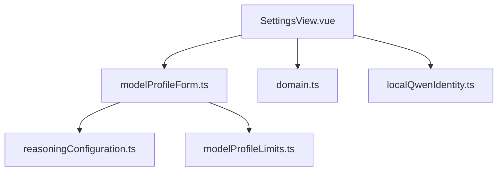
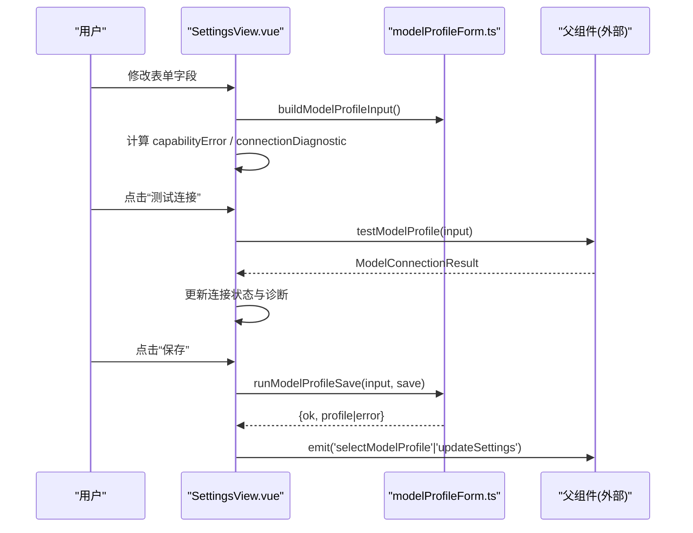
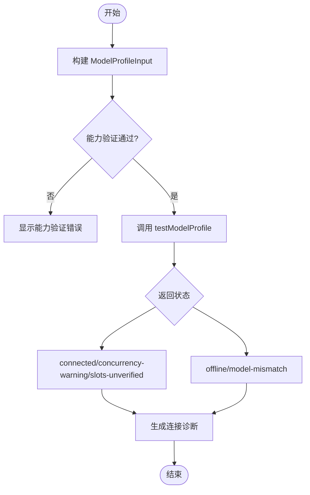
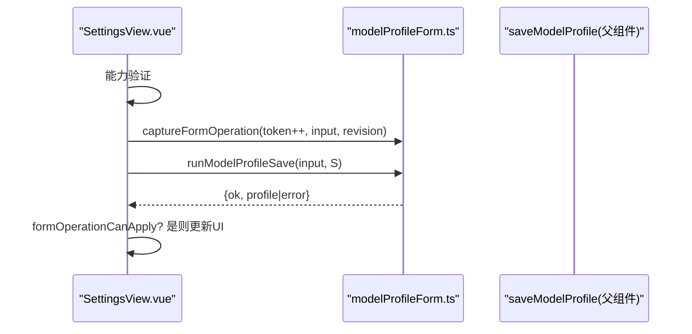
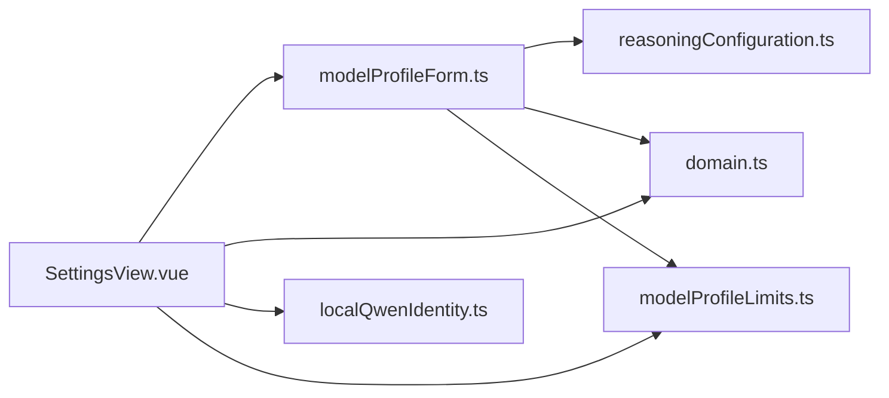

# 设置面板组件

<cite>
**本文引用的文件**
- [SettingsView.vue](file://src/renderer/components/SettingsView.vue)
- [modelProfileForm.ts](file://src/renderer/modelProfileForm.ts)
- [domain.ts](file://src/shared/domain.ts)
- [reasoningConfiguration.ts](file://src/shared/reasoningConfiguration.ts)
- [localQwenIdentity.ts](file://src/shared/localQwenIdentity.ts)
- [modelProfileLimits.ts](file://src/shared/modelProfileLimits.ts)
</cite>

## 目录
1. [简介](#简介)
2. [项目结构](#项目结构)
3. [核心组件](#核心组件)
4. [架构总览](#架构总览)
5. [详细组件分析](#详细组件分析)
6. [依赖关系分析](#依赖关系分析)
7. [性能考虑](#性能考虑)
8. [故障排查指南](#故障排查指南)
9. [结论](#结论)
10. [附录](#附录)

## 简介
本文件为“设置面板组件”的完整技术文档，聚焦于 SettingsView.vue 的配置界面能力：模型配置表单、连接测试、能力验证与配置保存。文档覆盖模型配置文件管理、API 密钥设置、并发限制与最大输出令牌调整、表单验证规则、错误处理与保存机制；并说明支持的模型类型、配置选项、数据绑定方式，以及默认值管理与最佳实践建议。

## 项目结构
设置面板由渲染层组件与共享领域类型、表单逻辑共同构成：
- 视图层：SettingsView.vue（Vue 单文件组件）
- 表单与校验：modelProfileForm.ts（构建输入、校验、指纹、诊断等）
- 领域模型：domain.ts（类型定义、配置项、连接结果等）
- 推理配置校验：reasoningConfiguration.ts（推理模式/协议/输入模式的组合约束）
- 本地 Qwen 识别：localQwenIdentity.ts（内置本地服务标识）
- 常量限制：modelProfileLimits.ts（默认与上限常量）

图表来源
- [SettingsView.vue:1-693](file://src/renderer/components/SettingsView.vue#L1-L693)
- [modelProfileForm.ts:1-380](file://src/renderer/modelProfileForm.ts#L1-L380)
- [domain.ts:1-319](file://src/shared/domain.ts#L1-L319)
- [reasoningConfiguration.ts:1-19](file://src/shared/reasoningConfiguration.ts#L1-L19)
- [modelProfileLimits.ts:1-3](file://src/shared/modelProfileLimits.ts#L1-L3)
- [localQwenIdentity.ts:1-21](file://src/shared/localQwenIdentity.ts#L1-L21)

章节来源
- [SettingsView.vue:1-693](file://src/renderer/components/SettingsView.vue#L1-L693)
- [modelProfileForm.ts:1-380](file://src/renderer/modelProfileForm.ts#L1-L380)
- [domain.ts:1-319](file://src/shared/domain.ts#L1-L319)

## 核心组件
- 设置面板主视图（SettingsView.vue）
  - 提供“通用/模型提供商/运行时”三个分区导航
  - 维护模型配置表单状态，支持新建、编辑、删除、保存、测试连接
  - 显示能力验证状态与诊断信息，联动本地 Qwen 提示
  - 暴露事件：语言切换、选择活动模型、更新运行时设置、删除/选择模型配置
- 表单与校验（modelProfileForm.ts）
  - 将表单值转换为 ModelProfileInput
  - 计算表单指纹、操作快照，避免竞态
  - 校验最大输出令牌、并发数、推理配置、自定义请求体、努力等级
  - 生成连接诊断文案
  - 根据协议推荐推理控制（OpenAI 使用 effort，Qwen 使用 toggle）
- 领域类型（domain.ts）
  - 定义 AppSettings、ModelProfile、ModelCapabilities、Reasoning*、连接结果等
- 推理配置校验（reasoningConfiguration.ts）
  - 校验 unsupported 输入模式仅在 disabled 模式下允许
- 本地 Qwen 识别（localQwenIdentity.ts）
  - 判断是否为内置本地 Qwen 服务配置，用于离线时给出启动命令提示
- 常量限制（modelProfileLimits.ts）
  - 默认最大输出令牌与上限

章节来源
- [SettingsView.vue:1-693](file://src/renderer/components/SettingsView.vue#L1-L693)
- [modelProfileForm.ts:1-380](file://src/renderer/modelProfileForm.ts#L1-L380)
- [domain.ts:1-319](file://src/shared/domain.ts#L1-L319)
- [reasoningConfiguration.ts:1-19](file://src/shared/reasoningConfiguration.ts#L1-L19)
- [localQwenIdentity.ts:1-21](file://src/shared/localQwenIdentity.ts#L1-L21)
- [modelProfileLimits.ts:1-3](file://src/shared/modelProfileLimits.ts#L1-L3)

## 架构总览
设置面板通过 props 接收模型配置列表、当前活动配置 ID、应用设置与翻译函数，并通过 emit 向父级回传用户操作。表单逻辑集中在 modelProfileForm.ts，负责数据转换与校验；领域类型在 domain.ts 中统一描述；连接诊断与本地 Qwen 提示在视图层组合展示。

图表来源
- [SettingsView.vue:250-344](file://src/renderer/components/SettingsView.vue#L250-L344)
- [modelProfileForm.ts:139-176](file://src/renderer/modelProfileForm.ts#L139-L176)
- [modelProfileForm.ts:256-265](file://src/renderer/modelProfileForm.ts#L256-L265)

## 详细组件分析

### 模型配置表单与数据绑定
- 表单字段
  - 基础信息：名称、Base URL、模型名、API Key、是否默认
  - 推理能力：推理模式（禁用/自动/启用）、推理协议（无/Qwen/OpenAI/自定义）、输入模式（不支持/开关/努力等级/自定义）、努力选项、当前努力、默认努力、原始输出、摘要输出
  - 运行参数：最大并发回合数、最大输出令牌
- 数据绑定
  - 使用 Vue reactive 对象 form 双向绑定各字段
  - 通过 computed 派生 effortOptions、capabilityError、connectionDiagnostic 等
  - 监听 activeModelProfileId 变化加载对应配置
  - 监听协议变化自动推荐输入模式与努力选项
  - 监听表单指纹变化重置连接测试状态
- 默认值与初始化
  - 新建草稿默认 Base URL、模型名、API Key、推理模式等见 resetForm
  - 最大输出令牌默认来自 DEFAULT_MAX_OUTPUT_TOKENS
  - 并发上限受模型能力中的 maxLimit 限制

章节来源
- [SettingsView.vue:68-130](file://src/renderer/components/SettingsView.vue#L68-L130)
- [SettingsView.vue:140-192](file://src/renderer/components/SettingsView.vue#L140-L192)
- [SettingsView.vue:223-248](file://src/renderer/components/SettingsView.vue#L223-L248)
- [modelProfileForm.ts:18-37](file://src/renderer/modelProfileForm.ts#L18-L37)
- [modelProfileForm.ts:182-214](file://src/renderer/modelProfileForm.ts#L182-L214)
- [modelProfileLimits.ts:1-3](file://src/shared/modelProfileLimits.ts#L1-L3)

### 连接测试与能力验证
- 连接测试流程
  - 从表单构建 input，捕获操作快照（token/fingerprint/revision），防止竞态
  - 调用父组件提供的 testModelProfile，更新连接状态与诊断
  - 若为本地 Qwen 服务且离线，附加启动命令提示
- 能力验证
  - 最大输出令牌必须在 [1, MAX_OUTPUT_TOKENS]
  - 并发数必须为整数且在 [1, maxConcurrencyLimit]
  - 推理配置需满足 reasoningConfigurationIssue 约束
  - 自定义请求体需为合法 JSON 对象
  - 努力等级需满足 effortValidationIssue 约束
- 诊断文案
  - 基于 ModelConnectionResult 的状态生成可读提示，包含模型名、客户端并发、服务槽位等信息

图表来源
- [SettingsView.vue:302-344](file://src/renderer/components/SettingsView.vue#L302-L344)
- [modelProfileForm.ts:73-103](file://src/renderer/modelProfileForm.ts#L73-L103)
- [modelProfileForm.ts:228-242](file://src/renderer/modelProfileForm.ts#L228-L242)
- [modelProfileForm.ts:283-296](file://src/renderer/modelProfileForm.ts#L283-L296)
- [reasoningConfiguration.ts:9-18](file://src/shared/reasoningConfiguration.ts#L9-L18)

章节来源
- [SettingsView.vue:98-130](file://src/renderer/components/SettingsView.vue#L98-L130)
- [SettingsView.vue:302-344](file://src/renderer/components/SettingsView.vue#L302-L344)
- [modelProfileForm.ts:73-103](file://src/renderer/modelProfileForm.ts#L73-L103)
- [modelProfileForm.ts:228-242](file://src/renderer/modelProfileForm.ts#L228-L242)
- [modelProfileForm.ts:283-296](file://src/renderer/modelProfileForm.ts#L283-L296)
- [reasoningConfiguration.ts:9-18](file://src/shared/reasoningConfiguration.ts#L9-L18)

### 配置保存机制与竞态保护
- 保存流程
  - 先进行能力验证，通过后构建 input
  - 使用 captureFormOperation 记录 token、profileId、fingerprint、revision
  - 调用 runModelProfileSave 执行保存，成功后加载已保存配置并提示成功
  - 若保存失败，显示错误消息
- 竞态保护
  - 每次保存/测试都会递增 token，并在回调中用 formOperationCanApply 校验是否为最新提交
  - 若表单已被修改或切换了配置，则忽略旧操作结果，避免覆盖新状态

图表来源
- [SettingsView.vue:274-300](file://src/renderer/components/SettingsView.vue#L274-L300)
- [modelProfileForm.ts:116-137](file://src/renderer/modelProfileForm.ts#L116-L137)
- [modelProfileForm.ts:256-265](file://src/renderer/modelProfileForm.ts#L256-L265)

章节来源
- [SettingsView.vue:274-300](file://src/renderer/components/SettingsView.vue#L274-L300)
- [modelProfileForm.ts:116-137](file://src/renderer/modelProfileForm.ts#L116-L137)
- [modelProfileForm.ts:256-265](file://src/renderer/modelProfileForm.ts#L256-L265)

### 支持的模型类型与配置选项
- 模型提供商类型
  - 仅支持 openai-compatible（由表单构建时固定 provider）
- 推理协议
  - none、qwen、openai、custom（自定义在当前 UI 禁用）
- 推理输入模式
  - unsupported、toggle、effort、custom
- 输出模式
  - raw、summary（通过复选框启用）
- 并发与令牌
  - 最大并发回合数：受模型能力 maxLimit 限制，默认最小为 1
  - 最大输出令牌：范围 [1, MAX_OUTPUT_TOKENS]，默认 DEFAULT_MAX_OUTPUT_TOKENS

章节来源
- [modelProfileForm.ts:139-176](file://src/renderer/modelProfileForm.ts#L139-L176)
- [domain.ts:96-106](file://src/shared/domain.ts#L96-L106)
- [domain.ts:130-148](file://src/shared/domain.ts#L130-L148)
- [modelProfileLimits.ts:1-3](file://src/shared/modelProfileLimits.ts#L1-L3)

### API 密钥设置与本地 Qwen 提示
- API Key
  - 表单提供密码输入框，保存时若为空则不写入 apiKey
  - 加载已保存配置时清空输入框但保留“是否已配置”的视觉提示
- 本地 Qwen
  - 当检测到本地 Qwen 服务配置且连接结果为 offline 时，附加本地启动命令提示

章节来源
- [SettingsView.vue:194-221](file://src/renderer/components/SettingsView.vue#L194-L221)
- [SettingsView.vue:317-330](file://src/renderer/components/SettingsView.vue#L317-L330)
- [localQwenIdentity.ts:1-21](file://src/shared/localQwenIdentity.ts#L1-L21)

### 运行时设置与行为
- 推理显示偏好：auto、raw、summary
- 指标显示：开关
- 上下文消息限制：10/20/50 三档
- 这些设置通过 updateSettings 事件向上提交

章节来源
- [SettingsView.vue:648-689](file://src/renderer/components/SettingsView.vue#L648-L689)
- [domain.ts:87-94](file://src/shared/domain.ts#L87-L94)
- [domain.ts:124-128](file://src/shared/domain.ts#L124-L128)

## 依赖关系分析
- SettingsView.vue 依赖
  - modelProfileForm.ts：表单构建、校验、诊断、保存封装
  - domain.ts：类型定义（AppSettings、ModelProfile、ModelCapabilities、Reasoning*、连接结果）
  - localQwenIdentity.ts：本地 Qwen 服务识别
  - modelProfileLimits.ts：默认与上限常量
- modelProfileForm.ts 依赖
  - reasoningConfiguration.ts：推理配置合法性检查
  - domain.ts：类型定义
  - modelProfileLimits.ts：最大输出令牌上限

图表来源
- [SettingsView.vue:1-35](file://src/renderer/components/SettingsView.vue#L1-L35)
- [modelProfileForm.ts:1-16](file://src/renderer/modelProfileForm.ts#L1-L16)
- [reasoningConfiguration.ts:1-19](file://src/shared/reasoningConfiguration.ts#L1-L19)
- [domain.ts:1-319](file://src/shared/domain.ts#L1-L319)
- [modelProfileLimits.ts:1-3](file://src/shared/modelProfileLimits.ts#L1-L3)
- [localQwenIdentity.ts:1-21](file://src/shared/localQwenIdentity.ts#L1-L21)

章节来源
- [SettingsView.vue:1-35](file://src/renderer/components/SettingsView.vue#L1-L35)
- [modelProfileForm.ts:1-16](file://src/renderer/modelProfileForm.ts#L1-L16)

## 性能考虑
- 表单变更触发频繁计算（如 effortOptions、capabilityError），已通过 computed 缓存优化
- 连接测试与保存采用 token + fingerprint + revision 的快照机制，避免重复或过时结果覆盖
- 并发限制与最大输出令牌限制可防止资源过度消耗
- 本地 Qwen 离线场景下，诊断提示减少无效重试

[本节为通用指导，无需特定文件引用]

## 故障排查指南
- 能力验证错误
  - 最大输出令牌超出范围：检查输入是否为整数且在 [1, MAX_OUTPUT_TOKENS]
  - 并发数非法：确保为整数且在 [1, maxConcurrencyLimit]
  - 推理配置冲突：unsupported 输入模式仅在 disabled 模式允许
  - 自定义请求体非法：需为合法 JSON 对象
  - 努力等级无效：当前努力与默认努力需在选项中
- 连接测试失败
  - 检查 Base URL、模型名、API Key 是否正确
  - 本地 Qwen 离线时，按提示启动本地服务
  - 查看诊断文案中的模型名、客户端并发与服务槽位信息
- 保存失败
  - 查看错误消息，确认网络或服务端可用性
  - 若表单被修改，重新填写后再次保存

章节来源
- [SettingsView.vue:98-130](file://src/renderer/components/SettingsView.vue#L98-L130)
- [SettingsView.vue:302-344](file://src/renderer/components/SettingsView.vue#L302-L344)
- [modelProfileForm.ts:228-242](file://src/renderer/modelProfileForm.ts#L228-L242)
- [modelProfileForm.ts:283-296](file://src/renderer/modelProfileForm.ts#L283-L296)
- [reasoningConfiguration.ts:9-18](file://src/shared/reasoningConfiguration.ts#L9-L18)

## 结论
SettingsView.vue 提供了完整的模型配置管理能力，涵盖表单输入、能力验证、连接测试与保存流程，并通过严格的校验与竞态保护保证数据一致性。结合领域类型与共享逻辑，该组件具备良好的可扩展性与可维护性。建议遵循默认值与限制，合理配置推理协议与输入模式，以获得稳定高效的模型交互体验。

[本节为总结，无需特定文件引用]

## 附录

### 配置模板与最佳实践
- 模板建议
  - OpenAI 兼容服务：选择协议 openai，输入模式 effort，提供努力选项（如 high、max），设置合理的最大并发与输出令牌
  - 本地 Qwen：协议 qwen，输入模式 toggle，注意离线时按提示启动服务
  - 自定义协议：谨慎使用，确保自定义请求体为合法 JSON 对象
- 最佳实践
  - 首次添加模型时先执行“测试连接”，确认连通性与能力后再保存
  - 根据服务端能力设置 maxConcurrency 与 maxOutputTokens，避免超限
  - 对推理输出模式按需开启 raw/summary，便于调试与展示
  - 定期清理未使用的模型配置，保持设置简洁

[本节为概念性内容，无需特定文件引用]