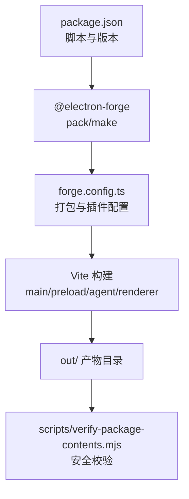
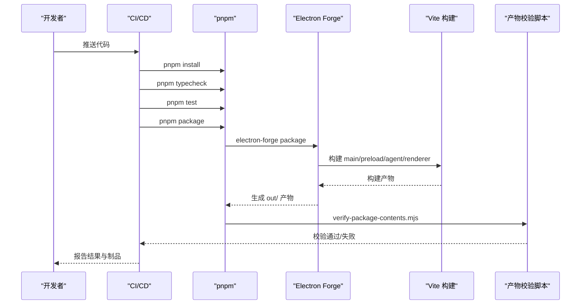
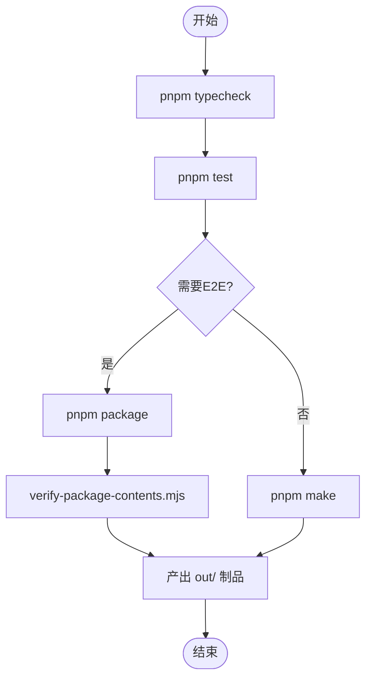
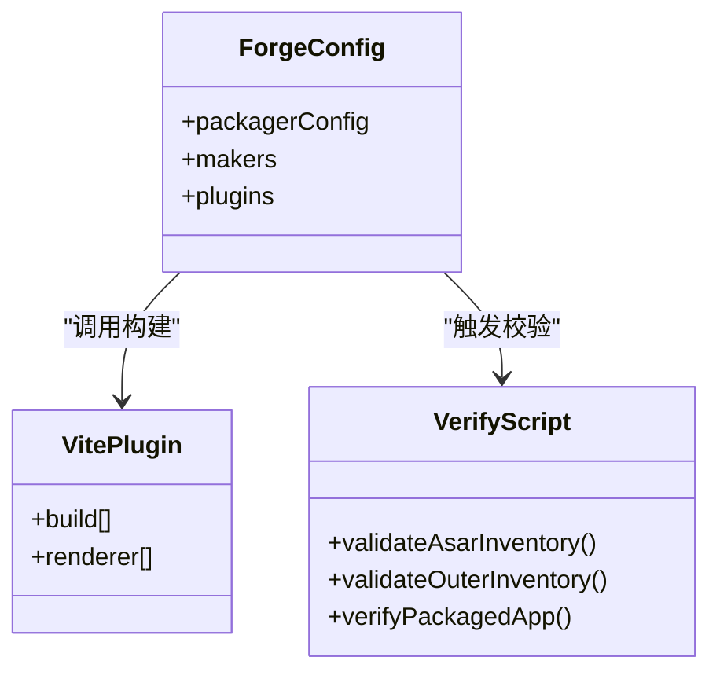
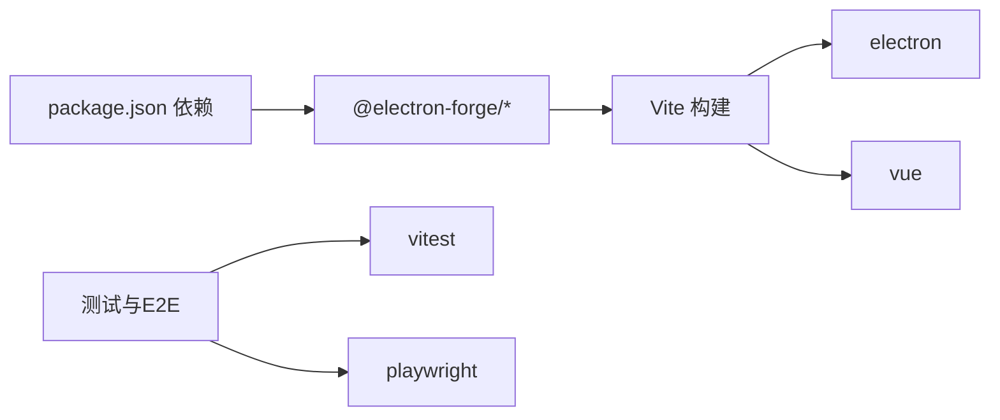

# 发布流程

<cite>
**本文引用的文件**
- [package.json](file://package.json)
- [forge.config.ts](file://forge.config.ts)
- [vite.main.config.ts](file://vite.main.config.ts)
- [vite.preload.config.ts](file://vite.preload.config.ts)
- [vite.agent.config.ts](file://vite.agent.config.ts)
- [vite.renderer.config.ts](file://vite.renderer.config.ts)
- [scripts/verify-package-contents.mjs](file://scripts/verify-package-contents.mjs)
- [README.md](file://README.md)
</cite>

## 目录
1. [简介](#简介)
2. [项目结构](#项目结构)
3. [核心组件](#核心组件)
4. [架构总览](#架构总览)
5. [详细组件分析](#详细组件分析)
6. [依赖关系分析](#依赖关系分析)
7. [性能与体积控制](#性能与体积控制)
8. [故障排查指南](#故障排查指南)
9. [结论](#结论)
10. [附录：平台与渠道发布要点](#附录：平台与渠道发布要点)

## 简介
本文件面向“Private AI Desktop”的发布流程，覆盖版本管理策略、语义化版本控制、变更日志生成建议、自动化发布流水线（代码检查、测试、构建打包、产物校验）、多平台发布要求（Windows、macOS、Linux）、数字签名与代码验证、安全性检查、回滚策略、热更新机制与版本兼容性管理，以及发布后的监控与反馈收集。文档基于仓库现有配置与脚本进行说明，并给出可落地的扩展建议。

## 项目结构
本项目使用 Electron + Vite + Vue 3 + TypeScript，通过 @electron-forge 组织构建与打包。关键入口与职责如下：
- package.json：定义应用元信息、版本号、脚本命令（开发、类型检查、测试、打包、制作分发包）。
- forge.config.ts：Electron Forge 配置，包含 ASAR、忽略规则、镜像缓存、Vite 插件与多平台 Maker。
- vite.*.config.ts：分别为主进程、预加载、Agent Worker、渲染进程的 Vite 构建配置。
- scripts/verify-package-contents.mjs：发布前对产物清单、ASAR 大小与内容白名单进行安全检查。
- README.md：提供运行、E2E 测试、本地模型运行时、架构与打包注意事项等说明。

图示来源
- [package.json:7-14](file://package.json#L7-L14)
- [forge.config.ts:9-46](file://forge.config.ts#L9-L46)
- [scripts/verify-package-contents.mjs:89-101](file://scripts/verify-package-contents.mjs#L89-L101)

章节来源
- [package.json:1-35](file://package.json#L1-L35)
- [forge.config.ts:1-50](file://forge.config.ts#L1-L50)
- [scripts/verify-package-contents.mjs:1-117](file://scripts/verify-package-contents.mjs#L1-L117)
- [README.md:104-121](file://README.md#L104-L121)

## 核心组件
- 版本与脚本入口
  - 应用名称与版本在 package.json 中集中声明，作为后续所有构建与分发的唯一来源。
  - 脚本提供 typecheck、test、package、make 等标准阶段，便于接入 CI。
- 构建与打包
  - @electron-forge 负责调用 Vite 构建各入口，并将资源打包为 ASAR。
  - 通过 MakerZIP 输出跨平台压缩包；如需安装器或签名，可在 makers 中扩展。
- 产物安全校验
  - verify-package-contents.mjs 限制 ASAR 最大字节数、白名单允许的文件路径、必填条目，并扫描外层目录禁止出现的敏感目录与文件类型。
- 多端构建
  - 通过 platform/arch 区分目标平台与架构，统一产出到 out/ 下对应目录。

章节来源
- [package.json:1-35](file://package.json#L1-L35)
- [forge.config.ts:9-46](file://forge.config.ts#L9-L46)
- [scripts/verify-package-contents.mjs:37-73](file://scripts/verify-package-contents.mjs#L37-L73)

## 架构总览
下图展示从代码提交到可分发产物的端到端流程，包括类型检查、单元测试、E2E、构建、打包与安全校验。

图示来源
- [package.json:7-14](file://package.json#L7-L14)
- [forge.config.ts:22-46](file://forge.config.ts#L22-L46)
- [scripts/verify-package-contents.mjs:89-116](file://scripts/verify-package-contents.mjs#L89-L116)

## 详细组件分析

### 版本管理与语义化版本控制
- 单一版本源：应用版本由 package.json 的 version 字段统一管理，所有构建与分发均读取该值。
- 语义化版本：建议遵循 MAJOR.MINOR.PATCH 约定，重大不兼容升级递增主版本，功能新增递增次版本，缺陷修复递增补丁版本。
- 变更日志：仓库未内置自动生成变更日志的工具链。建议在发布前维护 CHANGELOG.md，或使用工具（如 conventional-changelog）在 CI 中根据提交规范自动生成。
- 标签与分支：建议以 tag 标记发布版本，配合 Git 工作流（例如 release 分支）稳定化发布候选。

章节来源
- [package.json:1-14](file://package.json#L1-L14)

### 自动化发布流水线
- 代码检查：typecheck 使用 vue-tsc 与 tsc 双重类型检查，确保主进程、预加载、Agent、共享模块的类型一致性。
- 单元测试：test 使用 Vitest 执行大量单元与集成测试，覆盖路径安全、协议、数据库、模型能力、运行时脚本行为等。
- 端到端测试：test:e2e 先执行 package 打包，再启动 Playwright 对打包后的 Windows 可执行进行验收测试，覆盖并发、队列、复制、重启中断等行为。
- 构建与打包：package 调用 electron-forge package，随后执行 verify-package-contents.mjs 对产物进行安全校验；make 用于直接生成分发制品。
- 镜像与缓存：Forge 配置了 Electron 下载镜像与临时缓存目录，提升国内网络环境下的构建稳定性。

图示来源
- [package.json:7-14](file://package.json#L7-L14)
- [README.md:78-85](file://README.md#L78-L85)
- [scripts/verify-package-contents.mjs:89-116](file://scripts/verify-package-contents.mjs#L89-L116)

章节来源
- [package.json:7-14](file://package.json#L7-L14)
- [README.md:78-102](file://README.md#L78-L102)
- [forge.config.ts:10-21](file://forge.config.ts#L10-L21)

### 构建与打包细节
- 构建入口
  - 主进程：src/main.ts，外部化 electron、node:path。
  - 预加载：src/preload.ts，外部化 electron。
  - Agent Worker：src/agent/worker.ts，外部化 electron、node:sqlite。
  - 渲染进程：Vue 应用，按 vite.renderer.config.ts 构建。
- 打包策略
  - ASAR 启用，仅允许 package.json 与 .vite/** 产物进入 ASAR，限制体积上限。
  - 外层目录禁止出现 node_modules、tests、docs、model-runtime、models、.env 等敏感或冗余内容。
  - 必须包含 resources/app.asar 及若干必需文件。
- 平台支持
  - 当前 MakerZIP 同时支持 darwin、linux、win32，适用于跨平台压缩分发。

图示来源
- [forge.config.ts:9-46](file://forge.config.ts#L9-L46)
- [vite.main.config.ts:1-10](file://vite.main.config.ts#L1-L10)
- [vite.preload.config.ts:1-10](file://vite.preload.config.ts#L1-L10)
- [vite.agent.config.ts:1-10](file://vite.agent.config.ts#L1-L10)
- [vite.renderer.config.ts:1-7](file://vite.renderer.config.ts#L1-L7)
- [scripts/verify-package-contents.mjs:37-101](file://scripts/verify-package-contents.mjs#L37-L101)

章节来源
- [forge.config.ts:9-46](file://forge.config.ts#L9-L46)
- [vite.main.config.ts:1-10](file://vite.main.config.ts#L1-L10)
- [vite.preload.config.ts:1-10](file://vite.preload.config.ts#L1-L10)
- [vite.agent.config.ts:1-10](file://vite.agent.config.ts#L1-L10)
- [vite.renderer.config.ts:1-7](file://vite.renderer.config.ts#L1-L7)
- [scripts/verify-package-contents.mjs:1-117](file://scripts/verify-package-contents.mjs#L1-L117)

### 安全性检查与代码验证
- ASAR 白名单与大小限制：仅允许 package.json 与 .vite/**，且限制最大字节数，防止意外引入源码或大体积资源。
- 外层目录黑名单：禁止 node_modules、tests、docs、model-runtime、models、.env、.gguf 等，避免泄露敏感信息与无关文件。
- 必需文件校验：确保 resources/app.asar 存在，且包含主进程、预加载、Worker、渲染入口等关键文件。
- 本地模型运行时隔离：本地模型与运行时脚本独立于 Electron 应用，不应随应用打包。

章节来源
- [scripts/verify-package-contents.mjs:8-73](file://scripts/verify-package-contents.mjs#L8-L73)
- [README.md:16-35](file://README.md#L16-L35)
- [README.md:114-121](file://README.md#L114-L121)

### 不同平台的发布要求
- Windows
  - 可通过 pnpm make 生成可执行分发包；如需安装器或签名，可在 makers 中添加相应 maker 并在 CI 中注入签名凭据。
  - 本地模型运行时脚本在 Windows 上可能需要执行策略绕过，但应用本身不包含该脚本。
- macOS
  - 可使用 MakerZIP 产出 zip 包；若需上架 App Store 或进行公证签名，需扩展 makers 并配置证书与钥匙串。
- Linux
  - 同样适用 MakerZIP；如需 deb/rpm 安装包，可添加对应 maker 并在 CI 中完成签名与仓库发布。

章节来源
- [forge.config.ts:21-21](file://forge.config.ts#L21-L21)
- [README.md:22-35](file://README.md#L22-L35)

### 数字签名、代码验证与安全性步骤
- 应用签名
  - 当前配置未启用签名。建议在 CI 中为 Windows 可执行与 macOS 包添加签名步骤，并使用受信任证书。
- 完整性校验
  - 利用 verify-package-contents.mjs 在每次打包后强制校验产物结构与大小，阻断不安全或污染产物。
- 依赖与漏洞扫描
  - 建议在 CI 中加入依赖审计（如 npm audit 或等效工具），并对二进制与脚本进行哈希记录，便于追溯。

章节来源
- [scripts/verify-package-contents.mjs:37-73](file://scripts/verify-package-contents.mjs#L37-L73)
- [forge.config.ts:10-21](file://forge.config.ts#L10-L21)

### 发布回滚策略、热更新机制与版本兼容性管理
- 回滚策略
  - 将每个发布版本以 Git tag 固定，并保留对应制品；出现问题时快速切换至上一稳定 tag 并重新部署。
  - 对于桌面应用，建议提供“回退到上一版本”的安装包或静默回滚脚本。
- 热更新机制
  - 当前仓库未实现内置热更新。可在发布流程中增加“增量更新包”生成与校验步骤，或在应用内实现安全的远程更新检查与下载。
  - 若引入更新通道，需确保更新包的签名验证与完整性校验。
- 版本兼容性管理
  - 保持对外接口（如模型提供者协议）向后兼容；当破坏性变更发生时，递增主版本并提供迁移指引。
  - 在 E2E 中覆盖关键兼容性用例，确保新版本的连接、并发、队列与数据持久化行为一致。

章节来源
- [README.md:78-102](file://README.md#L78-L102)
- [package.json:7-14](file://package.json#L7-L14)

### 发布后的监控与反馈收集
- 应用内反馈
  - 建议在设置或帮助菜单中提供匿名反馈入口，收集错误堆栈、设备信息与复现步骤。
- 崩溃与遥测
  - 可集成崩溃上报服务（如 Sentry），仅在用户授权后开启遥测，严格脱敏隐私数据。
- 指标采集
  - 记录关键事件（启动耗时、模型连接成功率、请求失败率、内存占用），用于评估发布质量。
- 灰度发布
  - 对小范围用户先行发布新版本，观察指标后再全量推广。

[本节为通用实践建议，不直接分析具体文件]

## 依赖关系分析
- 构建依赖
  - @electron-forge/cli、@electron-forge/plugin-vite、@electron-forge/maker-zip、@electron-forge/plugin-auto-unpack-natives。
- 运行时依赖
  - electron、vue。
- 开发与测试依赖
  - vitest、playwright、typescript、vue-tsc、@types/node、vite、@vitejs/plugin-vue。

图示来源
- [package.json:16-33](file://package.json#L16-L33)
- [forge.config.ts:22-46](file://forge.config.ts#L22-L46)

章节来源
- [package.json:16-33](file://package.json#L16-L33)
- [forge.config.ts:22-46](file://forge.config.ts#L22-L46)

## 性能与体积控制
- ASAR 体积上限：限制为 2 MiB，避免过大资源影响加载与分发。
- 白名单策略：仅允许必要的构建产物进入 ASAR，减少攻击面与体积。
- 外部化依赖：主进程、预加载、Agent 将 electron 与部分 Node API 外部化，减小打包体积并提高启动速度。
- 缓存与镜像：使用 Electron 下载镜像与临时缓存，提升构建效率与稳定性。

章节来源
- [scripts/verify-package-contents.mjs:6-15](file://scripts/verify-package-contents.mjs#L6-L15)
- [vite.main.config.ts:4-8](file://vite.main.config.ts#L4-L8)
- [vite.preload.config.ts:4-8](file://vite.preload.config.ts#L4-L8)
- [vite.agent.config.ts:4-8](file://vite.agent.config.ts#L4-L8)
- [forge.config.ts:13-18](file://forge.config.ts#L13-L18)

## 故障排查指南
- 类型检查失败
  - 使用 pnpm typecheck 定位类型错误，优先修复主进程、预加载、Agent 与共享模块的类型问题。
- 单元测试失败
  - 使用 pnpm test 逐项排查，关注路径安全、协议、数据库、模型能力与运行时脚本行为。
- E2E 失败
  - 使用 pnpm test:e2e 复现问题，查看 Playwright 截图与诊断信息；必要时调整环境变量或模型服务端状态。
- 打包校验失败
  - 检查 verify-package-contents.mjs 的错误信息，确认 ASAR 大小、白名单与外层目录是否符合要求。
- 本地模型运行时异常
  - 使用 model-runtime 提供的 start/status/verify/stop 脚本独立验证服务状态与端口可用性。

章节来源
- [package.json:7-14](file://package.json#L7-L14)
- [README.md:78-102](file://README.md#L78-L102)
- [scripts/verify-package-contents.mjs:89-116](file://scripts/verify-package-contents.mjs#L89-L116)

## 结论
本项目已具备完善的本地构建、测试与打包能力，并通过严格的产物安全校验保障发布质量。建议在 CI 中完善类型检查、测试、打包与校验的全链路自动化，并根据平台需求扩展签名与安装器生成。对于热更新与监控反馈，可按需引入轻量方案，确保发布后可观测、可回滚、可演进。

[本节为总结性内容，不直接分析具体文件]

## 附录：平台与渠道发布要点
- Windows
  - 使用 pnpm make 生成可执行；如需 MSI/EXE 安装器与签名，扩展 makers 并在 CI 中注入证书。
  - 本地模型运行时脚本需在 Windows 上单独管理，不随应用打包。
- macOS
  - 使用 MakerZIP 产出 zip；如需 App Store 或公证签名，配置证书与钥匙串，并在 CI 中执行签名与公证。
- Linux
  - 使用 MakerZIP 产出 zip；如需 deb/rpm，添加对应 maker 并完成签名与仓库发布。
- 多渠道发布
  - 可将制品上传至内部仓库或公共渠道（如 GitHub Releases），并为每个版本生成 SHA 校验与签名摘要。

章节来源
- [forge.config.ts:21-21](file://forge.config.ts#L21-L21)
- [README.md:22-35](file://README.md#L22-L35)