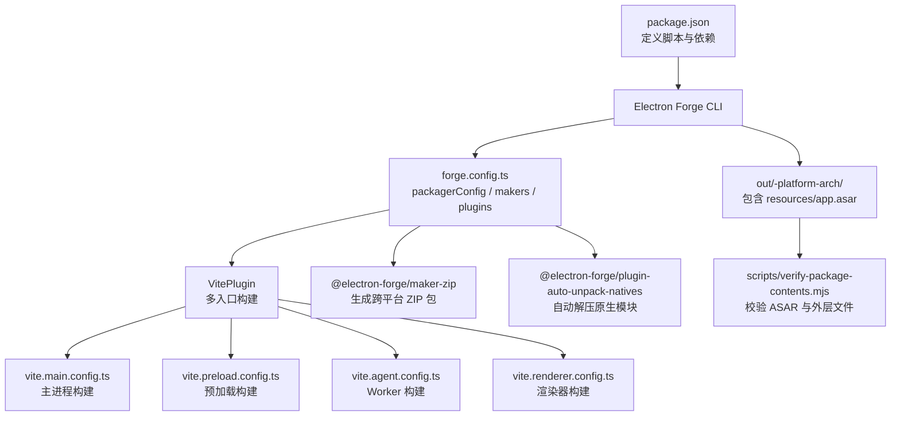
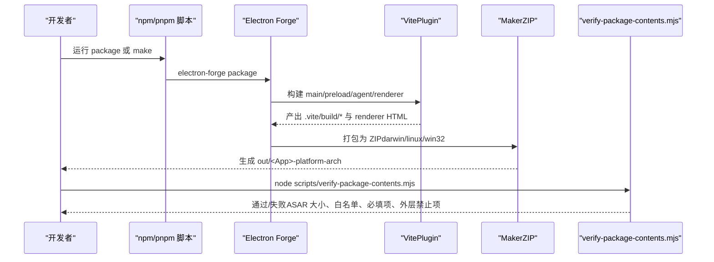
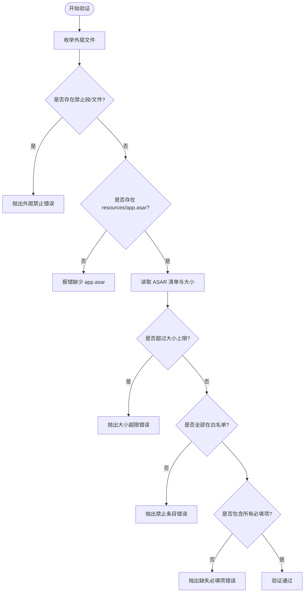
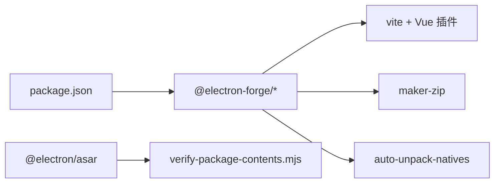

# 打包配置

<cite>
**本文引用的文件**
- [forge.config.ts](file://forge.config.ts)
- [package.json](file://package.json)
- [scripts/verify-package-contents.mjs](file://scripts/verify-package-contents.mjs)
- [tests/packageContents.test.ts](file://tests/packageContents.test.ts)
- [tests/modelRuntimePackaging.test.ts](file://tests/modelRuntimePackaging.test.ts)
- [vite.main.config.ts](file://vite.main.config.ts)
- [vite.renderer.config.ts](file://vite.renderer.config.ts)
</cite>

## 目录
1. [简介](#简介)
2. [项目结构](#项目结构)
3. [核心组件](#核心组件)
4. [架构总览](#架构总览)
5. [详细组件分析](#详细组件分析)
6. [依赖关系分析](#依赖关系分析)
7. [性能考量](#性能考量)
8. [故障排除指南](#故障排除指南)
9. [结论](#结论)
10. [附录](#附录)

## 简介
本文件面向 Electron Forge 的打包配置，系统性说明平台构建、资源组织、ASAR 包结构与内容验证策略。重点包括：
- 平台特定设置与产物输出
- 资源文件组织与外部依赖处理
- ASAR 包结构约束与安全校验
- 自定义打包钩子、签名与版本信息嵌入方式
- 打包故障排除与性能调优建议

## 项目结构
本项目使用 Electron Forge + Vite 进行多入口构建（主进程、预加载、Agent Worker、渲染器），并通过脚本对打包产物进行安全校验。关键路径与职责如下：
- 打包配置：forge.config.ts
- 构建脚本与命令：package.json
- 内容验证脚本：scripts/verify-package-contents.mjs
- Vite 构建配置：vite.*.config.ts
- 测试用例：tests/*（覆盖打包边界与内容策略）

图表来源
- [forge.config.ts:9-47](file://forge.config.ts#L9-L47)
- [package.json:7-14](file://package.json#L7-L14)
- [scripts/verify-package-contents.mjs:89-101](file://scripts/verify-package-contents.mjs#L89-L101)

章节来源
- [package.json:7-14](file://package.json#L7-L14)
- [forge.config.ts:9-47](file://forge.config.ts#L9-L47)

## 核心组件
- 打包器与插件
  - packagerConfig：启用 ASAR、忽略规则、下载缓存与镜像
  - makers：使用 MakerZIP 为 darwin/linux/win32 生成 ZIP 包
  - plugins：AutoUnpackNativesPlugin 自动处理原生模块；VitePlugin 管理多入口构建
- 构建产物
  - .vite/build/main.js、preload.js、worker.js
  - .vite/renderer/main_window/index.html
  - out/Private AI Desktop-{platform}-{arch}/resources/app.asar
- 内容验证
  - verify-package-contents.mjs：限制 ASAR 大小、白名单条目、必填项；检查外层目录禁止项并确认 app.asar 存在

章节来源
- [forge.config.ts:9-47](file://forge.config.ts#L9-L47)
- [scripts/verify-package-contents.mjs:6-101](file://scripts/verify-package-contents.mjs#L6-L101)
- [tests/packageContents.test.ts:8-55](file://tests/packageContents.test.ts#L8-L55)

## 架构总览
下图展示了从“执行打包”到“产物校验”的完整流程，以及各阶段的关键决策点。

图表来源
- [package.json:7-14](file://package.json#L7-L14)
- [forge.config.ts:9-47](file://forge.config.ts#L9-L47)
- [scripts/verify-package-contents.mjs:89-116](file://scripts/verify-package-contents.mjs#L89-L116)

## 详细组件分析

### 打包配置（forge.config.ts）
- ASAR 与忽略规则
  - 启用 ASAR 压缩应用代码
  - ignore 正则仅允许 package.json 与 .vite 相关路径进入 ASAR，其余源码、文档、测试等将被排除
- 下载与缓存
  - 将 Electron 下载缓存置于系统临时目录，避免污染项目根目录
  - 配置国内镜像加速下载
- 平台与产物
  - 使用 MakerZIP 为 darwin、linux、win32 生成 ZIP 包
- 插件
  - AutoUnpackNativesPlugin：自动解压原生模块，避免在 ASAR 中加载失败
  - VitePlugin：集中管理多入口构建（main、preload、agent worker、renderer）

章节来源
- [forge.config.ts:9-47](file://forge.config.ts#L9-L47)
- [tests/modelRuntimePackaging.test.ts:14-42](file://tests/modelRuntimePackaging.test.ts#L14-L42)

### 资源文件组织与外部依赖处理
- 资源组织
  - 主进程、预加载、Agent Worker 由 Vite 分别构建到 .vite/build
  - 渲染器页面位于 .vite/renderer/main_window/index.html
- 外部依赖
  - 主进程构建将 electron、node:path 标记为 external，不内联进产物，减小体积
  - 原生模块通过 AutoUnpackNativesPlugin 自动处理，无需手动配置
- 安全边界
  - 通过 ignore 与验证脚本双重保障：仅打包运行时必需资源，排除开发、测试、模型数据与敏感配置

章节来源
- [vite.main.config.ts:3-8](file://vite.main.config.ts#L3-L8)
- [forge.config.ts:9-47](file://forge.config.ts#L9-L47)
- [scripts/verify-package-contents.mjs:6-73](file://scripts/verify-package-contents.mjs#L6-L73)

### ASAR 包结构与内容验证
- ASAR 白名单与必填项
  - 允许的顶层路径：package.json 与 .vite 及其子路径
  - 必填项：package.json、main.js、preload.js、worker.js、渲染器 index.html
- ASAR 大小限制
  - 最大字节数常量用于防止过大的 ASAR 被打包
- 外层目录校验
  - 禁止若干目录段（如 tests、src、models、model-runtime、node_modules 等）
  - 禁止 .env、.env.*、.gguf 文件出现在外层
  - 必须存在 resources/app.asar

图表来源
- [scripts/verify-package-contents.mjs:6-101](file://scripts/verify-package-contents.mjs#L6-L101)
- [tests/packageContents.test.ts:8-55](file://tests/packageContents.test.ts#L8-L55)

章节来源
- [scripts/verify-package-contents.mjs:6-101](file://scripts/verify-package-contents.mjs#L6-L101)
- [tests/packageContents.test.ts:8-55](file://tests/packageContents.test.ts#L8-L55)

### 自定义打包钩子、签名配置与版本信息嵌入
- 自定义钩子
  - 当前 forge.config.ts 未声明 afterPack/beforePack 等钩子
  - 如需扩展，可在该文件中添加钩子函数以在打包前后执行自定义逻辑（例如注入额外资源、修改元数据）
- 签名配置
  - 当前未配置签名相关选项
  - 若需发布签名，可在 packagerConfig 中添加对应签名参数（不同平台有不同要求）
- 版本信息嵌入
  - 应用名称与版本来自 package.json 的 name、productName、version
  - 可通过 Forge 的 packagerConfig 进一步定制元数据（如图标、描述等）

章节来源
- [forge.config.ts:9-47](file://forge.config.ts#L9-L47)
- [package.json:1-14](file://package.json#L1-L14)

### 平台特定设置
- 目标平台
  - 通过 makers 指定 darwin、linux、win32
- 下载镜像
  - 配置 npmmirror 镜像加速 Electron 下载
- 缓存位置
  - 将 Electron 下载缓存放置于系统临时目录，避免污染仓库

章节来源
- [forge.config.ts:9-47](file://forge.config.ts#L9-L47)
- [tests/modelRuntimePackaging.test.ts:37-42](file://tests/modelRuntimePackaging.test.ts#L37-L42)

## 依赖关系分析
- 构建期依赖
  - @electron-forge/cli、@electron-forge/maker-zip、@electron-forge/plugin-vite、@electron-forge/plugin-auto-unpack-natives
  - vite、@vitejs/plugin-vue、electron
- 运行期依赖
  - vue（渲染层）
- 验证工具
  - @electron/asar（用于列出 ASAR 清单）

图表来源
- [package.json:16-33](file://package.json#L16-L33)
- [forge.config.ts:1-47](file://forge.config.ts#L1-L47)
- [scripts/verify-package-contents.mjs:1-6](file://scripts/verify-package-contents.mjs#L1-L6)

章节来源
- [package.json:16-33](file://package.json#L16-L33)
- [forge.config.ts:1-47](file://forge.config.ts#L1-L47)

## 性能考量
- 构建优化
  - 主进程构建将 electron、node:path 设为 external，减少产物体积
  - 使用 Vite 的多入口构建，按需编译各模块
- 打包优化
  - 启用 ASAR 压缩应用代码
  - 通过 ignore 严格限制进入 ASAR 的文件范围，避免无关资源
  - 将 Electron 下载缓存移至系统临时目录，提升磁盘 IO 与可维护性
- 体积控制
  - 通过内容验证脚本强制 ASAR 大小上限，防止意外膨胀
  - 定期审查依赖树，移除未使用的依赖

章节来源
- [vite.main.config.ts:3-8](file://vite.main.config.ts#L3-L8)
- [forge.config.ts:9-47](file://forge.config.ts#L9-L47)
- [scripts/verify-package-contents.mjs:6-53](file://scripts/verify-package-contents.mjs#L6-L53)

## 故障排除指南
- 常见错误与定位
  - “ASAR size limit exceeded”：ASAR 超出大小限制，检查是否有大文件或误入的资源
    - 参考：[scripts/verify-package-contents.mjs:37-40](file://scripts/verify-package-contents.mjs#L37-L40)
  - “Forbidden ASAR entry”：存在不在白名单的路径，检查 ignore 与构建产物
    - 参考：[scripts/verify-package-contents.mjs:42-46](file://scripts/verify-package-contents.mjs#L42-L46)
  - “Required packaged runtime entry is missing”：缺少必填项（main.js、preload.js、worker.js、index.html）
    - 参考：[scripts/verify-package-contents.mjs:47-51](file://scripts/verify-package-contents.mjs#L47-L51)
  - “Forbidden outer-package file”：外层出现禁止目录或文件（如 tests、src、.env、.gguf）
    - 参考：[scripts/verify-package-contents.mjs:55-68](file://scripts/verify-package-contents.mjs#L55-L68)
  - “Packaged application is missing resources/app.asar”：未生成 app.asar，检查打包流程
    - 参考：[scripts/verify-package-contents.mjs:69-71](file://scripts/verify-package-contents.mjs#L69-L71)
- 调试步骤
  - 先运行 electron-forge package，再执行 node scripts/verify-package-contents.mjs 查看具体错误
  - 检查 .vite/build 是否生成了预期文件
  - 核对 forge.config.ts 的 ignore 与 Vite 构建配置
- 回归测试
  - 使用 tests/packageContents.test.ts 与 tests/modelRuntimePackaging.test.ts 验证打包边界与策略

章节来源
- [scripts/verify-package-contents.mjs:37-71](file://scripts/verify-package-contents.mjs#L37-L71)
- [tests/packageContents.test.ts:8-55](file://tests/packageContents.test.ts#L8-L55)
- [tests/modelRuntimePackaging.test.ts:14-42](file://tests/modelRuntimePackaging.test.ts#L14-L42)

## 结论
本项目通过 Electron Forge + Vite 实现了清晰的多入口构建与严格的打包边界控制。ASAR 白名单、必填项与大小限制，结合外层目录禁止策略，有效保障了产物的安全性与可维护性。建议在后续迭代中：
- 按需引入自定义打包钩子以实现更灵活的产物定制
- 根据发布需求配置签名与元数据
- 持续监控依赖与构建产物体积，保持性能与安全的平衡

## 附录
- 打包命令
  - 构建并校验：pnpm package
  - 生成平台包：pnpm make
- 关键路径
  - 构建产物：.vite/build/*
  - 打包产物：out/Private AI Desktop-{platform}-{arch}/resources/app.asar
  - 验证脚本：scripts/verify-package-contents.mjs

章节来源
- [package.json:7-14](file://package.json#L7-L14)
- [forge.config.ts:9-47](file://forge.config.ts#L9-L47)
- [scripts/verify-package-contents.mjs:89-116](file://scripts/verify-package-contents.mjs#L89-L116)