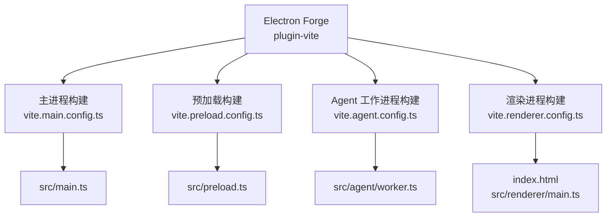
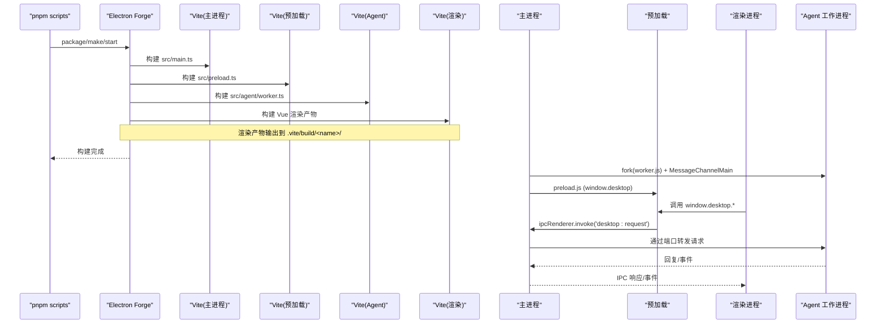
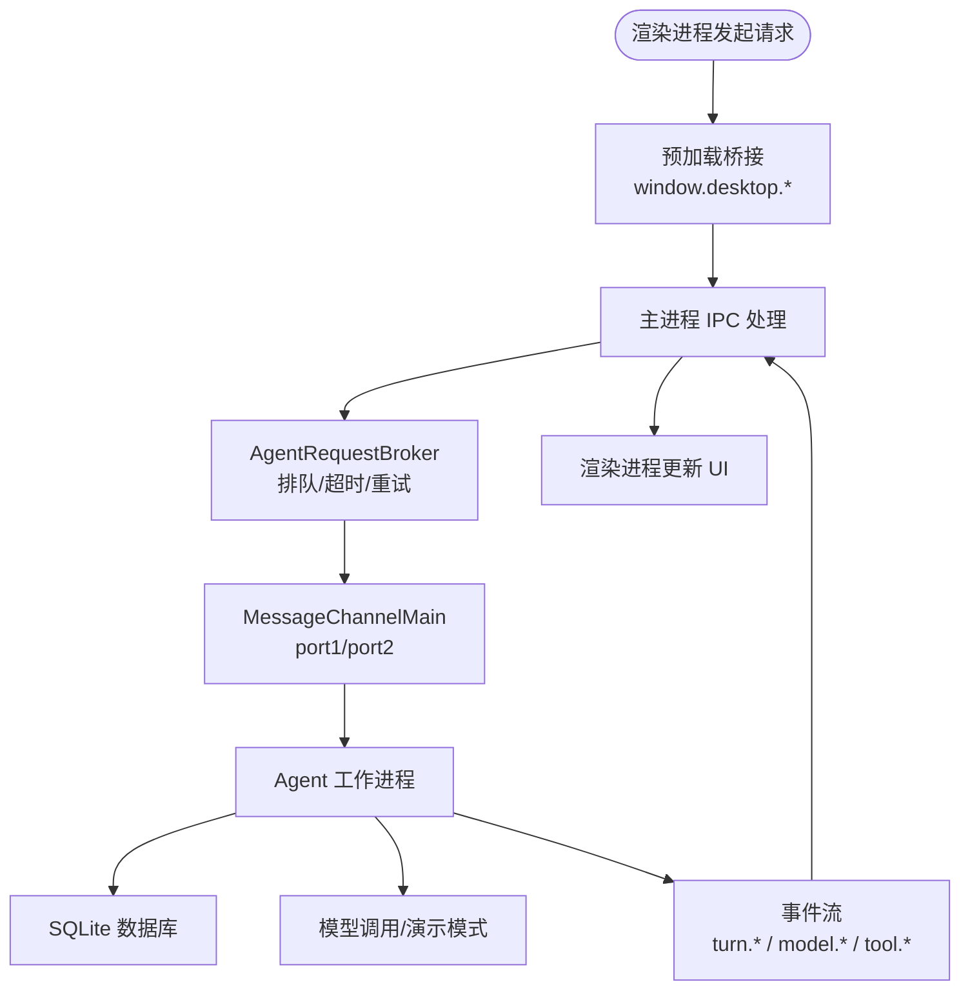
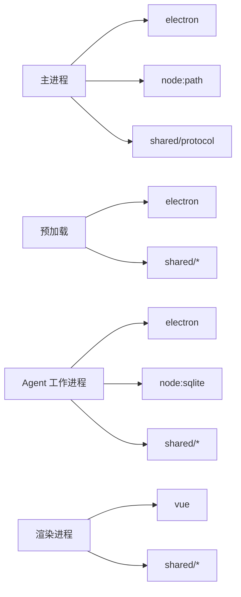

# 构建流程

<cite>
**本文引用的文件**
- [package.json](file://package.json)
- [forge.config.ts](file://forge.config.ts)
- [vite.main.config.ts](file://vite.main.config.ts)
- [vite.renderer.config.ts](file://vite.renderer.config.ts)
- [vite.agent.config.ts](file://vite.agent.config.ts)
- [vite.preload.config.ts](file://vite.preload.config.ts)
- [tsconfig.json](file://tsconfig.json)
- [tsconfig.node.json](file://tsconfig.node.json)
- [src/main.ts](file://src/main.ts)
- [src/preload.ts](file://src/preload.ts)
- [src/agent/worker.ts](file://src/agent/worker.ts)
- [src/shared/protocol.ts](file://src/shared/protocol.ts)
- [index.html](file://index.html)
</cite>

## 目录
1. [简介](#简介)
2. [项目结构](#项目结构)
3. [核心组件](#核心组件)
4. [架构总览](#架构总览)
5. [详细组件分析](#详细组件分析)
6. [依赖关系分析](#依赖关系分析)
7. [性能与优化](#性能与优化)
8. [故障排查](#故障排查)
9. [结论](#结论)

## 简介
本文件面向多进程 Electron + Vite 的构建流程，系统性说明主进程、渲染进程、Agent 工作进程与预加载脚本各自的独立构建配置；解释 TypeScript 编译选项、模块解析策略、资源处理流程与构建优化；阐述 Electron Forge 如何协调多个 Vite 配置的构建过程；并覆盖环境变量注入、代码分割策略、增量构建机制、性能优化建议与常见问题解决方案。

## 项目结构
本项目采用“按进程拆分”的构建组织方式：
- 主进程入口：src/main.ts
- 预加载脚本：src/preload.ts
- Agent 工作进程：src/agent/worker.ts
- 渲染进程（Vue）：src/renderer/*（由 index.html 引入）

Electron Forge 通过 @electron-forge/plugin-vite 统一编排四个构建目标，每个目标使用独立的 Vite 配置文件，分别控制外部依赖、插件与打包行为。

图表来源
- [forge.config.ts:22-45](file://forge.config.ts#L22-L45)
- [vite.main.config.ts:1-10](file://vite.main.config.ts#L1-L10)
- [vite.preload.config.ts:1-10](file://vite.preload.config.ts#L1-L10)
- [vite.agent.config.ts:1-10](file://vite.agent.config.ts#L1-L10)
- [vite.renderer.config.ts:1-7](file://vite.renderer.config.ts#L1-L7)
- [src/main.ts:1-10](file://src/main.ts#L1-L10)
- [src/preload.ts:1-5](file://src/preload.ts#L1-L5)
- [src/agent/worker.ts:1-20](file://src/agent/worker.ts#L1-L20)
- [index.html:1-17](file://index.html#L1-L17)

章节来源
- [package.json:7-14](file://package.json#L7-L14)
- [forge.config.ts:9-45](file://forge.config.ts#L9-L45)

## 核心组件
- 主进程（Node/Electron 环境）：负责应用生命周期、窗口管理、IPC 路由、启动 Agent 工作进程、安全策略等。
- 预加载脚本（隔离上下文桥接）：暴露受限 API 给渲染进程，屏蔽 Node/Electron 直接访问。
- Agent 工作进程（UtilityProcess）：承载 AI 对话调度、数据库、模型调用、事件流持久化与转发。
- 渲染进程（Vue 3）：用户界面与交互，通过预加载桥接调用桌面能力。

章节来源
- [src/main.ts:1-170](file://src/main.ts#L1-L170)
- [src/preload.ts:1-32](file://src/preload.ts#L1-L32)
- [src/agent/worker.ts:1-120](file://src/agent/worker.ts#L1-L120)
- [index.html:1-17](file://index.html#L1-L17)

## 架构总览
下图展示了 Electron Forge 如何协调四个 Vite 构建目标，以及运行时各进程的通信路径。

图表来源
- [forge.config.ts:22-45](file://forge.config.ts#L22-L45)
- [src/main.ts:19-54](file://src/main.ts#L19-L54)
- [src/main.ts:56-95](file://src/main.ts#L56-L95)
- [src/preload.ts:5-31](file://src/preload.ts#L5-L31)
- [src/agent/worker.ts:106-124](file://src/agent/worker.ts#L106-L124)

## 详细组件分析

### 主进程构建（vite.main.config.ts）
- 目标：将 src/main.ts 构建为 Node 可执行脚本，保留 electron 和 node:path 作为外部依赖，避免被打包进产物。
- 作用：确保主进程在 Electron 环境中运行，直接使用宿主提供的 API，减小包体并提升启动速度。
- 关键点：
  - external 列表排除 electron 与 node:path，保证运行时绑定系统库。
  - 与 Forge 配合，输出至 .vite/build/main.js，并被 package.json 的 main 字段引用。

章节来源
- [vite.main.config.ts:1-10](file://vite.main.config.ts#L1-L10)
- [package.json:6-6](file://package.json#L6-L6)
- [forge.config.ts:24-29](file://forge.config.ts#L24-L29)

### 预加载构建（vite.preload.config.ts）
- 目标：构建 src/preload.ts，仅暴露安全的桥接 API 给渲染进程。
- 作用：通过 contextBridge.exposeInMainWorld 暴露方法，屏蔽 Node/Electron 直接访问，增强安全性。
- 关键点：
  - external 排除 electron，保持最小体积。
  - 与主进程通过 IPC 通信，转发到 Agent。

章节来源
- [vite.preload.config.ts:1-10](file://vite.preload.config.ts#L1-L10)
- [src/preload.ts:1-32](file://src/preload.ts#L1-L32)
- [forge.config.ts:30-33](file://forge.config.ts#L30-L33)

### Agent 工作进程构建（vite.agent.config.ts）
- 目标：构建 src/agent/worker.ts，作为 UtilityProcess 运行的独立进程。
- 作用：集中实现对话调度、数据库操作、模型调用、事件流持久化与转发。
- 关键点：
  - external 排除 electron 与 node:sqlite，避免将原生模块打包进产物。
  - 通过 MessageChannelMain 与主进程建立双向通道，接收请求并返回结果或事件。

章节来源
- [vite.agent.config.ts:1-10](file://vite.agent.config.ts#L1-L10)
- [src/agent/worker.ts:1-120](file://src/agent/worker.ts#L1-L120)
- [forge.config.ts:34-37](file://forge.config.ts#L34-L37)

### 渲染进程构建（vite.renderer.config.ts）
- 目标：构建 Vue 3 渲染应用，启用 @vitejs/plugin-vue。
- 作用：提供 UI 层，通过 window.desktop 调用桌面能力。
- 关键点：
  - 使用 Vue 插件支持 .vue 单文件组件。
  - 由 index.html 引入 /src/renderer/main.ts，开发时由 Vite 服务提供，生产时加载构建产物。

章节来源
- [vite.renderer.config.ts:1-7](file://vite.renderer.config.ts#L1-L7)
- [index.html:13-15](file://index.html#L13-L15)
- [forge.config.ts:39-44](file://forge.config.ts#L39-L44)

### 多进程通信与数据流
- 主进程创建 BrowserWindow，设置 preload 指向构建后的 preload.js。
- 渲染进程通过 window.desktop.* 调用 IPC，主进程监听并转发到 Agent 工作进程。
- Agent 工作进程维护会话、队列、数据库与模型调用，并将事件与结果回传给主进程，再由主进程推送给渲染进程。

图表来源
- [src/main.ts:98-108](file://src/main.ts#L98-L108)
- [src/main.ts:131-144](file://src/main.ts#L131-L144)
- [src/preload.ts:5-31](file://src/preload.ts#L5-L31)
- [src/agent/worker.ts:106-124](file://src/agent/worker.ts#L106-L124)
- [src/agent/worker.ts:407-442](file://src/agent/worker.ts#L407-L442)

章节来源
- [src/main.ts:1-170](file://src/main.ts#L1-L170)
- [src/preload.ts:1-32](file://src/preload.ts#L1-L32)
- [src/agent/worker.ts:1-689](file://src/agent/worker.ts#L1-L689)
- [src/shared/protocol.ts:22-65](file://src/shared/protocol.ts#L22-L65)

### TypeScript 编译与模块解析
- 共享类型与渲染侧代码使用 tsconfig.json：
  - target: ES2022，module: ESNext，moduleResolution: Bundler，strict: true，sourceMap: true，isolatedModules: true。
  - include 包含 renderer 与 shared 目录。
- Node/构建侧代码使用 tsconfig.node.json：
  - extends tsconfig.json，module: NodeNext，moduleResolution: NodeNext，types: ["node", "electron"]，noEmit: true。
  - include 包含 forge.config.ts、vite.*.config.ts、main/preload/agent/shared 等。

这种双配置策略确保：
- 渲染侧使用浏览器友好的模块解析与类型环境。
- 构建与 Node 侧使用 NodeNext 语义，正确解析 Node 内置模块与 Electron 类型。

章节来源
- [tsconfig.json:1-19](file://tsconfig.json#L1-L19)
- [tsconfig.node.json:1-19](file://tsconfig.node.json#L1-L19)

### 环境变量注入
- 开发时：Vite 会为渲染进程注入 MAIN_WINDOW_VITE_DEV_SERVER_URL 与 MAIN_WINDOW_VITE_NAME，用于加载开发服务器地址与窗口名称。
- 构建时：可通过 Vite 的 defineConfig 或环境变量文件注入自定义变量，供各进程按需读取。
- 注意：主进程与 Agent 进程不自动获得 Vite 的环境变量注入，需显式在构建配置中定义或通过 Node 环境变量传递。

章节来源
- [src/main.ts:6-7](file://src/main.ts#L6-L7)
- [forge.config.ts:7-7](file://forge.config.ts#L7-L7)

### 代码分割与增量构建
- 代码分割：
  - 渲染进程：基于 Vite/Rollup 默认策略进行动态导入与分包，可按需拆分页面与组件。
  - 主进程/预加载/Agent：通常单体构建，便于快速启动与减少运行时开销；如需拆分可在各自 vite.*.config.ts 中配置 rollupOptions.output.manualChunks。
- 增量构建：
  - Vite 利用 Rollup 缓存与增量编译，修改少量源码时仅重新构建受影响模块。
  - Forge 每次触发构建会调用 Vite，但 Vite 内部会复用缓存，显著提升二次构建速度。

章节来源
- [vite.renderer.config.ts:1-7](file://vite.renderer.config.ts#L1-L7)
- [vite.main.config.ts:1-10](file://vite.main.config.ts#L1-L10)
- [vite.preload.config.ts:1-10](file://vite.preload.config.ts#L1-L10)
- [vite.agent.config.ts:1-10](file://vite.agent.config.ts#L1-L10)

### Electron Forge 协调机制
- Forge 通过 plugin-vite 的 build 数组声明主进程、预加载、Agent 三个 Node 端构建任务，renderer 数组声明渲染进程构建任务。
- packagerConfig.asar: true 将应用打包为 asar 归档，ignore 规则排除 .vite 目录与 package.json，避免重复打包。
- download.mirrorOptions 指定 Electron 下载镜像，加速依赖安装。

章节来源
- [forge.config.ts:9-24](file://forge.config.ts#L9-L24)
- [forge.config.ts:24-45](file://forge.config.ts#L24-L45)

## 依赖关系分析
- 主进程依赖：
  - electron（BrowserWindow、ipcMain、utilityProcess、MessageChannelMain）
  - node:path（路径拼接）
  - 共享协议与类型（./shared/protocol.js）
- 预加载依赖：
  - electron（contextBridge、ipcRenderer）
  - 共享类型（./shared/domain.js、./shared/protocol.js）
- Agent 工作进程依赖：
  - node:crypto（随机 ID）
  - node:sqlite（外部依赖，不被打包）
  - 共享协议与类型（./shared/*）
- 渲染进程依赖：
  - vue（UI 框架）
  - 共享类型（./shared/*）

图表来源
- [src/main.ts:1-5](file://src/main.ts#L1-L5)
- [src/preload.ts:1-4](file://src/preload.ts#L1-L4)
- [src/agent/worker.ts:1-25](file://src/agent/worker.ts#L1-L25)
- [vite.main.config.ts:4-8](file://vite.main.config.ts#L4-L8)
- [vite.preload.config.ts:4-8](file://vite.preload.config.ts#L4-L8)
- [vite.agent.config.ts:4-8](file://vite.agent.config.ts#L4-L8)
- [vite.renderer.config.ts:1-6](file://vite.renderer.config.ts#L1-L6)

章节来源
- [src/main.ts:1-170](file://src/main.ts#L1-L170)
- [src/preload.ts:1-32](file://src/preload.ts#L1-L32)
- [src/agent/worker.ts:1-689](file://src/agent/worker.ts#L1-L689)
- [src/shared/protocol.ts:1-371](file://src/shared/protocol.ts#L1-L371)

## 性能与优化
- 外部依赖最小化：
  - 主进程/预加载/Agent 均将 electron 与关键 Node 模块设为 external，避免重复打包，减小包体并提升启动速度。
- 资源与缓存：
  - 使用 asar 打包，结合 ignore 规则排除 .vite 目录，避免冗余文件进入产物。
  - 配置 Electron 下载镜像，加速依赖获取。
- 构建并行与增量：
  - Vite 的 Rollup 缓存与增量编译显著缩短二次构建时间。
  - 渲染进程可按需拆分模块，减少首屏体积。
- 运行时优化：
  - Agent 工作进程隔离计算密集型任务，避免阻塞主线程。
  - 使用消息通道与事件流，降低 IPC 开销。
- 建议：
  - 对大型第三方库使用 dynamic import 延迟加载。
  - 合理设置 maxConcurrency 与模型并发限制，避免资源争用。
  - 在生产构建开启压缩与 tree-shaking（Vite 默认已启用）。

[本节为通用指导，无需具体文件引用]

## 故障排查
- 主进程无法加载渲染页面：
  - 检查 MAIN_WINDOW_VITE_DEV_SERVER_URL 与 MAIN_WINDOW_VITE_NAME 是否正确注入。
  - 确认渲染构建产物路径与 loadFile 参数一致。
- 预加载脚本未生效：
  - 确认 BrowserWindow.webPreferences.preload 指向构建后的 preload.js。
  - 检查 contextBridge 暴露的方法是否被渲染进程正确调用。
- Agent 工作进程启动失败：
  - 检查 utilityProcess.fork 的路径与参数，确保 worker.js 存在且可执行。
  - 验证 MessageChannelMain 的 port 是否正确传递与 start。
- 数据库或 SQLite 问题：
  - 确认 node:sqlite 未被打包进产物，运行时由 Electron 提供。
  - 检查数据库路径与权限。
- 协议校验失败：
  - 使用 isDesktopRequest/isAgentEvent 等类型守卫函数定位非法消息结构。

章节来源
- [src/main.ts:56-95](file://src/main.ts#L56-L95)
- [src/main.ts:19-54](file://src/main.ts#L19-L54)
- [src/preload.ts:5-31](file://src/preload.ts#L5-L31)
- [src/agent/worker.ts:106-124](file://src/agent/worker.ts#L106-L124)
- [src/shared/protocol.ts:274-371](file://src/shared/protocol.ts#L274-L371)

## 结论
本项目通过 Electron Forge 与 Vite 的多配置协同，实现了主进程、预加载、Agent 工作进程与渲染进程的独立构建与高效协作。借助 TypeScript 的双配置策略、严格的协议校验与外部依赖最小化，确保了构建产物的小型化与运行时的稳定性。遵循本文的性能优化建议与故障排查指南，可进一步提升开发与发布效率，保障应用在多平台下的可靠运行。