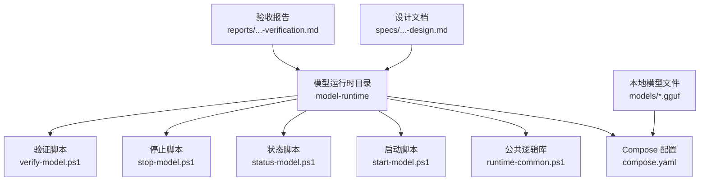
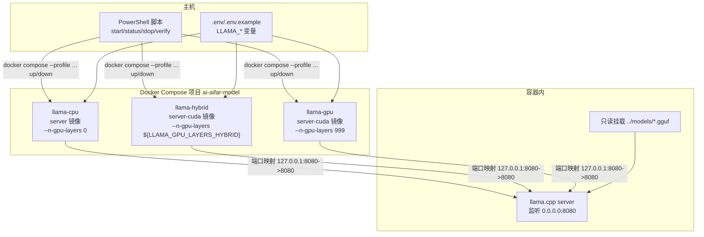
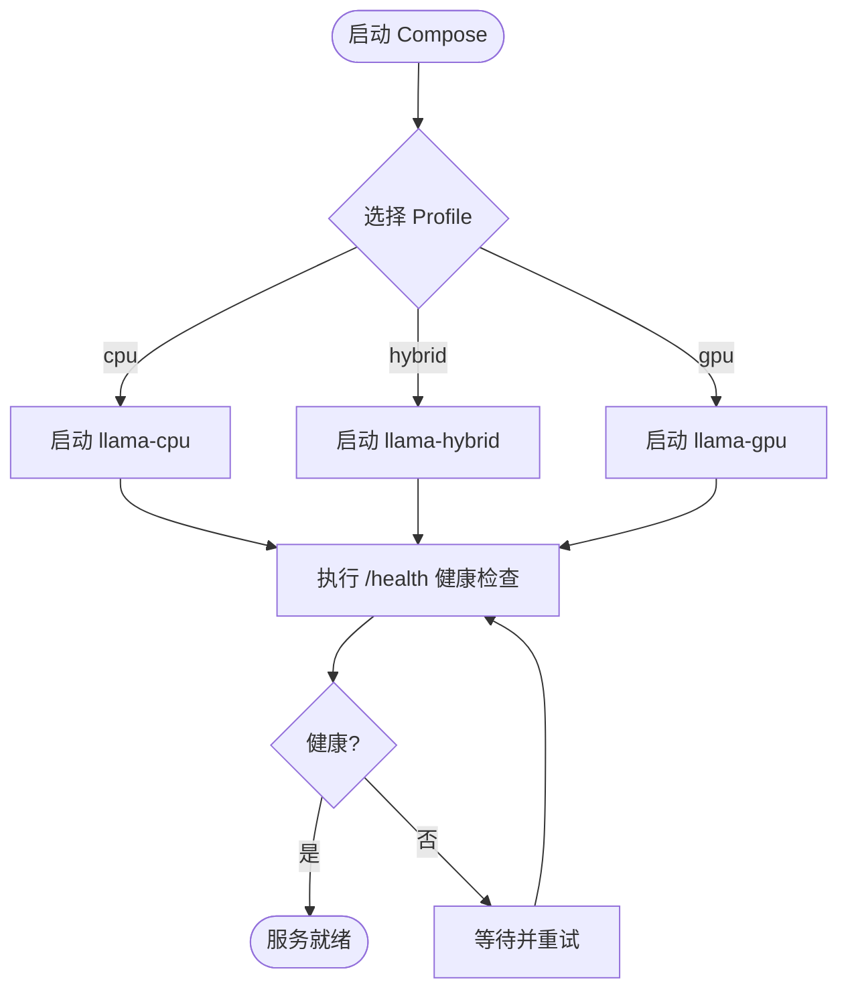
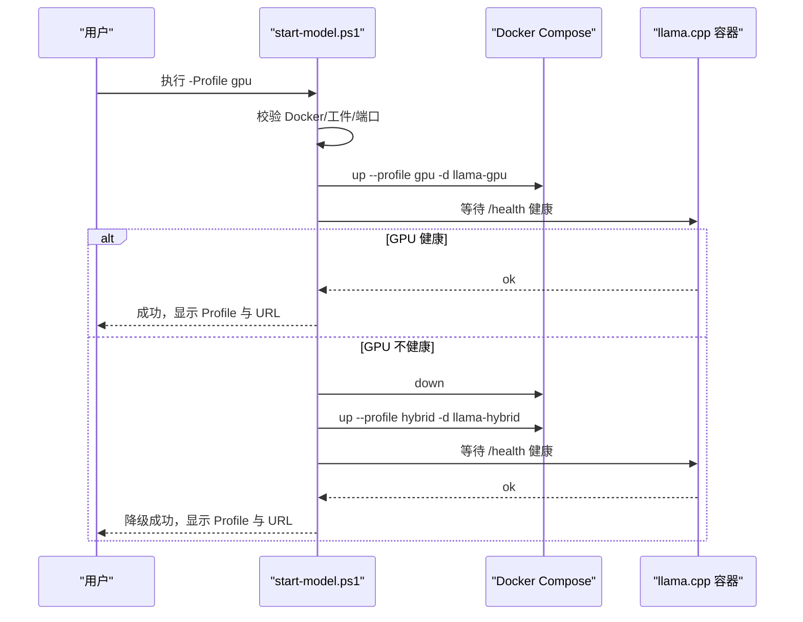
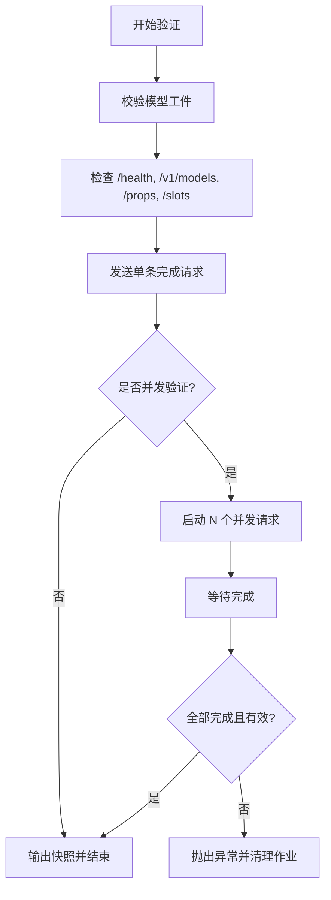
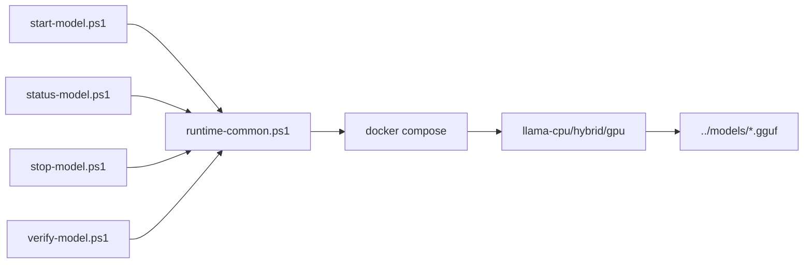

# 模型运行时部署

<cite>
**本文引用的文件**
- [compose.yaml](file://model-runtime/compose.yaml)
- [runtime-common.ps1](file://model-runtime/runtime-common.ps1)
- [start-model.ps1](file://model-runtime/start-model.ps1)
- [status-model.ps1](file://model-runtime/status-model.ps1)
- [stop-model.ps1](file://model-runtime/stop-model.ps1)
- [verify-model.ps1](file://model-runtime/verify-model.ps1)
- [README.md](file://model-runtime/README.md)
- [models/README.md](file://models/README.md)
- [2026-08-18-local-qwen-runtime-direct-connection-design.md](file://docs/superpowers/specs/2026-08-18-local-qwen-runtime-direct-connection-design.md)
- [2026-08-18-local-qwen-runtime-verification.md](file://docs/superpowers/reports/2026-08-18-local-qwen-runtime-verification.md)
</cite>

## 目录
1. [简介](#简介)
2. [项目结构](#项目结构)
3. [核心组件](#核心组件)
4. [架构总览](#架构总览)
5. [详细组件分析](#详细组件分析)
6. [依赖关系分析](#依赖关系分析)
7. [性能与资源调优](#性能与资源调优)
8. [故障排除指南](#故障排除指南)
9. [结论](#结论)
10. [附录](#附录)

## 简介
本仓库提供独立的本地模型运行时，基于 Docker Compose 运行 llama.cpp 服务，暴露 OpenAI 兼容接口于本机回环地址。默认绑定端口为 127.0.0.1:8080，通过三个互斥的 Compose Profile（cpu、hybrid、gpu）适配不同硬件能力。PowerShell 脚本提供启动、状态检查、停止与健康验证等运维能力，并内置 GPU 失败时的自动降级策略。

## 项目结构
- model-runtime：独立运行时目录，包含 Compose 配置、环境变量示例、PowerShell 生命周期脚本与说明文档。
- models：存放本地 GGUF 模型与多模态投影文件的只读挂载源（被 .gitignore 忽略）。
- docs/superpowers：设计规格与验收报告，描述运行时架构、并发与脚本行为边界。

图表来源
- [compose.yaml:1-127](file://model-runtime/compose.yaml#L1-L127)
- [runtime-common.ps1:1-294](file://model-runtime/runtime-common.ps1#L1-L294)
- [start-model.ps1:1-154](file://model-runtime/start-model.ps1#L1-L154)
- [status-model.ps1:1-18](file://model-runtime/status-model.ps1#L1-L18)
- [stop-model.ps1:1-16](file://model-runtime/stop-model.ps1#L1-L16)
- [verify-model.ps1:1-90](file://model-runtime/verify-model.ps1#L1-L90)

章节来源
- [README.md:1-53](file://model-runtime/README.md#L1-L53)
- [2026-08-18-local-qwen-runtime-direct-connection-design.md:71-112](file://docs/superpowers/specs/2026-08-18-local-qwen-runtime-direct-connection-design.md#L71-L112)

## 核心组件
- Compose 服务定义：cpu、hybrid、gpu 三个 Profile，分别对应 CPU 推理、混合层卸载与全 GPU 加速；均挂载同一组模型文件并以只读方式映射到容器内。
- 环境变量与容量控制：通过 .env 或 .env.example 暴露 LLAMA_PARALLEL、LLAMA_CTX_SIZE、LLAMA_N_PREDICT、LLAMA_GPU_LAYERS_HYBRID 等参数，控制并发槽位、上下文总量、生成上限与 GPU 层数。
- PowerShell 生命周期脚本：封装 Docker Compose 调用、端口占用检测、模型工件校验、健康检查与快照采集，并提供 GPU 失败时的一次性 hybrid 降级。
- 健康与监控：容器内置 /health 健康检查；脚本进一步访问 /v1/models、/props、/slots 进行深度校验，并通过 Metrics 端点观察指标。

章节来源
- [compose.yaml:4-127](file://model-runtime/compose.yaml#L4-L127)
- [runtime-common.ps1:15-41](file://model-runtime/runtime-common.ps1#L15-L41)
- [runtime-common.ps1:54-86](file://model-runtime/runtime-common.ps1#L54-L86)
- [runtime-common.ps1:170-294](file://model-runtime/runtime-common.ps1#L170-L294)
- [README.md:30-49](file://model-runtime/README.md#L30-L49)

## 架构总览
下图展示 Compose 中三个服务的镜像、网络绑定、卷挂载与关键参数差异，以及脚本对容器的编排流程。

图表来源
- [compose.yaml:4-127](file://model-runtime/compose.yaml#L4-L127)
- [runtime-common.ps1:67-86](file://model-runtime/runtime-common.ps1#L67-L86)

章节来源
- [2026-08-18-local-qwen-runtime-direct-connection-design.md:71-90](file://docs/superpowers/specs/2026-08-18-local-qwen-runtime-direct-connection-design.md#L71-L90)

## 详细组件分析

### Compose 配置与服务定义
- 服务名称与镜像
  - llama-cpu：使用标准 server 镜像，GPU 层数为 0。
  - llama-hybrid：使用 CUDA server 镜像，按环境变量设置部分层卸载。
  - llama-gpu：使用 CUDA server 镜像，尽可能将全部支持层卸载至 GPU，并启用 Flash Attention 与量化 K/V 缓存。
- 网络与端口
  - 所有服务仅绑定 127.0.0.1:8080:8080，确保仅本机可访问。
- 数据卷
  - 将 ../models 下的两个 GGUF 文件以只读方式挂载到容器内固定路径，供 llama.cpp 加载。
- 健康检查
  - 每个服务均配置 HTTP /health 健康检查，间隔、超时、重试与启动宽限期已设定。
- 环境变量注入
  - 通过 --env-file 加载 .env 或 .env.example，传递 LLAMA_PARALLEL、LLAMA_CTX_SIZE、LLAMA_N_PREDICT、LLAMA_GPU_LAYERS_HYBRID 等参数。

图表来源
- [compose.yaml:4-127](file://model-runtime/compose.yaml#L4-L127)

章节来源
- [compose.yaml:4-127](file://model-runtime/compose.yaml#L4-L127)
- [README.md:8-39](file://model-runtime/README.md#L8-L39)

### PowerShell 脚本功能详解

#### 启动脚本 start-model.ps1
- 参数：-Profile gpu|hybrid|cpu，默认 gpu。
- 前置检查：
  - 校验 Docker CLI 与守护进程可用性。
  - 校验模型工件存在、大小与 SHA-256 一致。
  - 检测 127.0.0.1:8080 是否被其他进程占用。
- 生命周期管理：
  - 若已有同项目且端口占用的旧实例，先安全停止该 Compose 项目（不删除卷）。
  - 启动指定 Profile，并等待严格的健康快照（/health、/v1/models、/props、/slots）。
- GPU 降级：
  - 当 GPU 启动失败且日志中出现显存不足或 CUDA 错误等证据时，自动停止当前项目并尝试一次 hybrid Profile。
- 输出：最终活跃 Profile 与 API 基地址。

图表来源
- [start-model.ps1:105-149](file://model-runtime/start-model.ps1#L105-L149)
- [runtime-common.ps1:43-86](file://model-runtime/runtime-common.ps1#L43-L86)
- [runtime-common.ps1:154-168](file://model-runtime/runtime-common.ps1#L154-L168)

章节来源
- [start-model.ps1:1-154](file://model-runtime/start-model.ps1#L1-L154)
- [runtime-common.ps1:43-86](file://model-runtime/runtime-common.ps1#L43-L86)
- [2026-08-18-local-qwen-runtime-direct-connection-design.md:114-123](file://docs/superpowers/specs/2026-08-18-local-qwen-runtime-direct-connection-design.md#L114-L123)

#### 状态脚本 status-model.ps1
- 校验 Docker 可用后，获取当前拥有 127.0.0.1:8080 的 Compose 项目实例信息。
- 输出项目名、Profile、状态、主机、端口、健康、模型标识与槽位数。

章节来源
- [status-model.ps1:1-18](file://model-runtime/status-model.ps1#L1-L18)
- [runtime-common.ps1:104-168](file://model-runtime/runtime-common.ps1#L104-L168)

#### 停止脚本 stop-model.ps1
- 仅停止当前 Compose 项目的所有服务，不删除卷，不影响其他容器。

章节来源
- [stop-model.ps1:1-16](file://model-runtime/stop-model.ps1#L1-L16)

#### 验证脚本 verify-model.ps1
- 工件校验：再次检查模型文件大小与哈希。
- 健康与发现：访问 /health、/v1/models、/props、/slots 并断言预期值。
- 完成请求：发送一条非思考模式的中文完成请求，要求返回非空最终答案。
- 并发验证：可选并发请求数，使用后台作业并行发起并完成，统计响应数量与内容有效性。

图表来源
- [verify-model.ps1:12-81](file://model-runtime/verify-model.ps1#L12-L81)
- [runtime-common.ps1:170-294](file://model-runtime/runtime-common.ps1#L170-L294)

章节来源
- [verify-model.ps1:1-90](file://model-runtime/verify-model.ps1#L1-L90)
- [runtime-common.ps1:170-294](file://model-runtime/runtime-common.ps1#L170-L294)

### 环境要求、端口与资源限制
- 环境要求
  - 安装 Docker CLI 且守护进程可达。
  - 具备足够的磁盘空间存放 GGUF 模型文件。
  - GPU 模式需要宿主机的 Docker GPU 支持。
- 端口配置
  - 仅绑定 127.0.0.1:8080，避免外部网络暴露。
- 资源与容量
  - LLAMA_PARALLEL：控制服务器槽位数。
  - LLAMA_CTX_SIZE：所有槽共享的总上下文容量。
  - LLAMA_N_PREDICT：服务端生成上限。
  - LLAMA_GPU_LAYERS_HYBRID：Hybrid Profile 的 GPU 层数。
  - GPU Profile 额外启用 Flash Attention 与量化 K/V 缓存以提升性能。

章节来源
- [README.md:30-49](file://model-runtime/README.md#L30-L49)
- [2026-08-18-local-qwen-runtime-direct-connection-design.md:91-108](file://docs/superpowers/specs/2026-08-18-local-qwen-runtime-direct-connection-design.md#L91-L108)
- [compose.yaml:12-35](file://model-runtime/compose.yaml#L12-L35)
- [compose.yaml:51-76](file://model-runtime/compose.yaml#L51-L76)
- [compose.yaml:92-120](file://model-runtime/compose.yaml#L92-L120)

### 模型文件下载与管理
- 模型文件位于 models 目录，包含文本模型与多模态投影文件。
- 脚本在启动前会校验文件大小与 SHA-256，确保完整性与一致性。
- 模型文件以只读方式挂载进容器，防止运行时修改。
- 仓库 .gitignore 忽略模型文件与环境覆盖文件，避免泄露敏感或二进制数据。

章节来源
- [models/README.md:1-9](file://models/README.md#L1-L9)
- [runtime-common.ps1:15-41](file://model-runtime/runtime-common.ps1#L15-L41)
- [compose.yaml:9-16](file://model-runtime/compose.yaml#L9-L16)
- [compose.yaml:48-55](file://model-runtime/compose.yaml#L48-L55)
- [compose.yaml:89-96](file://model-runtime/compose.yaml#L89-L96)

### GPU 支持与性能调优选项
- GPU 支持
  - Hybrid 与 GPU Profile 使用 CUDA 镜像，启用 Flash Attention。
  - GPU Profile 将尽可能多的层卸载到 GPU，并使用量化 K/V 缓存。
- 性能调优
  - 提高 LLAMA_PARALLEL 可增加并发槽位，但需同步提升 LLAMA_CTX_SIZE 以保持每请求上下文预算。
  - 增大 LLAMA_CTX_SIZE 会显著增加 K/V 缓存内存占用。
  - LLAMA_N_PREDICT 作为服务端生成上限，客户端也应设置合理的 max_tokens。
- 默认建议
  - 默认 1 槽、16384 总上下文，适合多数笔记本 GPU。
  - 更高并发需在目标硬件上通过 live 验证确认稳定性。

章节来源
- [compose.yaml:51-76](file://model-runtime/compose.yaml#L51-L76)
- [compose.yaml:92-120](file://model-runtime/compose.yaml#L92-L120)
- [README.md:41-49](file://model-runtime/README.md#L41-L49)
- [2026-08-18-local-qwen-runtime-direct-connection-design.md:91-108](file://docs/superpowers/specs/2026-08-18-local-qwen-runtime-direct-connection-design.md#L91-L108)

### 不同平台部署指南
- Windows
  - 使用 PowerShell 执行脚本，必要时添加 -ExecutionPolicy Bypass。
  - 首次使用前复制 .env.example 为 .env 并调整参数。
- Linux/macOS
  - 同样可使用 Docker Compose 命令直接启动指定 Profile。
  - 注意脚本为 PowerShell 专用；Linux/macOS 建议使用原生 shell 或直接调用 docker compose。
- 通用步骤
  - 准备模型文件到 models 目录。
  - 配置 .env 中的容量与 GPU 参数。
  - 使用脚本或 docker compose 启动、状态检查、停止与验证。

章节来源
- [README.md:8-39](file://model-runtime/README.md#L8-L39)
- [2026-08-18-local-qwen-runtime-verification.md:33-45](file://docs/superpowers/reports/2026-08-18-local-qwen-runtime-verification.md#L33-L45)

### 监控方案
- 健康检查
  - 容器内置 /health 检查，脚本进一步访问 /v1/models、/props、/slots 做深度校验。
- 指标与槽位
  - 启用 metrics 与 slots 端点，便于观察吞吐与并发使用情况。
- 日志与诊断
  - 启动失败时可抓取 GPU 日志辅助定位显存不足或 CUDA 错误。
  - 状态脚本输出项目、Profile、状态、端口、健康、模型与槽位摘要。

章节来源
- [compose.yaml:35-40](file://model-runtime/compose.yaml#L35-L40)
- [compose.yaml:76-81](file://model-runtime/compose.yaml#L76-L81)
- [compose.yaml:121-126](file://model-runtime/compose.yaml#L121-L126)
- [runtime-common.ps1:170-294](file://model-runtime/runtime-common.ps1#L170-L294)
- [status-model.ps1:8-13](file://model-runtime/status-model.ps1#L8-L13)

## 依赖关系分析
- 脚本依赖
  - runtime-common.ps1 提供公共函数：Compose 调用、端口检测、工件校验、健康与槽位断言、快照采集。
  - 各生命周期脚本依赖公共库实现统一行为。
- Compose 依赖
  - 镜像来自官方 llama.cpp 仓库，CPU/Hybrid/GPU 三种镜像对应不同硬件能力。
  - 环境变量由 .env 或 .env.example 注入。
- 外部依赖
  - Docker CLI 与守护进程必须可用。
  - GPU 模式需要宿主机 Docker GPU 支持。

图表来源
- [runtime-common.ps1:67-86](file://model-runtime/runtime-common.ps1#L67-L86)
- [compose.yaml:4-127](file://model-runtime/compose.yaml#L4-L127)

章节来源
- [runtime-common.ps1:1-294](file://model-runtime/runtime-common.ps1#L1-L294)
- [compose.yaml:4-127](file://model-runtime/compose.yaml#L4-L127)

## 性能与资源调优
- 并发与上下文
  - 提高 LLAMA_PARALLEL 需同步提高 LLAMA_CTX_SIZE，否则每请求上下文预算下降。
  - 更大的上下文与并发会显著增加 K/V 缓存内存占用。
- GPU 优化
  - Hybrid 模式适合显存有限但希望部分层卸载的场景。
  - GPU 模式开启 Flash Attention 与量化 K/V 缓存，适合显存充足的环境。
- 生成上限
  - LLAMA_N_PREDICT 作为服务端上限，客户端也应设置合理的 max_tokens，避免截断。
- 默认建议
  - 默认 1 槽、16384 总上下文，适合大多数笔记本 GPU。
  - 更高并发需在目标硬件上进行 live 验证，确保无 OOM、重启循环与不可接受延迟。

章节来源
- [README.md:41-49](file://model-runtime/README.md#L41-L49)
- [2026-08-18-local-qwen-runtime-direct-connection-design.md:91-108](file://docs/superpowers/specs/2026-08-18-local-qwen-runtime-direct-connection-design.md#L91-L108)
- [compose.yaml:51-76](file://model-runtime/compose.yaml#L51-L76)
- [compose.yaml:92-120](file://model-runtime/compose.yaml#L92-L120)

## 故障排除指南
- Docker 不可用
  - 脚本会在启动前检查 Docker CLI 与守护进程，失败时给出明确提示。
- 模型工件缺失或损坏
  - 启动前校验文件大小与 SHA-256，不一致则中止并指出具体文件。
- 端口占用
  - 启动前检测 127.0.0.1:8080 是否被其他进程占用，避免冲突。
- GPU 启动失败
  - 自动检测显存不足或 CUDA 错误证据，并尝试一次 hybrid 降级。
- 连接离线或模型不匹配
  - 状态脚本仅报告当前拥有端口的实例信息；桌面侧连接测试会报告 offline 或模型不匹配。
- 并发不稳定
  - 提高并发需配合上下文与显存评估，建议在目标硬件上进行 live 验证。

章节来源
- [runtime-common.ps1:43-65](file://model-runtime/runtime-common.ps1#L43-L65)
- [runtime-common.ps1:154-168](file://model-runtime/runtime-common.ps1#L154-L168)
- [start-model.ps1:87-149](file://model-runtime/start-model.ps1#L87-L149)
- [2026-08-18-local-qwen-runtime-direct-connection-design.md:205-218](file://docs/superpowers/specs/2026-08-18-local-qwen-runtime-direct-connection-design.md#L205-L218)

## 结论
本运行时以 Docker Compose 为核心，提供 CPU、Hybrid、GPU 三种 Profile，满足从纯 CPU 到全 GPU 的不同硬件需求。PowerShell 脚本实现了健壮的启动、状态检查、停止与健康验证，并在 GPU 失败时自动降级。通过环境变量精细控制并发、上下文与生成上限，结合健康检查与指标端点，可实现稳定的本地模型部署与监控。默认配置在常见笔记本 GPU 上表现稳健，更高并发需在目标硬件上进行验证。

## 附录
- 常用命令参考
  - 启动 GPU 模式：使用 start-model.ps1 -Profile gpu。
  - 查看状态：使用 status-model.ps1。
  - 停止服务：使用 stop-model.ps1。
  - 验证连通性与并发：使用 verify-model.ps1，可选并发参数。
- 环境变量参考
  - LLAMA_PARALLEL：并发槽位。
  - LLAMA_CTX_SIZE：总上下文容量。
  - LLAMA_N_PREDICT：服务端生成上限。
  - LLAMA_GPU_LAYERS_HYBRID：Hybrid 模式 GPU 层数。

章节来源
- [README.md:8-39](file://model-runtime/README.md#L8-L39)
- [2026-08-18-local-qwen-runtime-direct-connection-design.md:91-108](file://docs/superpowers/specs/2026-08-18-local-qwen-runtime-direct-connection-design.md#L91-L108)
- [2026-08-18-local-qwen-runtime-verification.md:39-59](file://docs/superpowers/reports/2026-08-18-local-qwen-runtime-verification.md#L39-L59)