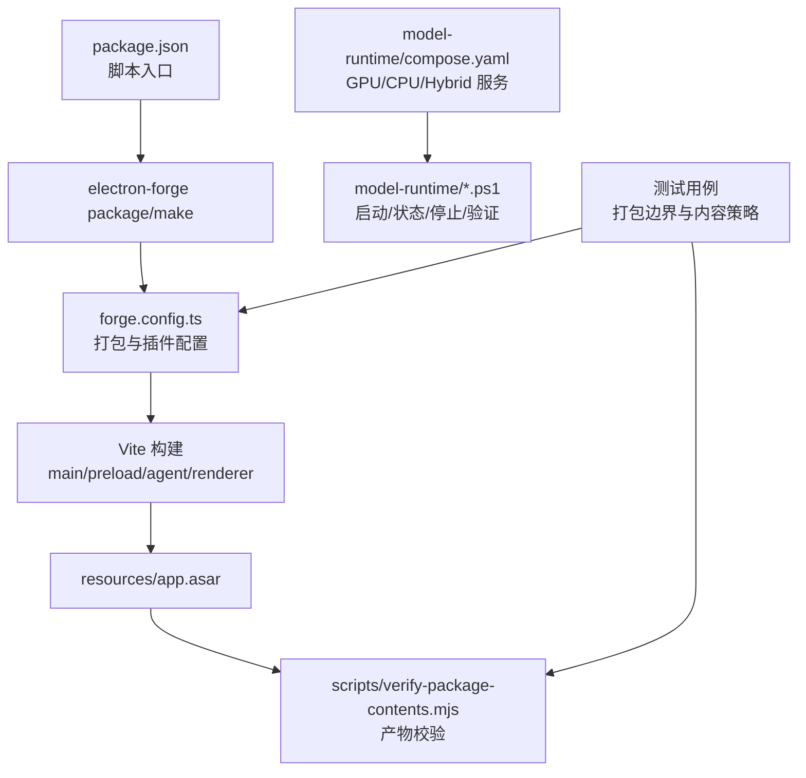
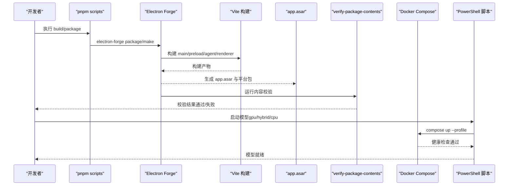
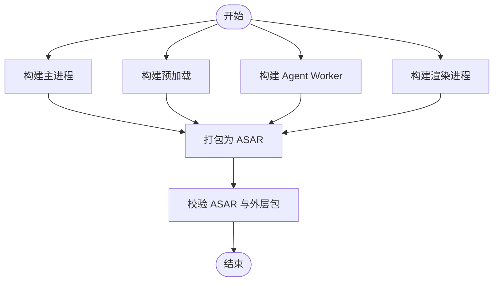
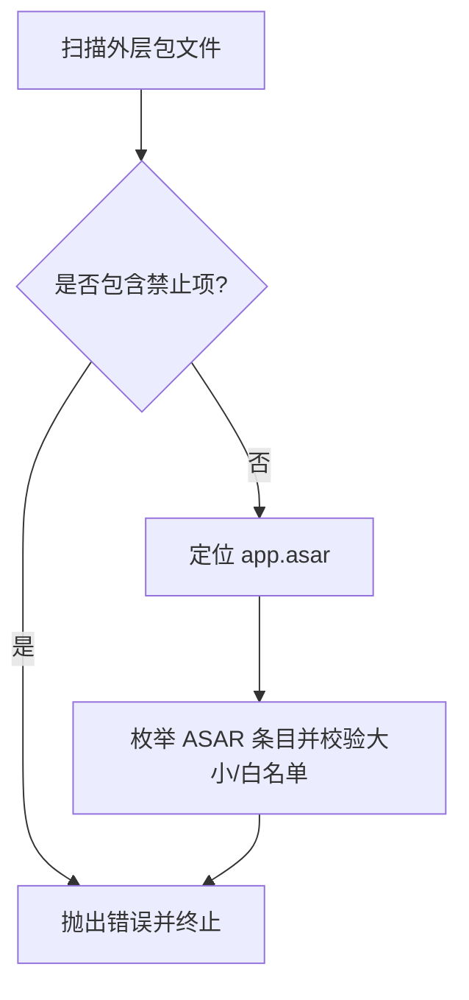
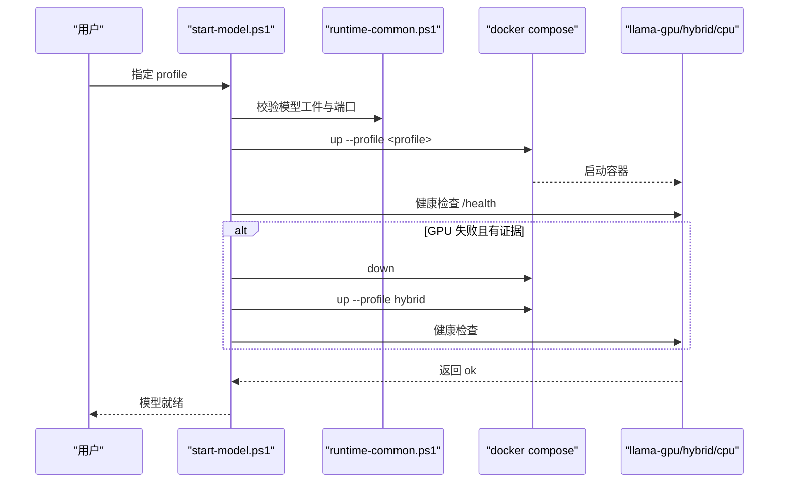
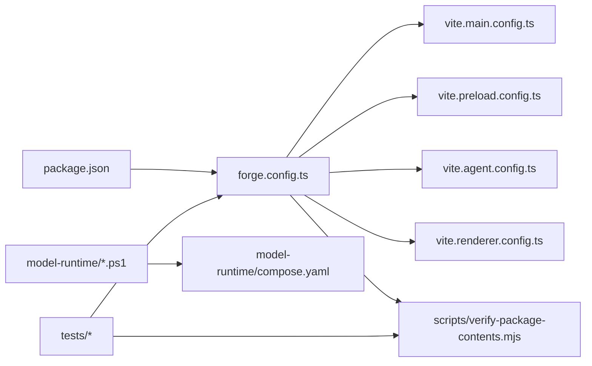

# 部署和打包

<cite>
**本文引用的文件**
- [package.json](file://package.json)
- [forge.config.ts](file://forge.config.ts)
- [vite.main.config.ts](file://vite.main.config.ts)
- [vite.renderer.config.ts](file://vite.renderer.config.ts)
- [vite.preload.config.ts](file://vite.preload.config.ts)
- [vite.agent.config.ts](file://vite.agent.config.ts)
- [scripts/verify-package-contents.mjs](file://scripts/verify-package-contents.mjs)
- [model-runtime/compose.yaml](file://model-runtime/compose.yaml)
- [model-runtime/start-model.ps1](file://model-runtime/start-model.ps1)
- [model-runtime/runtime-common.ps1](file://model-runtime/runtime-common.ps1)
- [tests/modelRuntimePackaging.test.ts](file://tests/modelRuntimePackaging.test.ts)
- [tests/packageContents.test.ts](file://tests/packageContents.test.ts)
</cite>

## 目录
1. [简介](#简介)
2. [项目结构](#项目结构)
3. [核心组件](#核心组件)
4. [架构总览](#架构总览)
5. [详细组件分析](#详细组件分析)
6. [依赖关系分析](#依赖关系分析)
7. [性能考虑](#性能考虑)
8. [故障排除指南](#故障排除指南)
9. [结论](#结论)
10. [附录](#附录)

## 简介
本文件面向“部署与打包”主题，覆盖多进程构建配置、资源打包策略、签名与验证、平台特定构建、自动更新机制、安装包制作与发布渠道、本地模型运行时部署脚本、Docker Compose 配置与环境变量管理、生产环境部署指南、版本管理与发布流程。内容基于仓库中的 Electron Forge + Vite 构建管线、ASAR 校验脚本、PowerShell 模型运行时启动脚本以及 Docker Compose 配置进行说明。

## 项目结构
本项目采用 Electron + Vite 的多入口构建：主进程、预加载脚本、Agent Worker 与渲染进程分别由独立的 Vite 配置构建，并通过 Electron Forge 统一打包为跨平台可执行包。本地模型运行时通过 Docker Compose 以不同 GPU/CPU 配置文件提供推理服务，应用侧通过 PowerShell 脚本编排启动、健康检查与回退策略。

**图表来源**
- [package.json:7-14](file://package.json#L7-L14)
- [forge.config.ts:9-46](file://forge.config.ts#L9-L46)
- [scripts/verify-package-contents.mjs:89-101](file://scripts/verify-package-contents.mjs#L89-L101)
- [model-runtime/compose.yaml:1-127](file://model-runtime/compose.yaml#L1-L127)
- [model-runtime/start-model.ps1:105-149](file://model-runtime/start-model.ps1#L105-L149)

**章节来源**
- [package.json:7-14](file://package.json#L7-L14)
- [forge.config.ts:9-46](file://forge.config.ts#L9-L46)

## 核心组件
- 构建与打包
  - Electron Forge 作为打包器，启用 ASAR 压缩、忽略规则、镜像下载缓存。
  - Vite 负责多进程构建：主进程、预加载、Agent Worker、渲染进程。
  - 自定义脚本在打包后对产物进行内容与大小校验。
- 本地模型运行时
  - Docker Compose 定义 CPU/GPU/Hybrid 三种运行模式，使用环境变量控制并行度、上下文长度、预测步数等。
  - PowerShell 脚本负责启动、健康检查、端口占用检测、GPU 失败回退到 Hybrid 模式。
- 测试与质量门禁
  - 针对打包边界的测试确保模型文件与运行时配置不被打包进应用。
  - 针对 ASAR 与外层包的白名单/黑名单校验，防止敏感或无关文件进入产物。

**章节来源**
- [forge.config.ts:9-46](file://forge.config.ts#L9-L46)
- [scripts/verify-package-contents.mjs:8-73](file://scripts/verify-package-contents.mjs#L8-L73)
- [model-runtime/compose.yaml:1-127](file://model-runtime/compose.yaml#L1-L127)
- [model-runtime/start-model.ps1:105-149](file://model-runtime/start-model.ps1#L105-L149)
- [tests/modelRuntimePackaging.test.ts:7-42](file://tests/modelRuntimePackaging.test.ts#L7-L42)
- [tests/packageContents.test.ts:8-55](file://tests/packageContents.test.ts#L8-L55)

## 架构总览
下图展示了从开发到生产的完整流水线：代码经 Vite 多进程构建生成 JS/HTML，Electron Forge 将其打包为 ASAR 并生成平台可执行包；随后运行内容校验脚本；本地模型通过 Docker Compose 启动，PowerShell 脚本完成健康检查与回退。

**图表来源**
- [package.json:7-14](file://package.json#L7-L14)
- [forge.config.ts:22-46](file://forge.config.ts#L22-L46)
- [scripts/verify-package-contents.mjs:89-101](file://scripts/verify-package-contents.mjs#L89-L101)
- [model-runtime/start-model.ps1:105-149](file://model-runtime/start-model.ps1#L105-L149)
- [model-runtime/compose.yaml:1-127](file://model-runtime/compose.yaml#L1-L127)

## 详细组件分析

### 多进程构建配置（Vite + Electron Forge）
- 多入口构建
  - 主进程、预加载、Agent Worker、渲染进程各自拥有独立 Vite 配置，分别处理 Node 模块外部化与 Vue 插件。
- 打包策略
  - 启用 ASAR 压缩，设置忽略规则以排除源码、测试、文档、模型与运行时配置。
  - 将 Electron 下载缓存置于系统临时目录，避免污染项目根目录。
- 构建产物
  - 最终产物包含 resources/app.asar 与平台可执行文件，后续由校验脚本审计。

**图表来源**
- [forge.config.ts:22-46](file://forge.config.ts#L22-L46)
- [vite.main.config.ts:1-10](file://vite.main.config.ts#L1-L10)
- [vite.preload.config.ts:1-10](file://vite.preload.config.ts#L1-L10)
- [vite.agent.config.ts:1-10](file://vite.agent.config.ts#L1-L10)
- [vite.renderer.config.ts:1-7](file://vite.renderer.config.ts#L1-L7)
- [scripts/verify-package-contents.mjs:8-73](file://scripts/verify-package-contents.mjs#L8-L73)

**章节来源**
- [forge.config.ts:9-46](file://forge.config.ts#L9-L46)
- [vite.main.config.ts:1-10](file://vite.main.config.ts#L1-L10)
- [vite.preload.config.ts:1-10](file://vite.preload.config.ts#L1-L10)
- [vite.agent.config.ts:1-10](file://vite.agent.config.ts#L1-L10)
- [vite.renderer.config.ts:1-7](file://vite.renderer.config.ts#L1-L7)
- [scripts/verify-package-contents.mjs:8-73](file://scripts/verify-package-contents.mjs#L8-L73)

### 资源打包与内容策略（ASAR 与外层包）
- ASAR 内部白名单
  - 仅允许 package.json 与 .vite 相关路径，限制体积上限。
- 外层包黑名单
  - 禁止包含 node_modules、src、tests、docs、model-runtime、models、.env、.gguf 等敏感或无关文件。
- 强制要求
  - 必须存在 resources/app.asar 及必要的构建产物。

**图表来源**
- [scripts/verify-package-contents.mjs:8-73](file://scripts/verify-package-contents.mjs#L8-L73)
- [scripts/verify-package-contents.mjs:89-101](file://scripts/verify-package-contents.mjs#L89-L101)

**章节来源**
- [scripts/verify-package-contents.mjs:8-73](file://scripts/verify-package-contents.mjs#L8-L73)
- [scripts/verify-package-contents.mjs:89-101](file://scripts/verify-package-contents.mjs#L89-L101)
- [tests/packageContents.test.ts:8-55](file://tests/packageContents.test.ts#L8-L55)

### 平台特定构建与镜像缓存
- 平台支持
  - 通过 MakerZIP 同时产出 darwin、linux、win32 的 ZIP 包。
- 镜像与缓存
  - 使用国内镜像加速 Electron 下载，并将缓存放置于系统临时目录，避免污染工作区。
- 原生模块
  - 启用 AutoUnpackNativesPlugin 以正确处理原生模块。

**章节来源**
- [forge.config.ts:10-24](file://forge.config.ts#L10-L24)
- [tests/modelRuntimePackaging.test.ts:37-42](file://tests/modelRuntimePackaging.test.ts#L37-L42)

### 签名与验证过程
- 当前配置未显式启用代码签名；如需在生产环境启用签名，可在 packagerConfig 中增加相应签名选项。
- 验证阶段
  - 构建完成后运行 verify-package-contents 脚本，确保产物符合安全与合规要求。
  - 单元测试覆盖打包边界与内容策略，保障变更不会引入违规文件。

**章节来源**
- [package.json:12-14](file://package.json#L12-L14)
- [scripts/verify-package-contents.mjs:89-101](file://scripts/verify-package-contents.mjs#L89-L101)
- [tests/modelRuntimePackaging.test.ts:7-42](file://tests/modelRuntimePackaging.test.ts#L7-L42)
- [tests/packageContents.test.ts:8-55](file://tests/packageContents.test.ts#L8-L55)

### 自动更新机制
- 当前仓库未包含自动更新实现；若需集成，可在主进程中引入 Electron 官方自动更新方案并在构建产物中保留必要的更新元数据。
- 建议在不改变现有打包策略的前提下，于主进程初始化时检查更新并提示用户。

[本节为概念性说明，不直接分析具体文件]

### 安装包制作与发布渠道
- 安装包制作
  - 使用 electron-forge make 生成平台安装包；当前 maker 配置为 ZIP，可按需扩展其他 maker。
- 发布渠道
  - 可将生成的 ZIP/安装包上传至内部分发服务器或公共存储；结合 CI/CD 流水线自动化发布。
- 版本信息
  - 版本号来源于 package.json 的 version 字段，构建产物名称包含平台与架构信息。

**章节来源**
- [package.json:1-14](file://package.json#L1-L14)
- [forge.config.ts:21-24](file://forge.config.ts#L21-L24)
- [scripts/verify-package-contents.mjs:89-101](file://scripts/verify-package-contents.mjs#L89-L101)

### 本地模型运行时部署脚本与 Docker Compose
- 启动流程
  - PowerShell 脚本根据 profile（gpu/hybrid/cpu）调用 Docker Compose 启动对应服务，并进行健康检查。
  - 当 GPU 启动失败且检测到内存不足或 CUDA 错误时，自动回退到 hybrid 模式。
- 健康检查
  - 通过 /health、/v1/models、/props、/slots 等接口验证模型服务可用性。
- 环境变量
  - 通过 .env 或 .env.example 注入 LLAMA_PARALLEL、LLAMA_CTX_SIZE、LLAMA_N_PREDICT、LLAMA_GPU_LAYERS_HYBRID 等参数。

**图表来源**
- [model-runtime/start-model.ps1:105-149](file://model-runtime/start-model.ps1#L105-L149)
- [model-runtime/runtime-common.ps1:15-20](file://model-runtime/runtime-common.ps1#L15-L20)
- [model-runtime/runtime-common.ps1:43-86](file://model-runtime/runtime-common.ps1#L43-L86)
- [model-runtime/runtime-common.ps1:170-293](file://model-runtime/runtime-common.ps1#L170-L293)
- [model-runtime/compose.yaml:1-127](file://model-runtime/compose.yaml#L1-L127)

**章节来源**
- [model-runtime/start-model.ps1:105-149](file://model-runtime/start-model.ps1#L105-L149)
- [model-runtime/runtime-common.ps1:15-20](file://model-runtime/runtime-common.ps1#L15-L20)
- [model-runtime/runtime-common.ps1:43-86](file://model-runtime/runtime-common.ps1#L43-L86)
- [model-runtime/runtime-common.ps1:170-293](file://model-runtime/runtime-common.ps1#L170-L293)
- [model-runtime/compose.yaml:1-127](file://model-runtime/compose.yaml#L1-L127)

### 环境变量管理
- 运行时环境变量
  - 通过 model-runtime/.env 或 .env.example 注入模型推理参数。
  - PowerShell 脚本在调用 Docker Compose 时传入 --env-file。
- 构建期环境变量
  - 通过 Vite 配置与 Electron Forge 插件进行构建期处理；当前未暴露构建期环境变量开关。

**章节来源**
- [model-runtime/runtime-common.ps1:6-10](file://model-runtime/runtime-common.ps1#L6-L10)
- [model-runtime/runtime-common.ps1:67-86](file://model-runtime/runtime-common.ps1#L67-L86)
- [model-runtime/compose.yaml:12-34](file://model-runtime/compose.yaml#L12-L34)
- [model-runtime/compose.yaml:51-75](file://model-runtime/compose.yaml#L51-L75)
- [model-runtime/compose.yaml:92-119](file://model-runtime/compose.yaml#L92-L119)

### 生产环境部署指南
- 构建与校验
  - 执行 pnpm package 触发 Electron Forge 打包与内容校验。
  - 确保模型工件存在于 models 目录且哈希匹配，避免运行时加载失败。
- 运行时部署
  - 在目标机器安装 Docker，准备 .env 文件，使用 PowerShell 脚本启动模型服务。
  - 应用侧连接 http://127.0.0.1:8080 访问模型服务。
- 安全与合规
  - 保持 ASAR 与外层包校验通过，避免泄露敏感文件或源码。
  - 如需代码签名，请在 packagerConfig 中配置签名选项并在 CI 中注入证书。

**章节来源**
- [package.json:12-14](file://package.json#L12-L14)
- [scripts/verify-package-contents.mjs:89-101](file://scripts/verify-package-contents.mjs#L89-L101)
- [model-runtime/runtime-common.ps1:22-41](file://model-runtime/runtime-common.ps1#L22-L41)
- [model-runtime/runtime-common.ps1:43-86](file://model-runtime/runtime-common.ps1#L43-L86)

### 版本管理与发布流程
- 版本来源
  - package.json 的 version 字段决定应用版本，构建产物名称包含平台与架构。
- 发布步骤
  - 提交版本变更并打标签；执行 pnpm package 生成产物；运行测试与校验；上传至分发渠道。
- 回滚策略
  - 保留历史产物与校验报告，以便快速回滚到稳定版本。

**章节来源**
- [package.json:1-14](file://package.json#L1-L14)
- [scripts/verify-package-contents.mjs:89-101](file://scripts/verify-package-contents.mjs#L89-L101)

## 依赖关系分析
- 构建依赖
  - Electron Forge 依赖 Vite 插件与多个 maker/plugin。
  - 校验脚本依赖 @electron/asar 与 Node 文件系统 API。
- 运行时依赖
  - Docker Compose 提供模型推理服务；PowerShell 脚本协调生命周期。
- 测试依赖
  - Vitest 用于单元测试与端到端测试，覆盖打包边界与内容策略。

**图表来源**
- [package.json:7-14](file://package.json#L7-L14)
- [forge.config.ts:22-46](file://forge.config.ts#L22-L46)
- [scripts/verify-package-contents.mjs:89-101](file://scripts/verify-package-contents.mjs#L89-L101)
- [model-runtime/start-model.ps1:105-149](file://model-runtime/start-model.ps1#L105-L149)
- [model-runtime/compose.yaml:1-127](file://model-runtime/compose.yaml#L1-L127)
- [tests/modelRuntimePackaging.test.ts:7-42](file://tests/modelRuntimePackaging.test.ts#L7-L42)
- [tests/packageContents.test.ts:8-55](file://tests/packageContents.test.ts#L8-L55)

**章节来源**
- [package.json:7-14](file://package.json#L7-L14)
- [forge.config.ts:22-46](file://forge.config.ts#L22-L46)
- [scripts/verify-package-contents.mjs:89-101](file://scripts/verify-package-contents.mjs#L89-L101)
- [model-runtime/start-model.ps1:105-149](file://model-runtime/start-model.ps1#L105-L149)
- [model-runtime/compose.yaml:1-127](file://model-runtime/compose.yaml#L1-L127)
- [tests/modelRuntimePackaging.test.ts:7-42](file://tests/modelRuntimePackaging.test.ts#L7-L42)
- [tests/packageContents.test.ts:8-55](file://tests/packageContents.test.ts#L8-L55)

## 性能考虑
- 构建性能
  - 合理设置 Vite 外部化模块，减少重复打包体积。
  - 使用镜像源加速 Electron 下载，提升 CI 效率。
- 运行时性能
  - 通过环境变量调整并行度、上下文长度与预测步数，平衡吞吐与延迟。
  - GPU 模式下开启 flash-attn 与合适的缓存类型以提升推理速度。
- 产物体积
  - 严格限制 ASAR 大小与内容白名单，避免冗余资源影响加载时间。

[本节提供通用指导，不直接分析具体文件]

## 故障排除指南
- 构建与打包问题
  - 校验失败：检查 ASAR 大小与条目是否符合白名单；确认外层包不包含禁止文件。
  - 构建失败：核对 Vite 外部化配置与依赖声明。
- 模型运行时问题
  - 端口占用：确保 127.0.0.1:8080 未被其他服务占用。
  - GPU 启动失败：查看日志并触发回退到 hybrid 模式；检查 CUDA 驱动与显存。
  - 健康检查失败：确认 /health、/v1/models、/props、/slots 接口响应正常。
- 环境变量问题
  - 确认 .env 文件存在且参数正确；PowerShell 脚本会读取该文件并传递给 Docker Compose。

**章节来源**
- [scripts/verify-package-contents.mjs:8-73](file://scripts/verify-package-contents.mjs#L8-L73)
- [scripts/verify-package-contents.mjs:89-101](file://scripts/verify-package-contents.mjs#L89-L101)
- [model-runtime/runtime-common.ps1:54-86](file://model-runtime/runtime-common.ps1#L54-L86)
- [model-runtime/start-model.ps1:105-149](file://model-runtime/start-model.ps1#L105-L149)
- [model-runtime/runtime-common.ps1:170-293](file://model-runtime/runtime-common.ps1#L170-L293)

## 结论
本项目通过 Electron Forge 与 Vite 实现了清晰的多进程构建与打包流程，配合严格的 ASAR 与外层包校验确保产物安全与合规。本地模型运行时借助 Docker Compose 与 PowerShell 脚本提供了灵活的 GPU/CPU/Hybrid 部署能力，并具备健康检查与自动回退机制。建议在 CI/CD 中集成构建、测试与校验步骤，按需启用代码签名与自动更新，以实现稳定的生产发布流程。

## 附录
- 常用命令
  - 构建与打包：pnpm package
  - 生成安装包：pnpm make
  - 运行测试：pnpm test
  - 启动模型：powershell -File model-runtime/start-model.ps1 -Profile gpu|hybrid|cpu
- 关键配置位置
  - 打包配置：forge.config.ts
  - 构建配置：vite.*.config.ts
  - 运行时配置：model-runtime/compose.yaml 与 .env
  - 校验脚本：scripts/verify-package-contents.mjs

[本节为补充信息，不直接分析具体文件]