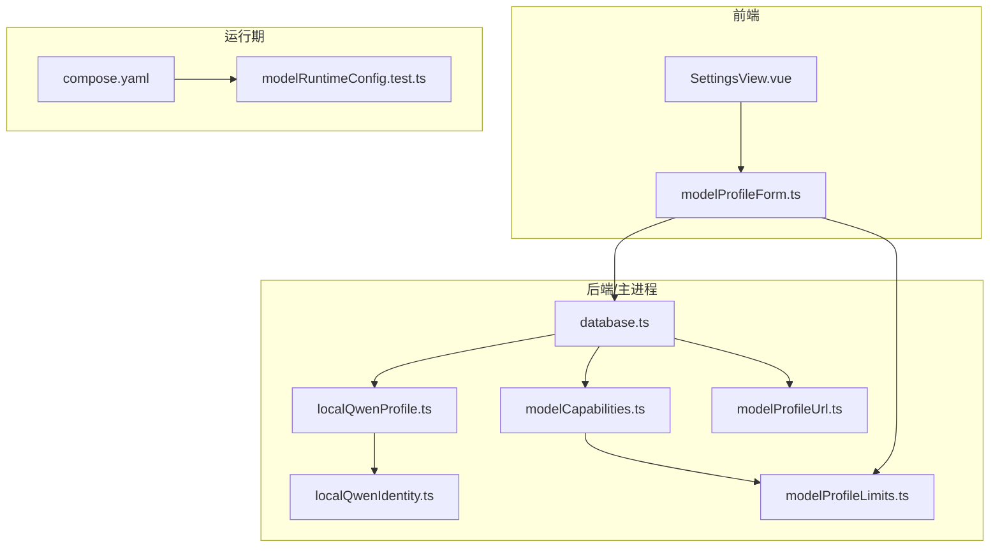
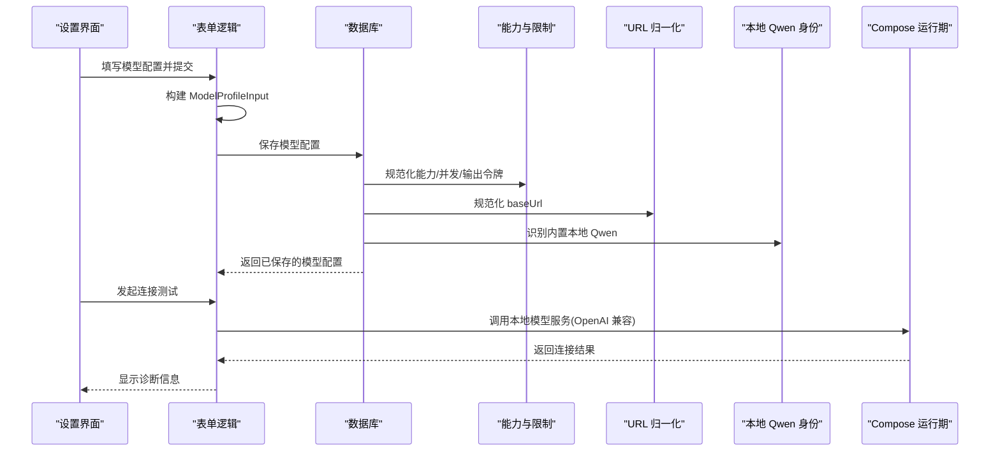
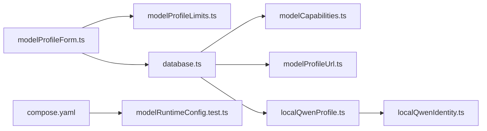

# 应用配置

<cite>
**本文引用的文件**
- [src/agent/database.ts](file://src/agent/database.ts)
- [src/agent/modelCapabilities.ts](file://src/agent/modelCapabilities.ts)
- [src/agent/localQwenProfile.ts](file://src/agent/localQwenProfile.ts)
- [src/shared/modelProfileLimits.ts](file://src/shared/modelProfileLimits.ts)
- [src/shared/localQwenIdentity.ts](file://src/shared/localQwenIdentity.ts)
- [src/shared/modelProfileUrl.ts](file://src/shared/modelProfileUrl.ts)
- [src/renderer/modelProfileForm.ts](file://src/renderer/modelProfileForm.ts)
- [src/renderer/components/SettingsView.vue](file://src/renderer/components/SettingsView.vue)
- [model-runtime/compose.yaml](file://model-runtime/compose.yaml)
- [tests/modelRuntimeConfig.test.ts](file://tests/modelRuntimeConfig.test.ts)
</cite>

## 目录
1. [简介](#简介)
2. [项目结构](#项目结构)
3. [核心组件](#核心组件)
4. [架构总览](#架构总览)
5. [详细组件分析](#详细组件分析)
6. [依赖关系分析](#依赖关系分析)
7. [性能考虑](#性能考虑)
8. [故障排除指南](#故障排除指南)
9. [结论](#结论)
10. [附录](#附录)

## 简介
本文件面向“应用配置系统”，聚焦以下目标：
- 环境变量管理、配置文件格式与默认值机制
- 模型配置文件的结构与字段说明（提供商、API 密钥、连接参数、能力与推理设置等）
- 配置验证规则与错误处理机制
- 不同环境（开发、测试、生产）的配置差异与最佳实践
- 配置迁移指南与常见问题排查

本项目采用“运行时数据库 + 前端表单 + 本地/远程模型服务”的组合方式：
- 模型配置以结构化对象形式在 SQLite 中持久化，并通过规范化函数统一默认值与边界约束
- 前端提供可视化编辑与校验，支持连接测试与诊断信息展示
- 本地模型通过 Docker Compose 暴露为 OpenAI 兼容接口，便于统一接入

## 项目结构
围绕配置的关键路径如下：
- 数据层：SQLite 数据库负责模型配置、应用设置、会话与指标等持久化
- 能力与限制：集中定义模型能力、并发上限、输出令牌上限等
- 本地 Qwen 身份：内置本地模型标识与默认配置
- URL 归一化：对特定域名进行路径标准化，确保兼容模式
- 前端表单：构建输入、校验、指纹计算、保存与连接测试流程
- 运行期：Docker Compose 提供本地模型服务的环境变量与端口绑定

图表来源
- [src/agent/database.ts:526-606](file://src/agent/database.ts#L526-L606)
- [src/agent/modelCapabilities.ts:45-118](file://src/agent/modelCapabilities.ts#L45-L118)
- [src/agent/localQwenProfile.ts:13-25](file://src/agent/localQwenProfile.ts#L13-L25)
- [src/shared/modelProfileUrl.ts:1-24](file://src/shared/modelProfileUrl.ts#L1-L24)
- [src/shared/localQwenIdentity.ts:1-21](file://src/shared/localQwenIdentity.ts#L1-L21)
- [src/shared/modelProfileLimits.ts:1-3](file://src/shared/modelProfileLimits.ts#L1-L3)
- [model-runtime/compose.yaml](file://model-runtime/compose.yaml)
- [tests/modelRuntimeConfig.test.ts](file://tests/modelRuntimeConfig.test.ts)

章节来源
- [src/agent/database.ts:526-606](file://src/agent/database.ts#L526-L606)
- [src/agent/modelCapabilities.ts:45-118](file://src/agent/modelCapabilities.ts#L45-L118)
- [src/agent/localQwenProfile.ts:13-25](file://src/agent/localQwenProfile.ts#L13-L25)
- [src/shared/modelProfileUrl.ts:1-24](file://src/shared/modelProfileUrl.ts#L1-L24)
- [src/shared/localQwenIdentity.ts:1-21](file://src/shared/localQwenIdentity.ts#L1-L21)
- [src/shared/modelProfileLimits.ts:1-3](file://src/shared/modelProfileLimits.ts#L1-L3)
- [model-runtime/compose.yaml](file://model-runtime/compose.yaml)
- [tests/modelRuntimeConfig.test.ts](file://tests/modelRuntimeConfig.test.ts)

## 核心组件
- 模型配置持久化与读取：数据库层负责模型的增删改查、默认模型选择、设置项读写与迁移
- 能力与限制：统一规范模型能力、并发与输出令牌上限，并提供默认值与边界裁剪
- 本地 Qwen 内置配置：提供本地模型的身份常量与默认 Profile 构造
- URL 归一化：针对特定域名的兼容路径修正
- 前端表单与校验：将用户输入转换为标准输入对象，执行配置校验、指纹生成与保存封装
- 运行期配置：Compose 文件与环境变量示例，用于启动本地模型服务

章节来源
- [src/agent/database.ts:526-606](file://src/agent/database.ts#L526-L606)
- [src/agent/modelCapabilities.ts:45-118](file://src/agent/modelCapabilities.ts#L45-L118)
- [src/agent/localQwenProfile.ts:13-25](file://src/agent/localQwenProfile.ts#L13-L25)
- [src/shared/modelProfileUrl.ts:1-24](file://src/shared/modelProfileUrl.ts#L1-L24)
- [src/renderer/modelProfileForm.ts:139-176](file://src/renderer/modelProfileForm.ts#L139-L176)
- [model-runtime/compose.yaml](file://model-runtime/compose.yaml)

## 架构总览
下图展示了从前端到后端的配置保存与读取流程，以及本地模型服务的集成点。

图表来源
- [src/renderer/modelProfileForm.ts:139-176](file://src/renderer/modelProfileForm.ts#L139-L176)
- [src/agent/database.ts:526-606](file://src/agent/database.ts#L526-L606)
- [src/agent/modelCapabilities.ts:45-118](file://src/agent/modelCapabilities.ts#L45-L118)
- [src/shared/modelProfileUrl.ts:1-24](file://src/shared/modelProfileUrl.ts#L1-L24)
- [src/agent/localQwenProfile.ts:13-25](file://src/agent/localQwenProfile.ts#L13-L25)
- [model-runtime/compose.yaml](file://model-runtime/compose.yaml)

## 详细组件分析

### 模型配置数据结构与默认值
- 名称与标识
  - name：必填，去空白后存储
  - provider：如 openai-compatible
  - baseUrl：必填，经 URL 归一化处理
  - model：必填，去空白后存储
- API 密钥
  - apiKey：可选；若为空则沿用已有值；同时记录是否已配置
- 能力与推理
  - capabilities：文本、视觉、长上下文、并发、流式、用量统计等
  - reasoning：模式、协议、努力级别、显示方式等
- 性能与限制
  - maxConcurrency：受能力中的最大并发限制约束，最小为 1
  - maxOutputTokens：正整数，上限由共享常量控制，未满足时回退到默认值
  - responseSpeed：响应速度偏好
- 默认与迁移
  - 首次保存无默认模型时自动设为默认并写入活跃模型 ID
  - 数据库包含多版本迁移，确保新增字段（如推理、并发、输出令牌、响应速度）存在且具备默认值

章节来源
- [src/agent/database.ts:526-606](file://src/agent/database.ts#L526-L606)
- [src/agent/database.ts:637-758](file://src/agent/database.ts#L637-L758)
- [src/agent/modelCapabilities.ts:45-118](file://src/agent/modelCapabilities.ts#L45-L118)
- [src/shared/modelProfileLimits.ts:1-3](file://src/shared/modelProfileLimits.ts#L1-L3)

### 环境变量管理与运行期配置
- 本地模型服务通过 Docker Compose 提供三个 profile（cpu/hybrid/gpu），均仅绑定本地回环地址 127.0.0.1:8080
- 环境变量示例包含并行度、上下文大小、预测数等关键参数，作为默认发布值
- 测试用例断言这些默认值存在，防止无意删除或变更

章节来源
- [model-runtime/compose.yaml](file://model-runtime/compose.yaml)
- [tests/modelRuntimeConfig.test.ts](file://tests/modelRuntimeConfig.test.ts)

### 模型提供商与连接参数
- 提供商类型：openai-compatible
- 基础 URL：统一通过 URL 归一化函数处理，特定域名会修正为兼容模式路径
- 模型名称：必填，用于服务端路由与诊断
- API 密钥：可选，用于鉴权；前端可清空以复用已有值
- 并发与输出令牌：分别受能力与共享上限约束，避免越界

章节来源
- [src/shared/modelProfileUrl.ts:1-24](file://src/shared/modelProfileUrl.ts#L1-L24)
- [src/agent/modelCapabilities.ts:106-118](file://src/agent/modelCapabilities.ts#L106-L118)
- [src/renderer/modelProfileForm.ts:139-176](file://src/renderer/modelProfileForm.ts#L139-L176)

### 内置本地 Qwen 配置
- 内置常量：本地服务地址、模型名、Profile ID
- 内置 Profile：提供默认能力集与推理关闭的初始状态
- 占位符检测：用于识别旧版占位配置，便于引导替换

章节来源
- [src/shared/localQwenIdentity.ts:1-21](file://src/shared/localQwenIdentity.ts#L1-L21)
- [src/agent/localQwenProfile.ts:13-25](file://src/agent/localQwenProfile.ts#L13-L25)

### 配置验证规则
- 表单侧
  - 并发数：必须为正整数且不超出能力允许的最大值
  - 推理配置：根据协议与输入模式校验组合合法性
  - 自定义请求体：当使用 custom 输入模式时，需为合法 JSON 对象
  - 输出令牌：必须为正整数且不超过共享上限
- 后端侧
  - 能力与推理：按协议与能力集合规范化，非法值回退到安全默认
  - 并发与输出令牌：裁剪至有效范围
  - 推理启用：若启用但能力不支持或参数缺失，抛出明确错误

章节来源
- [src/renderer/components/SettingsView.vue:106-130](file://src/renderer/components/SettingsView.vue#L106-L130)
- [src/renderer/modelProfileForm.ts:61-63](file://src/renderer/modelProfileForm.ts#L61-L63)
- [src/renderer/modelProfileForm.ts:228-254](file://src/renderer/modelProfileForm.ts#L228-L254)
- [src/agent/modelCapabilities.ts:93-148](file://src/agent/modelCapabilities.ts#L93-L148)

### 错误处理机制
- 前端诊断：根据连接测试结果生成可读的诊断消息，并在离线场景提示本地启动命令
- 后端校验：对不合理的推理配置直接抛出异常，附带模型名称与问题描述
- 保存封装：保存操作统一捕获异常并以结构化结果返回，便于上层展示

章节来源
- [src/renderer/modelProfileForm.ts:73-107](file://src/renderer/modelProfileForm.ts#L73-L107)
- [src/renderer/modelProfileForm.ts:256-265](file://src/renderer/modelProfileForm.ts#L256-L265)
- [src/agent/modelCapabilities.ts:120-148](file://src/agent/modelCapabilities.ts#L120-L148)

### 不同环境的配置差异与最佳实践
- 开发环境
  - 使用本地 Qwen 服务，baseUrl 指向 127.0.0.1:8080/v1
  - 通过 Compose profile 快速切换 CPU/Hybrid/GPU 资源占用
- 测试环境
  - 保持与开发一致的本地服务地址，便于端到端测试
  - 使用测试用例断言环境变量默认值，防止回归
- 生产环境
  - 将 baseUrl 指向远端 OpenAI 兼容服务
  - 配置 API 密钥与并发/输出令牌上限，遵循能力与共享限制
  - 建议开启流式与用量统计，便于监控与排障

章节来源
- [src/shared/localQwenIdentity.ts:1-21](file://src/shared/localQwenIdentity.ts#L1-L21)
- [model-runtime/compose.yaml](file://model-runtime/compose.yaml)
- [tests/modelRuntimeConfig.test.ts](file://tests/modelRuntimeConfig.test.ts)

### 配置迁移指南
- 数据库迁移
  - 新增字段（如推理、并发、输出令牌、响应速度）通过迁移脚本添加并赋予默认值
  - 首次运行会自动修复遗留数据或补齐缺失列
- 配置升级
  - 若引入新的能力或限制，优先在前端表单与后端规范化处同步更新
  - 对历史配置进行兼容性处理，避免破坏既有行为

章节来源
- [src/agent/database.ts:637-758](file://src/agent/database.ts#L637-L758)

## 依赖关系分析
- 前端表单依赖共享限制常量与推理配置校验工具
- 数据库层依赖能力与限制模块进行规范化，依赖 URL 归一化模块处理 baseUrl
- 本地 Qwen 身份模块提供内置常量与判断方法，供数据库与前端识别内置配置
- 运行期 Compose 与环境变量为本地模型服务提供运行契约，测试用例保障其稳定性

图表来源
- [src/renderer/modelProfileForm.ts:139-176](file://src/renderer/modelProfileForm.ts#L139-L176)
- [src/agent/database.ts:526-606](file://src/agent/database.ts#L526-L606)
- [src/agent/modelCapabilities.ts:45-118](file://src/agent/modelCapabilities.ts#L45-L118)
- [src/shared/modelProfileUrl.ts:1-24](file://src/shared/modelProfileUrl.ts#L1-L24)
- [src/agent/localQwenProfile.ts:13-25](file://src/agent/localQwenProfile.ts#L13-L25)
- [src/shared/localQwenIdentity.ts:1-21](file://src/shared/localQwenIdentity.ts#L1-L21)
- [model-runtime/compose.yaml](file://model-runtime/compose.yaml)
- [tests/modelRuntimeConfig.test.ts](file://tests/modelRuntimeConfig.test.ts)

章节来源
- [src/renderer/modelProfileForm.ts:139-176](file://src/renderer/modelProfileForm.ts#L139-L176)
- [src/agent/database.ts:526-606](file://src/agent/database.ts#L526-L606)
- [src/agent/modelCapabilities.ts:45-118](file://src/agent/modelCapabilities.ts#L45-L118)
- [src/shared/modelProfileUrl.ts:1-24](file://src/shared/modelProfileUrl.ts#L1-L24)
- [src/agent/localQwenProfile.ts:13-25](file://src/agent/localQwenProfile.ts#L13-L25)
- [src/shared/localQwenIdentity.ts:1-21](file://src/shared/localQwenIdentity.ts#L1-L21)
- [model-runtime/compose.yaml](file://model-runtime/compose.yaml)
- [tests/modelRuntimeConfig.test.ts](file://tests/modelRuntimeConfig.test.ts)

## 性能考虑
- 并发限制：maxConcurrency 受能力上限约束，避免过度并发导致服务过载
- 输出令牌上限：maxOutputTokens 受共享常量限制，防止超长响应影响内存与延迟
- URL 归一化：减少因路径不一致导致的连接失败
- 本地服务资源：通过 Compose profile 调整并行度与上下文大小，平衡性能与资源占用

[本节为通用指导，无需具体文件引用]

## 故障排除指南
- 连接失败
  - 检查 baseUrl 是否正确，尤其是特定域名的兼容路径
  - 确认本地模型服务已启动并监听 127.0.0.1:8080
  - 查看前端诊断信息，定位是离线、模型不匹配还是并发警告
- 配置无效
  - 检查推理模式与协议的组合是否被能力支持
  - 确认 effort 选项与当前选择一致
  - 自定义请求体必须为合法 JSON 对象
- 保存失败
  - 查看保存封装返回的错误信息
  - 检查数据库迁移是否成功，必要时重新初始化或修复

章节来源
- [src/renderer/modelProfileForm.ts:73-107](file://src/renderer/modelProfileForm.ts#L73-L107)
- [src/renderer/modelProfileForm.ts:256-265](file://src/renderer/modelProfileForm.ts#L256-L265)
- [src/agent/modelCapabilities.ts:120-148](file://src/agent/modelCapabilities.ts#L120-L148)
- [src/shared/modelProfileUrl.ts:1-24](file://src/shared/modelProfileUrl.ts#L1-L24)

## 结论
本配置系统通过统一的规范化与校验机制，确保模型配置在不同环境下的一致性与安全性。前端提供友好的编辑与诊断体验，后端保证数据的完整性与可迁移性，运行期通过 Compose 与环境变量实现灵活的本地模型部署。遵循本文的最佳实践与故障排除步骤，可有效降低配置错误率并提升整体稳定性。

[本节为总结，无需具体文件引用]

## 附录
- 关键常量与默认值
  - 默认输出令牌上限与共享上限：见共享限制模块
  - 本地 Qwen 默认地址与模型名：见本地身份模块
- 常用配置项速查
  - 提供商：openai-compatible
  - 基础 URL：经归一化处理
  - API 密钥：可选，支持复用与清空
  - 并发与输出令牌：受能力与共享上限约束
  - 推理：按协议与能力启用，注意模式与协议匹配

章节来源
- [src/shared/modelProfileLimits.ts:1-3](file://src/shared/modelProfileLimits.ts#L1-L3)
- [src/shared/localQwenIdentity.ts:1-21](file://src/shared/localQwenIdentity.ts#L1-L21)
- [src/agent/modelCapabilities.ts:45-118](file://src/agent/modelCapabilities.ts#L45-L118)