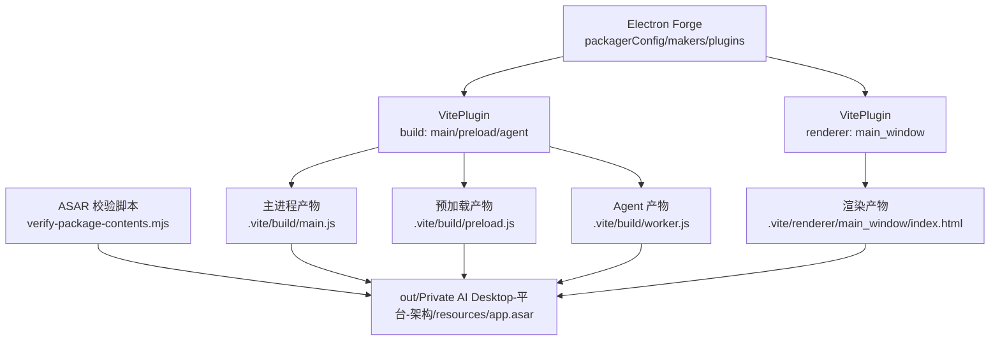
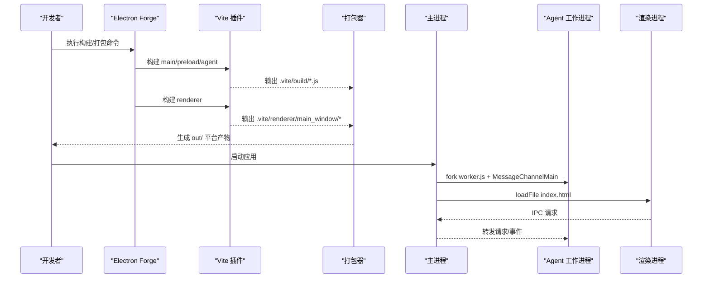
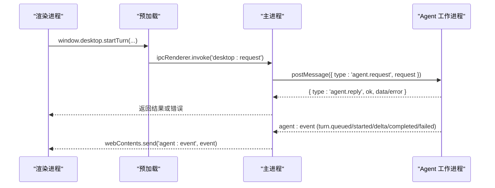
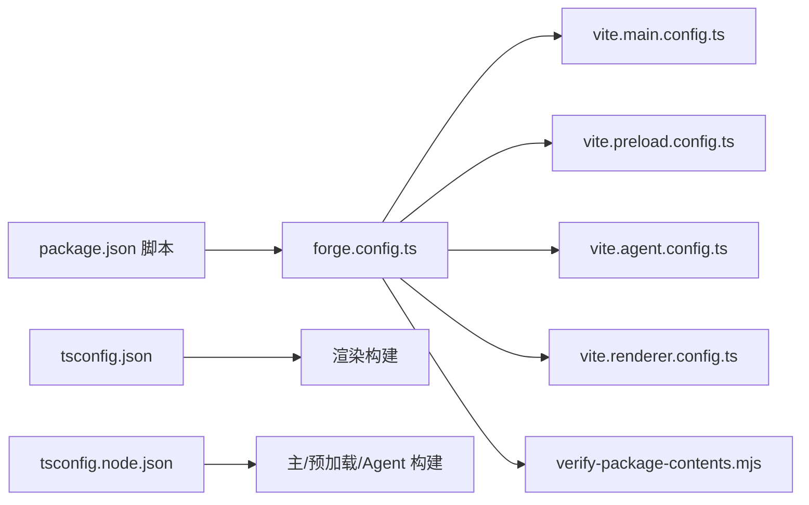

# 构建配置

<cite>
**本文引用的文件**
- [package.json](file://package.json)
- [forge.config.ts](file://forge.config.ts)
- [vite.main.config.ts](file://vite.main.config.ts)
- [vite.preload.config.ts](file://vite.preload.config.ts)
- [vite.agent.config.ts](file://vite.agent.config.ts)
- [vite.renderer.config.ts](file://vite.renderer.config.ts)
- [tsconfig.json](file://tsconfig.json)
- [tsconfig.node.json](file://tsconfig.node.json)
- [src/main.ts](file://src/main.ts)
- [src/preload.ts](file://src/preload.ts)
- [src/agent/worker.ts](file://src/agent/worker.ts)
- [scripts/verify-package-contents.mjs](file://scripts/verify-package-contents.mjs)
- [index.html](file://index.html)
- [README.md](file://README.md)
</cite>

## 目录
1. [简介](#简介)
2. [项目结构](#项目结构)
3. [核心组件](#核心组件)
4. [架构总览](#架构总览)
5. [详细组件分析](#详细组件分析)
6. [依赖关系分析](#依赖关系分析)
7. [性能考虑](#性能考虑)
8. [故障排查指南](#故障排查指南)
9. [结论](#结论)
10. [附录](#附录)

## 简介
本文件面向“Private AI Desktop”的构建系统，系统性说明 Electron Forge、Vite 多进程构建与 TypeScript 编译设置。文档覆盖主进程、渲染进程、Agent 工作进程的独立构建配置，记录打包选项、资源处理、代码分割与性能优化策略，并总结不同平台的构建差异、签名配置与分发设置，最后提供构建脚本使用方法和自定义扩展指南。

## 项目结构
本项目采用 Electron + Vite + TypeScript 的多进程架构：
- 主进程：Electron 主线程，负责窗口生命周期、安全策略、IPC 转发与 Agent 进程管理。
- 预加载脚本：通过 contextBridge 暴露最小化 API 给渲染进程。
- 渲染进程：Vue 3 UI，由 Vite 单独构建为 Web 应用。
- Agent 工作进程：Utility Process，承载调度、模型调用与 SQLite 持久化。
- 构建编排：Electron Forge 集成 Vite 插件，统一触发多入口构建与打包。

图表来源
- [forge.config.ts:9-49](file://forge.config.ts#L9-L49)
- [scripts/verify-package-contents.mjs:37-101](file://scripts/verify-package-contents.mjs#L37-L101)

章节来源
- [package.json:7-14](file://package.json#L7-L14)
- [forge.config.ts:9-49](file://forge.config.ts#L9-L49)
- [scripts/verify-package-contents.mjs:37-101](file://scripts/verify-package-contents.mjs#L37-L101)

## 核心组件
- Electron Forge 配置
  - packagerConfig：启用 ASAR、忽略规则、下载缓存与镜像源。
  - makers：使用 ZIP 生成器输出跨平台产物（darwin、linux、win32）。
  - plugins：AutoUnpackNatives 自动解包原生模块；VitePlugin 定义多入口构建与渲染目标。
- Vite 多进程构建
  - 主进程：外部化 electron、node:path，避免将 Node/Electron API 打包进产物。
  - 预加载：外部化 electron，保持最小体积与安全边界。
  - Agent：外部化 electron、node:sqlite，适配 Utility Process 运行环境。
  - 渲染：启用 Vue 插件，产出浏览器端资源。
- TypeScript 编译
  - tsconfig.json：渲染与共享类型，ESNext/Bundler 解析，保留 JSX，开启 sourceMap。
  - tsconfig.node.json：继承基础配置，NodeNext 模块解析，包含主进程、预加载、Agent 与构建配置，noEmit 仅做类型检查。

章节来源
- [forge.config.ts:9-49](file://forge.config.ts#L9-L49)
- [vite.main.config.ts:1-10](file://vite.main.config.ts#L1-L10)
- [vite.preload.config.ts:1-10](file://vite.preload.config.ts#L1-L10)
- [vite.agent.config.ts:1-10](file://vite.agent.config.ts#L1-L10)
- [vite.renderer.config.ts:1-7](file://vite.renderer.config.ts#L1-L7)
- [tsconfig.json:1-19](file://tsconfig.json#L1-L19)
- [tsconfig.node.json:1-19](file://tsconfig.node.json#L1-L19)

## 架构总览
下图展示从构建到运行的关键路径：Forge 驱动 Vite 构建各进程产物，随后打包为 ASAR，运行时主进程启动渲染窗口并 fork Agent 工作进程，通过 MessageChannelMain 通信。

图表来源
- [forge.config.ts:22-45](file://forge.config.ts#L22-L45)
- [src/main.ts:19-54](file://src/main.ts#L19-L54)
- [src/main.ts:56-95](file://src/main.ts#L56-L95)

## 详细组件分析

### Electron Forge 配置
- 打包选项
  - ASAR：启用以保护源码并减少体积。
  - ignore：仅允许 package.json 与 .vite 产物进入 ASAR，其余被忽略。
  - download：缓存根置于系统临时目录，并使用国内镜像加速下载。
- 生成器
  - MakerZIP：对 darwin、linux、win32 输出 ZIP 压缩包。
- 插件
  - AutoUnpackNatives：自动解包原生模块，避免 ASAR 中加载失败。
  - VitePlugin：集中声明多入口构建与渲染目标。

章节来源
- [forge.config.ts:9-24](file://forge.config.ts#L9-L24)
- [forge.config.ts:25-45](file://forge.config.ts#L25-L45)

### Vite 多进程构建配置
- 主进程（main）
  - external：electron、node:path，确保在运行时由宿主提供。
- 预加载（preload）
  - external：electron，保持最小依赖面。
- Agent（agent）
  - external：electron、node:sqlite，适配 Utility Process 与 Node 原生能力。
- 渲染（renderer）
  - 启用 @vitejs/plugin-vue，支持 Vue SFC。

章节来源
- [vite.main.config.ts:1-10](file://vite.main.config.ts#L1-L10)
- [vite.preload.config.ts:1-10](file://vite.preload.config.ts#L1-L10)
- [vite.agent.config.ts:1-10](file://vite.agent.config.ts#L1-L10)
- [vite.renderer.config.ts:1-7](file://vite.renderer.config.ts#L1-L7)

### TypeScript 编译设置
- 渲染与共享类型
  - target ES2022，module ESNext，moduleResolution Bundler，strict 模式，sourceMap 开启，lib 包含 DOM。
- Node 侧类型检查
  - 继承基础配置，moduleResolution NodeNext，types 包含 node/electron，noEmit 仅做类型检查。
- 包含范围
  - 渲染：src/renderer/**、src/shared/**。
  - Node：forge.config、vite.*.config、src/main、src/preload、src/agent/**、src/shared/**。

章节来源
- [tsconfig.json:1-19](file://tsconfig.json#L1-L19)
- [tsconfig.node.json:1-19](file://tsconfig.node.json#L1-L19)

### 主进程、预加载、Agent 工作进程
- 主进程职责
  - 创建 BrowserWindow，设置安全偏好（contextIsolation、sandbox、禁用 nodeIntegration），加载渲染页面。
  - 启动 Agent 工作进程，建立 MessageChannelMain 通道，转发 IPC 请求与事件。
- 预加载脚本
  - 通过 contextBridge 暴露 window.desktop API，封装 IPC 调用，订阅 Agent 事件。
- Agent 工作进程
  - 接收端口消息，初始化数据库与调度器，处理桌面请求（会话、线程、模型配置、设置等），维护队列与并发限制，持久化流式事件。

图表来源
- [src/preload.ts:5-31](file://src/preload.ts#L5-L31)
- [src/main.ts:103-144](file://src/main.ts#L103-L144)
- [src/agent/worker.ts:111-124](file://src/agent/worker.ts#L111-L124)
- [src/agent/worker.ts:407-442](file://src/agent/worker.ts#L407-L442)

章节来源
- [src/main.ts:56-95](file://src/main.ts#L56-L95)
- [src/main.ts:103-144](file://src/main.ts#L103-L144)
- [src/preload.ts:5-31](file://src/preload.ts#L5-L31)
- [src/agent/worker.ts:111-124](file://src/agent/worker.ts#L111-L124)
- [src/agent/worker.ts:407-442](file://src/agent/worker.ts#L407-L442)

### 资源处理与代码分割
- 资源纳入范围
  - ASAR 内仅允许 package.json 与 .vite 产物，其他目录默认被忽略。
  - 校验脚本强制要求存在 main.js、preload.js、worker.js 与渲染 index.html。
- 代码分割
  - 通过 Vite 多入口分别构建主进程、预加载、Agent 与渲染，天然实现按进程/功能拆分。
  - 外部化 Node/Electron 模块，避免重复打包，减小产物体积。
- 资源大小控制
  - 校验脚本限制 ASAR 最大字节数，防止意外引入大文件。

章节来源
- [forge.config.ts:10-18](file://forge.config.ts#L10-L18)
- [scripts/verify-package-contents.mjs:6-15](file://scripts/verify-package-contents.mjs#L6-L15)
- [scripts/verify-package-contents.mjs:37-53](file://scripts/verify-package-contents.mjs#L37-L53)

### 不同平台的构建差异、签名与分发
- 平台支持
  - 使用 MakerZIP 同时为 darwin、linux、win32 生成 ZIP 包。
- 签名配置
  - 当前未配置签名相关参数；如需签名可在 packagerConfig 中添加相应字段。
- 分发设置
  - 通过 pnpm make 生成可分发包；pnpm package 生成 out/ 目录产物并执行内容校验。
  - 下载缓存位于系统临时目录，避免污染项目根目录。

章节来源
- [forge.config.ts:21-21](file://forge.config.ts#L21-L21)
- [package.json:12-14](file://package.json#L12-L14)
- [forge.config.ts:13-18](file://forge.config.ts#L13-L18)

### 构建脚本使用方法与自定义扩展
- 常用脚本
  - start：启动开发模式。
  - build/package：执行打包流程并验证产物内容。
  - make：生成平台分发包。
  - typecheck：执行 Vue 与 Node 侧类型检查。
  - test/test:e2e：运行单元测试与端到端测试。
- 自定义扩展
  - 新增构建入口：在 forge.config.ts 的 VitePlugin.build 数组添加 entry/config。
  - 新增渲染窗口：在 VitePlugin.renderer 数组添加 name/config。
  - 调整忽略规则：修改 packagerConfig.ignore 正则，控制哪些文件进入 ASAR。
  - 调整外部化模块：在各 vite.*.config.ts 的 rollupOptions.external 中增删。
  - 增强校验：在 verify-package-contents.mjs 中扩展 allowedAsarEntry/requiredAsarFiles/forbiddenOuterSegments。

章节来源
- [package.json:7-14](file://package.json#L7-L14)
- [forge.config.ts:22-45](file://forge.config.ts#L22-L45)
- [scripts/verify-package-contents.mjs:8-15](file://scripts/verify-package-contents.mjs#L8-L15)
- [scripts/verify-package-contents.mjs:55-73](file://scripts/verify-package-contents.mjs#L55-L73)

## 依赖关系分析

图表来源
- [package.json:7-14](file://package.json#L7-L14)
- [forge.config.ts:22-45](file://forge.config.ts#L22-L45)
- [tsconfig.json:1-19](file://tsconfig.json#L1-L19)
- [tsconfig.node.json:1-19](file://tsconfig.node.json#L1-L19)
- [scripts/verify-package-contents.mjs:89-101](file://scripts/verify-package-contents.mjs#L89-L101)

章节来源
- [package.json:7-14](file://package.json#L7-L14)
- [forge.config.ts:22-45](file://forge.config.ts#L22-L45)
- [tsconfig.json:1-19](file://tsconfig.json#L1-L19)
- [tsconfig.node.json:1-19](file://tsconfig.node.json#L1-L19)
- [scripts/verify-package-contents.mjs:89-101](file://scripts/verify-package-contents.mjs#L89-L101)

## 性能考虑
- 外部化关键模块：将 electron、node:path、node:sqlite 外部化，避免重复打包，减少产物体积与启动开销。
- 严格忽略规则：仅允许必要产物进入 ASAR，降低扫描与解压成本。
- 多进程隔离：主进程、渲染进程、Agent 进程各自独立构建与运行，提升稳定性与可维护性。
- 缓存与镜像：使用系统临时目录缓存 Electron 下载，并通过镜像加速构建准备阶段。
- 资源上限：ASAR 大小限制防止意外引入大文件，保障安装包体积可控。

[本节为通用指导，不直接分析具体文件]

## 故障排查指南
- 构建失败或找不到入口
  - 确认 forge.config.ts 中 VitePlugin 的 entry 与 config 指向正确。
  - 检查 vite.*.config.ts 是否存在且导出有效配置。
- 运行时无法加载原生模块
  - 确认 AutoUnpackNatives 已启用，必要时调整 native 模块的外部化策略。
- ASAR 校验失败
  - 检查是否引入了 forbidden 目录或文件；确认 required 文件存在；关注 ASAR 大小限制。
- 代理/网络问题
  - 确认下载镜像可用；必要时更换镜像地址或关闭代理。
- 类型检查报错
  - 使用 pnpm typecheck 定位问题；核对 tsconfig 的 include/types/lib/moduleResolution。

章节来源
- [forge.config.ts:22-24](file://forge.config.ts#L22-L24)
- [scripts/verify-package-contents.mjs:37-73](file://scripts/verify-package-contents.mjs#L37-L73)
- [package.json:9-14](file://package.json#L9-L14)

## 结论
本项目通过 Electron Forge 与 Vite 插件实现了清晰的多进程构建体系：主进程、预加载、Agent 与渲染各自独立构建与打包，配合严格的 ASAR 忽略规则与校验脚本，确保产物安全、体积可控与可移植性。TypeScript 双配置覆盖 Node 与浏览器侧类型检查，保证类型安全。基于此基础，可按需扩展新入口、新渲染窗口或增强校验逻辑，以满足更多业务场景。

[本节为总结性内容，不直接分析具体文件]

## 附录
- 入口与产物映射
  - 主进程：src/main.ts → .vite/build/main.js
  - 预加载：src/preload.ts → .vite/build/preload.js
  - Agent：src/agent/worker.ts → .vite/build/worker.js
  - 渲染：vite.renderer.config.ts → .vite/renderer/main_window/index.html
- 安全与 CSP
  - 渲染入口 index.html 定义了内容安全策略，限制脚本、样式与连接来源。

章节来源
- [forge.config.ts:25-43](file://forge.config.ts#L25-L43)
- [index.html:5-8](file://index.html#L5-L8)
- [README.md:104-120](file://README.md#L104-L120)