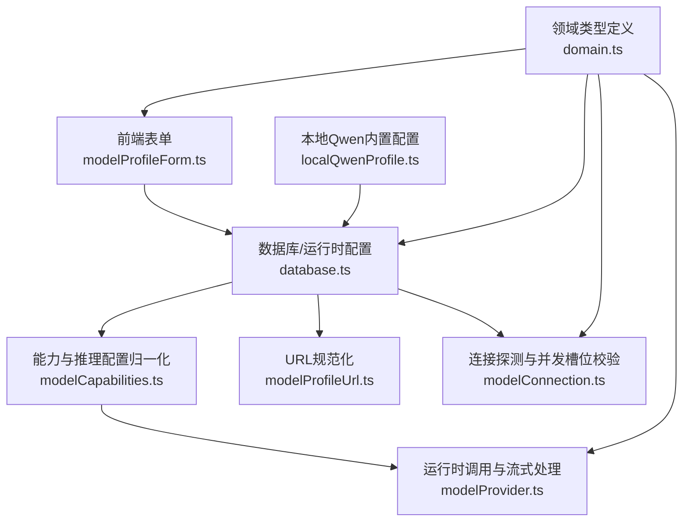
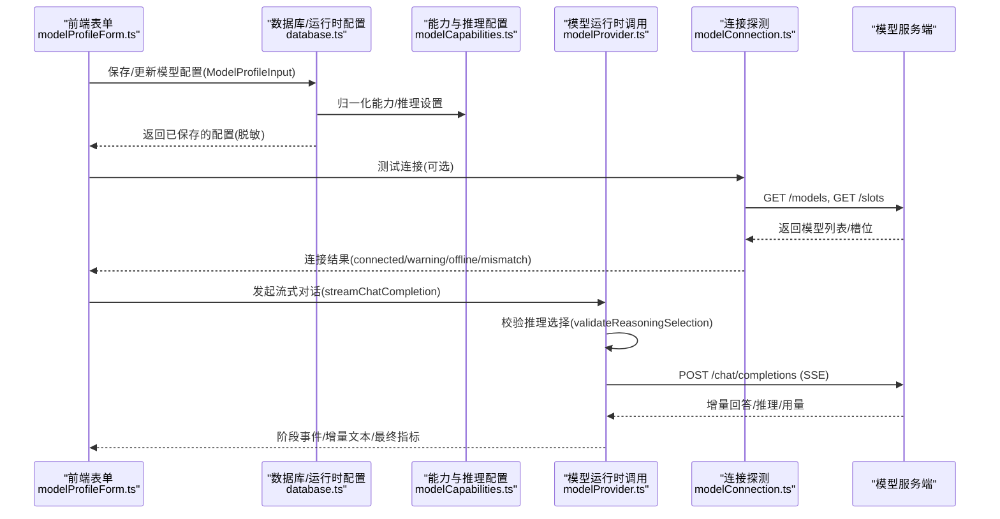
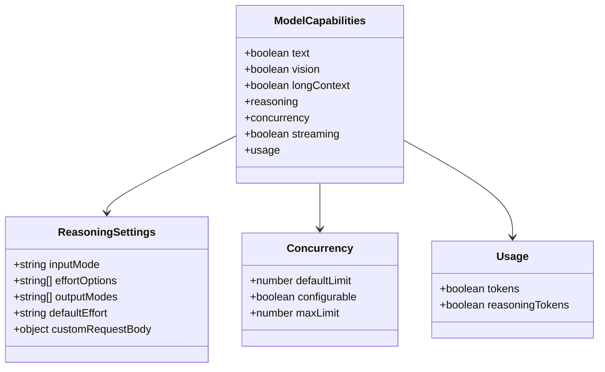
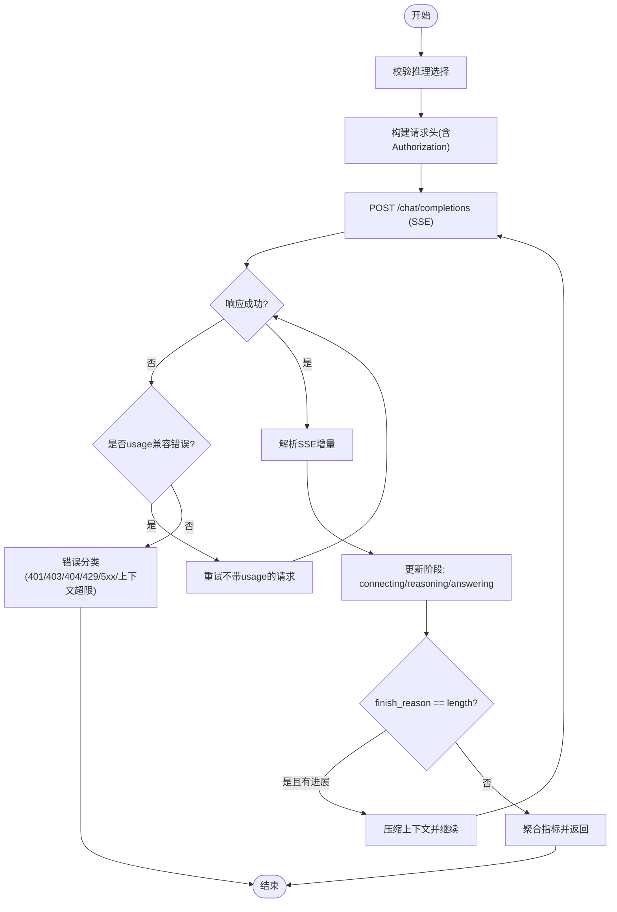
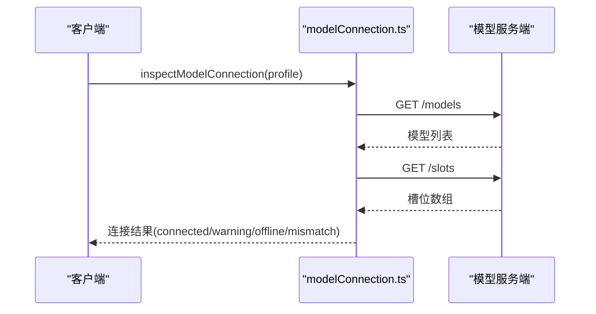
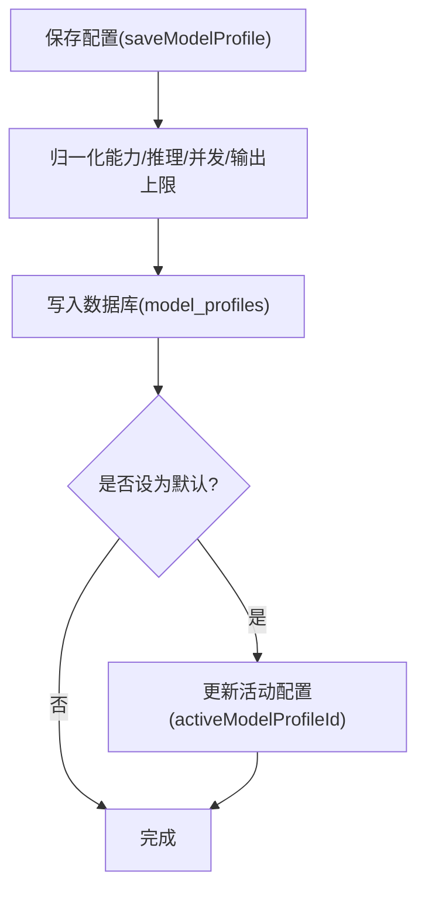
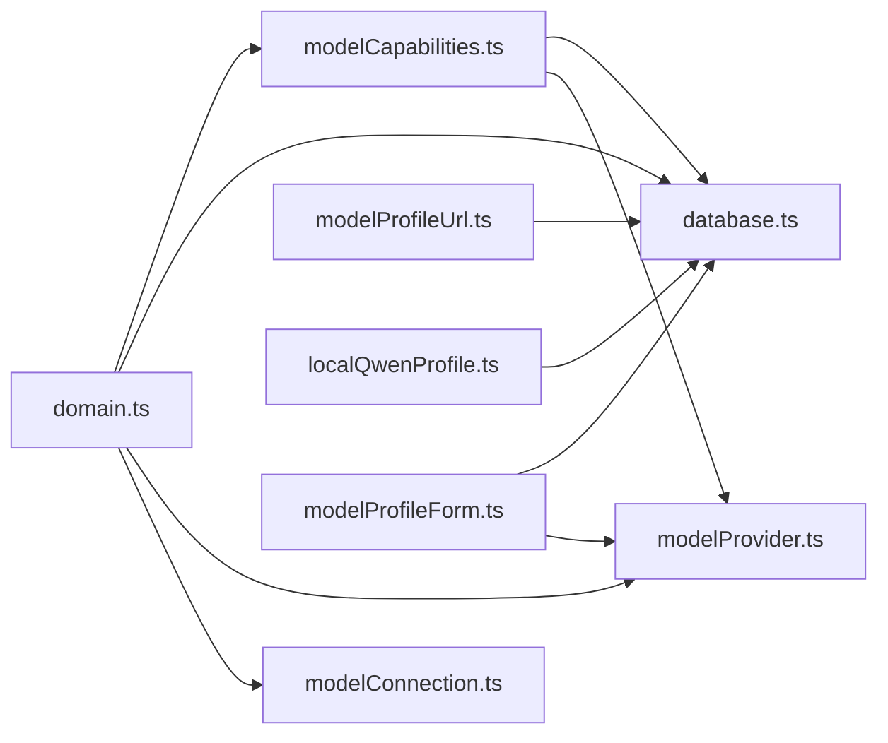

# 模型配置

<cite>
**本文引用的文件**
- [src/agent/modelProvider.ts](file://src/agent/modelProvider.ts)
- [src/agent/modelCapabilities.ts](file://src/agent/modelCapabilities.ts)
- [src/agent/modelConnection.ts](file://src/agent/modelConnection.ts)
- [src/agent/database.ts](file://src/agent/database.ts)
- [src/agent/localQwenProfile.ts](file://src/agent/localQwenProfile.ts)
- [src/shared/domain.ts](file://src/shared/domain.ts)
- [src/shared/modelProfileLimits.ts](file://src/shared/modelProfileLimits.ts)
- [src/shared/modelProfileUrl.ts](file://src/shared/modelProfileUrl.ts)
- [src/shared/reasoningConfiguration.ts](file://src/shared/reasoningConfiguration.ts)
- [src/renderer/modelProfileForm.ts](file://src/renderer/modelProfileForm.ts)
- [tests/modelCapabilities.test.ts](file://tests/modelCapabilities.test.ts)
</cite>

## 目录
1. [简介](#简介)
2. [项目结构](#项目结构)
3. [核心组件](#核心组件)
4. [架构总览](#架构总览)
5. [详细组件分析](#详细组件分析)
6. [依赖关系分析](#依赖关系分析)
7. [性能与并发](#性能与并发)
8. [故障排查指南](#故障排查指南)
9. [结论](#结论)
10. [附录：配置文件完整结构](#附录配置文件完整结构)

## 简介
本文件面向“模型配置系统”，系统化说明模型提供商抽象层的设计、支持的模型类型（OpenAI兼容API、本地Qwen等）、能力声明、并发限制、超时设置、重试机制，以及配置文件的完整结构与验证流程。同时提供模型切换、动态配置更新、常见配置问题解决方案与性能优化建议。

## 项目结构
围绕模型配置的核心代码分布在以下模块：
- 能力与配置归一化：modelCapabilities.ts、reasoningConfiguration.ts、modelProfileLimits.ts、modelProfileUrl.ts
- 运行时调用与流式处理：modelProvider.ts
- 连接探测与并发槽位校验：modelConnection.ts
- 持久化与运行时配置读取：database.ts
- 本地Qwen内置配置：localQwenProfile.ts、localQwenIdentity.ts
- 前端表单与诊断：modelProfileForm.ts
- 领域类型定义：domain.ts
- 测试用例：modelCapabilities.test.ts

图表来源
- [src/renderer/modelProfileForm.ts:139-176](file://src/renderer/modelProfileForm.ts#L139-L176)
- [src/agent/database.ts:541-621](file://src/agent/database.ts#L541-L621)
- [src/agent/modelCapabilities.ts:45-91](file://src/agent/modelCapabilities.ts#L45-L91)
- [src/agent/modelProvider.ts:55-197](file://src/agent/modelProvider.ts#L55-L197)
- [src/agent/modelConnection.ts:11-91](file://src/agent/modelConnection.ts#L11-L91)
- [src/agent/localQwenProfile.ts:13-25](file://src/agent/localQwenProfile.ts#L13-L25)
- [src/shared/domain.ts:160-192](file://src/shared/domain.ts#L160-L192)

章节来源
- [src/agent/modelProvider.ts:55-197](file://src/agent/modelProvider.ts#L55-L197)
- [src/agent/modelCapabilities.ts:45-91](file://src/agent/modelCapabilities.ts#L45-L91)
- [src/agent/modelConnection.ts:11-91](file://src/agent/modelConnection.ts#L11-L91)
- [src/agent/database.ts:541-621](file://src/agent/database.ts#L541-L621)
- [src/agent/localQwenProfile.ts:13-25](file://src/agent/localQwenProfile.ts#L13-L25)
- [src/shared/domain.ts:160-192](file://src/shared/domain.ts#L160-L192)

## 核心组件
- 模型能力声明与归一化：根据协议（qwen/openai/custom）生成或合并能力集，约束并发、流式、用量上报、推理模式等。
- 模型运行时调用：统一的流式聊天补全接口，封装SSE解析、阶段状态、指标聚合、上下文压缩与续写。
- 连接探测：检查模型端点可用性、模型标识匹配、服务并发槽位是否一致。
- 配置持久化与读取：保存/更新模型配置，归一化并落库；运行时按活动配置加载。
- 本地Qwen内置：提供默认本地Qwen的profile输入与识别逻辑。
- 前端表单：构建ModelProfileInput、校验推理配置、生成诊断信息。

章节来源
- [src/agent/modelCapabilities.ts:14-43](file://src/agent/modelCapabilities.ts#L14-L43)
- [src/agent/modelProvider.ts:55-197](file://src/agent/modelProvider.ts#L55-L197)
- [src/agent/modelConnection.ts:11-91](file://src/agent/modelConnection.ts#L11-L91)
- [src/agent/database.ts:541-621](file://src/agent/database.ts#L541-L621)
- [src/agent/localQwenProfile.ts:13-25](file://src/agent/localQwenProfile.ts#L13-L25)
- [src/renderer/modelProfileForm.ts:139-176](file://src/renderer/modelProfileForm.ts#L139-L176)

## 架构总览
下图展示了从用户配置到模型调用的关键路径：前端表单构建配置，数据库归一化并持久化；运行时读取配置后发起流式请求，期间进行能力校验、超时控制、错误分类与重试策略。

图表来源
- [src/renderer/modelProfileForm.ts:139-176](file://src/renderer/modelProfileForm.ts#L139-L176)
- [src/agent/database.ts:541-621](file://src/agent/database.ts#L541-L621)
- [src/agent/modelCapabilities.ts:45-91](file://src/agent/modelCapabilities.ts#L45-L91)
- [src/agent/modelConnection.ts:11-91](file://src/agent/modelConnection.ts#L11-L91)
- [src/agent/modelProvider.ts:55-197](file://src/agent/modelProvider.ts#L55-L197)

## 详细组件分析

### 模型提供商抽象层与能力声明
- 支持两类能力模板：
  - Qwen能力：启用文本、视觉、流式、推理(raw输出)、可配置并发上限。
  - OpenAI兼容能力：启用文本、流式、推理(summary输出)，支持effort选项集合。
- 能力归一化：
  - 将外部输入的能力对象标准化为统一结构，兼容历史字段（如streamingUsage）。
  - 推理能力根据协议(qwen/openai/custom)进行合理推断与合并。
- 并发限制：
  - 通过capabilities.concurrency.defaultLimit/maxLimit约束最大并发，并在保存时归一化。
- 流式与用量：
  - 默认开启流式；usage.tokens与usage.reasoningTokens用于统计token用量与推理token。

图表来源
- [src/shared/domain.ts:130-148](file://src/shared/domain.ts#L130-L148)
- [src/agent/modelCapabilities.ts:45-91](file://src/agent/modelCapabilities.ts#L45-L91)

章节来源
- [src/agent/modelCapabilities.ts:14-43](file://src/agent/modelCapabilities.ts#L14-L43)
- [src/agent/modelCapabilities.ts:45-91](file://src/agent/modelCapabilities.ts#L45-L91)
- [src/shared/domain.ts:130-148](file://src/shared/domain.ts#L130-L148)

### 模型运行时调用：流式对话、超时、重试与上下文压缩
- 入口函数：streamChatCompletion(profile, messages, handlers, signal, fetchImpl, nowMs, timeoutMs)
- 超时策略：
  - 默认基础超时与每token超时组合，受maxOutputTokens与推理模式影响，上限有全局封顶。
  - 使用AbortSignal实现请求级取消与超时。
- 重试机制：
  - 当首次请求携带usage参数被拒绝（特定400/422且参数名匹配），自动重试不带usage的请求。
  - 遇到上下文超限或服务端500（在已压缩上下文的场景），触发本地上下文压缩与继续策略。
- 上下文压缩与续写：
  - 估算消息token数，超过阈值则对system/history/latest user进行压缩。
  - 若finishReason=length且已有答案进展，构造continuation消息继续生成。
- SSE解析与阶段：
  - 解析answerDelta、rawReasoningDelta、reasoningSummaryDelta、finishReason、usage。
  - 阶段流转：connecting -> reasoning -> answering，并上报onPhase。
- 指标聚合：
  - 合并多次尝试的prompt/completion/total/reasoning token与server侧tokensPerSecond。

图表来源
- [src/agent/modelProvider.ts:55-197](file://src/agent/modelProvider.ts#L55-L197)
- [src/agent/modelProvider.ts:762-828](file://src/agent/modelProvider.ts#L762-L828)
- [src/agent/modelProvider.ts:847-898](file://src/agent/modelProvider.ts#L847-L898)
- [src/agent/modelProvider.ts:900-1008](file://src/agent/modelProvider.ts#L900-L1008)

章节来源
- [src/agent/modelProvider.ts:55-197](file://src/agent/modelProvider.ts#L55-L197)
- [src/agent/modelProvider.ts:762-828](file://src/agent/modelProvider.ts#L762-L828)
- [src/agent/modelProvider.ts:847-898](file://src/agent/modelProvider.ts#L847-L898)
- [src/agent/modelProvider.ts:900-1008](file://src/agent/modelProvider.ts#L900-L1008)

### 连接探测与并发槽位校验
- 探测流程：
  - 访问/models获取模型列表，校验配置的model是否在列表中。
  - 访问/slots获取服务并发槽位，比较客户端配置的maxConcurrency与服务端实际槽位。
- 结果类型：
  - connected：完全匹配
  - concurrency-warning：槽位不一致
  - slots-unverified：无法验证槽位
  - offline：端点不可用
  - model-mismatch：模型不匹配

图表来源
- [src/agent/modelConnection.ts:11-91](file://src/agent/modelConnection.ts#L11-L91)

章节来源
- [src/agent/modelConnection.ts:11-91](file://src/agent/modelConnection.ts#L11-L91)

### 配置持久化与动态更新
- 保存流程：
  - 接收ModelProfileInput，合并现有capabilities与reasoning，归一化并发与输出token上限，写入数据库。
  - 若设为默认，同步更新活动配置。
- 运行时读取：
  - getModelProfileForRuntime按活动配置或默认配置返回RuntimeModelProfile（包含apiKey）。
- URL规范化：
  - 针对特定域名与路径进行兼容模式修正，确保baseUrl正确。

图表来源
- [src/agent/database.ts:541-621](file://src/agent/database.ts#L541-L621)
- [src/agent/database.ts:719-725](file://src/agent/database.ts#L719-L725)
- [src/shared/modelProfileUrl.ts:1-24](file://src/shared/modelProfileUrl.ts#L1-L24)

章节来源
- [src/agent/database.ts:541-621](file://src/agent/database.ts#L541-L621)
- [src/agent/database.ts:719-725](file://src/agent/database.ts#L719-L725)
- [src/shared/modelProfileUrl.ts:1-24](file://src/shared/modelProfileUrl.ts#L1-L24)

### 本地Qwen内置配置
- 提供本地Qwen的默认profile输入：provider为openai-compatible，baseUrl指向本地服务，model为固定值，capabilities采用qwen能力模板，推理关闭。
- 提供识别函数判断是否为内置本地Qwen配置。

章节来源
- [src/agent/localQwenProfile.ts:13-25](file://src/agent/localQwenProfile.ts#L13-L25)
- [src/shared/localQwenIdentity.ts:1-21](file://src/shared/localQwenIdentity.ts#L1-L21)

### 前端表单与配置验证
- 构建ModelProfileInput：合并capabilities与reasoning，支持自定义请求体JSON校验。
- 推理配置校验：基于协议推荐inputMode与effort选项，避免无效组合。
- 连接诊断：根据连接结果生成用户友好的诊断文案，必要时提示本地Qwen启动命令。

章节来源
- [src/renderer/modelProfileForm.ts:139-176](file://src/renderer/modelProfileForm.ts#L139-L176)
- [src/renderer/modelProfileForm.ts:244-254](file://src/renderer/modelProfileForm.ts#L244-L254)
- [src/renderer/modelProfileForm.ts:73-103](file://src/renderer/modelProfileForm.ts#L73-L103)

## 依赖关系分析
- domain.ts定义了所有核心类型（ModelProfile、ModelCapabilities、ModelRunMetrics、连接结果等），被其他模块广泛引用。
- modelCapabilities.ts依赖domain.ts的类型，并提供能力模板与归一化逻辑。
- database.ts依赖modelCapabilities.ts进行配置归一化，依赖modelProfileUrl.ts进行URL规范化。
- modelProvider.ts依赖modelCapabilities.ts进行推理选择校验，依赖streamTextNormalizer进行增量文本处理。
- modelConnection.ts依赖domain.ts的连接结果类型。
- localQwenProfile.ts依赖shared/localQwenIdentity.ts与modelCapabilities.ts。
- renderer/modelProfileForm.ts依赖domain.ts与shared/reasoningConfiguration.ts进行表单构建与校验。

图表来源
- [src/shared/domain.ts:160-192](file://src/shared/domain.ts#L160-L192)
- [src/agent/modelCapabilities.ts:45-91](file://src/agent/modelCapabilities.ts#L45-L91)
- [src/agent/database.ts:541-621](file://src/agent/database.ts#L541-L621)
- [src/agent/modelProvider.ts:55-197](file://src/agent/modelProvider.ts#L55-L197)
- [src/agent/modelConnection.ts:11-91](file://src/agent/modelConnection.ts#L11-L91)
- [src/agent/localQwenProfile.ts:13-25](file://src/agent/localQwenProfile.ts#L13-L25)
- [src/renderer/modelProfileForm.ts:139-176](file://src/renderer/modelProfileForm.ts#L139-L176)

章节来源
- [src/shared/domain.ts:160-192](file://src/shared/domain.ts#L160-L192)
- [src/agent/modelCapabilities.ts:45-91](file://src/agent/modelCapabilities.ts#L45-L91)
- [src/agent/database.ts:541-621](file://src/agent/database.ts#L541-L621)
- [src/agent/modelProvider.ts:55-197](file://src/agent/modelProvider.ts#L55-L197)
- [src/agent/modelConnection.ts:11-91](file://src/agent/modelConnection.ts#L11-L91)
- [src/agent/localQwenProfile.ts:13-25](file://src/agent/localQwenProfile.ts#L13-L25)
- [src/renderer/modelProfileForm.ts:139-176](file://src/renderer/modelProfileForm.ts#L139-L176)

## 性能与并发
- 并发限制：
  - capabilities.concurrency.maxLimit作为硬上限，normalizeMaxConcurrency将用户输入裁剪至[1, maxLimit]范围。
  - 连接探测会对比客户端maxConcurrency与服务端slots数量，不一致时给出warning。
- 超时设置：
  - 默认基础超时与每token超时结合，受maxOutputTokens与推理模式影响，上限封顶。
  - 连接测试自带超时保护，避免长时间阻塞。
- 流式与指标：
  - 优先使用服务端提供的tokensPerSecond，否则回退到客户端计算。
  - 合并多次尝试的指标，保证最终统计准确。
- 上下文压缩：
  - 接近上下文窗口时主动压缩历史与系统提示，减少失败概率。
  - 达到长度限制时自动续写，提升长输出稳定性。

章节来源
- [src/agent/modelCapabilities.ts:106-118](file://src/agent/modelCapabilities.ts#L106-L118)
- [src/agent/modelConnection.ts:54-91](file://src/agent/modelConnection.ts#L54-L91)
- [src/agent/modelProvider.ts:199-207](file://src/agent/modelProvider.ts#L199-L207)
- [src/agent/modelProvider.ts:334-339](file://src/agent/modelProvider.ts#L334-L339)
- [src/agent/modelProvider.ts:153-162](file://src/agent/modelProvider.ts#L153-L162)

## 故障排查指南
- 认证失败（401/403）：检查profile中的apiKey是否正确配置。
- 模型不存在（404）：核对baseUrl与model名称是否与后端一致。
- 速率限制（429）：稍后重试或降低并发。
- 上下文超限：缩短历史或提高maxOutputTokens；系统会自动压缩与续写。
- 连接不可用：确认模型服务已启动，/models与/slots可达。
- 槽位不匹配：调整客户端maxConcurrency以匹配服务端slots。
- 推理配置冲突：确保protocol与inputMode匹配（qwen使用toggle，openai使用effort）。

章节来源
- [src/agent/modelProvider.ts:900-922](file://src/agent/modelProvider.ts#L900-L922)
- [src/agent/modelConnection.ts:11-91](file://src/agent/modelConnection.ts#L11-L91)
- [src/agent/modelCapabilities.ts:120-148](file://src/agent/modelCapabilities.ts#L120-L148)
- [src/renderer/modelProfileForm.ts:73-103](file://src/renderer/modelProfileForm.ts#L73-L103)

## 结论
该模型配置系统通过清晰的能力声明、严格的配置归一化与验证、健壮的运行时调用与错误处理，实现了多模型提供商的统一接入。其并发控制、超时与重试机制、上下文压缩与续写策略，保障了在高负载与长上下文场景下的稳定性。配合前端表单与连接诊断，用户可以便捷地管理模型配置并快速定位问题。

## 附录：配置文件完整结构
以下为模型配置的核心字段与含义（基于领域类型与保存流程）：
- id：配置唯一标识
- name：显示名称
- provider：提供商类型（当前为openai-compatible）
- baseUrl：模型服务基础地址（会被规范化）
- model：模型名称
- apiKey：可选的认证令牌（保存时会脱敏）
- capabilities：
  - text/vision/longContext：能力开关
  - reasoning：
    - inputMode：unsupported/toggle/effort/custom
    - effortOptions：effort选项集合（openai）
    - outputModes：raw/summary
    - defaultEffort：默认effort
    - customRequestBody：自定义请求体片段（JSON对象）
  - concurrency：
    - defaultLimit：默认并发
    - configurable：是否允许配置
    - maxLimit：最大并发上限
  - streaming：是否启用流式
  - usage：
    - tokens：是否上报token用量
    - reasoningTokens：是否上报推理token
- reasoning：
  - mode：auto/enabled/disabled
  - protocol：none/qwen/openai/custom
  - effort：effort值（当inputMode=effort时必需）
  - display：auto/raw/summary
- maxConcurrency：客户端并发上限（会被归一化到capabilities.concurrency.maxLimit）
- maxOutputTokens：最大输出token数（会被归一化到[1, MAX_OUTPUT_TOKENS]）
- responseSpeed：保留字段（向后兼容）
- isDefault：是否设为默认配置
- createdAt/updatedAt：时间戳

章节来源
- [src/shared/domain.ts:160-192](file://src/shared/domain.ts#L160-L192)
- [src/shared/modelProfileLimits.ts:1-3](file://src/shared/modelProfileLimits.ts#L1-L3)
- [src/agent/database.ts:541-621](file://src/agent/database.ts#L541-L621)
- [src/agent/modelCapabilities.ts:106-118](file://src/agent/modelCapabilities.ts#L106-L118)
- [tests/modelCapabilities.test.ts:146-162](file://tests/modelCapabilities.test.ts#L146-L162)