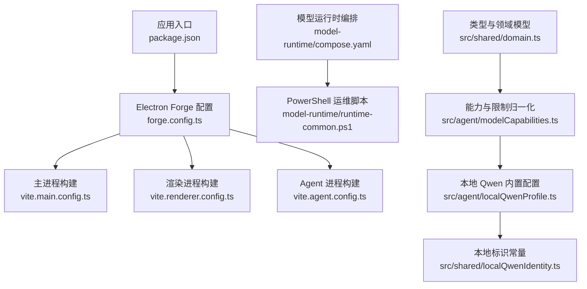
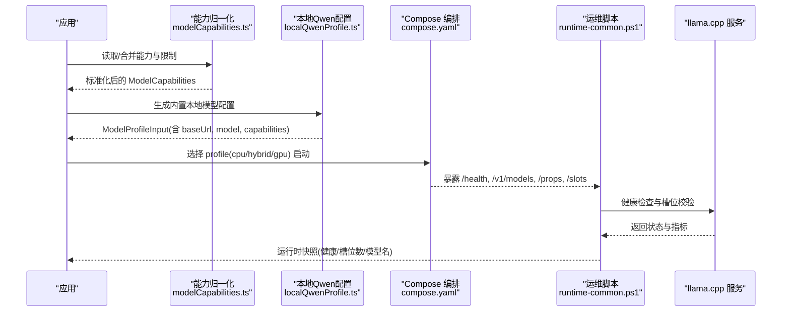
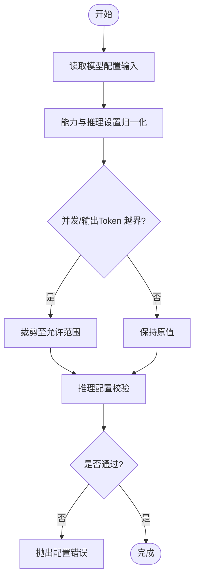
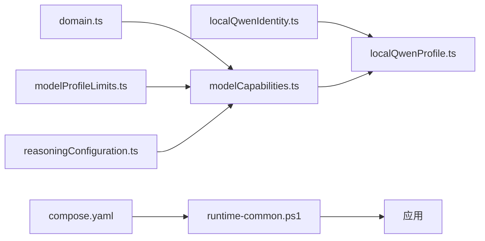

# 配置管理

<cite>
**本文引用的文件**
- [package.json](file://package.json)
- [forge.config.ts](file://forge.config.ts)
- [vite.main.config.ts](file://vite.main.config.ts)
- [vite.renderer.config.ts](file://vite.renderer.config.ts)
- [vite.agent.config.ts](file://vite.agent.config.ts)
- [tsconfig.json](file://tsconfig.json)
- [src/shared/domain.ts](file://src/shared/domain.ts)
- [src/agent/modelCapabilities.ts](file://src/agent/modelCapabilities.ts)
- [src/agent/localQwenProfile.ts](file://src/agent/localQwenProfile.ts)
- [src/shared/localQwenIdentity.ts](file://src/shared/localQwenIdentity.ts)
- [src/shared/modelProfileLimits.ts](file://src/shared/modelProfileLimits.ts)
- [src/shared/reasoningConfiguration.ts](file://src/shared/reasoningConfiguration.ts)
- [model-runtime/compose.yaml](file://model-runtime/compose.yaml)
- [model-runtime/runtime-common.ps1](file://model-runtime/runtime-common.ps1)
- [tests/modelRuntimeConfig.test.ts](file://tests/modelRuntimeConfig.test.ts)
- [tests/modelCapabilities.test.ts](file://tests/modelCapabilities.test.ts)
</cite>

## 目录
1. [简介](#简介)
2. [项目结构](#项目结构)
3. [核心组件](#核心组件)
4. [架构总览](#架构总览)
5. [详细组件分析](#详细组件分析)
6. [依赖关系分析](#依赖关系分析)
7. [性能考量](#性能考量)
8. [故障排除指南](#故障排除指南)
9. [结论](#结论)
10. [附录](#附录)

## 简介
本文件面向“配置管理系统”，覆盖环境变量、配置文件格式、默认值管理与配置验证机制；详细说明模型配置文件的结构、能力声明、并发限制与超时设置；并给出构建配置、打包设置与分发选项。同时提供不同环境的配置差异、迁移策略、最佳实践与故障排除建议，帮助开发者在不同环境中稳定地运行本地或远程模型运行时。

## 项目结构
本项目采用 Electron + Vite 的多进程架构：主进程、渲染进程、Agent 子进程分别由独立的 Vite 配置构建；Electron Forge 负责打包与分发；模型运行时通过 Docker Compose 以三种 profile（cpu/hybrid/gpu）启动，并通过 PowerShell 脚本进行健康检查与端口占用校验。

图表来源
- [package.json:1-35](file://package.json#L1-L35)
- [forge.config.ts:1-50](file://forge.config.ts#L1-L50)
- [vite.main.config.ts:1-10](file://vite.main.config.ts#L1-L10)
- [vite.renderer.config.ts:1-7](file://vite.renderer.config.ts#L1-L7)
- [vite.agent.config.ts:1-10](file://vite.agent.config.ts#L1-L10)
- [model-runtime/compose.yaml:1-127](file://model-runtime/compose.yaml#L1-L127)
- [model-runtime/runtime-common.ps1:1-294](file://model-runtime/runtime-common.ps1#L1-L294)
- [src/shared/domain.ts:87-192](file://src/shared/domain.ts#L87-L192)
- [src/agent/modelCapabilities.ts:14-118](file://src/agent/modelCapabilities.ts#L14-L118)
- [src/agent/localQwenProfile.ts:1-32](file://src/agent/localQwenProfile.ts#L1-L32)
- [src/shared/localQwenIdentity.ts:1-21](file://src/shared/localQwenIdentity.ts#L1-L21)

章节来源
- [package.json:1-35](file://package.json#L1-L35)
- [forge.config.ts:1-50](file://forge.config.ts#L1-L50)

## 核心组件
- 应用与构建配置
  - package.json 定义应用元数据、脚本命令与依赖；scripts 中提供 start、test、build、package、make 等命令。
  - forge.config.ts 使用 Electron Forge 的 VitePlugin 将主进程、预加载、Agent 与渲染进程分别构建；packagerConfig 启用 asar 并配置镜像缓存与忽略规则；makers 输出 ZIP 包。
  - vite.*.config.ts 分别控制各进程的 Rollup external 与插件。
- 领域模型与配置结构
  - src/shared/domain.ts 定义了 AppSettings、ModelProfile、ModelCapabilities、ModelReasoningSettings 等核心类型，用于描述应用设置与模型配置。
  - src/shared/modelProfileLimits.ts 提供最大输出 token 的默认值与上限。
  - src/shared/reasoningConfiguration.ts 提供推理配置的冲突检测。
- 能力与限制归一化
  - src/agent/modelCapabilities.ts 实现能力合并、默认值填充、并发与输出长度边界约束，以及推理选择的校验。
- 本地 Qwen 内置配置
  - src/agent/localQwenProfile.ts 基于常量生成一个内置的本地 Qwen 模型配置，包含能力、推理模式、并发与输出限制。
  - src/shared/localQwenIdentity.ts 提供本地服务地址、模型名与 Profile ID 常量及识别函数。
- 模型运行时与环境变量
  - model-runtime/compose.yaml 定义 cpu/hybrid/gpu 三个 profile，绑定 127.0.0.1:8080，挂载模型权重为只读，并通过环境变量 LLAMA_PARALLEL、LLAMA_CTX_SIZE、LLAMA_N_PREDICT、LLAMA_GPU_LAYERS_HYBRID 控制行为。
  - model-runtime/runtime-common.ps1 提供端口占用检查、Docker 守护进程检查、容器所有权判定、健康检查与槽位一致性校验等工具函数。

章节来源
- [package.json:1-35](file://package.json#L1-L35)
- [forge.config.ts:1-50](file://forge.config.ts#L1-L50)
- [vite.main.config.ts:1-10](file://vite.main.config.ts#L1-L10)
- [vite.renderer.config.ts:1-7](file://vite.renderer.config.ts#L1-L7)
- [vite.agent.config.ts:1-10](file://vite.agent.config.ts#L1-L10)
- [src/shared/domain.ts:87-192](file://src/shared/domain.ts#L87-L192)
- [src/shared/modelProfileLimits.ts:1-3](file://src/shared/modelProfileLimits.ts#L1-L3)
- [src/shared/reasoningConfiguration.ts:1-19](file://src/shared/reasoningConfiguration.ts#L1-L19)
- [src/agent/modelCapabilities.ts:14-118](file://src/agent/modelCapabilities.ts#L14-L118)
- [src/agent/localQwenProfile.ts:1-32](file://src/agent/localQwenProfile.ts#L1-L32)
- [src/shared/localQwenIdentity.ts:1-21](file://src/shared/localQwenIdentity.ts#L1-L21)
- [model-runtime/compose.yaml:1-127](file://model-runtime/compose.yaml#L1-L127)
- [model-runtime/runtime-common.ps1:1-294](file://model-runtime/runtime-common.ps1#L1-L294)

## 架构总览
下图展示了从应用到模型运行的端到端配置链路：应用通过领域模型与能力归一化模块确定模型配置；本地运行时通过 Compose 启动 llama.cpp 服务；PowerShell 脚本负责环境准备与健康检查。

图表来源
- [src/agent/modelCapabilities.ts:14-118](file://src/agent/modelCapabilities.ts#L14-L118)
- [src/agent/localQwenProfile.ts:1-32](file://src/agent/localQwenProfile.ts#L1-L32)
- [model-runtime/compose.yaml:1-127](file://model-runtime/compose.yaml#L1-L127)
- [model-runtime/runtime-common.ps1:170-294](file://model-runtime/runtime-common.ps1#L170-L294)

## 详细组件分析

### 环境变量与运行时配置
- 模型运行时环境变量（来自 compose.yaml 与测试断言）
  - LLAMA_PARALLEL：并行度，示例默认值为 1。
  - LLAMA_CTX_SIZE：上下文窗口大小，示例默认值为 16384。
  - LLAMA_N_PREDICT：单次预测 token 数，示例默认值为 2048。
  - LLAMA_GPU_LAYERS_HYBRID：混合模式下 GPU 层数（仅 hybrid profile）。
  - 注意：当前示例未暴露 HTTP 超时相关变量（测试断言不包含 LLAMA_HTTP_TIMEOUT）。
- 端口与网络
  - 所有服务仅绑定 127.0.0.1:8080，避免外部访问。
- 资源挂载
  - 模型权重文件以只读方式挂载到容器内路径。
- 健康检查
  - Compose 对 /health 进行健康探测；PowerShell 脚本进一步校验 /v1/models、/props、/slots 的一致性。

章节来源
- [model-runtime/compose.yaml:1-127](file://model-runtime/compose.yaml#L1-L127)
- [tests/modelRuntimeConfig.test.ts:1-28](file://tests/modelRuntimeConfig.test.ts#L1-L28)
- [model-runtime/runtime-common.ps1:170-294](file://model-runtime/runtime-common.ps1#L170-L294)

### 模型配置文件结构与能力声明
- 模型配置核心字段（domain.ts）
  - id/name/provider/baseUrl/model：基础标识与连接信息。
  - capabilities：文本、视觉、长上下文、推理输入模式与输出模式、并发限制、流式与用量上报开关。
  - reasoning：推理模式、协议、努力等级与展示模式。
  - maxConcurrency/maxOutputTokens：并发与输出 token 上限。
  - isDefault/responseSpeed：默认标记与历史兼容字段。
- 能力归一化（modelCapabilities.ts）
  - normalizeModelCapabilities：将任意输入合并为规范化的能力对象，处理 legacy 字段（如 streamingUsage），补齐缺失的子段。
  - openAiCapabilities/qwenCapabilities：提供预设能力模板。
  - normalizeMaxConcurrency：在 [1, maxLimit] 范围内裁剪并发限制。
  - normalizeMaxOutputTokens：在 [1, MAX_OUTPUT_TOKENS] 范围内裁剪输出 token 上限，非法值回退到默认值。
- 本地 Qwen 内置配置（localQwenProfile.ts）
  - 使用 localQwenIdentity 中的 baseUrl、model、profileId，结合 qwenCapabilities 与默认输出限制生成 ModelProfileInput。
- 推理配置校验（reasoningConfiguration.ts + modelCapabilities.ts）
  - 当 inputMode 为 unsupported 且 mode 非 disabled 时抛出错误。
  - 当 inputMode 为 effort 时必须提供有效的 effort 值且在 effortOptions 中。
  - 支持自定义请求体（customRequestBody）绕过部分限制。

图表来源
- [src/agent/modelCapabilities.ts:45-118](file://src/agent/modelCapabilities.ts#L45-L118)
- [src/shared/reasoningConfiguration.ts:9-18](file://src/shared/reasoningConfiguration.ts#L9-L18)

章节来源
- [src/shared/domain.ts:87-192](file://src/shared/domain.ts#L87-L192)
- [src/agent/modelCapabilities.ts:14-118](file://src/agent/modelCapabilities.ts#L14-L118)
- [src/agent/localQwenProfile.ts:1-32](file://src/agent/localQwenProfile.ts#L1-L32)
- [src/shared/localQwenIdentity.ts:1-21](file://src/shared/localQwenIdentity.ts#L1-L21)
- [src/shared/modelProfileLimits.ts:1-3](file://src/shared/modelProfileLimits.ts#L1-L3)
- [src/shared/reasoningConfiguration.ts:1-19](file://src/shared/reasoningConfiguration.ts#L1-L19)

### 构建配置、打包设置与分发选项
- 构建
  - Vite 多入口：主进程、预加载、Agent、渲染进程各自独立配置；主/Agent 进程将 electron、node:* 模块设为 external，避免打包进产物。
- 打包
  - Electron Forge 启用 asar 压缩；忽略 .vite 与根级 package.json；下载缓存置于临时目录；使用国内镜像加速 Electron 下载。
  - 输出平台：darwin、linux、win32 的 ZIP 包。
- 分发
  - make 命令生成可分发包；package 命令后执行内容校验脚本（verify-package-contents.mjs）。

章节来源
- [forge.config.ts:1-50](file://forge.config.ts#L1-L50)
- [vite.main.config.ts:1-10](file://vite.main.config.ts#L1-L10)
- [vite.agent.config.ts:1-10](file://vite.agent.config.ts#L1-L10)
- [vite.renderer.config.ts:1-7](file://vite.renderer.config.ts#L1-L7)
- [package.json:1-35](file://package.json#L1-L35)

### 不同环境的配置差异与迁移策略
- 环境差异
  - CPU/Hybrid/GPU 三种 profile：GPU 层数、是否启用 flash-attn、缓存类型等参数不同；Hybrid 使用 LLAMA_GPU_LAYERS_HYBRID。
  - 端口与网络：统一绑定 127.0.0.1:8080，确保本地安全。
  - 环境变量：并行度、上下文窗口、预测长度可通过 .env 调整；当前示例未暴露 HTTP 超时变量。
- 迁移策略
  - 旧版 Qwen 推理标志（reasoning: true）会被自动迁移为 toggle 模式与 raw 输出模式。
  - 遗留 streamingUsage 字段将被映射到 streaming 与 usage 开关。
  - 并发与输出 token 限制会被强制裁剪到能力声明的范围内，避免越界配置。
  - 若推理模式为 enabled 但能力不支持，或 effort 不在 effortOptions 中，将抛出明确错误提示。

章节来源
- [model-runtime/compose.yaml:1-127](file://model-runtime/compose.yaml#L1-L127)
- [src/agent/modelCapabilities.ts:45-118](file://src/agent/modelCapabilities.ts#L45-L118)
- [tests/modelCapabilities.test.ts:14-163](file://tests/modelCapabilities.test.ts#L14-L163)

### 配置最佳实践
- 模型运行时
  - 优先使用本地回环地址（127.0.0.1）暴露服务，避免外网暴露。
  - 合理设置 LLAMA_CTX_SIZE 与 LLAMA_N_PREDICT，避免内存溢出与响应过长。
  - 根据硬件选择合适 profile：CPU 开发调试、Hybrid 兼顾速度与显存、GPU 全量加速。
- 应用配置
  - 使用能力归一化函数处理用户输入，确保并发与输出 token 不越界。
  - 对推理模式进行严格校验，避免 unsupported 情况下启用推理。
  - 使用内置本地 Qwen 配置快速验证链路，再替换为自定义 provider。
- 构建与分发
  - 保持 asar 开启以提升安全性与启动速度。
  - 使用国内镜像加速 Electron 下载，提升 CI/CD 稳定性。
  - 在 package 后执行内容校验，确保产物完整性。

[本节为通用指导，不直接分析具体文件]

### 故障排除指南
- 端口占用
  - 若 127.0.0.1:8080 被占用，启动前会抛出错误；需停止占用该端口的服务后再启动。
- Docker 守护进程不可用
  - 若 docker 命令不可用或守护进程未运行，将抛出错误；请检查 Docker CLI 与 daemon 状态。
- 模型工件缺失或不一致
  - 若模型权重文件缺失、大小或 SHA-256 不一致，将抛出错误；请重新下载或校验模型文件。
- 运行时健康检查失败
  - /health 未返回 ok、/v1/models 未包含预期模型、/props 与 /slots 槽位数不一致时，将抛出错误；请检查 Compose 配置与服务日志。
- 推理配置错误
  - 当推理模式与能力不匹配或缺少必要 effort 时，将抛出错误；请依据能力声明调整推理设置。

章节来源
- [model-runtime/runtime-common.ps1:22-52](file://model-runtime/runtime-common.ps1#L22-L52)
- [model-runtime/runtime-common.ps1:154-187](file://model-runtime/runtime-common.ps1#L154-L187)
- [model-runtime/runtime-common.ps1:211-294](file://model-runtime/runtime-common.ps1#L211-L294)
- [src/agent/modelCapabilities.ts:120-148](file://src/agent/modelCapabilities.ts#L120-L148)

## 依赖关系分析
- 模块耦合
  - domain.ts 提供类型契约，被 modelCapabilities.ts、localQwenProfile.ts 等引用。
  - modelCapabilities.ts 依赖 modelProfileLimits.ts 与 reasoningConfiguration.ts，形成能力与限制的强内聚。
  - localQwenProfile.ts 依赖 localQwenIdentity.ts 与 modelCapabilities.ts，封装内置配置。
  - compose.yaml 与 runtime-common.ps1 共同构成运行时依赖，脚本依赖 Compose 暴露的接口。
- 外部依赖
  - Electron、Vite、Electron Forge、Docker Compose、llama.cpp 镜像。
- 潜在循环依赖
  - 当前代码按职责分层清晰，未见明显循环依赖。

图表来源
- [src/shared/domain.ts:87-192](file://src/shared/domain.ts#L87-L192)
- [src/agent/modelCapabilities.ts:14-118](file://src/agent/modelCapabilities.ts#L14-L118)
- [src/shared/modelProfileLimits.ts:1-3](file://src/shared/modelProfileLimits.ts#L1-L3)
- [src/shared/reasoningConfiguration.ts:1-19](file://src/shared/reasoningConfiguration.ts#L1-L19)
- [src/agent/localQwenProfile.ts:1-32](file://src/agent/localQwenProfile.ts#L1-L32)
- [src/shared/localQwenIdentity.ts:1-21](file://src/shared/localQwenIdentity.ts#L1-L21)
- [model-runtime/compose.yaml:1-127](file://model-runtime/compose.yaml#L1-L127)
- [model-runtime/runtime-common.ps1:170-294](file://model-runtime/runtime-common.ps1#L170-L294)

章节来源
- [src/shared/domain.ts:87-192](file://src/shared/domain.ts#L87-L192)
- [src/agent/modelCapabilities.ts:14-118](file://src/agent/modelCapabilities.ts#L14-L118)
- [model-runtime/compose.yaml:1-127](file://model-runtime/compose.yaml#L1-L127)
- [model-runtime/runtime-common.ps1:170-294](file://model-runtime/runtime-common.ps1#L170-L294)

## 性能考量
- 并发与吞吐
  - 通过 capabilities.concurrency 的 defaultLimit 与 maxLimit 控制并发；normalizeMaxConcurrency 会将超出范围的值裁剪到允许区间。
- 输出长度
  - normalizeMaxOutputTokens 将输出 token 限制在 [1, MAX_OUTPUT_TOKENS]，避免超长响应导致内存压力。
- 上下文与预测
  - LLAMA_CTX_SIZE 影响上下文窗口大小；LLAMA_N_PREDICT 控制单次预测长度；两者需根据硬件与任务调优。
- 流式与用量
  - streaming 与 usage.tokens/reasoningTokens 开关可根据需求关闭以减少开销。

[本节为通用指导，不直接分析具体文件]

## 故障排除指南
- 启动阶段
  - 检查 Docker 守护进程与 CLI 可用性；确认端口未被占用。
  - 校验模型工件的存在性、大小与哈希值。
- 运行阶段
  - 通过 /health、/v1/models、/props、/slots 接口验证服务状态与槽位一致性。
  - 若槽位数不一致或服务未就绪，检查 Compose 配置与日志。
- 配置阶段
  - 使用能力归一化与推理校验函数，确保配置合法；遇到错误时根据提示信息调整。

章节来源
- [model-runtime/runtime-common.ps1:22-52](file://model-runtime/runtime-common.ps1#L22-L52)
- [model-runtime/runtime-common.ps1:170-294](file://model-runtime/runtime-common.ps1#L170-L294)
- [src/agent/modelCapabilities.ts:120-148](file://src/agent/modelCapabilities.ts#L120-L148)

## 结论
本配置管理系统通过清晰的领域模型、能力归一化与严格的校验机制，确保模型配置在不同环境下的一致性与健壮性。结合 Docker Compose 的 profile 化编排与 PowerShell 的健康检查，实现了本地模型运行时的可观测性与可维护性。遵循本文的最佳实践与故障排除建议，可在多种硬件条件下稳定运行并提供一致的体验。

[本节为总结，不直接分析具体文件]

## 附录
- 关键类型速览（domain.ts）
  - AppSettings：主题、语言、活跃模型、指标显示、上下文消息限制、推理展示模式。
  - ModelProfile：模型标识、提供者、基址、模型名、API Key 配置、能力、推理设置、并发与输出限制、默认标记与时间戳。
  - ModelCapabilities：文本/视觉/长上下文、推理输入模式与输出模式、并发限制、流式与用量开关。
  - ModelReasoningSettings：推理模式、协议、努力等级、展示模式。
- 环境变量清单（compose.yaml 与测试断言）
  - LLAMA_PARALLEL、LLAMA_CTX_SIZE、LLAMA_N_PREDICT、LLAMA_GPU_LAYERS_HYBRID。
- 构建与打包
  - Vite 多进程构建、Electron Forge 打包为 ZIP、asars 压缩与镜像加速。

章节来源
- [src/shared/domain.ts:87-192](file://src/shared/domain.ts#L87-L192)
- [model-runtime/compose.yaml:1-127](file://model-runtime/compose.yaml#L1-L127)
- [tests/modelRuntimeConfig.test.ts:1-28](file://tests/modelRuntimeConfig.test.ts#L1-L28)
- [forge.config.ts:1-50](file://forge.config.ts#L1-L50)