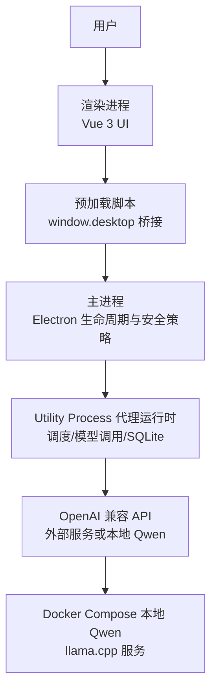
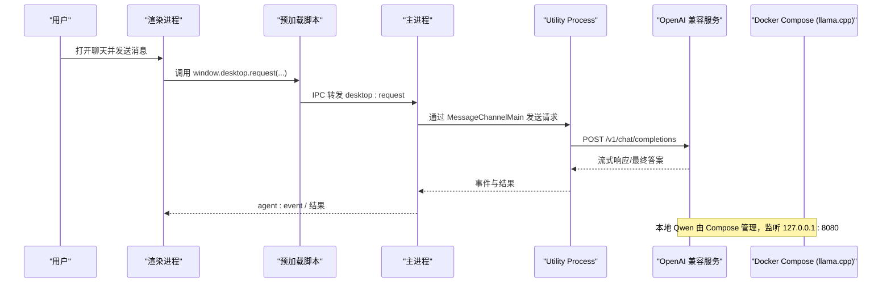
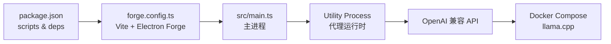

# 快速开始

<cite>
**本文引用的文件**
- [README.md](file://README.md)
- [package.json](file://package.json)
- [forge.config.ts](file://forge.config.ts)
- [src/main.ts](file://src/main.ts)
- [model-runtime/README.md](file://model-runtime/README.md)
- [model-runtime/compose.yaml](file://model-runtime/compose.yaml)
- [model-runtime/start-model.ps1](file://model-runtime/start-model.ps1)
- [model-runtime/status-model.ps1](file://model-runtime/status-model.ps1)
- [model-runtime/verify-model.ps1](file://model-runtime/verify-model.ps1)
- [model-runtime/runtime-common.ps1](file://model-runtime/runtime-common.ps1)
- [src/shared/localQwenIdentity.ts](file://src/shared/localQwenIdentity.ts)
- [src/shared/domain.ts](file://src/shared/domain.ts)
</cite>

## 目录
1. [简介](#简介)
2. [项目结构](#项目结构)
3. [核心组件](#核心组件)
4. [架构总览](#架构总览)
5. [详细组件分析](#详细组件分析)
6. [依赖关系分析](#依赖关系分析)
7. [性能注意事项](#性能注意事项)
8. [故障排除指南](#故障排除指南)
9. [结论](#结论)
10. [附录：验证与命令速查](#附录：验证与命令速查)

## 简介
本快速开始指南帮助你在最短时间内安装、配置并运行 Private AI Desktop，体验本地 Qwen 模型或 OpenAI 兼容 API。你将完成以下目标：
- 准备 Node.js 环境与 pnpm
- 安装依赖并启动应用
- 在“设置 → 模型提供商”中配置第一个 OpenAI 兼容端点并测试连接
- 使用 Docker Compose 启动本地 Qwen 运行时（CPU/GPU/Hybrid）
- 通过健康检查、模型发现与补全请求验证服务可用
- 解决端口冲突、权限问题、网络连接失败等常见问题

## 项目结构
Private AI Desktop 采用 Electron + Vue 3 + TypeScript 的桌面应用架构，包含渲染进程、主进程、Utility Process 代理运行时以及独立的本地 Qwen 运行时（Docker Compose）。

图表来源
- [src/main.ts:1-170](file://src/main.ts#L1-L170)
- [forge.config.ts:1-50](file://forge.config.ts#L1-L50)
- [model-runtime/compose.yaml:1-127](file://model-runtime/compose.yaml#L1-L127)

章节来源
- [README.md:1-121](file://README.md#L1-L121)
- [package.json:1-35](file://package.json#L1-L35)
- [forge.config.ts:1-50](file://forge.config.ts#L1-L50)
- [src/main.ts:1-170](file://src/main.ts#L1-L170)

## 核心组件
- 渲染进程：仅负责 UI，不直接访问文件系统、网络、SQLite 或密钥。
- 预加载脚本：通过 contextBridge 暴露最小化的 window.desktop API。
- 主进程：管理窗口、安全策略、IPC 转发，并启动 Utility Process。
- Utility Process：负责会话调度、模型调用、演示代理运行时与 SQLite 持久化。
- 本地 Qwen 运行时：独立于 Electron 的 Docker Compose 服务，提供 OpenAI 兼容接口。

章节来源
- [README.md:104-112](file://README.md#L104-L112)
- [src/main.ts:1-170](file://src/main.ts#L1-L170)
- [model-runtime/README.md:1-53](file://model-runtime/README.md#L1-L53)

## 架构总览
下图展示了从 UI 到模型服务的完整调用链，包括本地 Qwen 运行时与健康检查流程。

图表来源
- [src/main.ts:19-54](file://src/main.ts#L19-L54)
- [src/main.ts:103-108](file://src/main.ts#L103-L108)
- [model-runtime/compose.yaml:1-127](file://model-runtime/compose.yaml#L1-L127)

## 详细组件分析

### 环境要求与安装
- Node.js：建议使用当前稳定版本（用于 Vite/Electron 构建与开发）。
- pnpm：用于包管理与脚本执行。
- Docker：用于本地 Qwen 运行时（GPU/CPU/Hybrid 模式）。

步骤
1) 安装 Node.js 与 pnpm（若尚未安装）。
2) 在项目根目录执行依赖安装：
   - pnpm install
3) 启动应用：
   - pnpm start

预期行为
- 应用启动后显示主窗口。
- 可在“设置 → 模型提供商”中添加 OpenAI 兼容端点并测试连接。

章节来源
- [README.md:5-14](file://README.md#L5-L14)
- [package.json:7-14](file://package.json#L7-L14)

### 配置第一个模型提供商（OpenAI 兼容 API）
- 路径：设置 → 模型提供商
- 必填项：基础 URL（例如 http://127.0.0.1:8080/v1）、模型名称
- 可选项：API Key、推理能力、原生推理输出、最大并发轮次

说明
- 连接测试仅证明端点可达；不会推断或认证模型能力。
- API Key 保存在 Utility Process 与 SQLite 记录中，渲染快照会脱敏。

章节来源
- [README.md:6-14](file://README.md#L6-L14)
- [src/shared/domain.ts:160-192](file://src/shared/domain.ts#L160-L192)

### 本地 Qwen 运行时（独立 Docker Compose）
本地 Qwen 是独立运行的 llama.cpp 服务，对外暴露 OpenAI 兼容接口：
- 健康检查：http://127.0.0.1:8080/health
- 模型发现：http://127.0.0.1:8080/v1/models（列出别名 Qwen3.5-9B）
- 对话补全：http://127.0.0.1:8080/v1/chat/completions

配置文件
- 首次使用前复制环境变量示例：
  - Copy-Item .env.example .env（位于 model-runtime 目录）

启动模式
- CPU：docker compose --env-file .env --profile cpu up -d
- Hybrid：docker compose --env-file .env --profile hybrid up -d
- GPU：docker compose --env-file .env --profile gpu up -d

停止当前模式
- docker compose --env-file .env down

容量默认值
- LLAMA_PARALLEL=1，LLAMA_CTX_SIZE=16384（单槽位，总上下文 16,384 token）
- 如需双槽位且保持每请求上下文不变，需同时提高并行度与总上下文（例如 2 与 32768）
- LLAMA_N_PREDICT=2048 为服务端生成上限

注意
- 启动或退出 Electron 不会自动启停模型容器；请显式管理 Compose 项目。
- GPU 模式需要宿主支持 Docker GPU。

章节来源
- [model-runtime/README.md:1-53](file://model-runtime/README.md#L1-L53)
- [model-runtime/compose.yaml:1-127](file://model-runtime/compose.yaml#L1-L127)

### 启动、状态与验证脚本（Windows PowerShell）
常用命令（从仓库根目录执行）：
- 启动模型：powershell -NoProfile -ExecutionPolicy Bypass -File .\model-runtime\start-model.ps1 -Profile gpu
- 查看状态：powershell -NoProfile -ExecutionPolicy Bypass -File .\model-runtime\status-model.ps1
- 验证连通性：powershell -NoProfile -ExecutionPolicy Bypass -File .\model-runtime\verify-model.ps1 -ConcurrentRequests 1
- 停止模型：powershell -NoProfile -ExecutionPolicy Bypass -File .\model-runtime\stop-model.ps1

启动流程要点
- 校验模型工件（大小与 SHA-256）
- 检查 Docker 守护进程可用
- 确保端口 127.0.0.1:8080 未被占用
- 启动指定 profile 的容器并等待健康
- GPU 启动失败时，尝试回退一次到 hybrid 模式

状态与验证
- status-model：输出项目名、profile、状态、主机、端口、健康、模型、槽位数
- verify-model：调用 /health、/v1/models、/props、/slots 并执行一次补全请求；可选并发请求验证

章节来源
- [README.md:16-34](file://README.md#L16-L34)
- [model-runtime/start-model.ps1:1-154](file://model-runtime/start-model.ps1#L1-L154)
- [model-runtime/status-model.ps1:1-18](file://model-runtime/status-model.ps1#L1-L18)
- [model-runtime/verify-model.ps1:1-90](file://model-runtime/verify-model.ps1#L1-L90)
- [model-runtime/runtime-common.ps1:1-294](file://model-runtime/runtime-common.ps1#L1-L294)

### 内置本地 Qwen 标识与客户端配置
内置本地 Qwen 标识：
- baseUrl：http://127.0.0.1:8080/v1
- model：Qwen3.5-9B
- provider：openai-compatible
- profile id：local-qwen35

当你在“设置 → 模型提供商”中配置上述值时，客户端将识别为内置本地 Qwen 配置。

章节来源
- [src/shared/localQwenIdentity.ts:1-21](file://src/shared/localQwenIdentity.ts#L1-L21)

### 应用启动与控制流
主进程职责
- 创建 BrowserWindow 并启用安全策略（沙箱、contextIsolation、禁用 nodeIntegration）
- 启动 Utility Process 作为代理运行时
- 通过 MessageChannelMain 建立与代理的双向通信
- 处理 IPC 请求并转发至代理

章节来源
- [src/main.ts:1-170](file://src/main.ts#L1-L170)
- [forge.config.ts:1-50](file://forge.config.ts#L1-L50)

## 依赖关系分析
- 构建与打包：Vite + Electron Forge（ZIP 分发）
- 运行时：Electron 主进程、Utility Process、Vue 3 渲染进程
- 本地运行时：Docker Compose + llama.cpp（CPU/Hybrid/GPU 三种 profile）

图表来源
- [package.json:1-35](file://package.json#L1-L35)
- [forge.config.ts:1-50](file://forge.config.ts#L1-L50)
- [src/main.ts:1-170](file://src/main.ts#L1-L170)
- [model-runtime/compose.yaml:1-127](file://model-runtime/compose.yaml#L1-L127)

章节来源
- [package.json:1-35](file://package.json#L1-L35)
- [forge.config.ts:1-50](file://forge.config.ts#L1-L50)

## 性能注意事项
- 并发与上下文容量分离：运行时槽位与服务端上下文容量决定服务能力；客户端最大并发限制控制 FIFO 准入。两者不同步，连接测试可能报告不一致。
- 提升并行度时需同步增加总上下文，以避免内存压力与延迟上升。
- 本地 Qwen 默认单槽位与 16,384 总上下文；按需调整 LLAMA_PARALLEL 与 LLAMA_CTX_SIZE。
- 生成上限 LLAMA_N_PREDICT=2048；超出限制将触发受控失败而非空答案。

章节来源
- [README.md:30-34](file://README.md#L30-L34)
- [model-runtime/README.md:41-49](file://model-runtime/README.md#L41-L49)

## 故障排除指南
常见问题与解决方案
- 端口冲突（127.0.0.1:8080 被占用）
  - 现象：启动模型时报端口已被占用
  - 解决：停止占用该端口的服务后再启动模型；脚本会在切换前停止已拥有该端口的 Compose 项目
- Docker 不可用或未启动
  - 现象：脚本提示 Docker CLI 不可用或守护进程未运行
  - 解决：安装 Docker 并确保守护进程正在运行
- 模型工件缺失或校验失败
  - 现象：缺少 gguf 文件或 SHA-256 不匹配
  - 解决：放置正确的模型文件并核对大小与哈希
- 网络连接失败
  - 现象：连接测试失败或无法访问 /health、/v1/models
  - 解决：确认 Compose 服务已启动且健康；检查防火墙与代理设置
- GPU 启动失败
  - 现象：GPU profile 启动失败或健康检查失败
  - 解决：脚本会自动尝试回退到 hybrid；如仍失败，检查宿主 GPU 驱动与 Docker GPU 支持
- 权限问题（PowerShell 执行策略）
  - 现象：脚本无法执行
  - 解决：使用 -ExecutionPolicy Bypass 或在当前会话临时放宽策略

章节来源
- [model-runtime/runtime-common.ps1:43-65](file://model-runtime/runtime-common.ps1#L43-L65)
- [model-runtime/start-model.ps1:105-149](file://model-runtime/start-model.ps1#L105-L149)
- [model-runtime/verify-model.ps1:31-80](file://model-runtime/verify-model.ps1#L31-L80)

## 结论
通过以上步骤，你可以在几分钟内完成 Private AI Desktop 的安装与运行，并体验本地 Qwen 或 OpenAI 兼容 API 的核心功能。建议先使用内置本地 Qwen 配置进行端到端验证，再根据需要切换到其他提供商。

## 附录：验证与命令速查
- 安装与启动
  - pnpm install
  - pnpm start
- 本地 Qwen 运行时
  - 复制环境变量：Copy-Item .env.example .env（在 model-runtime 目录）
  - 启动 CPU：docker compose --env-file .env --profile cpu up -d
  - 启动 Hybrid：docker compose --env-file .env --profile hybrid up -d
  - 启动 GPU：docker compose --env-file .env --profile gpu up -d
  - 停止：docker compose --env-file .env down
- 健康检查与模型发现
  - http://127.0.0.1:8080/health
  - http://127.0.0.1:8080/v1/models
- 验证脚本
  - 启动模型：powershell -NoProfile -ExecutionPolicy Bypass -File .\model-runtime\start-model.ps1 -Profile gpu
  - 查看状态：powershell -NoProfile -ExecutionPolicy Bypass -File .\model-runtime\status-model.ps1
  - 验证连通性：powershell -NoProfile -ExecutionPolicy Bypass -File .\model-runtime\verify-model.ps1 -ConcurrentRequests 1
  - 停止模型：powershell -NoProfile -ExecutionPolicy Bypass -File .\model-runtime\stop-model.ps1
- 应用测试与构建
  - 单元测试：pnpm test
  - 类型检查：pnpm typecheck
  - 端到端测试：pnpm test:e2e
  - 打包制品：pnpm make

章节来源
- [README.md:5-14](file://README.md#L5-L14)
- [README.md:78-85](file://README.md#L78-L85)
- [model-runtime/README.md:7-39](file://model-runtime/README.md#L7-L39)
- [model-runtime/start-model.ps1:1-154](file://model-runtime/start-model.ps1#L1-L154)
- [model-runtime/status-model.ps1:1-18](file://model-runtime/status-model.ps1#L1-L18)
- [model-runtime/verify-model.ps1:1-90](file://model-runtime/verify-model.ps1#L1-L90)