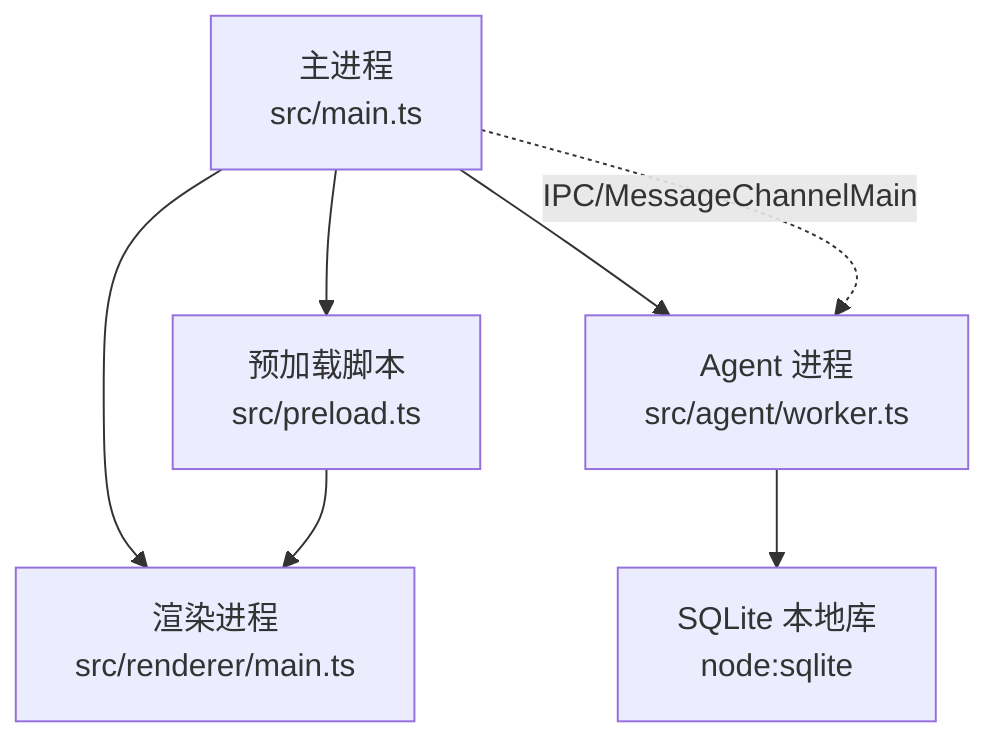
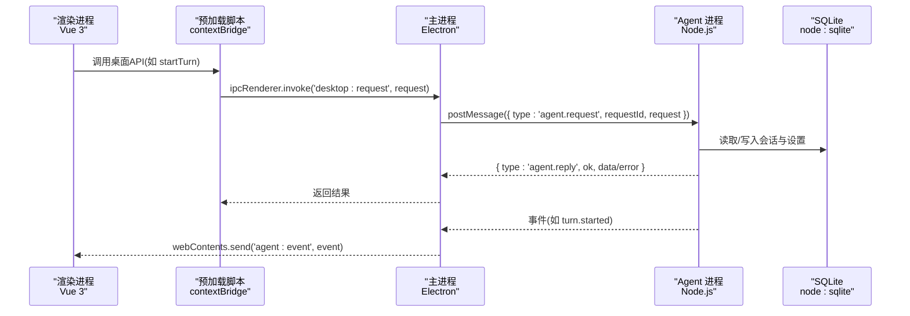
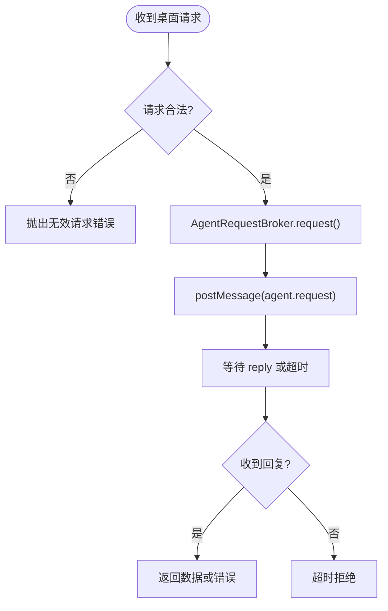
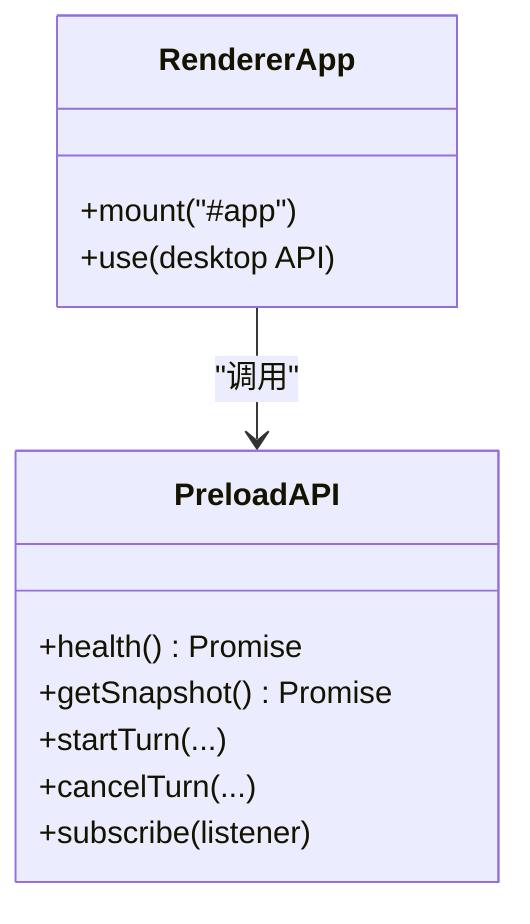
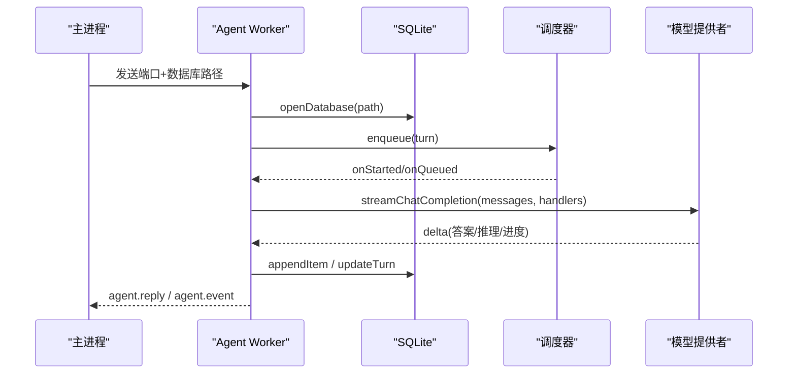
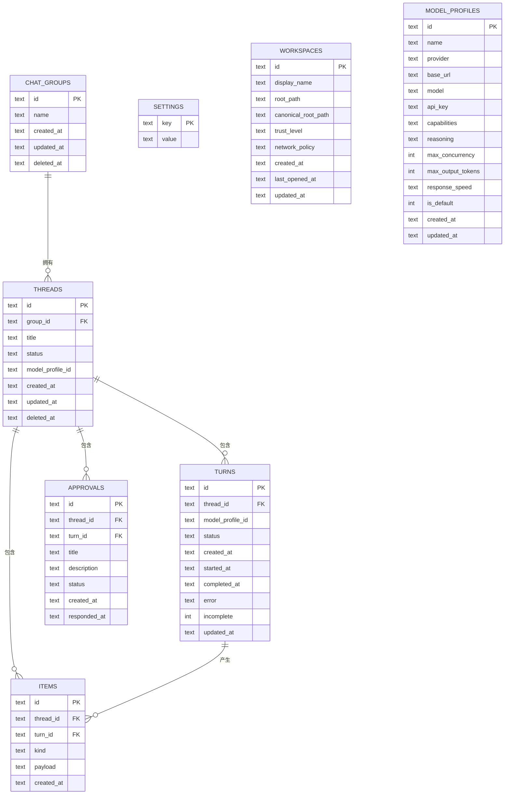
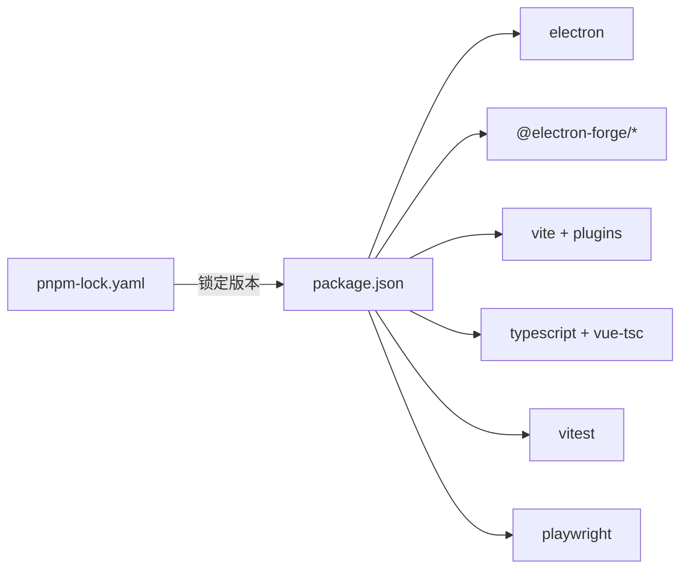

# 技术栈概览

<cite>
**本文引用的文件**
- [package.json](file://package.json)
- [forge.config.ts](file://forge.config.ts)
- [vite.main.config.ts](file://vite.main.config.ts)
- [vite.renderer.config.ts](file://vite.renderer.config.ts)
- [vite.agent.config.ts](file://vite.agent.config.ts)
- [vite.preload.config.ts](file://vite.preload.config.ts)
- [tsconfig.json](file://tsconfig.json)
- [src/main.ts](file://src/main.ts)
- [src/preload.ts](file://src/preload.ts)
- [src/renderer/main.ts](file://src/renderer/main.ts)
- [src/agent/worker.ts](file://src/agent/worker.ts)
- [src/agent/database.ts](file://src/agent/database.ts)
- [src/main/agentRequestBroker.ts](file://src/main/agentRequestBroker.ts)
- [tests/e2e/app.spec.ts](file://tests/e2e/app.spec.ts)
</cite>

## 目录
1. [简介](#简介)
2. [项目结构](#项目结构)
3. [核心组件](#核心组件)
4. [架构总览](#架构总览)
5. [详细组件分析](#详细组件分析)
6. [依赖关系分析](#依赖关系分析)
7. [性能考量](#性能考量)
8. [故障排查指南](#故障排查指南)
9. [结论](#结论)
10. [附录](#附录)

## 简介
本技术栈概览面向 Private AI Desktop，系统性梳理其多进程桌面应用的技术选型与职责划分。项目采用 Electron 作为跨平台桌面框架，结合 Vue 3 构建渲染层界面；通过 Vite 进行多入口构建；使用 TypeScript 提供强类型保障；在独立的 Agent 进程中以 Node.js 运行时执行业务逻辑，并使用 SQLite（Node 原生）实现本地持久化。开发工具链包含 pnpm、Playwright 端到端测试与 Vitest 单元测试，配合 Electron Forge 完成打包与分发。

## 项目结构
仓库采用按“进程/领域”划分的目录组织方式：
- src/main.ts：Electron 主进程入口，负责窗口管理、安全策略、Agent 进程生命周期与 IPC 路由。
- src/preload.ts：预加载脚本，通过 contextBridge 暴露安全的桌面 API 给渲染进程。
- src/renderer/*：Vue 3 渲染层代码，包括组件、样式、国际化与入口。
- src/agent/*：Agent 进程核心，包含工作线程、数据库、调度器、模型调用等。
- src/shared/*：跨进程共享的类型与协议定义。
- tests/*：Vitest 单元测试与 Playwright 端到端测试。
- vite.*.config.ts：为不同进程分别配置 Vite 构建选项。
- forge.config.ts：Electron Forge 打包配置，集成 Vite 插件并声明各进程入口。

图表来源
- [src/main.ts:1-170](file://src/main.ts#L1-L170)
- [src/preload.ts:1-32](file://src/preload.ts#L1-L32)
- [src/renderer/main.ts:1-7](file://src/renderer/main.ts#L1-L7)
- [src/agent/worker.ts:1-125](file://src/agent/worker.ts#L1-L125)
- [src/agent/database.ts:1-68](file://src/agent/database.ts#L1-L68)

章节来源
- [forge.config.ts:1-50](file://forge.config.ts#L1-L50)
- [vite.main.config.ts:1-10](file://vite.main.config.ts#L1-L10)
- [vite.renderer.config.ts:1-7](file://vite.renderer.config.ts#L1-L7)
- [vite.agent.config.ts:1-10](file://vite.agent.config.ts#L1-L10)
- [vite.preload.config.ts:1-10](file://vite.preload.config.ts#L1-L10)

## 核心组件
- 主进程（Electron）
  - 职责：创建 BrowserWindow、启用安全偏好（contextIsolation、sandbox）、启动 Agent 子进程、处理 IPC 请求、转发事件到渲染进程。
  - 关键能力：UtilityProcess 启动 worker、MessageChannelMain 双向通信、ipcMain.handle 路由桌面请求。
- 预加载脚本（Context Bridge）
  - 职责：将受限的桌面能力暴露给渲染进程，屏蔽底层 IPC 细节，统一请求格式。
  - 关键能力：contextBridge.exposeInMainWorld、ipcRenderer.invoke/on。
- 渲染进程（Vue 3 + Vite）
  - 职责：用户界面与交互，订阅 Agent 事件，调用桌面 API 发起请求。
  - 关键能力：createApp(App).mount('#app')，主题与样式注入。
- Agent 进程（Node.js 运行时）
  - 职责：执行业务逻辑（会话、任务调度、模型调用、审批流），维护 SQLite 数据快照，向主进程回发响应与事件。
  - 关键能力：DatabaseSync 操作 SQLite、ModelTurnScheduler 并发控制、streaming 回调、错误脱敏。
- 构建与打包（Vite + Electron Forge）
  - 职责：为每个进程独立构建，外部化原生模块（electron、node:path、node:sqlite），生成可安装包。
  - 关键能力：@electron-forge/plugin-vite 多 entry、MakerZIP 多平台打包、asar 压缩。

章节来源
- [src/main.ts:1-170](file://src/main.ts#L1-L170)
- [src/preload.ts:1-32](file://src/preload.ts#L1-L32)
- [src/renderer/main.ts:1-7](file://src/renderer/main.ts#L1-L7)
- [src/agent/worker.ts:1-125](file://src/agent/worker.ts#L1-L125)
- [forge.config.ts:1-50](file://forge.config.ts#L1-L50)

## 架构总览
下图展示三进程协作关系：渲染进程通过预加载桥接调用主进程，主进程经 MessageChannelMain 与 Agent 进程通信，Agent 进程读写 SQLite 并返回结果与事件。

图表来源
- [src/preload.ts:5-31](file://src/preload.ts#L5-L31)
- [src/main.ts:98-144](file://src/main.ts#L98-L144)
- [src/agent/worker.ts:106-124](file://src/agent/worker.ts#L106-L124)
- [src/agent/database.ts:150-216](file://src/agent/database.ts#L150-L216)

## 详细组件分析

### 主进程与 Agent 请求代理
- 主进程启动 Agent 子进程并通过 MessageChannelMain 建立端口通道，使用 AgentRequestBroker 管理请求/响应与超时。
- 所有来自渲染进程的桌面请求统一由 ipcMain.handle('desktop:request') 路由至 Agent 进程。
- Agent 进程的事件通过 webContents.send('agent:event') 推送至渲染进程。

图表来源
- [src/main.ts:103-133](file://src/main.ts#L103-L133)
- [src/main/agentRequestBroker.ts:15-85](file://src/main/agentRequestBroker.ts#L15-L85)

章节来源
- [src/main.ts:1-170](file://src/main.ts#L1-L170)
- [src/main/agentRequestBroker.ts:1-86](file://src/main/agentRequestBroker.ts#L1-L86)

### 预加载桥接与渲染进程
- 预加载脚本通过 contextBridge 暴露一组受控方法（健康检查、会话/群组/模型配置、对话轮次、语言与设置等）。
- 渲染进程通过 createApp(App).mount('#app') 挂载 Vue 应用，并引入主题与全局样式。

图表来源
- [src/preload.ts:5-31](file://src/preload.ts#L5-L31)
- [src/renderer/main.ts:1-7](file://src/renderer/main.ts#L1-L7)

章节来源
- [src/preload.ts:1-32](file://src/preload.ts#L1-L32)
- [src/renderer/main.ts:1-7](file://src/renderer/main.ts#L1-L7)

### Agent 进程与工作线程
- Agent 进程接收主进程传递的端口与数据库路径，初始化数据库与会话运行时。
- 通过 ModelTurnScheduler 对任务进行排队与并发控制，支持取消、审批、指标上报。
- 流式输出通过回调逐条持久化并转发事件，最终完成时标记 items 完整。

图表来源
- [src/agent/worker.ts:106-124](file://src/agent/worker.ts#L106-L124)
- [src/agent/worker.ts:155-405](file://src/agent/worker.ts#L155-L405)
- [src/agent/database.ts:150-216](file://src/agent/database.ts#L150-L216)

章节来源
- [src/agent/worker.ts:1-689](file://src/agent/worker.ts#L1-L689)

### SQLite 本地数据库
- 使用 DatabaseSync 直接访问 SQLite，开启 WAL 模式、外键约束与忙超时。
- 表结构涵盖群组、会话、轮次、条目、审批、设置、工作区与模型配置。
- 提供 getSnapshot 聚合查询，以及事务化的增删改查，确保一致性。

图表来源
- [src/agent/database.ts:731-800](file://src/agent/database.ts#L731-L800)

章节来源
- [src/agent/database.ts:1-800](file://src/agent/database.ts#L1-L800)

### 构建与打包（Vite + Electron Forge）
- 主进程、预加载、Agent 进程与渲染进程各自拥有独立 Vite 配置，按需 external 原生模块。
- Electron Forge 通过 @electron-forge/plugin-vite 统一管理构建流程，并输出 ZIP 包。
- 通过 asar 压缩资源，配置镜像加速下载 Electron 二进制。

章节来源
- [forge.config.ts:1-50](file://forge.config.ts#L1-L50)
- [vite.main.config.ts:1-10](file://vite.main.config.ts#L1-L10)
- [vite.preload.config.ts:1-10](file://vite.preload.config.ts#L1-L10)
- [vite.agent.config.ts:1-10](file://vite.agent.config.ts#L1-L10)
- [vite.renderer.config.ts:1-7](file://vite.renderer.config.ts#L1-L7)

## 依赖关系分析
- 运行时依赖
  - vue：渲染层框架。
- 开发依赖
  - electron、@electron-forge/*、vite、@vitejs/plugin-vue：构建与打包。
  - typescript、vue-tsc：类型检查。
  - vitest、playwright：单元与端到端测试。
- 版本兼容性与锁定
  - package.json 中明确列出各依赖版本范围。
  - pnpm-lock.yaml 锁定实际安装版本，保证构建可重复性。
  - tsconfig 指定目标 ES2022、模块解析策略与严格模式，确保跨进程类型一致。

图表来源
- [package.json:1-35](file://package.json#L1-L35)

章节来源
- [package.json:1-35](file://package.json#L1-L35)

## 性能考量
- 并发与队列
  - Agent 进程内使用调度器限制每模型的并发度，避免过载；队列位置变化实时同步到 UI。
- 流式输出与持久化
  - 增量写入 SQLite，减少内存占用；完成时批量标记条目完整，降低锁竞争。
- I/O 优化
  - SQLite 开启 WAL 模式与外键约束，提升并发读性能与数据一致性。
- 构建优化
  - 通过 external 排除原生模块，减小包体积；asar 压缩资源。

[本节为通用指导，不直接分析具体文件]

## 故障排查指南
- 常见错误定位
  - 主进程未就绪：AgentRequestBroker 会在无端口时拒绝请求。
  - 超时：超过配置的截止时间会拒绝待处理请求。
  - 连接失败：模型连接测试返回离线/模型不匹配等状态。
- 日志与证据
  - 端到端测试会截图保存运行证据，便于复现问题。
  - 错误信息经过脱敏处理，避免泄露敏感字段。
- 恢复机制
  - 重启后中断的未完成轮次会被标记为中断，避免悬挂状态。

章节来源
- [src/main/agentRequestBroker.ts:15-85](file://src/main/agentRequestBroker.ts#L15-L85)
- [tests/e2e/app.spec.ts:76-146](file://tests/e2e/app.spec.ts#L76-L146)
- [tests/e2e/app.spec.ts:479-517](file://tests/e2e/app.spec.ts#L479-L517)

## 结论
Private AI Desktop 通过清晰的多进程边界与安全隔离，将 UI、系统能力与业务逻辑解耦：Electron 主进程负责窗口与进程编排，Vue 3 渲染层专注交互体验，Agent 进程承载核心业务与本地存储。借助 Vite 与 Electron Forge 的现代化构建体系，以及 TypeScript 的类型保障、Vitest 与 Playwright 的测试闭环，项目在可维护性、可扩展性与安全性方面具备良好基础。

## 附录
- 开发命令参考
  - 启动：electron-forge start
  - 类型检查：vue-tsc && tsc
  - 单元测试：vitest run
  - 端到端测试：pnpm package && playwright test
  - 打包：electron-forge package
  - 制作安装包：electron-forge make

章节来源
- [package.json:7-14](file://package.json#L7-L14)