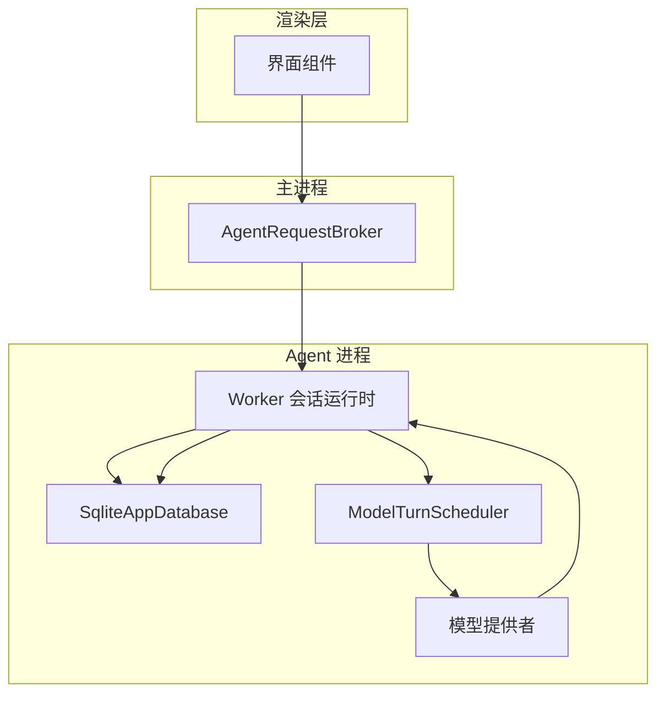
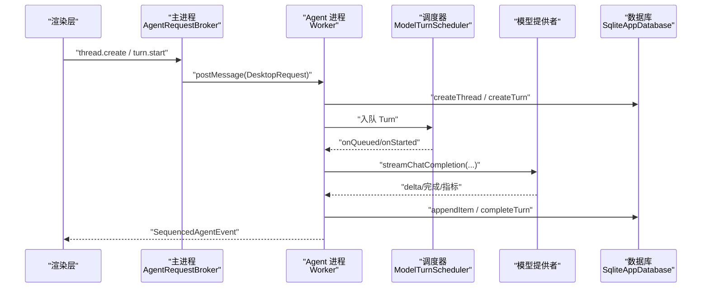
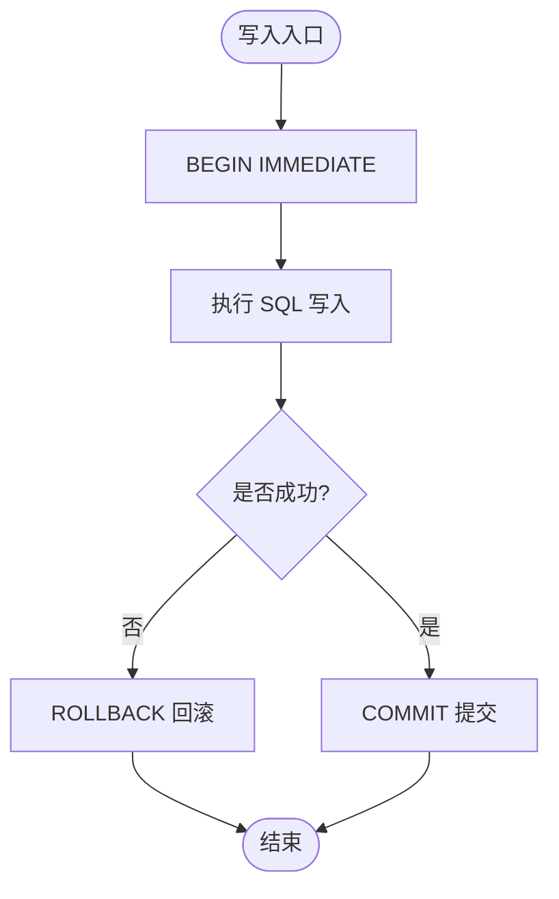
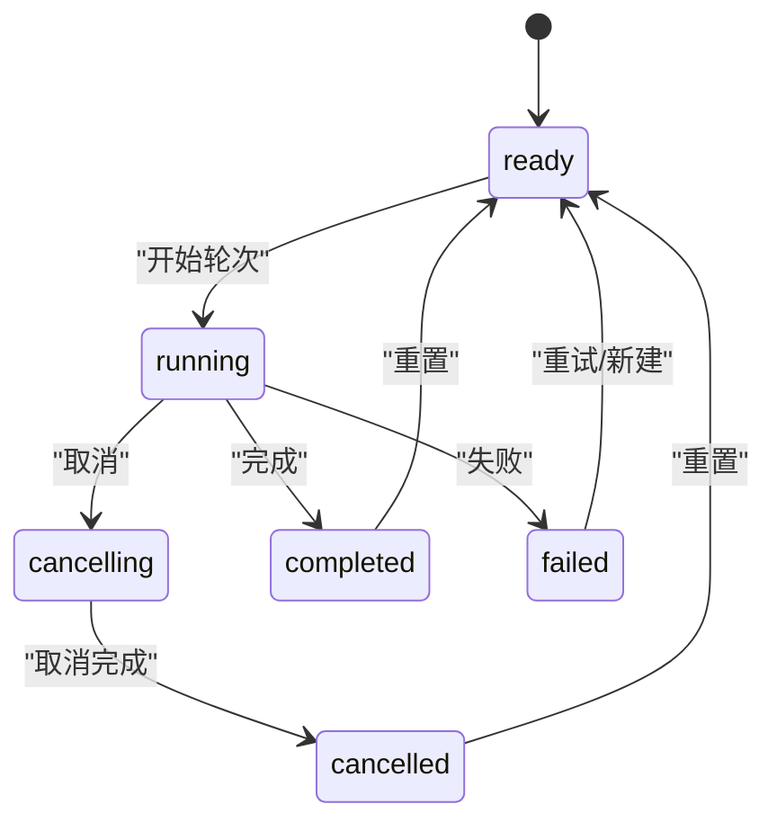
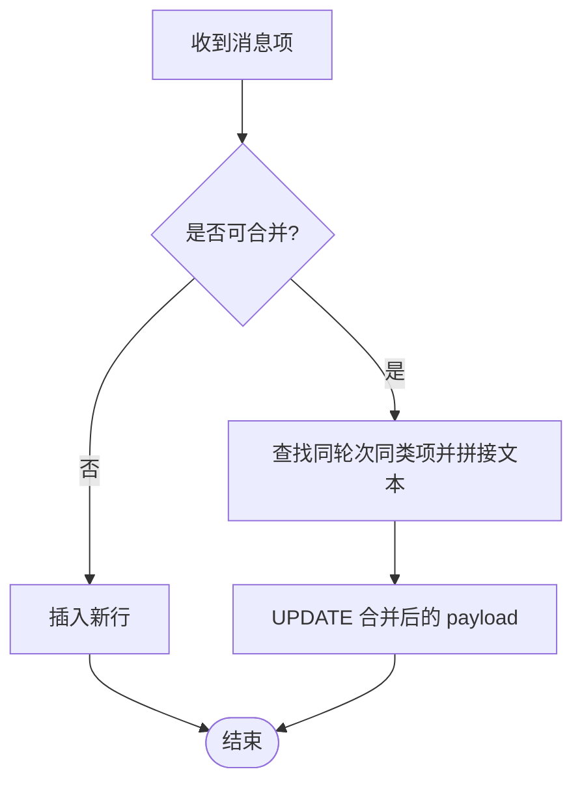
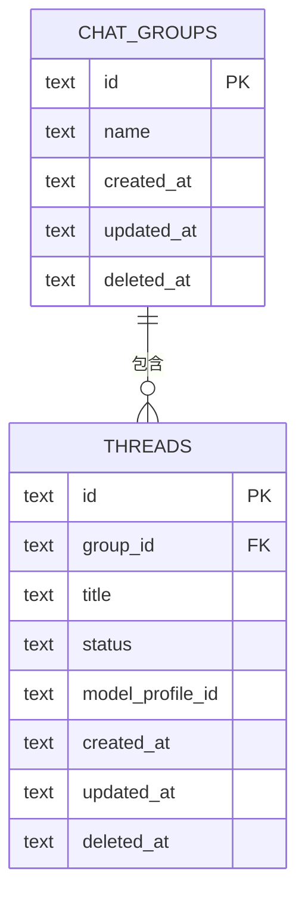
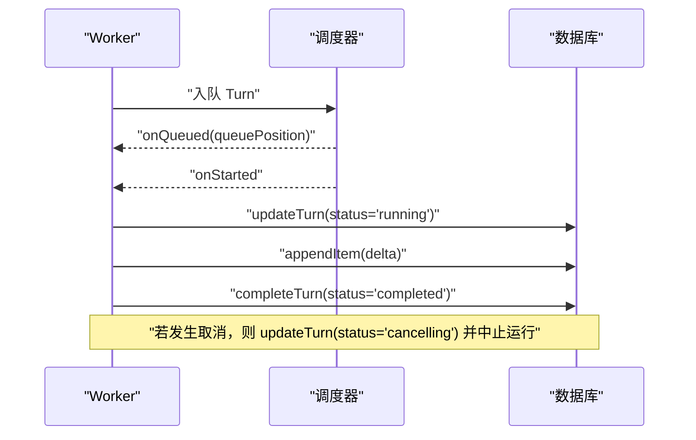
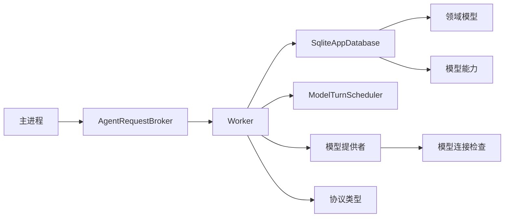

# 会话管理

<cite>
**本文引用的文件**
- [database.ts](file://src/agent/database.ts)
- [domain.ts](file://src/shared/domain.ts)
- [protocol.ts](file://src/shared/protocol.ts)
- [worker.ts](file://src/agent/worker.ts)
- [turnScheduler.ts](file://src/agent/turnScheduler.ts)
- [modelCapabilities.ts](file://src/agent/modelCapabilities.ts)
- [localQwenProfile.ts](file://src/agent/localQwenProfile.ts)
- [modelConnection.ts](file://src/agent/modelConnection.ts)
- [agentRequestBroker.ts](file://src/main/agentRequestBroker.ts)
- [operationErrors.ts](file://src/shared/operationErrors.ts)
- [database.test.ts](file://tests/database.test.ts)
</cite>

## 目录
1. [简介](#简介)
2. [项目结构](#项目结构)
3. [核心组件](#核心组件)
4. [架构总览](#架构总览)
5. [详细组件分析](#详细组件分析)
6. [依赖关系分析](#依赖关系分析)
7. [性能考虑](#性能考虑)
8. [故障排查指南](#故障排查指南)
9. [结论](#结论)
10. [附录](#附录)

## 简介
本文件面向 Private AI Desktop 的“会话管理”能力，围绕会话生命周期、消息存储机制、线程组织结构与 SQLite 数据库设计展开，说明数据持久化策略、查询优化、会话分组与标签（通过组名体现）、搜索（基于快照与过滤）的实现方式。同时覆盖导入导出、备份恢复与数据迁移方案，解释会话状态同步、冲突解决与并发访问控制的技术实现，并提供基于 IPC 协议进行会话操作的编程示例路径。

## 项目结构
- 数据层：SQLite 数据库封装在 Agent 进程内，提供 AppDatabase 接口，负责会话、轮次、消息项、模型配置、设置与工作区的增删改查与快照生成。
- 调度与执行层：Worker 进程维护会话事件流、调用模型提供者、驱动 Turn 调度器，将事件写入数据库并推送给渲染层。
- 协议与类型：共享协议定义桌面端请求与代理事件；领域模型统一描述会话、消息、轮次、模型配置等数据结构。
- 主进程桥接：AgentRequestBroker 管理主进程与 Agent 进程的请求/响应与超时。

图表来源
- [worker.ts:159-200](file://src/agent/worker.ts#L159-L200)
- [database.ts:150-216](file://src/agent/database.ts#L150-L216)
- [turnScheduler.ts:80-126](file://src/agent/turnScheduler.ts#L80-L126)
- [agentRequestBroker.ts:15-85](file://src/main/agentRequestBroker.ts#L15-L85)

章节来源
- [worker.ts:115-127](file://src/agent/worker.ts#L115-L127)
- [database.ts:731-873](file://src/agent/database.ts#L731-L873)
- [protocol.ts:22-65](file://src/shared/protocol.ts#L22-L65)
- [domain.ts:283-319](file://src/shared/domain.ts#L283-L319)

## 核心组件
- SqliteAppDatabase：封装 SQLite 操作，提供 getSnapshot、createThread、appendItem、createTurn/updateTurn/completeTurn/failTurn/interruptUnfinishedTurns、saveModelProfile 等方法；内部使用事务、WAL 模式、外键约束与迁移脚本保证一致性与可演进性。
- Worker 会话运行时：接收桌面端请求，创建/取消轮次，持久化并广播事件，协调模型调用与结果落库。
- ModelTurnScheduler：按模型配置的最大并发度对轮次进行排队与执行，支持抢占式取消与队列位置更新。
- 协议与类型：DesktopRequest/AgentEvent 定义跨进程通信契约；领域模型统一会话、消息、轮次、模型配置等结构。
- 模型能力与本地预设：规范化能力、推理设置、输出令牌上限，并在首次启动时注入默认本地 Qwen 预设。

章节来源
- [database.ts:38-66](file://src/agent/database.ts#L38-L66)
- [worker.ts:159-200](file://src/agent/worker.ts#L159-L200)
- [turnScheduler.ts:80-126](file://src/agent/turnScheduler.ts#L80-L126)
- [protocol.ts:22-65](file://src/shared/protocol.ts#L22-L65)
- [domain.ts:283-319](file://src/shared/domain.ts#L283-L319)
- [modelCapabilities.ts:14-24](file://src/agent/modelCapabilities.ts#L14-L24)
- [localQwenProfile.ts:13-25](file://src/agent/localQwenProfile.ts#L13-L25)

## 架构总览
会话管理的整体流程如下：
- 渲染层通过 IPC 发送 DesktopRequest（如创建会话、开始轮次、追加消息）。
- 主进程经 AgentRequestBroker 转发到 Agent 进程。
- Worker 根据请求创建或调度 Turn，调用模型提供者，边写数据库边推送事件。
- 数据库以 WAL 模式运行，所有写操作包裹在事务中，确保原子性与一致性。
- 渲染层订阅事件并合并为 AppSnapshot，用于 UI 展示。

图表来源
- [worker.ts:159-200](file://src/agent/worker.ts#L159-L200)
- [database.ts:360-464](file://src/agent/database.ts#L360-L464)
- [turnScheduler.ts:80-126](file://src/agent/turnScheduler.ts#L80-L126)
- [protocol.ts:22-65](file://src/shared/protocol.ts#L22-L65)

## 详细组件分析

### 数据库设计与数据持久化
- 表结构
  - threads：会话元信息（标题、状态、所属组、关联模型配置、时间戳、软删除标记）。
  - chat_groups：会话分组（名称、时间戳、软删除标记）。
  - turns：轮次记录（状态、时间戳、错误、是否未完成、指标 JSON）。
  - items：消息项（kind/message/reasoning/tool/change），payload 为 JSON，支持流式合并。
  - approvals：审批项（待批准/已批准/已拒绝）。
  - settings：应用设置（主题、语言、活跃模型配置、上下文消息限制、推理显示模式）。
  - model_profiles：模型配置（提供商、基础 URL、模型名、能力、推理设置、最大并发、最大输出令牌、是否默认、时间戳）。
  - workspaces：工作区（显示名、根路径、信任级别、网络策略、时间戳）。
  - schema_migrations：迁移版本记录。
- 初始化与迁移
  - 打开数据库时启用 WAL、外键、busy_timeout。
  - 通过 ensureColumn 与 applyMigration 逐步升级 schema。
  - 修复历史遗留的轮次完成状态、压缩助手消息片段、修复/注入本地 Qwen 预设。
- 事务与一致性
  - 所有写操作使用 BEGIN IMMEDIATE/COMMIT/ROLLBACK 包装。
  - 完成轮次时原子更新 turns 与 items 的 incomplete 标志。
  - 失败时回滚，避免部分提交。
- 查询优化
  - 快照读取使用 JOIN 过滤已删除记录并按时间排序。
  - 消息历史按 thread_id 与 kind 过滤，并在内存中合并同一轮次的助手回复片段。
  - 流式写入时按逻辑键（answer:turnId、reasoning:mode:turnId）合并文本，减少行数。
- 安全与隐私
  - 快照中的模型配置不包含 API Key，仅保留 apiKeyConfigured 标记。
  - 运行时读取模型配置时可包含密钥，但对外暴露需脱敏。

图表来源
- [database.ts:1203-1212](file://src/agent/database.ts#L1203-L1212)
- [database.ts:438-464](file://src/agent/database.ts#L438-L464)

章节来源
- [database.ts:731-873](file://src/agent/database.ts#L731-L873)
- [database.ts:945-979](file://src/agent/database.ts#L945-L979)
- [database.ts:995-1030](file://src/agent/database.ts#L995-L1030)
- [database.ts:1032-1194](file://src/agent/database.ts#L1032-L1194)
- [database.ts:1339-1369](file://src/agent/database.ts#L1339-L1369)
- [database.test.ts:60-116](file://tests/database.test.ts#L60-L116)
- [database.test.ts:360-393](file://tests/database.test.ts#L360-L393)
- [database.test.ts:460-511](file://tests/database.test.ts#L460-L511)
- [database.test.ts:594-639](file://tests/database.test.ts#L594-L639)

### 会话生命周期与状态同步
- 生命周期阶段
  - ready：会话就绪。
  - running：正在执行。
  - failed：执行失败。
  - queued/running/cancelling/completed/failed/cancelled/interrupted：轮次状态。
- 状态同步机制
  - Worker 在 onQueued/onStarted/onCancelling/onCancelled/onCompleted/onFailed 等回调中更新数据库并推送事件。
  - 渲染层订阅事件，结合初始快照构建最终视图。
  - 重启恢复：未完成的轮次被标记为 interrupted，不会自动重放。
- 并发与冲突
  - 每模型配置独立 FIFO 队列，防止同一模型配置的并发冲突。
  - 取消操作会中断当前运行或从队列移除，并触发 cancelling 状态。
  - 完成操作仅在状态为 running 时生效，避免与取消竞争。

图表来源
- [worker.ts:174-200](file://src/agent/worker.ts#L174-L200)
- [database.ts:360-464](file://src/agent/database.ts#L360-L464)
- [turnScheduler.ts:80-126](file://src/agent/turnScheduler.ts#L80-L126)

章节来源
- [worker.ts:174-200](file://src/agent/worker.ts#L174-L200)
- [database.ts:466-488](file://src/agent/database.ts#L466-L488)
- [turnScheduler.ts:80-126](file://src/agent/turnScheduler.ts#L80-L126)
- [database.test.ts:373-393](file://tests/database.test.ts#L373-L393)

### 消息存储机制与流式合并
- 消息项类型
  - message：用户/系统/助手消息，支持附件。
  - reasoning：推理内容（raw/summary）。
  - tool：工具调用。
  - change：变更事件。
- 流式合并策略
  - 助手消息与推理内容按逻辑键合并，避免每条 token 插入一行。
  - 完成轮次时将不完整标志置为 false，并聚合最终文本。
- 查询与展示
  - getThreadMessages 按 thread_id 与 kind 过滤，返回最近 N 条，并在内存中合并同一轮次的助手消息。

图表来源
- [database.ts:945-979](file://src/agent/database.ts#L945-L979)
- [database.ts:335-358](file://src/agent/database.ts#L335-L358)
- [database.test.ts:641-673](file://tests/database.test.ts#L641-L673)

章节来源
- [database.ts:335-358](file://src/agent/database.ts#L335-L358)
- [database.ts:945-979](file://src/agent/database.ts#L945-L979)
- [database.test.ts:460-511](file://tests/database.test.ts#L460-L511)
- [database.test.ts:641-673](file://tests/database.test.ts#L641-L673)

### 线程组织结构与会话分组
- 线程（会话）属于某个分组，默认分组为“Workspace”。
- 分组支持创建与删除；删除分组会软删除其下所有线程。
- 线程支持软删除，快照与消息查询均排除已删除记录。
- 标签管理：当前以分组名称作为组织维度；如需细粒度标签，可在未来扩展 items 或 threads 的扩展字段。

图表来源
- [database.ts:746-763](file://src/agent/database.ts#L746-L763)
- [database.ts:218-256](file://src/agent/database.ts#L218-L256)
- [database.test.ts:716-742](file://tests/database.test.ts#L716-L742)

章节来源
- [database.ts:218-256](file://src/agent/database.ts#L218-L256)
- [database.ts:258-299](file://src/agent/database.ts#L258-L299)
- [database.test.ts:716-742](file://tests/database.test.ts#L716-L742)

### 搜索功能
- 当前实现以快照为基础，渲染层可对 groups/threads/items 进行内存过滤。
- 数据库侧提供按 thread_id 与 kind 的精确查询，适合快速加载某会话的消息历史。
- 可扩展方向：为 threads.title、items.payload 建立全文索引或使用 FTS 扩展以提升搜索性能。

章节来源
- [database.ts:156-216](file://src/agent/database.ts#L156-L216)
- [database.ts:335-358](file://src/agent/database.ts#L335-L358)

### 会话导入导出、备份恢复与数据迁移
- 导入导出
  - 导出：通过 getSnapshot 获取完整数据（groups/threads/turns/items/approvals/modelProfiles/settings/workspaces），序列化为 JSON 供外部使用。
  - 导入：解析外部 JSON，校验后批量写入数据库（建议分批事务），注意处理 ID 冲突与默认值。
- 备份恢复
  - 由于启用 WAL，建议在关闭数据库或停止写入后进行文件级备份（app.sqlite 及其 .wal/.shm）。
  - 恢复时替换文件并重新打开数据库，迁移脚本会自动执行。
- 数据迁移
  - 通过 schema_migrations 记录版本，ensureColumn 与 applyMigration 保证向后兼容。
  - 历史修复：压缩助手消息片段、修复历史轮次完成状态、修复/注入本地 Qwen 预设。

章节来源
- [database.ts:731-873](file://src/agent/database.ts#L731-L873)
- [database.ts:981-993](file://src/agent/database.ts#L981-L993)
- [database.ts:995-1194](file://src/agent/database.ts#L995-L1194)
- [database.test.ts:60-116](file://tests/database.test.ts#L60-L116)
- [database.test.ts:675-714](file://tests/database.test.ts#L675-L714)

### 会话状态同步、冲突解决与并发访问控制
- 状态同步
  - Worker 在关键节点更新数据库并推送事件，渲染层订阅事件并合并为视图。
  - 初始快照与增量事件共同构成最终状态。
- 冲突解决
  - 完成操作仅在状态为 running 时生效，避免与取消竞争。
  - 取消操作会中止当前运行或从队列移除，并设置 cancelling 状态。
- 并发访问控制
  - 每模型配置独立队列，FIFO 执行，maxConcurrency 限制并行度。
  - SQLite 使用 WAL 与 busy_timeout 提升并发读性能与稳定性。

图表来源
- [worker.ts:174-200](file://src/agent/worker.ts#L174-L200)
- [turnScheduler.ts:80-126](file://src/agent/turnScheduler.ts#L80-L126)
- [database.ts:382-417](file://src/agent/database.ts#L382-L417)
- [database.ts:438-464](file://src/agent/database.ts#L438-L464)

章节来源
- [worker.ts:174-200](file://src/agent/worker.ts#L174-L200)
- [turnScheduler.ts:80-126](file://src/agent/turnScheduler.ts#L80-L126)
- [database.ts:382-417](file://src/agent/database.ts#L382-L417)
- [database.ts:438-464](file://src/agent/database.ts#L438-L464)

### 编程示例：使用 API 进行会话操作
- 创建会话
  - 请求类型：thread.create
  - 参数：title, groupId（可选）
  - 参考路径：[protocol.ts:22-39](file://src/shared/protocol.ts#L22-L39)
- 开始轮次
  - 请求类型：turn.start
  - 参数：threadId, text, modelProfileId（可选）, attachments（可选）
  - 参考路径：[protocol.ts:22-39](file://src/shared/protocol.ts#L22-L39)
- 追加消息
  - 通过 appendItem 写入 message/reasoning/tool/change 项
  - 参考路径：[database.ts:490-514](file://src/agent/database.ts#L490-L514)
- 完成/失败/取消轮次
  - 完成：completeTurn
  - 失败：failTurn
  - 取消：updateTurn(status='cancelling')
  - 参考路径：[database.ts:419-464](file://src/agent/database.ts#L419-L464), [database.ts:382-417](file://src/agent/database.ts#L382-L417)
- 获取快照
  - 请求类型：snapshot.get
  - 返回：AppSnapshot（groups/threads/turns/items/approvals/modelProfiles/settings/workspaces）
  - 参考路径：[protocol.ts:22-39](file://src/shared/protocol.ts#L22-L39), [database.ts:156-216](file://src/agent/database.ts#L156-L216)

章节来源
- [protocol.ts:22-65](file://src/shared/protocol.ts#L22-L65)
- [database.ts:156-216](file://src/agent/database.ts#L156-L216)
- [database.ts:419-464](file://src/agent/database.ts#L419-L464)
- [database.ts:490-514](file://src/agent/database.ts#L490-L514)

## 依赖关系分析
- Worker 依赖数据库、调度器、模型提供者与协议类型。
- 数据库依赖领域模型与模型能力规范化函数。
- 主进程通过 AgentRequestBroker 与 Agent 进程通信，管理请求/响应与超时。
- 模型连接检查与并发警告由 modelConnection 模块处理。

图表来源
- [worker.ts:159-200](file://src/agent/worker.ts#L159-L200)
- [database.ts:150-216](file://src/agent/database.ts#L150-L216)
- [agentRequestBroker.ts:15-85](file://src/main/agentRequestBroker.ts#L15-L85)
- [modelConnection.ts:70-136](file://src/agent/modelConnection.ts#L70-L136)

章节来源
- [worker.ts:159-200](file://src/agent/worker.ts#L159-L200)
- [database.ts:150-216](file://src/agent/database.ts#L150-L216)
- [agentRequestBroker.ts:15-85](file://src/main/agentRequestBroker.ts#L15-L85)
- [modelConnection.ts:70-136](file://src/agent/modelConnection.ts#L70-L136)

## 性能考虑
- 使用 WAL 模式与 busy_timeout 提高并发读性能与稳定性。
- 流式写入采用逻辑键合并，减少行数与 I/O。
- 快照查询使用 JOIN 与排序，避免全表扫描。
- 每模型配置独立队列，限制并发度，避免资源争用。
- 建议：对高频搜索字段建立索引或引入 FTS 扩展；对大文本字段考虑分片存储。

## 故障排查指南
- 无法删除活动会话或分组
  - 现象：删除时报错提示存在活动轮次。
  - 原因：ACTIVE_THREAD_DELETE_ERROR / ACTIVE_GROUP_DELETE_ERROR。
  - 处理：先停止或取消活动轮次再删除。
- 轮次完成失败
  - 现象：completeTurn 返回 false。
  - 原因：权威取消已开始，状态不为 running。
  - 处理：等待取消完成或重试。
- 审批失败导致回滚
  - 现象：failTurn 抛出异常。
  - 原因：审批更新失败触发事务回滚。
  - 处理：检查审批相关触发器或权限。
- 模型连接并发警告
  - 现象：连接结果为 concurrency-warning。
  - 原因：服务槽位与客户端并发不一致。
  - 处理：调整 maxConcurrency 或服务端配置。

章节来源
- [operationErrors.ts:1-5](file://src/shared/operationErrors.ts#L1-L5)
- [database.test.ts:550-575](file://tests/database.test.ts#L550-L575)
- [modelConnection.ts:70-136](file://src/agent/modelConnection.ts#L70-L136)

## 结论
Private AI Desktop 的会话管理以 SQLite 为核心，结合 Worker 与调度器实现高可靠的状态同步与并发控制。通过迁移与修复机制保障数据演进与兼容性。流式合并与事务化写入确保性能与一致性。未来可扩展搜索与标签能力，进一步提升用户体验。

## 附录
- 常用 API 路径
  - 创建会话：[protocol.ts:22-39](file://src/shared/protocol.ts#L22-L39)
  - 开始轮次：[protocol.ts:22-39](file://src/shared/protocol.ts#L22-L39)
  - 追加消息：[database.ts:490-514](file://src/agent/database.ts#L490-L514)
  - 完成/失败/取消：[database.ts:419-464](file://src/agent/database.ts#L419-L464), [database.ts:382-417](file://src/agent/database.ts#L382-L417)
  - 获取快照：[protocol.ts:22-39](file://src/shared/protocol.ts#L22-L39), [database.ts:156-216](file://src/agent/database.ts#L156-L216)
- 测试用例参考
  - 迁移与修复：[database.test.ts:60-116](file://tests/database.test.ts#L60-L116)
  - 流式合并与完成：[database.test.ts:460-511](file://tests/database.test.ts#L460-L511)
  - 消息历史与合并：[database.test.ts:594-639](file://tests/database.test.ts#L594-L639)
  - 分组与软删除：[database.test.ts:716-742](file://tests/database.test.ts#L716-L742)