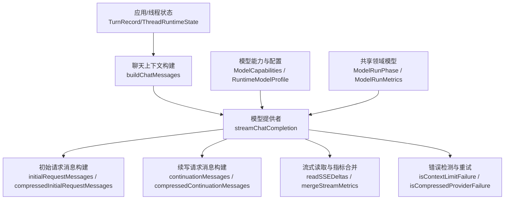
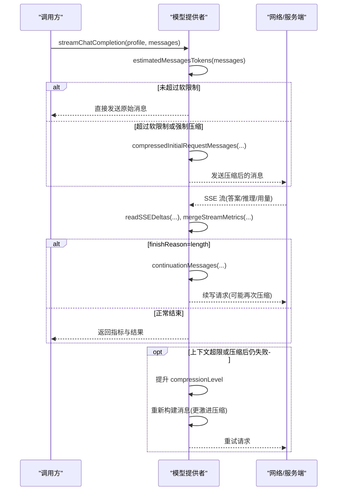
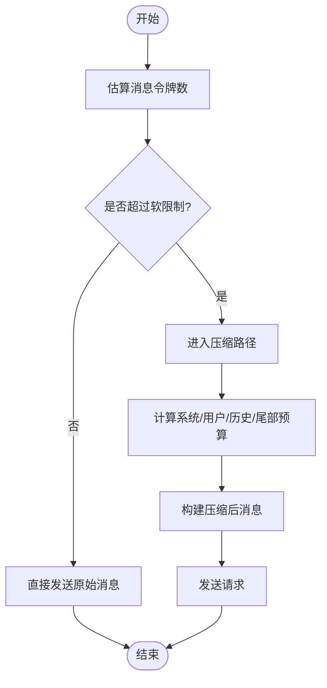
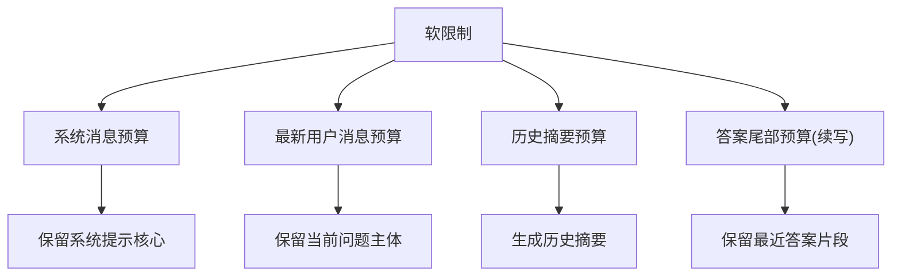
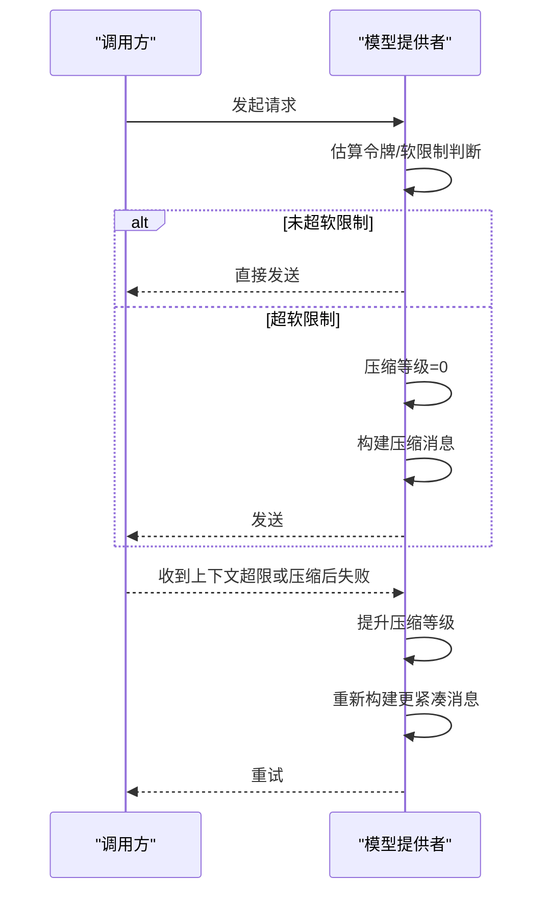
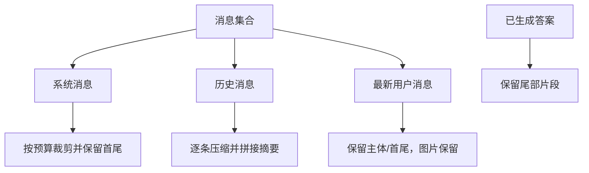
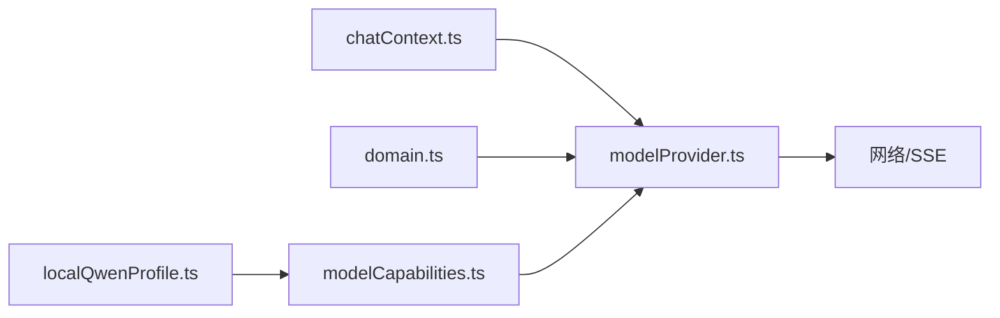

# 上下文压缩

<cite>
**本文引用的文件**
- [modelProvider.ts](file://src/agent/modelProvider.ts)
- [chatContext.ts](file://src/agent/chatContext.ts)
- [domain.ts](file://src/shared/domain.ts)
- [modelCapabilities.ts](file://src/agent/modelCapabilities.ts)
- [localQwenProfile.ts](file://src/agent/localQwenProfile.ts)
- [modelProvider.test.ts](file://tests/modelProvider.test.ts)
</cite>

## 目录
1. [简介](#简介)
2. [项目结构](#项目结构)
3. [核心组件](#核心组件)
4. [架构总览](#架构总览)
5. [详细组件分析](#详细组件分析)
6. [依赖关系分析](#依赖关系分析)
7. [性能考量](#性能考量)
8. [故障排查指南](#故障排查指南)
9. [结论](#结论)
10. [附录](#附录)

## 简介
本文件面向 Private AI Desktop 的“上下文压缩系统”，系统性说明上下文窗口管理机制、令牌估算算法、压缩阈值与预算分配策略，以及从软限制到硬限制的渐进式多级压缩流程。文档还覆盖不同类型消息（系统消息、历史消息摘要、用户消息）的压缩方法、压缩质量评估思路、配置调优建议，以及监控与基准测试要点，帮助读者在不深入源码的情况下理解并优化该子系统。

## 项目结构
上下文压缩能力集中在模型调用层，围绕一次对话轮次（turn）的请求构建、流式响应处理与错误恢复展开：
- 消息构建与压缩入口：在模型提供者中完成初始请求与续写请求的消息组装与压缩。
- 上下文窗口与预算：依据模型能力与输出上限计算可用输入窗口，并据此设定软限制与各级预算。
- 令牌估算：基于字符统计与内容类型进行近似令牌计数，用于触发压缩与预算控制。
- 错误恢复：当出现上下文超限或压缩后仍失败时，自动提升压缩等级并重试。
- 数据源与能力：通过运行时模型配置与能力声明驱动不同行为（如长上下文支持）。

**图表来源**
- [modelProvider.ts:55-197](file://src/agent/modelProvider.ts#L55-L197)
- [chatContext.ts:4-12](file://src/agent/chatContext.ts#L4-L12)
- [domain.ts:104-257](file://src/shared/domain.ts#L104-L257)

**章节来源**
- [modelProvider.ts:55-197](file://src/agent/modelProvider.ts#L55-L197)
- [chatContext.ts:4-12](file://src/agent/chatContext.ts#L4-L12)
- [domain.ts:104-257](file://src/shared/domain.ts#L104-L257)

## 核心组件
- 上下文软限制与阈值
  - 软限制由“可用输入窗口 × 压缩阈值”得出，预留输出空间与固定开销，避免触达硬上限。
  - 压缩阈值常量用于判断是否进入压缩路径。
- 令牌估算
  - 文本按 ASCII/宽字符分别估算；多模态内容中的非文本部分采用保守估计。
  - 每条消息额外计入少量开销以贴近实际。
- 预算分配
  - 将软限制拆分为系统消息、最新用户消息、历史摘要、答案尾部等预算项，确保关键信息优先保留。
- 多级压缩
  - 首次请求与续写请求各自有独立压缩逻辑；遇到上下文超限或压缩后仍失败时，逐步提高压缩等级。
- 错误恢复与阶段标记
  - 检测到上下文超限或压缩后服务失败时，自动升级压缩等级并重试；同时暴露“compressing”阶段以便上层感知。

**章节来源**
- [modelProvider.ts:209-339](file://src/agent/modelProvider.ts#L209-L339)
- [modelProvider.ts:341-429](file://src/agent/modelProvider.ts#L341-L429)
- [modelProvider.ts:469-484](file://src/agent/modelProvider.ts#L469-L484)

## 架构总览
下图展示一次对话轮次的完整流程，包括软限制判断、压缩决策、流式响应处理与错误重试。

**图表来源**
- [modelProvider.ts:55-197](file://src/agent/modelProvider.ts#L55-L197)
- [modelProvider.ts:209-339](file://src/agent/modelProvider.ts#L209-L339)
- [modelProvider.ts:563-680](file://src/agent/modelProvider.ts#L563-L680)

## 详细组件分析

### 令牌估算与上下文软限制
- 令牌估算
  - 文本估算区分 ASCII 与宽字符，按近似比例换算为令牌数。
  - 复合内容中非文本片段使用保守估计，避免低估。
  - 每条消息增加固定开销以贴近真实占用。
- 软限制计算
  - 根据模型能力（是否支持长上下文）选择上下文窗口大小。
  - 预留输出空间与固定开销，得到可用输入窗口，再乘以压缩阈值得到软限制。
- 触发条件
  - 当估算令牌数超过软限制，或显式强制压缩时，进入压缩路径。

**图表来源**
- [modelProvider.ts:334-372](file://src/agent/modelProvider.ts#L334-L372)
- [modelProvider.ts:209-239](file://src/agent/modelProvider.ts#L209-L239)

**章节来源**
- [modelProvider.ts:334-372](file://src/agent/modelProvider.ts#L334-L372)
- [modelProvider.ts:209-239](file://src/agent/modelProvider.ts#L209-L239)

### 预算分配策略
- 首次请求
  - 系统消息预算：保证提示词与角色定义不被过度裁剪。
  - 最新用户消息预算：优先保留当前问题完整性。
  - 历史摘要预算：对更早的历史进行摘要式压缩，保留关键语义。
- 续写请求
  - 新增“答案尾部预算”：保留最近生成的回答片段，便于继续生成。
  - 调整用户与历史预算比例，确保续写连贯性。

**图表来源**
- [modelProvider.ts:220-261](file://src/agent/modelProvider.ts#L220-L261)
- [modelProvider.ts:280-332](file://src/agent/modelProvider.ts#L280-L332)

**章节来源**
- [modelProvider.ts:220-261](file://src/agent/modelProvider.ts#L220-L261)
- [modelProvider.ts:280-332](file://src/agent/modelProvider.ts#L280-L332)

### 多级压缩策略（软限制 → 硬限制）
- 软限制路径
  - 估算超过软限制即压缩，尽量保持语义与连贯性。
- 硬限制路径
  - 若服务端返回上下文超限错误，或压缩后仍出现特定失败，则提升压缩等级并重建消息。
  - 压缩等级每级按指数因子收紧预算，逐级降低上下文占用。
- 阶段可见性
  - 压缩期间向调用方暴露“compressing”阶段，便于 UI 或日志追踪。

**图表来源**
- [modelProvider.ts:84-112](file://src/agent/modelProvider.ts#L84-L112)
- [modelProvider.ts:220-261](file://src/agent/modelProvider.ts#L220-L261)
- [modelProvider.ts:280-332](file://src/agent/modelProvider.ts#L280-L332)
- [modelProvider.ts:469-484](file://src/agent/modelProvider.ts#L469-L484)

**章节来源**
- [modelProvider.ts:84-112](file://src/agent/modelProvider.ts#L84-L112)
- [modelProvider.ts:469-484](file://src/agent/modelProvider.ts#L469-L484)

### 不同类型消息的压缩算法
- 系统消息压缩
  - 平均分配每条约束，保留首尾关键段落，中间插入压缩标记，确保指令与约束不丢失。
- 历史消息摘要
  - 从最近的历史向前选取片段，逐条压缩并拼接，附带数量提示，形成紧凑摘要。
- 用户消息精简
  - 最新用户消息优先保留主体，必要时仅保留首尾；多模态内容中图片保留引用，文本部分按预算裁剪。
- 答案尾部保留
  - 续写时保留最近生成的答案片段，配合续写提示，确保无缝衔接。

**图表来源**
- [modelProvider.ts:374-429](file://src/agent/modelProvider.ts#L374-L429)
- [modelProvider.ts:431-467](file://src/agent/modelProvider.ts#L431-L467)

**章节来源**
- [modelProvider.ts:374-429](file://src/agent/modelProvider.ts#L374-L429)
- [modelProvider.ts:431-467](file://src/agent/modelProvider.ts#L431-L467)

### 压缩质量评估
- 语义保留度
  - 系统消息与用户消息优先保留关键段落；历史摘要保留最近片段，减少早期信息丢失。
- 上下文完整性
  - 通过“压缩通知”与“续写提示”引导模型正确使用压缩上下文，避免重复或偏离。
- 性能影响
  - 压缩发生在客户端，减少网络传输与模型处理负载；多次重试会增加延迟，但能显著提升成功率。
- 可观测性
  - 通过“compressing”阶段与最终指标（耗时、首 token 时间、速率、用量来源）评估压缩效果。

**章节来源**
- [modelProvider.ts:84-112](file://src/agent/modelProvider.ts#L84-L112)
- [modelProvider.ts:125-185](file://src/agent/modelProvider.ts#L125-L185)

### 压缩配置调优指南
- 场景化参数建议
  - 短对话、低延迟：保持默认阈值，尽量减少压缩次数。
  - 长对话、复杂任务：允许更高压缩等级，确保历史摘要与尾部保留。
  - 多模态输入：注意图片占用的保守估计，适当提高用户消息预算。
- 效果对比维度
  - 压缩前后消息长度、重试次数、首 token 时间、总耗时、完成率。
- 调优步骤
  - 观察“compressing”阶段频率与持续时间。
  - 检查最终指标中的 tokensPerSecond、usageSource。
  - 结合业务需求调整 maxOutputTokens 与能力声明（如 longContext）。

**章节来源**
- [modelProvider.ts:334-372](file://src/agent/modelProvider.ts#L334-L372)
- [modelProvider.ts:125-185](file://src/agent/modelProvider.ts#L125-L185)
- [modelCapabilities.ts:14-24](file://src/agent/modelCapabilities.ts#L14-L24)

### 监控方法与性能基准
- 监控点
  - 阶段：connecting、compressing、reasoning、answering。
  - 指标：durationMs、timeToFirstTokenMs、tokensPerSecond、prompt/completion/total/reasoningTokens。
- 基准测试建议
  - 构造不同长度的历史与用户输入，记录压缩触发率与重试次数。
  - 对比开启/关闭长上下文能力下的表现差异。
  - 验证错误映射与边界情况（如 length 终止、超时、离线）。

**章节来源**
- [domain.ts:104-257](file://src/shared/domain.ts#L104-L257)
- [modelProvider.ts:125-185](file://src/agent/modelProvider.ts#L125-L185)
- [modelProvider.test.ts:719-800](file://tests/modelProvider.test.ts#L719-L800)

## 依赖关系分析
- 模块耦合
  - modelProvider 依赖 chatContext 构建消息，依赖 domain 的类型与阶段定义，依赖 modelCapabilities 的能力与输出上限。
  - localQwenProfile 提供默认配置，间接影响上下文窗口与输出上限。
- 外部依赖
  - 网络层通过 fetch 与 SSE 流交互；错误处理与资源释放确保稳定性。
- 循环依赖
  - 未见明显循环依赖；各模块职责清晰，单向依赖为主。

**图表来源**
- [chatContext.ts:4-12](file://src/agent/chatContext.ts#L4-L12)
- [modelProvider.ts:55-197](file://src/agent/modelProvider.ts#L55-L197)
- [domain.ts:104-257](file://src/shared/domain.ts#L104-L257)
- [modelCapabilities.ts:14-24](file://src/agent/modelCapabilities.ts#L14-L24)
- [localQwenProfile.ts:13-25](file://src/agent/localQwenProfile.ts#L13-L25)

**章节来源**
- [chatContext.ts:4-12](file://src/agent/chatContext.ts#L4-L12)
- [modelProvider.ts:55-197](file://src/agent/modelProvider.ts#L55-L197)
- [domain.ts:104-257](file://src/shared/domain.ts#L104-L257)
- [modelCapabilities.ts:14-24](file://src/agent/modelCapabilities.ts#L14-L24)
- [localQwenProfile.ts:13-25](file://src/agent/localQwenProfile.ts#L13-L25)

## 性能考量
- 估算复杂度
  - 令牌估算线性扫描消息内容，整体 O(N)，N 为消息数量与内容长度之和。
- 内存与带宽
  - 压缩减少传输体积，降低服务端压力；多模态内容的保守估计避免高估导致频繁压缩。
- 重试成本
  - 多级压缩带来额外重试，需权衡延迟与成功率；通过合理预算分配降低重试概率。
- 流式处理
  - 增量合并指标与阶段切换，避免阻塞主流程；及时释放资源防止泄漏。

[本节为通用性能讨论，无需具体文件引用]

## 故障排查指南
- 常见问题定位
  - 上下文超限：检查软限制与预算分配，确认历史摘要是否过短或过长。
  - 压缩后仍失败：查看压缩等级是否已达上限，考虑降低历史保留比例或缩短用户消息。
  - 超时或无进展：检查续写逻辑是否正确拼接尾部，确认 finishReason 与进度。
- 错误映射与提示
  - 统一错误信息，隐藏敏感内容；提供明确的用户指引（如新建会话或降低历史限制）。
- 调试建议
  - 启用阶段监听，记录 compressing 持续时间与重试次数。
  - 导出最终指标，分析 tokensPerSecond 与 usageSource 的变化趋势。

**章节来源**
- [modelProvider.ts:469-484](file://src/agent/modelProvider.ts#L469-L484)
- [modelProvider.test.ts:74-96](file://tests/modelProvider.test.ts#L74-L96)
- [modelProvider.test.ts:216-253](file://tests/modelProvider.test.ts#L216-L253)

## 结论
该上下文压缩系统通过精确的令牌估算、合理的预算分配与多级压缩策略，在保证语义完整性的前提下有效应对长对话与复杂任务。结合阶段可见性与指标监控，可在不同场景下灵活调优，平衡延迟、吞吐与质量。建议在工程实践中持续收集指标与反馈，迭代优化预算比例与压缩阈值。

[本节为总结性内容，无需具体文件引用]

## 附录
- 关键常量与类型
  - 压缩阈值、最小续写段令牌、近似字符/令牌比、默认与长上下文窗口大小。
  - 运行阶段、指标字段、能力声明等类型定义。
- 参考实现路径
  - 消息构建与压缩函数、流式读取与指标合并、错误检测与重试逻辑。

**章节来源**
- [modelProvider.ts:40-53](file://src/agent/modelProvider.ts#L40-L53)
- [domain.ts:104-257](file://src/shared/domain.ts#L104-L257)