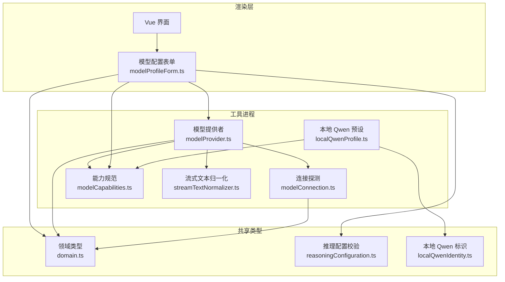
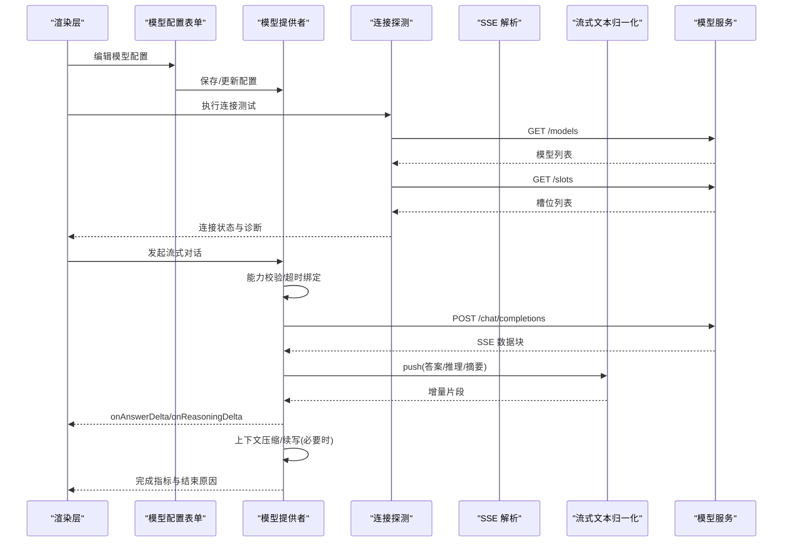
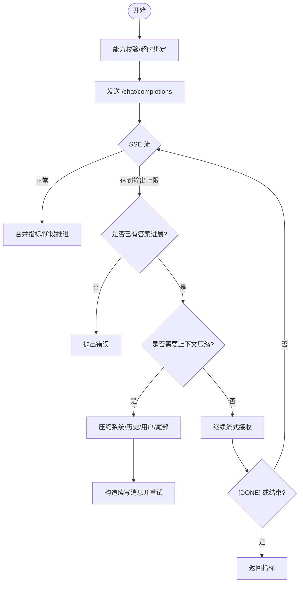
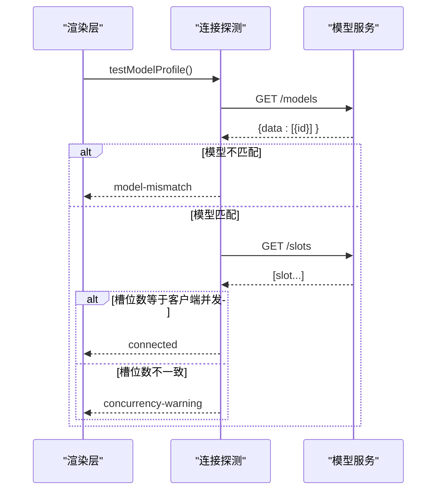
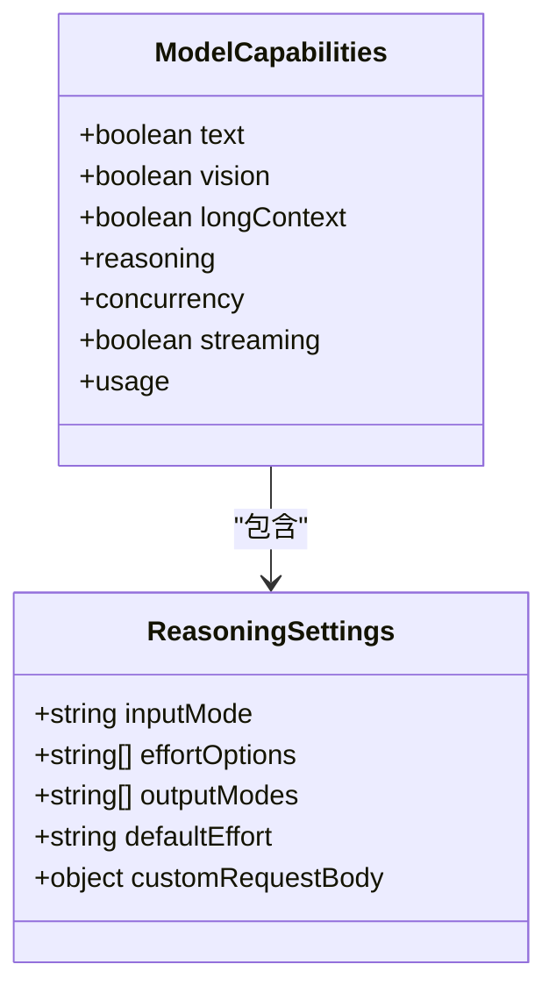
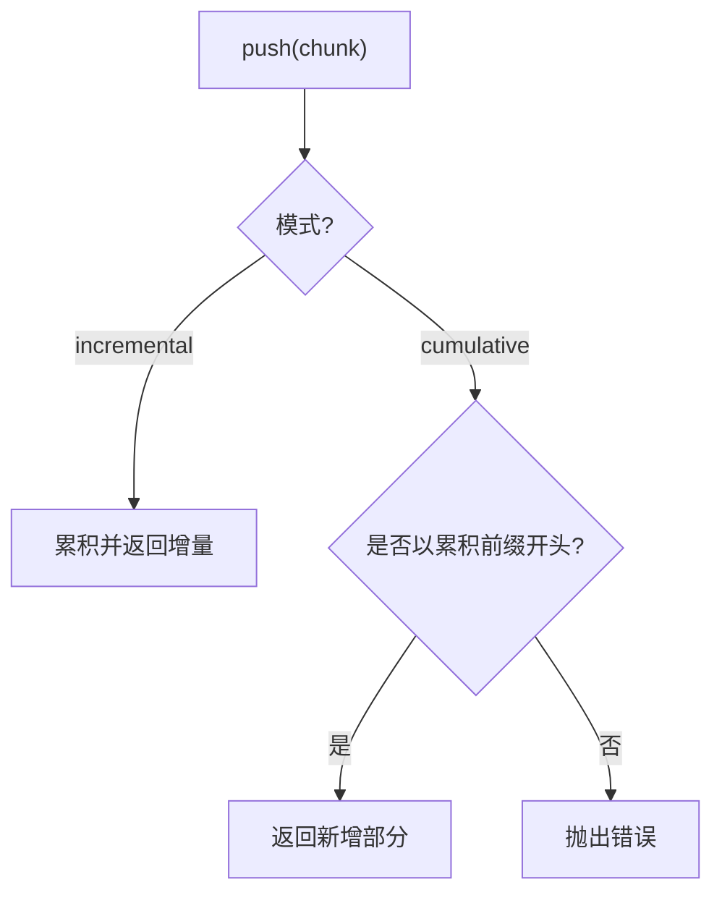
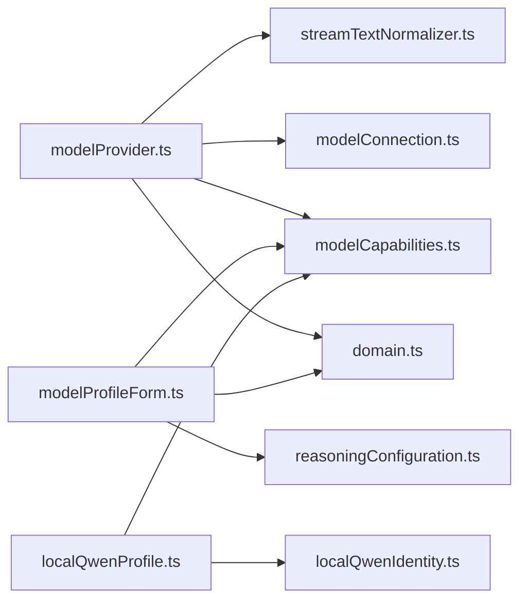

# 多模型支持

<cite>
**本文引用的文件**
- [README.md](file://README.md)
- [src/agent/modelProvider.ts](file://src/agent/modelProvider.ts)
- [src/agent/modelConnection.ts](file://src/agent/modelConnection.ts)
- [src/agent/modelCapabilities.ts](file://src/agent/modelCapabilities.ts)
- [src/shared/domain.ts](file://src/shared/domain.ts)
- [src/agent/localQwenProfile.ts](file://src/agent/localQwenProfile.ts)
- [src/shared/localQwenIdentity.ts](file://src/shared/localQwenIdentity.ts)
- [src/agent/streamTextNormalizer.ts](file://src/agent/streamTextNormalizer.ts)
- [src/renderer/modelProfileForm.ts](file://src/renderer/modelProfileForm.ts)
- [src/shared/reasoningConfiguration.ts](file://src/shared/reasoningConfiguration.ts)
</cite>

## 目录
1. [简介](#简介)
2. [项目结构](#项目结构)
3. [核心组件](#核心组件)
4. [架构总览](#架构总览)
5. [详细组件分析](#详细组件分析)
6. [依赖关系分析](#依赖关系分析)
7. [性能与优化建议](#性能与优化建议)
8. [故障排查指南](#故障排查指南)
9. [结论](#结论)
10. [附录：配置示例与扩展新提供商](#附录：配置示例与扩展新提供商)

## 简介
本文件面向 Private AI Desktop 的多模型支持能力，系统性说明如何同时支持 OpenAI 兼容 API 和本地 Qwen 模型。文档覆盖模型配置结构、连接测试机制、能力检测与动态切换、流式响应处理、上下文压缩策略、错误重试机制、API 密钥管理方式、性能优化建议，以及添加新模型提供商的实践路径。所有实现细节均基于仓库源码进行分析与归纳。

## 项目结构
本项目采用 Electron + Vue 3 + TypeScript 的架构，关键模块职责如下：
- 渲染层（Renderer）：仅负责 UI，通过预加载桥暴露最小 API。
- 主进程（Main）：生命周期与安全设置、事件转发。
- 工具进程（Utility Process）：调度、模型调用、演示代理运行时、SQLite 持久化。
- 共享领域类型（shared/domain.ts）：统一的数据结构与协议定义。
- Agent 层（agent/*）：模型能力、连接探测、流式请求、文本归一化、本地 Qwen 预设等。
- 渲染器表单（renderer/modelProfileForm.ts）：模型配置表单构建、校验与诊断信息生成。

图表来源
- [src/agent/modelProvider.ts:55-197](file://src/agent/modelProvider.ts#L55-L197)
- [src/agent/modelConnection.ts:11-91](file://src/agent/modelConnection.ts#L11-L91)
- [src/agent/modelCapabilities.ts:14-43](file://src/agent/modelCapabilities.ts#L14-L43)
- [src/agent/streamTextNormalizer.ts:1-34](file://src/agent/streamTextNormalizer.ts#L1-L34)
- [src/agent/localQwenProfile.ts:13-25](file://src/agent/localQwenProfile.ts#L13-L25)
- [src/shared/domain.ts:130-176](file://src/shared/domain.ts#L130-L176)
- [src/shared/reasoningConfiguration.ts:9-18](file://src/shared/reasoningConfiguration.ts#L9-L18)
- [src/shared/localQwenIdentity.ts:1-21](file://src/shared/localQwenIdentity.ts#L1-L21)

章节来源
- [README.md:1-121](file://README.md#L1-L121)

## 核心组件
- 模型提供者（modelProvider.ts）：封装流式聊天补全、SSE 解析、指标聚合、上下文压缩与续写、超时控制与错误脱敏。
- 连接探测（modelConnection.ts）：调用 /models 与 /slots 验证端点可达性、模型列表匹配与服务并发槽位一致性。
- 能力规范（modelCapabilities.ts）：提供 Qwen 与 OpenAI 兼容的能力声明、能力归一化、推理模式校验与默认值推导。
- 流式文本归一化（streamTextNormalizer.ts）：增量或累计模式下的流式文本去重与完整性校验。
- 本地 Qwen 预设（localQwenProfile.ts + localQwenIdentity.ts）：内置本地 Qwen 服务的基础 URL、模型名与 Profile ID，并给出能力集。
- 渲染器表单（modelProfileForm.ts）：构建 ModelProfileInput、推理配置推荐与校验、连接测试结果诊断文案。
- 领域类型（domain.ts）：统一的模型配置、连接结果、运行指标、推理模式等类型定义。

章节来源
- [src/agent/modelProvider.ts:55-197](file://src/agent/modelProvider.ts#L55-L197)
- [src/agent/modelConnection.ts:11-91](file://src/agent/modelConnection.ts#L11-L91)
- [src/agent/modelCapabilities.ts:14-43](file://src/agent/modelCapabilities.ts#L14-L43)
- [src/agent/streamTextNormalizer.ts:1-34](file://src/agent/streamTextNormalizer.ts#L1-L34)
- [src/agent/localQwenProfile.ts:13-25](file://src/agent/localQwenProfile.ts#L13-L25)
- [src/shared/localQwenIdentity.ts:1-21](file://src/shared/localQwenIdentity.ts#L1-L21)
- [src/renderer/modelProfileForm.ts:139-176](file://src/renderer/modelProfileForm.ts#L139-L176)
- [src/shared/domain.ts:130-176](file://src/shared/domain.ts#L130-L176)

## 架构总览
下图展示了从 UI 到模型服务的完整调用链，包括能力校验、连接测试、流式请求、上下文压缩与指标收集。

图表来源
- [src/agent/modelProvider.ts:55-197](file://src/agent/modelProvider.ts#L55-L197)
- [src/agent/modelConnection.ts:11-91](file://src/agent/modelConnection.ts#L11-L91)
- [src/agent/streamTextNormalizer.ts:1-34](file://src/agent/streamTextNormalizer.ts#L1-L34)

## 详细组件分析

### 模型提供者（流式请求、上下文压缩、指标）
- 流式请求：统一封装 SSE 读取、阶段推进（connecting → reasoning → answering）、首次 token 时间、finish reason 与 usage 合并。
- 上下文压缩：当接近模型上下文限制时，自动对系统消息、历史摘要、最新用户消息与助手尾部进行压缩；若服务端返回长度限制失败，会触发“续写”逻辑并逐步提升压缩级别，最多三次。
- 指标计算：优先使用服务端 tokensPerSecond，否则客户端根据 completionTokens 与耗时估算；usageSource 区分 server/client/unavailable。
- 超时与取消：为每次请求绑定可组合的 AbortSignal，支持应用级取消与超时双重控制。
- 错误脱敏：错误消息中移除 API Key，避免泄露。

图表来源
- [src/agent/modelProvider.ts:55-197](file://src/agent/modelProvider.ts#L55-L197)
- [src/agent/modelProvider.ts:209-339](file://src/agent/modelProvider.ts#L209-L339)
- [src/agent/modelProvider.ts:563-680](file://src/agent/modelProvider.ts#L563-L680)

章节来源
- [src/agent/modelProvider.ts:55-197](file://src/agent/modelProvider.ts#L55-L197)
- [src/agent/modelProvider.ts:209-339](file://src/agent/modelProvider.ts#L209-L339)
- [src/agent/modelProvider.ts:563-680](file://src/agent/modelProvider.ts#L563-L680)

### 连接测试机制（/models 与 /slots）
- 步骤：
  - 调用 /models 获取模型列表，校验配置的 model 是否在列表中。
  - 调用 /slots 获取服务槽位数量，并与客户端 maxConcurrency 对比，给出 connected/concurrency-warning/slots-unverified 三种成功态。
  - 网络不可达或非 2xx 返回 offline。
- 诊断文案：在 UI 层将不同状态翻译为用户可读的诊断信息，并在本地 Qwen 离线时附加启动命令提示。

图表来源
- [src/agent/modelConnection.ts:11-91](file://src/agent/modelConnection.ts#L11-L91)
- [src/renderer/modelProfileForm.ts:73-103](file://src/renderer/modelProfileForm.ts#L73-L103)

章节来源
- [src/agent/modelConnection.ts:11-91](file://src/agent/modelConnection.ts#L11-L91)
- [src/renderer/modelProfileForm.ts:73-103](file://src/renderer/modelProfileForm.ts#L73-L103)

### 能力检测与动态切换
- 能力声明：
  - Qwen：text/vision/longContext=false；reasoning.inputMode='toggle'；outputModes=['raw']；concurrency 可配置；streaming=true；usage.tokens/reasoningTokens=true。
  - OpenAI 兼容：text=true；vision=false；reasoning.inputMode 由 effortOptions 决定；outputModes 可能包含 'summary'；其他同 Qwen。
- 能力归一化：normalizeModelCapabilities 将输入能力规范化，兼容旧字段 streamingUsage，并依据 reasoningProtocol 推断默认推理能力。
- 动态切换：UI 根据当前 protocol 与 inputMode 推荐推理控制项（qwen→toggle，openai→effort），并校验 effort 选项与默认值。

图表来源
- [src/shared/domain.ts:130-148](file://src/shared/domain.ts#L130-L148)
- [src/agent/modelCapabilities.ts:14-43](file://src/agent/modelCapabilities.ts#L14-L43)

章节来源
- [src/agent/modelCapabilities.ts:14-43](file://src/agent/modelCapabilities.ts#L14-L43)
- [src/shared/domain.ts:130-148](file://src/shared/domain.ts#L130-L148)
- [src/renderer/modelProfileForm.ts:182-214](file://src/renderer/modelProfileForm.ts#L182-L214)

### 流式响应处理与文本归一化
- 增量模式：累积已推送文本，返回新增片段，适合实时显示。
- 累计模式：要求后续 chunk 必须以前一次快照为前缀，否则抛错，保证一致性。
- 阶段推进：首次收到推理内容进入 reasoning 阶段，首次收到答案进入 answering 阶段。
- 重复事件去重：相同 id 且相同 data 的事件会被跳过，防止重放。

图表来源
- [src/agent/streamTextNormalizer.ts:1-34](file://src/agent/streamTextNormalizer.ts#L1-L34)
- [src/agent/modelProvider.ts:563-680](file://src/agent/modelProvider.ts#L563-L680)

章节来源
- [src/agent/streamTextNormalizer.ts:1-34](file://src/agent/streamTextNormalizer.ts#L1-L34)
- [src/agent/modelProvider.ts:563-680](file://src/agent/modelProvider.ts#L563-L680)

### 上下文压缩策略
- 触发条件：估计消息 token 数超过软阈值（考虑 longContext 能力与预留输出空间）。
- 压缩对象：
  - 系统消息：按预算截断中间内容。
  - 历史消息：生成摘要片段，保留最近若干条。
  - 最新用户消息：保留标题与关键内容，图片附件保留。
  - 助手尾部：保留最后一段回答用于续写。
- 压缩级别：逐次提升压缩因子，最多三次；若仍失败则抛出明确错误。
- 续写逻辑：当 finishReason=length 且已有答案进展时，构造续写消息并继续请求。

章节来源
- [src/agent/modelProvider.ts:209-339](file://src/agent/modelProvider.ts#L209-L339)
- [src/agent/modelProvider.ts:469-484](file://src/agent/modelProvider.ts#L469-L484)

### 错误重试机制
- 使用次数兼容性重试：首次请求带 usage 参数失败且状态码命中兼容错误时，自动重试不带 usage 的请求。
- 上下文超限重试：检测到上下文超限或服务端 500 且已压缩上下文时，触发压缩与续写流程。
- 超时与取消：请求级超时与应用级取消统一通过 AbortSignal 控制，超时错误明确携带超时时长。

章节来源
- [src/agent/modelProvider.ts:762-795](file://src/agent/modelProvider.ts#L762-L795)
- [src/agent/modelProvider.ts:95-118](file://src/agent/modelProvider.ts#L95-L118)
- [src/agent/modelProvider.ts:188-196](file://src/agent/modelProvider.ts#L188-L196)

### API 密钥管理与安全
- 存储位置：API Key 保存在工具进程的 SQLite 模型配置记录中，渲染层快照中会被脱敏。
- 传输头：请求时注入 Authorization: Bearer <apiKey>。
- 错误脱敏：错误消息中移除 API Key，避免日志或 UI 泄露。

章节来源
- [README.md:12-14](file://README.md#L12-L14)
- [src/agent/modelProvider.ts:67-73](file://src/agent/modelProvider.ts#L67-L73)
- [src/agent/modelProvider.ts:188-196](file://src/agent/modelProvider.ts#L188-L196)

### 本地 Qwen 集成
- 内置标识：BASE_URL、MODEL、PROFILE_ID 集中定义，便于识别内置本地 Qwen 配置。
- 预设 Profile：提供 name、provider、baseUrl、model、capabilities、reasoning、maxConcurrency、maxOutputTokens 等默认值。
- 能力：Qwen 推理模式为 toggle，输出 raw；不支持 longContext；支持 streaming 与 usage。

章节来源
- [src/shared/localQwenIdentity.ts:1-21](file://src/shared/localQwenIdentity.ts#L1-L21)
- [src/agent/localQwenProfile.ts:13-25](file://src/agent/localQwenProfile.ts#L13-L25)
- [src/agent/modelCapabilities.ts:14-24](file://src/agent/modelCapabilities.ts#L14-L24)

## 依赖关系分析
- modelProvider.ts 依赖：
  - domain.ts：类型定义（ModelRunMetrics、ModelRunPhase 等）。
  - modelCapabilities.ts：能力校验与默认值。
  - modelConnection.ts：连接测试。
  - streamTextNormalizer.ts：流式文本归一化。
- renderer/modelProfileForm.ts 依赖：
  - domain.ts：表单值与连接结果类型。
  - reasoningConfiguration.ts：推理配置校验。
  - modelCapabilities.ts：能力默认值与推荐。
- localQwenProfile.ts 依赖：
  - localQwenIdentity.ts：本地 Qwen 标识常量。
  - modelCapabilities.ts：Qwen 能力集。

图表来源
- [src/agent/modelProvider.ts:1-7](file://src/agent/modelProvider.ts#L1-L7)
- [src/renderer/modelProfileForm.ts:1-16](file://src/renderer/modelProfileForm.ts#L1-L16)
- [src/agent/localQwenProfile.ts:1-8](file://src/agent/localQwenProfile.ts#L1-L8)

章节来源
- [src/agent/modelProvider.ts:1-7](file://src/agent/modelProvider.ts#L1-L7)
- [src/renderer/modelProfileForm.ts:1-16](file://src/renderer/modelProfileForm.ts#L1-L16)
- [src/agent/localQwenProfile.ts:1-8](file://src/agent/localQwenProfile.ts#L1-L8)

## 性能与优化建议
- 并发与槽位对齐：确保客户端 maxConcurrency 与服务端 /slots 一致，避免拥塞与排队延迟。
- 输出令牌与上下文窗口：合理设置 maxOutputTokens，结合 longContext 能力调整上下文预算，减少压缩频率。
- 流式体验：保持增量模式以获得更低首字延迟；累计模式仅在需要强一致性时使用。
- 指标来源：优先信任服务端 tokensPerSecond；若无，客户端估算需关注 completionTokens 可用性。
- 超时策略：根据推理模式与最大输出令牌动态计算请求超时，避免长时间阻塞。

[本节为通用指导，不直接分析具体文件]

## 故障排查指南
- 连接失败：检查 /models 与 /slots 可达性与返回格式；确认模型名称在服务端列表中存在。
- 并发警告：比较客户端 maxConcurrency 与服务端 slots，调整至一致。
- 模型不匹配：修正配置的 model 字段与服务端 advertised 模型一致。
- 流式异常：检查 SSE 事件 id 是否冲突；确认累计模式下 chunk 前缀一致性。
- 上下文超限：观察压缩级别与续写次数；必要时降低输入长度或提高服务端上下文容量。
- 错误脱敏：确认错误消息不包含 API Key；如出现，检查 safeErrorText 调用路径。

章节来源
- [src/agent/modelConnection.ts:11-91](file://src/agent/modelConnection.ts#L11-L91)
- [src/agent/modelProvider.ts:563-680](file://src/agent/modelProvider.ts#L563-L680)
- [src/agent/modelProvider.ts:188-196](file://src/agent/modelProvider.ts#L188-L196)

## 结论
Private AI Desktop 通过统一的能力声明、严格的连接探测、健壮的流式处理与上下文压缩策略，实现了对 OpenAI 兼容 API 与本地 Qwen 的稳定支持。其设计强调安全性（API Key 脱敏）、可观测性（指标与阶段推进）与可扩展性（能力归一化与表单推荐），为后续接入更多模型提供商提供了清晰路径。

[本节为总结，不直接分析具体文件]

## 附录：配置示例与扩展新提供商

### 模型配置文件结构（基于领域类型）
- 必填字段：name、provider、baseUrl、model。
- 可选字段：apiKey、capabilities、reasoning、maxConcurrency、maxOutputTokens、isDefault。
- 能力字段：text、vision、longContext、reasoning（inputMode、effortOptions、outputModes、defaultEffort、customRequestBody）、concurrency（defaultLimit、configurable、maxLimit）、streaming、usage（tokens、reasoningTokens）。

章节来源
- [src/shared/domain.ts:160-176](file://src/shared/domain.ts#L160-L176)
- [src/shared/domain.ts:130-148](file://src/shared/domain.ts#L130-L148)

### API 密钥管理方式
- 存储在工具进程 SQLite 中，渲染层快照脱敏。
- 请求头注入 Authorization: Bearer。
- 错误消息中移除 API Key。

章节来源
- [README.md:12-14](file://README.md#L12-L14)
- [src/agent/modelProvider.ts:67-73](file://src/agent/modelProvider.ts#L67-L73)
- [src/agent/modelProvider.ts:188-196](file://src/agent/modelProvider.ts#L188-L196)

### 性能优化建议
- 对齐客户端并发与服务端槽位。
- 合理设置 maxOutputTokens 与上下文预算。
- 使用增量流式模式降低首字延迟。
- 利用服务端 tokensPerSecond 作为速度指标。

[本节为通用指导，不直接分析具体文件]

### 实际代码示例：添加新的模型提供商支持
步骤概览：
1. 定义能力集：在 modelCapabilities.ts 中添加新提供商的能力函数（参考 qwenCapabilities/openAiCapabilities）。
2. 归一化能力：在 normalizeModelCapabilities 中处理新提供商的输入能力，兼容旧字段与默认值。
3. 推理配置推荐：在 modelProfileForm.ts 中为新提供商的 protocol 提供推荐的 inputMode 与 effort 选项。
4. 连接探测适配：如需额外探测接口，在 modelConnection.ts 中扩展 /slots 或其他健康检查。
5. 预设 Profile（可选）：如需内置预设，参考 localQwenProfile.ts 创建对应工厂函数。
6. 表单构建：在 buildModelProfileInput 中确保新字段被正确写入 ModelProfileInput。

章节来源
- [src/agent/modelCapabilities.ts:14-43](file://src/agent/modelCapabilities.ts#L14-L43)
- [src/agent/modelCapabilities.ts:45-91](file://src/agent/modelCapabilities.ts#L45-L91)
- [src/renderer/modelProfileForm.ts:182-214](file://src/renderer/modelProfileForm.ts#L182-L214)
- [src/agent/modelConnection.ts:11-91](file://src/agent/modelConnection.ts#L11-L91)
- [src/agent/localQwenProfile.ts:13-25](file://src/agent/localQwenProfile.ts#L13-L25)
- [src/renderer/modelProfileForm.ts:139-176](file://src/renderer/modelProfileForm.ts#L139-L176)