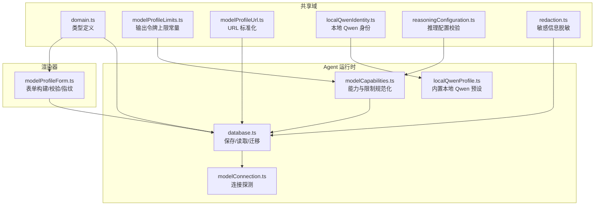
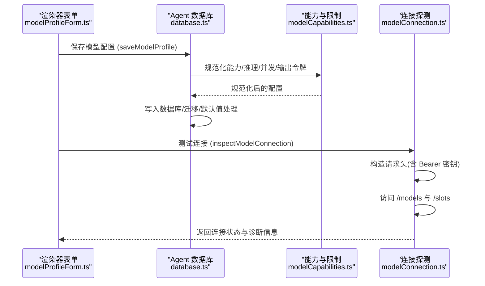
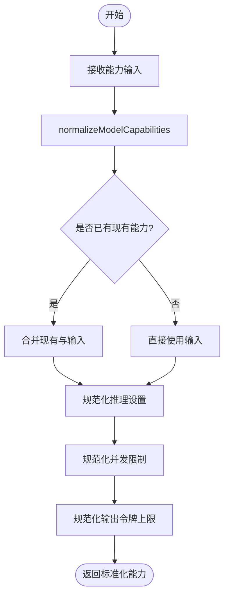
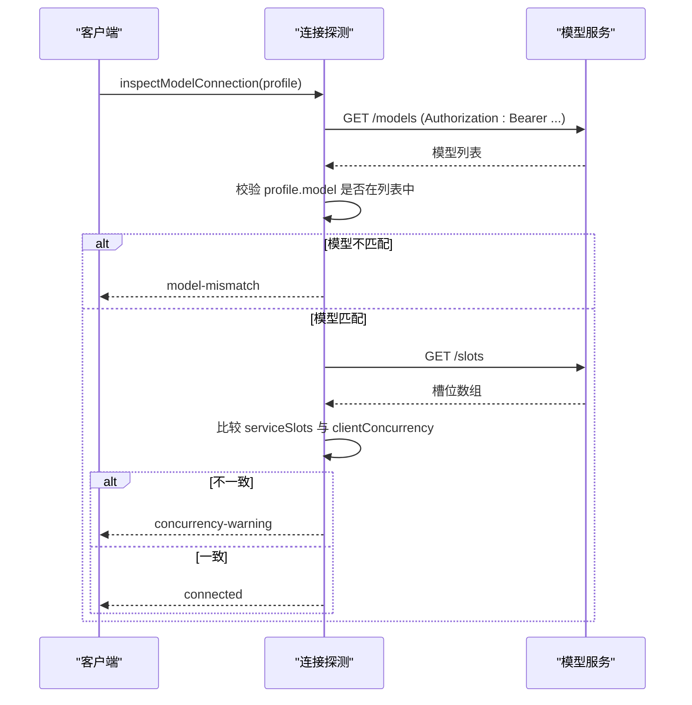
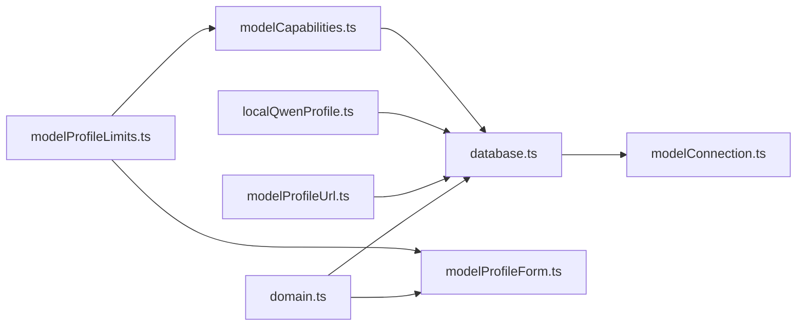

# 模型配置管理

<cite>
**本文引用的文件**
- [src/agent/database.ts](file://src/agent/database.ts)
- [src/shared/domain.ts](file://src/shared/domain.ts)
- [src/agent/modelCapabilities.ts](file://src/agent/modelCapabilities.ts)
- [src/shared/modelProfileLimits.ts](file://src/shared/modelProfileLimits.ts)
- [src/shared/modelProfileUrl.ts](file://src/shared/modelProfileUrl.ts)
- [src/renderer/modelProfileForm.ts](file://src/renderer/modelProfileForm.ts)
- [src/agent/localQwenProfile.ts](file://src/agent/localQwenProfile.ts)
- [src/shared/localQwenIdentity.ts](file://src/shared/localQwenIdentity.ts)
- [src/agent/modelConnection.ts](file://src/agent/modelConnection.ts)
- [src/shared/reasoningConfiguration.ts](file://src/shared/reasoningConfiguration.ts)
- [src/shared/redaction.ts](file://src/shared/redaction.ts)
</cite>

## 目录
1. [简介](#简介)
2. [项目结构](#项目结构)
3. [核心组件](#核心组件)
4. [架构总览](#架构总览)
5. [详细组件分析](#详细组件分析)
6. [依赖关系分析](#依赖关系分析)
7. [性能与限制](#性能与限制)
8. [故障排查指南](#故障排查指南)
9. [结论](#结论)
10. [附录：配置示例与最佳实践](#附录配置示例与最佳实践)

## 简介
本文件面向 Private AI Desktop 的“模型配置管理系统”，围绕 RuntimeModelProfile 数据结构展开，系统说明其设计原理、不同模型提供商的配置差异（OpenAI 兼容 API 与本地 Qwen）、能力声明与限制、配置验证机制、默认值处理、迁移策略、敏感信息保护、以及错误处理与调试建议。目标是帮助开发者与使用者正确理解并安全高效地管理模型配置。

## 项目结构
本项目将模型配置相关逻辑分布在多个模块中：
- 数据模型与类型定义集中在 shared 域层，确保前后端一致。
- 运行时配置构建、规范化与持久化在 agent 层完成。
- 前端表单与校验在 renderer 层实现，提供用户交互与诊断提示。
- 连接探测与鉴权头构造在 agent 的连接模块中实现。
- URL 标准化与本地 Qwen 身份识别在共享工具中提供。

图表来源
- [src/shared/domain.ts:130-192](file://src/shared/domain.ts#L130-L192)
- [src/agent/database.ts:541-621](file://src/agent/database.ts#L541-L621)
- [src/agent/modelCapabilities.ts:14-43](file://src/agent/modelCapabilities.ts#L14-L43)
- [src/shared/modelProfileLimits.ts:1-3](file://src/shared/modelProfileLimits.ts#L1-L3)
- [src/shared/modelProfileUrl.ts:1-24](file://src/shared/modelProfileUrl.ts#L1-L24)
- [src/agent/localQwenProfile.ts:1-31](file://src/agent/localQwenProfile.ts#L1-L31)
- [src/shared/localQwenIdentity.ts:1-20](file://src/shared/localQwenIdentity.ts#L1-L20)
- [src/agent/modelConnection.ts:11-91](file://src/agent/modelConnection.ts#L11-L91)
- [src/shared/reasoningConfiguration.ts:1-19](file://src/shared/reasoningConfiguration.ts#L1-L19)
- [src/shared/redaction.ts:1-33](file://src/shared/redaction.ts#L1-L33)

章节来源
- [src/shared/domain.ts:130-192](file://src/shared/domain.ts#L130-L192)
- [src/agent/database.ts:541-621](file://src/agent/database.ts#L541-L621)

## 核心组件
- RuntimeModelProfile：运行时可用的模型配置对象，包含基础信息、API 密钥、能力声明、推理设置、并发与输出令牌限制等。
- ModelCapabilities：描述模型能力（文本、视觉、长上下文、推理输入模式、并发、流式、用量）及限制。
- 配置规范化与验证：对输入进行清洗、合并、约束与校验，保证一致性。
- 连接探测：通过 /models 与 /slots 接口验证连通性、模型匹配与服务并发槽位。
- URL 标准化：统一 baseUrl 格式，适配特定服务商兼容路径。
- 本地 Qwen 预设：提供内置本地服务标识与默认配置。
- 敏感信息保护：日志与错误消息中的密钥脱敏。

章节来源
- [src/agent/database.ts:68-68](file://src/agent/database.ts#L68-L68)
- [src/shared/domain.ts:130-192](file://src/shared/domain.ts#L130-L192)
- [src/agent/modelCapabilities.ts:45-118](file://src/agent/modelCapabilities.ts#L45-L118)
- [src/agent/modelConnection.ts:11-91](file://src/agent/modelConnection.ts#L11-L91)
- [src/shared/modelProfileUrl.ts:1-24](file://src/shared/modelProfileUrl.ts#L1-L24)
- [src/agent/localQwenProfile.ts:13-31](file://src/agent/localQwenProfile.ts#L13-L31)
- [src/shared/redaction.ts:1-33](file://src/shared/redaction.ts#L1-L33)

## 架构总览
下图展示了从用户表单到数据库持久化、再到连接探测的关键流程。

图表来源
- [src/renderer/modelProfileForm.ts:139-176](file://src/renderer/modelProfileForm.ts#L139-L176)
- [src/agent/database.ts:541-621](file://src/agent/database.ts#L541-L621)
- [src/agent/modelCapabilities.ts:45-118](file://src/agent/modelCapabilities.ts#L45-L118)
- [src/agent/modelConnection.ts:11-91](file://src/agent/modelConnection.ts#L11-L91)

## 详细组件分析

### RuntimeModelProfile 数据结构与设计
- 基本字段：id、name、provider、baseUrl、model、apiKeyConfigured、capabilities、reasoning、maxConcurrency、maxOutputTokens、isDefault、时间戳。
- 运行时扩展：RuntimeModelProfile 在 ModelProfile 基础上增加 apiKey，用于实际调用时注入 Authorization 头。
- 设计要点：
  - 能力与推理设置集中声明，便于跨提供商统一处理。
  - 并发与输出令牌限制可配置且受上限约束，避免资源滥用。
  - 默认值与迁移策略保证旧配置平滑升级。

章节来源
- [src/shared/domain.ts:160-192](file://src/shared/domain.ts#L160-L192)
- [src/agent/database.ts:68-68](file://src/agent/database.ts#L68-L68)

### 能力声明与限制（ModelCapabilities）
- OpenAI 兼容能力：文本支持、推理以 effort 模式为主、并发可配置、流式与用量统计。
- 本地 Qwen 能力：文本与视觉支持、推理 toggle 模式、并发默认 1、最大 32、流式与用量统计。
- 规范化函数：
  - normalizeModelCapabilities：将任意输入归一化为标准能力结构。
  - normalizeProfileCapabilities：合并新旧能力，保留未覆盖字段。
  - normalizeReasoningSettings：推理模式、协议、努力级别、显示模式规范化。
  - normalizeMaxConcurrency：限制并发范围。
  - normalizeMaxOutputTokens：限制输出令牌上限。

图表来源
- [src/agent/modelCapabilities.ts:45-118](file://src/agent/modelCapabilities.ts#L45-L118)

章节来源
- [src/agent/modelCapabilities.ts:14-43](file://src/agent/modelCapabilities.ts#L14-L43)
- [src/agent/modelCapabilities.ts:45-118](file://src/agent/modelCapabilities.ts#L45-L118)
- [src/shared/modelProfileLimits.ts:1-3](file://src/shared/modelProfileLimits.ts#L1-L3)

### 不同模型提供商的配置差异
- OpenAI 兼容 API：
  - 推理输入模式为 effort，需提供 effortOptions 与 defaultEffort。
  - 输出模式通常为 summary。
  - 并发可配置，默认 1，最大 32。
- 本地 Qwen：
  - 推理输入模式为 toggle，无需 effort。
  - 输出模式支持 raw。
  - 并发默认 1，最大 32。
  - 使用专用 baseUrl 与 model 标识，便于内置识别。

章节来源
- [src/agent/modelCapabilities.ts:14-43](file://src/agent/modelCapabilities.ts#L14-L43)
- [src/agent/localQwenProfile.ts:13-31](file://src/agent/localQwenProfile.ts#L13-L31)
- [src/shared/localQwenIdentity.ts:1-20](file://src/shared/localQwenIdentity.ts#L1-L20)

### 配置验证机制
- 推理配置校验：
  - reasoningConfigurationIssue：检查 unsupported 模式下不能启用推理。
  - validateReasoningSelection：根据 capabilities 与 protocol 校验 mode、effort 合法性。
- 表单侧校验：
  - maxOutputTokensIsValid：确保为正整数且不超上限。
  - customRequestBodyValidationIssue：自定义请求体必须为合法 JSON 对象。
  - effortValidationIssue：effort 选项、默认值与当前值一致性校验。
- 连接诊断：
  - modelConnectionDiagnostic：根据连接结果生成用户可读的诊断信息。

章节来源
- [src/shared/reasoningConfiguration.ts:1-19](file://src/shared/reasoningConfiguration.ts#L1-L19)
- [src/agent/modelCapabilities.ts:120-148](file://src/agent/modelCapabilities.ts#L120-L148)
- [src/renderer/modelProfileForm.ts:61-103](file://src/renderer/modelProfileForm.ts#L61-L103)
- [src/renderer/modelProfileForm.ts:228-254](file://src/renderer/modelProfileForm.ts#L228-L254)
- [src/renderer/modelProfileForm.ts:283-296](file://src/renderer/modelProfileForm.ts#L283-L296)

### 默认值处理与配置迁移
- 默认值：
  - 并发默认来自 capabilities.concurrency.defaultLimit。
  - 输出令牌默认 DEFAULT_MAX_OUTPUT_TOKENS，上限 MAX_OUTPUT_TOKENS。
  - 推理模式默认 disabled，协议 none，显示 auto。
- 迁移策略：
  - saveModelProfile 中合并 existing 与 input，保留未变更字段。
  - 若没有默认配置，自动将首个保存的配置设为默认并更新 activeModelProfileId。
  - 数据库 schema_migrations 表记录版本，确保向后兼容。

章节来源
- [src/agent/database.ts:541-621](file://src/agent/database.ts#L541-L621)
- [src/agent/modelCapabilities.ts:106-118](file://src/agent/modelCapabilities.ts#L106-L118)
- [src/shared/modelProfileLimits.ts:1-3](file://src/shared/modelProfileLimits.ts#L1-L3)

### 环境变量注入、敏感信息加密存储与热重载
- 环境变量注入：
  - 代码库未发现直接的环境变量注入逻辑；建议在外部进程或 Electron 主进程中加载 .env 后传入配置。
- 敏感信息加密存储：
  - 代码库未实现加密存储；apiKey 明文保存在 SQLite。建议上层集成密钥管理服务或操作系统凭据存储。
- 配置热重载：
  - 代码库未实现热重载；可通过监听配置文件变化并在运行时重新加载配置。
- 敏感信息脱敏：
  - redactSensitiveText 与 safeErrorText 可在日志与错误消息中替换密钥片段，防止泄露。

章节来源
- [src/shared/redaction.ts:1-33](file://src/shared/redaction.ts#L1-L33)

### 连接探测与鉴权
- inspectModelConnection：
  - 构造 Authorization: Bearer {apiKey}。
  - 访问 /models 获取模型列表，校验配置的 model 是否存在。
  - 访问 /slots 获取服务并发槽位，比较 clientConcurrency 与服务槽位。
  - 返回 connected、concurrency-warning、slots-unverified、offline、model-mismatch 等状态。

图表来源
- [src/agent/modelConnection.ts:11-91](file://src/agent/modelConnection.ts#L11-L91)

章节来源
- [src/agent/modelConnection.ts:11-91](file://src/agent/modelConnection.ts#L11-L91)

### URL 标准化与本地 Qwen 身份
- normalizeModelBaseUrl：
  - 去除尾部斜杠，针对 aliyuncs.com 兼容路径修正为 /compatible-mode/v1。
- 本地 Qwen 身份：
  - LOCAL_QWEN_BASE_URL、LOCAL_QWEN_MODEL、LOCAL_QWEN_PROFILE_ID 固定标识。
  - isBuiltInLocalQwen/isLocalQwenServiceProfile 判断是否为内置本地 Qwen 配置。

章节来源
- [src/shared/modelProfileUrl.ts:1-24](file://src/shared/modelProfileUrl.ts#L1-L24)
- [src/shared/localQwenIdentity.ts:1-20](file://src/shared/localQwenIdentity.ts#L1-L20)

## 依赖关系分析
- domain.ts 定义了所有核心类型，被 database.ts、modelCapabilities.ts、modelProfileForm.ts 等广泛引用。
- database.ts 依赖 modelCapabilities.ts 进行能力与限制规范化，依赖 modelProfileUrl.ts 进行 URL 标准化，依赖 localQwenProfile.ts 处理本地 Qwen 预设。
- modelProfileForm.ts 依赖 domain.ts 与 modelProfileLimits.ts，负责表单构建与校验。
- modelConnection.ts 依赖 domain.ts 的类型与 database.ts 的 RuntimeModelProfile。

图表来源
- [src/shared/domain.ts:130-192](file://src/shared/domain.ts#L130-L192)
- [src/agent/database.ts:541-621](file://src/agent/database.ts#L541-L621)
- [src/renderer/modelProfileForm.ts:139-176](file://src/renderer/modelProfileForm.ts#L139-L176)
- [src/agent/modelCapabilities.ts:45-118](file://src/agent/modelCapabilities.ts#L45-L118)
- [src/agent/modelConnection.ts:11-91](file://src/agent/modelConnection.ts#L11-L91)

章节来源
- [src/shared/domain.ts:130-192](file://src/shared/domain.ts#L130-L192)
- [src/agent/database.ts:541-621](file://src/agent/database.ts#L541-L621)
- [src/renderer/modelProfileForm.ts:139-176](file://src/renderer/modelProfileForm.ts#L139-L176)
- [src/agent/modelCapabilities.ts:45-118](file://src/agent/modelCapabilities.ts#L45-L118)
- [src/agent/modelConnection.ts:11-91](file://src/agent/modelConnection.ts#L11-L91)

## 性能与限制
- 并发限制：
  - normalizeMaxConcurrency 将并发限制在 [1, maxLimit] 范围内，默认 1，最大 32。
- 输出令牌限制：
  - normalizeMaxOutputTokens 限制在 [1, MAX_OUTPUT_TOKENS]，默认 2048，上限 32768。
- 连接探测：
  - 两次 HTTP 请求（/models 与 /slots），失败或不可用会返回 offline 或 slots-unverified。
- URL 标准化：
  - 针对阿里云兼容路径做修正，减少配置错误导致的连接失败。

章节来源
- [src/agent/modelCapabilities.ts:106-118](file://src/agent/modelCapabilities.ts#L106-L118)
- [src/shared/modelProfileLimits.ts:1-3](file://src/shared/modelProfileLimits.ts#L1-L3)
- [src/agent/modelConnection.ts:11-91](file://src/agent/modelConnection.ts#L11-L91)
- [src/shared/modelProfileUrl.ts:1-24](file://src/shared/modelProfileUrl.ts#L1-L24)

## 故障排查指南
- 常见错误与诊断：
  - 推理配置错误：validateReasoningSelection 抛出错误，提示不支持的模式或缺少 effort。
  - 连接失败：inspectModelConnection 返回 offline 或 model-mismatch，检查 baseUrl、model 名称与网络可达性。
  - 并发不匹配：concurrency-warning 表示服务槽位与客户端并发不一致，调整 maxConcurrency。
- 日志与错误脱敏：
  - 使用 safeErrorText 与 redactSensitiveText 替换密钥片段，避免泄露。
- 调试技巧：
  - 使用 modelConnectionDiagnostic 生成用户友好的诊断信息。
  - 检查表单指纹（modelProfileFormFingerprint）确认配置变更是否生效。

章节来源
- [src/agent/modelCapabilities.ts:120-148](file://src/agent/modelCapabilities.ts#L120-L148)
- [src/agent/modelConnection.ts:11-91](file://src/agent/modelConnection.ts#L11-L91)
- [src/shared/redaction.ts:1-33](file://src/shared/redaction.ts#L1-L33)
- [src/renderer/modelProfileForm.ts:61-103](file://src/renderer/modelProfileForm.ts#L61-L103)
- [src/renderer/modelProfileForm.ts:267-277](file://src/renderer/modelProfileForm.ts#L267-L277)

## 结论
Private AI Desktop 的模型配置管理系统通过统一的类型定义、严格的规范化与验证、灵活的提供商适配、以及健壮的连接探测，提供了稳定可靠的模型配置能力。尽管当前未实现环境变量注入、敏感信息加密存储与配置热重载，但已具备完善的脱敏与诊断机制，便于在生产环境中逐步增强安全性与可维护性。

## 附录：配置示例与最佳实践
- 配置示例（概念性说明）：
  - OpenAI 兼容 API：
    - provider: openai-compatible
    - baseUrl: 指向兼容端点（如 DashScope 兼容路径会被标准化）
    - model: 服务端暴露的模型 ID
    - capabilities.reasoning.inputMode: effort
    - capabilities.reasoning.effortOptions: ["high","max"]
    - capabilities.reasoning.defaultEffort: "high"
    - maxConcurrency: 1~32
    - maxOutputTokens: 1~32768
  - 本地 Qwen：
    - provider: openai-compatible
    - baseUrl: http://127.0.0.1:8080/v1
    - model: Qwen3.5-9B
    - capabilities.reasoning.inputMode: toggle
    - capabilities.reasoning.outputModes: ["raw"]
    - maxConcurrency: 1
    - maxOutputTokens: 2048
- 环境变量注入：
  - 建议在应用启动前由主进程加载 .env，并将 apiKey 注入到配置对象中，避免硬编码。
- 敏感信息加密存储：
  - 建议集成操作系统凭据存储或密钥管理服务，避免明文保存 apiKey。
- 配置热重载：
  - 监听配置文件或数据库变更事件，触发重新加载配置并刷新连接状态。
- 最佳实践：
  - 始终使用 normalize 函数处理输入，避免非法配置进入运行时。
  - 使用 validateReasoningSelection 确保推理配置合法。
  - 使用 modelConnectionDiagnostic 展示清晰的用户反馈。
  - 使用 redaction 工具保护日志与错误消息中的敏感信息。

章节来源
- [src/shared/modelProfileUrl.ts:1-24](file://src/shared/modelProfileUrl.ts#L1-L24)
- [src/agent/localQwenProfile.ts:13-31](file://src/agent/localQwenProfile.ts#L13-L31)
- [src/shared/localQwenIdentity.ts:1-20](file://src/shared/localQwenIdentity.ts#L1-L20)
- [src/agent/modelCapabilities.ts:14-43](file://src/agent/modelCapabilities.ts#L14-L43)
- [src/shared/modelProfileLimits.ts:1-3](file://src/shared/modelProfileLimits.ts#L1-L3)
- [src/shared/redaction.ts:1-33](file://src/shared/redaction.ts#L1-L33)