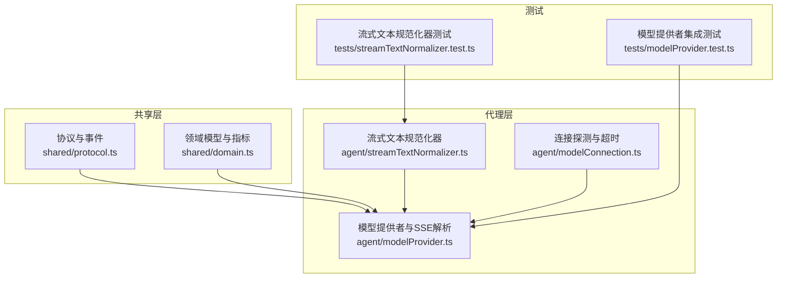
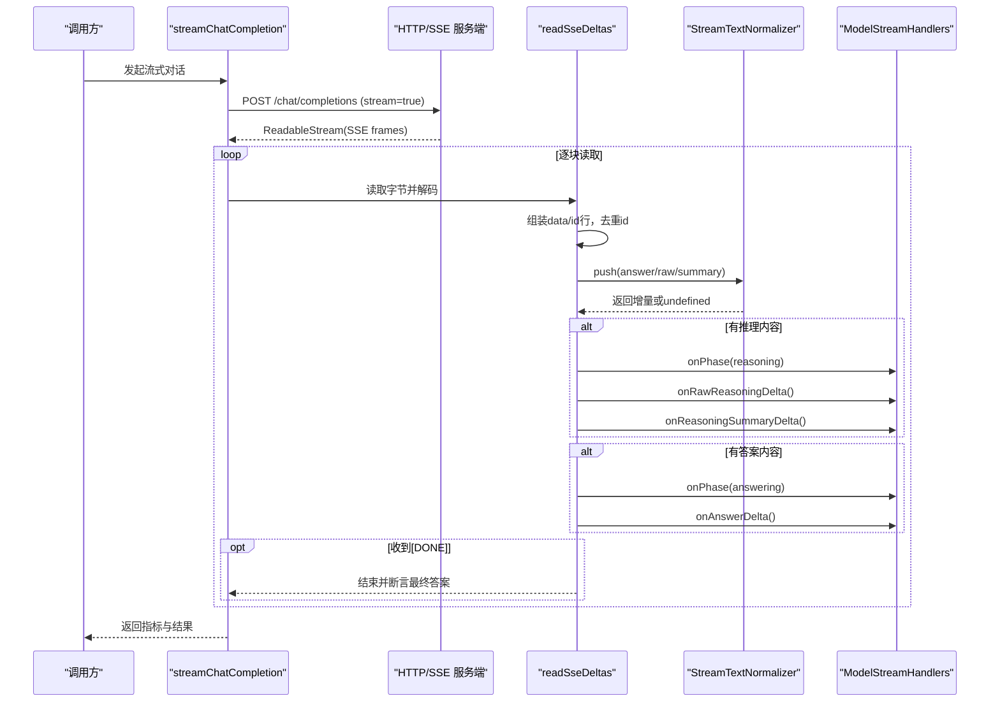
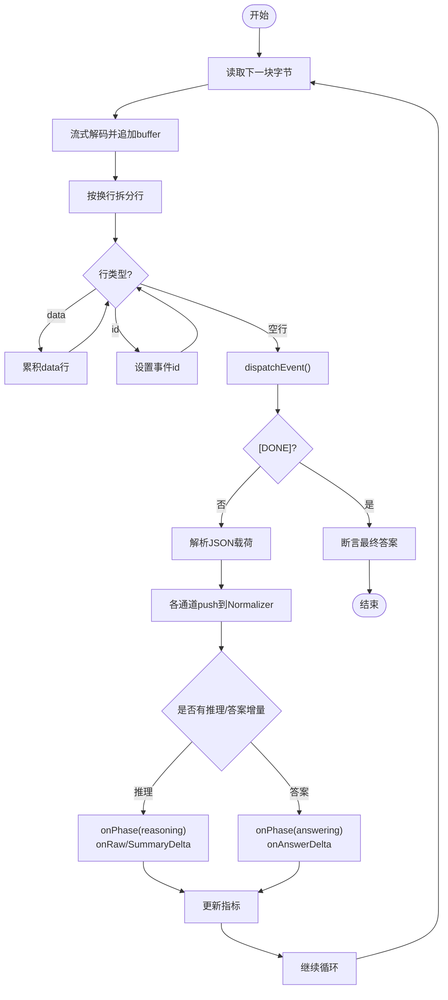
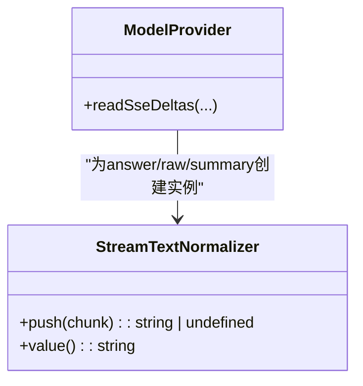
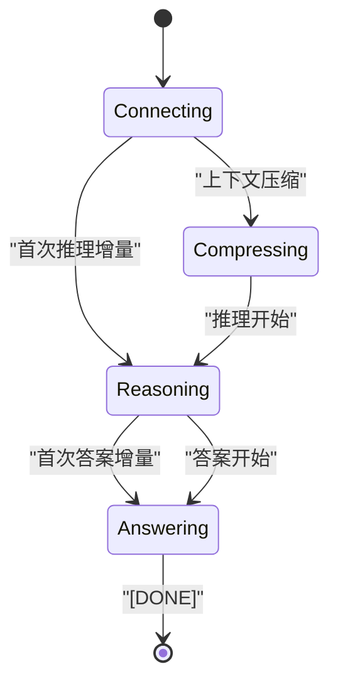
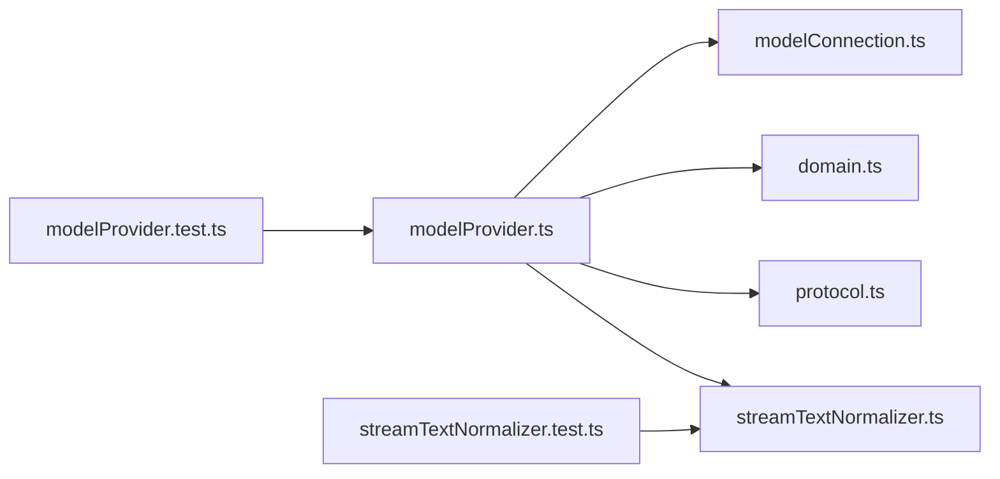

# 流式响应处理

<cite>
**本文引用的文件**
- [src/agent/streamTextNormalizer.ts](file://src/agent/streamTextNormalizer.ts)
- [src/agent/modelProvider.ts](file://src/agent/modelProvider.ts)
- [src/shared/protocol.ts](file://src/shared/protocol.ts)
- [src/shared/domain.ts](file://src/shared/domain.ts)
- [src/agent/modelConnection.ts](file://src/agent/modelConnection.ts)
- [tests/streamTextNormalizer.test.ts](file://tests/streamTextNormalizer.test.ts)
- [tests/modelProvider.test.ts](file://tests/modelProvider.test.ts)
</cite>

## 目录
1. [简介](#简介)
2. [项目结构](#项目结构)
3. [核心组件](#核心组件)
4. [架构总览](#架构总览)
5. [详细组件分析](#详细组件分析)
6. [依赖关系分析](#依赖关系分析)
7. [性能考量](#性能考量)
8. [故障排查指南](#故障排查指南)
9. [结论](#结论)
10. [附录](#附录)

## 简介
本文件面向 Private AI Desktop 的流式响应处理系统，聚焦 SSE（Server-Sent Events）协议在模型推理与回答阶段的实现细节。文档覆盖数据流解析、增量文本处理、事件分发机制、StreamTextNormalizer 的工作原理（含去重策略与内存优化）、流式状态管理（连接阶段、推理阶段、回答阶段）、错误处理（网络中断恢复、数据完整性校验、异常降级），以及最佳实践（性能优化、内存管理与用户体验改进）和调试方法。

## 项目结构
围绕流式响应的关键代码分布在以下模块：
- 流式协议与事件类型定义：shared/protocol.ts、shared/domain.ts
- 流式请求与 SSE 解析：agent/modelProvider.ts
- 文本规范化器：agent/streamTextNormalizer.ts
- 连接探测与超时控制：agent/modelConnection.ts
- 测试用例：tests/streamTextNormalizer.test.ts、tests/modelProvider.test.ts

图表来源
- [src/agent/modelProvider.ts:55-197](file://src/agent/modelProvider.ts#L55-L197)
- [src/agent/streamTextNormalizer.ts:1-34](file://src/agent/streamTextNormalizer.ts#L1-L34)
- [src/shared/protocol.ts:41-65](file://src/shared/protocol.ts#L41-L65)
- [src/shared/domain.ts:98-105](file://src/shared/domain.ts#L98-L105)
- [src/agent/modelConnection.ts:11-91](file://src/agent/modelConnection.ts#L11-L91)
- [tests/streamTextNormalizer.test.ts:1-73](file://tests/streamTextNormalizer.test.ts#L1-L73)
- [tests/modelProvider.test.ts:1-200](file://tests/modelProvider.test.ts#L1-L200)

章节来源
- [src/agent/modelProvider.ts:55-197](file://src/agent/modelProvider.ts#L55-L197)
- [src/shared/protocol.ts:41-65](file://src/shared/protocol.ts#L41-L65)
- [src/shared/domain.ts:98-105](file://src/shared/domain.ts#L98-L105)

## 核心组件
- 流式文本规范化器 StreamTextNormalizer：提供增量模式与累计模式的文本归一化，保证重复、重叠、跨字节切分等场景下的正确性与一致性。
- SSE 解析与事件分发 readSseDeltas：逐行读取 SSE 帧，解析 data/id 字段，去重事件标识，按通道（answer/raw reasoning/reasoning summary）分别推送增量，并驱动阶段转换。
- 模型提供者 streamChatCompletion：封装请求构建、上下文压缩与续写、超时与取消、指标聚合、错误映射与降级。
- 连接探测 inspectModelConnection：验证模型端点可用性、并发槽位匹配，支持超时与中止信号。

章节来源
- [src/agent/streamTextNormalizer.ts:1-34](file://src/agent/streamTextNormalizer.ts#L1-L34)
- [src/agent/modelProvider.ts:563-680](file://src/agent/modelProvider.ts#L563-L680)
- [src/agent/modelProvider.ts:55-197](file://src/agent/modelProvider.ts#L55-L197)
- [src/agent/modelConnection.ts:11-91](file://src/agent/modelConnection.ts#L11-L91)

## 架构总览
下图展示了从发起请求到 SSE 流式事件到达、解析、规范化、分发再到完成的全流程。

图表来源
- [src/agent/modelProvider.ts:55-197](file://src/agent/modelProvider.ts#L55-L197)
- [src/agent/modelProvider.ts:563-680](file://src/agent/modelProvider.ts#L563-L680)
- [src/agent/streamTextNormalizer.ts:1-34](file://src/agent/streamTextNormalizer.ts#L1-L34)

## 详细组件分析

### SSE 数据流解析与事件分发
- 数据读取与缓冲：使用 ReadableStream 读取 Uint8Array，通过 TextDecoder 流式解码，维护 buffer 并按换行拆分行。
- SSE 行解析：识别 data、id 字段；忽略注释行（以 : 开头）；将多行 data 合并为完整事件体。
- 事件去重：基于 id 字段记录已见事件数据，若同一 id 出现冲突数据则抛出错误，保障数据完整性。
- 事件分发：
  - 解析 JSON 载荷，提取 answerDelta、rawReasoningDelta、reasoningSummaryDelta、finishReason、usage/timings。
  - 对每个通道分别调用 StreamTextNormalizer.push，仅当产生有效增量时才触发后续逻辑。
  - 阶段转换：首次出现推理内容时切换到 reasoning；首次出现答案内容时切换到 answering。
  - 指标收集：合并 usage、timings，计算 tokensPerSecond、speedSource、usageSource。
- 终止条件：遇到 [DONE] 或流结束，断言最终答案有效性，返回指标。

图表来源
- [src/agent/modelProvider.ts:563-680](file://src/agent/modelProvider.ts#L563-L680)
- [src/agent/modelProvider.ts:847-898](file://src/agent/modelProvider.ts#L847-L898)

章节来源
- [src/agent/modelProvider.ts:563-680](file://src/agent/modelProvider.ts#L563-L680)
- [src/agent/modelProvider.ts:847-898](file://src/agent/modelProvider.ts#L847-L898)

### StreamTextNormalizer 工作原理
- 模式选择：
  - incremental（默认）：直接拼接 chunk，保留所有语义重复与重叠片段，适合“增量 delta”传输。
  - cumulative：要求新 chunk 必须以当前 accumulated 为前缀，仅输出新增后缀；用于“累计快照”传输。
- 去重策略：
  - incremental 模式下不主动去重，保持原始语义重复（如连续相同片段、部分重叠）。
  - cumulative 模式下通过前缀校验避免重复推送，确保只输出增量。
- 内存优化：
  - 仅维护一个 accumulated 字符串，push 时进行最小化切片与赋值。
  - 每通道独立实例，避免跨通道污染。
- 边界情况：
  - 空输入返回 undefined 且不改变状态。
  - cumulative 模式下非前缀扩展会抛出错误，提示上游数据不一致。

图表来源
- [src/agent/streamTextNormalizer.ts:1-34](file://src/agent/streamTextNormalizer.ts#L1-L34)
- [src/agent/modelProvider.ts:563-680](file://src/agent/modelProvider.ts#L563-L680)

章节来源
- [src/agent/streamTextNormalizer.ts:1-34](file://src/agent/streamTextNormalizer.ts#L1-L34)
- [tests/streamTextNormalizer.test.ts:1-73](file://tests/streamTextNormalizer.test.ts#L1-L73)

### 流式响应状态管理
- 阶段枚举：connecting、compressing、reasoning、answering。
- 转换逻辑：
  - 初始为 connecting。
  - 首次出现推理内容（raw 或 summary）时切换到 reasoning。
  - 首次出现答案内容时切换到 answering。
  - 上下文压缩期间可进入 compressing 阶段。
- 与 UI/IPC 的对接：通过 handlers.onPhase 通知上层，结合消息/工具/推理项的增量更新。

图表来源
- [src/shared/domain.ts:98-105](file://src/shared/domain.ts#L98-L105)
- [src/agent/modelProvider.ts:563-680](file://src/agent/modelProvider.ts#L563-L680)

章节来源
- [src/shared/domain.ts:98-105](file://src/shared/domain.ts#L98-L105)
- [src/agent/modelProvider.ts:563-680](file://src/agent/modelProvider.ts#L563-L680)

### 错误处理与降级策略
- 网络中断与取消：
  - 所有 I/O 操作绑定 AbortSignal，支持用户取消与超时。
  - 流读取包装 readWithAbort，监听 abort 事件及时中断。
  - finally 中安全释放 reader 锁，避免资源泄漏。
- 数据完整性校验：
  - SSE id 去重：重复 id 且数据不同则抛错，防止乱序/重复事件导致状态不一致。
  - 最终答案断言：流结束时若答案为空白且 finishReason 非 length，抛错提示无最终答案。
- 异常降级：
  - 上下文超限：自动压缩历史并续写，最多三次压缩级别递增，失败则上报明确错误。
  - 兼容性问题：当服务端不支持 usage 参数时，自动重试不带 usage 的请求。
  - 错误信息脱敏：错误消息不包含 API Key 或敏感字段，限制长度与白名单过滤。
  - 连接探测：超时返回 offline，并发槽位不匹配返回 warning。

章节来源
- [src/agent/modelProvider.ts:55-197](file://src/agent/modelProvider.ts#L55-L197)
- [src/agent/modelProvider.ts:655-718](file://src/agent/modelProvider.ts#L655-L718)
- [src/agent/modelProvider.ts:900-1033](file://src/agent/modelProvider.ts#L900-L1033)
- [src/agent/modelConnection.ts:11-91](file://src/agent/modelConnection.ts#L11-L91)

### 性能与内存优化
- 流式解码与缓冲：
  - 使用 TextDecoder 流式解码，避免整包加载。
  - 按行拆分，减少中间对象分配。
- 增量推送：
  - 仅在产生有效增量时调用 handlers，降低 UI 刷新频率。
  - 各通道独立 Normalizer，避免跨通道竞争与额外拷贝。
- 指标聚合：
  - 合并多次流的 metrics，加权平均 serverTokensPerSecond，提高统计准确性。
- 错误体读取限制：
  - 错误响应体读取上限 MAX_PROVIDER_ERROR_BYTES，防止恶意大响应占用内存。

章节来源
- [src/agent/modelProvider.ts:563-680](file://src/agent/modelProvider.ts#L563-L680)
- [src/agent/modelProvider.ts:800-898](file://src/agent/modelProvider.ts#L800-L898)
- [src/agent/modelProvider.ts:924-950](file://src/agent/modelProvider.ts#L924-L950)

## 依赖关系分析
- modelProvider 依赖：
  - protocol 中的事件类型与校验函数，确保 IPC 事件结构合法。
  - domain 中的类型定义（ModelRunPhase、MetricSource 等）。
  - streamTextNormalizer 用于各通道文本规范化。
  - modelConnection 用于连接探测与超时控制。
- 测试覆盖：
  - streamTextNormalizer.test 验证增量/累计模式、重复与重叠、Unicode 与空格保留、通道独立性。
  - modelProvider.test 覆盖 SSE 字节级切分、id 去重、错误脱敏、上下文压缩与续写、连接超时等。

图表来源
- [src/agent/modelProvider.ts:55-197](file://src/agent/modelProvider.ts#L55-L197)
- [src/agent/streamTextNormalizer.ts:1-34](file://src/agent/streamTextNormalizer.ts#L1-L34)
- [src/shared/protocol.ts:41-65](file://src/shared/protocol.ts#L41-L65)
- [src/shared/domain.ts:98-105](file://src/shared/domain.ts#L98-L105)
- [src/agent/modelConnection.ts:11-91](file://src/agent/modelConnection.ts#L11-L91)
- [tests/streamTextNormalizer.test.ts:1-73](file://tests/streamTextNormalizer.test.ts#L1-L73)
- [tests/modelProvider.test.ts:1-200](file://tests/modelProvider.test.ts#L1-L200)

章节来源
- [src/agent/modelProvider.ts:55-197](file://src/agent/modelProvider.ts#L55-L197)
- [tests/streamTextNormalizer.test.ts:1-73](file://tests/streamTextNormalizer.test.ts#L1-L73)
- [tests/modelProvider.test.ts:1-200](file://tests/modelProvider.test.ts#L1-L200)

## 性能考量
- 首字延迟优化：
  - 首次 token 时间通过 trackFirstToken 记录，结合 durationMs 计算 timeToFirstTokenMs。
- 吞吐估算：
  - 优先采用服务端提供的 predicted_per_second，否则基于 completionTokens/duration 估算。
- 上下文压缩：
  - 接近上下文阈值时自动压缩历史与最新用户消息，减少请求体积，提升稳定性。
- 资源释放：
  - 流结束后立即释放 reader 锁，避免阻塞调度器。
- 错误体限制：
  - 读取错误响应体时限制最大字节数，防止内存爆炸。

章节来源
- [src/agent/modelProvider.ts:55-197](file://src/agent/modelProvider.ts#L55-L197)
- [src/agent/modelProvider.ts:655-718](file://src/agent/modelProvider.ts#L655-L718)
- [src/agent/modelProvider.ts:924-950](file://src/agent/modelProvider.ts#L924-L950)

## 故障排查指南
- 常见问题定位：
  - SSE id 冲突：检查服务端是否重复使用 id 且数据不一致，确认事件顺序与幂等性。
  - 无最终答案：检查 finishReason 是否为 length，必要时调整 maxOutputTokens 或开启续写。
  - 连接超时：确认 baseUrl、apiKey、网络可达性；查看连接探测返回状态。
- 调试技巧：
  - 启用日志记录 phases、deltas、metrics，观察阶段转换与增量推送。
  - 使用单元测试模拟字节级切分，验证鲁棒性。
- 降级策略：
  - 上下文超限：查看压缩后的消息结构，确认历史摘要与尾部答案保留合理。
  - 兼容性问题：根据错误码/参数名判断是否需关闭 include_usage。

章节来源
- [src/agent/modelProvider.ts:563-680](file://src/agent/modelProvider.ts#L563-L680)
- [src/agent/modelProvider.ts:900-1033](file://src/agent/modelProvider.ts#L900-L1033)
- [tests/modelProvider.test.ts:1-200](file://tests/modelProvider.test.ts#L1-L200)

## 结论
该流式响应处理系统通过严格的 SSE 解析、通道独立的文本规范化、健壮的状态机与完善的错误处理，实现了高可靠、低延迟、可扩展的流式对话体验。配合上下文压缩与兼容性降级，能够在多种服务端行为下保持稳定输出。建议在生产环境中结合监控指标（首字延迟、tokens/s、错误率）持续优化，并完善端到端测试覆盖。

## 附录
- 最佳实践清单：
  - 始终使用增量模式推送答案，累计模式仅用于明确声明的传输。
  - 为每个通道创建独立的 Normalizer，避免状态交叉。
  - 对所有 I/O 绑定 AbortSignal，确保取消与超时的及时性。
  - 限制错误响应体大小，防止内存压力。
  - 在 UI 层节流渲染，避免高频更新导致的卡顿。
- 调试与性能分析方法：
  - 记录 phases 与 deltas 的时间戳，绘制首字延迟分布。
  - 对比服务端与客户端 tokens/s，定位瓶颈。
  - 使用单元测试复现极端场景（字节级切分、重复 id、长上下文）。