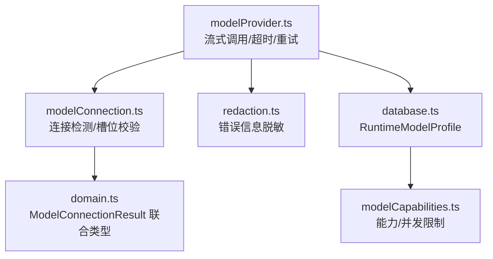
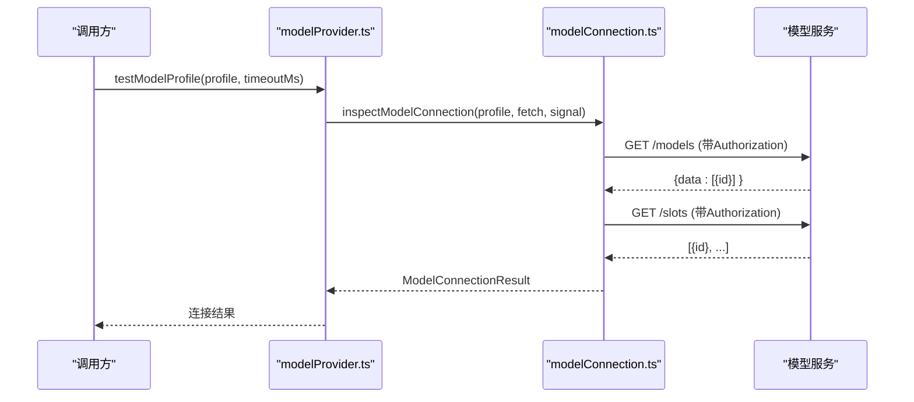
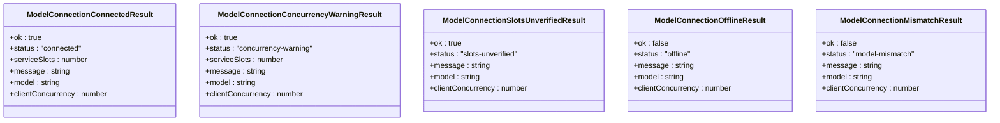
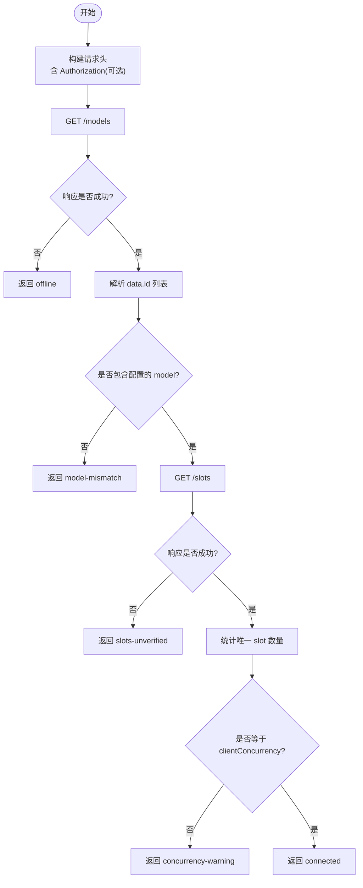
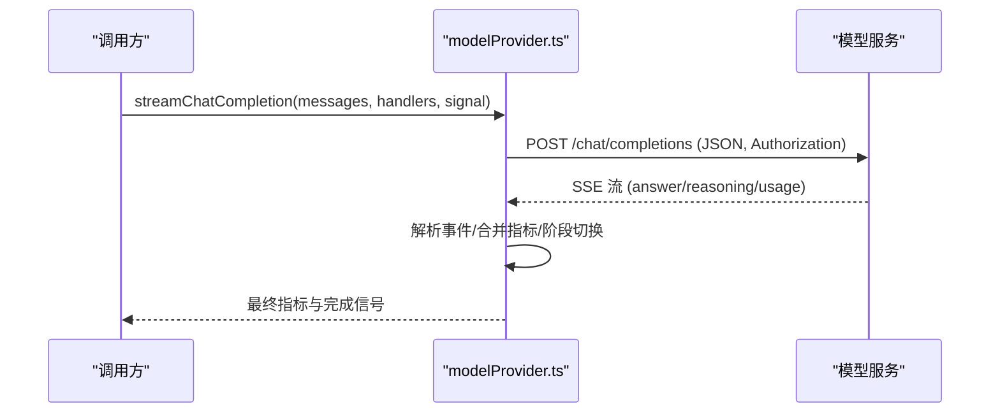
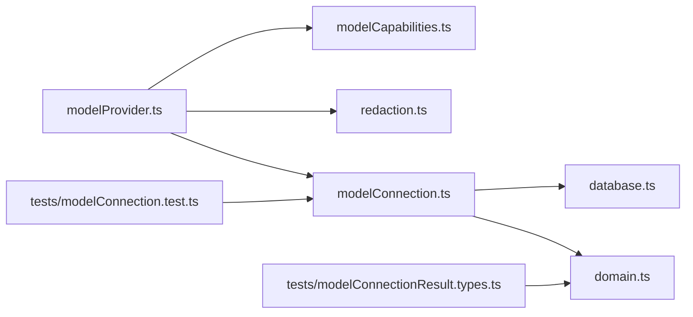

# 连接管理

<cite>
**本文引用的文件**
- [src/agent/modelConnection.ts](file://src/agent/modelConnection.ts)
- [src/agent/modelProvider.ts](file://src/agent/modelProvider.ts)
- [src/shared/domain.ts](file://src/shared/domain.ts)
- [tests/modelConnection.test.ts](file://tests/modelConnection.test.ts)
- [tests/modelConnectionResult.types.ts](file://tests/modelConnectionResult.types.ts)
- [src/shared/redaction.ts](file://src/shared/redaction.ts)
- [src/agent/database.ts](file://src/agent/database.ts)
- [src/agent/modelCapabilities.ts](file://src/agent/modelCapabilities.ts)
</cite>

## 目录
1. [简介](#简介)
2. [项目结构](#项目结构)
3. [核心组件](#核心组件)
4. [架构总览](#架构总览)
5. [详细组件分析](#详细组件分析)
6. [依赖关系分析](#依赖关系分析)
7. [性能与超时控制](#性能与超时控制)
8. [故障转移与重试策略](#故障转移与重试策略)
9. [连接诊断与排障指南](#连接诊断与排障指南)
10. [结论](#结论)

## 简介
本文面向 Private AI Desktop 的模型连接管理系统，聚焦 ModelConnectionResult 类型设计与连接状态管理机制，系统说明连接测试流程（网络连通性检查、API 密钥验证、模型能力探测、并发槽位校验）、HTTP/HTTPS 请求处理、认证头设置、错误响应解析，以及超时控制、重试策略与故障转移。同时提供连接诊断工具使用指南（日志分析、网络抓包、性能监控）和常见问题排查步骤。

## 项目结构
与连接管理直接相关的代码主要分布在以下模块：
- 连接检测与结果建模：modelConnection.ts、domain.ts
- 流式调用与超时/重试：modelProvider.ts
- 配置与能力归一化：database.ts、modelCapabilities.ts
- 安全与脱敏：redaction.ts
- 行为验证：tests/modelConnection.test.ts、tests/modelConnectionResult.types.ts

图表来源
- [src/agent/modelProvider.ts:535-561](file://src/agent/modelProvider.ts#L535-L561)
- [src/agent/modelConnection.ts:11-91](file://src/agent/modelConnection.ts#L11-L91)
- [src/shared/domain.ts:194-236](file://src/shared/domain.ts#L194-L236)
- [src/shared/redaction.ts:1-33](file://src/shared/redaction.ts#L1-L33)
- [src/agent/database.ts:68-68](file://src/agent/database.ts#L68-L68)
- [src/agent/modelCapabilities.ts:14-43](file://src/agent/modelCapabilities.ts#L14-L43)

章节来源
- [src/agent/modelConnection.ts:11-91](file://src/agent/modelConnection.ts#L11-L91)
- [src/agent/modelProvider.ts:535-561](file://src/agent/modelProvider.ts#L535-L561)
- [src/shared/domain.ts:194-236](file://src/shared/domain.ts#L194-L236)

## 核心组件
- ModelConnectionResult：描述连接测试结果的状态联合类型，包含成功与失败两类分支，覆盖“已连接”“并发告警”“槽位未验证”“离线”“模型不匹配”等语义。
- inspectModelConnection：执行连接探测的核心函数，依次访问 /models 与 /slots 端点，完成模型存在性校验与服务并发槽位核对。
- testModelProfile：对外暴露的连接测试入口，封装 AbortController 与超时控制，统一返回 ModelConnectionResult。
- streamChatCompletion/requestChatCompletion：负责实际的聊天补全请求，构建请求头、处理 SSE 流、合并指标、错误分类与重试兼容。
- redaction：对错误信息进行敏感信息脱敏，避免泄露 API Key。

章节来源
- [src/shared/domain.ts:194-236](file://src/shared/domain.ts#L194-L236)
- [src/agent/modelConnection.ts:11-91](file://src/agent/modelConnection.ts#L11-L91)
- [src/agent/modelProvider.ts:535-561](file://src/agent/modelProvider.ts#L535-L561)
- [src/agent/modelProvider.ts:762-795](file://src/agent/modelProvider.ts#L762-L795)
- [src/shared/redaction.ts:1-33](file://src/shared/redaction.ts#L1-L33)

## 架构总览
连接管理的整体流程如下：
- 上层通过 testModelProfile 发起连接测试，内部调用 inspectModelConnection。
- inspectModelConnection 按顺序：
  - 构造 Authorization 头（若配置了 apiKey）。
  - 请求 /models，校验返回数据中是否包含配置的 model。
  - 请求 /slots，校验服务侧并发槽位数是否与客户端 maxConcurrency 一致。
  - 根据结果返回 ModelConnectionResult 的不同分支。
- 实际推理调用由 streamChatCompletion 驱动，采用 SSE 流式读取，支持上下文压缩与长度续写，具备超时控制与错误分类。

图表来源
- [src/agent/modelProvider.ts:535-561](file://src/agent/modelProvider.ts#L535-L561)
- [src/agent/modelConnection.ts:11-91](file://src/agent/modelConnection.ts#L11-L91)

章节来源
- [src/agent/modelProvider.ts:535-561](file://src/agent/modelProvider.ts#L535-L561)
- [src/agent/modelConnection.ts:11-91](file://src/agent/modelConnection.ts#L11-L91)

## 详细组件分析

### ModelConnectionResult 类型设计
- 成功分支：
  - connected：服务可用且槽位数与客户端并发一致。
  - concurrency-warning：服务可用但槽位数与客户端并发不一致。
  - slots-unverified：服务可用但无法验证槽位（如 /slots 不可用或格式异常）。
- 失败分支：
  - offline：网络不可达或 /models 不可用。
  - model-mismatch：服务端声明的模型列表不包含配置的 model。
- 字段约定：
  - ok：区分成功/失败。
  - status：具体状态。
  - message：用户可读的诊断信息（不含敏感信息）。
  - model/clientConcurrency：用于展示与对比。
  - serviceSlots：仅在部分成功分支出现。

图表来源
- [src/shared/domain.ts:194-236](file://src/shared/domain.ts#L194-L236)

章节来源
- [src/shared/domain.ts:194-236](file://src/shared/domain.ts#L194-L236)
- [tests/modelConnectionResult.types.ts:1-39](file://tests/modelConnectionResult.types.ts#L1-L39)

### 连接测试流程
- 网络连通性检查：
  - 通过 fetch 访问 baseUrl/models，若响应非 2xx 或抛出异常，则返回 offline。
- API 密钥验证：
  - 若 profile 包含 apiKey，则在请求头中设置 Authorization: Bearer <apiKey>。
  - 错误消息经脱敏处理，避免泄露密钥。
- 模型能力探测：
  - 解析 /models 返回的 data 数组，提取 id 列表，判断是否包含配置的 model。
  - 若不包含，返回 model-mismatch。
- 并发槽位校验：
  - 访问 baseUrl/slots，解析为数组并统计唯一 slot id 数量。
  - 若与 profile.maxConcurrency 不一致，返回 concurrency-warning；否则返回 connected。
  - 若 /slots 不可用或格式异常，返回 slots-unverified。

图表来源
- [src/agent/modelConnection.ts:11-91](file://src/agent/modelConnection.ts#L11-L91)
- [src/agent/modelConnection.ts:93-115](file://src/agent/modelConnection.ts#L93-L115)

章节来源
- [src/agent/modelConnection.ts:11-91](file://src/agent/modelConnection.ts#L11-L91)
- [tests/modelConnection.test.ts:23-170](file://tests/modelConnection.test.ts#L23-L170)

### 流式调用与协议差异
- HTTP/HTTPS 请求：
  - 统一通过 fetchImpl 发送 POST /chat/completions，Content-Type 为 application/json。
  - Authorization 头在 profile 配置 apiKey 时注入。
- 认证头设置：
  - 使用 Bearer 令牌，来自 profile.apiKey。
- 错误响应解析：
  - 将响应体分段读取并限制最大字节数，避免大错误体导致内存压力。
  - 针对 401/403、404、429、5xx 等状态码进行友好错误分类。
  - 对特定兼容性错误（如 usage 参数不兼容）进行重试降级。
- 不同提供商差异：
  - 当前实现以 OpenAI 兼容接口为主，通过 capabilities 与 reasoning 配置适配不同提供商的能力集。
  - 通过 isStreamUsageCompatibilityError 识别并回退到不带 usage 的请求体。

图表来源
- [src/agent/modelProvider.ts:55-197](file://src/agent/modelProvider.ts#L55-L197)
- [src/agent/modelProvider.ts:762-795](file://src/agent/modelProvider.ts#L762-L795)
- [src/agent/modelProvider.ts:904-964](file://src/agent/modelProvider.ts#L904-L964)

章节来源
- [src/agent/modelProvider.ts:55-197](file://src/agent/modelProvider.ts#L55-L197)
- [src/agent/modelProvider.ts:762-795](file://src/agent/modelProvider.ts#L762-L795)
- [src/agent/modelProvider.ts:904-964](file://src/agent/modelProvider.ts#L904-L964)

### 连接池管理与并发控制
- 连接池：
  - 代码未实现显式的连接池；每次请求通过 fetchImpl 发起新连接。
- 并发控制：
  - 通过 profile.maxConcurrency 与服务端 /slots 数量进行一致性校验，确保客户端并发不超过服务槽位。
  - 能力归一化会限制 maxConcurrency 在能力声明的范围内。
- 超时控制：
  - 连接测试默认超时时间固定，可通过参数覆盖；请求级超时通过 linkedTimeoutSignal 实现。
- 重试策略：
  - 对特定兼容性错误（如 usage 参数不兼容）进行自动重试，尝试去掉 usage 字段后再次请求。
- 故障转移：
  - 当前实现未内置多端点故障转移；可在上层通过重试与错误分类实现自定义策略。

章节来源
- [src/agent/modelConnection.ts:11-91](file://src/agent/modelConnection.ts#L11-L91)
- [src/agent/modelCapabilities.ts:106-118](file://src/agent/modelCapabilities.ts#L106-L118)
- [src/agent/modelProvider.ts:720-756](file://src/agent/modelProvider.ts#L720-L756)
- [src/agent/modelProvider.ts:952-964](file://src/agent/modelProvider.ts#L952-L964)

## 依赖关系分析
- modelConnection.ts 依赖 domain.ts 的类型定义，依赖 database.ts 的 RuntimeModelProfile。
- modelProvider.ts 依赖 modelConnection.ts 进行连接测试，依赖 redaction.ts 进行错误脱敏，依赖 modelCapabilities.ts 进行能力校验。
- tests 覆盖连接检测的行为与类型断言，确保实现与契约一致。

图表来源
- [src/agent/modelConnection.ts:1-7](file://src/agent/modelConnection.ts#L1-L7)
- [src/agent/modelProvider.ts:1-6](file://src/agent/modelProvider.ts#L1-L6)
- [tests/modelConnection.test.ts:1-5](file://tests/modelConnection.test.ts#L1-L5)
- [tests/modelConnectionResult.types.ts:1-2](file://tests/modelConnectionResult.types.ts#L1-L2)

章节来源
- [src/agent/modelConnection.ts:1-7](file://src/agent/modelConnection.ts#L1-L7)
- [src/agent/modelProvider.ts:1-6](file://src/agent/modelProvider.ts#L1-L6)
- [tests/modelConnection.test.ts:1-5](file://tests/modelConnection.test.ts#L1-L5)
- [tests/modelConnectionResult.types.ts:1-2](file://tests/modelConnectionResult.types.ts#L1-L2)

## 性能与超时控制
- 连接测试超时：
  - 默认超时时间固定，通过 AbortController 与 Promise.race 实现，超时后返回连接超时结果。
- 请求级超时：
  - 基于 per-token 估算与最大输出 token 计算基础超时，结合 reasoning 模式调整每 token 超时上限。
- 流式指标：
  - 合并多次尝试的指标，计算 tokensPerSecond、timeToFirstTokenMs、usageSource 等。
- 错误体限制：
  - 错误响应体读取限制最大字节数，防止大错误体影响性能。

章节来源
- [src/agent/modelProvider.ts:40-51](file://src/agent/modelProvider.ts#L40-L51)
- [src/agent/modelProvider.ts:199-207](file://src/agent/modelProvider.ts#L199-L207)
- [src/agent/modelProvider.ts:563-680](file://src/agent/modelProvider.ts#L563-L680)
- [src/agent/modelProvider.ts:924-950](file://src/agent/modelProvider.ts#L924-L950)

## 故障转移与重试策略
- 兼容性重试：
  - 当检测到 usage 参数不兼容的错误时，自动重试一次不带 usage 的请求体。
- 错误分类：
  - 针对 401/403、404、429、5xx 等状态码给出明确错误提示，便于上层决策重试或转交其他端点。
- 上下文压缩与续写：
  - 遇到上下文超限错误时，本地压缩历史消息并重试；必要时进行答案续写。

章节来源
- [src/agent/modelProvider.ts:95-119](file://src/agent/modelProvider.ts#L95-L119)
- [src/agent/modelProvider.ts:904-964](file://src/agent/modelProvider.ts#L904-L964)

## 连接诊断与排障指南

### 连接诊断要点
- 查看连接结果状态：
  - connected：服务可用且并发匹配。
  - concurrency-warning：服务可用但并发不匹配，需调整客户端并发或服务端槽位。
  - slots-unverified：服务可用但无法验证槽位，检查 /slots 接口可用性。
  - offline：网络或 /models 不可用，检查网络与端点地址。
  - model-mismatch：服务端未声明配置的 model，检查模型名称大小写与别名。
- 检查认证头：
  - 确认 Authorization 头是否正确注入，避免密钥错误或权限不足。
- 错误信息脱敏：
  - 所有错误信息经过脱敏，不会泄露密钥，便于安全地记录与分析。

章节来源
- [src/shared/domain.ts:194-236](file://src/shared/domain.ts#L194-L236)
- [src/agent/modelConnection.ts:11-91](file://src/agent/modelConnection.ts#L11-L91)
- [src/shared/redaction.ts:1-33](file://src/shared/redaction.ts#L1-L33)

### 日志分析与网络抓包
- 日志分析：
  - 关注连接测试与流式调用的错误分类，定位网络、认证、协议兼容性问题。
- 网络抓包：
  - 抓取 /models、/slots、/chat/completions 的请求与响应，验证 URL、方法、头部与载荷。
  - 检查 SSE 流的事件格式与结束标记。
- 性能监控：
  - 关注 timeToFirstTokenMs、tokensPerSecond、durationMs 等指标，评估首字延迟与吞吐。

章节来源
- [src/agent/modelProvider.ts:563-680](file://src/agent/modelProvider.ts#L563-L680)
- [src/agent/modelProvider.ts:904-964](file://src/agent/modelProvider.ts#L904-L964)

### 常见连接问题与解决方案
- 模型不匹配：
  - 检查配置的 model 与服务端声明的模型列表是否完全一致（包括大小写）。
- 并发不匹配：
  - 调整客户端 maxConcurrency 或服务端槽位，使其一致。
- 槽位不可用：
  - 检查 /slots 接口是否可访问，返回格式是否为数组。
- 认证失败：
  - 检查 apiKey 是否正确配置，Authorization 头是否携带。
- 网络不可达：
  - 检查 baseUrl 与代理设置，确认网络连通性。

章节来源
- [tests/modelConnection.test.ts:62-170](file://tests/modelConnection.test.ts#L62-L170)
- [src/agent/modelConnection.ts:11-91](file://src/agent/modelConnection.ts#L11-L91)

## 结论
Private AI Desktop 的连接管理系统通过清晰的 ModelConnectionResult 类型与严格的连接测试流程，实现了可靠的网络连通性检查、API 密钥验证、模型能力探测与并发槽位校验。流式调用层提供了完善的超时控制、错误分类与兼容性重试机制。尽管未实现显式连接池与多端点故障转移，但通过能力归一化与错误分类，为上层扩展提供了良好基础。配合日志分析、网络抓包与性能监控，可有效定位与解决连接问题，提升用户体验与系统稳定性。